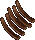
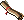
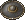
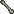
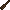

# Archaeology System

Uncover lost artifacts and treasures from Britannia's forgotten past through the Archaeology system.

Decode clues that drop throughout the world, locate dig sites hidden in the coordinates embedded in the clue text, and excavate using three specialized tools to reveal what lies beneath.

## Template

These are the core skills:

- Inscription - required for decoding, can be used from another character
- Cartography - required for decoding and +10% artifact chance at 100
- Mining - required for stage 1 success, 90+ for stage 2
- Item Identification - required for stage 3 success, +10% artifact chance at 100

This is a suggested template:

- Magery
- Meditation
- Cartography
- Lockpicking
- Mining
- Item identification
- Inscription / Hiding / Resisting spells

That can also work for [Mining](../skills/resource-gathering/mining.md) and [Treasure Hunting](../game-mechanics/treasure-hunting.md).

## Clues

Clues randomly drop from monsters.

They come in five types, the only difference between them is the deciphering skill required

Double click a clue in your backpack to attempt to decipher it. Failure doesn't consume the clue, try again when your skill improves.

Once decoded, opening the clue will reveal the coordinates

| Clue Type               | Decoded With | Skill |
|-------------------------|--------------|-------|
| A torn map fragment     | Cartography  | 70+   |
| A faded expedition note | Inscription  | 70+   |
| A partial journal page  | Inscription  | 70+   |
| A dusty book page       | Inscription  | 70+   |
| An old digging permit   | Inscription  | 70+   |

## Archaeology Tools

A bag of Archaeology Tools can be purchased from Provisioner NPCs for 8.000 gp.

Inside you'll find:

- Archaeologist's Sturdy Shovel - Stage 1 tool (200 uses)
- Archaeologist's Pick Hammer - Stage 2 tool (200 uses)
- Archaeologist's Soft Brush - Stage 3 tool (200 uses)

Each tool has 200 uses and breaks permanently when they run out.

## Finding the Dig Site

The coordinates in the clue text are the exact X, Y location. Use a map, landmarks, or rune travel to find the spot.

You must be within 1 tile of the precise coordinate before your tool will work.

## Excavation Process

All three tools must be used in order. Each use consumes one charge from the tool. If the tool breaks mid-excavation, replace it with another before continuing.

### Stage 1: Shovel

Double-click the Shovel, then target the clue in your backpack while standing within 1 tile of the dig site.

- Skill check: Mining 80 – 100
- On success: `"You carefully excavate the area."` - clue advances to Stage 2
- On failure: `"You fail to make any progress."` - try again

### Stage 2: Pick Hammer

Use the Pick Hammer the same way.

- Skill check: Mining 90 – 100
- On success: `"You clear away the debris."` - clue advances to Stage 3
- On failure: `"You fail to make any progress."` - try again

### Stage 3: Brush

Use the Brush the same way.

- Skill check: Item Identification 80 – 100
- On success: a find chance roll determines whether an artifact is discovered
- The clue is consumed at this stage regardless of outcome

## Artifact Find Chance

Clue quality is a hidden stat (1 - 100) assigned randomly when the clue is created. You have no way to influence it.

With fully capped skills (100 Mining, 100 Cartography, 100 Item ID) and a perfect quality clue (100), your chance is: `10% + 30% + 20% + 10% + 10% = 70%`

With lower skill, typical find rates will be closer to 10 – 40%.

## Artifacts

|                                         Artifact                                          |                  Found at                  |
|:-----------------------------------------------------------------------------------------:|:------------------------------------------:|
|        Ancient Armor Fragment       |                  Trinsic                   |
|         Ancient Crafting Mold        |                 New Minoc                  |
|           Ancient Mining Pick          |                 New Minoc                  |
|             Ancient Parchment            |                  Moonglow                  |
|               Ancient Sextant              |                  Moonglow                  |
|           Ancient Shield Boss          |                  Trinsic                   |
|       Ancient Silver Necklace      |                  Britain                   |
|         Ancient Smithing Tong        |                 New Minoc                  |
|           Ancient Weapon Hilt          |                  Trinsic                   |
|        Ancient Writing Stylus       |                  Britain                   |
|               Astrolabe Piece              |                  Moonglow                  |
|                Bent Horseshoe               |                  Trinsic                   |
|                 Bone Fragment                | Britain, Moonglow, New Minoc, Trinsic, Yew |
|                 Broken Bottle                | Britain, Moonglow, New Minoc, Trinsic, Yew |
|                Broken Pottery               |         Britain, Moonglow, Trinsic         |
|              Ceremonial Staff             |                  Britain                   |
|                  Charred Wood                 | Britain, Moonglow, New Minoc, Trinsic, Yew |
|              Commander's Seal              |                  Trinsic                   |
|  Deteriorated Cloth Fragments |         Britain, Moonglow, Trinsic         |
|         Handful Of Bent Nails        |                 New Minoc                  |
|          Mysterious Runestone         |                  Moonglow                  |
|              Old Copper Coins             |     Britain, Moonglow, New Minoc, Yew      |
|                Royal Wax Seal               |                  Britain                   |
|                   Rusted Fork                  |             Britain, Moonglow              |
|              Soldier's Buckle              |                  Trinsic                   |
|              Soot‑Stained Mug             |                 New Minoc                  |
|     Tarnished Silver Utensils    |                  Britain                   |
|                Tattered Cloth               | Britain, Moonglow, New Minoc, Trinsic, Yew |

## Related Systems

- [Achievements](achievements.md) - Track your archaeological discoveries
- [Currencies](../game-mechanics/currencies.md) - Potential future archaeology currency
