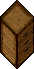

# Beekeeping

Apiculture is the science (and some say art) of raising honey bees. Bees live together in groups called colonies and make their homes in beehives. Tending a hive is rewarding but takes a steady hand.

All you need to start is a beehive deed and an open area with plenty of flowers and water nearby.

- **Stages:** Hives grow through Colonizing → Brooding → Producing.
- **Health:** Overall health ranges from Dying to Thriving.
- **Resources:** Water and flowers within range feed the hive.
- **Treatments:** Pour potions into the hive to combat pests, illness, or fatigue.
- **Harvest:** Once Producing, collect honey (bottles) and beeswax with a hive tool.

Hives perform a growth check once per day at world save. Watch the Last Tending indicator in the top-right of the control panel to see how the most recent check went.

!!! tip
    A single hive can support up to 100,000 bees. Healthy hives can live indefinitely, but older hives are more prone to disease.

## Getting started

You can find the Beekeeper NPC in Occlo at these coordinates 3694, 2544.

Single-click the NPC to find the [Reward Store](../game-mechanics/currencies.md#apiary-marks-store) or get a [Honey Order](#honey-orders).

From the vendor you can buy:

|                                 Item                                  |               Use               |
|:---------------------------------------------------------------------:|:-------------------------------:|
|        Beehive Deed       |     Where the magic begins      |
|           Hive Tool          |   To harvester Honey and Wax    |
|  Wax Processing Pot | Process Raw Wax into usable Wax |
|    Wax Crafting Pot   |    Tool for crafting candles    |
|        Common Honey       |                -                |

Once the Beehive is placed, you can only move it once every 48 hours.

Axing the Beehive will destroy it and you will lose the deed.

Double-click the Beehive to access the gump and get started.

## Stages

Every beehive grows through five internal stages, grouped into three named phases visible on the control panel.

### Colonizing (Stages 1 - 2)

Newly placed hives begin here. Scouts survey the surrounding terrain for water and flowers. No honey or wax is produced yet, but the colony is establishing itself.

### Brooding (Stages 3 - 4)

Egg-laying ramps up as the colony prepares for full production. Population increases steadily if conditions are good.

### Producing (Stage 5)

The hive has matured. Excess honey and beeswax are now generated each growth check. A thriving colony produces these at an increased rate.

If conditions get bad enough - illness, infestation, or prolonged shortages - the colony may abscond, leaving an empty hive behind. Redeem an empty hive with an axe.

## Health

A hive's wellbeing is measured by two values: Overall Health and Population.

### Overall Health

**Thriving:** Extremely healthy. Honey and wax are produced at an increased rate.

**Healthy:** Producing normally with surplus honey and wax.

**Sickly:** Producing has stalled. Apply treatments and check resources.

**Dying:** Act quickly - population will start dropping if not stabilized.

### Population

Population is a rough count of bees in the hive. More is not always better. Larger hives consume more water and flowers, and the area they forage from grows with their size - so resources must scale with them.

If a hive runs out of resources for too long, bees will die off or the entire colony may abandon the hive. Keep an eye on the Resources tab.

## Resources

Bees need both water and flowers within their foraging range. The control panel shows the status of each as a coloured label plus the source count.

### Water
  
Place filled water barrels or tubs near the hive. Each one counts as a source while it holds water; hives gradually drain them. Note that too much water can breed bacteria, making the hive more susceptible to disease.

### Flowers

Flowers are used for food, building, and almost every hive function. An overabundance of flowers brings more parasites and insects with them.

- Flowers must be in non-decorative mode
- Flowers that are around beehives will see a slight boost in resistance to parasites and health
- Certain flowers slightly increase the chances that the harvested honey will be of a rarer quality

The following flowers make the bees happy:

|                                                                     |                                                                  |                                                                    |                                                      |                                                         |
|:-------------------------------------------------------------------:|:----------------------------------------------------------------:|:------------------------------------------------------------------:|:----------------------------------------------------:|:-------------------------------------------------------:|
|   Hops Plant (East)  |  Campion Flowers |  Foxglove Flowers |     Lilies    |     Cattails    |
|  Hops Plant (South) |          Poppies         |   Orfluer Flowers  |  Snowdrops |  Water Lilly |

For more information about flowers visit the [Gardening](../game-mechanics/gardening.md) page.

### Foraging Range  

Base range: 2 tiles plus 1 per population level.

Agility boost:  Greater Agility potions extend range by 1 per dose for the growth check.

### Reading the Status

**Adequate / Plentiful:** Resources are well-matched to the colony's size.

**Low / Very Low:** Add more sources or the hive will stop growing.

**Excessive / Overflowing:** Too much. Remove some sources to lower disease and pest risk.

## Treatments

Pour potions from your backpack into the hive using the Potion Treatments panel. Each potion type holds up to 2 doses at a time; the doses are consumed at the next growth check.

-  **Greater Agility:** Boosts honey and wax output and extends foraging range. Bees work harder for one growth cycle.
-  **Greater Poison / Deadly Poison:** Kills parasitic mites and wax moths. Excess poison harms the bees - use only when infestation is present.
-  **Greater Cure:** Cures foul brood, dysentery, and other diseases. Also neutralizes lingering poison in the hive.
-  **Greater Heal:** Restores hive health, but only if the hive has no active parasites or disease. Cure those first.
-  **Greater Strength:** Builds up immunity, reducing the chance of future infestations and illness.

Lesser and standard potions are too weak - only Greater (and Deadly Poison) varieties have any effect.

## Indicators

The Last Tending pill in the top-right of the control panel summarizes what happened at the most recent growth check.

- **▲ Population grew:** A new bee population level was reached.
- **▲ Hive matured:** The hive advanced a stage or produced honey/wax this cycle.
- **▼ Population fell:** The colony lost bees - usually from illness, pests, or shortage.
- **! Too sickly to grow:** Overall health is below Healthy; fix that before it can grow.
- **! Resources too low:** Water or flowers were insufficient at the last check.
- **– No change yet:** The hive hasn't had a growth check since being placed.

Growth checks happen during the daily world save. If you make changes after the check, you'll see the results at the next save.

## Honey

Once a hive reaches the Producing stage, use the Harvest button on the control panel. A hive tool and empty bottles are required - each harvester uses a charge.

Once you have the Honey, use [Taste Identification](../skills/utility-and-support/taste-identification.md) to identify the type. You have three attempts, if you fail all three the Honey will default to the most common type.

[Item Identification](../skills/utility-and-support/item-identification.md) adds a 5% success rate boost when using Taste ID.

Honey is used in [Cooking](../skills/crafting/cooking.md) and [Honey Orders](#honey-orders).

## Wax

Beeswax straight from the hive is full of impurities and difficult to work with. The process of cleaning it is called rendering.

Wax is used to [craft candles](#wax-crafting-list).

### Step 1: Scrape the Hive

Once a hive reaches the Producing stage, use the Harvest button on the control panel. A hive tool is required - each scrape uses a charge.

### Step 2: Render in a Wax Pot

Place the raw beeswax into a small wax pot, then set the pot on a heat source. The wax melts and the impurities - called slumgum - separate out.

### Step 3: Form Pure Beeswax

With the slumgum removed, the rendered wax can be poured into ingots or moulds, ready for crafting candles, polish, seals, or anything else a clever artisan needs.

!!! Tip
    Rendering takes time over the heat. Make sure you have a steady fire and don't wander too far from the pot.

## Honey orders

To get a Honey Order, single‑click the Beekeeper NPC in Occlo at coordinates 3694, 2544

You can get one order every 24 hours per account.

Unlike BODs, the timer doesn't reset when you turn an order in.

Completing orders will award Apiary Marks that can be exchanged for [rewards](../game-mechanics/currencies.md#apiary-marks-store).

|                       Order Tiers                        |                                                              |                                                      |                                                                    |
|:--------------------------------------------------------:|:------------------------------------------------------------:|:----------------------------------------------------:|:------------------------------------------------------------------:|
|  Simple |  Standard |  Rare |  Exceptional |

|                                Honey Type                                 | Points |
|:-------------------------------------------------------------------------:|:------:|
|          Clover Honey         |   1    |
|      Wildflower Honey     |   2    |
|       Buckwheat Honey      |   3    |
|  Orange Blossom Honey |   3    |
|        Lavender Honey       |   6    |
|         Heather Honey        |   8    |
|        Sourwood Honey       |   15   |
|          Tupelo Honey         |   25   |

## Wax Crafting list

This table shows what you can craft using the Wax Crafting Pot.

The skill required for crafting is Taste Identification.

The hue of colored candles is random.

=== "Resources"

    |                           Item                            |    Resources     | Skill |
    |:---------------------------------------------------------:|:----------------:|:-----:|
    |   Candle Wick  | 1 Wax 1 Cloth | 50.0  |
    |  Blank Candle |      2 Wax       | 50.0  |

=== "Candles"

    |                                   Item                                    |                           Resources                            | Skill |
    |:-------------------------------------------------------------------------:|:--------------------------------------------------------------:|:-----:|
    |          Small Candle         |                1 Blank Candle 1 Candle Wick                 | 80.0  |
    |  Small Colored Candle |           1 Blank Candle 1 Dyes 1 Candle Wick            | 80.0  |
    |          Large Candle         |                1 Blank Candle 1 Candle Wick                 | 80.0  |
    |  Large Colored Candle |           1 Blank Candle 1 Dyes 1 Candle Wick            | 80.0  |
    |          Skull Candle         |     1 Blank Candle 1 Candle Wick 1 Candle Fit Skull      | 80.0  |
    |        Candle of Love       | 1 Blank Candle 1 Dyes 1 Candle Wick 1 Essence Of Love | 80.0  |

=== "Decorative"

    |                                    Item                                     |    Resources    | Skill |
    |:---------------------------------------------------------------------------:|:---------------:|:-----:|
    |          Dipping Stick         | 3 Blank Candle  | 75.0  |
    |  Pile of Blank Candles | 5 Blank Candle  | 75.0  |
    |     Some Blank Candles    | 3 Blank Candle  | 75.0  |
    |           Raw Wax Bust          |      4 Wax      | 85.0  |
    |     Pot of Molten Gold    | 30 Blank Candle | 75.0  |

## Related pages

- [Taste Identification](../skills/utility-and-support/taste-identification.md)
- [Item Identification](../skills/utility-and-support/item-identification.md)
- [Cooking](../skills/crafting/cooking.md)
- [Apiary Marks Store](../game-mechanics/currencies.md#apiary-marks-store)
