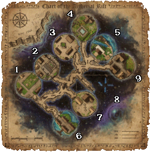

# Codex Rifts

In the decades following the Codex War, scholars studied the magical artifacts recovered from the fallen forces. Among their discoveries were strange, otherworldly creatures they called rift spawns - entities capable of tearing openings between realms and moments in time.

When these rift spawns are defeated, there is a chance a rift gate forms at the site of their death. These gates shimmer with fractured magic and open windows back to Britannia during the early dark days of the Codex War. Travelers who step through find themselves fighting in those battles - armies still clash, towns still burn, and Rift Masters command the assault from within.

## Rift spawns

Rift Spawns are stronger, enhanced versions of normal monsters that can appear in their place.

The higher the creature's fame, the greater the chance it will spawn as a Rift Spawn.

## Rift gate

Defeating a Rift Spawn may open a Rift Gate, giving players access to the Rift, which is a shared instance with other players.

- Gate spawn chance: 1% (lowest fame creatures) scaling up to 50% (fame 32.000)
- Only players within 16 tiles of the kill are added to the allowed list and can enter
- The gate closes automatically after 45 seconds

## Inside the rift

??? note "Click to expand: Rift map legend"

    1. Gargoyle Raid
    2. Orc Assault
    3. Secret Garden
    4. Undead Siege
    5. Skeletal Dragon
    6. Pirate Raid
    7. Daemon Incursion
    8. Bank
    9. Undead Warlord Horde

Inside the rift the same felucca rules apply, pvp is enabled.

You will find 8 Champion areas and one guarded zone with a bank, stable and some vendors.

You have sixty minutes at your disposal, after which you will be teleported out to the Dawn Event Center.

The rift map gump shows the timer, and it also highlights active champs with a green dot.

## Rift Shards

Rift Shards are a currency earned inside the Rift, they can be exchanged for [rewards](../game-mechanics/currencies.md#rift-shards-store) at the [Dawn Event Center](../game-mechanics/currencies.md#dawn-event-center).

Any monster in the Rift has a small chance to award Rift Shards, while bosses will always award them as long as you contributed enough damage.

## Codex fragments

Codex fragments are used to craft [Codex Bindings](../skills/crafting/alchemy.md#codex-binding), which are then used to bless Runebooks.

Any monster in the Rift has a small chance of dropping them.

When they drop, you'll hear a glass breaking sound effect, followed by the system message `You hear the faint sound of a shard`.

!!! warning "Fragment drop"
    When they drop, they will not be placed in your backpack. You need to loot them from corpses.

## Champions

At any moment, up to 3 of the 8 rift locations are active simultaneously. After a rift is completed (boss defeated), there is a 5–10 minute delay before a new rift location can activate. The system checks every 30 seconds to activate a random inactive location when fewer than 3 are running.

Each active rift progresses through a series of waves, you must kill all required creatures in a wave to advance to the next. After 3 waves the Rift Master boss spawns.

### Gargoyle Raid · Moonglow

| Wave | Creatures to Kill     |
|------|-----------------------|
| 1    | 40 Gargoyles          |
| 2    | 10 Gargoyle Enforcers |
| 3    | 5 Gargoyle Destroyers |
| Boss | Gargoyle Warlord      |

### Orc Assault · Britain

| Wave | Creatures to Kill               |
|------|---------------------------------|
| 1    | 20 Orcs · 20 Ogres              |
| 2    | 10 Orc Brutes · 10 Orcish Mages |
| 3    | 8 Orc Captains                  |
| Boss | Orc Captain (random orc name)   |

### Secret Garden · Minoc

| Wave | Creatures to Kill   |
|------|---------------------|
| 1    | 20 Pixies           |
| 2    | 15 Wisps            |
| 3    | 10 Dark Wisps       |
| Boss | Pixie (Rift Master) |

### Undead Siege · Yew

| Wave | Creatures to Kill                      |
|------|----------------------------------------|
| 1    | 30 Skeletons · 20 Zombies · 5 Spectres |
| 2    | 10 Skeletal Knights · 10 Bone Knights  |
| 3    | 8 Skeletal Mages · 5 Wailing Banshees  |
| Boss | Ancient Lich                           |

### Skeletal Dragon · Trinsic

| Wave | Creatures to Kill                                  |
|------|----------------------------------------------------|
| 1    | 20 Skeletons                                       |
| 2    | 5 Bone Knights · 5 Skeletal Knights                |
| 3    | 5 Bone Magi · 2 Skeletal Mages · 2 Skeletal Liches |
| Boss | Skeletal Dragon                                    |

### Pirate Raid · Vesper

| Wave | Creatures to Kill                       |
|------|-----------------------------------------|
| 1    | 15 Pirate Skeletons · 15 Pirate Zombies |
| 2    | 8 Pirate Wraiths · 8 Pirate Mummies     |
| 3    | 5 Skeletal Mages                        |
| Boss | Admiral Dread                           |

### Daemon Incursion · Jhelom

| Wave | Creatures to Kill     |
|------|-----------------------|
| 1    | 20 Mongbats · 20 Imps |
| 2    | 10 Daemons            |
| 3    | 5 Pit Fiends          |
| Boss | Devourer of Souls     |

### Undead Warlord Horde · Skara Brae

| Wave | Creatures to Kill                        |
|------|------------------------------------------|
| 1    | 20 Skeletons · 20 Zombies                |
| 2    | 10 Skeletal Knights · 8 Wailing Banshees |
| 3    | 5 Rotting Corpses · 3 Skeletal Liches    |
| Boss | Undead Warlord                           |

## Related pages

- [Rift Shards Store](../game-mechanics/currencies.md#rift-shards-store)
- [Dungeon of the Week](dotw.md)
