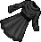

# Dungeon Dyes

Every dungeon in Britannia leaves its mark on those who spend enough time within its depths.

Monsters slain inside a dungeon have a rare chance to drop a Dungeon Dye Material.

Collect 100 of a material, load it into a Tailor Dye Kit, and you can craft a dye bottle that permanently colors clothing in that dungeon signature hue.

A Tailoring Guidebook can be found in the world that documents all nine materials, their origins, and the dyes produced from them.

## Dye Material

This table shows which dungeon drops each Dye Material.

| Dungeon  |   Dye Material    |      Dye Name      |                            Hue Preview                             |
|:--------:|:-----------------:|:------------------:|:------------------------------------------------------------------:|
| Covetous |   Shimmerstone    |     Aurum Gold     | [ 2132](../hues/hue.md?id=2132) |
|  Deceit  |  Illusion Shard   |    Phantom Gray    | [ 2165](../hues/hue.md?id=2165) |
| Despise  |    Thorny Vine    |     Envy Green     | [ 2163](../hues/hue.md?id=2163) |
| Destard  | Dragon Blood Opal | Dragon's Scale Red | [ 2139](../hues/hue.md?id=2139) |
|   Fire   |    Cinderstone    |   Inferno Orange   | [ 2470](../hues/hue.md?id=2470) |
| Hythloth |   Shadow Stone    |   Abyssal Black    | [ 2724](../hues/hue.md?id=2724) |
|   Ice    |  Glacial Shards   |    Glacial Blue    | [ 2579](../hues/hue.md?id=2579) |
|  Shame   | Crystal of Regret |   Forlorn Violet   | [ 2149](../hues/hue.md?id=2149) |
|  Wrong   |  Ironweight Ore   |   Judgment Blue    | [ 2154](../hues/hue.md?id=2154) |

Click any hue ID to preview the color on the [Hues](../hues/index.md) page.

## Tailor Dye Kit

The Tailor Dye Kit is used with Dungeon Dye Materials to craft dyes.

To purchase one, you must first join the Tailor guild. You can join by using the command `[NPC name] join` and paying a fee of 5.000 gold to a Grandmaster Tailor NPC.

Once you're a member, you can obtain the Tailor Dye Kit by giving 10.000 gold to a Grandmaster Tailor NPC.

## Craft a Dye Bottle

Double-click the Tailor Dye Kit and target a stack of dungeon materials to pour them in. The kit tracks each material type independently.

You will need 100 Dye Materials loaded into the kit and an empty bottle in your backpack.

Single-click the Tailor Dye Kit Kit to open the crafting menu. On success, a Tailor Dye Bottle is created and placed in your backpack. The bottle shows the crafting player name and the hue ID when single-clicked.

## Item Descriptions

The Tailoring Guidebook describes each material:

**Covetous - Shimmerstone**

> A luminescent gem that radiates with a golden shine, said to be the solidified essence of greed. A tailor can refine this stone into a fine powder to create Aurum Gold Dye.

**Deceit - Illusion Shard**

> A fragment of crystal that distorts light, making the holder's outline appear blurred. Ground into a reflective dust for the crafting of Phantom Gray Dye.

**Despise - Thorn of Envy**

> A thorny vine with a natural, glowing green sap that pulses with a life of its own. The sap can be extracted and concentrated by a tailor to produce Envy Green Dye.

**Destard - Dragon's Blood Opal**

> A rare opal that bears the appearance of being stained with dragon's blood. Crushed into a fine pigment for Dragon's Scale Red Dye.

**Hythloth - Shadow Stone**

> A stone that seems to absorb light, making it appear darker than darkness itself. Its core can be used to infuse cloth with Abyssal Black Dye.

**Shame - Crystal of Regret**

> A purplish crystal that dims and brightens. Pulverized into a dust that creates Forlorn Violet Dye.

**Wrong - Ironweight Ore**

> A heavy, cold iron scale weight that once may have been used for measuring fines or punishments. Melted down and blended with special solutions to yield Judgment Blue Dye.

**Fire - Cinderstone**

> A volcanic rock warm to the touch, containing the fury of a dungeon's inferno. Ground Cinderstone is the primary ingredient for Inferno Orange Dye.

**Ice - Glacial Shards**

> The heart of a glacier - an icy fragment that never melts, perpetually radiating cold. Shavings from the core are perfect for creating Glacial Blue Dye.

## Related pages

- [Hues](../hues/index.md)
- [Dungeon of the Week](dotw.md)
