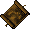

# Pirate Adventures

Venture into four distinct instanced pirate encounters, a hidden cove hideaway, a crumbling lighthouse, a sunken treasure cave, and an ancient pirate tomb.

Each instance is unlocked by activating a deteriorating pirate map. Clear the pirates, defeat the boss, and claim the locked reward chest.

## Pirate Maps

Pirate maps are dropped by Ancient Sea Serpents or found in Strongboxes dropped by Enraged Krakens.

While Fishing, you can only pull up two Ancient Sea Serpents a day for each account, after that limit you get a rare decoration item instead.

Visit the [Fishing](../skills/resource-gathering/fishing.md) page for more information.

### Restoring the Map

|               Deteriorating Map               |
|:---------------------------------------------:|
|  |

To restore a map, you need 90 Cartography and a Vinegar bottle, which drops from Brigands at Brigand Camps.

Use the Vinegar bottle on the map, it will change color revealing which one of the four instances will be used.

Once restored, the map is ready to be activated and is consumed on use.

## The instance

Double click the restored map and choose the difficulty. A colored gate appears at your location, and you have one minute for you and your party to enter.

You will have 60 or 90 minutes to complete the instance, depending on the type of instance.

Throughout the map, you can find clocks matching the instance color, clicking them shows the remaining time and the number of pirates left.

Once inside, clear all the pirates, some may hide.

When every pirate is defeated, the instance boss spawns.

Defeating the boss awards Doubloons to all players who dealt damage. A reward chest also appears, and the player who activated the map receives its key.

You then have five minutes to loot before being teleported out.

### Difficulty

The Multiplier boosts mob difficulty and improves the reward chest loot.

| Difficulty  | Multiplier |
|-------------|------------|
| Greenhorn   | 1.00x      |
| Deckhand    | 1.04x      |
| Swabbie     | 1.08x      |
| Corsair     | 1.12x      |
| Buccaneer   | 1.16x      |
| Freebooter  | 1.20x      |
| Privateer   | 1.24x      |
| Marauder    | 1.28x      |
| Dreadnought | 1.32x      |
| Davy Jones  | 1.26x      |

### Doubloons

Each instance rewards 10 Doubloons and a player can earn a maximum of 5.

There is also a chance of a bonus Doubloon being rewarded sometimes.

### Reward chest

The final reward chest always contains:

- Random treasure maps
- Magic Weapons and Armors
- Gems
- Reagents

And it has a rare chance of containing:

- Metal chest matching the instance color
- Silver slayer weapon

|                   Metal chest                    |       Instance       |
|:------------------------------------------------:|:--------------------:|
|     |   Pirate Hideaway    |
|    |  Pirate Lighthouse   |
|   | Pirate Treasure Cave |
|  |     Pirate Tomb      |

### Rares

Each instance has a rare chance of placing a random rare decoration item around the map.

!!! warning
    Table of rares under construction.

## The Four Instances

There are four distinct pirate instances. Each has its own environment, enemy roster, boss, duration, and rare items.

### Pirate Hideaway

|                   Red Map                   |
|:-------------------------------------------:|
|  |

**Gate color:** Red · **Duration:** 60 minutes

A secluded cove filled with a full pirate crew - bards, bartenders, cooks, deckhands, navigators, quartermasters, lookouts, captains, bodyguards, and cannoneers operating ship cannons.

**Boss: Captain Dreadstorm** (the Relentless)

- Melee fighter with a Vanquishing Cutlass
- Whirlwind and Shadow Strike special abilities
- When first damaged, immediately summons **4 Pirate Bodyguards**
- High Strength, solid armor rating

### Pirate Lighthouse

|                   Blue Map                   |
|:--------------------------------------------:|
|  |

**Gate color:** Blue · **Duration:** 60 minutes

A decrepit, crumbling lighthouse overrun by pirates and strange sea creatures.

**Boss: Ancient Drowner**

- Mage-type boss
- Periodic **AoE water attack** that requires line of sight
- Periodically **summons Drowners** from fixed spawn points

### Pirate Treasure Cave

|                   Green Map                   |
|:---------------------------------------------:|
|  |

**Gate color:** Green · **Duration:** 90 minutes

A wrecked ship leading into a hidden cave guarded by the spirit of a shipwrecked captain.

**Boss: Captain Grimjaw** (the Eternally Greedy)

- Melee fighter with a Vanquishing Cutlass and mana pool
- **Poison Gas** special ability on cooldown
- When first damaged, immediately summons **4 Pirate Bodyguards**
- Heaviest HP pool of all bosses (900–1,100 hits)

### Pirate Tomb

|                   Purple Map                    |
|:----------------------------------------------:|
|  |

**Gate color:** Purple · **Duration:** 90 minutes

An ancient tomb where cursed undead pirates guard plundered riches. Features a unique roster of undead enemies:

- **Arcane Corsair** – spell casting undead pirate
- **Bonebound Brigand** – heavy undead melee fighter
- **Phantom Raider** – ghostly attacker
- **Pirate Mummy** – wrapped undead fighter
- **Pirate Wraith** – wraith variant

**Boss: Ancient Pirate Mummy**

- Periodically launches a **sand area attack** that paralyzes nearby players
- Periodically **spawns additional undead pirates** from fixed spawn points
- Transforms during combat

## Enemy Types

### Hideaway Pirates

| Mob                  | Role                                              |
|----------------------|---------------------------------------------------|
| Pirate Bard          | Support/distraction                               |
| Pirate Bartender     | Melee                                             |
| Pirate Bodyguard     | Heavy melee (also summoned by Captain Dreadstorm) |
| Pirate Cannon        | Environmental hazard                              |
| Pirate Cannoneer     | Operates cannons, ranged attacks                  |
| Pirate Captain       | Elite melee commander                             |
| Pirate Cook          | Melee                                             |
| Pirate Deckhand      | Light melee                                       |
| Pirate Lookout       | Scout type, can hide and stealth                  |
| Pirate Navigator     | Melee                                             |
| Pirate Quartermaster | Melee                                             |

### General Pirate Types (across instances)

| Mob                 | Notes                |
|---------------------|----------------------|
| Pirate              | Standard melee       |
| Pirate Sailor       | Standard melee       |
| Pirate Skeleton     | Undead melee         |
| Pirate Zombie       | Undead melee         |
| Scurvy Surgeon      | Utility/healer type  |
| Venomweb Privateer  | Ranged/poison        |
| Nightmare Arachnid  | Large spider variant |
| Ancient Sea Serpent | Sea creature         |
| Ancient Kraken      | Large sea creature   |

## Related Systems

- [Currencies](../game-mechanics/currencies.md) - Pirate doubloons and rewards
- [Achievements](achievements.md) - Pirate-related achievements
