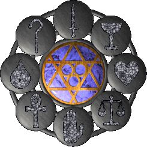

# Virtues

Virtues are special powers you unlock by performing specific actions in the world.

You can open the Virtue menu by clicking the icon at the top of your paperdoll. From there, you can track your progress in each Virtue and activate the abilities you've earned.

All Virtues levels slowly decay over time, so you'll need to maintain them regularly.

## Compassion

Compassion gives you a passive bonus when resurrecting other players, instead of coming back with just 1 HP, they revive with more health based on your Compassion level.

1. **Seeker of Compassion** - 20% of their health restored.
2. **Follower of Compassion** - 40% of their health restored.
3. **Knight of Compassion** - 80% of their health restored.

### Gaining Compassion

You gain Compassion by completing Escort missions. You can earn Compassion from up to five escorts every 24 hours, after that, additional escorts won't increase your Compassion any further.

## Sacrifice

Sacrifice lets you resurrect yourself with all the items you had when you died, as long as they weren't looted.

At the highest level you can resurrect yourself 3 times a week.

You lose a small amount of Sacrifice level each week.

1. **Seeker of Sacrifice** - reached at 30.000 Fame, one self resurrection a week.
2. **Follower of Sacrifice** - reached at 60.000 Fame, two self resurrection a week.
3. **Knight of Sacrifice** - reached at 90.000 Fame, three self resurrection a week.

### Gaining Sacrifice

You gain by Sacrificing your Fame, which can only be done once every 24 hours.

Click the Sacrifice icon in the Virtues menu and then target a monster, your fame will reset to zero and the monster will vanish.

You can only sacrifice your Fame to Daemons, Evil Mages, Liches, and Succubi.

## Valor

Valor allows you to activate Champion Spawns. Once you reach Knight of Valor, you can activate the Virtue and target a Champion altar to begin the spawn.

### Gaining Valor

Valor is gained by killing Champion Spawn monsters.
