# Currencies & Rewards

New Dawn features multiple currency systems that allow players to earn rewards through various activities. These currencies can be spent at reward vendors for aesthetic rewards.

Currencies apply only to the account of the character who earned them, not to all three accounts.

## Dawn Event Center

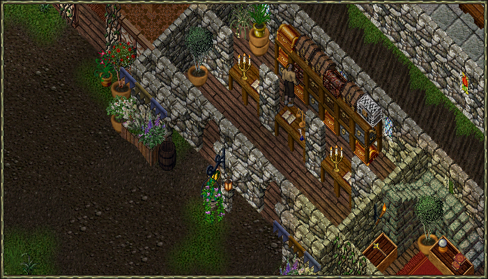{ .center-img }

The Dawn Event Center can be accessed by using any public moongate and selecting the upper right option.

Inside, you'll find all the NPCs who handle currency exchanges and showcase the available rewards.

You can also find the area where to sign up for Duels, CTF, and Conquest.

## Rift Shards

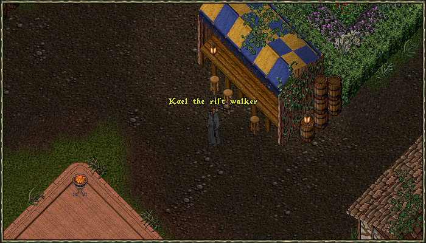{ .center-img }

Rift Shards are a currency earned through Codex Rift activities.

Rift Spawns are enhanced versions of normal monsters that can appear in place of regular creatures.

Defeating one may open a Rift Gate, giving players access to the Rift, which is a shared instance with other players.

Once inside, you have sixty minutes to fight through champion spawns and their bosses. Any monster in the Rift has a small chance to award Rift Shards, while bosses will always award them as long as you contributed enough damage.

Each champion spawn progresses through three tiers, and completing all three will summon the boss.

For more information visit the [Codex Rift](../custom-systems/codex-rifts.md) page.

## Doubloons

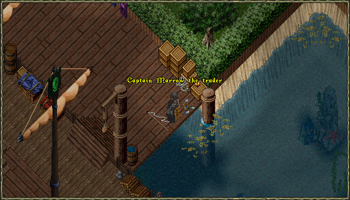{ .center-img }

Doubloons are a currency earned by completing Pirate Adventures.

To begin one, players must first obtain a pirate map, which can drop from Ancient Sea Serpents or appear inside Strongboxes recovered from Enraged Krakens.

Once a map is found, it must be cleaned with a Bottle of Vinegar by a Cartographer before it becomes usable.

After the map is restored, double‑clicking it will open a gate that leads directly into the adventure instance. Inside, players have sixty minutes to clear the map and defeat its boss.

Defeating the boss will award Doubloons.

For more information visit the [Pirate Adventures](../custom-systems/pirate-adventures.md) page.

## Champion Tokens

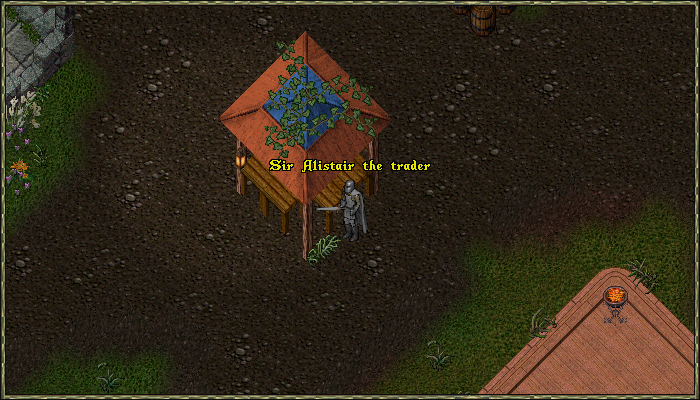{ .center-img }

Champion Tokens are a currency earned by defeating Champion bosses.

Champion altars can be found inside specific dungeons, and approaching one has a chance to activate it. if it doesn’t, players can use the Valor virtue to force activation.

Once the altar is active, the first wave of monsters begins. Each champion spawn progresses through four tiers, and clearing all four will summon the champion boss.

Defeating the boss will award Champion Tokens.

## Harrower Tokens

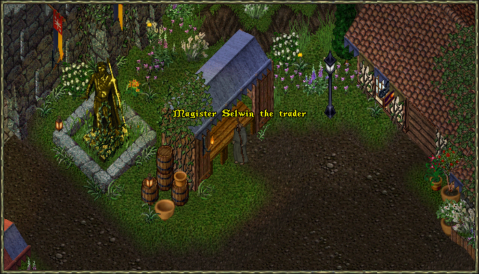{ .center-img }

Harrower Tokens are a currency earned by defeating Harrowers.

The Harrower can only be summoned after all six champion bosses have been defeated and their skulls collected.

Once the skulls are gathered, they must be placed on their altar on Temple Island.

Doing so opens a gate that reveals the Harrower's location deep within a dungeon, allowing players to enter and face the final encounter.

Defeating the Harrower will award the tokens.

## War Tokens

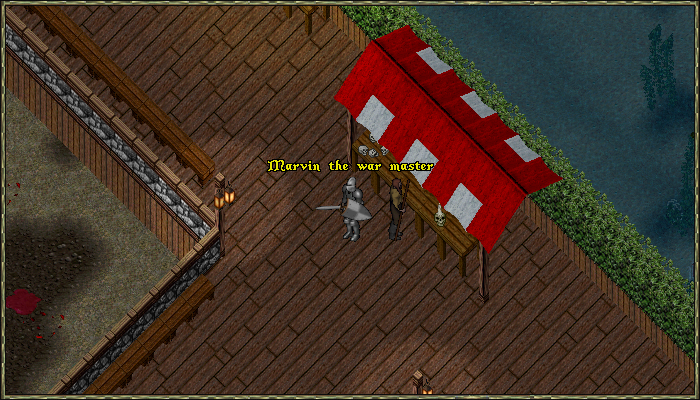{ .center-img }

War Tokens are a currency earned by participating in the CTF and Conquest PvP systems.

Players can sign up for either activity inside the Dawn Event Center.

At the end of each match, every participant receives War Tokens based on their individual points, with the winning team earning a small bonus.

War Tokens also have a daily cap, limiting how many can be earned each day.

For more information visit the [Battlegrounds](../custom-systems/battlegrounds.md) page.

### War Tokens Shop

=== "Wearables"

    |                                           Wearables                                           |              Hue               |
    |:---------------------------------------------------------------------------------------------:|:------------------------------:|
    |  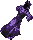 Shroud of the Fallen Standard  | [1560](../hues/hue.md?id=1560) |
    | 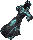 Shroud of the Drowned Standard | [1569](../hues/hue.md?id=1569) |
    |     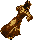 Shroud of the Gilded Siege     | [1562](../hues/hue.md?id=1562) |
    |     Hood of the Fallen Standard    | [1560](../hues/hue.md?id=1560) |
    |   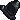 Hood of the Drowned Standard   | [1569](../hues/hue.md?id=1569) |
    |       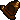 Hood of the Gilded Siege       | [1562](../hues/hue.md?id=1562) |
    |    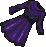 Robe of the Fallen Standard    | [1560](../hues/hue.md?id=1560) |
    |   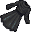 Robe of the Drowned Standard   | [1569](../hues/hue.md?id=1569) |
    |       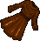 Robe of the Gilded Siege       | [1562](../hues/hue.md?id=1562) |

=== "Mounts"

    |                                         Mounts                                          |              Hue               |
    |:---------------------------------------------------------------------------------------:|:------------------------------:|
    | 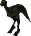 Ethereal Battlefront Ostard | [1674](../hues/hue.md?id=1674) |

=== "Lanterns"

    |                                     Lanterns                                      |              Hue               |
    |:---------------------------------------------------------------------------------:|:------------------------------:|
    |  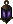 Fallen Standard Lantern  | [1560](../hues/hue.md?id=1560) |
    |     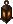 Gilded Siege Lantern     | [1562](../hues/hue.md?id=1562) |
    | 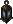 Drowned Standard Lantern | [1569](../hues/hue.md?id=1569) |

=== "Decorations"

    |                                   Decorations                                   |
    |:-------------------------------------------------------------------------------:|
    |    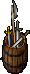 Large Keg of Weapons    |
    |    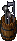 Small Keg of Weapons    |
    | 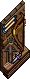 Mounted Archery Display |
    |  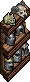 Mounted Helmet Display  |
    |   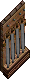 Mounted Sword Display   |
    |  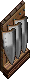 Mounted Shield Display  |
    |           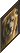 Lion Painting           |

=== "Misc"

    |                                  Misc                                   |              Hue               |
    |:-----------------------------------------------------------------------:|:------------------------------:|
    | 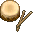 Battle Drum (usable) |               -                |
    | 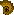 Battle Horn (usable) | [1126](../hues/hue.md?id=1126) |
