

# Gardening

The Gardening system lets you grow and cross-pollinate a wide variety of decorative plants. Seeds are planted in pots, cared for over several days, and bred with other plants to unlock new varieties and color combinations. All fully grown plants are purely decorative, they exist to beautify your home and nothing more.

## Seeds

Seeds come in different types and can be looted from monsters.

### Plain seeds

You can find normal, red, blue, and yellow seeds in monster loot.

If you have two different plants, you can cross‑pollinate them to create a new plant.

Secondary‑colored plants and bright variants can only be created through cross‑pollination.

There is also a chance to get a black or white mutation when cross‑pollinating two plants of different colors.

Jump to [cross‑pollination](#cross-pollination) to learn more.

=== "Primary colors"

    |                        Color                        | Hue  |                               Color                               | Hue  |
    |:---------------------------------------------------:|:----:|:-----------------------------------------------------------------:|:----:|
    |     Red    | 1643 |     Bright Red    | 2118 |
    |    Blue   | 1323 |    Bright Blue   | 2123 |
    |  Yellow | 1719 |  Bright Yellow | 2213 |

=== "Secondary colors"

    |                        Color                        | Hue  |                               Color                               | Hue  |
    |:---------------------------------------------------:|:----:|:-----------------------------------------------------------------:|:----:|
    |  Purple | 1243 |  Bright Purple | 2148 |
    |   Green  | 1434 |   Bright Green  | 2128 |
    |  Orange | 1507 |  Bright Orange | 1256 |

=== "Mutations"

    |                       Color                       | Hue  |
    |:-------------------------------------------------:|:----:|
    |  Black | 1107 |
    |  White | 1154 |

This table shows all 17 plant types and their color variants.

=== "Plain"

    |                         Plain Plants                         |                                                            |                                                                  |                                                                    |                                                                          |                                                |
    |:------------------------------------------------------------:|:----------------------------------------------------------:|:----------------------------------------------------------------:|:------------------------------------------------------------------:|:------------------------------------------------------------------------:|:----------------------------------------------:|
    | 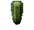 Barrel Cactus |    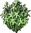 Bulrushes    | 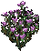 Campion Flowers |    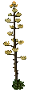 Century Plant    |  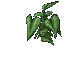 Elephant Ear Plant  |    Fern   |
    |        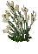 Lilies        | 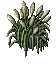 Pampas Grass |          Poppies         |    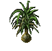 Ponytail Palm    | 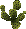 Prickly Pear Cactus | 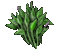 Rushes |
    |    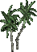 Small Palm    |  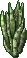 Snake Plant  |       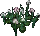 Snowdrops       |  Tribarrel Cactus |         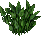 Water Plant         |                                                |

=== "Red"

    |                           Plain Plants                           |                                                                |                                                                      |                                                                        |                                                                              |                                                    |
    |:----------------------------------------------------------------:|:--------------------------------------------------------------:|:--------------------------------------------------------------------:|:----------------------------------------------------------------------:|:----------------------------------------------------------------------------:|:--------------------------------------------------:|
    | 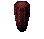 Barrel Cactus |     Bulrushes    | 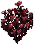 Campion Flowers |    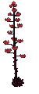 Century Plant    |  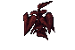 Elephant Ear Plant  |    Fern   |
    |         Lilies        | 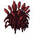 Pampas Grass |          Poppies         |    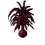 Ponytail Palm    | 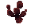 Prickly Pear Cactus | 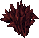 Rushes |
    |    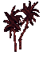 Small Palm    |   Snake Plant  |        Snowdrops       |  Tribarrel Cactus |         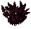 Water Plant         |                                                    |

=== "Bright Red"

    |                              Plain Plants                               |                                                                       |                                                                             |                                                                               |                                                                                     |                                                           |
    |:-----------------------------------------------------------------------:|:---------------------------------------------------------------------:|:---------------------------------------------------------------------------:|:-----------------------------------------------------------------------------:|:-----------------------------------------------------------------------------------:|:---------------------------------------------------------:|
    | 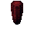 Barrel Cactus |     Bulrushes    | 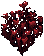 Campion Flowers |     Century Plant    |   Elephant Ear Plant  |    Fern   |
    |         Lilies        | 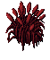 Pampas Grass |          Poppies         |    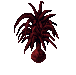 Ponytail Palm    | 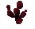 Prickly Pear Cactus | 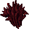 Rushes |
    |    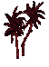 Small Palm    |  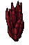 Snake Plant  |        Snowdrops       |  Tribarrel Cactus |          Water Plant         |                                                           |

=== "Blue"

    |                           Plain Plants                            |                                                                 |                                                                       |                                                                         |                                                                               |                                                     |
    |:-----------------------------------------------------------------:|:---------------------------------------------------------------:|:---------------------------------------------------------------------:|:-----------------------------------------------------------------------:|:-----------------------------------------------------------------------------:|:---------------------------------------------------:|
    | 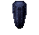 Barrel Cactus |     Bulrushes    | 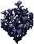 Campion Flowers |    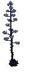 Century Plant    |  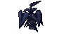 Elephant Ear Plant  |    Fern   |
    |         Lilies        | 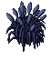 Pampas Grass |         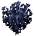 Poppies         |    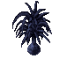 Ponytail Palm    |  Prickly Pear Cactus | 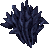 Rushes |
    |    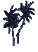 Small Palm    |  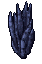 Snake Plant  |        Snowdrops       | 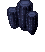 Tribarrel Cactus |         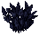 Water Plant         |                                                     |

=== "Bright Blue"

    |                               Plain Plants                               |                                                                        |                                                                              |                                                                                |                                                                                      |                                                            |
    |:------------------------------------------------------------------------:|:----------------------------------------------------------------------:|:----------------------------------------------------------------------------:|:------------------------------------------------------------------------------:|:------------------------------------------------------------------------------------:|:----------------------------------------------------------:|
    | 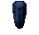 Barrel Cactus |    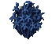 Bulrushes    | 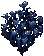 Campion Flowers |    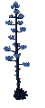 Century Plant    |   Elephant Ear Plant  |    Fern   |
    |         Lilies        | 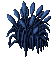 Pampas Grass |         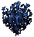 Poppies         |     Ponytail Palm    |  Prickly Pear Cactus |  Rushes |
    |     Small Palm    |   Snake Plant  |        Snowdrops       |  Tribarrel Cactus |          Water Plant         |                                                            |

=== "Yellow"

    |                            Plain Plants                             |                                                                   |                                                                         |                                                                           |                                                                                 |                                                       |
    |:-------------------------------------------------------------------:|:-----------------------------------------------------------------:|:-----------------------------------------------------------------------:|:-------------------------------------------------------------------------:|:-------------------------------------------------------------------------------:|:-----------------------------------------------------:|
    |  Barrel Cactus |     Bulrushes    |  Campion Flowers |     Century Plant    |   Elephant Ear Plant  |    Fern   |
    |         Lilies        |  Pampas Grass |          Poppies         |     Ponytail Palm    |  Prickly Pear Cactus |  Rushes |
    |     Small Palm    |   Snake Plant  |        Snowdrops       |  Tribarrel Cactus |          Water Plant         |                                                       |

=== "Bright Yellow"

    |                                Plain Plants                                |                                                                          |                                                                                |                                                                                  |                                                                                        |                                                              |
    |:--------------------------------------------------------------------------:|:------------------------------------------------------------------------:|:------------------------------------------------------------------------------:|:--------------------------------------------------------------------------------:|:--------------------------------------------------------------------------------------:|:------------------------------------------------------------:|
    |  Barrel Cactus |     Bulrushes    |  Campion Flowers |     Century Plant    |   Elephant Ear Plant  |    Fern   |
    |         Lilies        |  Pampas Grass |          Poppies         |     Ponytail Palm    |  Prickly Pear Cactus |  Rushes |
    |     Small Palm    |   Snake Plant  |        Snowdrops       |  Tribarrel Cactus |          Water Plant         |                                                              |

=== "Purple"

    |                            Plain Plants                             |                                                                   |                                                                         |                                                                           |                                                                                 |                                                       |
    |:-------------------------------------------------------------------:|:-----------------------------------------------------------------:|:-----------------------------------------------------------------------:|:-------------------------------------------------------------------------:|:-------------------------------------------------------------------------------:|:-----------------------------------------------------:|
    |  Barrel Cactus |     Bulrushes    |  Campion Flowers |     Century Plant    |   Elephant Ear Plant  |    Fern   |
    |         Lilies        |  Pampas Grass |          Poppies         |     Ponytail Palm    |  Prickly Pear Cactus |  Rushes |
    |     Small Palm    |   Snake Plant  |        Snowdrops       |  Tribarrel Cactus |          Water Plant         |                                                       |

=== "Bright Purple"

    |                                Plain Plants                                |                                                                          |                                                                                |                                                                                  |                                                                                        |                                                              |
    |:--------------------------------------------------------------------------:|:------------------------------------------------------------------------:|:------------------------------------------------------------------------------:|:--------------------------------------------------------------------------------:|:--------------------------------------------------------------------------------------:|:------------------------------------------------------------:|
    |  Barrel Cactus |     Bulrushes    |  Campion Flowers |     Century Plant    |   Elephant Ear Plant  |    Fern   |
    |         Lilies        |  Pampas Grass |          Poppies         |     Ponytail Palm    |  Prickly Pear Cactus |  Rushes |
    |     Small Palm    |   Snake Plant  |        Snowdrops       |  Tribarrel Cactus |          Water Plant         |                                                              |

=== "Orange"

    |                            Plain Plants                             |                                                                   |                                                                         |                                                                           |                                                                                 |                                                       |
    |:-------------------------------------------------------------------:|:-----------------------------------------------------------------:|:-----------------------------------------------------------------------:|:-------------------------------------------------------------------------:|:-------------------------------------------------------------------------------:|:-----------------------------------------------------:|
    |  Barrel Cactus |     Bulrushes    |  Campion Flowers |     Century Plant    |   Elephant Ear Plant  |    Fern   |
    |         Lilies        |  Pampas Grass |          Poppies         |     Ponytail Palm    |  Prickly Pear Cactus |  Rushes |
    |     Small Palm    |   Snake Plant  |        Snowdrops       |  Tribarrel Cactus |          Water Plant         |                                                       |

=== "Bright Orange"

    |                                Plain Plants                                |                                                                          |                                                                                |                                                                                  |                                                                                        |                                                              |
    |:--------------------------------------------------------------------------:|:------------------------------------------------------------------------:|:------------------------------------------------------------------------------:|:--------------------------------------------------------------------------------:|:--------------------------------------------------------------------------------------:|:------------------------------------------------------------:|
    |  Barrel Cactus |     Bulrushes    |  Campion Flowers |     Century Plant    |   Elephant Ear Plant  |    Fern   |
    |         Lilies        |  Pampas Grass |          Poppies         |     Ponytail Palm    |  Prickly Pear Cactus |  Rushes |
    |     Small Palm    |   Snake Plant  |        Snowdrops       |  Tribarrel Cactus |          Water Plant         |    

=== "Green"

    |                            Plain Plants                            |                                                                  |                                                                        |                                                                          |                                                                                |                                                      |
    |:------------------------------------------------------------------:|:----------------------------------------------------------------:|:----------------------------------------------------------------------:|:------------------------------------------------------------------------:|:------------------------------------------------------------------------------:|:----------------------------------------------------:|
    |  Barrel Cactus |     Bulrushes    |  Campion Flowers |     Century Plant    |   Elephant Ear Plant  |    Fern   |
    |         Lilies        |  Pampas Grass |          Poppies         |     Ponytail Palm    |  Prickly Pear Cactus |  Rushes |
    |     Small Palm    |   Snake Plant  |        Snowdrops       |  Tribarrel Cactus |          Water Plant         |                                                      |

=== "Bright Green"

    |                               Plain Plants                                |                                                                         |                                                                               |                                                                                 |                                                                                       |                                                             |
    |:-------------------------------------------------------------------------:|:-----------------------------------------------------------------------:|:-----------------------------------------------------------------------------:|:-------------------------------------------------------------------------------:|:-------------------------------------------------------------------------------------:|:-----------------------------------------------------------:|
    |  Barrel Cactus |     Bulrushes    |  Campion Flowers |     Century Plant    |   Elephant Ear Plant  |    Fern   |
    |         Lilies        |  Pampas Grass |          Poppies         |     Ponytail Palm    |  Prickly Pear Cactus |  Rushes |
    |     Small Palm    |   Snake Plant  |        Snowdrops       |  Tribarrel Cactus |          Water Plant         |                                                             |
                                                          |

=== "Black"

    |                            Plain Plants                            |                                                                  |                                                                        |                                                                          |                                                                                |                                                      |
    |:------------------------------------------------------------------:|:----------------------------------------------------------------:|:----------------------------------------------------------------------:|:------------------------------------------------------------------------:|:------------------------------------------------------------------------------:|:----------------------------------------------------:|
    |  Barrel Cactus |     Bulrushes    |  Campion Flowers |     Century Plant    |   Elephant Ear Plant  |    Fern   |
    |         Lilies        |  Pampas Grass |          Poppies         |     Ponytail Palm    |  Prickly Pear Cactus |  Rushes |
    |     Small Palm    |   Snake Plant  |        Snowdrops       |  Tribarrel Cactus |          Water Plant         |                                                      |

=== "White"

    |                            Plain Plants                            |                                                                  |                                                                        |                                                                          |                                                                                |                                                      |
    |:------------------------------------------------------------------:|:----------------------------------------------------------------:|:----------------------------------------------------------------------:|:------------------------------------------------------------------------:|:------------------------------------------------------------------------------:|:----------------------------------------------------:|
    |  Barrel Cactus |     Bulrushes    |  Campion Flowers |     Century Plant    |   Elephant Ear Plant  |    Fern   |
    |         Lilies        |  Pampas Grass |          Poppies         |     Ponytail Palm    |  Prickly Pear Cactus |  Rushes |
    |     Small Palm    |   Snake Plant  |        Snowdrops       |  Tribarrel Cactus |          Water Plant         |                                                      |

### Peculiar seeds

Plants grown from Peculiar seeds cannot be cross‑pollinated and do not produce seeds.

This table shows which monsters drop the specific seed required for each plant.

|          Monster           |                                 Peculiar Plant                                 |                                                                    |                                                                      |                                                               |
|:--------------------------:|:------------------------------------------------------------------------------:|:------------------------------------------------------------------:|:--------------------------------------------------------------------:|:-------------------------------------------------------------:|
|  Terathan Warrior Wisp  |                  Cactus                 |          Cattails         |       Poppies       |    Water Lilly    |
|           Titan            |        Foxglove Flowers       |  Hops Plant (East) |    Orfluer Flowers   |    Spider Tree    |
| Mummy Serpentine Dragon |   Cypress Tree (Twisted)  |      Hedge (Short)     |       Juniper Bush      |  Snowdrops |
| Juka Mage Plague Beast  |  Cypress Tree (Straight) |       Hedge (Tall)      |  Hops Plant (South) |                                                               |

## Plant bowl

You can buy a Plant bowl from Provisioner NPCs.

1. Fill the bowl with 5 Fertile dirt.

2. Soften the dirt, two uses from a Pitcher of Water is enough.

3. Plant the seed.

Your plant is ready, it will only grow if locked down in a house or in your backpack.

### Fertile dirt

Fertile dirt can be found on the ground in the Ocllo Sewers.

Can also be looted from Boars, Bull Frogs, Giant Toads and Earth Elementals.

### Pitcher of Water

You can buy a Pitcher of Water from Provisioner NPCs.

It can be refilled using a Water Trough or Water barrel.

## Plant gump

??? note "Click to expand: Icon legend"

    === "Left side"

        - Top left corner: Growth stage
        - Reproduction page button
        - Insect infestation
        - Fungus infection
        - Poisoned
        - Diseased
        - Bottom left corner: Does nothing

    === "Right side"

        - Top right corner: Growth status
        - Water level
        - Add Greater Poison potions
        - Add Greater Cure potions
        - Add Greater Heal potions
        - Add Greater Strength potions
        - Bottom right corner: Empty bowl

##  Growth

A plant performs a growth check every 24 hours after you last tend it.

With each check, it advances through growth stages 1 to 9, shown by the icon in the top‑left corner.

On stage 7, the plant becomes visible and can both pollinate other plants and be pollinated.

On stage 9, the plant can be removed and set to decorative, or it can be left in place to continue producing seeds and resources.

###  Growth status

The top right icon shows the plant's growth status.

   - A red exclamation mark means the plant is in an invalid spot. The growth check will fail, and nothing will change, the plant won't improve or decline.
   - A red dash means it didn't grow because it's unhealthy.
   - A yellow dash means the growth check hasn't happened yet.
   - A blue cross means the plant grew normally.
   - A green cross means the plant grew two stages.

## Maintenance

When a plant goes through a growth check, it may develop certain ailments. You need to remedy these before the next check so they don't end up harming the plant.

The icons on the left show what needs to be addressed before the next growth cycle.

The icons on the right let you add water or potions to remedy the ailments.

The bottom center displays the plant's Health, which has four stages: Vibrant, Healthy, Wilted, and Dying.

If the Health drops to Wilted or Dying apply two  Greater Heal potions.

Applying  Greater Strength potions can reduce how often a plant is affected by ailments.

###  Watering

If the water icon has no symbol, the plant has the perfect amount of water.

A yellow dash means you should water it once. A red dash means you should water it twice.

Be careful not to over-water, as it can harm the plant's health.

A yellow cross means the plant has been over-watered once and will need one growth cycle to recover. A red cross means it has been over-watered twice and will need two growth cycles to recover.

###  Insect infestation

This can happen at random. If a yellow cross appears, apply one  Greater Poison potion. If it's red, apply two.

###  Fungus infection

This can happen at random. If a yellow cross appears, apply one  Greater Cure potion. If it's red, apply two.

###  Poisoned

This happens when too many poison potions have been applied. A yellow cross means you should apply one  Greater Heal potion. If it's red, apply two.

###  Diseased

This happens when too many cure potions have been applied. A yellow cross means you should apply one  Greater Heal potion. If it's red, apply two.

###  Emptying the bowl

If you empty the bowl while the plant is still in its first growth stage, you'll get the seed back but lose the fertile dirt.

At any later stage, emptying the bowl will cause you to lose both the seed and the fertile dirt.

##  Reproduction

###  Bowl icon

This button brings you back to the plant gump.

###  Decorative

This icon appears only when the plant reaches stage 9 of growth.

Clicking it will convert the plant into a decorative item. Once set to decorative, the plant will no longer produce seeds or resources, and it will no longer require maintenance. At that point, it functions purely as decoration.

###  Pollination

This icon displays the pollination state.

   - A yellow dash means the plant isn't producing pollen yet.
   - A red cross means the plant can't produce pollen at all and cannot be cross‑pollinated.
   - A red exclamation mark means pollen is available.
   - A green cross means the plant has already been pollinated.

####  Cross pollination

Click this icon to select another plant and perform cross‑pollination.

###  Resources production

This icon shows the state of Resources production.

- A red cross means the plant produces no resources.
- A plant can produce up to eight resources in total.
- The number on the left shows how many resources are currently on the plant.
- The number on the right shows the current maximum, when harvested both number will decrease.
- When the right number reaches zero, the plant has produced all of its resources and won't generate any more.

####  Harvest resources

Click this icon to harvester the resources.

###  Seed production

This icon shows the state of Seed production.

- A red cross means the plant produces no seeds.
- A plant can produce up to eight seeds in total.
- The number on the left shows how many seeds are currently on the plant.
- The number on the right shows the current maximum, when harvested both number will decrease.
- When the right number reaches zero, the plant has produced all of its seeds and won't generate any more.

####  Harvest seeds

Click this icon to harvester the seeds.

## Cross pollination

Every plant in the grid can be cross‑pollinated based on its position.

To find the result of a crossing, look at the two parent plants in the grid and find the plant that sits exactly halfway between them. That middle plant is the offspring. Halfway can be horizontal, vertical, or diagonal, as long as the middle plant is centered between the two parents.

That's why Poppies + Bulrushes and Campion Flowers + Lilies both result in Snowdrops, which is the midpoint between each pair.

If the two parent plants have an even number of squares between them, there are two plants in the middle. The result has a 50/50 chance of being either of those two middle plants.

So Campion Flowers + Bulrushes sits halfway between Poppies and Snowdrops, giving a 50/50 chance of either one.

<table>
  <tr>
    <td> Campion Flowers</td>
    <td> Poppies</td>
    <td> Snowdrops</td>
    <td> Bulrushes</td>
    <td> Lilies</td>
    <td> Pampas Grass</td>
    <td> Rushes</td>
    <td> Elephant Ear Plant</td>
    <td> Fern</td>
  </tr>
  <tr>
    <td> Poppies</td>
    <td> Snowdrops</td>
    <td> Bulrushes</td>
    <td> Lilies</td>
    <td> Pampas Grass</td>
    <td> Rushes</td>
    <td> Elephant Ear Plant</td>
    <td> Fern</td>
    <td> Ponytail Palm</td>
  </tr>
  <tr>
    <td> Snowdrops</td>
    <td> Bulrushes</td>
    <td> Lilies</td>
    <td> Pampas Grass</td>
    <td> Rushes</td>
    <td> Elephant Ear Plant</td>
    <td> Fern</td>
    <td> Ponytail Palm</td>
    <td> Small Palm</td>
  </tr>
  <tr>
    <td> Bulrushes</td>
    <td> Lilies</td>
    <td> Pampas Grass</td>
    <td> Rushes</td>
    <td> Elephant Ear Plant</td>
    <td> Fern</td>
    <td> Ponytail Palm</td>
    <td> Small Palm</td>
    <td> Century Plant</td>
  </tr>
  <tr>
    <td> Lilies</td>
    <td> Pampas Grass</td>
    <td> Rushes</td>
    <td> Elephant Ear Plant</td>
    <td> Fern</td>
    <td> Ponytail Palm</td>
    <td> Small Palm</td>
    <td> Century Plant</td>
    <td> Water Plant</td>
  </tr>
  <tr>
    <td> Pampas Grass</td>
    <td> Rushes</td>
    <td> Elephant Ear Plant</td>
    <td> Fern</td>
    <td> Ponytail Palm</td>
    <td> Small Palm</td>
    <td> Century Plant</td>
    <td> Water Plant</td>
    <td> Snake Plant</td>
  </tr>
  <tr>
    <td> Rushes</td>
    <td> Elephant Ear Plant</td>
    <td> Fern</td>
    <td> Ponytail Palm</td>
    <td> Small Palm</td>
    <td> Century Plant</td>
    <td> Water Plant</td>
    <td> Snake Plant</td>
    <td> Prickly Pear Cactus</td>
  </tr>
  <tr>
    <td> Elephant Ear Plant</td>
    <td> Fern</td>
    <td> Ponytail Palm</td>
    <td> Small Palm</td>
    <td> Century Plant</td>
    <td> Water Plant</td>
    <td> Snake Plant</td>
    <td> Prickly Pear Cactus</td>
    <td> Barrel Cactus</td>
  </tr>
  <tr>
    <td> Fern</td>
    <td> Ponytail Palm</td>
    <td> Small Palm</td>
    <td> Century Plant</td>
    <td> Water Plant</td>
    <td> Snake Plant</td>
    <td> Prickly Pear Cactus</td>
    <td> Barrel Cactus</td>
    <td> Tribarrel Cactus</td>
  </tr>
</table>

### Cross colors

This table shows how to cross-pollinate colors.

Pick a color from the left column, pick another color from the top row, then look at the cell where the two meet, that intersection shows the color you get when you cross-pollinate.

<table>
<tr>
<th></th>
<th> Red</th>
<th> Blue</th>
<th> Yellow</th>
<th> Purple</th>
<th> Green</th>
<th> Orange</th>
</tr>

<tr>
<th> Red</th>
<td> Bright Red</td>
<td> Purple</td>
<td> Orange</td>
<td> Red</td>
<td> Red</td>
<td> Red</td>
</tr>

<tr>
<th> Blue</th>
<td> Purple</td>
<td> Bright Blue</td>
<td> Green</td>
<td> Blue</td>
<td> Blue</td>
<td> Blue</td>
</tr>

<tr>
<th> Yellow</th>
<td> Orange</td>
<td> Green</td>
<td> Bright Yellow</td>
<td> Yellow</td>
<td> Yellow</td>
<td> Yellow</td>
</tr>

<tr>
<th> Purple</th>
<td> Red</td>
<td> Blue</td>
<td> Yellow</td>
<td> Bright Purple</td>
<td> Blue</td>
<td> Red</td>
</tr>

<tr>
<th> Green</th>
<td> Red</td>
<td> Blue</td>
<td> Yellow</td>
<td> Blue</td>
<td> Bright Green</td>
<td> Yellow</td>
</tr>

<tr>
<th> Orange</th>
<td> Red</td>
<td> Blue</td>
<td> Yellow</td>
<td> Red</td>
<td> Yellow</td>
<td> Bright Orange</td>
</tr>
</table>

