# Resources

Resources are the raw materials players collect throughout the world. Cotton from fields, leather from creatures, wood from trees, and ores from the earth.

## Cotton & Flax

Cotton and flax grow in farms and fields, anyone can harvest them.

Once gathered, they can be spun into thread and woven into cloth using a spinning wheel and loom.

|                             From                             |                           Get                            |
|:------------------------------------------------------------:|:--------------------------------------------------------:|
|  Cotton Plant |  Bale of Cotton |
|   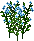 Flax Plant   |   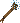 Flax Bundle    |
|        Sheep       |    Pile of Wool   |

## Leather hides

This list shows which animal and monster drop specific leather.

=== "Normal"

    |                               Animal                               | Yield |
    |:------------------------------------------------------------------:|:-----:|
    |             Cat            |   1   |
    |         Gorilla        |   1   |
    |    Snow Leopard   |   1   |
    |      Polar Bear     |   3   |
    |          Rabbit         |   4   |
    |       Grey Wolf      |   6   |
    |      White Wolf     |   6   |
    |            Goat           |   8   |
    |            Hind           |   8   |
    |          Cougar         |  10   |
    |           Horse          |  10   |
    |      Pack Horse     |  10   |
    |         Panther         |  10   |
    |      Black Bear     |  12   |
    |      Brown Bear     |  12   |
    |             Cow            |  12   |
    |  Llama Rideable Llama |  12   |
    |       Mountain Goat       |  12   |
    |          Walrus         |  12   |
    |            Bull           |  15   |
    |      Great Hart     |  15   |
    |     Grizzly Bear    |  16   |

=== "Spined"

    |                                 Monster                                  | Yield |
    |:------------------------------------------------------------------------:|:-----:|
    |          Dire Wolf         |   6   |
    |                Imp               |   6   |
    |             Ratman            |   8   |
    |           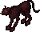 Hellcat           |  10   |
    |          Alligator         |  12   |
    |         Giant Toad        |  12   |
    |          Lizardman         |  12   |
    |        Lava Lizard       |  14   |
    |  Giant Ice Serpent |  15   |
    |      Giant Serpent     |  15   |
    |       Lava Serpent      |  15   |

=== "Horned"

    |                                     Monster                                      | Yield |
    |:--------------------------------------------------------------------------------:|:-----:|
    |  Sea Serpent Deep Sea Serpent |  10   |
    |                  Drake                 |  20   |
    |                 Wyvern                |  20   |

=== "Barbed"

    |                            Monster                             | Yield |
    |:--------------------------------------------------------------:|:-----:|
    |     Nightmare    |  10   |
    |  Ancient Wyrm |  20   |
    |        Dragon       |  20   |
    |   Shadow Wyrm  |  20   |
    |    White Wyrm   |  20   |

## Wood

Gathered with [Lumberjacking](../../skills/resource-gathering/lumberjacking.md).

| Skill |                         Boards                          |
|:-----:|:-------------------------------------------------------:|
|   0   |  Normal |
|  65   |     Oak    |
|  80   |     Ash    |
|  95   |     Yew    |

## Iron

Gathered with [Mining](../../skills/resource-gathering/mining.md).

| Skill |                               Iron                                | Spawn |
|:-----:|:-----------------------------------------------------------------:|:-----:|
|   0   |         Iron        |  50%  |
|  65   | 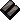 Dull Copper | 11.2% |
|  70   |      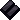 Shadow      | 9.8%  |
|  75   |      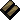 Copper      | 8.4%  |
|  80   |      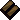 Bronze      | 7.0%  |
|  85   |      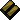 Golden      | 5.6%  |
|  90   |     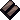 Agapite     | 4.2%  |
|  95   |      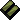 Verite      | 2.8%  |
|  99   |    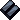 Valorite    | 1.4%  |
