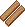
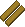
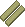
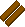

{ align=right }

# Lumberjacking

## Overview

Lumberjacking allows you to chop trees for logs and provides a damage bonus when using axe weapons.

To avoid unattended gathering, all resource gathering activities will trigger the AFK captcha gump.

## Types of wood

| Skill |                             Boards                              |
|:-----:|:---------------------------------------------------------------:|
|   0   |  Normal |
|  65   |     Oak    |
|  80   |     Ash    |
|  95   |     Yew    |

## Gathering

To be able to gather, you need to equip an axe in your hand and be on foot.

Double click the axe and then the tree until it's depleted.

Trees are like Mining veins, they will always yield that type of wood.

## Axes damage bonus

The bonus gets applied only on two handed axes.

This is the formula used in the calculation.

`Lumberjacking Skill / 10 -2 + 1 if GM`

At Grand Master you will deal +9 damage.

Lumberjacking is often paired with Swordsmanship.

## Training

Train from Carpenter NPCs to reach around 30.

Repeatedly chop trees until reaching 100.

## Related skills

- [Carpentry](../crafting/carpentry.md)
- [Bowcraft/Fletching](../crafting/bowcraft-fletching.md)
- [Swordsmanship](../combat/swordsmanship.md)