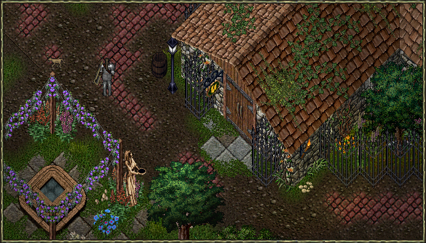
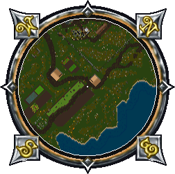
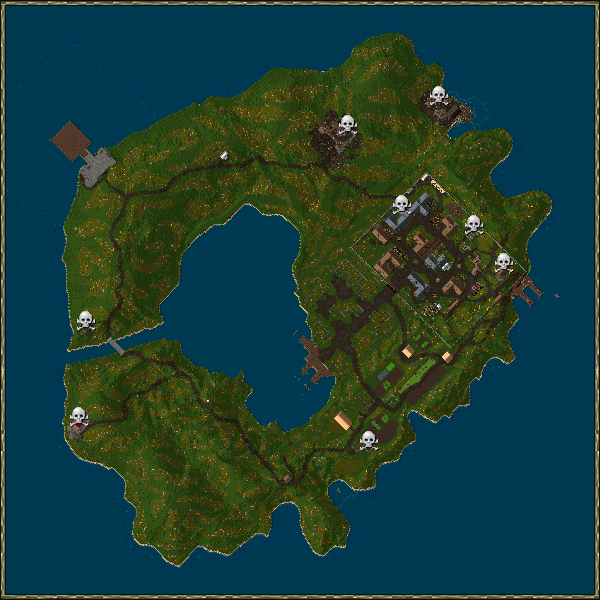
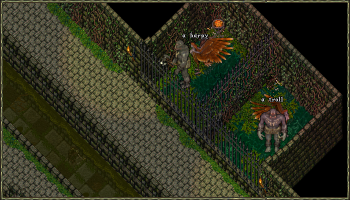

# New Player Guide

Thanks for giving New Dawn a look. Stepping into UO for the first time (or the first time in 25 years) can feel like a lot. It can be a bit overwhelming to where you might say, "nevermind" and log out.

That's normal. UO has never been a "read one page and you're ready" kind of game, and we don't expect you to memorize this guide either.

Think of this as a handhold, not homework. Skim it, keep it open in a tab, and come back to whichever section you need when you need it. By the end you'll know enough to get your feet under you, find your way to Ocllo, and start your first character with a bit of confidence.

!!! tip "The short version"
    1. [Install the game](on-windows.md) and log in.
    2. Type `[young` to join the [Young Player Program](#the-young-player-program). You'll be teleported to Ocllo.
    3. Stay in Ocllo, train in the [sewers](#the-ocllo-sewer), and build toward the [Provo Dexxer](#picking-your-first-build-the-provo-dexxer).

## Getting New Dawn installed

If you need to install New Dawn, [jump over to the installation page](on-windows.md). There's a [Linux guide](on-linux.md) as well. Obviously if you've completed this step, you can skip it.

## A few basics before you dive in

Here are some quick things that'll help right away. You'll pick up plenty more as you go.

### Pets and taming

- Horses can be tamed regardless of skill.
- All players start with one bond slot. Feed the pet you want to bond, and after the message "You begin bonding with your pet." appears, stable the pet for 24 hours and then feed it again to bond it. Bonded pets can recall with you.
- You can resurrect your dead pet at any stable. Single‑click the Veterinarian NPC and select "Resurrect Pet."

### The world around you

- There's no light filter, so the world looks (and feels) properly dark at night. Don't worry, you will get used to it in no time. You can buy Nightsight potions or use the Night Sight spell, and they last a long time.
- To avoid unattended gathering, all resource gathering activities will trigger the AFK captcha gump.

### Skills and training

- Dungeons have a 50% skill gain boost, except for crafting skills.
- When you set a skill pointing down it will decrease at the same time as you gain on a skill pointing up. You don't have to wait until you're at your skill cap to lower a skill.
- Most skills can be trained to around 50 at an NPC trainer. See the [Ocllo Skill Trainers](trainers.md) page for who to visit and where they stand.

### Magic and travel

- Recall charges inside a runebook don't require Magery.
- You can't recall in or out of dungeons. Instead, there are exit gates spread around.
- Spellbooks can only be crafted.
- Runebooks can be blessed using [Codex fragments](../custom-systems/codex-rifts.md#codex-fragments) and [Codex Bindings](../skills/crafting/alchemy.md#codex-binding).

### Combat

- Instead of a Dex penalty when wearing armor, you instead lose stamina when taking melee damage, based on the armor you're wearing.

For more information visit the [What's Different](whats-different.md) page.

## The Young Player Program

If you're newer to the server, this is the first thing worth knowing about. It's designed to give you breathing room while you learn the ropes.

Type `[young` in game to join. Each account qualifies as long as it has under 120 hours of playtime.

Upon entering the program you will be teleported to Ocllo.

**Here's what you get as a Young player:**

- No item loss on death. All your gear stays in your backpack.
- Auto-teleport to a safe healer when you die.
- Monsters won't attack you unprovoked while you're in Ocllo.
- Poison immunity and instant logout, no delay.
- You can't be stolen from by other players.
- Access to the Ocllo Sewer for some easy early training.

!!! warning "How you lose Young status"
    - Leaving Ocllo. You can rejoin the program a set number of times, so be careful.
    - Committing a murder.
    - Reaching 450 total skill.
    - Raising a craft skill past 80.

Full details live on the [Young Player Program](../custom-systems/young-program.md) page.

## Ocllo

[Ocllo](../world/towns/ocllo.md) is the main city and the best place to start. You'll find just about every vendor type here, so it doubles as a great spot to train and to shop.

Take a little time to explore. Between training and selling what you find, you can build up some starting gold without much risk.

### The cotton farm

Just south outside of the city you will find a cotton farm. You can use it only while in the Young program.

You should go here every chance you get to stock up on bandages.

### The Ocllo Sewer

While you're Young, you'll get a 50% skill gain bonus inside [this dungeon](../world/dungeons/occlo-sewers.md), though you won't be able to raise any skill above 80 there.

These are the entrances:

### Provo cage

This spot inside the Sewers is perfect for training [Musicianship](../skills/bard-skills/musicianship.md) and [Provocation](../skills/bard-skills/provocation.md) up to 80.

Just provoke a Harpy onto a Troll in the opposite cage.

## Picking your first build: the Provo Dexxer

If you're not sure where to start, the Provo Dexxer is one of the friendliest templates for a new character.

It doesn't lean on Magery for healing, so there's no need to stock reagents, which is good news since Magery is expensive to train early on. Instead, you'll gather cotton from around the world to make bandages, giving you free healing whenever you need it.

Provocation is extremely powerful on almost any template, and pairing it with a combat skill makes the build even more profitable.

**Suggested skills:**

- Musicianship
- Provocation
- Healing
- Anatomy
- Swordsmanship
- Tactics
- Parrying / Magery / Hiding

That last slot is your seventh skill, and it's mostly down to personal taste. Use it to support whatever play style suits you.

### A note on Magery and recall

Recall charges inside a runebook don't require Magery. If you still want Magery to recall around, please note:

- Casting from scrolls does not require reagents. If successful, the mana consumed will be the same as for normal spells, and the scroll will disappear.
- You need 50 Magery to never fail casting recall from scrolls.
- You need 70 Magery to never fail casting recall from spells.

### Don't stress over starting skills

The skills you pick during character creation aren't all that important. You can train almost anything up to around 50 using gold alone, so there's no wrong way to start. You also have 3 accounts, with 5 characters each, so you can always try out different skills.

A handy trick: if you have other accounts, you can make characters on them just to funnel their starting gold toward your main, giving yourself a head start on early training.

### Starting stats

You should start every character with at least 12 Dexterity, otherwise you won't be able to walk through players and monsters.

For this template, depending on how often you want to use Magery, these are the recommended starting stats:

| Play style        | Strength | Dexterity | Intelligence |
|-------------------|----------|-----------|--------------|
| Magery low usage  | 47       | 12        | 11           |
| Magery high usage | 40       | 12        | 28           |

Visit the [Stats page](../game-mechanics/character/stats.md) for a detailed list of skills and their stat gains.

## Leveling up: the Summoner template

Once you've saved enough gold to train Magery, the Summoner is a strong next step. It lets you call powerful Daemons and other creatures to fight alongside you.

**Suggested skills:**

- Musicianship
- Provocation
- Magery
- Meditation
- Spirit Speak
- Animal Lore
- Resisting Spells / Evaluating Intelligence / Hiding

Again, that 7th slot really comes down to your own playstyle.

For more detail, take a look at the [Spirit Speak](../skills/magic/spirit-speak.md) page.

## On training in general

You gain skills by using them. Every skill page goes deeper into how that skill works and how best to train it, so when you're ready to specialize, that's the place to look.

## You're not alone in this

If you get stuck, have a question, or just want to see what other players are up to, come hang out on [Discord](https://discord.gg/AStx3wYAPj). No question is too small, and you don't need to have it all figured out before you show up.

There are always player-driven events and training groups happy to help new folks get going, so don't be shy about jumping in.
