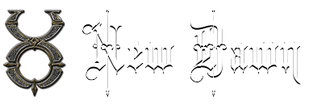
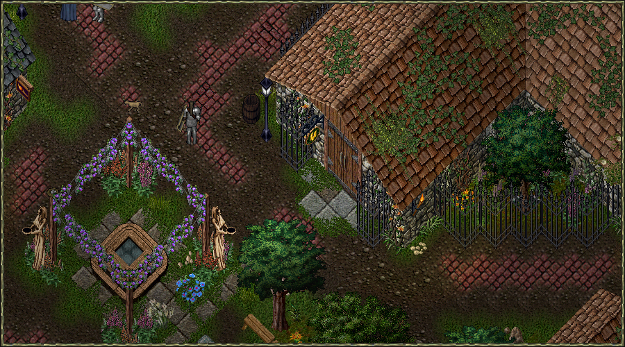

---
hide:
  - toc
---

# New Dawn Codex

{ align=right }

Welcome to the **New Dawn Codex**, your guide to the world of [New Dawn](https://www.uonewdawn.com)!

Whether you've played Ultima Online since 1997 or you've never touched it, you're in the right place. Everything here is written to be read out of order, so take what you need and leave the rest for later.

## What's New Dawn?

{ align=right width="50%" }

New Dawn is a passion project that captures the spirit of Ultima Online's golden T2A/UOR era. We're not chasing perfect historical accuracy, instead, we've preserved what made those days unforgettable while adding in thoughtful improvements drawn from years of UO expertise and modern gaming insights.

Veterans will recognize the familiar rhythms of classic UO, but with enough fresh ideas to reignite that sense of discovery. If you're new to this era, you're in for something special: a living, breathing world where you forge your own path, not just chase quest markers and level caps.

We've found the sweet spot between tradition and evolution—more authentic than contemporary shards, yet more polished than a rigid time capsule. Best of all, New Dawn is completely free-to-play with zero pay-to-win mechanics. Just pure Ultima Online as it was meant to be experienced.

## New here? Start with these three steps

!!! tip "You don't need to read the whole Codex first"
    UO has never been a "read one page and you're ready" kind of game. Do these three things and you'll be playing within the hour, everything else can wait until you want it.

1. **[Install the game](getting-started/on-windows.md)** — create an account, grab the launcher, and log in. There's a [Linux guide](getting-started/on-linux.md) too.
2. **[Read the New Player Guide](getting-started/new-player-guide.md)** — the basics, the Young Player Program, and a first character build that works.
3. **[Say hello on Discord](https://discord.gg/AStx3wYAPj)** — no question is too small, and someone is almost always around to help.

## Explore the Codex

-   :material-download:{ .lg .middle } __Install & Play__

    ---

    Create your account, download the launcher, and get into the world.

    [:octicons-arrow-right-24: Installation Guide](getting-started/on-windows.md)

-   :material-map-marker:{ .lg .middle } __New Player Guide__

    ---

    Your first steps: the Young Player Program, where to start, and what to train.

    [:octicons-arrow-right-24: New Player Guide](getting-started/new-player-guide.md)

-   :material-swap-horizontal:{ .lg .middle } __What's Different__

    ---

    Played UO before? Here's everything New Dawn changed, in one place.

    [:octicons-arrow-right-24: What's Different](getting-started/whats-different.md)

-   :material-castle:{ .lg .middle } __The World__

    ---

    The lore of the New Dawn era, and the history behind Britannia's towns.

    [:octicons-arrow-right-24: Read the Lore](world/new-dawn.md)

-   :material-star-four-points:{ .lg .middle } __Custom Systems__

    ---

    Codex Rifts, Pirate Adventures, Archaeology, Battlegrounds, and more.

    [:octicons-arrow-right-24: Custom Systems](custom-systems/index.md)

-   :material-account-group:{ .lg .middle } __Community & Help__

    ---

    Find the Discord, meet other players, and help improve the Codex.

    [:octicons-arrow-right-24: Community & Resources](community/index.md)

## Popular pages

- [Ocllo Skill Trainers](getting-started/trainers.md) — who to buy early skill points from
- [Stats](game-mechanics/character/stats.md) — what Strength, Dexterity, and Intelligence actually do
- [Housing](game-mechanics/housing.md) — placing and owning a home
- [Murder System](game-mechanics/murder-system.md) — how PvP, notoriety, and murder counts work
- [Bestiary](world/bestiary.md) — what you're fighting, and what it drops
- [Patch Notes](patches/index.md) — what changed, and when

## Latest Updates

!!! tip "Codex Status"
    This codex is continuously being updated with new content. Check back regularly for updates, or help us expand it by [contributing](community/contributing.md)!

## Join Our Discord Community

Connect with fellow players, get help, and stay updated:

- [:fontawesome-brands-discord: Join our Discord](https://discord.gg/AStx3wYAPj)

---

**Ready to begin your adventure?** Head to our [New Player Guide](getting-started/new-player-guide.md) to get started!
