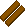

{ align=right }

# Lumberjacking

## Overview

Lumberjacking allows you to chop trees for logs and provides a damage bonus when using axe weapons.

To avoid unattended gathering, all resource gathering activities will trigger the AFK captcha gump.

Starting items if you choose this skill in character creation: Hatchet.

## Types of wood

| Skill |                         Boards                          |
|:-----:|:-------------------------------------------------------:|
|   0   |  Normal |
|  65   |     Oak    |
|  80   |     Ash    |
|  95   |     Yew    |

## Gathering

To be able to gather, you need to equip an axe in your hand and be on foot.

You can purchase an axe from blacksmith or weaponsmith vendors.

Double click the axe and then the tree until it's depleted.

Specific trees will always yield the same type of wood.

## Axes damage bonus

Lumberjacking gives you bonus damage when using two handed axes.

The bonus gets calculated with this formula:

`(Lumberjacking Skill / 10 - 2) + (1 if GM)`

So if you have 50 Lumberjacking you will get +3 on your damage, if you have 99.9, +8 and if you have 100, +9.

Lumberjacking is often paired with Swordsmanship.

## Heartwood Oil

Heartwood Oil is a [Carpentry BOD](../crafting/carpentry.md#bulk-order-deeds) reward.

When used, it can boost the wood type by one level.

So for example a Normal tree can be raised to Oak.

This effect can stack with the Woodwarden Axe.

## Woodwarden Axe

The Woodwarden Axe is a [Carpentry BOD](../crafting/carpentry.md#bulk-order-deeds) reward.

When used, it can boost the wood type by one level.

This effect can stack with the Heartwood Oil.

So for example a Normal tree can be raised to Oak using Heartwood Oil and then raise to Ash with the Woodwarden Axe.

When using the Woodwarden Axe there is a chance of spawning a Reaper of the same color of the wood you are chopping.

## Training

Train from Carpenter NPCs to reach around 50.

Repeatedly chop trees until reaching 100.

While training this skill you can also gain Strength (primary) and Dexterity (secondary). Visit the [stats](../../game-mechanics/character/stats.md) page to learn more.

## Related skills

- [Carpentry](../crafting/carpentry.md)
- [Bowcraft/Fletching](../crafting/bowcraft-fletching.md)
- [Swordsmanship](../combat/swordsmanship.md)
