

# Bestiary

=== "Info"

    

    <table>
    <tr>
        <th>Spawn Locations</th>
        <td id="Name_Spawn-Locations" colspan="3"></td>
    </tr>
    <tr>
        <th>Base Damage</th>
        <td id="Name_Base-Damage"></td>
        <th>Armor Rating</th>
        <td id="Name_Armor-Rating"></td>
    </tr>
    <tr>
        <th>Fame</th>
        <td id="Name_Fame"></td>
        <th>Karma</th>
        <td id="Name_Karma"></td>
    </tr>
    <tr>
        <th>Super Slayer</th>
        <td id="Name_Super-Slayer"></td>
        <th>Minor Slayer</th>
        <td id="Name_Minor-Slayer"></td>
    </tr>
    <tr>
        <th>Barding Difficulty</th>
        <td id="Name_Barding-Difficulty"></td>
        <th>Taming Difficulty</th>
        <td id="Name_Taming-Difficulty"></td>
    </tr>
    </table>
    

=== "Attributes"

    

    <table>
    <tr>
        <th>Hit Points</th>
        <td id="Name_Hit-Points"></td>
        <th>Strength</th>
        <td id="Name_Strength"></td>
    </tr>
    <tr>
        <th>Stamina</th>
        <td id="Name_Stamina"></td>
        <th>Dexterity</th>
        <td id="Name_Dexterity"></td>
    </tr>
    <tr>
        <th>Mana</th>
        <td id="Name_Mana"></td>
        <th>Intelligence</th>
        <td id="Name_Intelligence"></td>
    </tr>
    </table>
    

=== "Skills"

    

    <table>
    <tr>
        <th>Wrestling</th>
        <td id="Name_Wrestling"></td>
        <th>Magery</th>
        <td id="Name_Magery"></td>
    </tr>
    <tr>
        <th>Tactics</th>
        <td id="Name_Tactics"></td>
        <th>Meditation</th>
        <td id="Name_Meditation"></td>
    </tr>
    <tr>
        <th>Resisting Spells</th>
        <td id="Name_Resisting-Spells"></td>
        <th>Evaluating Intelligence</th>
        <td id="Name_Evaluating-Intelligence"></td>
    </tr>
    <tr>
        <th>Anatomy</th>
        <td id="Name_Anatomy"></td>
        <th>Poisoning</th>
        <td id="Name_Poisoning"></td>
    </tr>
    </table>
    

=== "Loot"

    

    <table>
    <tr>
        <th>Gold</th>
        <td id="Name_Gold"></td>
    </tr>
    <tr>
        <th>Treasure Map lvl</th>
        <td id="Name_Treasure-Map-lvl"></td>
    </tr>
        <tr>
        <th>Slayer Drop</th>
        <td id="Name_Slayer-Drop"></td>
    </tr>
    </table>
    

## Bestiary index

## Bestiary list

### Acid Elemental

=== "Info"

    

    <table>
    <tr>
        <th>Spawn Locations</th>
        <td id="Acid-Elemental_Spawn-Locations" colspan="3"></td>
    </tr>
    <tr>
        <th>Base Damage</th>
        <td id="Acid-Elemental_Base-Damage"></td>
        <th>Armor Rating</th>
        <td id="Acid-Elemental_Armor-Rating"></td>
    </tr>
    <tr>
        <th>Fame</th>
        <td id="Acid-Elemental_Fame"></td>
        <th>Karma</th>
        <td id="Acid-Elemental_Karma"></td>
    </tr>
    <tr>
        <th>Super Slayer</th>
        <td id="Acid-Elemental_Super-Slayer"></td>
        <th>Minor Slayer</th>
        <td id="Acid-Elemental_Minor-Slayer"></td>
    </tr>
    <tr>
        <th>Barding Difficulty</th>
        <td id="Acid-Elemental_Barding-Difficulty"></td>
        <th>Taming Difficulty</th>
        <td id="Acid-Elemental_Taming-Difficulty"></td>
    </tr>
    </table>
    

=== "Attributes"

    

    <table>
    <tr>
        <th>Hit Points</th>
        <td id="Acid-Elemental_Hit-Points"></td>
        <th>Strength</th>
        <td id="Acid-Elemental_Strength"></td>
    </tr>
    <tr>
        <th>Stamina</th>
        <td id="Acid-Elemental_Stamina"></td>
        <th>Dexterity</th>
        <td id="Acid-Elemental_Dexterity"></td>
    </tr>
    <tr>
        <th>Mana</th>
        <td id="Acid-Elemental_Mana"></td>
        <th>Intelligence</th>
        <td id="Acid-Elemental_Intelligence"></td>
    </tr>
    </table>
    

=== "Skills"

    

    <table>
    <tr>
        <th>Wrestling</th>
        <td id="Acid-Elemental_Wrestling"></td>
        <th>Magery</th>
        <td id="Acid-Elemental_Magery"></td>
    </tr>
    <tr>
        <th>Tactics</th>
        <td id="Acid-Elemental_Tactics"></td>
        <th>Meditation</th>
        <td id="Acid-Elemental_Meditation"></td>
    </tr>
    <tr>
        <th>Resisting Spells</th>
        <td id="Acid-Elemental_Resisting-Spells"></td>
        <th>Evaluating Intelligence</th>
        <td id="Acid-Elemental_Evaluating-Intelligence"></td>
    </tr>
    <tr>
        <th>Anatomy</th>
        <td id="Acid-Elemental_Anatomy"></td>
        <th>Poisoning</th>
        <td id="Acid-Elemental_Poisoning"></td>
    </tr>
    </table>
    

=== "Loot"

    

    <table>
    <tr>
        <th>Gold</th>
        <td id="Acid-Elemental_Gold"></td>
    </tr>
    <tr>
        <th>Treasure Map lvl</th>
        <td id="Acid-Elemental_Treasure-Map-lvl"></td>
    </tr>
        <tr>
        <th>Slayer Drop</th>
        <td id="Acid-Elemental_Slayer-Drop"></td>
    </tr>
    </table>
    

### Admiral Dread

!!! warning
    Under construction.

=== "Info"

    

    <table>
    <tr>
        <th>Spawn Locations</th>
        <td id="Admiral-Dread_Spawn-Locations" colspan="3"></td>
    </tr>
    <tr>
        <th>Base Damage</th>
        <td id="Admiral-Dread_Base-Damage"></td>
        <th>Armor Rating</th>
        <td id="Admiral-Dread_Armor-Rating"></td>
    </tr>
    <tr>
        <th>Fame</th>
        <td id="Admiral-Dread_Fame"></td>
        <th>Karma</th>
        <td id="Admiral-Dread_Karma"></td>
    </tr>
    <tr>
        <th>Super Slayer</th>
        <td id="Admiral-Dread_Super-Slayer"></td>
        <th>Minor Slayer</th>
        <td id="Admiral-Dread_Minor-Slayer"></td>
    </tr>
    <tr>
        <th>Barding Difficulty</th>
        <td id="Admiral-Dread_Barding-Difficulty"></td>
        <th>Taming Difficulty</th>
        <td id="Admiral-Dread_Taming-Difficulty"></td>
    </tr>
    </table>
    

=== "Attributes"

    

    <table>
    <tr>
        <th>Hit Points</th>
        <td id="Admiral-Dread_Hit-Points"></td>
        <th>Strength</th>
        <td id="Admiral-Dread_Strength"></td>
    </tr>
    <tr>
        <th>Stamina</th>
        <td id="Admiral-Dread_Stamina"></td>
        <th>Dexterity</th>
        <td id="Admiral-Dread_Dexterity"></td>
    </tr>
    <tr>
        <th>Mana</th>
        <td id="Admiral-Dread_Mana"></td>
        <th>Intelligence</th>
        <td id="Admiral-Dread_Intelligence"></td>
    </tr>
    </table>
    

=== "Skills"

    

    <table>
    <tr>
        <th>Wrestling</th>
        <td id="Admiral-Dread_Wrestling"></td>
        <th>Magery</th>
        <td id="Admiral-Dread_Magery"></td>
    </tr>
    <tr>
        <th>Tactics</th>
        <td id="Admiral-Dread_Tactics"></td>
        <th>Meditation</th>
        <td id="Admiral-Dread_Meditation"></td>
    </tr>
    <tr>
        <th>Resisting Spells</th>
        <td id="Admiral-Dread_Resisting-Spells"></td>
        <th>Evaluating Intelligence</th>
        <td id="Admiral-Dread_Evaluating-Intelligence"></td>
    </tr>
    <tr>
        <th>Anatomy</th>
        <td id="Admiral-Dread_Anatomy"></td>
        <th>Poisoning</th>
        <td id="Admiral-Dread_Poisoning"></td>
    </tr>
    </table>
    

=== "Loot"

    

    <table>
    <tr>
        <th>Gold</th>
        <td id="Admiral-Dread_Gold"></td>
    </tr>
    <tr>
        <th>Treasure Map lvl</th>
        <td id="Admiral-Dread_Treasure-Map-lvl"></td>
    </tr>
        <tr>
        <th>Slayer Drop</th>
        <td id="Admiral-Dread_Slayer-Drop"></td>
    </tr>
    </table>
    

### Agapite Elemental

=== "Info"

    

    <table>
    <tr>
        <th>Spawn Locations</th>
        <td id="Agapite-Elemental_Spawn-Locations" colspan="3"></td>
    </tr>
    <tr>
        <th>Base Damage</th>
        <td id="Agapite-Elemental_Base-Damage"></td>
        <th>Armor Rating</th>
        <td id="Agapite-Elemental_Armor-Rating"></td>
    </tr>
    <tr>
        <th>Fame</th>
        <td id="Agapite-Elemental_Fame"></td>
        <th>Karma</th>
        <td id="Agapite-Elemental_Karma"></td>
    </tr>
    <tr>
        <th>Super Slayer</th>
        <td id="Agapite-Elemental_Super-Slayer"></td>
        <th>Minor Slayer</th>
        <td id="Agapite-Elemental_Minor-Slayer"></td>
    </tr>
    <tr>
        <th>Barding Difficulty</th>
        <td id="Agapite-Elemental_Barding-Difficulty"></td>
        <th>Taming Difficulty</th>
        <td id="Agapite-Elemental_Taming-Difficulty"></td>
    </tr>
    </table>
    

=== "Attributes"

    

    <table>
    <tr>
        <th>Hit Points</th>
        <td id="Agapite-Elemental_Hit-Points"></td>
        <th>Strength</th>
        <td id="Agapite-Elemental_Strength"></td>
    </tr>
    <tr>
        <th>Stamina</th>
        <td id="Agapite-Elemental_Stamina"></td>
        <th>Dexterity</th>
        <td id="Agapite-Elemental_Dexterity"></td>
    </tr>
    <tr>
        <th>Mana</th>
        <td id="Agapite-Elemental_Mana"></td>
        <th>Intelligence</th>
        <td id="Agapite-Elemental_Intelligence"></td>
    </tr>
    </table>
    

=== "Skills"

    

    <table>
    <tr>
        <th>Wrestling</th>
        <td id="Agapite-Elemental_Wrestling"></td>
        <th>Magery</th>
        <td id="Agapite-Elemental_Magery"></td>
    </tr>
    <tr>
        <th>Tactics</th>
        <td id="Agapite-Elemental_Tactics"></td>
        <th>Meditation</th>
        <td id="Agapite-Elemental_Meditation"></td>
    </tr>
    <tr>
        <th>Resisting Spells</th>
        <td id="Agapite-Elemental_Resisting-Spells"></td>
        <th>Evaluating Intelligence</th>
        <td id="Agapite-Elemental_Evaluating-Intelligence"></td>
    </tr>
    <tr>
        <th>Anatomy</th>
        <td id="Agapite-Elemental_Anatomy"></td>
        <th>Poisoning</th>
        <td id="Agapite-Elemental_Poisoning"></td>
    </tr>
    </table>
    

=== "Loot"

    

    <table>
    <tr>
        <th>Gold</th>
        <td id="Agapite-Elemental_Gold"></td>
    </tr>
    <tr>
        <th>Treasure Map lvl</th>
        <td id="Agapite-Elemental_Treasure-Map-lvl"></td>
    </tr>
        <tr>
        <th>Slayer Drop</th>
        <td id="Agapite-Elemental_Slayer-Drop"></td>
    </tr>
    </table>
    

### Air Elemental

=== "Info"

    

    <table>
    <tr>
        <th>Spawn Locations</th>
        <td id="Air-Elemental_Spawn-Locations" colspan="3"></td>
    </tr>
    <tr>
        <th>Base Damage</th>
        <td id="Air-Elemental_Base-Damage"></td>
        <th>Armor Rating</th>
        <td id="Air-Elemental_Armor-Rating"></td>
    </tr>
    <tr>
        <th>Fame</th>
        <td id="Air-Elemental_Fame"></td>
        <th>Karma</th>
        <td id="Air-Elemental_Karma"></td>
    </tr>
    <tr>
        <th>Super Slayer</th>
        <td id="Air-Elemental_Super-Slayer"></td>
        <th>Minor Slayer</th>
        <td id="Air-Elemental_Minor-Slayer"></td>
    </tr>
    <tr>
        <th>Barding Difficulty</th>
        <td id="Air-Elemental_Barding-Difficulty"></td>
        <th>Taming Difficulty</th>
        <td id="Air-Elemental_Taming-Difficulty"></td>
    </tr>
    </table>
    

=== "Attributes"

    

    <table>
    <tr>
        <th>Hit Points</th>
        <td id="Air-Elemental_Hit-Points"></td>
        <th>Strength</th>
        <td id="Air-Elemental_Strength"></td>
    </tr>
    <tr>
        <th>Stamina</th>
        <td id="Air-Elemental_Stamina"></td>
        <th>Dexterity</th>
        <td id="Air-Elemental_Dexterity"></td>
    </tr>
    <tr>
        <th>Mana</th>
        <td id="Air-Elemental_Mana"></td>
        <th>Intelligence</th>
        <td id="Air-Elemental_Intelligence"></td>
    </tr>
    </table>
    

=== "Skills"

    

    <table>
    <tr>
        <th>Wrestling</th>
        <td id="Air-Elemental_Wrestling"></td>
        <th>Magery</th>
        <td id="Air-Elemental_Magery"></td>
    </tr>
    <tr>
        <th>Tactics</th>
        <td id="Air-Elemental_Tactics"></td>
        <th>Meditation</th>
        <td id="Air-Elemental_Meditation"></td>
    </tr>
    <tr>
        <th>Resisting Spells</th>
        <td id="Air-Elemental_Resisting-Spells"></td>
        <th>Evaluating Intelligence</th>
        <td id="Air-Elemental_Evaluating-Intelligence"></td>
    </tr>
    <tr>
        <th>Anatomy</th>
        <td id="Air-Elemental_Anatomy"></td>
        <th>Poisoning</th>
        <td id="Air-Elemental_Poisoning"></td>
    </tr>
    </table>
    

=== "Loot"

    

    <table>
    <tr>
        <th>Gold</th>
        <td id="Air-Elemental_Gold"></td>
    </tr>
    <tr>
        <th>Treasure Map lvl</th>
        <td id="Air-Elemental_Treasure-Map-lvl"></td>
    </tr>
        <tr>
        <th>Slayer Drop</th>
        <td id="Air-Elemental_Slayer-Drop"></td>
    </tr>
    </table>
    

### Alligator

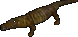

=== "Info"

    

    <table>
    <tr>
        <th>Spawn Locations</th>
        <td id="Alligator_Spawn-Locations" colspan="3"></td>
    </tr>
    <tr>
        <th>Base Damage</th>
        <td id="Alligator_Base-Damage"></td>
        <th>Armor Rating</th>
        <td id="Alligator_Armor-Rating"></td>
    </tr>
    <tr>
        <th>Fame</th>
        <td id="Alligator_Fame"></td>
        <th>Karma</th>
        <td id="Alligator_Karma"></td>
    </tr>
    <tr>
        <th>Super Slayer</th>
        <td id="Alligator_Super-Slayer"></td>
        <th>Minor Slayer</th>
        <td id="Alligator_Minor-Slayer"></td>
    </tr>
    <tr>
        <th>Barding Difficulty</th>
        <td id="Alligator_Barding-Difficulty"></td>
        <th>Taming Difficulty</th>
        <td id="Alligator_Taming-Difficulty"></td>
    </tr>
    </table>
    

=== "Attributes"

    

    <table>
    <tr>
        <th>Hit Points</th>
        <td id="Alligator_Hit-Points"></td>
        <th>Strength</th>
        <td id="Alligator_Strength"></td>
    </tr>
    <tr>
        <th>Stamina</th>
        <td id="Alligator_Stamina"></td>
        <th>Dexterity</th>
        <td id="Alligator_Dexterity"></td>
    </tr>
    <tr>
        <th>Mana</th>
        <td id="Alligator_Mana"></td>
        <th>Intelligence</th>
        <td id="Alligator_Intelligence"></td>
    </tr>
    </table>
    

=== "Skills"

    

    <table>
    <tr>
        <th>Wrestling</th>
        <td id="Alligator_Wrestling"></td>
        <th>Magery</th>
        <td id="Alligator_Magery"></td>
    </tr>
    <tr>
        <th>Tactics</th>
        <td id="Alligator_Tactics"></td>
        <th>Meditation</th>
        <td id="Alligator_Meditation"></td>
    </tr>
    <tr>
        <th>Resisting Spells</th>
        <td id="Alligator_Resisting-Spells"></td>
        <th>Evaluating Intelligence</th>
        <td id="Alligator_Evaluating-Intelligence"></td>
    </tr>
    <tr>
        <th>Anatomy</th>
        <td id="Alligator_Anatomy"></td>
        <th>Poisoning</th>
        <td id="Alligator_Poisoning"></td>
    </tr>
    </table>
    

=== "Loot"

    

    <table>
    <tr>
        <th>Gold</th>
        <td id="Alligator_Gold"></td>
    </tr>
    <tr>
        <th>Treasure Map lvl</th>
        <td id="Alligator_Treasure-Map-lvl"></td>
    </tr>
        <tr>
        <th>Slayer Drop</th>
        <td id="Alligator_Slayer-Drop"></td>
    </tr>
    </table>
    

### Ancient Drowner

!!! warning
    Under construction.

=== "Info"

    

    <table>
    <tr>
        <th>Spawn Locations</th>
        <td id="Ancient-Drowner_Spawn-Locations" colspan="3"></td>
    </tr>
    <tr>
        <th>Base Damage</th>
        <td id="Ancient-Drowner_Base-Damage"></td>
        <th>Armor Rating</th>
        <td id="Ancient-Drowner_Armor-Rating"></td>
    </tr>
    <tr>
        <th>Fame</th>
        <td id="Ancient-Drowner_Fame"></td>
        <th>Karma</th>
        <td id="Ancient-Drowner_Karma"></td>
    </tr>
    <tr>
        <th>Super Slayer</th>
        <td id="Ancient-Drowner_Super-Slayer"></td>
        <th>Minor Slayer</th>
        <td id="Ancient-Drowner_Minor-Slayer"></td>
    </tr>
    <tr>
        <th>Barding Difficulty</th>
        <td id="Ancient-Drowner_Barding-Difficulty"></td>
        <th>Taming Difficulty</th>
        <td id="Ancient-Drowner_Taming-Difficulty"></td>
    </tr>
    </table>
    

=== "Attributes"

    

    <table>
    <tr>
        <th>Hit Points</th>
        <td id="Ancient-Drowner_Hit-Points"></td>
        <th>Strength</th>
        <td id="Ancient-Drowner_Strength"></td>
    </tr>
    <tr>
        <th>Stamina</th>
        <td id="Ancient-Drowner_Stamina"></td>
        <th>Dexterity</th>
        <td id="Ancient-Drowner_Dexterity"></td>
    </tr>
    <tr>
        <th>Mana</th>
        <td id="Ancient-Drowner_Mana"></td>
        <th>Intelligence</th>
        <td id="Ancient-Drowner_Intelligence"></td>
    </tr>
    </table>
    

=== "Skills"

    

    <table>
    <tr>
        <th>Wrestling</th>
        <td id="Ancient-Drowner_Wrestling"></td>
        <th>Magery</th>
        <td id="Ancient-Drowner_Magery"></td>
    </tr>
    <tr>
        <th>Tactics</th>
        <td id="Ancient-Drowner_Tactics"></td>
        <th>Meditation</th>
        <td id="Ancient-Drowner_Meditation"></td>
    </tr>
    <tr>
        <th>Resisting Spells</th>
        <td id="Ancient-Drowner_Resisting-Spells"></td>
        <th>Evaluating Intelligence</th>
        <td id="Ancient-Drowner_Evaluating-Intelligence"></td>
    </tr>
    <tr>
        <th>Anatomy</th>
        <td id="Ancient-Drowner_Anatomy"></td>
        <th>Poisoning</th>
        <td id="Ancient-Drowner_Poisoning"></td>
    </tr>
    </table>
    

=== "Loot"

    

    <table>
    <tr>
        <th>Gold</th>
        <td id="Ancient-Drowner_Gold"></td>
    </tr>
    <tr>
        <th>Treasure Map lvl</th>
        <td id="Ancient-Drowner_Treasure-Map-lvl"></td>
    </tr>
        <tr>
        <th>Slayer Drop</th>
        <td id="Ancient-Drowner_Slayer-Drop"></td>
    </tr>
    </table>
    

### Ancient Kraken

!!! warning
    Under construction.

=== "Info"

    

    <table>
    <tr>
        <th>Spawn Locations</th>
        <td id="Ancient-Kraken_Spawn-Locations" colspan="3"></td>
    </tr>
    <tr>
        <th>Base Damage</th>
        <td id="Ancient-Kraken_Base-Damage"></td>
        <th>Armor Rating</th>
        <td id="Ancient-Kraken_Armor-Rating"></td>
    </tr>
    <tr>
        <th>Fame</th>
        <td id="Ancient-Kraken_Fame"></td>
        <th>Karma</th>
        <td id="Ancient-Kraken_Karma"></td>
    </tr>
    <tr>
        <th>Super Slayer</th>
        <td id="Ancient-Kraken_Super-Slayer"></td>
        <th>Minor Slayer</th>
        <td id="Ancient-Kraken_Minor-Slayer"></td>
    </tr>
    <tr>
        <th>Barding Difficulty</th>
        <td id="Ancient-Kraken_Barding-Difficulty"></td>
        <th>Taming Difficulty</th>
        <td id="Ancient-Kraken_Taming-Difficulty"></td>
    </tr>
    </table>
    

=== "Attributes"

    

    <table>
    <tr>
        <th>Hit Points</th>
        <td id="Ancient-Kraken_Hit-Points"></td>
        <th>Strength</th>
        <td id="Ancient-Kraken_Strength"></td>
    </tr>
    <tr>
        <th>Stamina</th>
        <td id="Ancient-Kraken_Stamina"></td>
        <th>Dexterity</th>
        <td id="Ancient-Kraken_Dexterity"></td>
    </tr>
    <tr>
        <th>Mana</th>
        <td id="Ancient-Kraken_Mana"></td>
        <th>Intelligence</th>
        <td id="Ancient-Kraken_Intelligence"></td>
    </tr>
    </table>
    

=== "Skills"

    

    <table>
    <tr>
        <th>Wrestling</th>
        <td id="Ancient-Kraken_Wrestling"></td>
        <th>Magery</th>
        <td id="Ancient-Kraken_Magery"></td>
    </tr>
    <tr>
        <th>Tactics</th>
        <td id="Ancient-Kraken_Tactics"></td>
        <th>Meditation</th>
        <td id="Ancient-Kraken_Meditation"></td>
    </tr>
    <tr>
        <th>Resisting Spells</th>
        <td id="Ancient-Kraken_Resisting-Spells"></td>
        <th>Evaluating Intelligence</th>
        <td id="Ancient-Kraken_Evaluating-Intelligence"></td>
    </tr>
    <tr>
        <th>Anatomy</th>
        <td id="Ancient-Kraken_Anatomy"></td>
        <th>Poisoning</th>
        <td id="Ancient-Kraken_Poisoning"></td>
    </tr>
    </table>
    

=== "Loot"

    

    <table>
    <tr>
        <th>Gold</th>
        <td id="Ancient-Kraken_Gold"></td>
    </tr>
    <tr>
        <th>Treasure Map lvl</th>
        <td id="Ancient-Kraken_Treasure-Map-lvl"></td>
    </tr>
        <tr>
        <th>Slayer Drop</th>
        <td id="Ancient-Kraken_Slayer-Drop"></td>
    </tr>
    </table>
    

### Ancient Lich

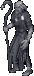

=== "Info"

    

    <table>
    <tr>
        <th>Spawn Locations</th>
        <td id="Ancient-Lich_Spawn-Locations" colspan="3"></td>
    </tr>
    <tr>
        <th>Base Damage</th>
        <td id="Ancient-Lich_Base-Damage"></td>
        <th>Armor Rating</th>
        <td id="Ancient-Lich_Armor-Rating"></td>
    </tr>
    <tr>
        <th>Fame</th>
        <td id="Ancient-Lich_Fame"></td>
        <th>Karma</th>
        <td id="Ancient-Lich_Karma"></td>
    </tr>
    <tr>
        <th>Super Slayer</th>
        <td id="Ancient-Lich_Super-Slayer"></td>
        <th>Minor Slayer</th>
        <td id="Ancient-Lich_Minor-Slayer"></td>
    </tr>
    <tr>
        <th>Barding Difficulty</th>
        <td id="Ancient-Lich_Barding-Difficulty"></td>
        <th>Taming Difficulty</th>
        <td id="Ancient-Lich_Taming-Difficulty"></td>
    </tr>
    </table>
    

=== "Attributes"

    

    <table>
    <tr>
        <th>Hit Points</th>
        <td id="Ancient-Lich_Hit-Points"></td>
        <th>Strength</th>
        <td id="Ancient-Lich_Strength"></td>
    </tr>
    <tr>
        <th>Stamina</th>
        <td id="Ancient-Lich_Stamina"></td>
        <th>Dexterity</th>
        <td id="Ancient-Lich_Dexterity"></td>
    </tr>
    <tr>
        <th>Mana</th>
        <td id="Ancient-Lich_Mana"></td>
        <th>Intelligence</th>
        <td id="Ancient-Lich_Intelligence"></td>
    </tr>
    </table>
    

=== "Skills"

    

    <table>
    <tr>
        <th>Wrestling</th>
        <td id="Ancient-Lich_Wrestling"></td>
        <th>Magery</th>
        <td id="Ancient-Lich_Magery"></td>
    </tr>
    <tr>
        <th>Tactics</th>
        <td id="Ancient-Lich_Tactics"></td>
        <th>Meditation</th>
        <td id="Ancient-Lich_Meditation"></td>
    </tr>
    <tr>
        <th>Resisting Spells</th>
        <td id="Ancient-Lich_Resisting-Spells"></td>
        <th>Evaluating Intelligence</th>
        <td id="Ancient-Lich_Evaluating-Intelligence"></td>
    </tr>
    <tr>
        <th>Anatomy</th>
        <td id="Ancient-Lich_Anatomy"></td>
        <th>Poisoning</th>
        <td id="Ancient-Lich_Poisoning"></td>
    </tr>
    </table>
    

=== "Loot"

    

    <table>
    <tr>
        <th>Gold</th>
        <td id="Ancient-Lich_Gold"></td>
    </tr>
    <tr>
        <th>Treasure Map lvl</th>
        <td id="Ancient-Lich_Treasure-Map-lvl"></td>
    </tr>
        <tr>
        <th>Slayer Drop</th>
        <td id="Ancient-Lich_Slayer-Drop"></td>
    </tr>
    </table>
    

### Ancient Lich Rift

!!! warning
    Under construction.

=== "Info"

    

    <table>
    <tr>
        <th>Spawn Locations</th>
        <td id="Ancient-Lich-Rift_Spawn-Locations" colspan="3"></td>
    </tr>
    <tr>
        <th>Base Damage</th>
        <td id="Ancient-Lich-Rift_Base-Damage"></td>
        <th>Armor Rating</th>
        <td id="Ancient-Lich-Rift_Armor-Rating"></td>
    </tr>
    <tr>
        <th>Fame</th>
        <td id="Ancient-Lich-Rift_Fame"></td>
        <th>Karma</th>
        <td id="Ancient-Lich-Rift_Karma"></td>
    </tr>
    <tr>
        <th>Super Slayer</th>
        <td id="Ancient-Lich-Rift_Super-Slayer"></td>
        <th>Minor Slayer</th>
        <td id="Ancient-Lich-Rift_Minor-Slayer"></td>
    </tr>
    <tr>
        <th>Barding Difficulty</th>
        <td id="Ancient-Lich-Rift_Barding-Difficulty"></td>
        <th>Taming Difficulty</th>
        <td id="Ancient-Lich-Rift_Taming-Difficulty"></td>
    </tr>
    </table>
    

=== "Attributes"

    

    <table>
    <tr>
        <th>Hit Points</th>
        <td id="Ancient-Lich-Rift_Hit-Points"></td>
        <th>Strength</th>
        <td id="Ancient-Lich-Rift_Strength"></td>
    </tr>
    <tr>
        <th>Stamina</th>
        <td id="Ancient-Lich-Rift_Stamina"></td>
        <th>Dexterity</th>
        <td id="Ancient-Lich-Rift_Dexterity"></td>
    </tr>
    <tr>
        <th>Mana</th>
        <td id="Ancient-Lich-Rift_Mana"></td>
        <th>Intelligence</th>
        <td id="Ancient-Lich-Rift_Intelligence"></td>
    </tr>
    </table>
    

=== "Skills"

    

    <table>
    <tr>
        <th>Wrestling</th>
        <td id="Ancient-Lich-Rift_Wrestling"></td>
        <th>Magery</th>
        <td id="Ancient-Lich-Rift_Magery"></td>
    </tr>
    <tr>
        <th>Tactics</th>
        <td id="Ancient-Lich-Rift_Tactics"></td>
        <th>Meditation</th>
        <td id="Ancient-Lich-Rift_Meditation"></td>
    </tr>
    <tr>
        <th>Resisting Spells</th>
        <td id="Ancient-Lich-Rift_Resisting-Spells"></td>
        <th>Evaluating Intelligence</th>
        <td id="Ancient-Lich-Rift_Evaluating-Intelligence"></td>
    </tr>
    <tr>
        <th>Anatomy</th>
        <td id="Ancient-Lich-Rift_Anatomy"></td>
        <th>Poisoning</th>
        <td id="Ancient-Lich-Rift_Poisoning"></td>
    </tr>
    </table>
    

=== "Loot"

    

    <table>
    <tr>
        <th>Gold</th>
        <td id="Ancient-Lich-Rift_Gold"></td>
    </tr>
    <tr>
        <th>Treasure Map lvl</th>
        <td id="Ancient-Lich-Rift_Treasure-Map-lvl"></td>
    </tr>
        <tr>
        <th>Slayer Drop</th>
        <td id="Ancient-Lich-Rift_Slayer-Drop"></td>
    </tr>
    </table>
    

### Ancient Pirate Mummy

!!! warning
    Under construction.

=== "Info"

    

    <table>
    <tr>
        <th>Spawn Locations</th>
        <td id="Ancient-Pirate-Mummy_Spawn-Locations" colspan="3"></td>
    </tr>
    <tr>
        <th>Base Damage</th>
        <td id="Ancient-Pirate-Mummy_Base-Damage"></td>
        <th>Armor Rating</th>
        <td id="Ancient-Pirate-Mummy_Armor-Rating"></td>
    </tr>
    <tr>
        <th>Fame</th>
        <td id="Ancient-Pirate-Mummy_Fame"></td>
        <th>Karma</th>
        <td id="Ancient-Pirate-Mummy_Karma"></td>
    </tr>
    <tr>
        <th>Super Slayer</th>
        <td id="Ancient-Pirate-Mummy_Super-Slayer"></td>
        <th>Minor Slayer</th>
        <td id="Ancient-Pirate-Mummy_Minor-Slayer"></td>
    </tr>
    <tr>
        <th>Barding Difficulty</th>
        <td id="Ancient-Pirate-Mummy_Barding-Difficulty"></td>
        <th>Taming Difficulty</th>
        <td id="Ancient-Pirate-Mummy_Taming-Difficulty"></td>
    </tr>
    </table>
    

=== "Attributes"

    

    <table>
    <tr>
        <th>Hit Points</th>
        <td id="Ancient-Pirate-Mummy_Hit-Points"></td>
        <th>Strength</th>
        <td id="Ancient-Pirate-Mummy_Strength"></td>
    </tr>
    <tr>
        <th>Stamina</th>
        <td id="Ancient-Pirate-Mummy_Stamina"></td>
        <th>Dexterity</th>
        <td id="Ancient-Pirate-Mummy_Dexterity"></td>
    </tr>
    <tr>
        <th>Mana</th>
        <td id="Ancient-Pirate-Mummy_Mana"></td>
        <th>Intelligence</th>
        <td id="Ancient-Pirate-Mummy_Intelligence"></td>
    </tr>
    </table>
    

=== "Skills"

    

    <table>
    <tr>
        <th>Wrestling</th>
        <td id="Ancient-Pirate-Mummy_Wrestling"></td>
        <th>Magery</th>
        <td id="Ancient-Pirate-Mummy_Magery"></td>
    </tr>
    <tr>
        <th>Tactics</th>
        <td id="Ancient-Pirate-Mummy_Tactics"></td>
        <th>Meditation</th>
        <td id="Ancient-Pirate-Mummy_Meditation"></td>
    </tr>
    <tr>
        <th>Resisting Spells</th>
        <td id="Ancient-Pirate-Mummy_Resisting-Spells"></td>
        <th>Evaluating Intelligence</th>
        <td id="Ancient-Pirate-Mummy_Evaluating-Intelligence"></td>
    </tr>
    <tr>
        <th>Anatomy</th>
        <td id="Ancient-Pirate-Mummy_Anatomy"></td>
        <th>Poisoning</th>
        <td id="Ancient-Pirate-Mummy_Poisoning"></td>
    </tr>
    </table>
    

=== "Loot"

    

    <table>
    <tr>
        <th>Gold</th>
        <td id="Ancient-Pirate-Mummy_Gold"></td>
    </tr>
    <tr>
        <th>Treasure Map lvl</th>
        <td id="Ancient-Pirate-Mummy_Treasure-Map-lvl"></td>
    </tr>
        <tr>
        <th>Slayer Drop</th>
        <td id="Ancient-Pirate-Mummy_Slayer-Drop"></td>
    </tr>
    </table>
    

### Ancient Sea Serpent

!!! warning
    Under construction.

=== "Info"

    

    <table>
    <tr>
        <th>Spawn Locations</th>
        <td id="Ancient-Sea-Serpent_Spawn-Locations" colspan="3"></td>
    </tr>
    <tr>
        <th>Base Damage</th>
        <td id="Ancient-Sea-Serpent_Base-Damage"></td>
        <th>Armor Rating</th>
        <td id="Ancient-Sea-Serpent_Armor-Rating"></td>
    </tr>
    <tr>
        <th>Fame</th>
        <td id="Ancient-Sea-Serpent_Fame"></td>
        <th>Karma</th>
        <td id="Ancient-Sea-Serpent_Karma"></td>
    </tr>
    <tr>
        <th>Super Slayer</th>
        <td id="Ancient-Sea-Serpent_Super-Slayer"></td>
        <th>Minor Slayer</th>
        <td id="Ancient-Sea-Serpent_Minor-Slayer"></td>
    </tr>
    <tr>
        <th>Barding Difficulty</th>
        <td id="Ancient-Sea-Serpent_Barding-Difficulty"></td>
        <th>Taming Difficulty</th>
        <td id="Ancient-Sea-Serpent_Taming-Difficulty"></td>
    </tr>
    </table>
    

=== "Attributes"

    

    <table>
    <tr>
        <th>Hit Points</th>
        <td id="Ancient-Sea-Serpent_Hit-Points"></td>
        <th>Strength</th>
        <td id="Ancient-Sea-Serpent_Strength"></td>
    </tr>
    <tr>
        <th>Stamina</th>
        <td id="Ancient-Sea-Serpent_Stamina"></td>
        <th>Dexterity</th>
        <td id="Ancient-Sea-Serpent_Dexterity"></td>
    </tr>
    <tr>
        <th>Mana</th>
        <td id="Ancient-Sea-Serpent_Mana"></td>
        <th>Intelligence</th>
        <td id="Ancient-Sea-Serpent_Intelligence"></td>
    </tr>
    </table>
    

=== "Skills"

    

    <table>
    <tr>
        <th>Wrestling</th>
        <td id="Ancient-Sea-Serpent_Wrestling"></td>
        <th>Magery</th>
        <td id="Ancient-Sea-Serpent_Magery"></td>
    </tr>
    <tr>
        <th>Tactics</th>
        <td id="Ancient-Sea-Serpent_Tactics"></td>
        <th>Meditation</th>
        <td id="Ancient-Sea-Serpent_Meditation"></td>
    </tr>
    <tr>
        <th>Resisting Spells</th>
        <td id="Ancient-Sea-Serpent_Resisting-Spells"></td>
        <th>Evaluating Intelligence</th>
        <td id="Ancient-Sea-Serpent_Evaluating-Intelligence"></td>
    </tr>
    <tr>
        <th>Anatomy</th>
        <td id="Ancient-Sea-Serpent_Anatomy"></td>
        <th>Poisoning</th>
        <td id="Ancient-Sea-Serpent_Poisoning"></td>
    </tr>
    </table>
    

=== "Loot"

    

    <table>
    <tr>
        <th>Gold</th>
        <td id="Ancient-Sea-Serpent_Gold"></td>
    </tr>
    <tr>
        <th>Treasure Map lvl</th>
        <td id="Ancient-Sea-Serpent_Treasure-Map-lvl"></td>
    </tr>
        <tr>
        <th>Slayer Drop</th>
        <td id="Ancient-Sea-Serpent_Slayer-Drop"></td>
    </tr>
    </table>
    

### Ancient Wyrm

=== "Info"

    

    <table>
    <tr>
        <th>Spawn Locations</th>
        <td id="Ancient-Wyrm_Spawn-Locations" colspan="3"></td>
    </tr>
    <tr>
        <th>Base Damage</th>
        <td id="Ancient-Wyrm_Base-Damage"></td>
        <th>Armor Rating</th>
        <td id="Ancient-Wyrm_Armor-Rating"></td>
    </tr>
    <tr>
        <th>Fame</th>
        <td id="Ancient-Wyrm_Fame"></td>
        <th>Karma</th>
        <td id="Ancient-Wyrm_Karma"></td>
    </tr>
    <tr>
        <th>Super Slayer</th>
        <td id="Ancient-Wyrm_Super-Slayer"></td>
        <th>Minor Slayer</th>
        <td id="Ancient-Wyrm_Minor-Slayer"></td>
    </tr>
    <tr>
        <th>Barding Difficulty</th>
        <td id="Ancient-Wyrm_Barding-Difficulty"></td>
        <th>Taming Difficulty</th>
        <td id="Ancient-Wyrm_Taming-Difficulty"></td>
    </tr>
    </table>
    

=== "Attributes"

    

    <table>
    <tr>
        <th>Hit Points</th>
        <td id="Ancient-Wyrm_Hit-Points"></td>
        <th>Strength</th>
        <td id="Ancient-Wyrm_Strength"></td>
    </tr>
    <tr>
        <th>Stamina</th>
        <td id="Ancient-Wyrm_Stamina"></td>
        <th>Dexterity</th>
        <td id="Ancient-Wyrm_Dexterity"></td>
    </tr>
    <tr>
        <th>Mana</th>
        <td id="Ancient-Wyrm_Mana"></td>
        <th>Intelligence</th>
        <td id="Ancient-Wyrm_Intelligence"></td>
    </tr>
    </table>
    

=== "Skills"

    

    <table>
    <tr>
        <th>Wrestling</th>
        <td id="Ancient-Wyrm_Wrestling"></td>
        <th>Magery</th>
        <td id="Ancient-Wyrm_Magery"></td>
    </tr>
    <tr>
        <th>Tactics</th>
        <td id="Ancient-Wyrm_Tactics"></td>
        <th>Meditation</th>
        <td id="Ancient-Wyrm_Meditation"></td>
    </tr>
    <tr>
        <th>Resisting Spells</th>
        <td id="Ancient-Wyrm_Resisting-Spells"></td>
        <th>Evaluating Intelligence</th>
        <td id="Ancient-Wyrm_Evaluating-Intelligence"></td>
    </tr>
    <tr>
        <th>Anatomy</th>
        <td id="Ancient-Wyrm_Anatomy"></td>
        <th>Poisoning</th>
        <td id="Ancient-Wyrm_Poisoning"></td>
    </tr>
    </table>
    

=== "Loot"

    

    <table>
    <tr>
        <th>Gold</th>
        <td id="Ancient-Wyrm_Gold"></td>
    </tr>
    <tr>
        <th>Treasure Map lvl</th>
        <td id="Ancient-Wyrm_Treasure-Map-lvl"></td>
    </tr>
        <tr>
        <th>Slayer Drop</th>
        <td id="Ancient-Wyrm_Slayer-Drop"></td>
    </tr>
    </table>
    

### Arcane Corsair

!!! warning
    Under construction.

=== "Info"

    

    <table>
    <tr>
        <th>Spawn Locations</th>
        <td id="Arcane-Corsair_Spawn-Locations" colspan="3"></td>
    </tr>
    <tr>
        <th>Base Damage</th>
        <td id="Arcane-Corsair_Base-Damage"></td>
        <th>Armor Rating</th>
        <td id="Arcane-Corsair_Armor-Rating"></td>
    </tr>
    <tr>
        <th>Fame</th>
        <td id="Arcane-Corsair_Fame"></td>
        <th>Karma</th>
        <td id="Arcane-Corsair_Karma"></td>
    </tr>
    <tr>
        <th>Super Slayer</th>
        <td id="Arcane-Corsair_Super-Slayer"></td>
        <th>Minor Slayer</th>
        <td id="Arcane-Corsair_Minor-Slayer"></td>
    </tr>
    <tr>
        <th>Barding Difficulty</th>
        <td id="Arcane-Corsair_Barding-Difficulty"></td>
        <th>Taming Difficulty</th>
        <td id="Arcane-Corsair_Taming-Difficulty"></td>
    </tr>
    </table>
    

=== "Attributes"

    

    <table>
    <tr>
        <th>Hit Points</th>
        <td id="Arcane-Corsair_Hit-Points"></td>
        <th>Strength</th>
        <td id="Arcane-Corsair_Strength"></td>
    </tr>
    <tr>
        <th>Stamina</th>
        <td id="Arcane-Corsair_Stamina"></td>
        <th>Dexterity</th>
        <td id="Arcane-Corsair_Dexterity"></td>
    </tr>
    <tr>
        <th>Mana</th>
        <td id="Arcane-Corsair_Mana"></td>
        <th>Intelligence</th>
        <td id="Arcane-Corsair_Intelligence"></td>
    </tr>
    </table>
    

=== "Skills"

    

    <table>
    <tr>
        <th>Wrestling</th>
        <td id="Arcane-Corsair_Wrestling"></td>
        <th>Magery</th>
        <td id="Arcane-Corsair_Magery"></td>
    </tr>
    <tr>
        <th>Tactics</th>
        <td id="Arcane-Corsair_Tactics"></td>
        <th>Meditation</th>
        <td id="Arcane-Corsair_Meditation"></td>
    </tr>
    <tr>
        <th>Resisting Spells</th>
        <td id="Arcane-Corsair_Resisting-Spells"></td>
        <th>Evaluating Intelligence</th>
        <td id="Arcane-Corsair_Evaluating-Intelligence"></td>
    </tr>
    <tr>
        <th>Anatomy</th>
        <td id="Arcane-Corsair_Anatomy"></td>
        <th>Poisoning</th>
        <td id="Arcane-Corsair_Poisoning"></td>
    </tr>
    </table>
    

=== "Loot"

    

    <table>
    <tr>
        <th>Gold</th>
        <td id="Arcane-Corsair_Gold"></td>
    </tr>
    <tr>
        <th>Treasure Map lvl</th>
        <td id="Arcane-Corsair_Treasure-Map-lvl"></td>
    </tr>
        <tr>
        <th>Slayer Drop</th>
        <td id="Arcane-Corsair_Slayer-Drop"></td>
    </tr>
    </table>
    

### Arcane Daemon

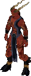

=== "Info"

    

    <table>
    <tr>
        <th>Spawn Locations</th>
        <td id="Arcane-Daemon_Spawn-Locations" colspan="3"></td>
    </tr>
    <tr>
        <th>Base Damage</th>
        <td id="Arcane-Daemon_Base-Damage"></td>
        <th>Armor Rating</th>
        <td id="Arcane-Daemon_Armor-Rating"></td>
    </tr>
    <tr>
        <th>Fame</th>
        <td id="Arcane-Daemon_Fame"></td>
        <th>Karma</th>
        <td id="Arcane-Daemon_Karma"></td>
    </tr>
    <tr>
        <th>Super Slayer</th>
        <td id="Arcane-Daemon_Super-Slayer"></td>
        <th>Minor Slayer</th>
        <td id="Arcane-Daemon_Minor-Slayer"></td>
    </tr>
    <tr>
        <th>Barding Difficulty</th>
        <td id="Arcane-Daemon_Barding-Difficulty"></td>
        <th>Taming Difficulty</th>
        <td id="Arcane-Daemon_Taming-Difficulty"></td>
    </tr>
    </table>
    

=== "Attributes"

    

    <table>
    <tr>
        <th>Hit Points</th>
        <td id="Arcane-Daemon_Hit-Points"></td>
        <th>Strength</th>
        <td id="Arcane-Daemon_Strength"></td>
    </tr>
    <tr>
        <th>Stamina</th>
        <td id="Arcane-Daemon_Stamina"></td>
        <th>Dexterity</th>
        <td id="Arcane-Daemon_Dexterity"></td>
    </tr>
    <tr>
        <th>Mana</th>
        <td id="Arcane-Daemon_Mana"></td>
        <th>Intelligence</th>
        <td id="Arcane-Daemon_Intelligence"></td>
    </tr>
    </table>
    

=== "Skills"

    

    <table>
    <tr>
        <th>Wrestling</th>
        <td id="Arcane-Daemon_Wrestling"></td>
        <th>Magery</th>
        <td id="Arcane-Daemon_Magery"></td>
    </tr>
    <tr>
        <th>Tactics</th>
        <td id="Arcane-Daemon_Tactics"></td>
        <th>Meditation</th>
        <td id="Arcane-Daemon_Meditation"></td>
    </tr>
    <tr>
        <th>Resisting Spells</th>
        <td id="Arcane-Daemon_Resisting-Spells"></td>
        <th>Evaluating Intelligence</th>
        <td id="Arcane-Daemon_Evaluating-Intelligence"></td>
    </tr>
    <tr>
        <th>Anatomy</th>
        <td id="Arcane-Daemon_Anatomy"></td>
        <th>Poisoning</th>
        <td id="Arcane-Daemon_Poisoning"></td>
    </tr>
    </table>
    

=== "Loot"

    

    <table>
    <tr>
        <th>Gold</th>
        <td id="Arcane-Daemon_Gold"></td>
    </tr>
    <tr>
        <th>Treasure Map lvl</th>
        <td id="Arcane-Daemon_Treasure-Map-lvl"></td>
    </tr>
        <tr>
        <th>Slayer Drop</th>
        <td id="Arcane-Daemon_Slayer-Drop"></td>
    </tr>
    </table>
    

### Arctic Ogre Lord

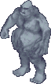

=== "Info"

    

    <table>
    <tr>
        <th>Spawn Locations</th>
        <td id="Arctic-Ogre-Lord_Spawn-Locations" colspan="3"></td>
    </tr>
    <tr>
        <th>Base Damage</th>
        <td id="Arctic-Ogre-Lord_Base-Damage"></td>
        <th>Armor Rating</th>
        <td id="Arctic-Ogre-Lord_Armor-Rating"></td>
    </tr>
    <tr>
        <th>Fame</th>
        <td id="Arctic-Ogre-Lord_Fame"></td>
        <th>Karma</th>
        <td id="Arctic-Ogre-Lord_Karma"></td>
    </tr>
    <tr>
        <th>Super Slayer</th>
        <td id="Arctic-Ogre-Lord_Super-Slayer"></td>
        <th>Minor Slayer</th>
        <td id="Arctic-Ogre-Lord_Minor-Slayer"></td>
    </tr>
    <tr>
        <th>Barding Difficulty</th>
        <td id="Arctic-Ogre-Lord_Barding-Difficulty"></td>
        <th>Taming Difficulty</th>
        <td id="Arctic-Ogre-Lord_Taming-Difficulty"></td>
    </tr>
    </table>
    

=== "Attributes"

    

    <table>
    <tr>
        <th>Hit Points</th>
        <td id="Arctic-Ogre-Lord_Hit-Points"></td>
        <th>Strength</th>
        <td id="Arctic-Ogre-Lord_Strength"></td>
    </tr>
    <tr>
        <th>Stamina</th>
        <td id="Arctic-Ogre-Lord_Stamina"></td>
        <th>Dexterity</th>
        <td id="Arctic-Ogre-Lord_Dexterity"></td>
    </tr>
    <tr>
        <th>Mana</th>
        <td id="Arctic-Ogre-Lord_Mana"></td>
        <th>Intelligence</th>
        <td id="Arctic-Ogre-Lord_Intelligence"></td>
    </tr>
    </table>
    

=== "Skills"

    

    <table>
    <tr>
        <th>Wrestling</th>
        <td id="Arctic-Ogre-Lord_Wrestling"></td>
        <th>Magery</th>
        <td id="Arctic-Ogre-Lord_Magery"></td>
    </tr>
    <tr>
        <th>Tactics</th>
        <td id="Arctic-Ogre-Lord_Tactics"></td>
        <th>Meditation</th>
        <td id="Arctic-Ogre-Lord_Meditation"></td>
    </tr>
    <tr>
        <th>Resisting Spells</th>
        <td id="Arctic-Ogre-Lord_Resisting-Spells"></td>
        <th>Evaluating Intelligence</th>
        <td id="Arctic-Ogre-Lord_Evaluating-Intelligence"></td>
    </tr>
    <tr>
        <th>Anatomy</th>
        <td id="Arctic-Ogre-Lord_Anatomy"></td>
        <th>Poisoning</th>
        <td id="Arctic-Ogre-Lord_Poisoning"></td>
    </tr>
    </table>
    

=== "Loot"

    

    <table>
    <tr>
        <th>Gold</th>
        <td id="Arctic-Ogre-Lord_Gold"></td>
    </tr>
    <tr>
        <th>Treasure Map lvl</th>
        <td id="Arctic-Ogre-Lord_Treasure-Map-lvl"></td>
    </tr>
        <tr>
        <th>Slayer Drop</th>
        <td id="Arctic-Ogre-Lord_Slayer-Drop"></td>
    </tr>
    </table>
    

### Balron

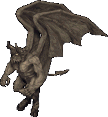

=== "Info"

    

    <table>
    <tr>
        <th>Spawn Locations</th>
        <td id="Balron_Spawn-Locations" colspan="3"></td>
    </tr>
    <tr>
        <th>Base Damage</th>
        <td id="Balron_Base-Damage"></td>
        <th>Armor Rating</th>
        <td id="Balron_Armor-Rating"></td>
    </tr>
    <tr>
        <th>Fame</th>
        <td id="Balron_Fame"></td>
        <th>Karma</th>
        <td id="Balron_Karma"></td>
    </tr>
    <tr>
        <th>Super Slayer</th>
        <td id="Balron_Super-Slayer"></td>
        <th>Minor Slayer</th>
        <td id="Balron_Minor-Slayer"></td>
    </tr>
    <tr>
        <th>Barding Difficulty</th>
        <td id="Balron_Barding-Difficulty"></td>
        <th>Taming Difficulty</th>
        <td id="Balron_Taming-Difficulty"></td>
    </tr>
    </table>
    

=== "Attributes"

    

    <table>
    <tr>
        <th>Hit Points</th>
        <td id="Balron_Hit-Points"></td>
        <th>Strength</th>
        <td id="Balron_Strength"></td>
    </tr>
    <tr>
        <th>Stamina</th>
        <td id="Balron_Stamina"></td>
        <th>Dexterity</th>
        <td id="Balron_Dexterity"></td>
    </tr>
    <tr>
        <th>Mana</th>
        <td id="Balron_Mana"></td>
        <th>Intelligence</th>
        <td id="Balron_Intelligence"></td>
    </tr>
    </table>
    

=== "Skills"

    

    <table>
    <tr>
        <th>Wrestling</th>
        <td id="Balron_Wrestling"></td>
        <th>Magery</th>
        <td id="Balron_Magery"></td>
    </tr>
    <tr>
        <th>Tactics</th>
        <td id="Balron_Tactics"></td>
        <th>Meditation</th>
        <td id="Balron_Meditation"></td>
    </tr>
    <tr>
        <th>Resisting Spells</th>
        <td id="Balron_Resisting-Spells"></td>
        <th>Evaluating Intelligence</th>
        <td id="Balron_Evaluating-Intelligence"></td>
    </tr>
    <tr>
        <th>Anatomy</th>
        <td id="Balron_Anatomy"></td>
        <th>Poisoning</th>
        <td id="Balron_Poisoning"></td>
    </tr>
    </table>
    

=== "Loot"

    

    <table>
    <tr>
        <th>Gold</th>
        <td id="Balron_Gold"></td>
    </tr>
    <tr>
        <th>Treasure Map lvl</th>
        <td id="Balron_Treasure-Map-lvl"></td>
    </tr>
        <tr>
        <th>Slayer Drop</th>
        <td id="Balron_Slayer-Drop"></td>
    </tr>
    </table>
    

### Barracoon

=== "Info"

    

    <table>
    <tr>
        <th>Spawn Locations</th>
        <td id="Barracoon_Spawn-Locations" colspan="3"></td>
    </tr>
    <tr>
        <th>Base Damage</th>
        <td id="Barracoon_Base-Damage"></td>
        <th>Armor Rating</th>
        <td id="Barracoon_Armor-Rating"></td>
    </tr>
    <tr>
        <th>Fame</th>
        <td id="Barracoon_Fame"></td>
        <th>Karma</th>
        <td id="Barracoon_Karma"></td>
    </tr>
    <tr>
        <th>Super Slayer</th>
        <td id="Barracoon_Super-Slayer"></td>
        <th>Minor Slayer</th>
        <td id="Barracoon_Minor-Slayer"></td>
    </tr>
    <tr>
        <th>Barding Difficulty</th>
        <td id="Barracoon_Barding-Difficulty"></td>
        <th>Taming Difficulty</th>
        <td id="Barracoon_Taming-Difficulty"></td>
    </tr>
    </table>
    

=== "Attributes"

    

    <table>
    <tr>
        <th>Hit Points</th>
        <td id="Barracoon_Hit-Points"></td>
        <th>Strength</th>
        <td id="Barracoon_Strength"></td>
    </tr>
    <tr>
        <th>Stamina</th>
        <td id="Barracoon_Stamina"></td>
        <th>Dexterity</th>
        <td id="Barracoon_Dexterity"></td>
    </tr>
    <tr>
        <th>Mana</th>
        <td id="Barracoon_Mana"></td>
        <th>Intelligence</th>
        <td id="Barracoon_Intelligence"></td>
    </tr>
    </table>
    

=== "Skills"

    

    <table>
    <tr>
        <th>Wrestling</th>
        <td id="Barracoon_Wrestling"></td>
        <th>Magery</th>
        <td id="Barracoon_Magery"></td>
    </tr>
    <tr>
        <th>Tactics</th>
        <td id="Barracoon_Tactics"></td>
        <th>Meditation</th>
        <td id="Barracoon_Meditation"></td>
    </tr>
    <tr>
        <th>Resisting Spells</th>
        <td id="Barracoon_Resisting-Spells"></td>
        <th>Evaluating Intelligence</th>
        <td id="Barracoon_Evaluating-Intelligence"></td>
    </tr>
    <tr>
        <th>Anatomy</th>
        <td id="Barracoon_Anatomy"></td>
        <th>Poisoning</th>
        <td id="Barracoon_Poisoning"></td>
    </tr>
    </table>
    

=== "Loot"

    

    <table>
    <tr>
        <th>Gold</th>
        <td id="Barracoon_Gold"></td>
    </tr>
    <tr>
        <th>Treasure Map lvl</th>
        <td id="Barracoon_Treasure-Map-lvl"></td>
    </tr>
        <tr>
        <th>Slayer Drop</th>
        <td id="Barracoon_Slayer-Drop"></td>
    </tr>
    </table>
    

### Black Bear

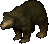

=== "Info"

    

    <table>
    <tr>
        <th>Spawn Locations</th>
        <td id="Black-Bear_Spawn-Locations" colspan="3"></td>
    </tr>
    <tr>
        <th>Base Damage</th>
        <td id="Black-Bear_Base-Damage"></td>
        <th>Armor Rating</th>
        <td id="Black-Bear_Armor-Rating"></td>
    </tr>
    <tr>
        <th>Fame</th>
        <td id="Black-Bear_Fame"></td>
        <th>Karma</th>
        <td id="Black-Bear_Karma"></td>
    </tr>
    <tr>
        <th>Super Slayer</th>
        <td id="Black-Bear_Super-Slayer"></td>
        <th>Minor Slayer</th>
        <td id="Black-Bear_Minor-Slayer"></td>
    </tr>
    <tr>
        <th>Barding Difficulty</th>
        <td id="Black-Bear_Barding-Difficulty"></td>
        <th>Taming Difficulty</th>
        <td id="Black-Bear_Taming-Difficulty"></td>
    </tr>
    </table>
    

=== "Attributes"

    

    <table>
    <tr>
        <th>Hit Points</th>
        <td id="Black-Bear_Hit-Points"></td>
        <th>Strength</th>
        <td id="Black-Bear_Strength"></td>
    </tr>
    <tr>
        <th>Stamina</th>
        <td id="Black-Bear_Stamina"></td>
        <th>Dexterity</th>
        <td id="Black-Bear_Dexterity"></td>
    </tr>
    <tr>
        <th>Mana</th>
        <td id="Black-Bear_Mana"></td>
        <th>Intelligence</th>
        <td id="Black-Bear_Intelligence"></td>
    </tr>
    </table>
    

=== "Skills"

    

    <table>
    <tr>
        <th>Wrestling</th>
        <td id="Black-Bear_Wrestling"></td>
        <th>Magery</th>
        <td id="Black-Bear_Magery"></td>
    </tr>
    <tr>
        <th>Tactics</th>
        <td id="Black-Bear_Tactics"></td>
        <th>Meditation</th>
        <td id="Black-Bear_Meditation"></td>
    </tr>
    <tr>
        <th>Resisting Spells</th>
        <td id="Black-Bear_Resisting-Spells"></td>
        <th>Evaluating Intelligence</th>
        <td id="Black-Bear_Evaluating-Intelligence"></td>
    </tr>
    <tr>
        <th>Anatomy</th>
        <td id="Black-Bear_Anatomy"></td>
        <th>Poisoning</th>
        <td id="Black-Bear_Poisoning"></td>
    </tr>
    </table>
    

=== "Loot"

    

    <table>
    <tr>
        <th>Gold</th>
        <td id="Black-Bear_Gold"></td>
    </tr>
    <tr>
        <th>Treasure Map lvl</th>
        <td id="Black-Bear_Treasure-Map-lvl"></td>
    </tr>
        <tr>
        <th>Slayer Drop</th>
        <td id="Black-Bear_Slayer-Drop"></td>
    </tr>
    </table>
    

### Blood Elemental

=== "Info"

    

    <table>
    <tr>
        <th>Spawn Locations</th>
        <td id="Blood-Elemental_Spawn-Locations" colspan="3"></td>
    </tr>
    <tr>
        <th>Base Damage</th>
        <td id="Blood-Elemental_Base-Damage"></td>
        <th>Armor Rating</th>
        <td id="Blood-Elemental_Armor-Rating"></td>
    </tr>
    <tr>
        <th>Fame</th>
        <td id="Blood-Elemental_Fame"></td>
        <th>Karma</th>
        <td id="Blood-Elemental_Karma"></td>
    </tr>
    <tr>
        <th>Super Slayer</th>
        <td id="Blood-Elemental_Super-Slayer"></td>
        <th>Minor Slayer</th>
        <td id="Blood-Elemental_Minor-Slayer"></td>
    </tr>
    <tr>
        <th>Barding Difficulty</th>
        <td id="Blood-Elemental_Barding-Difficulty"></td>
        <th>Taming Difficulty</th>
        <td id="Blood-Elemental_Taming-Difficulty"></td>
    </tr>
    </table>
    

=== "Attributes"

    

    <table>
    <tr>
        <th>Hit Points</th>
        <td id="Blood-Elemental_Hit-Points"></td>
        <th>Strength</th>
        <td id="Blood-Elemental_Strength"></td>
    </tr>
    <tr>
        <th>Stamina</th>
        <td id="Blood-Elemental_Stamina"></td>
        <th>Dexterity</th>
        <td id="Blood-Elemental_Dexterity"></td>
    </tr>
    <tr>
        <th>Mana</th>
        <td id="Blood-Elemental_Mana"></td>
        <th>Intelligence</th>
        <td id="Blood-Elemental_Intelligence"></td>
    </tr>
    </table>
    

=== "Skills"

    

    <table>
    <tr>
        <th>Wrestling</th>
        <td id="Blood-Elemental_Wrestling"></td>
        <th>Magery</th>
        <td id="Blood-Elemental_Magery"></td>
    </tr>
    <tr>
        <th>Tactics</th>
        <td id="Blood-Elemental_Tactics"></td>
        <th>Meditation</th>
        <td id="Blood-Elemental_Meditation"></td>
    </tr>
    <tr>
        <th>Resisting Spells</th>
        <td id="Blood-Elemental_Resisting-Spells"></td>
        <th>Evaluating Intelligence</th>
        <td id="Blood-Elemental_Evaluating-Intelligence"></td>
    </tr>
    <tr>
        <th>Anatomy</th>
        <td id="Blood-Elemental_Anatomy"></td>
        <th>Poisoning</th>
        <td id="Blood-Elemental_Poisoning"></td>
    </tr>
    </table>
    

=== "Loot"

    

    <table>
    <tr>
        <th>Gold</th>
        <td id="Blood-Elemental_Gold"></td>
    </tr>
    <tr>
        <th>Treasure Map lvl</th>
        <td id="Blood-Elemental_Treasure-Map-lvl"></td>
    </tr>
        <tr>
        <th>Slayer Drop</th>
        <td id="Blood-Elemental_Slayer-Drop"></td>
    </tr>
    </table>
    

### Boar

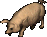

=== "Info"

    

    <table>
    <tr>
        <th>Spawn Locations</th>
        <td id="Boar_Spawn-Locations" colspan="3"></td>
    </tr>
    <tr>
        <th>Base Damage</th>
        <td id="Boar_Base-Damage"></td>
        <th>Armor Rating</th>
        <td id="Boar_Armor-Rating"></td>
    </tr>
    <tr>
        <th>Fame</th>
        <td id="Boar_Fame"></td>
        <th>Karma</th>
        <td id="Boar_Karma"></td>
    </tr>
    <tr>
        <th>Super Slayer</th>
        <td id="Boar_Super-Slayer"></td>
        <th>Minor Slayer</th>
        <td id="Boar_Minor-Slayer"></td>
    </tr>
    <tr>
        <th>Barding Difficulty</th>
        <td id="Boar_Barding-Difficulty"></td>
        <th>Taming Difficulty</th>
        <td id="Boar_Taming-Difficulty"></td>
    </tr>
    </table>
    

=== "Attributes"

    

    <table>
    <tr>
        <th>Hit Points</th>
        <td id="Boar_Hit-Points"></td>
        <th>Strength</th>
        <td id="Boar_Strength"></td>
    </tr>
    <tr>
        <th>Stamina</th>
        <td id="Boar_Stamina"></td>
        <th>Dexterity</th>
        <td id="Boar_Dexterity"></td>
    </tr>
    <tr>
        <th>Mana</th>
        <td id="Boar_Mana"></td>
        <th>Intelligence</th>
        <td id="Boar_Intelligence"></td>
    </tr>
    </table>
    

=== "Skills"

    

    <table>
    <tr>
        <th>Wrestling</th>
        <td id="Boar_Wrestling"></td>
        <th>Magery</th>
        <td id="Boar_Magery"></td>
    </tr>
    <tr>
        <th>Tactics</th>
        <td id="Boar_Tactics"></td>
        <th>Meditation</th>
        <td id="Boar_Meditation"></td>
    </tr>
    <tr>
        <th>Resisting Spells</th>
        <td id="Boar_Resisting-Spells"></td>
        <th>Evaluating Intelligence</th>
        <td id="Boar_Evaluating-Intelligence"></td>
    </tr>
    <tr>
        <th>Anatomy</th>
        <td id="Boar_Anatomy"></td>
        <th>Poisoning</th>
        <td id="Boar_Poisoning"></td>
    </tr>
    </table>
    

=== "Loot"

    

    <table>
    <tr>
        <th>Gold</th>
        <td id="Boar_Gold"></td>
    </tr>
    <tr>
        <th>Treasure Map lvl</th>
        <td id="Boar_Treasure-Map-lvl"></td>
    </tr>
        <tr>
        <th>Slayer Drop</th>
        <td id="Boar_Slayer-Drop"></td>
    </tr>
    </table>
    

### Bog Thing

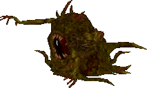

=== "Info"

    

    <table>
    <tr>
        <th>Spawn Locations</th>
        <td id="Bog-Thing_Spawn-Locations" colspan="3"></td>
    </tr>
    <tr>
        <th>Base Damage</th>
        <td id="Bog-Thing_Base-Damage"></td>
        <th>Armor Rating</th>
        <td id="Bog-Thing_Armor-Rating"></td>
    </tr>
    <tr>
        <th>Fame</th>
        <td id="Bog-Thing_Fame"></td>
        <th>Karma</th>
        <td id="Bog-Thing_Karma"></td>
    </tr>
    <tr>
        <th>Super Slayer</th>
        <td id="Bog-Thing_Super-Slayer"></td>
        <th>Minor Slayer</th>
        <td id="Bog-Thing_Minor-Slayer"></td>
    </tr>
    <tr>
        <th>Barding Difficulty</th>
        <td id="Bog-Thing_Barding-Difficulty"></td>
        <th>Taming Difficulty</th>
        <td id="Bog-Thing_Taming-Difficulty"></td>
    </tr>
    </table>
    

=== "Attributes"

    

    <table>
    <tr>
        <th>Hit Points</th>
        <td id="Bog-Thing_Hit-Points"></td>
        <th>Strength</th>
        <td id="Bog-Thing_Strength"></td>
    </tr>
    <tr>
        <th>Stamina</th>
        <td id="Bog-Thing_Stamina"></td>
        <th>Dexterity</th>
        <td id="Bog-Thing_Dexterity"></td>
    </tr>
    <tr>
        <th>Mana</th>
        <td id="Bog-Thing_Mana"></td>
        <th>Intelligence</th>
        <td id="Bog-Thing_Intelligence"></td>
    </tr>
    </table>
    

=== "Skills"

    

    <table>
    <tr>
        <th>Wrestling</th>
        <td id="Bog-Thing_Wrestling"></td>
        <th>Magery</th>
        <td id="Bog-Thing_Magery"></td>
    </tr>
    <tr>
        <th>Tactics</th>
        <td id="Bog-Thing_Tactics"></td>
        <th>Meditation</th>
        <td id="Bog-Thing_Meditation"></td>
    </tr>
    <tr>
        <th>Resisting Spells</th>
        <td id="Bog-Thing_Resisting-Spells"></td>
        <th>Evaluating Intelligence</th>
        <td id="Bog-Thing_Evaluating-Intelligence"></td>
    </tr>
    <tr>
        <th>Anatomy</th>
        <td id="Bog-Thing_Anatomy"></td>
        <th>Poisoning</th>
        <td id="Bog-Thing_Poisoning"></td>
    </tr>
    </table>
    

=== "Loot"

    

    <table>
    <tr>
        <th>Gold</th>
        <td id="Bog-Thing_Gold"></td>
    </tr>
    <tr>
        <th>Treasure Map lvl</th>
        <td id="Bog-Thing_Treasure-Map-lvl"></td>
    </tr>
        <tr>
        <th>Slayer Drop</th>
        <td id="Bog-Thing_Slayer-Drop"></td>
    </tr>
    </table>
    

### Bogle

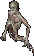

=== "Info"

    

    <table>
    <tr>
        <th>Spawn Locations</th>
        <td id="Bogle_Spawn-Locations" colspan="3"></td>
    </tr>
    <tr>
        <th>Base Damage</th>
        <td id="Bogle_Base-Damage"></td>
        <th>Armor Rating</th>
        <td id="Bogle_Armor-Rating"></td>
    </tr>
    <tr>
        <th>Fame</th>
        <td id="Bogle_Fame"></td>
        <th>Karma</th>
        <td id="Bogle_Karma"></td>
    </tr>
    <tr>
        <th>Super Slayer</th>
        <td id="Bogle_Super-Slayer"></td>
        <th>Minor Slayer</th>
        <td id="Bogle_Minor-Slayer"></td>
    </tr>
    <tr>
        <th>Barding Difficulty</th>
        <td id="Bogle_Barding-Difficulty"></td>
        <th>Taming Difficulty</th>
        <td id="Bogle_Taming-Difficulty"></td>
    </tr>
    </table>
    

=== "Attributes"

    

    <table>
    <tr>
        <th>Hit Points</th>
        <td id="Bogle_Hit-Points"></td>
        <th>Strength</th>
        <td id="Bogle_Strength"></td>
    </tr>
    <tr>
        <th>Stamina</th>
        <td id="Bogle_Stamina"></td>
        <th>Dexterity</th>
        <td id="Bogle_Dexterity"></td>
    </tr>
    <tr>
        <th>Mana</th>
        <td id="Bogle_Mana"></td>
        <th>Intelligence</th>
        <td id="Bogle_Intelligence"></td>
    </tr>
    </table>
    

=== "Skills"

    

    <table>
    <tr>
        <th>Wrestling</th>
        <td id="Bogle_Wrestling"></td>
        <th>Magery</th>
        <td id="Bogle_Magery"></td>
    </tr>
    <tr>
        <th>Tactics</th>
        <td id="Bogle_Tactics"></td>
        <th>Meditation</th>
        <td id="Bogle_Meditation"></td>
    </tr>
    <tr>
        <th>Resisting Spells</th>
        <td id="Bogle_Resisting-Spells"></td>
        <th>Evaluating Intelligence</th>
        <td id="Bogle_Evaluating-Intelligence"></td>
    </tr>
    <tr>
        <th>Anatomy</th>
        <td id="Bogle_Anatomy"></td>
        <th>Poisoning</th>
        <td id="Bogle_Poisoning"></td>
    </tr>
    </table>
    

=== "Loot"

    

    <table>
    <tr>
        <th>Gold</th>
        <td id="Bogle_Gold"></td>
    </tr>
    <tr>
        <th>Treasure Map lvl</th>
        <td id="Bogle_Treasure-Map-lvl"></td>
    </tr>
        <tr>
        <th>Slayer Drop</th>
        <td id="Bogle_Slayer-Drop"></td>
    </tr>
    </table>
    

### Bogling

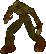

=== "Info"

    

    <table>
    <tr>
        <th>Spawn Locations</th>
        <td id="Bogling_Spawn-Locations" colspan="3"></td>
    </tr>
    <tr>
        <th>Base Damage</th>
        <td id="Bogling_Base-Damage"></td>
        <th>Armor Rating</th>
        <td id="Bogling_Armor-Rating"></td>
    </tr>
    <tr>
        <th>Fame</th>
        <td id="Bogling_Fame"></td>
        <th>Karma</th>
        <td id="Bogling_Karma"></td>
    </tr>
    <tr>
        <th>Super Slayer</th>
        <td id="Bogling_Super-Slayer"></td>
        <th>Minor Slayer</th>
        <td id="Bogling_Minor-Slayer"></td>
    </tr>
    <tr>
        <th>Barding Difficulty</th>
        <td id="Bogling_Barding-Difficulty"></td>
        <th>Taming Difficulty</th>
        <td id="Bogling_Taming-Difficulty"></td>
    </tr>
    </table>
    

=== "Attributes"

    

    <table>
    <tr>
        <th>Hit Points</th>
        <td id="Bogling_Hit-Points"></td>
        <th>Strength</th>
        <td id="Bogling_Strength"></td>
    </tr>
    <tr>
        <th>Stamina</th>
        <td id="Bogling_Stamina"></td>
        <th>Dexterity</th>
        <td id="Bogling_Dexterity"></td>
    </tr>
    <tr>
        <th>Mana</th>
        <td id="Bogling_Mana"></td>
        <th>Intelligence</th>
        <td id="Bogling_Intelligence"></td>
    </tr>
    </table>
    

=== "Skills"

    

    <table>
    <tr>
        <th>Wrestling</th>
        <td id="Bogling_Wrestling"></td>
        <th>Magery</th>
        <td id="Bogling_Magery"></td>
    </tr>
    <tr>
        <th>Tactics</th>
        <td id="Bogling_Tactics"></td>
        <th>Meditation</th>
        <td id="Bogling_Meditation"></td>
    </tr>
    <tr>
        <th>Resisting Spells</th>
        <td id="Bogling_Resisting-Spells"></td>
        <th>Evaluating Intelligence</th>
        <td id="Bogling_Evaluating-Intelligence"></td>
    </tr>
    <tr>
        <th>Anatomy</th>
        <td id="Bogling_Anatomy"></td>
        <th>Poisoning</th>
        <td id="Bogling_Poisoning"></td>
    </tr>
    </table>
    

=== "Loot"

    

    <table>
    <tr>
        <th>Gold</th>
        <td id="Bogling_Gold"></td>
    </tr>
    <tr>
        <th>Treasure Map lvl</th>
        <td id="Bogling_Treasure-Map-lvl"></td>
    </tr>
        <tr>
        <th>Slayer Drop</th>
        <td id="Bogling_Slayer-Drop"></td>
    </tr>
    </table>
    

### Bone Knight

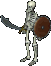

=== "Info"

    

    <table>
    <tr>
        <th>Spawn Locations</th>
        <td id="Bone-Knight_Spawn-Locations" colspan="3"></td>
    </tr>
    <tr>
        <th>Base Damage</th>
        <td id="Bone-Knight_Base-Damage"></td>
        <th>Armor Rating</th>
        <td id="Bone-Knight_Armor-Rating"></td>
    </tr>
    <tr>
        <th>Fame</th>
        <td id="Bone-Knight_Fame"></td>
        <th>Karma</th>
        <td id="Bone-Knight_Karma"></td>
    </tr>
    <tr>
        <th>Super Slayer</th>
        <td id="Bone-Knight_Super-Slayer"></td>
        <th>Minor Slayer</th>
        <td id="Bone-Knight_Minor-Slayer"></td>
    </tr>
    <tr>
        <th>Barding Difficulty</th>
        <td id="Bone-Knight_Barding-Difficulty"></td>
        <th>Taming Difficulty</th>
        <td id="Bone-Knight_Taming-Difficulty"></td>
    </tr>
    </table>
    

=== "Attributes"

    

    <table>
    <tr>
        <th>Hit Points</th>
        <td id="Bone-Knight_Hit-Points"></td>
        <th>Strength</th>
        <td id="Bone-Knight_Strength"></td>
    </tr>
    <tr>
        <th>Stamina</th>
        <td id="Bone-Knight_Stamina"></td>
        <th>Dexterity</th>
        <td id="Bone-Knight_Dexterity"></td>
    </tr>
    <tr>
        <th>Mana</th>
        <td id="Bone-Knight_Mana"></td>
        <th>Intelligence</th>
        <td id="Bone-Knight_Intelligence"></td>
    </tr>
    </table>
    

=== "Skills"

    

    <table>
    <tr>
        <th>Wrestling</th>
        <td id="Bone-Knight_Wrestling"></td>
        <th>Magery</th>
        <td id="Bone-Knight_Magery"></td>
    </tr>
    <tr>
        <th>Tactics</th>
        <td id="Bone-Knight_Tactics"></td>
        <th>Meditation</th>
        <td id="Bone-Knight_Meditation"></td>
    </tr>
    <tr>
        <th>Resisting Spells</th>
        <td id="Bone-Knight_Resisting-Spells"></td>
        <th>Evaluating Intelligence</th>
        <td id="Bone-Knight_Evaluating-Intelligence"></td>
    </tr>
    <tr>
        <th>Anatomy</th>
        <td id="Bone-Knight_Anatomy"></td>
        <th>Poisoning</th>
        <td id="Bone-Knight_Poisoning"></td>
    </tr>
    </table>
    

=== "Loot"

    

    <table>
    <tr>
        <th>Gold</th>
        <td id="Bone-Knight_Gold"></td>
    </tr>
    <tr>
        <th>Treasure Map lvl</th>
        <td id="Bone-Knight_Treasure-Map-lvl"></td>
    </tr>
        <tr>
        <th>Slayer Drop</th>
        <td id="Bone-Knight_Slayer-Drop"></td>
    </tr>
    </table>
    

### Bone Mage

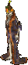

=== "Info"

    

    <table>
    <tr>
        <th>Spawn Locations</th>
        <td id="Bone-Mage_Spawn-Locations" colspan="3"></td>
    </tr>
    <tr>
        <th>Base Damage</th>
        <td id="Bone-Mage_Base-Damage"></td>
        <th>Armor Rating</th>
        <td id="Bone-Mage_Armor-Rating"></td>
    </tr>
    <tr>
        <th>Fame</th>
        <td id="Bone-Mage_Fame"></td>
        <th>Karma</th>
        <td id="Bone-Mage_Karma"></td>
    </tr>
    <tr>
        <th>Super Slayer</th>
        <td id="Bone-Mage_Super-Slayer"></td>
        <th>Minor Slayer</th>
        <td id="Bone-Mage_Minor-Slayer"></td>
    </tr>
    <tr>
        <th>Barding Difficulty</th>
        <td id="Bone-Mage_Barding-Difficulty"></td>
        <th>Taming Difficulty</th>
        <td id="Bone-Mage_Taming-Difficulty"></td>
    </tr>
    </table>
    

=== "Attributes"

    

    <table>
    <tr>
        <th>Hit Points</th>
        <td id="Bone-Mage_Hit-Points"></td>
        <th>Strength</th>
        <td id="Bone-Mage_Strength"></td>
    </tr>
    <tr>
        <th>Stamina</th>
        <td id="Bone-Mage_Stamina"></td>
        <th>Dexterity</th>
        <td id="Bone-Mage_Dexterity"></td>
    </tr>
    <tr>
        <th>Mana</th>
        <td id="Bone-Mage_Mana"></td>
        <th>Intelligence</th>
        <td id="Bone-Mage_Intelligence"></td>
    </tr>
    </table>
    

=== "Skills"

    

    <table>
    <tr>
        <th>Wrestling</th>
        <td id="Bone-Mage_Wrestling"></td>
        <th>Magery</th>
        <td id="Bone-Mage_Magery"></td>
    </tr>
    <tr>
        <th>Tactics</th>
        <td id="Bone-Mage_Tactics"></td>
        <th>Meditation</th>
        <td id="Bone-Mage_Meditation"></td>
    </tr>
    <tr>
        <th>Resisting Spells</th>
        <td id="Bone-Mage_Resisting-Spells"></td>
        <th>Evaluating Intelligence</th>
        <td id="Bone-Mage_Evaluating-Intelligence"></td>
    </tr>
    <tr>
        <th>Anatomy</th>
        <td id="Bone-Mage_Anatomy"></td>
        <th>Poisoning</th>
        <td id="Bone-Mage_Poisoning"></td>
    </tr>
    </table>
    

=== "Loot"

    

    <table>
    <tr>
        <th>Gold</th>
        <td id="Bone-Mage_Gold"></td>
    </tr>
    <tr>
        <th>Treasure Map lvl</th>
        <td id="Bone-Mage_Treasure-Map-lvl"></td>
    </tr>
        <tr>
        <th>Slayer Drop</th>
        <td id="Bone-Mage_Slayer-Drop"></td>
    </tr>
    </table>
    

### Bonebound Brigand

!!! warning
    Under construction.

=== "Info"

    

    <table>
    <tr>
        <th>Spawn Locations</th>
        <td id="Bonebound-Brigand_Spawn-Locations" colspan="3"></td>
    </tr>
    <tr>
        <th>Base Damage</th>
        <td id="Bonebound-Brigand_Base-Damage"></td>
        <th>Armor Rating</th>
        <td id="Bonebound-Brigand_Armor-Rating"></td>
    </tr>
    <tr>
        <th>Fame</th>
        <td id="Bonebound-Brigand_Fame"></td>
        <th>Karma</th>
        <td id="Bonebound-Brigand_Karma"></td>
    </tr>
    <tr>
        <th>Super Slayer</th>
        <td id="Bonebound-Brigand_Super-Slayer"></td>
        <th>Minor Slayer</th>
        <td id="Bonebound-Brigand_Minor-Slayer"></td>
    </tr>
    <tr>
        <th>Barding Difficulty</th>
        <td id="Bonebound-Brigand_Barding-Difficulty"></td>
        <th>Taming Difficulty</th>
        <td id="Bonebound-Brigand_Taming-Difficulty"></td>
    </tr>
    </table>
    

=== "Attributes"

    

    <table>
    <tr>
        <th>Hit Points</th>
        <td id="Bonebound-Brigand_Hit-Points"></td>
        <th>Strength</th>
        <td id="Bonebound-Brigand_Strength"></td>
    </tr>
    <tr>
        <th>Stamina</th>
        <td id="Bonebound-Brigand_Stamina"></td>
        <th>Dexterity</th>
        <td id="Bonebound-Brigand_Dexterity"></td>
    </tr>
    <tr>
        <th>Mana</th>
        <td id="Bonebound-Brigand_Mana"></td>
        <th>Intelligence</th>
        <td id="Bonebound-Brigand_Intelligence"></td>
    </tr>
    </table>
    

=== "Skills"

    

    <table>
    <tr>
        <th>Wrestling</th>
        <td id="Bonebound-Brigand_Wrestling"></td>
        <th>Magery</th>
        <td id="Bonebound-Brigand_Magery"></td>
    </tr>
    <tr>
        <th>Tactics</th>
        <td id="Bonebound-Brigand_Tactics"></td>
        <th>Meditation</th>
        <td id="Bonebound-Brigand_Meditation"></td>
    </tr>
    <tr>
        <th>Resisting Spells</th>
        <td id="Bonebound-Brigand_Resisting-Spells"></td>
        <th>Evaluating Intelligence</th>
        <td id="Bonebound-Brigand_Evaluating-Intelligence"></td>
    </tr>
    <tr>
        <th>Anatomy</th>
        <td id="Bonebound-Brigand_Anatomy"></td>
        <th>Poisoning</th>
        <td id="Bonebound-Brigand_Poisoning"></td>
    </tr>
    </table>
    

=== "Loot"

    

    <table>
    <tr>
        <th>Gold</th>
        <td id="Bonebound-Brigand_Gold"></td>
    </tr>
    <tr>
        <th>Treasure Map lvl</th>
        <td id="Bonebound-Brigand_Treasure-Map-lvl"></td>
    </tr>
        <tr>
        <th>Slayer Drop</th>
        <td id="Bonebound-Brigand_Slayer-Drop"></td>
    </tr>
    </table>
    

### Brigand

=== "Info"

    

    <table>
    <tr>
        <th>Spawn Locations</th>
        <td id="Brigand_Spawn-Locations" colspan="3"></td>
    </tr>
    <tr>
        <th>Base Damage</th>
        <td id="Brigand_Base-Damage"></td>
        <th>Armor Rating</th>
        <td id="Brigand_Armor-Rating"></td>
    </tr>
    <tr>
        <th>Fame</th>
        <td id="Brigand_Fame"></td>
        <th>Karma</th>
        <td id="Brigand_Karma"></td>
    </tr>
    <tr>
        <th>Super Slayer</th>
        <td id="Brigand_Super-Slayer"></td>
        <th>Minor Slayer</th>
        <td id="Brigand_Minor-Slayer"></td>
    </tr>
    <tr>
        <th>Barding Difficulty</th>
        <td id="Brigand_Barding-Difficulty"></td>
        <th>Taming Difficulty</th>
        <td id="Brigand_Taming-Difficulty"></td>
    </tr>
    </table>
    

=== "Attributes"

    

    <table>
    <tr>
        <th>Hit Points</th>
        <td id="Brigand_Hit-Points"></td>
        <th>Strength</th>
        <td id="Brigand_Strength"></td>
    </tr>
    <tr>
        <th>Stamina</th>
        <td id="Brigand_Stamina"></td>
        <th>Dexterity</th>
        <td id="Brigand_Dexterity"></td>
    </tr>
    <tr>
        <th>Mana</th>
        <td id="Brigand_Mana"></td>
        <th>Intelligence</th>
        <td id="Brigand_Intelligence"></td>
    </tr>
    </table>
    

=== "Skills"

    

    <table>
    <tr>
        <th>Wrestling</th>
        <td id="Brigand_Wrestling"></td>
        <th>Magery</th>
        <td id="Brigand_Magery"></td>
    </tr>
    <tr>
        <th>Tactics</th>
        <td id="Brigand_Tactics"></td>
        <th>Meditation</th>
        <td id="Brigand_Meditation"></td>
    </tr>
    <tr>
        <th>Resisting Spells</th>
        <td id="Brigand_Resisting-Spells"></td>
        <th>Evaluating Intelligence</th>
        <td id="Brigand_Evaluating-Intelligence"></td>
    </tr>
    <tr>
        <th>Anatomy</th>
        <td id="Brigand_Anatomy"></td>
        <th>Poisoning</th>
        <td id="Brigand_Poisoning"></td>
    </tr>
    </table>
    

=== "Loot"

    

    <table>
    <tr>
        <th>Gold</th>
        <td id="Brigand_Gold"></td>
    </tr>
    <tr>
        <th>Treasure Map lvl</th>
        <td id="Brigand_Treasure-Map-lvl"></td>
    </tr>
        <tr>
        <th>Slayer Drop</th>
        <td id="Brigand_Slayer-Drop"></td>
    </tr>
    </table>
    

### Bronze Elemental

=== "Info"

    

    <table>
    <tr>
        <th>Spawn Locations</th>
        <td id="Bronze-Elemental_Spawn-Locations" colspan="3"></td>
    </tr>
    <tr>
        <th>Base Damage</th>
        <td id="Bronze-Elemental_Base-Damage"></td>
        <th>Armor Rating</th>
        <td id="Bronze-Elemental_Armor-Rating"></td>
    </tr>
    <tr>
        <th>Fame</th>
        <td id="Bronze-Elemental_Fame"></td>
        <th>Karma</th>
        <td id="Bronze-Elemental_Karma"></td>
    </tr>
    <tr>
        <th>Super Slayer</th>
        <td id="Bronze-Elemental_Super-Slayer"></td>
        <th>Minor Slayer</th>
        <td id="Bronze-Elemental_Minor-Slayer"></td>
    </tr>
    <tr>
        <th>Barding Difficulty</th>
        <td id="Bronze-Elemental_Barding-Difficulty"></td>
        <th>Taming Difficulty</th>
        <td id="Bronze-Elemental_Taming-Difficulty"></td>
    </tr>
    </table>
    

=== "Attributes"

    

    <table>
    <tr>
        <th>Hit Points</th>
        <td id="Bronze-Elemental_Hit-Points"></td>
        <th>Strength</th>
        <td id="Bronze-Elemental_Strength"></td>
    </tr>
    <tr>
        <th>Stamina</th>
        <td id="Bronze-Elemental_Stamina"></td>
        <th>Dexterity</th>
        <td id="Bronze-Elemental_Dexterity"></td>
    </tr>
    <tr>
        <th>Mana</th>
        <td id="Bronze-Elemental_Mana"></td>
        <th>Intelligence</th>
        <td id="Bronze-Elemental_Intelligence"></td>
    </tr>
    </table>
    

=== "Skills"

    

    <table>
    <tr>
        <th>Wrestling</th>
        <td id="Bronze-Elemental_Wrestling"></td>
        <th>Magery</th>
        <td id="Bronze-Elemental_Magery"></td>
    </tr>
    <tr>
        <th>Tactics</th>
        <td id="Bronze-Elemental_Tactics"></td>
        <th>Meditation</th>
        <td id="Bronze-Elemental_Meditation"></td>
    </tr>
    <tr>
        <th>Resisting Spells</th>
        <td id="Bronze-Elemental_Resisting-Spells"></td>
        <th>Evaluating Intelligence</th>
        <td id="Bronze-Elemental_Evaluating-Intelligence"></td>
    </tr>
    <tr>
        <th>Anatomy</th>
        <td id="Bronze-Elemental_Anatomy"></td>
        <th>Poisoning</th>
        <td id="Bronze-Elemental_Poisoning"></td>
    </tr>
    </table>
    

=== "Loot"

    

    <table>
    <tr>
        <th>Gold</th>
        <td id="Bronze-Elemental_Gold"></td>
    </tr>
    <tr>
        <th>Treasure Map lvl</th>
        <td id="Bronze-Elemental_Treasure-Map-lvl"></td>
    </tr>
        <tr>
        <th>Slayer Drop</th>
        <td id="Bronze-Elemental_Slayer-Drop"></td>
    </tr>
    </table>
    

### Brown Bear

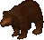

=== "Info"

    

    <table>
    <tr>
        <th>Spawn Locations</th>
        <td id="Brown-Bear_Spawn-Locations" colspan="3"></td>
    </tr>
    <tr>
        <th>Base Damage</th>
        <td id="Brown-Bear_Base-Damage"></td>
        <th>Armor Rating</th>
        <td id="Brown-Bear_Armor-Rating"></td>
    </tr>
    <tr>
        <th>Fame</th>
        <td id="Brown-Bear_Fame"></td>
        <th>Karma</th>
        <td id="Brown-Bear_Karma"></td>
    </tr>
    <tr>
        <th>Super Slayer</th>
        <td id="Brown-Bear_Super-Slayer"></td>
        <th>Minor Slayer</th>
        <td id="Brown-Bear_Minor-Slayer"></td>
    </tr>
    <tr>
        <th>Barding Difficulty</th>
        <td id="Brown-Bear_Barding-Difficulty"></td>
        <th>Taming Difficulty</th>
        <td id="Brown-Bear_Taming-Difficulty"></td>
    </tr>
    </table>
    

=== "Attributes"

    

    <table>
    <tr>
        <th>Hit Points</th>
        <td id="Brown-Bear_Hit-Points"></td>
        <th>Strength</th>
        <td id="Brown-Bear_Strength"></td>
    </tr>
    <tr>
        <th>Stamina</th>
        <td id="Brown-Bear_Stamina"></td>
        <th>Dexterity</th>
        <td id="Brown-Bear_Dexterity"></td>
    </tr>
    <tr>
        <th>Mana</th>
        <td id="Brown-Bear_Mana"></td>
        <th>Intelligence</th>
        <td id="Brown-Bear_Intelligence"></td>
    </tr>
    </table>
    

=== "Skills"

    

    <table>
    <tr>
        <th>Wrestling</th>
        <td id="Brown-Bear_Wrestling"></td>
        <th>Magery</th>
        <td id="Brown-Bear_Magery"></td>
    </tr>
    <tr>
        <th>Tactics</th>
        <td id="Brown-Bear_Tactics"></td>
        <th>Meditation</th>
        <td id="Brown-Bear_Meditation"></td>
    </tr>
    <tr>
        <th>Resisting Spells</th>
        <td id="Brown-Bear_Resisting-Spells"></td>
        <th>Evaluating Intelligence</th>
        <td id="Brown-Bear_Evaluating-Intelligence"></td>
    </tr>
    <tr>
        <th>Anatomy</th>
        <td id="Brown-Bear_Anatomy"></td>
        <th>Poisoning</th>
        <td id="Brown-Bear_Poisoning"></td>
    </tr>
    </table>
    

=== "Loot"

    

    <table>
    <tr>
        <th>Gold</th>
        <td id="Brown-Bear_Gold"></td>
    </tr>
    <tr>
        <th>Treasure Map lvl</th>
        <td id="Brown-Bear_Treasure-Map-lvl"></td>
    </tr>
        <tr>
        <th>Slayer Drop</th>
        <td id="Brown-Bear_Slayer-Drop"></td>
    </tr>
    </table>
    

### Bull

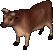

=== "Info"

    

    <table>
    <tr>
        <th>Spawn Locations</th>
        <td id="Bull_Spawn-Locations" colspan="3"></td>
    </tr>
    <tr>
        <th>Base Damage</th>
        <td id="Bull_Base-Damage"></td>
        <th>Armor Rating</th>
        <td id="Bull_Armor-Rating"></td>
    </tr>
    <tr>
        <th>Fame</th>
        <td id="Bull_Fame"></td>
        <th>Karma</th>
        <td id="Bull_Karma"></td>
    </tr>
    <tr>
        <th>Super Slayer</th>
        <td id="Bull_Super-Slayer"></td>
        <th>Minor Slayer</th>
        <td id="Bull_Minor-Slayer"></td>
    </tr>
    <tr>
        <th>Barding Difficulty</th>
        <td id="Bull_Barding-Difficulty"></td>
        <th>Taming Difficulty</th>
        <td id="Bull_Taming-Difficulty"></td>
    </tr>
    </table>
    

=== "Attributes"

    

    <table>
    <tr>
        <th>Hit Points</th>
        <td id="Bull_Hit-Points"></td>
        <th>Strength</th>
        <td id="Bull_Strength"></td>
    </tr>
    <tr>
        <th>Stamina</th>
        <td id="Bull_Stamina"></td>
        <th>Dexterity</th>
        <td id="Bull_Dexterity"></td>
    </tr>
    <tr>
        <th>Mana</th>
        <td id="Bull_Mana"></td>
        <th>Intelligence</th>
        <td id="Bull_Intelligence"></td>
    </tr>
    </table>
    

=== "Skills"

    

    <table>
    <tr>
        <th>Wrestling</th>
        <td id="Bull_Wrestling"></td>
        <th>Magery</th>
        <td id="Bull_Magery"></td>
    </tr>
    <tr>
        <th>Tactics</th>
        <td id="Bull_Tactics"></td>
        <th>Meditation</th>
        <td id="Bull_Meditation"></td>
    </tr>
    <tr>
        <th>Resisting Spells</th>
        <td id="Bull_Resisting-Spells"></td>
        <th>Evaluating Intelligence</th>
        <td id="Bull_Evaluating-Intelligence"></td>
    </tr>
    <tr>
        <th>Anatomy</th>
        <td id="Bull_Anatomy"></td>
        <th>Poisoning</th>
        <td id="Bull_Poisoning"></td>
    </tr>
    </table>
    

=== "Loot"

    

    <table>
    <tr>
        <th>Gold</th>
        <td id="Bull_Gold"></td>
    </tr>
    <tr>
        <th>Treasure Map lvl</th>
        <td id="Bull_Treasure-Map-lvl"></td>
    </tr>
        <tr>
        <th>Slayer Drop</th>
        <td id="Bull_Slayer-Drop"></td>
    </tr>
    </table>
    

### Bull Frog

=== "Info"

    

    <table>
    <tr>
        <th>Spawn Locations</th>
        <td id="Bull-Frog_Spawn-Locations" colspan="3"></td>
    </tr>
    <tr>
        <th>Base Damage</th>
        <td id="Bull-Frog_Base-Damage"></td>
        <th>Armor Rating</th>
        <td id="Bull-Frog_Armor-Rating"></td>
    </tr>
    <tr>
        <th>Fame</th>
        <td id="Bull-Frog_Fame"></td>
        <th>Karma</th>
        <td id="Bull-Frog_Karma"></td>
    </tr>
    <tr>
        <th>Super Slayer</th>
        <td id="Bull-Frog_Super-Slayer"></td>
        <th>Minor Slayer</th>
        <td id="Bull-Frog_Minor-Slayer"></td>
    </tr>
    <tr>
        <th>Barding Difficulty</th>
        <td id="Bull-Frog_Barding-Difficulty"></td>
        <th>Taming Difficulty</th>
        <td id="Bull-Frog_Taming-Difficulty"></td>
    </tr>
    </table>
    

=== "Attributes"

    

    <table>
    <tr>
        <th>Hit Points</th>
        <td id="Bull-Frog_Hit-Points"></td>
        <th>Strength</th>
        <td id="Bull-Frog_Strength"></td>
    </tr>
    <tr>
        <th>Stamina</th>
        <td id="Bull-Frog_Stamina"></td>
        <th>Dexterity</th>
        <td id="Bull-Frog_Dexterity"></td>
    </tr>
    <tr>
        <th>Mana</th>
        <td id="Bull-Frog_Mana"></td>
        <th>Intelligence</th>
        <td id="Bull-Frog_Intelligence"></td>
    </tr>
    </table>
    

=== "Skills"

    

    <table>
    <tr>
        <th>Wrestling</th>
        <td id="Bull-Frog_Wrestling"></td>
        <th>Magery</th>
        <td id="Bull-Frog_Magery"></td>
    </tr>
    <tr>
        <th>Tactics</th>
        <td id="Bull-Frog_Tactics"></td>
        <th>Meditation</th>
        <td id="Bull-Frog_Meditation"></td>
    </tr>
    <tr>
        <th>Resisting Spells</th>
        <td id="Bull-Frog_Resisting-Spells"></td>
        <th>Evaluating Intelligence</th>
        <td id="Bull-Frog_Evaluating-Intelligence"></td>
    </tr>
    <tr>
        <th>Anatomy</th>
        <td id="Bull-Frog_Anatomy"></td>
        <th>Poisoning</th>
        <td id="Bull-Frog_Poisoning"></td>
    </tr>
    </table>
    

=== "Loot"

    

    <table>
    <tr>
        <th>Gold</th>
        <td id="Bull-Frog_Gold"></td>
    </tr>
    <tr>
        <th>Treasure Map lvl</th>
        <td id="Bull-Frog_Treasure-Map-lvl"></td>
    </tr>
        <tr>
        <th>Slayer Drop</th>
        <td id="Bull-Frog_Slayer-Drop"></td>
    </tr>
    </table>
    

### Captain Dreadstorm

!!! warning
    Under construction.

=== "Info"

    

    <table>
    <tr>
        <th>Spawn Locations</th>
        <td id="Captain-Dreadstorm_Spawn-Locations" colspan="3"></td>
    </tr>
    <tr>
        <th>Base Damage</th>
        <td id="Captain-Dreadstorm_Base-Damage"></td>
        <th>Armor Rating</th>
        <td id="Captain-Dreadstorm_Armor-Rating"></td>
    </tr>
    <tr>
        <th>Fame</th>
        <td id="Captain-Dreadstorm_Fame"></td>
        <th>Karma</th>
        <td id="Captain-Dreadstorm_Karma"></td>
    </tr>
    <tr>
        <th>Super Slayer</th>
        <td id="Captain-Dreadstorm_Super-Slayer"></td>
        <th>Minor Slayer</th>
        <td id="Captain-Dreadstorm_Minor-Slayer"></td>
    </tr>
    <tr>
        <th>Barding Difficulty</th>
        <td id="Captain-Dreadstorm_Barding-Difficulty"></td>
        <th>Taming Difficulty</th>
        <td id="Captain-Dreadstorm_Taming-Difficulty"></td>
    </tr>
    </table>
    

=== "Attributes"

    

    <table>
    <tr>
        <th>Hit Points</th>
        <td id="Captain-Dreadstorm_Hit-Points"></td>
        <th>Strength</th>
        <td id="Captain-Dreadstorm_Strength"></td>
    </tr>
    <tr>
        <th>Stamina</th>
        <td id="Captain-Dreadstorm_Stamina"></td>
        <th>Dexterity</th>
        <td id="Captain-Dreadstorm_Dexterity"></td>
    </tr>
    <tr>
        <th>Mana</th>
        <td id="Captain-Dreadstorm_Mana"></td>
        <th>Intelligence</th>
        <td id="Captain-Dreadstorm_Intelligence"></td>
    </tr>
    </table>
    

=== "Skills"

    

    <table>
    <tr>
        <th>Wrestling</th>
        <td id="Captain-Dreadstorm_Wrestling"></td>
        <th>Magery</th>
        <td id="Captain-Dreadstorm_Magery"></td>
    </tr>
    <tr>
        <th>Tactics</th>
        <td id="Captain-Dreadstorm_Tactics"></td>
        <th>Meditation</th>
        <td id="Captain-Dreadstorm_Meditation"></td>
    </tr>
    <tr>
        <th>Resisting Spells</th>
        <td id="Captain-Dreadstorm_Resisting-Spells"></td>
        <th>Evaluating Intelligence</th>
        <td id="Captain-Dreadstorm_Evaluating-Intelligence"></td>
    </tr>
    <tr>
        <th>Anatomy</th>
        <td id="Captain-Dreadstorm_Anatomy"></td>
        <th>Poisoning</th>
        <td id="Captain-Dreadstorm_Poisoning"></td>
    </tr>
    </table>
    

=== "Loot"

    

    <table>
    <tr>
        <th>Gold</th>
        <td id="Captain-Dreadstorm_Gold"></td>
    </tr>
    <tr>
        <th>Treasure Map lvl</th>
        <td id="Captain-Dreadstorm_Treasure-Map-lvl"></td>
    </tr>
        <tr>
        <th>Slayer Drop</th>
        <td id="Captain-Dreadstorm_Slayer-Drop"></td>
    </tr>
    </table>
    

### Captain Grimjaw

!!! warning
    Under construction.

=== "Info"

    

    <table>
    <tr>
        <th>Spawn Locations</th>
        <td id="Captain-Grimjaw_Spawn-Locations" colspan="3"></td>
    </tr>
    <tr>
        <th>Base Damage</th>
        <td id="Captain-Grimjaw_Base-Damage"></td>
        <th>Armor Rating</th>
        <td id="Captain-Grimjaw_Armor-Rating"></td>
    </tr>
    <tr>
        <th>Fame</th>
        <td id="Captain-Grimjaw_Fame"></td>
        <th>Karma</th>
        <td id="Captain-Grimjaw_Karma"></td>
    </tr>
    <tr>
        <th>Super Slayer</th>
        <td id="Captain-Grimjaw_Super-Slayer"></td>
        <th>Minor Slayer</th>
        <td id="Captain-Grimjaw_Minor-Slayer"></td>
    </tr>
    <tr>
        <th>Barding Difficulty</th>
        <td id="Captain-Grimjaw_Barding-Difficulty"></td>
        <th>Taming Difficulty</th>
        <td id="Captain-Grimjaw_Taming-Difficulty"></td>
    </tr>
    </table>
    

=== "Attributes"

    

    <table>
    <tr>
        <th>Hit Points</th>
        <td id="Captain-Grimjaw_Hit-Points"></td>
        <th>Strength</th>
        <td id="Captain-Grimjaw_Strength"></td>
    </tr>
    <tr>
        <th>Stamina</th>
        <td id="Captain-Grimjaw_Stamina"></td>
        <th>Dexterity</th>
        <td id="Captain-Grimjaw_Dexterity"></td>
    </tr>
    <tr>
        <th>Mana</th>
        <td id="Captain-Grimjaw_Mana"></td>
        <th>Intelligence</th>
        <td id="Captain-Grimjaw_Intelligence"></td>
    </tr>
    </table>
    

=== "Skills"

    

    <table>
    <tr>
        <th>Wrestling</th>
        <td id="Captain-Grimjaw_Wrestling"></td>
        <th>Magery</th>
        <td id="Captain-Grimjaw_Magery"></td>
    </tr>
    <tr>
        <th>Tactics</th>
        <td id="Captain-Grimjaw_Tactics"></td>
        <th>Meditation</th>
        <td id="Captain-Grimjaw_Meditation"></td>
    </tr>
    <tr>
        <th>Resisting Spells</th>
        <td id="Captain-Grimjaw_Resisting-Spells"></td>
        <th>Evaluating Intelligence</th>
        <td id="Captain-Grimjaw_Evaluating-Intelligence"></td>
    </tr>
    <tr>
        <th>Anatomy</th>
        <td id="Captain-Grimjaw_Anatomy"></td>
        <th>Poisoning</th>
        <td id="Captain-Grimjaw_Poisoning"></td>
    </tr>
    </table>
    

=== "Loot"

    

    <table>
    <tr>
        <th>Gold</th>
        <td id="Captain-Grimjaw_Gold"></td>
    </tr>
    <tr>
        <th>Treasure Map lvl</th>
        <td id="Captain-Grimjaw_Treasure-Map-lvl"></td>
    </tr>
        <tr>
        <th>Slayer Drop</th>
        <td id="Captain-Grimjaw_Slayer-Drop"></td>
    </tr>
    </table>
    

### Cat

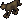

=== "Info"

    

    <table>
    <tr>
        <th>Spawn Locations</th>
        <td id="Cat_Spawn-Locations" colspan="3"></td>
    </tr>
    <tr>
        <th>Base Damage</th>
        <td id="Cat_Base-Damage"></td>
        <th>Armor Rating</th>
        <td id="Cat_Armor-Rating"></td>
    </tr>
    <tr>
        <th>Fame</th>
        <td id="Cat_Fame"></td>
        <th>Karma</th>
        <td id="Cat_Karma"></td>
    </tr>
    <tr>
        <th>Super Slayer</th>
        <td id="Cat_Super-Slayer"></td>
        <th>Minor Slayer</th>
        <td id="Cat_Minor-Slayer"></td>
    </tr>
    <tr>
        <th>Barding Difficulty</th>
        <td id="Cat_Barding-Difficulty"></td>
        <th>Taming Difficulty</th>
        <td id="Cat_Taming-Difficulty"></td>
    </tr>
    </table>
    

=== "Attributes"

    

    <table>
    <tr>
        <th>Hit Points</th>
        <td id="Cat_Hit-Points"></td>
        <th>Strength</th>
        <td id="Cat_Strength"></td>
    </tr>
    <tr>
        <th>Stamina</th>
        <td id="Cat_Stamina"></td>
        <th>Dexterity</th>
        <td id="Cat_Dexterity"></td>
    </tr>
    <tr>
        <th>Mana</th>
        <td id="Cat_Mana"></td>
        <th>Intelligence</th>
        <td id="Cat_Intelligence"></td>
    </tr>
    </table>
    

=== "Skills"

    

    <table>
    <tr>
        <th>Wrestling</th>
        <td id="Cat_Wrestling"></td>
        <th>Magery</th>
        <td id="Cat_Magery"></td>
    </tr>
    <tr>
        <th>Tactics</th>
        <td id="Cat_Tactics"></td>
        <th>Meditation</th>
        <td id="Cat_Meditation"></td>
    </tr>
    <tr>
        <th>Resisting Spells</th>
        <td id="Cat_Resisting-Spells"></td>
        <th>Evaluating Intelligence</th>
        <td id="Cat_Evaluating-Intelligence"></td>
    </tr>
    <tr>
        <th>Anatomy</th>
        <td id="Cat_Anatomy"></td>
        <th>Poisoning</th>
        <td id="Cat_Poisoning"></td>
    </tr>
    </table>
    

=== "Loot"

    

    <table>
    <tr>
        <th>Gold</th>
        <td id="Cat_Gold"></td>
    </tr>
    <tr>
        <th>Treasure Map lvl</th>
        <td id="Cat_Treasure-Map-lvl"></td>
    </tr>
        <tr>
        <th>Slayer Drop</th>
        <td id="Cat_Slayer-Drop"></td>
    </tr>
    </table>
    

### Cave Troll

!!! warning
    Under construction.

=== "Info"

    

    <table>
    <tr>
        <th>Spawn Locations</th>
        <td id="Cave-Troll_Spawn-Locations" colspan="3"></td>
    </tr>
    <tr>
        <th>Base Damage</th>
        <td id="Cave-Troll_Base-Damage"></td>
        <th>Armor Rating</th>
        <td id="Cave-Troll_Armor-Rating"></td>
    </tr>
    <tr>
        <th>Fame</th>
        <td id="Cave-Troll_Fame"></td>
        <th>Karma</th>
        <td id="Cave-Troll_Karma"></td>
    </tr>
    <tr>
        <th>Super Slayer</th>
        <td id="Cave-Troll_Super-Slayer"></td>
        <th>Minor Slayer</th>
        <td id="Cave-Troll_Minor-Slayer"></td>
    </tr>
    <tr>
        <th>Barding Difficulty</th>
        <td id="Cave-Troll_Barding-Difficulty"></td>
        <th>Taming Difficulty</th>
        <td id="Cave-Troll_Taming-Difficulty"></td>
    </tr>
    </table>
    

=== "Attributes"

    

    <table>
    <tr>
        <th>Hit Points</th>
        <td id="Cave-Troll_Hit-Points"></td>
        <th>Strength</th>
        <td id="Cave-Troll_Strength"></td>
    </tr>
    <tr>
        <th>Stamina</th>
        <td id="Cave-Troll_Stamina"></td>
        <th>Dexterity</th>
        <td id="Cave-Troll_Dexterity"></td>
    </tr>
    <tr>
        <th>Mana</th>
        <td id="Cave-Troll_Mana"></td>
        <th>Intelligence</th>
        <td id="Cave-Troll_Intelligence"></td>
    </tr>
    </table>
    

=== "Skills"

    

    <table>
    <tr>
        <th>Wrestling</th>
        <td id="Cave-Troll_Wrestling"></td>
        <th>Magery</th>
        <td id="Cave-Troll_Magery"></td>
    </tr>
    <tr>
        <th>Tactics</th>
        <td id="Cave-Troll_Tactics"></td>
        <th>Meditation</th>
        <td id="Cave-Troll_Meditation"></td>
    </tr>
    <tr>
        <th>Resisting Spells</th>
        <td id="Cave-Troll_Resisting-Spells"></td>
        <th>Evaluating Intelligence</th>
        <td id="Cave-Troll_Evaluating-Intelligence"></td>
    </tr>
    <tr>
        <th>Anatomy</th>
        <td id="Cave-Troll_Anatomy"></td>
        <th>Poisoning</th>
        <td id="Cave-Troll_Poisoning"></td>
    </tr>
    </table>
    

=== "Loot"

    

    <table>
    <tr>
        <th>Gold</th>
        <td id="Cave-Troll_Gold"></td>
    </tr>
    <tr>
        <th>Treasure Map lvl</th>
        <td id="Cave-Troll_Treasure-Map-lvl"></td>
    </tr>
        <tr>
        <th>Slayer Drop</th>
        <td id="Cave-Troll_Slayer-Drop"></td>
    </tr>
    </table>
    

### Centaur

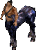

=== "Info"

    

    <table>
    <tr>
        <th>Spawn Locations</th>
        <td id="Centaur_Spawn-Locations" colspan="3"></td>
    </tr>
    <tr>
        <th>Base Damage</th>
        <td id="Centaur_Base-Damage"></td>
        <th>Armor Rating</th>
        <td id="Centaur_Armor-Rating"></td>
    </tr>
    <tr>
        <th>Fame</th>
        <td id="Centaur_Fame"></td>
        <th>Karma</th>
        <td id="Centaur_Karma"></td>
    </tr>
    <tr>
        <th>Super Slayer</th>
        <td id="Centaur_Super-Slayer"></td>
        <th>Minor Slayer</th>
        <td id="Centaur_Minor-Slayer"></td>
    </tr>
    <tr>
        <th>Barding Difficulty</th>
        <td id="Centaur_Barding-Difficulty"></td>
        <th>Taming Difficulty</th>
        <td id="Centaur_Taming-Difficulty"></td>
    </tr>
    </table>
    

=== "Attributes"

    

    <table>
    <tr>
        <th>Hit Points</th>
        <td id="Centaur_Hit-Points"></td>
        <th>Strength</th>
        <td id="Centaur_Strength"></td>
    </tr>
    <tr>
        <th>Stamina</th>
        <td id="Centaur_Stamina"></td>
        <th>Dexterity</th>
        <td id="Centaur_Dexterity"></td>
    </tr>
    <tr>
        <th>Mana</th>
        <td id="Centaur_Mana"></td>
        <th>Intelligence</th>
        <td id="Centaur_Intelligence"></td>
    </tr>
    </table>
    

=== "Skills"

    

    <table>
    <tr>
        <th>Wrestling</th>
        <td id="Centaur_Wrestling"></td>
        <th>Magery</th>
        <td id="Centaur_Magery"></td>
    </tr>
    <tr>
        <th>Tactics</th>
        <td id="Centaur_Tactics"></td>
        <th>Meditation</th>
        <td id="Centaur_Meditation"></td>
    </tr>
    <tr>
        <th>Resisting Spells</th>
        <td id="Centaur_Resisting-Spells"></td>
        <th>Evaluating Intelligence</th>
        <td id="Centaur_Evaluating-Intelligence"></td>
    </tr>
    <tr>
        <th>Anatomy</th>
        <td id="Centaur_Anatomy"></td>
        <th>Poisoning</th>
        <td id="Centaur_Poisoning"></td>
    </tr>
    </table>
    

=== "Loot"

    

    <table>
    <tr>
        <th>Gold</th>
        <td id="Centaur_Gold"></td>
    </tr>
    <tr>
        <th>Treasure Map lvl</th>
        <td id="Centaur_Treasure-Map-lvl"></td>
    </tr>
        <tr>
        <th>Slayer Drop</th>
        <td id="Centaur_Slayer-Drop"></td>
    </tr>
    </table>
    

### Chaos Daemon

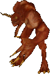

=== "Info"

    

    <table>
    <tr>
        <th>Spawn Locations</th>
        <td id="Chaos-Daemon_Spawn-Locations" colspan="3"></td>
    </tr>
    <tr>
        <th>Base Damage</th>
        <td id="Chaos-Daemon_Base-Damage"></td>
        <th>Armor Rating</th>
        <td id="Chaos-Daemon_Armor-Rating"></td>
    </tr>
    <tr>
        <th>Fame</th>
        <td id="Chaos-Daemon_Fame"></td>
        <th>Karma</th>
        <td id="Chaos-Daemon_Karma"></td>
    </tr>
    <tr>
        <th>Super Slayer</th>
        <td id="Chaos-Daemon_Super-Slayer"></td>
        <th>Minor Slayer</th>
        <td id="Chaos-Daemon_Minor-Slayer"></td>
    </tr>
    <tr>
        <th>Barding Difficulty</th>
        <td id="Chaos-Daemon_Barding-Difficulty"></td>
        <th>Taming Difficulty</th>
        <td id="Chaos-Daemon_Taming-Difficulty"></td>
    </tr>
    </table>
    

=== "Attributes"

    

    <table>
    <tr>
        <th>Hit Points</th>
        <td id="Chaos-Daemon_Hit-Points"></td>
        <th>Strength</th>
        <td id="Chaos-Daemon_Strength"></td>
    </tr>
    <tr>
        <th>Stamina</th>
        <td id="Chaos-Daemon_Stamina"></td>
        <th>Dexterity</th>
        <td id="Chaos-Daemon_Dexterity"></td>
    </tr>
    <tr>
        <th>Mana</th>
        <td id="Chaos-Daemon_Mana"></td>
        <th>Intelligence</th>
        <td id="Chaos-Daemon_Intelligence"></td>
    </tr>
    </table>
    

=== "Skills"

    

    <table>
    <tr>
        <th>Wrestling</th>
        <td id="Chaos-Daemon_Wrestling"></td>
        <th>Magery</th>
        <td id="Chaos-Daemon_Magery"></td>
    </tr>
    <tr>
        <th>Tactics</th>
        <td id="Chaos-Daemon_Tactics"></td>
        <th>Meditation</th>
        <td id="Chaos-Daemon_Meditation"></td>
    </tr>
    <tr>
        <th>Resisting Spells</th>
        <td id="Chaos-Daemon_Resisting-Spells"></td>
        <th>Evaluating Intelligence</th>
        <td id="Chaos-Daemon_Evaluating-Intelligence"></td>
    </tr>
    <tr>
        <th>Anatomy</th>
        <td id="Chaos-Daemon_Anatomy"></td>
        <th>Poisoning</th>
        <td id="Chaos-Daemon_Poisoning"></td>
    </tr>
    </table>
    

=== "Loot"

    

    <table>
    <tr>
        <th>Gold</th>
        <td id="Chaos-Daemon_Gold"></td>
    </tr>
    <tr>
        <th>Treasure Map lvl</th>
        <td id="Chaos-Daemon_Treasure-Map-lvl"></td>
    </tr>
        <tr>
        <th>Slayer Drop</th>
        <td id="Chaos-Daemon_Slayer-Drop"></td>
    </tr>
    </table>
    

### Chicken

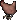

=== "Info"

    

    <table>
    <tr>
        <th>Spawn Locations</th>
        <td id="Chicken_Spawn-Locations" colspan="3"></td>
    </tr>
    <tr>
        <th>Base Damage</th>
        <td id="Chicken_Base-Damage"></td>
        <th>Armor Rating</th>
        <td id="Chicken_Armor-Rating"></td>
    </tr>
    <tr>
        <th>Fame</th>
        <td id="Chicken_Fame"></td>
        <th>Karma</th>
        <td id="Chicken_Karma"></td>
    </tr>
    <tr>
        <th>Super Slayer</th>
        <td id="Chicken_Super-Slayer"></td>
        <th>Minor Slayer</th>
        <td id="Chicken_Minor-Slayer"></td>
    </tr>
    <tr>
        <th>Barding Difficulty</th>
        <td id="Chicken_Barding-Difficulty"></td>
        <th>Taming Difficulty</th>
        <td id="Chicken_Taming-Difficulty"></td>
    </tr>
    </table>
    

=== "Attributes"

    

    <table>
    <tr>
        <th>Hit Points</th>
        <td id="Chicken_Hit-Points"></td>
        <th>Strength</th>
        <td id="Chicken_Strength"></td>
    </tr>
    <tr>
        <th>Stamina</th>
        <td id="Chicken_Stamina"></td>
        <th>Dexterity</th>
        <td id="Chicken_Dexterity"></td>
    </tr>
    <tr>
        <th>Mana</th>
        <td id="Chicken_Mana"></td>
        <th>Intelligence</th>
        <td id="Chicken_Intelligence"></td>
    </tr>
    </table>
    

=== "Skills"

    

    <table>
    <tr>
        <th>Wrestling</th>
        <td id="Chicken_Wrestling"></td>
        <th>Magery</th>
        <td id="Chicken_Magery"></td>
    </tr>
    <tr>
        <th>Tactics</th>
        <td id="Chicken_Tactics"></td>
        <th>Meditation</th>
        <td id="Chicken_Meditation"></td>
    </tr>
    <tr>
        <th>Resisting Spells</th>
        <td id="Chicken_Resisting-Spells"></td>
        <th>Evaluating Intelligence</th>
        <td id="Chicken_Evaluating-Intelligence"></td>
    </tr>
    <tr>
        <th>Anatomy</th>
        <td id="Chicken_Anatomy"></td>
        <th>Poisoning</th>
        <td id="Chicken_Poisoning"></td>
    </tr>
    </table>
    

=== "Loot"

    

    <table>
    <tr>
        <th>Gold</th>
        <td id="Chicken_Gold"></td>
    </tr>
    <tr>
        <th>Treasure Map lvl</th>
        <td id="Chicken_Treasure-Map-lvl"></td>
    </tr>
        <tr>
        <th>Slayer Drop</th>
        <td id="Chicken_Slayer-Drop"></td>
    </tr>
    </table>
    

### Copper Elemental

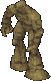

=== "Info"

    

    <table>
    <tr>
        <th>Spawn Locations</th>
        <td id="Copper-Elemental_Spawn-Locations" colspan="3"></td>
    </tr>
    <tr>
        <th>Base Damage</th>
        <td id="Copper-Elemental_Base-Damage"></td>
        <th>Armor Rating</th>
        <td id="Copper-Elemental_Armor-Rating"></td>
    </tr>
    <tr>
        <th>Fame</th>
        <td id="Copper-Elemental_Fame"></td>
        <th>Karma</th>
        <td id="Copper-Elemental_Karma"></td>
    </tr>
    <tr>
        <th>Super Slayer</th>
        <td id="Copper-Elemental_Super-Slayer"></td>
        <th>Minor Slayer</th>
        <td id="Copper-Elemental_Minor-Slayer"></td>
    </tr>
    <tr>
        <th>Barding Difficulty</th>
        <td id="Copper-Elemental_Barding-Difficulty"></td>
        <th>Taming Difficulty</th>
        <td id="Copper-Elemental_Taming-Difficulty"></td>
    </tr>
    </table>
    

=== "Attributes"

    

    <table>
    <tr>
        <th>Hit Points</th>
        <td id="Copper-Elemental_Hit-Points"></td>
        <th>Strength</th>
        <td id="Copper-Elemental_Strength"></td>
    </tr>
    <tr>
        <th>Stamina</th>
        <td id="Copper-Elemental_Stamina"></td>
        <th>Dexterity</th>
        <td id="Copper-Elemental_Dexterity"></td>
    </tr>
    <tr>
        <th>Mana</th>
        <td id="Copper-Elemental_Mana"></td>
        <th>Intelligence</th>
        <td id="Copper-Elemental_Intelligence"></td>
    </tr>
    </table>
    

=== "Skills"

    

    <table>
    <tr>
        <th>Wrestling</th>
        <td id="Copper-Elemental_Wrestling"></td>
        <th>Magery</th>
        <td id="Copper-Elemental_Magery"></td>
    </tr>
    <tr>
        <th>Tactics</th>
        <td id="Copper-Elemental_Tactics"></td>
        <th>Meditation</th>
        <td id="Copper-Elemental_Meditation"></td>
    </tr>
    <tr>
        <th>Resisting Spells</th>
        <td id="Copper-Elemental_Resisting-Spells"></td>
        <th>Evaluating Intelligence</th>
        <td id="Copper-Elemental_Evaluating-Intelligence"></td>
    </tr>
    <tr>
        <th>Anatomy</th>
        <td id="Copper-Elemental_Anatomy"></td>
        <th>Poisoning</th>
        <td id="Copper-Elemental_Poisoning"></td>
    </tr>
    </table>
    

=== "Loot"

    

    <table>
    <tr>
        <th>Gold</th>
        <td id="Copper-Elemental_Gold"></td>
    </tr>
    <tr>
        <th>Treasure Map lvl</th>
        <td id="Copper-Elemental_Treasure-Map-lvl"></td>
    </tr>
        <tr>
        <th>Slayer Drop</th>
        <td id="Copper-Elemental_Slayer-Drop"></td>
    </tr>
    </table>
    

### Corpser

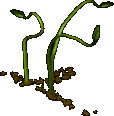

=== "Info"

    

    <table>
    <tr>
        <th>Spawn Locations</th>
        <td id="Corpser_Spawn-Locations" colspan="3"></td>
    </tr>
    <tr>
        <th>Base Damage</th>
        <td id="Corpser_Base-Damage"></td>
        <th>Armor Rating</th>
        <td id="Corpser_Armor-Rating"></td>
    </tr>
    <tr>
        <th>Fame</th>
        <td id="Corpser_Fame"></td>
        <th>Karma</th>
        <td id="Corpser_Karma"></td>
    </tr>
    <tr>
        <th>Super Slayer</th>
        <td id="Corpser_Super-Slayer"></td>
        <th>Minor Slayer</th>
        <td id="Corpser_Minor-Slayer"></td>
    </tr>
    <tr>
        <th>Barding Difficulty</th>
        <td id="Corpser_Barding-Difficulty"></td>
        <th>Taming Difficulty</th>
        <td id="Corpser_Taming-Difficulty"></td>
    </tr>
    </table>
    

=== "Attributes"

    

    <table>
    <tr>
        <th>Hit Points</th>
        <td id="Corpser_Hit-Points"></td>
        <th>Strength</th>
        <td id="Corpser_Strength"></td>
    </tr>
    <tr>
        <th>Stamina</th>
        <td id="Corpser_Stamina"></td>
        <th>Dexterity</th>
        <td id="Corpser_Dexterity"></td>
    </tr>
    <tr>
        <th>Mana</th>
        <td id="Corpser_Mana"></td>
        <th>Intelligence</th>
        <td id="Corpser_Intelligence"></td>
    </tr>
    </table>
    

=== "Skills"

    

    <table>
    <tr>
        <th>Wrestling</th>
        <td id="Corpser_Wrestling"></td>
        <th>Magery</th>
        <td id="Corpser_Magery"></td>
    </tr>
    <tr>
        <th>Tactics</th>
        <td id="Corpser_Tactics"></td>
        <th>Meditation</th>
        <td id="Corpser_Meditation"></td>
    </tr>
    <tr>
        <th>Resisting Spells</th>
        <td id="Corpser_Resisting-Spells"></td>
        <th>Evaluating Intelligence</th>
        <td id="Corpser_Evaluating-Intelligence"></td>
    </tr>
    <tr>
        <th>Anatomy</th>
        <td id="Corpser_Anatomy"></td>
        <th>Poisoning</th>
        <td id="Corpser_Poisoning"></td>
    </tr>
    </table>
    

=== "Loot"

    

    <table>
    <tr>
        <th>Gold</th>
        <td id="Corpser_Gold"></td>
    </tr>
    <tr>
        <th>Treasure Map lvl</th>
        <td id="Corpser_Treasure-Map-lvl"></td>
    </tr>
        <tr>
        <th>Slayer Drop</th>
        <td id="Corpser_Slayer-Drop"></td>
    </tr>
    </table>
    

### Cougar

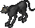

=== "Info"

    

    <table>
    <tr>
        <th>Spawn Locations</th>
        <td id="Cougar_Spawn-Locations" colspan="3"></td>
    </tr>
    <tr>
        <th>Base Damage</th>
        <td id="Cougar_Base-Damage"></td>
        <th>Armor Rating</th>
        <td id="Cougar_Armor-Rating"></td>
    </tr>
    <tr>
        <th>Fame</th>
        <td id="Cougar_Fame"></td>
        <th>Karma</th>
        <td id="Cougar_Karma"></td>
    </tr>
    <tr>
        <th>Super Slayer</th>
        <td id="Cougar_Super-Slayer"></td>
        <th>Minor Slayer</th>
        <td id="Cougar_Minor-Slayer"></td>
    </tr>
    <tr>
        <th>Barding Difficulty</th>
        <td id="Cougar_Barding-Difficulty"></td>
        <th>Taming Difficulty</th>
        <td id="Cougar_Taming-Difficulty"></td>
    </tr>
    </table>
    

=== "Attributes"

    

    <table>
    <tr>
        <th>Hit Points</th>
        <td id="Cougar_Hit-Points"></td>
        <th>Strength</th>
        <td id="Cougar_Strength"></td>
    </tr>
    <tr>
        <th>Stamina</th>
        <td id="Cougar_Stamina"></td>
        <th>Dexterity</th>
        <td id="Cougar_Dexterity"></td>
    </tr>
    <tr>
        <th>Mana</th>
        <td id="Cougar_Mana"></td>
        <th>Intelligence</th>
        <td id="Cougar_Intelligence"></td>
    </tr>
    </table>
    

=== "Skills"

    

    <table>
    <tr>
        <th>Wrestling</th>
        <td id="Cougar_Wrestling"></td>
        <th>Magery</th>
        <td id="Cougar_Magery"></td>
    </tr>
    <tr>
        <th>Tactics</th>
        <td id="Cougar_Tactics"></td>
        <th>Meditation</th>
        <td id="Cougar_Meditation"></td>
    </tr>
    <tr>
        <th>Resisting Spells</th>
        <td id="Cougar_Resisting-Spells"></td>
        <th>Evaluating Intelligence</th>
        <td id="Cougar_Evaluating-Intelligence"></td>
    </tr>
    <tr>
        <th>Anatomy</th>
        <td id="Cougar_Anatomy"></td>
        <th>Poisoning</th>
        <td id="Cougar_Poisoning"></td>
    </tr>
    </table>
    

=== "Loot"

    

    <table>
    <tr>
        <th>Gold</th>
        <td id="Cougar_Gold"></td>
    </tr>
    <tr>
        <th>Treasure Map lvl</th>
        <td id="Cougar_Treasure-Map-lvl"></td>
    </tr>
        <tr>
        <th>Slayer Drop</th>
        <td id="Cougar_Slayer-Drop"></td>
    </tr>
    </table>
    

### Cow

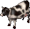

=== "Info"

    

    <table>
    <tr>
        <th>Spawn Locations</th>
        <td id="Cow_Spawn-Locations" colspan="3"></td>
    </tr>
    <tr>
        <th>Base Damage</th>
        <td id="Cow_Base-Damage"></td>
        <th>Armor Rating</th>
        <td id="Cow_Armor-Rating"></td>
    </tr>
    <tr>
        <th>Fame</th>
        <td id="Cow_Fame"></td>
        <th>Karma</th>
        <td id="Cow_Karma"></td>
    </tr>
    <tr>
        <th>Super Slayer</th>
        <td id="Cow_Super-Slayer"></td>
        <th>Minor Slayer</th>
        <td id="Cow_Minor-Slayer"></td>
    </tr>
    <tr>
        <th>Barding Difficulty</th>
        <td id="Cow_Barding-Difficulty"></td>
        <th>Taming Difficulty</th>
        <td id="Cow_Taming-Difficulty"></td>
    </tr>
    </table>
    

=== "Attributes"

    

    <table>
    <tr>
        <th>Hit Points</th>
        <td id="Cow_Hit-Points"></td>
        <th>Strength</th>
        <td id="Cow_Strength"></td>
    </tr>
    <tr>
        <th>Stamina</th>
        <td id="Cow_Stamina"></td>
        <th>Dexterity</th>
        <td id="Cow_Dexterity"></td>
    </tr>
    <tr>
        <th>Mana</th>
        <td id="Cow_Mana"></td>
        <th>Intelligence</th>
        <td id="Cow_Intelligence"></td>
    </tr>
    </table>
    

=== "Skills"

    

    <table>
    <tr>
        <th>Wrestling</th>
        <td id="Cow_Wrestling"></td>
        <th>Magery</th>
        <td id="Cow_Magery"></td>
    </tr>
    <tr>
        <th>Tactics</th>
        <td id="Cow_Tactics"></td>
        <th>Meditation</th>
        <td id="Cow_Meditation"></td>
    </tr>
    <tr>
        <th>Resisting Spells</th>
        <td id="Cow_Resisting-Spells"></td>
        <th>Evaluating Intelligence</th>
        <td id="Cow_Evaluating-Intelligence"></td>
    </tr>
    <tr>
        <th>Anatomy</th>
        <td id="Cow_Anatomy"></td>
        <th>Poisoning</th>
        <td id="Cow_Poisoning"></td>
    </tr>
    </table>
    

=== "Loot"

    

    <table>
    <tr>
        <th>Gold</th>
        <td id="Cow_Gold"></td>
    </tr>
    <tr>
        <th>Treasure Map lvl</th>
        <td id="Cow_Treasure-Map-lvl"></td>
    </tr>
        <tr>
        <th>Slayer Drop</th>
        <td id="Cow_Slayer-Drop"></td>
    </tr>
    </table>
    

### Crane

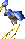

=== "Info"

    

    <table>
    <tr>
        <th>Spawn Locations</th>
        <td id="Crane_Spawn-Locations" colspan="3"></td>
    </tr>
    <tr>
        <th>Base Damage</th>
        <td id="Crane_Base-Damage"></td>
        <th>Armor Rating</th>
        <td id="Crane_Armor-Rating"></td>
    </tr>
    <tr>
        <th>Fame</th>
        <td id="Crane_Fame"></td>
        <th>Karma</th>
        <td id="Crane_Karma"></td>
    </tr>
    <tr>
        <th>Super Slayer</th>
        <td id="Crane_Super-Slayer"></td>
        <th>Minor Slayer</th>
        <td id="Crane_Minor-Slayer"></td>
    </tr>
    <tr>
        <th>Barding Difficulty</th>
        <td id="Crane_Barding-Difficulty"></td>
        <th>Taming Difficulty</th>
        <td id="Crane_Taming-Difficulty"></td>
    </tr>
    </table>
    

=== "Attributes"

    

    <table>
    <tr>
        <th>Hit Points</th>
        <td id="Crane_Hit-Points"></td>
        <th>Strength</th>
        <td id="Crane_Strength"></td>
    </tr>
    <tr>
        <th>Stamina</th>
        <td id="Crane_Stamina"></td>
        <th>Dexterity</th>
        <td id="Crane_Dexterity"></td>
    </tr>
    <tr>
        <th>Mana</th>
        <td id="Crane_Mana"></td>
        <th>Intelligence</th>
        <td id="Crane_Intelligence"></td>
    </tr>
    </table>
    

=== "Skills"

    

    <table>
    <tr>
        <th>Wrestling</th>
        <td id="Crane_Wrestling"></td>
        <th>Magery</th>
        <td id="Crane_Magery"></td>
    </tr>
    <tr>
        <th>Tactics</th>
        <td id="Crane_Tactics"></td>
        <th>Meditation</th>
        <td id="Crane_Meditation"></td>
    </tr>
    <tr>
        <th>Resisting Spells</th>
        <td id="Crane_Resisting-Spells"></td>
        <th>Evaluating Intelligence</th>
        <td id="Crane_Evaluating-Intelligence"></td>
    </tr>
    <tr>
        <th>Anatomy</th>
        <td id="Crane_Anatomy"></td>
        <th>Poisoning</th>
        <td id="Crane_Poisoning"></td>
    </tr>
    </table>
    

=== "Loot"

    

    <table>
    <tr>
        <th>Gold</th>
        <td id="Crane_Gold"></td>
    </tr>
    <tr>
        <th>Treasure Map lvl</th>
        <td id="Crane_Treasure-Map-lvl"></td>
    </tr>
        <tr>
        <th>Slayer Drop</th>
        <td id="Crane_Slayer-Drop"></td>
    </tr>
    </table>
    

### Crow

=== "Info"

    

    <table>
    <tr>
        <th>Spawn Locations</th>
        <td id="Crow_Spawn-Locations" colspan="3"></td>
    </tr>
    <tr>
        <th>Base Damage</th>
        <td id="Crow_Base-Damage"></td>
        <th>Armor Rating</th>
        <td id="Crow_Armor-Rating"></td>
    </tr>
    <tr>
        <th>Fame</th>
        <td id="Crow_Fame"></td>
        <th>Karma</th>
        <td id="Crow_Karma"></td>
    </tr>
    <tr>
        <th>Super Slayer</th>
        <td id="Crow_Super-Slayer"></td>
        <th>Minor Slayer</th>
        <td id="Crow_Minor-Slayer"></td>
    </tr>
    <tr>
        <th>Barding Difficulty</th>
        <td id="Crow_Barding-Difficulty"></td>
        <th>Taming Difficulty</th>
        <td id="Crow_Taming-Difficulty"></td>
    </tr>
    </table>
    

=== "Attributes"

    

    <table>
    <tr>
        <th>Hit Points</th>
        <td id="Crow_Hit-Points"></td>
        <th>Strength</th>
        <td id="Crow_Strength"></td>
    </tr>
    <tr>
        <th>Stamina</th>
        <td id="Crow_Stamina"></td>
        <th>Dexterity</th>
        <td id="Crow_Dexterity"></td>
    </tr>
    <tr>
        <th>Mana</th>
        <td id="Crow_Mana"></td>
        <th>Intelligence</th>
        <td id="Crow_Intelligence"></td>
    </tr>
    </table>
    

=== "Skills"

    

    <table>
    <tr>
        <th>Wrestling</th>
        <td id="Crow_Wrestling"></td>
        <th>Magery</th>
        <td id="Crow_Magery"></td>
    </tr>
    <tr>
        <th>Tactics</th>
        <td id="Crow_Tactics"></td>
        <th>Meditation</th>
        <td id="Crow_Meditation"></td>
    </tr>
    <tr>
        <th>Resisting Spells</th>
        <td id="Crow_Resisting-Spells"></td>
        <th>Evaluating Intelligence</th>
        <td id="Crow_Evaluating-Intelligence"></td>
    </tr>
    <tr>
        <th>Anatomy</th>
        <td id="Crow_Anatomy"></td>
        <th>Poisoning</th>
        <td id="Crow_Poisoning"></td>
    </tr>
    </table>
    

=== "Loot"

    

    <table>
    <tr>
        <th>Gold</th>
        <td id="Crow_Gold"></td>
    </tr>
    <tr>
        <th>Treasure Map lvl</th>
        <td id="Crow_Treasure-Map-lvl"></td>
    </tr>
        <tr>
        <th>Slayer Drop</th>
        <td id="Crow_Slayer-Drop"></td>
    </tr>
    </table>
    

### Cyclopean Warrior

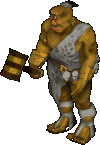

=== "Info"

    

    <table>
    <tr>
        <th>Spawn Locations</th>
        <td id="Cyclopean-Warrior_Spawn-Locations" colspan="3"></td>
    </tr>
    <tr>
        <th>Base Damage</th>
        <td id="Cyclopean-Warrior_Base-Damage"></td>
        <th>Armor Rating</th>
        <td id="Cyclopean-Warrior_Armor-Rating"></td>
    </tr>
    <tr>
        <th>Fame</th>
        <td id="Cyclopean-Warrior_Fame"></td>
        <th>Karma</th>
        <td id="Cyclopean-Warrior_Karma"></td>
    </tr>
    <tr>
        <th>Super Slayer</th>
        <td id="Cyclopean-Warrior_Super-Slayer"></td>
        <th>Minor Slayer</th>
        <td id="Cyclopean-Warrior_Minor-Slayer"></td>
    </tr>
    <tr>
        <th>Barding Difficulty</th>
        <td id="Cyclopean-Warrior_Barding-Difficulty"></td>
        <th>Taming Difficulty</th>
        <td id="Cyclopean-Warrior_Taming-Difficulty"></td>
    </tr>
    </table>
    

=== "Attributes"

    

    <table>
    <tr>
        <th>Hit Points</th>
        <td id="Cyclopean-Warrior_Hit-Points"></td>
        <th>Strength</th>
        <td id="Cyclopean-Warrior_Strength"></td>
    </tr>
    <tr>
        <th>Stamina</th>
        <td id="Cyclopean-Warrior_Stamina"></td>
        <th>Dexterity</th>
        <td id="Cyclopean-Warrior_Dexterity"></td>
    </tr>
    <tr>
        <th>Mana</th>
        <td id="Cyclopean-Warrior_Mana"></td>
        <th>Intelligence</th>
        <td id="Cyclopean-Warrior_Intelligence"></td>
    </tr>
    </table>
    

=== "Skills"

    

    <table>
    <tr>
        <th>Wrestling</th>
        <td id="Cyclopean-Warrior_Wrestling"></td>
        <th>Magery</th>
        <td id="Cyclopean-Warrior_Magery"></td>
    </tr>
    <tr>
        <th>Tactics</th>
        <td id="Cyclopean-Warrior_Tactics"></td>
        <th>Meditation</th>
        <td id="Cyclopean-Warrior_Meditation"></td>
    </tr>
    <tr>
        <th>Resisting Spells</th>
        <td id="Cyclopean-Warrior_Resisting-Spells"></td>
        <th>Evaluating Intelligence</th>
        <td id="Cyclopean-Warrior_Evaluating-Intelligence"></td>
    </tr>
    <tr>
        <th>Anatomy</th>
        <td id="Cyclopean-Warrior_Anatomy"></td>
        <th>Poisoning</th>
        <td id="Cyclopean-Warrior_Poisoning"></td>
    </tr>
    </table>
    

=== "Loot"

    

    <table>
    <tr>
        <th>Gold</th>
        <td id="Cyclopean-Warrior_Gold"></td>
    </tr>
    <tr>
        <th>Treasure Map lvl</th>
        <td id="Cyclopean-Warrior_Treasure-Map-lvl"></td>
    </tr>
        <tr>
        <th>Slayer Drop</th>
        <td id="Cyclopean-Warrior_Slayer-Drop"></td>
    </tr>
    </table>
    

### Daemon

=== "Info"

    

    <table>
    <tr>
        <th>Spawn Locations</th>
        <td id="Daemon_Spawn-Locations" colspan="3"></td>
    </tr>
    <tr>
        <th>Base Damage</th>
        <td id="Daemon_Base-Damage"></td>
        <th>Armor Rating</th>
        <td id="Daemon_Armor-Rating"></td>
    </tr>
    <tr>
        <th>Fame</th>
        <td id="Daemon_Fame"></td>
        <th>Karma</th>
        <td id="Daemon_Karma"></td>
    </tr>
    <tr>
        <th>Super Slayer</th>
        <td id="Daemon_Super-Slayer"></td>
        <th>Minor Slayer</th>
        <td id="Daemon_Minor-Slayer"></td>
    </tr>
    <tr>
        <th>Barding Difficulty</th>
        <td id="Daemon_Barding-Difficulty"></td>
        <th>Taming Difficulty</th>
        <td id="Daemon_Taming-Difficulty"></td>
    </tr>
    </table>
    

=== "Attributes"

    

    <table>
    <tr>
        <th>Hit Points</th>
        <td id="Daemon_Hit-Points"></td>
        <th>Strength</th>
        <td id="Daemon_Strength"></td>
    </tr>
    <tr>
        <th>Stamina</th>
        <td id="Daemon_Stamina"></td>
        <th>Dexterity</th>
        <td id="Daemon_Dexterity"></td>
    </tr>
    <tr>
        <th>Mana</th>
        <td id="Daemon_Mana"></td>
        <th>Intelligence</th>
        <td id="Daemon_Intelligence"></td>
    </tr>
    </table>
    

=== "Skills"

    

    <table>
    <tr>
        <th>Wrestling</th>
        <td id="Daemon_Wrestling"></td>
        <th>Magery</th>
        <td id="Daemon_Magery"></td>
    </tr>
    <tr>
        <th>Tactics</th>
        <td id="Daemon_Tactics"></td>
        <th>Meditation</th>
        <td id="Daemon_Meditation"></td>
    </tr>
    <tr>
        <th>Resisting Spells</th>
        <td id="Daemon_Resisting-Spells"></td>
        <th>Evaluating Intelligence</th>
        <td id="Daemon_Evaluating-Intelligence"></td>
    </tr>
    <tr>
        <th>Anatomy</th>
        <td id="Daemon_Anatomy"></td>
        <th>Poisoning</th>
        <td id="Daemon_Poisoning"></td>
    </tr>
    </table>
    

=== "Loot"

    

    <table>
    <tr>
        <th>Gold</th>
        <td id="Daemon_Gold"></td>
    </tr>
    <tr>
        <th>Treasure Map lvl</th>
        <td id="Daemon_Treasure-Map-lvl"></td>
    </tr>
        <tr>
        <th>Slayer Drop</th>
        <td id="Daemon_Slayer-Drop"></td>
    </tr>
    </table>
    

### Dark Wisp

=== "Info"

    

    <table>
    <tr>
        <th>Spawn Locations</th>
        <td id="Dark-Wisp_Spawn-Locations" colspan="3"></td>
    </tr>
    <tr>
        <th>Base Damage</th>
        <td id="Dark-Wisp_Base-Damage"></td>
        <th>Armor Rating</th>
        <td id="Dark-Wisp_Armor-Rating"></td>
    </tr>
    <tr>
        <th>Fame</th>
        <td id="Dark-Wisp_Fame"></td>
        <th>Karma</th>
        <td id="Dark-Wisp_Karma"></td>
    </tr>
    <tr>
        <th>Super Slayer</th>
        <td id="Dark-Wisp_Super-Slayer"></td>
        <th>Minor Slayer</th>
        <td id="Dark-Wisp_Minor-Slayer"></td>
    </tr>
    <tr>
        <th>Barding Difficulty</th>
        <td id="Dark-Wisp_Barding-Difficulty"></td>
        <th>Taming Difficulty</th>
        <td id="Dark-Wisp_Taming-Difficulty"></td>
    </tr>
    </table>
    

=== "Attributes"

    

    <table>
    <tr>
        <th>Hit Points</th>
        <td id="Dark-Wisp_Hit-Points"></td>
        <th>Strength</th>
        <td id="Dark-Wisp_Strength"></td>
    </tr>
    <tr>
        <th>Stamina</th>
        <td id="Dark-Wisp_Stamina"></td>
        <th>Dexterity</th>
        <td id="Dark-Wisp_Dexterity"></td>
    </tr>
    <tr>
        <th>Mana</th>
        <td id="Dark-Wisp_Mana"></td>
        <th>Intelligence</th>
        <td id="Dark-Wisp_Intelligence"></td>
    </tr>
    </table>
    

=== "Skills"

    

    <table>
    <tr>
        <th>Wrestling</th>
        <td id="Dark-Wisp_Wrestling"></td>
        <th>Magery</th>
        <td id="Dark-Wisp_Magery"></td>
    </tr>
    <tr>
        <th>Tactics</th>
        <td id="Dark-Wisp_Tactics"></td>
        <th>Meditation</th>
        <td id="Dark-Wisp_Meditation"></td>
    </tr>
    <tr>
        <th>Resisting Spells</th>
        <td id="Dark-Wisp_Resisting-Spells"></td>
        <th>Evaluating Intelligence</th>
        <td id="Dark-Wisp_Evaluating-Intelligence"></td>
    </tr>
    <tr>
        <th>Anatomy</th>
        <td id="Dark-Wisp_Anatomy"></td>
        <th>Poisoning</th>
        <td id="Dark-Wisp_Poisoning"></td>
    </tr>
    </table>
    

=== "Loot"

    

    <table>
    <tr>
        <th>Gold</th>
        <td id="Dark-Wisp_Gold"></td>
    </tr>
    <tr>
        <th>Treasure Map lvl</th>
        <td id="Dark-Wisp_Treasure-Map-lvl"></td>
    </tr>
        <tr>
        <th>Slayer Drop</th>
        <td id="Dark-Wisp_Slayer-Drop"></td>
    </tr>
    </table>
    

### Deep Sea Serpent

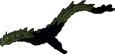

=== "Info"

    

    <table>
    <tr>
        <th>Spawn Locations</th>
        <td id="Deep-Sea-Serpent_Spawn-Locations" colspan="3"></td>
    </tr>
    <tr>
        <th>Base Damage</th>
        <td id="Deep-Sea-Serpent_Base-Damage"></td>
        <th>Armor Rating</th>
        <td id="Deep-Sea-Serpent_Armor-Rating"></td>
    </tr>
    <tr>
        <th>Fame</th>
        <td id="Deep-Sea-Serpent_Fame"></td>
        <th>Karma</th>
        <td id="Deep-Sea-Serpent_Karma"></td>
    </tr>
    <tr>
        <th>Super Slayer</th>
        <td id="Deep-Sea-Serpent_Super-Slayer"></td>
        <th>Minor Slayer</th>
        <td id="Deep-Sea-Serpent_Minor-Slayer"></td>
    </tr>
    <tr>
        <th>Barding Difficulty</th>
        <td id="Deep-Sea-Serpent_Barding-Difficulty"></td>
        <th>Taming Difficulty</th>
        <td id="Deep-Sea-Serpent_Taming-Difficulty"></td>
    </tr>
    </table>
    

=== "Attributes"

    

    <table>
    <tr>
        <th>Hit Points</th>
        <td id="Deep-Sea-Serpent_Hit-Points"></td>
        <th>Strength</th>
        <td id="Deep-Sea-Serpent_Strength"></td>
    </tr>
    <tr>
        <th>Stamina</th>
        <td id="Deep-Sea-Serpent_Stamina"></td>
        <th>Dexterity</th>
        <td id="Deep-Sea-Serpent_Dexterity"></td>
    </tr>
    <tr>
        <th>Mana</th>
        <td id="Deep-Sea-Serpent_Mana"></td>
        <th>Intelligence</th>
        <td id="Deep-Sea-Serpent_Intelligence"></td>
    </tr>
    </table>
    

=== "Skills"

    

    <table>
    <tr>
        <th>Wrestling</th>
        <td id="Deep-Sea-Serpent_Wrestling"></td>
        <th>Magery</th>
        <td id="Deep-Sea-Serpent_Magery"></td>
    </tr>
    <tr>
        <th>Tactics</th>
        <td id="Deep-Sea-Serpent_Tactics"></td>
        <th>Meditation</th>
        <td id="Deep-Sea-Serpent_Meditation"></td>
    </tr>
    <tr>
        <th>Resisting Spells</th>
        <td id="Deep-Sea-Serpent_Resisting-Spells"></td>
        <th>Evaluating Intelligence</th>
        <td id="Deep-Sea-Serpent_Evaluating-Intelligence"></td>
    </tr>
    <tr>
        <th>Anatomy</th>
        <td id="Deep-Sea-Serpent_Anatomy"></td>
        <th>Poisoning</th>
        <td id="Deep-Sea-Serpent_Poisoning"></td>
    </tr>
    </table>
    

=== "Loot"

    

    <table>
    <tr>
        <th>Gold</th>
        <td id="Deep-Sea-Serpent_Gold"></td>
    </tr>
    <tr>
        <th>Treasure Map lvl</th>
        <td id="Deep-Sea-Serpent_Treasure-Map-lvl"></td>
    </tr>
        <tr>
        <th>Slayer Drop</th>
        <td id="Deep-Sea-Serpent_Slayer-Drop"></td>
    </tr>
    </table>
    

### Desert Ostard

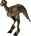

=== "Info"

    

    <table>
    <tr>
        <th>Spawn Locations</th>
        <td id="Desert-Ostard_Spawn-Locations" colspan="3"></td>
    </tr>
    <tr>
        <th>Base Damage</th>
        <td id="Desert-Ostard_Base-Damage"></td>
        <th>Armor Rating</th>
        <td id="Desert-Ostard_Armor-Rating"></td>
    </tr>
    <tr>
        <th>Fame</th>
        <td id="Desert-Ostard_Fame"></td>
        <th>Karma</th>
        <td id="Desert-Ostard_Karma"></td>
    </tr>
    <tr>
        <th>Super Slayer</th>
        <td id="Desert-Ostard_Super-Slayer"></td>
        <th>Minor Slayer</th>
        <td id="Desert-Ostard_Minor-Slayer"></td>
    </tr>
    <tr>
        <th>Barding Difficulty</th>
        <td id="Desert-Ostard_Barding-Difficulty"></td>
        <th>Taming Difficulty</th>
        <td id="Desert-Ostard_Taming-Difficulty"></td>
    </tr>
    </table>
    

=== "Attributes"

    

    <table>
    <tr>
        <th>Hit Points</th>
        <td id="Desert-Ostard_Hit-Points"></td>
        <th>Strength</th>
        <td id="Desert-Ostard_Strength"></td>
    </tr>
    <tr>
        <th>Stamina</th>
        <td id="Desert-Ostard_Stamina"></td>
        <th>Dexterity</th>
        <td id="Desert-Ostard_Dexterity"></td>
    </tr>
    <tr>
        <th>Mana</th>
        <td id="Desert-Ostard_Mana"></td>
        <th>Intelligence</th>
        <td id="Desert-Ostard_Intelligence"></td>
    </tr>
    </table>
    

=== "Skills"

    

    <table>
    <tr>
        <th>Wrestling</th>
        <td id="Desert-Ostard_Wrestling"></td>
        <th>Magery</th>
        <td id="Desert-Ostard_Magery"></td>
    </tr>
    <tr>
        <th>Tactics</th>
        <td id="Desert-Ostard_Tactics"></td>
        <th>Meditation</th>
        <td id="Desert-Ostard_Meditation"></td>
    </tr>
    <tr>
        <th>Resisting Spells</th>
        <td id="Desert-Ostard_Resisting-Spells"></td>
        <th>Evaluating Intelligence</th>
        <td id="Desert-Ostard_Evaluating-Intelligence"></td>
    </tr>
    <tr>
        <th>Anatomy</th>
        <td id="Desert-Ostard_Anatomy"></td>
        <th>Poisoning</th>
        <td id="Desert-Ostard_Poisoning"></td>
    </tr>
    </table>
    

=== "Loot"

    

    <table>
    <tr>
        <th>Gold</th>
        <td id="Desert-Ostard_Gold"></td>
    </tr>
    <tr>
        <th>Treasure Map lvl</th>
        <td id="Desert-Ostard_Treasure-Map-lvl"></td>
    </tr>
        <tr>
        <th>Slayer Drop</th>
        <td id="Desert-Ostard_Slayer-Drop"></td>
    </tr>
    </table>
    

### Devourer of Souls

!!! warning
    Under construction.

=== "Info"

    

    <table>
    <tr>
        <th>Spawn Locations</th>
        <td id="Devourer-of-Souls_Spawn-Locations" colspan="3"></td>
    </tr>
    <tr>
        <th>Base Damage</th>
        <td id="Devourer-of-Souls_Base-Damage"></td>
        <th>Armor Rating</th>
        <td id="Devourer-of-Souls_Armor-Rating"></td>
    </tr>
    <tr>
        <th>Fame</th>
        <td id="Devourer-of-Souls_Fame"></td>
        <th>Karma</th>
        <td id="Devourer-of-Souls_Karma"></td>
    </tr>
    <tr>
        <th>Super Slayer</th>
        <td id="Devourer-of-Souls_Super-Slayer"></td>
        <th>Minor Slayer</th>
        <td id="Devourer-of-Souls_Minor-Slayer"></td>
    </tr>
    <tr>
        <th>Barding Difficulty</th>
        <td id="Devourer-of-Souls_Barding-Difficulty"></td>
        <th>Taming Difficulty</th>
        <td id="Devourer-of-Souls_Taming-Difficulty"></td>
    </tr>
    </table>
    

=== "Attributes"

    

    <table>
    <tr>
        <th>Hit Points</th>
        <td id="Devourer-of-Souls_Hit-Points"></td>
        <th>Strength</th>
        <td id="Devourer-of-Souls_Strength"></td>
    </tr>
    <tr>
        <th>Stamina</th>
        <td id="Devourer-of-Souls_Stamina"></td>
        <th>Dexterity</th>
        <td id="Devourer-of-Souls_Dexterity"></td>
    </tr>
    <tr>
        <th>Mana</th>
        <td id="Devourer-of-Souls_Mana"></td>
        <th>Intelligence</th>
        <td id="Devourer-of-Souls_Intelligence"></td>
    </tr>
    </table>
    

=== "Skills"

    

    <table>
    <tr>
        <th>Wrestling</th>
        <td id="Devourer-of-Souls_Wrestling"></td>
        <th>Magery</th>
        <td id="Devourer-of-Souls_Magery"></td>
    </tr>
    <tr>
        <th>Tactics</th>
        <td id="Devourer-of-Souls_Tactics"></td>
        <th>Meditation</th>
        <td id="Devourer-of-Souls_Meditation"></td>
    </tr>
    <tr>
        <th>Resisting Spells</th>
        <td id="Devourer-of-Souls_Resisting-Spells"></td>
        <th>Evaluating Intelligence</th>
        <td id="Devourer-of-Souls_Evaluating-Intelligence"></td>
    </tr>
    <tr>
        <th>Anatomy</th>
        <td id="Devourer-of-Souls_Anatomy"></td>
        <th>Poisoning</th>
        <td id="Devourer-of-Souls_Poisoning"></td>
    </tr>
    </table>
    

=== "Loot"

    

    <table>
    <tr>
        <th>Gold</th>
        <td id="Devourer-of-Souls_Gold"></td>
    </tr>
    <tr>
        <th>Treasure Map lvl</th>
        <td id="Devourer-of-Souls_Treasure-Map-lvl"></td>
    </tr>
        <tr>
        <th>Slayer Drop</th>
        <td id="Devourer-of-Souls_Slayer-Drop"></td>
    </tr>
    </table>
    

### Dire Wolf

=== "Info"

    

    <table>
    <tr>
        <th>Spawn Locations</th>
        <td id="Dire-Wolf_Spawn-Locations" colspan="3"></td>
    </tr>
    <tr>
        <th>Base Damage</th>
        <td id="Dire-Wolf_Base-Damage"></td>
        <th>Armor Rating</th>
        <td id="Dire-Wolf_Armor-Rating"></td>
    </tr>
    <tr>
        <th>Fame</th>
        <td id="Dire-Wolf_Fame"></td>
        <th>Karma</th>
        <td id="Dire-Wolf_Karma"></td>
    </tr>
    <tr>
        <th>Super Slayer</th>
        <td id="Dire-Wolf_Super-Slayer"></td>
        <th>Minor Slayer</th>
        <td id="Dire-Wolf_Minor-Slayer"></td>
    </tr>
    <tr>
        <th>Barding Difficulty</th>
        <td id="Dire-Wolf_Barding-Difficulty"></td>
        <th>Taming Difficulty</th>
        <td id="Dire-Wolf_Taming-Difficulty"></td>
    </tr>
    </table>
    

=== "Attributes"

    

    <table>
    <tr>
        <th>Hit Points</th>
        <td id="Dire-Wolf_Hit-Points"></td>
        <th>Strength</th>
        <td id="Dire-Wolf_Strength"></td>
    </tr>
    <tr>
        <th>Stamina</th>
        <td id="Dire-Wolf_Stamina"></td>
        <th>Dexterity</th>
        <td id="Dire-Wolf_Dexterity"></td>
    </tr>
    <tr>
        <th>Mana</th>
        <td id="Dire-Wolf_Mana"></td>
        <th>Intelligence</th>
        <td id="Dire-Wolf_Intelligence"></td>
    </tr>
    </table>
    

=== "Skills"

    

    <table>
    <tr>
        <th>Wrestling</th>
        <td id="Dire-Wolf_Wrestling"></td>
        <th>Magery</th>
        <td id="Dire-Wolf_Magery"></td>
    </tr>
    <tr>
        <th>Tactics</th>
        <td id="Dire-Wolf_Tactics"></td>
        <th>Meditation</th>
        <td id="Dire-Wolf_Meditation"></td>
    </tr>
    <tr>
        <th>Resisting Spells</th>
        <td id="Dire-Wolf_Resisting-Spells"></td>
        <th>Evaluating Intelligence</th>
        <td id="Dire-Wolf_Evaluating-Intelligence"></td>
    </tr>
    <tr>
        <th>Anatomy</th>
        <td id="Dire-Wolf_Anatomy"></td>
        <th>Poisoning</th>
        <td id="Dire-Wolf_Poisoning"></td>
    </tr>
    </table>
    

=== "Loot"

    

    <table>
    <tr>
        <th>Gold</th>
        <td id="Dire-Wolf_Gold"></td>
    </tr>
    <tr>
        <th>Treasure Map lvl</th>
        <td id="Dire-Wolf_Treasure-Map-lvl"></td>
    </tr>
        <tr>
        <th>Slayer Drop</th>
        <td id="Dire-Wolf_Slayer-Drop"></td>
    </tr>
    </table>
    

### Dog

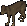

=== "Info"

    

    <table>
    <tr>
        <th>Spawn Locations</th>
        <td id="Dog_Spawn-Locations" colspan="3"></td>
    </tr>
    <tr>
        <th>Base Damage</th>
        <td id="Dog_Base-Damage"></td>
        <th>Armor Rating</th>
        <td id="Dog_Armor-Rating"></td>
    </tr>
    <tr>
        <th>Fame</th>
        <td id="Dog_Fame"></td>
        <th>Karma</th>
        <td id="Dog_Karma"></td>
    </tr>
    <tr>
        <th>Super Slayer</th>
        <td id="Dog_Super-Slayer"></td>
        <th>Minor Slayer</th>
        <td id="Dog_Minor-Slayer"></td>
    </tr>
    <tr>
        <th>Barding Difficulty</th>
        <td id="Dog_Barding-Difficulty"></td>
        <th>Taming Difficulty</th>
        <td id="Dog_Taming-Difficulty"></td>
    </tr>
    </table>
    

=== "Attributes"

    

    <table>
    <tr>
        <th>Hit Points</th>
        <td id="Dog_Hit-Points"></td>
        <th>Strength</th>
        <td id="Dog_Strength"></td>
    </tr>
    <tr>
        <th>Stamina</th>
        <td id="Dog_Stamina"></td>
        <th>Dexterity</th>
        <td id="Dog_Dexterity"></td>
    </tr>
    <tr>
        <th>Mana</th>
        <td id="Dog_Mana"></td>
        <th>Intelligence</th>
        <td id="Dog_Intelligence"></td>
    </tr>
    </table>
    

=== "Skills"

    

    <table>
    <tr>
        <th>Wrestling</th>
        <td id="Dog_Wrestling"></td>
        <th>Magery</th>
        <td id="Dog_Magery"></td>
    </tr>
    <tr>
        <th>Tactics</th>
        <td id="Dog_Tactics"></td>
        <th>Meditation</th>
        <td id="Dog_Meditation"></td>
    </tr>
    <tr>
        <th>Resisting Spells</th>
        <td id="Dog_Resisting-Spells"></td>
        <th>Evaluating Intelligence</th>
        <td id="Dog_Evaluating-Intelligence"></td>
    </tr>
    <tr>
        <th>Anatomy</th>
        <td id="Dog_Anatomy"></td>
        <th>Poisoning</th>
        <td id="Dog_Poisoning"></td>
    </tr>
    </table>
    

=== "Loot"

    

    <table>
    <tr>
        <th>Gold</th>
        <td id="Dog_Gold"></td>
    </tr>
    <tr>
        <th>Treasure Map lvl</th>
        <td id="Dog_Treasure-Map-lvl"></td>
    </tr>
        <tr>
        <th>Slayer Drop</th>
        <td id="Dog_Slayer-Drop"></td>
    </tr>
    </table>
    

### Dolphin

=== "Info"

    

    <table>
    <tr>
        <th>Spawn Locations</th>
        <td id="Dolphin_Spawn-Locations" colspan="3"></td>
    </tr>
    <tr>
        <th>Base Damage</th>
        <td id="Dolphin_Base-Damage"></td>
        <th>Armor Rating</th>
        <td id="Dolphin_Armor-Rating"></td>
    </tr>
    <tr>
        <th>Fame</th>
        <td id="Dolphin_Fame"></td>
        <th>Karma</th>
        <td id="Dolphin_Karma"></td>
    </tr>
    <tr>
        <th>Super Slayer</th>
        <td id="Dolphin_Super-Slayer"></td>
        <th>Minor Slayer</th>
        <td id="Dolphin_Minor-Slayer"></td>
    </tr>
    <tr>
        <th>Barding Difficulty</th>
        <td id="Dolphin_Barding-Difficulty"></td>
        <th>Taming Difficulty</th>
        <td id="Dolphin_Taming-Difficulty"></td>
    </tr>
    </table>
    

=== "Attributes"

    

    <table>
    <tr>
        <th>Hit Points</th>
        <td id="Dolphin_Hit-Points"></td>
        <th>Strength</th>
        <td id="Dolphin_Strength"></td>
    </tr>
    <tr>
        <th>Stamina</th>
        <td id="Dolphin_Stamina"></td>
        <th>Dexterity</th>
        <td id="Dolphin_Dexterity"></td>
    </tr>
    <tr>
        <th>Mana</th>
        <td id="Dolphin_Mana"></td>
        <th>Intelligence</th>
        <td id="Dolphin_Intelligence"></td>
    </tr>
    </table>
    

=== "Skills"

    

    <table>
    <tr>
        <th>Wrestling</th>
        <td id="Dolphin_Wrestling"></td>
        <th>Magery</th>
        <td id="Dolphin_Magery"></td>
    </tr>
    <tr>
        <th>Tactics</th>
        <td id="Dolphin_Tactics"></td>
        <th>Meditation</th>
        <td id="Dolphin_Meditation"></td>
    </tr>
    <tr>
        <th>Resisting Spells</th>
        <td id="Dolphin_Resisting-Spells"></td>
        <th>Evaluating Intelligence</th>
        <td id="Dolphin_Evaluating-Intelligence"></td>
    </tr>
    <tr>
        <th>Anatomy</th>
        <td id="Dolphin_Anatomy"></td>
        <th>Poisoning</th>
        <td id="Dolphin_Poisoning"></td>
    </tr>
    </table>
    

=== "Loot"

    

    <table>
    <tr>
        <th>Gold</th>
        <td id="Dolphin_Gold"></td>
    </tr>
    <tr>
        <th>Treasure Map lvl</th>
        <td id="Dolphin_Treasure-Map-lvl"></td>
    </tr>
        <tr>
        <th>Slayer Drop</th>
        <td id="Dolphin_Slayer-Drop"></td>
    </tr>
    </table>
    

### Dracothraxus

!!! warning
    Under construction.

=== "Info"

    

    <table>
    <tr>
        <th>Spawn Locations</th>
        <td id="Dracothraxus_Spawn-Locations" colspan="3"></td>
    </tr>
    <tr>
        <th>Base Damage</th>
        <td id="Dracothraxus_Base-Damage"></td>
        <th>Armor Rating</th>
        <td id="Dracothraxus_Armor-Rating"></td>
    </tr>
    <tr>
        <th>Fame</th>
        <td id="Dracothraxus_Fame"></td>
        <th>Karma</th>
        <td id="Dracothraxus_Karma"></td>
    </tr>
    <tr>
        <th>Super Slayer</th>
        <td id="Dracothraxus_Super-Slayer"></td>
        <th>Minor Slayer</th>
        <td id="Dracothraxus_Minor-Slayer"></td>
    </tr>
    <tr>
        <th>Barding Difficulty</th>
        <td id="Dracothraxus_Barding-Difficulty"></td>
        <th>Taming Difficulty</th>
        <td id="Dracothraxus_Taming-Difficulty"></td>
    </tr>
    </table>
    

=== "Attributes"

    

    <table>
    <tr>
        <th>Hit Points</th>
        <td id="Dracothraxus_Hit-Points"></td>
        <th>Strength</th>
        <td id="Dracothraxus_Strength"></td>
    </tr>
    <tr>
        <th>Stamina</th>
        <td id="Dracothraxus_Stamina"></td>
        <th>Dexterity</th>
        <td id="Dracothraxus_Dexterity"></td>
    </tr>
    <tr>
        <th>Mana</th>
        <td id="Dracothraxus_Mana"></td>
        <th>Intelligence</th>
        <td id="Dracothraxus_Intelligence"></td>
    </tr>
    </table>
    

=== "Skills"

    

    <table>
    <tr>
        <th>Wrestling</th>
        <td id="Dracothraxus_Wrestling"></td>
        <th>Magery</th>
        <td id="Dracothraxus_Magery"></td>
    </tr>
    <tr>
        <th>Tactics</th>
        <td id="Dracothraxus_Tactics"></td>
        <th>Meditation</th>
        <td id="Dracothraxus_Meditation"></td>
    </tr>
    <tr>
        <th>Resisting Spells</th>
        <td id="Dracothraxus_Resisting-Spells"></td>
        <th>Evaluating Intelligence</th>
        <td id="Dracothraxus_Evaluating-Intelligence"></td>
    </tr>
    <tr>
        <th>Anatomy</th>
        <td id="Dracothraxus_Anatomy"></td>
        <th>Poisoning</th>
        <td id="Dracothraxus_Poisoning"></td>
    </tr>
    </table>
    

=== "Loot"

    

    <table>
    <tr>
        <th>Gold</th>
        <td id="Dracothraxus_Gold"></td>
    </tr>
    <tr>
        <th>Treasure Map lvl</th>
        <td id="Dracothraxus_Treasure-Map-lvl"></td>
    </tr>
        <tr>
        <th>Slayer Drop</th>
        <td id="Dracothraxus_Slayer-Drop"></td>
    </tr>
    </table>
    

### Dragon

=== "Info"

    

    <table>
    <tr>
        <th>Spawn Locations</th>
        <td id="Dragon_Spawn-Locations" colspan="3"></td>
    </tr>
    <tr>
        <th>Base Damage</th>
        <td id="Dragon_Base-Damage"></td>
        <th>Armor Rating</th>
        <td id="Dragon_Armor-Rating"></td>
    </tr>
    <tr>
        <th>Fame</th>
        <td id="Dragon_Fame"></td>
        <th>Karma</th>
        <td id="Dragon_Karma"></td>
    </tr>
    <tr>
        <th>Super Slayer</th>
        <td id="Dragon_Super-Slayer"></td>
        <th>Minor Slayer</th>
        <td id="Dragon_Minor-Slayer"></td>
    </tr>
    <tr>
        <th>Barding Difficulty</th>
        <td id="Dragon_Barding-Difficulty"></td>
        <th>Taming Difficulty</th>
        <td id="Dragon_Taming-Difficulty"></td>
    </tr>
    </table>
    

=== "Attributes"

    

    <table>
    <tr>
        <th>Hit Points</th>
        <td id="Dragon_Hit-Points"></td>
        <th>Strength</th>
        <td id="Dragon_Strength"></td>
    </tr>
    <tr>
        <th>Stamina</th>
        <td id="Dragon_Stamina"></td>
        <th>Dexterity</th>
        <td id="Dragon_Dexterity"></td>
    </tr>
    <tr>
        <th>Mana</th>
        <td id="Dragon_Mana"></td>
        <th>Intelligence</th>
        <td id="Dragon_Intelligence"></td>
    </tr>
    </table>
    

=== "Skills"

    

    <table>
    <tr>
        <th>Wrestling</th>
        <td id="Dragon_Wrestling"></td>
        <th>Magery</th>
        <td id="Dragon_Magery"></td>
    </tr>
    <tr>
        <th>Tactics</th>
        <td id="Dragon_Tactics"></td>
        <th>Meditation</th>
        <td id="Dragon_Meditation"></td>
    </tr>
    <tr>
        <th>Resisting Spells</th>
        <td id="Dragon_Resisting-Spells"></td>
        <th>Evaluating Intelligence</th>
        <td id="Dragon_Evaluating-Intelligence"></td>
    </tr>
    <tr>
        <th>Anatomy</th>
        <td id="Dragon_Anatomy"></td>
        <th>Poisoning</th>
        <td id="Dragon_Poisoning"></td>
    </tr>
    </table>
    

=== "Loot"

    

    <table>
    <tr>
        <th>Gold</th>
        <td id="Dragon_Gold"></td>
    </tr>
    <tr>
        <th>Treasure Map lvl</th>
        <td id="Dragon_Treasure-Map-lvl"></td>
    </tr>
        <tr>
        <th>Slayer Drop</th>
        <td id="Dragon_Slayer-Drop"></td>
    </tr>
    </table>
    

### Drake

=== "Info"

    

    <table>
    <tr>
        <th>Spawn Locations</th>
        <td id="Drake_Spawn-Locations" colspan="3"></td>
    </tr>
    <tr>
        <th>Base Damage</th>
        <td id="Drake_Base-Damage"></td>
        <th>Armor Rating</th>
        <td id="Drake_Armor-Rating"></td>
    </tr>
    <tr>
        <th>Fame</th>
        <td id="Drake_Fame"></td>
        <th>Karma</th>
        <td id="Drake_Karma"></td>
    </tr>
    <tr>
        <th>Super Slayer</th>
        <td id="Drake_Super-Slayer"></td>
        <th>Minor Slayer</th>
        <td id="Drake_Minor-Slayer"></td>
    </tr>
    <tr>
        <th>Barding Difficulty</th>
        <td id="Drake_Barding-Difficulty"></td>
        <th>Taming Difficulty</th>
        <td id="Drake_Taming-Difficulty"></td>
    </tr>
    </table>
    

=== "Attributes"

    

    <table>
    <tr>
        <th>Hit Points</th>
        <td id="Drake_Hit-Points"></td>
        <th>Strength</th>
        <td id="Drake_Strength"></td>
    </tr>
    <tr>
        <th>Stamina</th>
        <td id="Drake_Stamina"></td>
        <th>Dexterity</th>
        <td id="Drake_Dexterity"></td>
    </tr>
    <tr>
        <th>Mana</th>
        <td id="Drake_Mana"></td>
        <th>Intelligence</th>
        <td id="Drake_Intelligence"></td>
    </tr>
    </table>
    

=== "Skills"

    

    <table>
    <tr>
        <th>Wrestling</th>
        <td id="Drake_Wrestling"></td>
        <th>Magery</th>
        <td id="Drake_Magery"></td>
    </tr>
    <tr>
        <th>Tactics</th>
        <td id="Drake_Tactics"></td>
        <th>Meditation</th>
        <td id="Drake_Meditation"></td>
    </tr>
    <tr>
        <th>Resisting Spells</th>
        <td id="Drake_Resisting-Spells"></td>
        <th>Evaluating Intelligence</th>
        <td id="Drake_Evaluating-Intelligence"></td>
    </tr>
    <tr>
        <th>Anatomy</th>
        <td id="Drake_Anatomy"></td>
        <th>Poisoning</th>
        <td id="Drake_Poisoning"></td>
    </tr>
    </table>
    

=== "Loot"

    

    <table>
    <tr>
        <th>Gold</th>
        <td id="Drake_Gold"></td>
    </tr>
    <tr>
        <th>Treasure Map lvl</th>
        <td id="Drake_Treasure-Map-lvl"></td>
    </tr>
        <tr>
        <th>Slayer Drop</th>
        <td id="Drake_Slayer-Drop"></td>
    </tr>
    </table>
    

### Dread Spider

=== "Info"

    

    <table>
    <tr>
        <th>Spawn Locations</th>
        <td id="Dread-Spider_Spawn-Locations" colspan="3"></td>
    </tr>
    <tr>
        <th>Base Damage</th>
        <td id="Dread-Spider_Base-Damage"></td>
        <th>Armor Rating</th>
        <td id="Dread-Spider_Armor-Rating"></td>
    </tr>
    <tr>
        <th>Fame</th>
        <td id="Dread-Spider_Fame"></td>
        <th>Karma</th>
        <td id="Dread-Spider_Karma"></td>
    </tr>
    <tr>
        <th>Super Slayer</th>
        <td id="Dread-Spider_Super-Slayer"></td>
        <th>Minor Slayer</th>
        <td id="Dread-Spider_Minor-Slayer"></td>
    </tr>
    <tr>
        <th>Barding Difficulty</th>
        <td id="Dread-Spider_Barding-Difficulty"></td>
        <th>Taming Difficulty</th>
        <td id="Dread-Spider_Taming-Difficulty"></td>
    </tr>
    </table>
    

=== "Attributes"

    

    <table>
    <tr>
        <th>Hit Points</th>
        <td id="Dread-Spider_Hit-Points"></td>
        <th>Strength</th>
        <td id="Dread-Spider_Strength"></td>
    </tr>
    <tr>
        <th>Stamina</th>
        <td id="Dread-Spider_Stamina"></td>
        <th>Dexterity</th>
        <td id="Dread-Spider_Dexterity"></td>
    </tr>
    <tr>
        <th>Mana</th>
        <td id="Dread-Spider_Mana"></td>
        <th>Intelligence</th>
        <td id="Dread-Spider_Intelligence"></td>
    </tr>
    </table>
    

=== "Skills"

    

    <table>
    <tr>
        <th>Wrestling</th>
        <td id="Dread-Spider_Wrestling"></td>
        <th>Magery</th>
        <td id="Dread-Spider_Magery"></td>
    </tr>
    <tr>
        <th>Tactics</th>
        <td id="Dread-Spider_Tactics"></td>
        <th>Meditation</th>
        <td id="Dread-Spider_Meditation"></td>
    </tr>
    <tr>
        <th>Resisting Spells</th>
        <td id="Dread-Spider_Resisting-Spells"></td>
        <th>Evaluating Intelligence</th>
        <td id="Dread-Spider_Evaluating-Intelligence"></td>
    </tr>
    <tr>
        <th>Anatomy</th>
        <td id="Dread-Spider_Anatomy"></td>
        <th>Poisoning</th>
        <td id="Dread-Spider_Poisoning"></td>
    </tr>
    </table>
    

=== "Loot"

    

    <table>
    <tr>
        <th>Gold</th>
        <td id="Dread-Spider_Gold"></td>
    </tr>
    <tr>
        <th>Treasure Map lvl</th>
        <td id="Dread-Spider_Treasure-Map-lvl"></td>
    </tr>
        <tr>
        <th>Slayer Drop</th>
        <td id="Dread-Spider_Slayer-Drop"></td>
    </tr>
    </table>
    

### Dull Copper Elemental

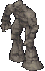

=== "Info"

    

    <table>
    <tr>
        <th>Spawn Locations</th>
        <td id="Dull-Copper-Elemental_Spawn-Locations" colspan="3"></td>
    </tr>
    <tr>
        <th>Base Damage</th>
        <td id="Dull-Copper-Elemental_Base-Damage"></td>
        <th>Armor Rating</th>
        <td id="Dull-Copper-Elemental_Armor-Rating"></td>
    </tr>
    <tr>
        <th>Fame</th>
        <td id="Dull-Copper-Elemental_Fame"></td>
        <th>Karma</th>
        <td id="Dull-Copper-Elemental_Karma"></td>
    </tr>
    <tr>
        <th>Super Slayer</th>
        <td id="Dull-Copper-Elemental_Super-Slayer"></td>
        <th>Minor Slayer</th>
        <td id="Dull-Copper-Elemental_Minor-Slayer"></td>
    </tr>
    <tr>
        <th>Barding Difficulty</th>
        <td id="Dull-Copper-Elemental_Barding-Difficulty"></td>
        <th>Taming Difficulty</th>
        <td id="Dull-Copper-Elemental_Taming-Difficulty"></td>
    </tr>
    </table>
    

=== "Attributes"

    

    <table>
    <tr>
        <th>Hit Points</th>
        <td id="Dull-Copper-Elemental_Hit-Points"></td>
        <th>Strength</th>
        <td id="Dull-Copper-Elemental_Strength"></td>
    </tr>
    <tr>
        <th>Stamina</th>
        <td id="Dull-Copper-Elemental_Stamina"></td>
        <th>Dexterity</th>
        <td id="Dull-Copper-Elemental_Dexterity"></td>
    </tr>
    <tr>
        <th>Mana</th>
        <td id="Dull-Copper-Elemental_Mana"></td>
        <th>Intelligence</th>
        <td id="Dull-Copper-Elemental_Intelligence"></td>
    </tr>
    </table>
    

=== "Skills"

    

    <table>
    <tr>
        <th>Wrestling</th>
        <td id="Dull-Copper-Elemental_Wrestling"></td>
        <th>Magery</th>
        <td id="Dull-Copper-Elemental_Magery"></td>
    </tr>
    <tr>
        <th>Tactics</th>
        <td id="Dull-Copper-Elemental_Tactics"></td>
        <th>Meditation</th>
        <td id="Dull-Copper-Elemental_Meditation"></td>
    </tr>
    <tr>
        <th>Resisting Spells</th>
        <td id="Dull-Copper-Elemental_Resisting-Spells"></td>
        <th>Evaluating Intelligence</th>
        <td id="Dull-Copper-Elemental_Evaluating-Intelligence"></td>
    </tr>
    <tr>
        <th>Anatomy</th>
        <td id="Dull-Copper-Elemental_Anatomy"></td>
        <th>Poisoning</th>
        <td id="Dull-Copper-Elemental_Poisoning"></td>
    </tr>
    </table>
    

=== "Loot"

    

    <table>
    <tr>
        <th>Gold</th>
        <td id="Dull-Copper-Elemental_Gold"></td>
    </tr>
    <tr>
        <th>Treasure Map lvl</th>
        <td id="Dull-Copper-Elemental_Treasure-Map-lvl"></td>
    </tr>
        <tr>
        <th>Slayer Drop</th>
        <td id="Dull-Copper-Elemental_Slayer-Drop"></td>
    </tr>
    </table>
    

### Eagle

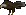

=== "Info"

    

    <table>
    <tr>
        <th>Spawn Locations</th>
        <td id="Eagle_Spawn-Locations" colspan="3"></td>
    </tr>
    <tr>
        <th>Base Damage</th>
        <td id="Eagle_Base-Damage"></td>
        <th>Armor Rating</th>
        <td id="Eagle_Armor-Rating"></td>
    </tr>
    <tr>
        <th>Fame</th>
        <td id="Eagle_Fame"></td>
        <th>Karma</th>
        <td id="Eagle_Karma"></td>
    </tr>
    <tr>
        <th>Super Slayer</th>
        <td id="Eagle_Super-Slayer"></td>
        <th>Minor Slayer</th>
        <td id="Eagle_Minor-Slayer"></td>
    </tr>
    <tr>
        <th>Barding Difficulty</th>
        <td id="Eagle_Barding-Difficulty"></td>
        <th>Taming Difficulty</th>
        <td id="Eagle_Taming-Difficulty"></td>
    </tr>
    </table>
    

=== "Attributes"

    

    <table>
    <tr>
        <th>Hit Points</th>
        <td id="Eagle_Hit-Points"></td>
        <th>Strength</th>
        <td id="Eagle_Strength"></td>
    </tr>
    <tr>
        <th>Stamina</th>
        <td id="Eagle_Stamina"></td>
        <th>Dexterity</th>
        <td id="Eagle_Dexterity"></td>
    </tr>
    <tr>
        <th>Mana</th>
        <td id="Eagle_Mana"></td>
        <th>Intelligence</th>
        <td id="Eagle_Intelligence"></td>
    </tr>
    </table>
    

=== "Skills"

    

    <table>
    <tr>
        <th>Wrestling</th>
        <td id="Eagle_Wrestling"></td>
        <th>Magery</th>
        <td id="Eagle_Magery"></td>
    </tr>
    <tr>
        <th>Tactics</th>
        <td id="Eagle_Tactics"></td>
        <th>Meditation</th>
        <td id="Eagle_Meditation"></td>
    </tr>
    <tr>
        <th>Resisting Spells</th>
        <td id="Eagle_Resisting-Spells"></td>
        <th>Evaluating Intelligence</th>
        <td id="Eagle_Evaluating-Intelligence"></td>
    </tr>
    <tr>
        <th>Anatomy</th>
        <td id="Eagle_Anatomy"></td>
        <th>Poisoning</th>
        <td id="Eagle_Poisoning"></td>
    </tr>
    </table>
    

=== "Loot"

    

    <table>
    <tr>
        <th>Gold</th>
        <td id="Eagle_Gold"></td>
    </tr>
    <tr>
        <th>Treasure Map lvl</th>
        <td id="Eagle_Treasure-Map-lvl"></td>
    </tr>
        <tr>
        <th>Slayer Drop</th>
        <td id="Eagle_Slayer-Drop"></td>
    </tr>
    </table>
    

### Earth Elemental

=== "Info"

    

    <table>
    <tr>
        <th>Spawn Locations</th>
        <td id="Earth-Elemental_Spawn-Locations" colspan="3"></td>
    </tr>
    <tr>
        <th>Base Damage</th>
        <td id="Earth-Elemental_Base-Damage"></td>
        <th>Armor Rating</th>
        <td id="Earth-Elemental_Armor-Rating"></td>
    </tr>
    <tr>
        <th>Fame</th>
        <td id="Earth-Elemental_Fame"></td>
        <th>Karma</th>
        <td id="Earth-Elemental_Karma"></td>
    </tr>
    <tr>
        <th>Super Slayer</th>
        <td id="Earth-Elemental_Super-Slayer"></td>
        <th>Minor Slayer</th>
        <td id="Earth-Elemental_Minor-Slayer"></td>
    </tr>
    <tr>
        <th>Barding Difficulty</th>
        <td id="Earth-Elemental_Barding-Difficulty"></td>
        <th>Taming Difficulty</th>
        <td id="Earth-Elemental_Taming-Difficulty"></td>
    </tr>
    </table>
    

=== "Attributes"

    

    <table>
    <tr>
        <th>Hit Points</th>
        <td id="Earth-Elemental_Hit-Points"></td>
        <th>Strength</th>
        <td id="Earth-Elemental_Strength"></td>
    </tr>
    <tr>
        <th>Stamina</th>
        <td id="Earth-Elemental_Stamina"></td>
        <th>Dexterity</th>
        <td id="Earth-Elemental_Dexterity"></td>
    </tr>
    <tr>
        <th>Mana</th>
        <td id="Earth-Elemental_Mana"></td>
        <th>Intelligence</th>
        <td id="Earth-Elemental_Intelligence"></td>
    </tr>
    </table>
    

=== "Skills"

    

    <table>
    <tr>
        <th>Wrestling</th>
        <td id="Earth-Elemental_Wrestling"></td>
        <th>Magery</th>
        <td id="Earth-Elemental_Magery"></td>
    </tr>
    <tr>
        <th>Tactics</th>
        <td id="Earth-Elemental_Tactics"></td>
        <th>Meditation</th>
        <td id="Earth-Elemental_Meditation"></td>
    </tr>
    <tr>
        <th>Resisting Spells</th>
        <td id="Earth-Elemental_Resisting-Spells"></td>
        <th>Evaluating Intelligence</th>
        <td id="Earth-Elemental_Evaluating-Intelligence"></td>
    </tr>
    <tr>
        <th>Anatomy</th>
        <td id="Earth-Elemental_Anatomy"></td>
        <th>Poisoning</th>
        <td id="Earth-Elemental_Poisoning"></td>
    </tr>
    </table>
    

=== "Loot"

    

    <table>
    <tr>
        <th>Gold</th>
        <td id="Earth-Elemental_Gold"></td>
    </tr>
    <tr>
        <th>Treasure Map lvl</th>
        <td id="Earth-Elemental_Treasure-Map-lvl"></td>
    </tr>
        <tr>
        <th>Slayer Drop</th>
        <td id="Earth-Elemental_Slayer-Drop"></td>
    </tr>
    </table>
    

### Efreet

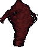

=== "Info"

    

    <table>
    <tr>
        <th>Spawn Locations</th>
        <td id="Efreet_Spawn-Locations" colspan="3"></td>
    </tr>
    <tr>
        <th>Base Damage</th>
        <td id="Efreet_Base-Damage"></td>
        <th>Armor Rating</th>
        <td id="Efreet_Armor-Rating"></td>
    </tr>
    <tr>
        <th>Fame</th>
        <td id="Efreet_Fame"></td>
        <th>Karma</th>
        <td id="Efreet_Karma"></td>
    </tr>
    <tr>
        <th>Super Slayer</th>
        <td id="Efreet_Super-Slayer"></td>
        <th>Minor Slayer</th>
        <td id="Efreet_Minor-Slayer"></td>
    </tr>
    <tr>
        <th>Barding Difficulty</th>
        <td id="Efreet_Barding-Difficulty"></td>
        <th>Taming Difficulty</th>
        <td id="Efreet_Taming-Difficulty"></td>
    </tr>
    </table>
    

=== "Attributes"

    

    <table>
    <tr>
        <th>Hit Points</th>
        <td id="Efreet_Hit-Points"></td>
        <th>Strength</th>
        <td id="Efreet_Strength"></td>
    </tr>
    <tr>
        <th>Stamina</th>
        <td id="Efreet_Stamina"></td>
        <th>Dexterity</th>
        <td id="Efreet_Dexterity"></td>
    </tr>
    <tr>
        <th>Mana</th>
        <td id="Efreet_Mana"></td>
        <th>Intelligence</th>
        <td id="Efreet_Intelligence"></td>
    </tr>
    </table>
    

=== "Skills"

    

    <table>
    <tr>
        <th>Wrestling</th>
        <td id="Efreet_Wrestling"></td>
        <th>Magery</th>
        <td id="Efreet_Magery"></td>
    </tr>
    <tr>
        <th>Tactics</th>
        <td id="Efreet_Tactics"></td>
        <th>Meditation</th>
        <td id="Efreet_Meditation"></td>
    </tr>
    <tr>
        <th>Resisting Spells</th>
        <td id="Efreet_Resisting-Spells"></td>
        <th>Evaluating Intelligence</th>
        <td id="Efreet_Evaluating-Intelligence"></td>
    </tr>
    <tr>
        <th>Anatomy</th>
        <td id="Efreet_Anatomy"></td>
        <th>Poisoning</th>
        <td id="Efreet_Poisoning"></td>
    </tr>
    </table>
    

=== "Loot"

    

    <table>
    <tr>
        <th>Gold</th>
        <td id="Efreet_Gold"></td>
    </tr>
    <tr>
        <th>Treasure Map lvl</th>
        <td id="Efreet_Treasure-Map-lvl"></td>
    </tr>
        <tr>
        <th>Slayer Drop</th>
        <td id="Efreet_Slayer-Drop"></td>
    </tr>
    </table>
    

### Elder Gazer

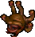

=== "Info"

    

    <table>
    <tr>
        <th>Spawn Locations</th>
        <td id="Elder-Gazer_Spawn-Locations" colspan="3"></td>
    </tr>
    <tr>
        <th>Base Damage</th>
        <td id="Elder-Gazer_Base-Damage"></td>
        <th>Armor Rating</th>
        <td id="Elder-Gazer_Armor-Rating"></td>
    </tr>
    <tr>
        <th>Fame</th>
        <td id="Elder-Gazer_Fame"></td>
        <th>Karma</th>
        <td id="Elder-Gazer_Karma"></td>
    </tr>
    <tr>
        <th>Super Slayer</th>
        <td id="Elder-Gazer_Super-Slayer"></td>
        <th>Minor Slayer</th>
        <td id="Elder-Gazer_Minor-Slayer"></td>
    </tr>
    <tr>
        <th>Barding Difficulty</th>
        <td id="Elder-Gazer_Barding-Difficulty"></td>
        <th>Taming Difficulty</th>
        <td id="Elder-Gazer_Taming-Difficulty"></td>
    </tr>
    </table>
    

=== "Attributes"

    

    <table>
    <tr>
        <th>Hit Points</th>
        <td id="Elder-Gazer_Hit-Points"></td>
        <th>Strength</th>
        <td id="Elder-Gazer_Strength"></td>
    </tr>
    <tr>
        <th>Stamina</th>
        <td id="Elder-Gazer_Stamina"></td>
        <th>Dexterity</th>
        <td id="Elder-Gazer_Dexterity"></td>
    </tr>
    <tr>
        <th>Mana</th>
        <td id="Elder-Gazer_Mana"></td>
        <th>Intelligence</th>
        <td id="Elder-Gazer_Intelligence"></td>
    </tr>
    </table>
    

=== "Skills"

    

    <table>
    <tr>
        <th>Wrestling</th>
        <td id="Elder-Gazer_Wrestling"></td>
        <th>Magery</th>
        <td id="Elder-Gazer_Magery"></td>
    </tr>
    <tr>
        <th>Tactics</th>
        <td id="Elder-Gazer_Tactics"></td>
        <th>Meditation</th>
        <td id="Elder-Gazer_Meditation"></td>
    </tr>
    <tr>
        <th>Resisting Spells</th>
        <td id="Elder-Gazer_Resisting-Spells"></td>
        <th>Evaluating Intelligence</th>
        <td id="Elder-Gazer_Evaluating-Intelligence"></td>
    </tr>
    <tr>
        <th>Anatomy</th>
        <td id="Elder-Gazer_Anatomy"></td>
        <th>Poisoning</th>
        <td id="Elder-Gazer_Poisoning"></td>
    </tr>
    </table>
    

=== "Loot"

    

    <table>
    <tr>
        <th>Gold</th>
        <td id="Elder-Gazer_Gold"></td>
    </tr>
    <tr>
        <th>Treasure Map lvl</th>
        <td id="Elder-Gazer_Treasure-Map-lvl"></td>
    </tr>
        <tr>
        <th>Slayer Drop</th>
        <td id="Elder-Gazer_Slayer-Drop"></td>
    </tr>
    </table>
    

### Enraged Kraken

!!! warning
    Under construction.

=== "Info"

    

    <table>
    <tr>
        <th>Spawn Locations</th>
        <td id="Enraged-Kraken_Spawn-Locations" colspan="3"></td>
    </tr>
    <tr>
        <th>Base Damage</th>
        <td id="Enraged-Kraken_Base-Damage"></td>
        <th>Armor Rating</th>
        <td id="Enraged-Kraken_Armor-Rating"></td>
    </tr>
    <tr>
        <th>Fame</th>
        <td id="Enraged-Kraken_Fame"></td>
        <th>Karma</th>
        <td id="Enraged-Kraken_Karma"></td>
    </tr>
    <tr>
        <th>Super Slayer</th>
        <td id="Enraged-Kraken_Super-Slayer"></td>
        <th>Minor Slayer</th>
        <td id="Enraged-Kraken_Minor-Slayer"></td>
    </tr>
    <tr>
        <th>Barding Difficulty</th>
        <td id="Enraged-Kraken_Barding-Difficulty"></td>
        <th>Taming Difficulty</th>
        <td id="Enraged-Kraken_Taming-Difficulty"></td>
    </tr>
    </table>
    

=== "Attributes"

    

    <table>
    <tr>
        <th>Hit Points</th>
        <td id="Enraged-Kraken_Hit-Points"></td>
        <th>Strength</th>
        <td id="Enraged-Kraken_Strength"></td>
    </tr>
    <tr>
        <th>Stamina</th>
        <td id="Enraged-Kraken_Stamina"></td>
        <th>Dexterity</th>
        <td id="Enraged-Kraken_Dexterity"></td>
    </tr>
    <tr>
        <th>Mana</th>
        <td id="Enraged-Kraken_Mana"></td>
        <th>Intelligence</th>
        <td id="Enraged-Kraken_Intelligence"></td>
    </tr>
    </table>
    

=== "Skills"

    

    <table>
    <tr>
        <th>Wrestling</th>
        <td id="Enraged-Kraken_Wrestling"></td>
        <th>Magery</th>
        <td id="Enraged-Kraken_Magery"></td>
    </tr>
    <tr>
        <th>Tactics</th>
        <td id="Enraged-Kraken_Tactics"></td>
        <th>Meditation</th>
        <td id="Enraged-Kraken_Meditation"></td>
    </tr>
    <tr>
        <th>Resisting Spells</th>
        <td id="Enraged-Kraken_Resisting-Spells"></td>
        <th>Evaluating Intelligence</th>
        <td id="Enraged-Kraken_Evaluating-Intelligence"></td>
    </tr>
    <tr>
        <th>Anatomy</th>
        <td id="Enraged-Kraken_Anatomy"></td>
        <th>Poisoning</th>
        <td id="Enraged-Kraken_Poisoning"></td>
    </tr>
    </table>
    

=== "Loot"

    

    <table>
    <tr>
        <th>Gold</th>
        <td id="Enraged-Kraken_Gold"></td>
    </tr>
    <tr>
        <th>Treasure Map lvl</th>
        <td id="Enraged-Kraken_Treasure-Map-lvl"></td>
    </tr>
        <tr>
        <th>Slayer Drop</th>
        <td id="Enraged-Kraken_Slayer-Drop"></td>
    </tr>
    </table>
    

### Enslaved Gargoyle

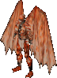

=== "Info"

    

    <table>
    <tr>
        <th>Spawn Locations</th>
        <td id="Enslaved-Gargoyle_Spawn-Locations" colspan="3"></td>
    </tr>
    <tr>
        <th>Base Damage</th>
        <td id="Enslaved-Gargoyle_Base-Damage"></td>
        <th>Armor Rating</th>
        <td id="Enslaved-Gargoyle_Armor-Rating"></td>
    </tr>
    <tr>
        <th>Fame</th>
        <td id="Enslaved-Gargoyle_Fame"></td>
        <th>Karma</th>
        <td id="Enslaved-Gargoyle_Karma"></td>
    </tr>
    <tr>
        <th>Super Slayer</th>
        <td id="Enslaved-Gargoyle_Super-Slayer"></td>
        <th>Minor Slayer</th>
        <td id="Enslaved-Gargoyle_Minor-Slayer"></td>
    </tr>
    <tr>
        <th>Barding Difficulty</th>
        <td id="Enslaved-Gargoyle_Barding-Difficulty"></td>
        <th>Taming Difficulty</th>
        <td id="Enslaved-Gargoyle_Taming-Difficulty"></td>
    </tr>
    </table>
    

=== "Attributes"

    

    <table>
    <tr>
        <th>Hit Points</th>
        <td id="Enslaved-Gargoyle_Hit-Points"></td>
        <th>Strength</th>
        <td id="Enslaved-Gargoyle_Strength"></td>
    </tr>
    <tr>
        <th>Stamina</th>
        <td id="Enslaved-Gargoyle_Stamina"></td>
        <th>Dexterity</th>
        <td id="Enslaved-Gargoyle_Dexterity"></td>
    </tr>
    <tr>
        <th>Mana</th>
        <td id="Enslaved-Gargoyle_Mana"></td>
        <th>Intelligence</th>
        <td id="Enslaved-Gargoyle_Intelligence"></td>
    </tr>
    </table>
    

=== "Skills"

    

    <table>
    <tr>
        <th>Wrestling</th>
        <td id="Enslaved-Gargoyle_Wrestling"></td>
        <th>Magery</th>
        <td id="Enslaved-Gargoyle_Magery"></td>
    </tr>
    <tr>
        <th>Tactics</th>
        <td id="Enslaved-Gargoyle_Tactics"></td>
        <th>Meditation</th>
        <td id="Enslaved-Gargoyle_Meditation"></td>
    </tr>
    <tr>
        <th>Resisting Spells</th>
        <td id="Enslaved-Gargoyle_Resisting-Spells"></td>
        <th>Evaluating Intelligence</th>
        <td id="Enslaved-Gargoyle_Evaluating-Intelligence"></td>
    </tr>
    <tr>
        <th>Anatomy</th>
        <td id="Enslaved-Gargoyle_Anatomy"></td>
        <th>Poisoning</th>
        <td id="Enslaved-Gargoyle_Poisoning"></td>
    </tr>
    </table>
    

=== "Loot"

    

    <table>
    <tr>
        <th>Gold</th>
        <td id="Enslaved-Gargoyle_Gold"></td>
    </tr>
    <tr>
        <th>Treasure Map lvl</th>
        <td id="Enslaved-Gargoyle_Treasure-Map-lvl"></td>
    </tr>
        <tr>
        <th>Slayer Drop</th>
        <td id="Enslaved-Gargoyle_Slayer-Drop"></td>
    </tr>
    </table>
    

### Ethereal Warrior

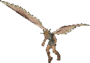

=== "Info"

    

    <table>
    <tr>
        <th>Spawn Locations</th>
        <td id="Ethereal-Warrior_Spawn-Locations" colspan="3"></td>
    </tr>
    <tr>
        <th>Base Damage</th>
        <td id="Ethereal-Warrior_Base-Damage"></td>
        <th>Armor Rating</th>
        <td id="Ethereal-Warrior_Armor-Rating"></td>
    </tr>
    <tr>
        <th>Fame</th>
        <td id="Ethereal-Warrior_Fame"></td>
        <th>Karma</th>
        <td id="Ethereal-Warrior_Karma"></td>
    </tr>
    <tr>
        <th>Super Slayer</th>
        <td id="Ethereal-Warrior_Super-Slayer"></td>
        <th>Minor Slayer</th>
        <td id="Ethereal-Warrior_Minor-Slayer"></td>
    </tr>
    <tr>
        <th>Barding Difficulty</th>
        <td id="Ethereal-Warrior_Barding-Difficulty"></td>
        <th>Taming Difficulty</th>
        <td id="Ethereal-Warrior_Taming-Difficulty"></td>
    </tr>
    </table>
    

=== "Attributes"

    

    <table>
    <tr>
        <th>Hit Points</th>
        <td id="Ethereal-Warrior_Hit-Points"></td>
        <th>Strength</th>
        <td id="Ethereal-Warrior_Strength"></td>
    </tr>
    <tr>
        <th>Stamina</th>
        <td id="Ethereal-Warrior_Stamina"></td>
        <th>Dexterity</th>
        <td id="Ethereal-Warrior_Dexterity"></td>
    </tr>
    <tr>
        <th>Mana</th>
        <td id="Ethereal-Warrior_Mana"></td>
        <th>Intelligence</th>
        <td id="Ethereal-Warrior_Intelligence"></td>
    </tr>
    </table>
    

=== "Skills"

    

    <table>
    <tr>
        <th>Wrestling</th>
        <td id="Ethereal-Warrior_Wrestling"></td>
        <th>Magery</th>
        <td id="Ethereal-Warrior_Magery"></td>
    </tr>
    <tr>
        <th>Tactics</th>
        <td id="Ethereal-Warrior_Tactics"></td>
        <th>Meditation</th>
        <td id="Ethereal-Warrior_Meditation"></td>
    </tr>
    <tr>
        <th>Resisting Spells</th>
        <td id="Ethereal-Warrior_Resisting-Spells"></td>
        <th>Evaluating Intelligence</th>
        <td id="Ethereal-Warrior_Evaluating-Intelligence"></td>
    </tr>
    <tr>
        <th>Anatomy</th>
        <td id="Ethereal-Warrior_Anatomy"></td>
        <th>Poisoning</th>
        <td id="Ethereal-Warrior_Poisoning"></td>
    </tr>
    </table>
    

=== "Loot"

    

    <table>
    <tr>
        <th>Gold</th>
        <td id="Ethereal-Warrior_Gold"></td>
    </tr>
    <tr>
        <th>Treasure Map lvl</th>
        <td id="Ethereal-Warrior_Treasure-Map-lvl"></td>
    </tr>
        <tr>
        <th>Slayer Drop</th>
        <td id="Ethereal-Warrior_Slayer-Drop"></td>
    </tr>
    </table>
    

### Ettin

=== "Info"

    

    <table>
    <tr>
        <th>Spawn Locations</th>
        <td id="Ettin_Spawn-Locations" colspan="3"></td>
    </tr>
    <tr>
        <th>Base Damage</th>
        <td id="Ettin_Base-Damage"></td>
        <th>Armor Rating</th>
        <td id="Ettin_Armor-Rating"></td>
    </tr>
    <tr>
        <th>Fame</th>
        <td id="Ettin_Fame"></td>
        <th>Karma</th>
        <td id="Ettin_Karma"></td>
    </tr>
    <tr>
        <th>Super Slayer</th>
        <td id="Ettin_Super-Slayer"></td>
        <th>Minor Slayer</th>
        <td id="Ettin_Minor-Slayer"></td>
    </tr>
    <tr>
        <th>Barding Difficulty</th>
        <td id="Ettin_Barding-Difficulty"></td>
        <th>Taming Difficulty</th>
        <td id="Ettin_Taming-Difficulty"></td>
    </tr>
    </table>
    

=== "Attributes"

    

    <table>
    <tr>
        <th>Hit Points</th>
        <td id="Ettin_Hit-Points"></td>
        <th>Strength</th>
        <td id="Ettin_Strength"></td>
    </tr>
    <tr>
        <th>Stamina</th>
        <td id="Ettin_Stamina"></td>
        <th>Dexterity</th>
        <td id="Ettin_Dexterity"></td>
    </tr>
    <tr>
        <th>Mana</th>
        <td id="Ettin_Mana"></td>
        <th>Intelligence</th>
        <td id="Ettin_Intelligence"></td>
    </tr>
    </table>
    

=== "Skills"

    

    <table>
    <tr>
        <th>Wrestling</th>
        <td id="Ettin_Wrestling"></td>
        <th>Magery</th>
        <td id="Ettin_Magery"></td>
    </tr>
    <tr>
        <th>Tactics</th>
        <td id="Ettin_Tactics"></td>
        <th>Meditation</th>
        <td id="Ettin_Meditation"></td>
    </tr>
    <tr>
        <th>Resisting Spells</th>
        <td id="Ettin_Resisting-Spells"></td>
        <th>Evaluating Intelligence</th>
        <td id="Ettin_Evaluating-Intelligence"></td>
    </tr>
    <tr>
        <th>Anatomy</th>
        <td id="Ettin_Anatomy"></td>
        <th>Poisoning</th>
        <td id="Ettin_Poisoning"></td>
    </tr>
    </table>
    

=== "Loot"

    

    <table>
    <tr>
        <th>Gold</th>
        <td id="Ettin_Gold"></td>
    </tr>
    <tr>
        <th>Treasure Map lvl</th>
        <td id="Ettin_Treasure-Map-lvl"></td>
    </tr>
        <tr>
        <th>Slayer Drop</th>
        <td id="Ettin_Slayer-Drop"></td>
    </tr>
    </table>
    

### Evil Mage

=== "Info"

    

    <table>
    <tr>
        <th>Spawn Locations</th>
        <td id="Evil-Mage_Spawn-Locations" colspan="3"></td>
    </tr>
    <tr>
        <th>Base Damage</th>
        <td id="Evil-Mage_Base-Damage"></td>
        <th>Armor Rating</th>
        <td id="Evil-Mage_Armor-Rating"></td>
    </tr>
    <tr>
        <th>Fame</th>
        <td id="Evil-Mage_Fame"></td>
        <th>Karma</th>
        <td id="Evil-Mage_Karma"></td>
    </tr>
    <tr>
        <th>Super Slayer</th>
        <td id="Evil-Mage_Super-Slayer"></td>
        <th>Minor Slayer</th>
        <td id="Evil-Mage_Minor-Slayer"></td>
    </tr>
    <tr>
        <th>Barding Difficulty</th>
        <td id="Evil-Mage_Barding-Difficulty"></td>
        <th>Taming Difficulty</th>
        <td id="Evil-Mage_Taming-Difficulty"></td>
    </tr>
    </table>
    

=== "Attributes"

    

    <table>
    <tr>
        <th>Hit Points</th>
        <td id="Evil-Mage_Hit-Points"></td>
        <th>Strength</th>
        <td id="Evil-Mage_Strength"></td>
    </tr>
    <tr>
        <th>Stamina</th>
        <td id="Evil-Mage_Stamina"></td>
        <th>Dexterity</th>
        <td id="Evil-Mage_Dexterity"></td>
    </tr>
    <tr>
        <th>Mana</th>
        <td id="Evil-Mage_Mana"></td>
        <th>Intelligence</th>
        <td id="Evil-Mage_Intelligence"></td>
    </tr>
    </table>
    

=== "Skills"

    

    <table>
    <tr>
        <th>Wrestling</th>
        <td id="Evil-Mage_Wrestling"></td>
        <th>Magery</th>
        <td id="Evil-Mage_Magery"></td>
    </tr>
    <tr>
        <th>Tactics</th>
        <td id="Evil-Mage_Tactics"></td>
        <th>Meditation</th>
        <td id="Evil-Mage_Meditation"></td>
    </tr>
    <tr>
        <th>Resisting Spells</th>
        <td id="Evil-Mage_Resisting-Spells"></td>
        <th>Evaluating Intelligence</th>
        <td id="Evil-Mage_Evaluating-Intelligence"></td>
    </tr>
    <tr>
        <th>Anatomy</th>
        <td id="Evil-Mage_Anatomy"></td>
        <th>Poisoning</th>
        <td id="Evil-Mage_Poisoning"></td>
    </tr>
    </table>
    

=== "Loot"

    

    <table>
    <tr>
        <th>Gold</th>
        <td id="Evil-Mage_Gold"></td>
    </tr>
    <tr>
        <th>Treasure Map lvl</th>
        <td id="Evil-Mage_Treasure-Map-lvl"></td>
    </tr>
        <tr>
        <th>Slayer Drop</th>
        <td id="Evil-Mage_Slayer-Drop"></td>
    </tr>
    </table>
    

### Evil Mage Lord

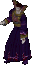

=== "Info"

    

    <table>
    <tr>
        <th>Spawn Locations</th>
        <td id="Evil-Mage-Lord_Spawn-Locations" colspan="3"></td>
    </tr>
    <tr>
        <th>Base Damage</th>
        <td id="Evil-Mage-Lord_Base-Damage"></td>
        <th>Armor Rating</th>
        <td id="Evil-Mage-Lord_Armor-Rating"></td>
    </tr>
    <tr>
        <th>Fame</th>
        <td id="Evil-Mage-Lord_Fame"></td>
        <th>Karma</th>
        <td id="Evil-Mage-Lord_Karma"></td>
    </tr>
    <tr>
        <th>Super Slayer</th>
        <td id="Evil-Mage-Lord_Super-Slayer"></td>
        <th>Minor Slayer</th>
        <td id="Evil-Mage-Lord_Minor-Slayer"></td>
    </tr>
    <tr>
        <th>Barding Difficulty</th>
        <td id="Evil-Mage-Lord_Barding-Difficulty"></td>
        <th>Taming Difficulty</th>
        <td id="Evil-Mage-Lord_Taming-Difficulty"></td>
    </tr>
    </table>
    

=== "Attributes"

    

    <table>
    <tr>
        <th>Hit Points</th>
        <td id="Evil-Mage-Lord_Hit-Points"></td>
        <th>Strength</th>
        <td id="Evil-Mage-Lord_Strength"></td>
    </tr>
    <tr>
        <th>Stamina</th>
        <td id="Evil-Mage-Lord_Stamina"></td>
        <th>Dexterity</th>
        <td id="Evil-Mage-Lord_Dexterity"></td>
    </tr>
    <tr>
        <th>Mana</th>
        <td id="Evil-Mage-Lord_Mana"></td>
        <th>Intelligence</th>
        <td id="Evil-Mage-Lord_Intelligence"></td>
    </tr>
    </table>
    

=== "Skills"

    

    <table>
    <tr>
        <th>Wrestling</th>
        <td id="Evil-Mage-Lord_Wrestling"></td>
        <th>Magery</th>
        <td id="Evil-Mage-Lord_Magery"></td>
    </tr>
    <tr>
        <th>Tactics</th>
        <td id="Evil-Mage-Lord_Tactics"></td>
        <th>Meditation</th>
        <td id="Evil-Mage-Lord_Meditation"></td>
    </tr>
    <tr>
        <th>Resisting Spells</th>
        <td id="Evil-Mage-Lord_Resisting-Spells"></td>
        <th>Evaluating Intelligence</th>
        <td id="Evil-Mage-Lord_Evaluating-Intelligence"></td>
    </tr>
    <tr>
        <th>Anatomy</th>
        <td id="Evil-Mage-Lord_Anatomy"></td>
        <th>Poisoning</th>
        <td id="Evil-Mage-Lord_Poisoning"></td>
    </tr>
    </table>
    

=== "Loot"

    

    <table>
    <tr>
        <th>Gold</th>
        <td id="Evil-Mage-Lord_Gold"></td>
    </tr>
    <tr>
        <th>Treasure Map lvl</th>
        <td id="Evil-Mage-Lord_Treasure-Map-lvl"></td>
    </tr>
        <tr>
        <th>Slayer Drop</th>
        <td id="Evil-Mage-Lord_Slayer-Drop"></td>
    </tr>
    </table>
    

### Executioner

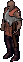

=== "Info"

    

    <table>
    <tr>
        <th>Spawn Locations</th>
        <td id="Executioner_Spawn-Locations" colspan="3"></td>
    </tr>
    <tr>
        <th>Base Damage</th>
        <td id="Executioner_Base-Damage"></td>
        <th>Armor Rating</th>
        <td id="Executioner_Armor-Rating"></td>
    </tr>
    <tr>
        <th>Fame</th>
        <td id="Executioner_Fame"></td>
        <th>Karma</th>
        <td id="Executioner_Karma"></td>
    </tr>
    <tr>
        <th>Super Slayer</th>
        <td id="Executioner_Super-Slayer"></td>
        <th>Minor Slayer</th>
        <td id="Executioner_Minor-Slayer"></td>
    </tr>
    <tr>
        <th>Barding Difficulty</th>
        <td id="Executioner_Barding-Difficulty"></td>
        <th>Taming Difficulty</th>
        <td id="Executioner_Taming-Difficulty"></td>
    </tr>
    </table>
    

=== "Attributes"

    

    <table>
    <tr>
        <th>Hit Points</th>
        <td id="Executioner_Hit-Points"></td>
        <th>Strength</th>
        <td id="Executioner_Strength"></td>
    </tr>
    <tr>
        <th>Stamina</th>
        <td id="Executioner_Stamina"></td>
        <th>Dexterity</th>
        <td id="Executioner_Dexterity"></td>
    </tr>
    <tr>
        <th>Mana</th>
        <td id="Executioner_Mana"></td>
        <th>Intelligence</th>
        <td id="Executioner_Intelligence"></td>
    </tr>
    </table>
    

=== "Skills"

    

    <table>
    <tr>
        <th>Wrestling</th>
        <td id="Executioner_Wrestling"></td>
        <th>Magery</th>
        <td id="Executioner_Magery"></td>
    </tr>
    <tr>
        <th>Tactics</th>
        <td id="Executioner_Tactics"></td>
        <th>Meditation</th>
        <td id="Executioner_Meditation"></td>
    </tr>
    <tr>
        <th>Resisting Spells</th>
        <td id="Executioner_Resisting-Spells"></td>
        <th>Evaluating Intelligence</th>
        <td id="Executioner_Evaluating-Intelligence"></td>
    </tr>
    <tr>
        <th>Anatomy</th>
        <td id="Executioner_Anatomy"></td>
        <th>Poisoning</th>
        <td id="Executioner_Poisoning"></td>
    </tr>
    </table>
    

=== "Loot"

    

    <table>
    <tr>
        <th>Gold</th>
        <td id="Executioner_Gold"></td>
    </tr>
    <tr>
        <th>Treasure Map lvl</th>
        <td id="Executioner_Treasure-Map-lvl"></td>
    </tr>
        <tr>
        <th>Slayer Drop</th>
        <td id="Executioner_Slayer-Drop"></td>
    </tr>
    </table>
    

### Fire Daemon

!!! warning
    Under construction.

=== "Info"

    

    <table>
    <tr>
        <th>Spawn Locations</th>
        <td id="Fire-Daemon_Spawn-Locations" colspan="3"></td>
    </tr>
    <tr>
        <th>Base Damage</th>
        <td id="Fire-Daemon_Base-Damage"></td>
        <th>Armor Rating</th>
        <td id="Fire-Daemon_Armor-Rating"></td>
    </tr>
    <tr>
        <th>Fame</th>
        <td id="Fire-Daemon_Fame"></td>
        <th>Karma</th>
        <td id="Fire-Daemon_Karma"></td>
    </tr>
    <tr>
        <th>Super Slayer</th>
        <td id="Fire-Daemon_Super-Slayer"></td>
        <th>Minor Slayer</th>
        <td id="Fire-Daemon_Minor-Slayer"></td>
    </tr>
    <tr>
        <th>Barding Difficulty</th>
        <td id="Fire-Daemon_Barding-Difficulty"></td>
        <th>Taming Difficulty</th>
        <td id="Fire-Daemon_Taming-Difficulty"></td>
    </tr>
    </table>
    

=== "Attributes"

    

    <table>
    <tr>
        <th>Hit Points</th>
        <td id="Fire-Daemon_Hit-Points"></td>
        <th>Strength</th>
        <td id="Fire-Daemon_Strength"></td>
    </tr>
    <tr>
        <th>Stamina</th>
        <td id="Fire-Daemon_Stamina"></td>
        <th>Dexterity</th>
        <td id="Fire-Daemon_Dexterity"></td>
    </tr>
    <tr>
        <th>Mana</th>
        <td id="Fire-Daemon_Mana"></td>
        <th>Intelligence</th>
        <td id="Fire-Daemon_Intelligence"></td>
    </tr>
    </table>
    

=== "Skills"

    

    <table>
    <tr>
        <th>Wrestling</th>
        <td id="Fire-Daemon_Wrestling"></td>
        <th>Magery</th>
        <td id="Fire-Daemon_Magery"></td>
    </tr>
    <tr>
        <th>Tactics</th>
        <td id="Fire-Daemon_Tactics"></td>
        <th>Meditation</th>
        <td id="Fire-Daemon_Meditation"></td>
    </tr>
    <tr>
        <th>Resisting Spells</th>
        <td id="Fire-Daemon_Resisting-Spells"></td>
        <th>Evaluating Intelligence</th>
        <td id="Fire-Daemon_Evaluating-Intelligence"></td>
    </tr>
    <tr>
        <th>Anatomy</th>
        <td id="Fire-Daemon_Anatomy"></td>
        <th>Poisoning</th>
        <td id="Fire-Daemon_Poisoning"></td>
    </tr>
    </table>
    

=== "Loot"

    

    <table>
    <tr>
        <th>Gold</th>
        <td id="Fire-Daemon_Gold"></td>
    </tr>
    <tr>
        <th>Treasure Map lvl</th>
        <td id="Fire-Daemon_Treasure-Map-lvl"></td>
    </tr>
        <tr>
        <th>Slayer Drop</th>
        <td id="Fire-Daemon_Slayer-Drop"></td>
    </tr>
    </table>
    

### Fire Elemental

=== "Info"

    

    <table>
    <tr>
        <th>Spawn Locations</th>
        <td id="Fire-Elemental_Spawn-Locations" colspan="3"></td>
    </tr>
    <tr>
        <th>Base Damage</th>
        <td id="Fire-Elemental_Base-Damage"></td>
        <th>Armor Rating</th>
        <td id="Fire-Elemental_Armor-Rating"></td>
    </tr>
    <tr>
        <th>Fame</th>
        <td id="Fire-Elemental_Fame"></td>
        <th>Karma</th>
        <td id="Fire-Elemental_Karma"></td>
    </tr>
    <tr>
        <th>Super Slayer</th>
        <td id="Fire-Elemental_Super-Slayer"></td>
        <th>Minor Slayer</th>
        <td id="Fire-Elemental_Minor-Slayer"></td>
    </tr>
    <tr>
        <th>Barding Difficulty</th>
        <td id="Fire-Elemental_Barding-Difficulty"></td>
        <th>Taming Difficulty</th>
        <td id="Fire-Elemental_Taming-Difficulty"></td>
    </tr>
    </table>
    

=== "Attributes"

    

    <table>
    <tr>
        <th>Hit Points</th>
        <td id="Fire-Elemental_Hit-Points"></td>
        <th>Strength</th>
        <td id="Fire-Elemental_Strength"></td>
    </tr>
    <tr>
        <th>Stamina</th>
        <td id="Fire-Elemental_Stamina"></td>
        <th>Dexterity</th>
        <td id="Fire-Elemental_Dexterity"></td>
    </tr>
    <tr>
        <th>Mana</th>
        <td id="Fire-Elemental_Mana"></td>
        <th>Intelligence</th>
        <td id="Fire-Elemental_Intelligence"></td>
    </tr>
    </table>
    

=== "Skills"

    

    <table>
    <tr>
        <th>Wrestling</th>
        <td id="Fire-Elemental_Wrestling"></td>
        <th>Magery</th>
        <td id="Fire-Elemental_Magery"></td>
    </tr>
    <tr>
        <th>Tactics</th>
        <td id="Fire-Elemental_Tactics"></td>
        <th>Meditation</th>
        <td id="Fire-Elemental_Meditation"></td>
    </tr>
    <tr>
        <th>Resisting Spells</th>
        <td id="Fire-Elemental_Resisting-Spells"></td>
        <th>Evaluating Intelligence</th>
        <td id="Fire-Elemental_Evaluating-Intelligence"></td>
    </tr>
    <tr>
        <th>Anatomy</th>
        <td id="Fire-Elemental_Anatomy"></td>
        <th>Poisoning</th>
        <td id="Fire-Elemental_Poisoning"></td>
    </tr>
    </table>
    

=== "Loot"

    

    <table>
    <tr>
        <th>Gold</th>
        <td id="Fire-Elemental_Gold"></td>
    </tr>
    <tr>
        <th>Treasure Map lvl</th>
        <td id="Fire-Elemental_Treasure-Map-lvl"></td>
    </tr>
        <tr>
        <th>Slayer Drop</th>
        <td id="Fire-Elemental_Slayer-Drop"></td>
    </tr>
    </table>
    

### Fire Gargoyle

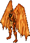

=== "Info"

    

    <table>
    <tr>
        <th>Spawn Locations</th>
        <td id="Fire-Gargoyle_Spawn-Locations" colspan="3"></td>
    </tr>
    <tr>
        <th>Base Damage</th>
        <td id="Fire-Gargoyle_Base-Damage"></td>
        <th>Armor Rating</th>
        <td id="Fire-Gargoyle_Armor-Rating"></td>
    </tr>
    <tr>
        <th>Fame</th>
        <td id="Fire-Gargoyle_Fame"></td>
        <th>Karma</th>
        <td id="Fire-Gargoyle_Karma"></td>
    </tr>
    <tr>
        <th>Super Slayer</th>
        <td id="Fire-Gargoyle_Super-Slayer"></td>
        <th>Minor Slayer</th>
        <td id="Fire-Gargoyle_Minor-Slayer"></td>
    </tr>
    <tr>
        <th>Barding Difficulty</th>
        <td id="Fire-Gargoyle_Barding-Difficulty"></td>
        <th>Taming Difficulty</th>
        <td id="Fire-Gargoyle_Taming-Difficulty"></td>
    </tr>
    </table>
    

=== "Attributes"

    

    <table>
    <tr>
        <th>Hit Points</th>
        <td id="Fire-Gargoyle_Hit-Points"></td>
        <th>Strength</th>
        <td id="Fire-Gargoyle_Strength"></td>
    </tr>
    <tr>
        <th>Stamina</th>
        <td id="Fire-Gargoyle_Stamina"></td>
        <th>Dexterity</th>
        <td id="Fire-Gargoyle_Dexterity"></td>
    </tr>
    <tr>
        <th>Mana</th>
        <td id="Fire-Gargoyle_Mana"></td>
        <th>Intelligence</th>
        <td id="Fire-Gargoyle_Intelligence"></td>
    </tr>
    </table>
    

=== "Skills"

    

    <table>
    <tr>
        <th>Wrestling</th>
        <td id="Fire-Gargoyle_Wrestling"></td>
        <th>Magery</th>
        <td id="Fire-Gargoyle_Magery"></td>
    </tr>
    <tr>
        <th>Tactics</th>
        <td id="Fire-Gargoyle_Tactics"></td>
        <th>Meditation</th>
        <td id="Fire-Gargoyle_Meditation"></td>
    </tr>
    <tr>
        <th>Resisting Spells</th>
        <td id="Fire-Gargoyle_Resisting-Spells"></td>
        <th>Evaluating Intelligence</th>
        <td id="Fire-Gargoyle_Evaluating-Intelligence"></td>
    </tr>
    <tr>
        <th>Anatomy</th>
        <td id="Fire-Gargoyle_Anatomy"></td>
        <th>Poisoning</th>
        <td id="Fire-Gargoyle_Poisoning"></td>
    </tr>
    </table>
    

=== "Loot"

    

    <table>
    <tr>
        <th>Gold</th>
        <td id="Fire-Gargoyle_Gold"></td>
    </tr>
    <tr>
        <th>Treasure Map lvl</th>
        <td id="Fire-Gargoyle_Treasure-Map-lvl"></td>
    </tr>
        <tr>
        <th>Slayer Drop</th>
        <td id="Fire-Gargoyle_Slayer-Drop"></td>
    </tr>
    </table>
    

### Forest Ostard

=== "Info"

    

    <table>
    <tr>
        <th>Spawn Locations</th>
        <td id="Forest-Ostard_Spawn-Locations" colspan="3"></td>
    </tr>
    <tr>
        <th>Base Damage</th>
        <td id="Forest-Ostard_Base-Damage"></td>
        <th>Armor Rating</th>
        <td id="Forest-Ostard_Armor-Rating"></td>
    </tr>
    <tr>
        <th>Fame</th>
        <td id="Forest-Ostard_Fame"></td>
        <th>Karma</th>
        <td id="Forest-Ostard_Karma"></td>
    </tr>
    <tr>
        <th>Super Slayer</th>
        <td id="Forest-Ostard_Super-Slayer"></td>
        <th>Minor Slayer</th>
        <td id="Forest-Ostard_Minor-Slayer"></td>
    </tr>
    <tr>
        <th>Barding Difficulty</th>
        <td id="Forest-Ostard_Barding-Difficulty"></td>
        <th>Taming Difficulty</th>
        <td id="Forest-Ostard_Taming-Difficulty"></td>
    </tr>
    </table>
    

=== "Attributes"

    

    <table>
    <tr>
        <th>Hit Points</th>
        <td id="Forest-Ostard_Hit-Points"></td>
        <th>Strength</th>
        <td id="Forest-Ostard_Strength"></td>
    </tr>
    <tr>
        <th>Stamina</th>
        <td id="Forest-Ostard_Stamina"></td>
        <th>Dexterity</th>
        <td id="Forest-Ostard_Dexterity"></td>
    </tr>
    <tr>
        <th>Mana</th>
        <td id="Forest-Ostard_Mana"></td>
        <th>Intelligence</th>
        <td id="Forest-Ostard_Intelligence"></td>
    </tr>
    </table>
    

=== "Skills"

    

    <table>
    <tr>
        <th>Wrestling</th>
        <td id="Forest-Ostard_Wrestling"></td>
        <th>Magery</th>
        <td id="Forest-Ostard_Magery"></td>
    </tr>
    <tr>
        <th>Tactics</th>
        <td id="Forest-Ostard_Tactics"></td>
        <th>Meditation</th>
        <td id="Forest-Ostard_Meditation"></td>
    </tr>
    <tr>
        <th>Resisting Spells</th>
        <td id="Forest-Ostard_Resisting-Spells"></td>
        <th>Evaluating Intelligence</th>
        <td id="Forest-Ostard_Evaluating-Intelligence"></td>
    </tr>
    <tr>
        <th>Anatomy</th>
        <td id="Forest-Ostard_Anatomy"></td>
        <th>Poisoning</th>
        <td id="Forest-Ostard_Poisoning"></td>
    </tr>
    </table>
    

=== "Loot"

    

    <table>
    <tr>
        <th>Gold</th>
        <td id="Forest-Ostard_Gold"></td>
    </tr>
    <tr>
        <th>Treasure Map lvl</th>
        <td id="Forest-Ostard_Treasure-Map-lvl"></td>
    </tr>
        <tr>
        <th>Slayer Drop</th>
        <td id="Forest-Ostard_Slayer-Drop"></td>
    </tr>
    </table>
    

### Frenzied Ostard

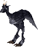

=== "Info"

    

    <table>
    <tr>
        <th>Spawn Locations</th>
        <td id="Frenzied-Ostard_Spawn-Locations" colspan="3"></td>
    </tr>
    <tr>
        <th>Base Damage</th>
        <td id="Frenzied-Ostard_Base-Damage"></td>
        <th>Armor Rating</th>
        <td id="Frenzied-Ostard_Armor-Rating"></td>
    </tr>
    <tr>
        <th>Fame</th>
        <td id="Frenzied-Ostard_Fame"></td>
        <th>Karma</th>
        <td id="Frenzied-Ostard_Karma"></td>
    </tr>
    <tr>
        <th>Super Slayer</th>
        <td id="Frenzied-Ostard_Super-Slayer"></td>
        <th>Minor Slayer</th>
        <td id="Frenzied-Ostard_Minor-Slayer"></td>
    </tr>
    <tr>
        <th>Barding Difficulty</th>
        <td id="Frenzied-Ostard_Barding-Difficulty"></td>
        <th>Taming Difficulty</th>
        <td id="Frenzied-Ostard_Taming-Difficulty"></td>
    </tr>
    </table>
    

=== "Attributes"

    

    <table>
    <tr>
        <th>Hit Points</th>
        <td id="Frenzied-Ostard_Hit-Points"></td>
        <th>Strength</th>
        <td id="Frenzied-Ostard_Strength"></td>
    </tr>
    <tr>
        <th>Stamina</th>
        <td id="Frenzied-Ostard_Stamina"></td>
        <th>Dexterity</th>
        <td id="Frenzied-Ostard_Dexterity"></td>
    </tr>
    <tr>
        <th>Mana</th>
        <td id="Frenzied-Ostard_Mana"></td>
        <th>Intelligence</th>
        <td id="Frenzied-Ostard_Intelligence"></td>
    </tr>
    </table>
    

=== "Skills"

    

    <table>
    <tr>
        <th>Wrestling</th>
        <td id="Frenzied-Ostard_Wrestling"></td>
        <th>Magery</th>
        <td id="Frenzied-Ostard_Magery"></td>
    </tr>
    <tr>
        <th>Tactics</th>
        <td id="Frenzied-Ostard_Tactics"></td>
        <th>Meditation</th>
        <td id="Frenzied-Ostard_Meditation"></td>
    </tr>
    <tr>
        <th>Resisting Spells</th>
        <td id="Frenzied-Ostard_Resisting-Spells"></td>
        <th>Evaluating Intelligence</th>
        <td id="Frenzied-Ostard_Evaluating-Intelligence"></td>
    </tr>
    <tr>
        <th>Anatomy</th>
        <td id="Frenzied-Ostard_Anatomy"></td>
        <th>Poisoning</th>
        <td id="Frenzied-Ostard_Poisoning"></td>
    </tr>
    </table>
    

=== "Loot"

    

    <table>
    <tr>
        <th>Gold</th>
        <td id="Frenzied-Ostard_Gold"></td>
    </tr>
    <tr>
        <th>Treasure Map lvl</th>
        <td id="Frenzied-Ostard_Treasure-Map-lvl"></td>
    </tr>
        <tr>
        <th>Slayer Drop</th>
        <td id="Frenzied-Ostard_Slayer-Drop"></td>
    </tr>
    </table>
    

### Frost Ooze

=== "Info"

    

    <table>
    <tr>
        <th>Spawn Locations</th>
        <td id="Frost-Ooze_Spawn-Locations" colspan="3"></td>
    </tr>
    <tr>
        <th>Base Damage</th>
        <td id="Frost-Ooze_Base-Damage"></td>
        <th>Armor Rating</th>
        <td id="Frost-Ooze_Armor-Rating"></td>
    </tr>
    <tr>
        <th>Fame</th>
        <td id="Frost-Ooze_Fame"></td>
        <th>Karma</th>
        <td id="Frost-Ooze_Karma"></td>
    </tr>
    <tr>
        <th>Super Slayer</th>
        <td id="Frost-Ooze_Super-Slayer"></td>
        <th>Minor Slayer</th>
        <td id="Frost-Ooze_Minor-Slayer"></td>
    </tr>
    <tr>
        <th>Barding Difficulty</th>
        <td id="Frost-Ooze_Barding-Difficulty"></td>
        <th>Taming Difficulty</th>
        <td id="Frost-Ooze_Taming-Difficulty"></td>
    </tr>
    </table>
    

=== "Attributes"

    

    <table>
    <tr>
        <th>Hit Points</th>
        <td id="Frost-Ooze_Hit-Points"></td>
        <th>Strength</th>
        <td id="Frost-Ooze_Strength"></td>
    </tr>
    <tr>
        <th>Stamina</th>
        <td id="Frost-Ooze_Stamina"></td>
        <th>Dexterity</th>
        <td id="Frost-Ooze_Dexterity"></td>
    </tr>
    <tr>
        <th>Mana</th>
        <td id="Frost-Ooze_Mana"></td>
        <th>Intelligence</th>
        <td id="Frost-Ooze_Intelligence"></td>
    </tr>
    </table>
    

=== "Skills"

    

    <table>
    <tr>
        <th>Wrestling</th>
        <td id="Frost-Ooze_Wrestling"></td>
        <th>Magery</th>
        <td id="Frost-Ooze_Magery"></td>
    </tr>
    <tr>
        <th>Tactics</th>
        <td id="Frost-Ooze_Tactics"></td>
        <th>Meditation</th>
        <td id="Frost-Ooze_Meditation"></td>
    </tr>
    <tr>
        <th>Resisting Spells</th>
        <td id="Frost-Ooze_Resisting-Spells"></td>
        <th>Evaluating Intelligence</th>
        <td id="Frost-Ooze_Evaluating-Intelligence"></td>
    </tr>
    <tr>
        <th>Anatomy</th>
        <td id="Frost-Ooze_Anatomy"></td>
        <th>Poisoning</th>
        <td id="Frost-Ooze_Poisoning"></td>
    </tr>
    </table>
    

=== "Loot"

    

    <table>
    <tr>
        <th>Gold</th>
        <td id="Frost-Ooze_Gold"></td>
    </tr>
    <tr>
        <th>Treasure Map lvl</th>
        <td id="Frost-Ooze_Treasure-Map-lvl"></td>
    </tr>
        <tr>
        <th>Slayer Drop</th>
        <td id="Frost-Ooze_Slayer-Drop"></td>
    </tr>
    </table>
    

### Frost Spider

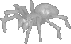

=== "Info"

    

    <table>
    <tr>
        <th>Spawn Locations</th>
        <td id="Frost-Spider_Spawn-Locations" colspan="3"></td>
    </tr>
    <tr>
        <th>Base Damage</th>
        <td id="Frost-Spider_Base-Damage"></td>
        <th>Armor Rating</th>
        <td id="Frost-Spider_Armor-Rating"></td>
    </tr>
    <tr>
        <th>Fame</th>
        <td id="Frost-Spider_Fame"></td>
        <th>Karma</th>
        <td id="Frost-Spider_Karma"></td>
    </tr>
    <tr>
        <th>Super Slayer</th>
        <td id="Frost-Spider_Super-Slayer"></td>
        <th>Minor Slayer</th>
        <td id="Frost-Spider_Minor-Slayer"></td>
    </tr>
    <tr>
        <th>Barding Difficulty</th>
        <td id="Frost-Spider_Barding-Difficulty"></td>
        <th>Taming Difficulty</th>
        <td id="Frost-Spider_Taming-Difficulty"></td>
    </tr>
    </table>
    

=== "Attributes"

    

    <table>
    <tr>
        <th>Hit Points</th>
        <td id="Frost-Spider_Hit-Points"></td>
        <th>Strength</th>
        <td id="Frost-Spider_Strength"></td>
    </tr>
    <tr>
        <th>Stamina</th>
        <td id="Frost-Spider_Stamina"></td>
        <th>Dexterity</th>
        <td id="Frost-Spider_Dexterity"></td>
    </tr>
    <tr>
        <th>Mana</th>
        <td id="Frost-Spider_Mana"></td>
        <th>Intelligence</th>
        <td id="Frost-Spider_Intelligence"></td>
    </tr>
    </table>
    

=== "Skills"

    

    <table>
    <tr>
        <th>Wrestling</th>
        <td id="Frost-Spider_Wrestling"></td>
        <th>Magery</th>
        <td id="Frost-Spider_Magery"></td>
    </tr>
    <tr>
        <th>Tactics</th>
        <td id="Frost-Spider_Tactics"></td>
        <th>Meditation</th>
        <td id="Frost-Spider_Meditation"></td>
    </tr>
    <tr>
        <th>Resisting Spells</th>
        <td id="Frost-Spider_Resisting-Spells"></td>
        <th>Evaluating Intelligence</th>
        <td id="Frost-Spider_Evaluating-Intelligence"></td>
    </tr>
    <tr>
        <th>Anatomy</th>
        <td id="Frost-Spider_Anatomy"></td>
        <th>Poisoning</th>
        <td id="Frost-Spider_Poisoning"></td>
    </tr>
    </table>
    

=== "Loot"

    

    <table>
    <tr>
        <th>Gold</th>
        <td id="Frost-Spider_Gold"></td>
    </tr>
    <tr>
        <th>Treasure Map lvl</th>
        <td id="Frost-Spider_Treasure-Map-lvl"></td>
    </tr>
        <tr>
        <th>Slayer Drop</th>
        <td id="Frost-Spider_Slayer-Drop"></td>
    </tr>
    </table>
    

### Frost Troll

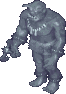

=== "Info"

    

    <table>
    <tr>
        <th>Spawn Locations</th>
        <td id="Frost-Troll_Spawn-Locations" colspan="3"></td>
    </tr>
    <tr>
        <th>Base Damage</th>
        <td id="Frost-Troll_Base-Damage"></td>
        <th>Armor Rating</th>
        <td id="Frost-Troll_Armor-Rating"></td>
    </tr>
    <tr>
        <th>Fame</th>
        <td id="Frost-Troll_Fame"></td>
        <th>Karma</th>
        <td id="Frost-Troll_Karma"></td>
    </tr>
    <tr>
        <th>Super Slayer</th>
        <td id="Frost-Troll_Super-Slayer"></td>
        <th>Minor Slayer</th>
        <td id="Frost-Troll_Minor-Slayer"></td>
    </tr>
    <tr>
        <th>Barding Difficulty</th>
        <td id="Frost-Troll_Barding-Difficulty"></td>
        <th>Taming Difficulty</th>
        <td id="Frost-Troll_Taming-Difficulty"></td>
    </tr>
    </table>
    

=== "Attributes"

    

    <table>
    <tr>
        <th>Hit Points</th>
        <td id="Frost-Troll_Hit-Points"></td>
        <th>Strength</th>
        <td id="Frost-Troll_Strength"></td>
    </tr>
    <tr>
        <th>Stamina</th>
        <td id="Frost-Troll_Stamina"></td>
        <th>Dexterity</th>
        <td id="Frost-Troll_Dexterity"></td>
    </tr>
    <tr>
        <th>Mana</th>
        <td id="Frost-Troll_Mana"></td>
        <th>Intelligence</th>
        <td id="Frost-Troll_Intelligence"></td>
    </tr>
    </table>
    

=== "Skills"

    

    <table>
    <tr>
        <th>Wrestling</th>
        <td id="Frost-Troll_Wrestling"></td>
        <th>Magery</th>
        <td id="Frost-Troll_Magery"></td>
    </tr>
    <tr>
        <th>Tactics</th>
        <td id="Frost-Troll_Tactics"></td>
        <th>Meditation</th>
        <td id="Frost-Troll_Meditation"></td>
    </tr>
    <tr>
        <th>Resisting Spells</th>
        <td id="Frost-Troll_Resisting-Spells"></td>
        <th>Evaluating Intelligence</th>
        <td id="Frost-Troll_Evaluating-Intelligence"></td>
    </tr>
    <tr>
        <th>Anatomy</th>
        <td id="Frost-Troll_Anatomy"></td>
        <th>Poisoning</th>
        <td id="Frost-Troll_Poisoning"></td>
    </tr>
    </table>
    

=== "Loot"

    

    <table>
    <tr>
        <th>Gold</th>
        <td id="Frost-Troll_Gold"></td>
    </tr>
    <tr>
        <th>Treasure Map lvl</th>
        <td id="Frost-Troll_Treasure-Map-lvl"></td>
    </tr>
        <tr>
        <th>Slayer Drop</th>
        <td id="Frost-Troll_Slayer-Drop"></td>
    </tr>
    </table>
    

### Gargoyle

=== "Info"

    

    <table>
    <tr>
        <th>Spawn Locations</th>
        <td id="Gargoyle_Spawn-Locations" colspan="3"></td>
    </tr>
    <tr>
        <th>Base Damage</th>
        <td id="Gargoyle_Base-Damage"></td>
        <th>Armor Rating</th>
        <td id="Gargoyle_Armor-Rating"></td>
    </tr>
    <tr>
        <th>Fame</th>
        <td id="Gargoyle_Fame"></td>
        <th>Karma</th>
        <td id="Gargoyle_Karma"></td>
    </tr>
    <tr>
        <th>Super Slayer</th>
        <td id="Gargoyle_Super-Slayer"></td>
        <th>Minor Slayer</th>
        <td id="Gargoyle_Minor-Slayer"></td>
    </tr>
    <tr>
        <th>Barding Difficulty</th>
        <td id="Gargoyle_Barding-Difficulty"></td>
        <th>Taming Difficulty</th>
        <td id="Gargoyle_Taming-Difficulty"></td>
    </tr>
    </table>
    

=== "Attributes"

    

    <table>
    <tr>
        <th>Hit Points</th>
        <td id="Gargoyle_Hit-Points"></td>
        <th>Strength</th>
        <td id="Gargoyle_Strength"></td>
    </tr>
    <tr>
        <th>Stamina</th>
        <td id="Gargoyle_Stamina"></td>
        <th>Dexterity</th>
        <td id="Gargoyle_Dexterity"></td>
    </tr>
    <tr>
        <th>Mana</th>
        <td id="Gargoyle_Mana"></td>
        <th>Intelligence</th>
        <td id="Gargoyle_Intelligence"></td>
    </tr>
    </table>
    

=== "Skills"

    

    <table>
    <tr>
        <th>Wrestling</th>
        <td id="Gargoyle_Wrestling"></td>
        <th>Magery</th>
        <td id="Gargoyle_Magery"></td>
    </tr>
    <tr>
        <th>Tactics</th>
        <td id="Gargoyle_Tactics"></td>
        <th>Meditation</th>
        <td id="Gargoyle_Meditation"></td>
    </tr>
    <tr>
        <th>Resisting Spells</th>
        <td id="Gargoyle_Resisting-Spells"></td>
        <th>Evaluating Intelligence</th>
        <td id="Gargoyle_Evaluating-Intelligence"></td>
    </tr>
    <tr>
        <th>Anatomy</th>
        <td id="Gargoyle_Anatomy"></td>
        <th>Poisoning</th>
        <td id="Gargoyle_Poisoning"></td>
    </tr>
    </table>
    

=== "Loot"

    

    <table>
    <tr>
        <th>Gold</th>
        <td id="Gargoyle_Gold"></td>
    </tr>
    <tr>
        <th>Treasure Map lvl</th>
        <td id="Gargoyle_Treasure-Map-lvl"></td>
    </tr>
        <tr>
        <th>Slayer Drop</th>
        <td id="Gargoyle_Slayer-Drop"></td>
    </tr>
    </table>
    

### Gargoyle Destroyer

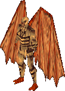

=== "Info"

    

    <table>
    <tr>
        <th>Spawn Locations</th>
        <td id="Gargoyle-Destroyer_Spawn-Locations" colspan="3"></td>
    </tr>
    <tr>
        <th>Base Damage</th>
        <td id="Gargoyle-Destroyer_Base-Damage"></td>
        <th>Armor Rating</th>
        <td id="Gargoyle-Destroyer_Armor-Rating"></td>
    </tr>
    <tr>
        <th>Fame</th>
        <td id="Gargoyle-Destroyer_Fame"></td>
        <th>Karma</th>
        <td id="Gargoyle-Destroyer_Karma"></td>
    </tr>
    <tr>
        <th>Super Slayer</th>
        <td id="Gargoyle-Destroyer_Super-Slayer"></td>
        <th>Minor Slayer</th>
        <td id="Gargoyle-Destroyer_Minor-Slayer"></td>
    </tr>
    <tr>
        <th>Barding Difficulty</th>
        <td id="Gargoyle-Destroyer_Barding-Difficulty"></td>
        <th>Taming Difficulty</th>
        <td id="Gargoyle-Destroyer_Taming-Difficulty"></td>
    </tr>
    </table>
    

=== "Attributes"

    

    <table>
    <tr>
        <th>Hit Points</th>
        <td id="Gargoyle-Destroyer_Hit-Points"></td>
        <th>Strength</th>
        <td id="Gargoyle-Destroyer_Strength"></td>
    </tr>
    <tr>
        <th>Stamina</th>
        <td id="Gargoyle-Destroyer_Stamina"></td>
        <th>Dexterity</th>
        <td id="Gargoyle-Destroyer_Dexterity"></td>
    </tr>
    <tr>
        <th>Mana</th>
        <td id="Gargoyle-Destroyer_Mana"></td>
        <th>Intelligence</th>
        <td id="Gargoyle-Destroyer_Intelligence"></td>
    </tr>
    </table>
    

=== "Skills"

    

    <table>
    <tr>
        <th>Wrestling</th>
        <td id="Gargoyle-Destroyer_Wrestling"></td>
        <th>Magery</th>
        <td id="Gargoyle-Destroyer_Magery"></td>
    </tr>
    <tr>
        <th>Tactics</th>
        <td id="Gargoyle-Destroyer_Tactics"></td>
        <th>Meditation</th>
        <td id="Gargoyle-Destroyer_Meditation"></td>
    </tr>
    <tr>
        <th>Resisting Spells</th>
        <td id="Gargoyle-Destroyer_Resisting-Spells"></td>
        <th>Evaluating Intelligence</th>
        <td id="Gargoyle-Destroyer_Evaluating-Intelligence"></td>
    </tr>
    <tr>
        <th>Anatomy</th>
        <td id="Gargoyle-Destroyer_Anatomy"></td>
        <th>Poisoning</th>
        <td id="Gargoyle-Destroyer_Poisoning"></td>
    </tr>
    </table>
    

=== "Loot"

    

    <table>
    <tr>
        <th>Gold</th>
        <td id="Gargoyle-Destroyer_Gold"></td>
    </tr>
    <tr>
        <th>Treasure Map lvl</th>
        <td id="Gargoyle-Destroyer_Treasure-Map-lvl"></td>
    </tr>
        <tr>
        <th>Slayer Drop</th>
        <td id="Gargoyle-Destroyer_Slayer-Drop"></td>
    </tr>
    </table>
    

### Gargoyle Enforcer

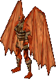

=== "Info"

    

    <table>
    <tr>
        <th>Spawn Locations</th>
        <td id="Gargoyle-Enforcer_Spawn-Locations" colspan="3"></td>
    </tr>
    <tr>
        <th>Base Damage</th>
        <td id="Gargoyle-Enforcer_Base-Damage"></td>
        <th>Armor Rating</th>
        <td id="Gargoyle-Enforcer_Armor-Rating"></td>
    </tr>
    <tr>
        <th>Fame</th>
        <td id="Gargoyle-Enforcer_Fame"></td>
        <th>Karma</th>
        <td id="Gargoyle-Enforcer_Karma"></td>
    </tr>
    <tr>
        <th>Super Slayer</th>
        <td id="Gargoyle-Enforcer_Super-Slayer"></td>
        <th>Minor Slayer</th>
        <td id="Gargoyle-Enforcer_Minor-Slayer"></td>
    </tr>
    <tr>
        <th>Barding Difficulty</th>
        <td id="Gargoyle-Enforcer_Barding-Difficulty"></td>
        <th>Taming Difficulty</th>
        <td id="Gargoyle-Enforcer_Taming-Difficulty"></td>
    </tr>
    </table>
    

=== "Attributes"

    

    <table>
    <tr>
        <th>Hit Points</th>
        <td id="Gargoyle-Enforcer_Hit-Points"></td>
        <th>Strength</th>
        <td id="Gargoyle-Enforcer_Strength"></td>
    </tr>
    <tr>
        <th>Stamina</th>
        <td id="Gargoyle-Enforcer_Stamina"></td>
        <th>Dexterity</th>
        <td id="Gargoyle-Enforcer_Dexterity"></td>
    </tr>
    <tr>
        <th>Mana</th>
        <td id="Gargoyle-Enforcer_Mana"></td>
        <th>Intelligence</th>
        <td id="Gargoyle-Enforcer_Intelligence"></td>
    </tr>
    </table>
    

=== "Skills"

    

    <table>
    <tr>
        <th>Wrestling</th>
        <td id="Gargoyle-Enforcer_Wrestling"></td>
        <th>Magery</th>
        <td id="Gargoyle-Enforcer_Magery"></td>
    </tr>
    <tr>
        <th>Tactics</th>
        <td id="Gargoyle-Enforcer_Tactics"></td>
        <th>Meditation</th>
        <td id="Gargoyle-Enforcer_Meditation"></td>
    </tr>
    <tr>
        <th>Resisting Spells</th>
        <td id="Gargoyle-Enforcer_Resisting-Spells"></td>
        <th>Evaluating Intelligence</th>
        <td id="Gargoyle-Enforcer_Evaluating-Intelligence"></td>
    </tr>
    <tr>
        <th>Anatomy</th>
        <td id="Gargoyle-Enforcer_Anatomy"></td>
        <th>Poisoning</th>
        <td id="Gargoyle-Enforcer_Poisoning"></td>
    </tr>
    </table>
    

=== "Loot"

    

    <table>
    <tr>
        <th>Gold</th>
        <td id="Gargoyle-Enforcer_Gold"></td>
    </tr>
    <tr>
        <th>Treasure Map lvl</th>
        <td id="Gargoyle-Enforcer_Treasure-Map-lvl"></td>
    </tr>
        <tr>
        <th>Slayer Drop</th>
        <td id="Gargoyle-Enforcer_Slayer-Drop"></td>
    </tr>
    </table>
    

### Gargoyle Warlord

!!! warning
    Under construction.

=== "Info"

    

    <table>
    <tr>
        <th>Spawn Locations</th>
        <td id="Gargoyle-Warlord_Spawn-Locations" colspan="3"></td>
    </tr>
    <tr>
        <th>Base Damage</th>
        <td id="Gargoyle-Warlord_Base-Damage"></td>
        <th>Armor Rating</th>
        <td id="Gargoyle-Warlord_Armor-Rating"></td>
    </tr>
    <tr>
        <th>Fame</th>
        <td id="Gargoyle-Warlord_Fame"></td>
        <th>Karma</th>
        <td id="Gargoyle-Warlord_Karma"></td>
    </tr>
    <tr>
        <th>Super Slayer</th>
        <td id="Gargoyle-Warlord_Super-Slayer"></td>
        <th>Minor Slayer</th>
        <td id="Gargoyle-Warlord_Minor-Slayer"></td>
    </tr>
    <tr>
        <th>Barding Difficulty</th>
        <td id="Gargoyle-Warlord_Barding-Difficulty"></td>
        <th>Taming Difficulty</th>
        <td id="Gargoyle-Warlord_Taming-Difficulty"></td>
    </tr>
    </table>
    

=== "Attributes"

    

    <table>
    <tr>
        <th>Hit Points</th>
        <td id="Gargoyle-Warlord_Hit-Points"></td>
        <th>Strength</th>
        <td id="Gargoyle-Warlord_Strength"></td>
    </tr>
    <tr>
        <th>Stamina</th>
        <td id="Gargoyle-Warlord_Stamina"></td>
        <th>Dexterity</th>
        <td id="Gargoyle-Warlord_Dexterity"></td>
    </tr>
    <tr>
        <th>Mana</th>
        <td id="Gargoyle-Warlord_Mana"></td>
        <th>Intelligence</th>
        <td id="Gargoyle-Warlord_Intelligence"></td>
    </tr>
    </table>
    

=== "Skills"

    

    <table>
    <tr>
        <th>Wrestling</th>
        <td id="Gargoyle-Warlord_Wrestling"></td>
        <th>Magery</th>
        <td id="Gargoyle-Warlord_Magery"></td>
    </tr>
    <tr>
        <th>Tactics</th>
        <td id="Gargoyle-Warlord_Tactics"></td>
        <th>Meditation</th>
        <td id="Gargoyle-Warlord_Meditation"></td>
    </tr>
    <tr>
        <th>Resisting Spells</th>
        <td id="Gargoyle-Warlord_Resisting-Spells"></td>
        <th>Evaluating Intelligence</th>
        <td id="Gargoyle-Warlord_Evaluating-Intelligence"></td>
    </tr>
    <tr>
        <th>Anatomy</th>
        <td id="Gargoyle-Warlord_Anatomy"></td>
        <th>Poisoning</th>
        <td id="Gargoyle-Warlord_Poisoning"></td>
    </tr>
    </table>
    

=== "Loot"

    

    <table>
    <tr>
        <th>Gold</th>
        <td id="Gargoyle-Warlord_Gold"></td>
    </tr>
    <tr>
        <th>Treasure Map lvl</th>
        <td id="Gargoyle-Warlord_Treasure-Map-lvl"></td>
    </tr>
        <tr>
        <th>Slayer Drop</th>
        <td id="Gargoyle-Warlord_Slayer-Drop"></td>
    </tr>
    </table>
    

### Gazer

=== "Info"

    

    <table>
    <tr>
        <th>Spawn Locations</th>
        <td id="Gazer_Spawn-Locations" colspan="3"></td>
    </tr>
    <tr>
        <th>Base Damage</th>
        <td id="Gazer_Base-Damage"></td>
        <th>Armor Rating</th>
        <td id="Gazer_Armor-Rating"></td>
    </tr>
    <tr>
        <th>Fame</th>
        <td id="Gazer_Fame"></td>
        <th>Karma</th>
        <td id="Gazer_Karma"></td>
    </tr>
    <tr>
        <th>Super Slayer</th>
        <td id="Gazer_Super-Slayer"></td>
        <th>Minor Slayer</th>
        <td id="Gazer_Minor-Slayer"></td>
    </tr>
    <tr>
        <th>Barding Difficulty</th>
        <td id="Gazer_Barding-Difficulty"></td>
        <th>Taming Difficulty</th>
        <td id="Gazer_Taming-Difficulty"></td>
    </tr>
    </table>
    

=== "Attributes"

    

    <table>
    <tr>
        <th>Hit Points</th>
        <td id="Gazer_Hit-Points"></td>
        <th>Strength</th>
        <td id="Gazer_Strength"></td>
    </tr>
    <tr>
        <th>Stamina</th>
        <td id="Gazer_Stamina"></td>
        <th>Dexterity</th>
        <td id="Gazer_Dexterity"></td>
    </tr>
    <tr>
        <th>Mana</th>
        <td id="Gazer_Mana"></td>
        <th>Intelligence</th>
        <td id="Gazer_Intelligence"></td>
    </tr>
    </table>
    

=== "Skills"

    

    <table>
    <tr>
        <th>Wrestling</th>
        <td id="Gazer_Wrestling"></td>
        <th>Magery</th>
        <td id="Gazer_Magery"></td>
    </tr>
    <tr>
        <th>Tactics</th>
        <td id="Gazer_Tactics"></td>
        <th>Meditation</th>
        <td id="Gazer_Meditation"></td>
    </tr>
    <tr>
        <th>Resisting Spells</th>
        <td id="Gazer_Resisting-Spells"></td>
        <th>Evaluating Intelligence</th>
        <td id="Gazer_Evaluating-Intelligence"></td>
    </tr>
    <tr>
        <th>Anatomy</th>
        <td id="Gazer_Anatomy"></td>
        <th>Poisoning</th>
        <td id="Gazer_Poisoning"></td>
    </tr>
    </table>
    

=== "Loot"

    

    <table>
    <tr>
        <th>Gold</th>
        <td id="Gazer_Gold"></td>
    </tr>
    <tr>
        <th>Treasure Map lvl</th>
        <td id="Gazer_Treasure-Map-lvl"></td>
    </tr>
        <tr>
        <th>Slayer Drop</th>
        <td id="Gazer_Slayer-Drop"></td>
    </tr>
    </table>
    

### Gazer Larva

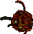

=== "Info"

    

    <table>
    <tr>
        <th>Spawn Locations</th>
        <td id="Gazer-Larva_Spawn-Locations" colspan="3"></td>
    </tr>
    <tr>
        <th>Base Damage</th>
        <td id="Gazer-Larva_Base-Damage"></td>
        <th>Armor Rating</th>
        <td id="Gazer-Larva_Armor-Rating"></td>
    </tr>
    <tr>
        <th>Fame</th>
        <td id="Gazer-Larva_Fame"></td>
        <th>Karma</th>
        <td id="Gazer-Larva_Karma"></td>
    </tr>
    <tr>
        <th>Super Slayer</th>
        <td id="Gazer-Larva_Super-Slayer"></td>
        <th>Minor Slayer</th>
        <td id="Gazer-Larva_Minor-Slayer"></td>
    </tr>
    <tr>
        <th>Barding Difficulty</th>
        <td id="Gazer-Larva_Barding-Difficulty"></td>
        <th>Taming Difficulty</th>
        <td id="Gazer-Larva_Taming-Difficulty"></td>
    </tr>
    </table>
    

=== "Attributes"

    

    <table>
    <tr>
        <th>Hit Points</th>
        <td id="Gazer-Larva_Hit-Points"></td>
        <th>Strength</th>
        <td id="Gazer-Larva_Strength"></td>
    </tr>
    <tr>
        <th>Stamina</th>
        <td id="Gazer-Larva_Stamina"></td>
        <th>Dexterity</th>
        <td id="Gazer-Larva_Dexterity"></td>
    </tr>
    <tr>
        <th>Mana</th>
        <td id="Gazer-Larva_Mana"></td>
        <th>Intelligence</th>
        <td id="Gazer-Larva_Intelligence"></td>
    </tr>
    </table>
    

=== "Skills"

    

    <table>
    <tr>
        <th>Wrestling</th>
        <td id="Gazer-Larva_Wrestling"></td>
        <th>Magery</th>
        <td id="Gazer-Larva_Magery"></td>
    </tr>
    <tr>
        <th>Tactics</th>
        <td id="Gazer-Larva_Tactics"></td>
        <th>Meditation</th>
        <td id="Gazer-Larva_Meditation"></td>
    </tr>
    <tr>
        <th>Resisting Spells</th>
        <td id="Gazer-Larva_Resisting-Spells"></td>
        <th>Evaluating Intelligence</th>
        <td id="Gazer-Larva_Evaluating-Intelligence"></td>
    </tr>
    <tr>
        <th>Anatomy</th>
        <td id="Gazer-Larva_Anatomy"></td>
        <th>Poisoning</th>
        <td id="Gazer-Larva_Poisoning"></td>
    </tr>
    </table>
    

=== "Loot"

    

    <table>
    <tr>
        <th>Gold</th>
        <td id="Gazer-Larva_Gold"></td>
    </tr>
    <tr>
        <th>Treasure Map lvl</th>
        <td id="Gazer-Larva_Treasure-Map-lvl"></td>
    </tr>
        <tr>
        <th>Slayer Drop</th>
        <td id="Gazer-Larva_Slayer-Drop"></td>
    </tr>
    </table>
    

### Ghoul

=== "Info"

    

    <table>
    <tr>
        <th>Spawn Locations</th>
        <td id="Ghoul_Spawn-Locations" colspan="3"></td>
    </tr>
    <tr>
        <th>Base Damage</th>
        <td id="Ghoul_Base-Damage"></td>
        <th>Armor Rating</th>
        <td id="Ghoul_Armor-Rating"></td>
    </tr>
    <tr>
        <th>Fame</th>
        <td id="Ghoul_Fame"></td>
        <th>Karma</th>
        <td id="Ghoul_Karma"></td>
    </tr>
    <tr>
        <th>Super Slayer</th>
        <td id="Ghoul_Super-Slayer"></td>
        <th>Minor Slayer</th>
        <td id="Ghoul_Minor-Slayer"></td>
    </tr>
    <tr>
        <th>Barding Difficulty</th>
        <td id="Ghoul_Barding-Difficulty"></td>
        <th>Taming Difficulty</th>
        <td id="Ghoul_Taming-Difficulty"></td>
    </tr>
    </table>
    

=== "Attributes"

    

    <table>
    <tr>
        <th>Hit Points</th>
        <td id="Ghoul_Hit-Points"></td>
        <th>Strength</th>
        <td id="Ghoul_Strength"></td>
    </tr>
    <tr>
        <th>Stamina</th>
        <td id="Ghoul_Stamina"></td>
        <th>Dexterity</th>
        <td id="Ghoul_Dexterity"></td>
    </tr>
    <tr>
        <th>Mana</th>
        <td id="Ghoul_Mana"></td>
        <th>Intelligence</th>
        <td id="Ghoul_Intelligence"></td>
    </tr>
    </table>
    

=== "Skills"

    

    <table>
    <tr>
        <th>Wrestling</th>
        <td id="Ghoul_Wrestling"></td>
        <th>Magery</th>
        <td id="Ghoul_Magery"></td>
    </tr>
    <tr>
        <th>Tactics</th>
        <td id="Ghoul_Tactics"></td>
        <th>Meditation</th>
        <td id="Ghoul_Meditation"></td>
    </tr>
    <tr>
        <th>Resisting Spells</th>
        <td id="Ghoul_Resisting-Spells"></td>
        <th>Evaluating Intelligence</th>
        <td id="Ghoul_Evaluating-Intelligence"></td>
    </tr>
    <tr>
        <th>Anatomy</th>
        <td id="Ghoul_Anatomy"></td>
        <th>Poisoning</th>
        <td id="Ghoul_Poisoning"></td>
    </tr>
    </table>
    

=== "Loot"

    

    <table>
    <tr>
        <th>Gold</th>
        <td id="Ghoul_Gold"></td>
    </tr>
    <tr>
        <th>Treasure Map lvl</th>
        <td id="Ghoul_Treasure-Map-lvl"></td>
    </tr>
        <tr>
        <th>Slayer Drop</th>
        <td id="Ghoul_Slayer-Drop"></td>
    </tr>
    </table>
    

### Giant Black Widow

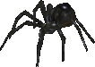

=== "Info"

    

    <table>
    <tr>
        <th>Spawn Locations</th>
        <td id="Giant-Black-Widow_Spawn-Locations" colspan="3"></td>
    </tr>
    <tr>
        <th>Base Damage</th>
        <td id="Giant-Black-Widow_Base-Damage"></td>
        <th>Armor Rating</th>
        <td id="Giant-Black-Widow_Armor-Rating"></td>
    </tr>
    <tr>
        <th>Fame</th>
        <td id="Giant-Black-Widow_Fame"></td>
        <th>Karma</th>
        <td id="Giant-Black-Widow_Karma"></td>
    </tr>
    <tr>
        <th>Super Slayer</th>
        <td id="Giant-Black-Widow_Super-Slayer"></td>
        <th>Minor Slayer</th>
        <td id="Giant-Black-Widow_Minor-Slayer"></td>
    </tr>
    <tr>
        <th>Barding Difficulty</th>
        <td id="Giant-Black-Widow_Barding-Difficulty"></td>
        <th>Taming Difficulty</th>
        <td id="Giant-Black-Widow_Taming-Difficulty"></td>
    </tr>
    </table>
    

=== "Attributes"

    

    <table>
    <tr>
        <th>Hit Points</th>
        <td id="Giant-Black-Widow_Hit-Points"></td>
        <th>Strength</th>
        <td id="Giant-Black-Widow_Strength"></td>
    </tr>
    <tr>
        <th>Stamina</th>
        <td id="Giant-Black-Widow_Stamina"></td>
        <th>Dexterity</th>
        <td id="Giant-Black-Widow_Dexterity"></td>
    </tr>
    <tr>
        <th>Mana</th>
        <td id="Giant-Black-Widow_Mana"></td>
        <th>Intelligence</th>
        <td id="Giant-Black-Widow_Intelligence"></td>
    </tr>
    </table>
    

=== "Skills"

    

    <table>
    <tr>
        <th>Wrestling</th>
        <td id="Giant-Black-Widow_Wrestling"></td>
        <th>Magery</th>
        <td id="Giant-Black-Widow_Magery"></td>
    </tr>
    <tr>
        <th>Tactics</th>
        <td id="Giant-Black-Widow_Tactics"></td>
        <th>Meditation</th>
        <td id="Giant-Black-Widow_Meditation"></td>
    </tr>
    <tr>
        <th>Resisting Spells</th>
        <td id="Giant-Black-Widow_Resisting-Spells"></td>
        <th>Evaluating Intelligence</th>
        <td id="Giant-Black-Widow_Evaluating-Intelligence"></td>
    </tr>
    <tr>
        <th>Anatomy</th>
        <td id="Giant-Black-Widow_Anatomy"></td>
        <th>Poisoning</th>
        <td id="Giant-Black-Widow_Poisoning"></td>
    </tr>
    </table>
    

=== "Loot"

    

    <table>
    <tr>
        <th>Gold</th>
        <td id="Giant-Black-Widow_Gold"></td>
    </tr>
    <tr>
        <th>Treasure Map lvl</th>
        <td id="Giant-Black-Widow_Treasure-Map-lvl"></td>
    </tr>
        <tr>
        <th>Slayer Drop</th>
        <td id="Giant-Black-Widow_Slayer-Drop"></td>
    </tr>
    </table>
    

### Giant Ice Serpent

=== "Info"

    

    <table>
    <tr>
        <th>Spawn Locations</th>
        <td id="Giant-Ice-Serpent_Spawn-Locations" colspan="3"></td>
    </tr>
    <tr>
        <th>Base Damage</th>
        <td id="Giant-Ice-Serpent_Base-Damage"></td>
        <th>Armor Rating</th>
        <td id="Giant-Ice-Serpent_Armor-Rating"></td>
    </tr>
    <tr>
        <th>Fame</th>
        <td id="Giant-Ice-Serpent_Fame"></td>
        <th>Karma</th>
        <td id="Giant-Ice-Serpent_Karma"></td>
    </tr>
    <tr>
        <th>Super Slayer</th>
        <td id="Giant-Ice-Serpent_Super-Slayer"></td>
        <th>Minor Slayer</th>
        <td id="Giant-Ice-Serpent_Minor-Slayer"></td>
    </tr>
    <tr>
        <th>Barding Difficulty</th>
        <td id="Giant-Ice-Serpent_Barding-Difficulty"></td>
        <th>Taming Difficulty</th>
        <td id="Giant-Ice-Serpent_Taming-Difficulty"></td>
    </tr>
    </table>
    

=== "Attributes"

    

    <table>
    <tr>
        <th>Hit Points</th>
        <td id="Giant-Ice-Serpent_Hit-Points"></td>
        <th>Strength</th>
        <td id="Giant-Ice-Serpent_Strength"></td>
    </tr>
    <tr>
        <th>Stamina</th>
        <td id="Giant-Ice-Serpent_Stamina"></td>
        <th>Dexterity</th>
        <td id="Giant-Ice-Serpent_Dexterity"></td>
    </tr>
    <tr>
        <th>Mana</th>
        <td id="Giant-Ice-Serpent_Mana"></td>
        <th>Intelligence</th>
        <td id="Giant-Ice-Serpent_Intelligence"></td>
    </tr>
    </table>
    

=== "Skills"

    

    <table>
    <tr>
        <th>Wrestling</th>
        <td id="Giant-Ice-Serpent_Wrestling"></td>
        <th>Magery</th>
        <td id="Giant-Ice-Serpent_Magery"></td>
    </tr>
    <tr>
        <th>Tactics</th>
        <td id="Giant-Ice-Serpent_Tactics"></td>
        <th>Meditation</th>
        <td id="Giant-Ice-Serpent_Meditation"></td>
    </tr>
    <tr>
        <th>Resisting Spells</th>
        <td id="Giant-Ice-Serpent_Resisting-Spells"></td>
        <th>Evaluating Intelligence</th>
        <td id="Giant-Ice-Serpent_Evaluating-Intelligence"></td>
    </tr>
    <tr>
        <th>Anatomy</th>
        <td id="Giant-Ice-Serpent_Anatomy"></td>
        <th>Poisoning</th>
        <td id="Giant-Ice-Serpent_Poisoning"></td>
    </tr>
    </table>
    

=== "Loot"

    

    <table>
    <tr>
        <th>Gold</th>
        <td id="Giant-Ice-Serpent_Gold"></td>
    </tr>
    <tr>
        <th>Treasure Map lvl</th>
        <td id="Giant-Ice-Serpent_Treasure-Map-lvl"></td>
    </tr>
        <tr>
        <th>Slayer Drop</th>
        <td id="Giant-Ice-Serpent_Slayer-Drop"></td>
    </tr>
    </table>
    

### Giant Rat

=== "Info"

    

    <table>
    <tr>
        <th>Spawn Locations</th>
        <td id="Giant-Rat_Spawn-Locations" colspan="3"></td>
    </tr>
    <tr>
        <th>Base Damage</th>
        <td id="Giant-Rat_Base-Damage"></td>
        <th>Armor Rating</th>
        <td id="Giant-Rat_Armor-Rating"></td>
    </tr>
    <tr>
        <th>Fame</th>
        <td id="Giant-Rat_Fame"></td>
        <th>Karma</th>
        <td id="Giant-Rat_Karma"></td>
    </tr>
    <tr>
        <th>Super Slayer</th>
        <td id="Giant-Rat_Super-Slayer"></td>
        <th>Minor Slayer</th>
        <td id="Giant-Rat_Minor-Slayer"></td>
    </tr>
    <tr>
        <th>Barding Difficulty</th>
        <td id="Giant-Rat_Barding-Difficulty"></td>
        <th>Taming Difficulty</th>
        <td id="Giant-Rat_Taming-Difficulty"></td>
    </tr>
    </table>
    

=== "Attributes"

    

    <table>
    <tr>
        <th>Hit Points</th>
        <td id="Giant-Rat_Hit-Points"></td>
        <th>Strength</th>
        <td id="Giant-Rat_Strength"></td>
    </tr>
    <tr>
        <th>Stamina</th>
        <td id="Giant-Rat_Stamina"></td>
        <th>Dexterity</th>
        <td id="Giant-Rat_Dexterity"></td>
    </tr>
    <tr>
        <th>Mana</th>
        <td id="Giant-Rat_Mana"></td>
        <th>Intelligence</th>
        <td id="Giant-Rat_Intelligence"></td>
    </tr>
    </table>
    

=== "Skills"

    

    <table>
    <tr>
        <th>Wrestling</th>
        <td id="Giant-Rat_Wrestling"></td>
        <th>Magery</th>
        <td id="Giant-Rat_Magery"></td>
    </tr>
    <tr>
        <th>Tactics</th>
        <td id="Giant-Rat_Tactics"></td>
        <th>Meditation</th>
        <td id="Giant-Rat_Meditation"></td>
    </tr>
    <tr>
        <th>Resisting Spells</th>
        <td id="Giant-Rat_Resisting-Spells"></td>
        <th>Evaluating Intelligence</th>
        <td id="Giant-Rat_Evaluating-Intelligence"></td>
    </tr>
    <tr>
        <th>Anatomy</th>
        <td id="Giant-Rat_Anatomy"></td>
        <th>Poisoning</th>
        <td id="Giant-Rat_Poisoning"></td>
    </tr>
    </table>
    

=== "Loot"

    

    <table>
    <tr>
        <th>Gold</th>
        <td id="Giant-Rat_Gold"></td>
    </tr>
    <tr>
        <th>Treasure Map lvl</th>
        <td id="Giant-Rat_Treasure-Map-lvl"></td>
    </tr>
        <tr>
        <th>Slayer Drop</th>
        <td id="Giant-Rat_Slayer-Drop"></td>
    </tr>
    </table>
    

### Giant Snake

=== "Info"

    

    <table>
    <tr>
        <th>Spawn Locations</th>
        <td id="Giant-Snake_Spawn-Locations" colspan="3"></td>
    </tr>
    <tr>
        <th>Base Damage</th>
        <td id="Giant-Snake_Base-Damage"></td>
        <th>Armor Rating</th>
        <td id="Giant-Snake_Armor-Rating"></td>
    </tr>
    <tr>
        <th>Fame</th>
        <td id="Giant-Snake_Fame"></td>
        <th>Karma</th>
        <td id="Giant-Snake_Karma"></td>
    </tr>
    <tr>
        <th>Super Slayer</th>
        <td id="Giant-Snake_Super-Slayer"></td>
        <th>Minor Slayer</th>
        <td id="Giant-Snake_Minor-Slayer"></td>
    </tr>
    <tr>
        <th>Barding Difficulty</th>
        <td id="Giant-Snake_Barding-Difficulty"></td>
        <th>Taming Difficulty</th>
        <td id="Giant-Snake_Taming-Difficulty"></td>
    </tr>
    </table>
    

=== "Attributes"

    

    <table>
    <tr>
        <th>Hit Points</th>
        <td id="Giant-Snake_Hit-Points"></td>
        <th>Strength</th>
        <td id="Giant-Snake_Strength"></td>
    </tr>
    <tr>
        <th>Stamina</th>
        <td id="Giant-Snake_Stamina"></td>
        <th>Dexterity</th>
        <td id="Giant-Snake_Dexterity"></td>
    </tr>
    <tr>
        <th>Mana</th>
        <td id="Giant-Snake_Mana"></td>
        <th>Intelligence</th>
        <td id="Giant-Snake_Intelligence"></td>
    </tr>
    </table>
    

=== "Skills"

    

    <table>
    <tr>
        <th>Wrestling</th>
        <td id="Giant-Snake_Wrestling"></td>
        <th>Magery</th>
        <td id="Giant-Snake_Magery"></td>
    </tr>
    <tr>
        <th>Tactics</th>
        <td id="Giant-Snake_Tactics"></td>
        <th>Meditation</th>
        <td id="Giant-Snake_Meditation"></td>
    </tr>
    <tr>
        <th>Resisting Spells</th>
        <td id="Giant-Snake_Resisting-Spells"></td>
        <th>Evaluating Intelligence</th>
        <td id="Giant-Snake_Evaluating-Intelligence"></td>
    </tr>
    <tr>
        <th>Anatomy</th>
        <td id="Giant-Snake_Anatomy"></td>
        <th>Poisoning</th>
        <td id="Giant-Snake_Poisoning"></td>
    </tr>
    </table>
    

=== "Loot"

    

    <table>
    <tr>
        <th>Gold</th>
        <td id="Giant-Snake_Gold"></td>
    </tr>
    <tr>
        <th>Treasure Map lvl</th>
        <td id="Giant-Snake_Treasure-Map-lvl"></td>
    </tr>
        <tr>
        <th>Slayer Drop</th>
        <td id="Giant-Snake_Slayer-Drop"></td>
    </tr>
    </table>
    

### Giant Spider

=== "Info"

    

    <table>
    <tr>
        <th>Spawn Locations</th>
        <td id="Giant-Spider_Spawn-Locations" colspan="3"></td>
    </tr>
    <tr>
        <th>Base Damage</th>
        <td id="Giant-Spider_Base-Damage"></td>
        <th>Armor Rating</th>
        <td id="Giant-Spider_Armor-Rating"></td>
    </tr>
    <tr>
        <th>Fame</th>
        <td id="Giant-Spider_Fame"></td>
        <th>Karma</th>
        <td id="Giant-Spider_Karma"></td>
    </tr>
    <tr>
        <th>Super Slayer</th>
        <td id="Giant-Spider_Super-Slayer"></td>
        <th>Minor Slayer</th>
        <td id="Giant-Spider_Minor-Slayer"></td>
    </tr>
    <tr>
        <th>Barding Difficulty</th>
        <td id="Giant-Spider_Barding-Difficulty"></td>
        <th>Taming Difficulty</th>
        <td id="Giant-Spider_Taming-Difficulty"></td>
    </tr>
    </table>
    

=== "Attributes"

    

    <table>
    <tr>
        <th>Hit Points</th>
        <td id="Giant-Spider_Hit-Points"></td>
        <th>Strength</th>
        <td id="Giant-Spider_Strength"></td>
    </tr>
    <tr>
        <th>Stamina</th>
        <td id="Giant-Spider_Stamina"></td>
        <th>Dexterity</th>
        <td id="Giant-Spider_Dexterity"></td>
    </tr>
    <tr>
        <th>Mana</th>
        <td id="Giant-Spider_Mana"></td>
        <th>Intelligence</th>
        <td id="Giant-Spider_Intelligence"></td>
    </tr>
    </table>
    

=== "Skills"

    

    <table>
    <tr>
        <th>Wrestling</th>
        <td id="Giant-Spider_Wrestling"></td>
        <th>Magery</th>
        <td id="Giant-Spider_Magery"></td>
    </tr>
    <tr>
        <th>Tactics</th>
        <td id="Giant-Spider_Tactics"></td>
        <th>Meditation</th>
        <td id="Giant-Spider_Meditation"></td>
    </tr>
    <tr>
        <th>Resisting Spells</th>
        <td id="Giant-Spider_Resisting-Spells"></td>
        <th>Evaluating Intelligence</th>
        <td id="Giant-Spider_Evaluating-Intelligence"></td>
    </tr>
    <tr>
        <th>Anatomy</th>
        <td id="Giant-Spider_Anatomy"></td>
        <th>Poisoning</th>
        <td id="Giant-Spider_Poisoning"></td>
    </tr>
    </table>
    

=== "Loot"

    

    <table>
    <tr>
        <th>Gold</th>
        <td id="Giant-Spider_Gold"></td>
    </tr>
    <tr>
        <th>Treasure Map lvl</th>
        <td id="Giant-Spider_Treasure-Map-lvl"></td>
    </tr>
        <tr>
        <th>Slayer Drop</th>
        <td id="Giant-Spider_Slayer-Drop"></td>
    </tr>
    </table>
    

### Giant Toad

=== "Info"

    

    <table>
    <tr>
        <th>Spawn Locations</th>
        <td id="Giant-Toad_Spawn-Locations" colspan="3"></td>
    </tr>
    <tr>
        <th>Base Damage</th>
        <td id="Giant-Toad_Base-Damage"></td>
        <th>Armor Rating</th>
        <td id="Giant-Toad_Armor-Rating"></td>
    </tr>
    <tr>
        <th>Fame</th>
        <td id="Giant-Toad_Fame"></td>
        <th>Karma</th>
        <td id="Giant-Toad_Karma"></td>
    </tr>
    <tr>
        <th>Super Slayer</th>
        <td id="Giant-Toad_Super-Slayer"></td>
        <th>Minor Slayer</th>
        <td id="Giant-Toad_Minor-Slayer"></td>
    </tr>
    <tr>
        <th>Barding Difficulty</th>
        <td id="Giant-Toad_Barding-Difficulty"></td>
        <th>Taming Difficulty</th>
        <td id="Giant-Toad_Taming-Difficulty"></td>
    </tr>
    </table>
    

=== "Attributes"

    

    <table>
    <tr>
        <th>Hit Points</th>
        <td id="Giant-Toad_Hit-Points"></td>
        <th>Strength</th>
        <td id="Giant-Toad_Strength"></td>
    </tr>
    <tr>
        <th>Stamina</th>
        <td id="Giant-Toad_Stamina"></td>
        <th>Dexterity</th>
        <td id="Giant-Toad_Dexterity"></td>
    </tr>
    <tr>
        <th>Mana</th>
        <td id="Giant-Toad_Mana"></td>
        <th>Intelligence</th>
        <td id="Giant-Toad_Intelligence"></td>
    </tr>
    </table>
    

=== "Skills"

    

    <table>
    <tr>
        <th>Wrestling</th>
        <td id="Giant-Toad_Wrestling"></td>
        <th>Magery</th>
        <td id="Giant-Toad_Magery"></td>
    </tr>
    <tr>
        <th>Tactics</th>
        <td id="Giant-Toad_Tactics"></td>
        <th>Meditation</th>
        <td id="Giant-Toad_Meditation"></td>
    </tr>
    <tr>
        <th>Resisting Spells</th>
        <td id="Giant-Toad_Resisting-Spells"></td>
        <th>Evaluating Intelligence</th>
        <td id="Giant-Toad_Evaluating-Intelligence"></td>
    </tr>
    <tr>
        <th>Anatomy</th>
        <td id="Giant-Toad_Anatomy"></td>
        <th>Poisoning</th>
        <td id="Giant-Toad_Poisoning"></td>
    </tr>
    </table>
    

=== "Loot"

    

    <table>
    <tr>
        <th>Gold</th>
        <td id="Giant-Toad_Gold"></td>
    </tr>
    <tr>
        <th>Treasure Map lvl</th>
        <td id="Giant-Toad_Treasure-Map-lvl"></td>
    </tr>
        <tr>
        <th>Slayer Drop</th>
        <td id="Giant-Toad_Slayer-Drop"></td>
    </tr>
    </table>
    

### Goat

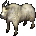

=== "Info"

    

    <table>
    <tr>
        <th>Spawn Locations</th>
        <td id="Goat_Spawn-Locations" colspan="3"></td>
    </tr>
    <tr>
        <th>Base Damage</th>
        <td id="Goat_Base-Damage"></td>
        <th>Armor Rating</th>
        <td id="Goat_Armor-Rating"></td>
    </tr>
    <tr>
        <th>Fame</th>
        <td id="Goat_Fame"></td>
        <th>Karma</th>
        <td id="Goat_Karma"></td>
    </tr>
    <tr>
        <th>Super Slayer</th>
        <td id="Goat_Super-Slayer"></td>
        <th>Minor Slayer</th>
        <td id="Goat_Minor-Slayer"></td>
    </tr>
    <tr>
        <th>Barding Difficulty</th>
        <td id="Goat_Barding-Difficulty"></td>
        <th>Taming Difficulty</th>
        <td id="Goat_Taming-Difficulty"></td>
    </tr>
    </table>
    

=== "Attributes"

    

    <table>
    <tr>
        <th>Hit Points</th>
        <td id="Goat_Hit-Points"></td>
        <th>Strength</th>
        <td id="Goat_Strength"></td>
    </tr>
    <tr>
        <th>Stamina</th>
        <td id="Goat_Stamina"></td>
        <th>Dexterity</th>
        <td id="Goat_Dexterity"></td>
    </tr>
    <tr>
        <th>Mana</th>
        <td id="Goat_Mana"></td>
        <th>Intelligence</th>
        <td id="Goat_Intelligence"></td>
    </tr>
    </table>
    

=== "Skills"

    

    <table>
    <tr>
        <th>Wrestling</th>
        <td id="Goat_Wrestling"></td>
        <th>Magery</th>
        <td id="Goat_Magery"></td>
    </tr>
    <tr>
        <th>Tactics</th>
        <td id="Goat_Tactics"></td>
        <th>Meditation</th>
        <td id="Goat_Meditation"></td>
    </tr>
    <tr>
        <th>Resisting Spells</th>
        <td id="Goat_Resisting-Spells"></td>
        <th>Evaluating Intelligence</th>
        <td id="Goat_Evaluating-Intelligence"></td>
    </tr>
    <tr>
        <th>Anatomy</th>
        <td id="Goat_Anatomy"></td>
        <th>Poisoning</th>
        <td id="Goat_Poisoning"></td>
    </tr>
    </table>
    

=== "Loot"

    

    <table>
    <tr>
        <th>Gold</th>
        <td id="Goat_Gold"></td>
    </tr>
    <tr>
        <th>Treasure Map lvl</th>
        <td id="Goat_Treasure-Map-lvl"></td>
    </tr>
        <tr>
        <th>Slayer Drop</th>
        <td id="Goat_Slayer-Drop"></td>
    </tr>
    </table>
    

### Golden Elemental

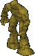

=== "Info"

    

    <table>
    <tr>
        <th>Spawn Locations</th>
        <td id="Golden-Elemental_Spawn-Locations" colspan="3"></td>
    </tr>
    <tr>
        <th>Base Damage</th>
        <td id="Golden-Elemental_Base-Damage"></td>
        <th>Armor Rating</th>
        <td id="Golden-Elemental_Armor-Rating"></td>
    </tr>
    <tr>
        <th>Fame</th>
        <td id="Golden-Elemental_Fame"></td>
        <th>Karma</th>
        <td id="Golden-Elemental_Karma"></td>
    </tr>
    <tr>
        <th>Super Slayer</th>
        <td id="Golden-Elemental_Super-Slayer"></td>
        <th>Minor Slayer</th>
        <td id="Golden-Elemental_Minor-Slayer"></td>
    </tr>
    <tr>
        <th>Barding Difficulty</th>
        <td id="Golden-Elemental_Barding-Difficulty"></td>
        <th>Taming Difficulty</th>
        <td id="Golden-Elemental_Taming-Difficulty"></td>
    </tr>
    </table>
    

=== "Attributes"

    

    <table>
    <tr>
        <th>Hit Points</th>
        <td id="Golden-Elemental_Hit-Points"></td>
        <th>Strength</th>
        <td id="Golden-Elemental_Strength"></td>
    </tr>
    <tr>
        <th>Stamina</th>
        <td id="Golden-Elemental_Stamina"></td>
        <th>Dexterity</th>
        <td id="Golden-Elemental_Dexterity"></td>
    </tr>
    <tr>
        <th>Mana</th>
        <td id="Golden-Elemental_Mana"></td>
        <th>Intelligence</th>
        <td id="Golden-Elemental_Intelligence"></td>
    </tr>
    </table>
    

=== "Skills"

    

    <table>
    <tr>
        <th>Wrestling</th>
        <td id="Golden-Elemental_Wrestling"></td>
        <th>Magery</th>
        <td id="Golden-Elemental_Magery"></td>
    </tr>
    <tr>
        <th>Tactics</th>
        <td id="Golden-Elemental_Tactics"></td>
        <th>Meditation</th>
        <td id="Golden-Elemental_Meditation"></td>
    </tr>
    <tr>
        <th>Resisting Spells</th>
        <td id="Golden-Elemental_Resisting-Spells"></td>
        <th>Evaluating Intelligence</th>
        <td id="Golden-Elemental_Evaluating-Intelligence"></td>
    </tr>
    <tr>
        <th>Anatomy</th>
        <td id="Golden-Elemental_Anatomy"></td>
        <th>Poisoning</th>
        <td id="Golden-Elemental_Poisoning"></td>
    </tr>
    </table>
    

=== "Loot"

    

    <table>
    <tr>
        <th>Gold</th>
        <td id="Golden-Elemental_Gold"></td>
    </tr>
    <tr>
        <th>Treasure Map lvl</th>
        <td id="Golden-Elemental_Treasure-Map-lvl"></td>
    </tr>
        <tr>
        <th>Slayer Drop</th>
        <td id="Golden-Elemental_Slayer-Drop"></td>
    </tr>
    </table>
    

### Gorilla

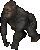

=== "Info"

    

    <table>
    <tr>
        <th>Spawn Locations</th>
        <td id="Gorilla_Spawn-Locations" colspan="3"></td>
    </tr>
    <tr>
        <th>Base Damage</th>
        <td id="Gorilla_Base-Damage"></td>
        <th>Armor Rating</th>
        <td id="Gorilla_Armor-Rating"></td>
    </tr>
    <tr>
        <th>Fame</th>
        <td id="Gorilla_Fame"></td>
        <th>Karma</th>
        <td id="Gorilla_Karma"></td>
    </tr>
    <tr>
        <th>Super Slayer</th>
        <td id="Gorilla_Super-Slayer"></td>
        <th>Minor Slayer</th>
        <td id="Gorilla_Minor-Slayer"></td>
    </tr>
    <tr>
        <th>Barding Difficulty</th>
        <td id="Gorilla_Barding-Difficulty"></td>
        <th>Taming Difficulty</th>
        <td id="Gorilla_Taming-Difficulty"></td>
    </tr>
    </table>
    

=== "Attributes"

    

    <table>
    <tr>
        <th>Hit Points</th>
        <td id="Gorilla_Hit-Points"></td>
        <th>Strength</th>
        <td id="Gorilla_Strength"></td>
    </tr>
    <tr>
        <th>Stamina</th>
        <td id="Gorilla_Stamina"></td>
        <th>Dexterity</th>
        <td id="Gorilla_Dexterity"></td>
    </tr>
    <tr>
        <th>Mana</th>
        <td id="Gorilla_Mana"></td>
        <th>Intelligence</th>
        <td id="Gorilla_Intelligence"></td>
    </tr>
    </table>
    

=== "Skills"

    

    <table>
    <tr>
        <th>Wrestling</th>
        <td id="Gorilla_Wrestling"></td>
        <th>Magery</th>
        <td id="Gorilla_Magery"></td>
    </tr>
    <tr>
        <th>Tactics</th>
        <td id="Gorilla_Tactics"></td>
        <th>Meditation</th>
        <td id="Gorilla_Meditation"></td>
    </tr>
    <tr>
        <th>Resisting Spells</th>
        <td id="Gorilla_Resisting-Spells"></td>
        <th>Evaluating Intelligence</th>
        <td id="Gorilla_Evaluating-Intelligence"></td>
    </tr>
    <tr>
        <th>Anatomy</th>
        <td id="Gorilla_Anatomy"></td>
        <th>Poisoning</th>
        <td id="Gorilla_Poisoning"></td>
    </tr>
    </table>
    

=== "Loot"

    

    <table>
    <tr>
        <th>Gold</th>
        <td id="Gorilla_Gold"></td>
    </tr>
    <tr>
        <th>Treasure Map lvl</th>
        <td id="Gorilla_Treasure-Map-lvl"></td>
    </tr>
        <tr>
        <th>Slayer Drop</th>
        <td id="Gorilla_Slayer-Drop"></td>
    </tr>
    </table>
    

### Great Hart

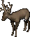

=== "Info"

    

    <table>
    <tr>
        <th>Spawn Locations</th>
        <td id="Great-Hart_Spawn-Locations" colspan="3"></td>
    </tr>
    <tr>
        <th>Base Damage</th>
        <td id="Great-Hart_Base-Damage"></td>
        <th>Armor Rating</th>
        <td id="Great-Hart_Armor-Rating"></td>
    </tr>
    <tr>
        <th>Fame</th>
        <td id="Great-Hart_Fame"></td>
        <th>Karma</th>
        <td id="Great-Hart_Karma"></td>
    </tr>
    <tr>
        <th>Super Slayer</th>
        <td id="Great-Hart_Super-Slayer"></td>
        <th>Minor Slayer</th>
        <td id="Great-Hart_Minor-Slayer"></td>
    </tr>
    <tr>
        <th>Barding Difficulty</th>
        <td id="Great-Hart_Barding-Difficulty"></td>
        <th>Taming Difficulty</th>
        <td id="Great-Hart_Taming-Difficulty"></td>
    </tr>
    </table>
    

=== "Attributes"

    

    <table>
    <tr>
        <th>Hit Points</th>
        <td id="Great-Hart_Hit-Points"></td>
        <th>Strength</th>
        <td id="Great-Hart_Strength"></td>
    </tr>
    <tr>
        <th>Stamina</th>
        <td id="Great-Hart_Stamina"></td>
        <th>Dexterity</th>
        <td id="Great-Hart_Dexterity"></td>
    </tr>
    <tr>
        <th>Mana</th>
        <td id="Great-Hart_Mana"></td>
        <th>Intelligence</th>
        <td id="Great-Hart_Intelligence"></td>
    </tr>
    </table>
    

=== "Skills"

    

    <table>
    <tr>
        <th>Wrestling</th>
        <td id="Great-Hart_Wrestling"></td>
        <th>Magery</th>
        <td id="Great-Hart_Magery"></td>
    </tr>
    <tr>
        <th>Tactics</th>
        <td id="Great-Hart_Tactics"></td>
        <th>Meditation</th>
        <td id="Great-Hart_Meditation"></td>
    </tr>
    <tr>
        <th>Resisting Spells</th>
        <td id="Great-Hart_Resisting-Spells"></td>
        <th>Evaluating Intelligence</th>
        <td id="Great-Hart_Evaluating-Intelligence"></td>
    </tr>
    <tr>
        <th>Anatomy</th>
        <td id="Great-Hart_Anatomy"></td>
        <th>Poisoning</th>
        <td id="Great-Hart_Poisoning"></td>
    </tr>
    </table>
    

=== "Loot"

    

    <table>
    <tr>
        <th>Gold</th>
        <td id="Great-Hart_Gold"></td>
    </tr>
    <tr>
        <th>Treasure Map lvl</th>
        <td id="Great-Hart_Treasure-Map-lvl"></td>
    </tr>
        <tr>
        <th>Slayer Drop</th>
        <td id="Great-Hart_Slayer-Drop"></td>
    </tr>
    </table>
    

### Greater Mongbat

=== "Info"

    

    <table>
    <tr>
        <th>Spawn Locations</th>
        <td id="Greater-Mongbat_Spawn-Locations" colspan="3"></td>
    </tr>
    <tr>
        <th>Base Damage</th>
        <td id="Greater-Mongbat_Base-Damage"></td>
        <th>Armor Rating</th>
        <td id="Greater-Mongbat_Armor-Rating"></td>
    </tr>
    <tr>
        <th>Fame</th>
        <td id="Greater-Mongbat_Fame"></td>
        <th>Karma</th>
        <td id="Greater-Mongbat_Karma"></td>
    </tr>
    <tr>
        <th>Super Slayer</th>
        <td id="Greater-Mongbat_Super-Slayer"></td>
        <th>Minor Slayer</th>
        <td id="Greater-Mongbat_Minor-Slayer"></td>
    </tr>
    <tr>
        <th>Barding Difficulty</th>
        <td id="Greater-Mongbat_Barding-Difficulty"></td>
        <th>Taming Difficulty</th>
        <td id="Greater-Mongbat_Taming-Difficulty"></td>
    </tr>
    </table>
    

=== "Attributes"

    

    <table>
    <tr>
        <th>Hit Points</th>
        <td id="Greater-Mongbat_Hit-Points"></td>
        <th>Strength</th>
        <td id="Greater-Mongbat_Strength"></td>
    </tr>
    <tr>
        <th>Stamina</th>
        <td id="Greater-Mongbat_Stamina"></td>
        <th>Dexterity</th>
        <td id="Greater-Mongbat_Dexterity"></td>
    </tr>
    <tr>
        <th>Mana</th>
        <td id="Greater-Mongbat_Mana"></td>
        <th>Intelligence</th>
        <td id="Greater-Mongbat_Intelligence"></td>
    </tr>
    </table>
    

=== "Skills"

    

    <table>
    <tr>
        <th>Wrestling</th>
        <td id="Greater-Mongbat_Wrestling"></td>
        <th>Magery</th>
        <td id="Greater-Mongbat_Magery"></td>
    </tr>
    <tr>
        <th>Tactics</th>
        <td id="Greater-Mongbat_Tactics"></td>
        <th>Meditation</th>
        <td id="Greater-Mongbat_Meditation"></td>
    </tr>
    <tr>
        <th>Resisting Spells</th>
        <td id="Greater-Mongbat_Resisting-Spells"></td>
        <th>Evaluating Intelligence</th>
        <td id="Greater-Mongbat_Evaluating-Intelligence"></td>
    </tr>
    <tr>
        <th>Anatomy</th>
        <td id="Greater-Mongbat_Anatomy"></td>
        <th>Poisoning</th>
        <td id="Greater-Mongbat_Poisoning"></td>
    </tr>
    </table>
    

=== "Loot"

    

    <table>
    <tr>
        <th>Gold</th>
        <td id="Greater-Mongbat_Gold"></td>
    </tr>
    <tr>
        <th>Treasure Map lvl</th>
        <td id="Greater-Mongbat_Treasure-Map-lvl"></td>
    </tr>
        <tr>
        <th>Slayer Drop</th>
        <td id="Greater-Mongbat_Slayer-Drop"></td>
    </tr>
    </table>
    

### Grey Wolf

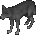

=== "Info"

    

    <table>
    <tr>
        <th>Spawn Locations</th>
        <td id="Grey-Wolf_Spawn-Locations" colspan="3"></td>
    </tr>
    <tr>
        <th>Base Damage</th>
        <td id="Grey-Wolf_Base-Damage"></td>
        <th>Armor Rating</th>
        <td id="Grey-Wolf_Armor-Rating"></td>
    </tr>
    <tr>
        <th>Fame</th>
        <td id="Grey-Wolf_Fame"></td>
        <th>Karma</th>
        <td id="Grey-Wolf_Karma"></td>
    </tr>
    <tr>
        <th>Super Slayer</th>
        <td id="Grey-Wolf_Super-Slayer"></td>
        <th>Minor Slayer</th>
        <td id="Grey-Wolf_Minor-Slayer"></td>
    </tr>
    <tr>
        <th>Barding Difficulty</th>
        <td id="Grey-Wolf_Barding-Difficulty"></td>
        <th>Taming Difficulty</th>
        <td id="Grey-Wolf_Taming-Difficulty"></td>
    </tr>
    </table>
    

=== "Attributes"

    

    <table>
    <tr>
        <th>Hit Points</th>
        <td id="Grey-Wolf_Hit-Points"></td>
        <th>Strength</th>
        <td id="Grey-Wolf_Strength"></td>
    </tr>
    <tr>
        <th>Stamina</th>
        <td id="Grey-Wolf_Stamina"></td>
        <th>Dexterity</th>
        <td id="Grey-Wolf_Dexterity"></td>
    </tr>
    <tr>
        <th>Mana</th>
        <td id="Grey-Wolf_Mana"></td>
        <th>Intelligence</th>
        <td id="Grey-Wolf_Intelligence"></td>
    </tr>
    </table>
    

=== "Skills"

    

    <table>
    <tr>
        <th>Wrestling</th>
        <td id="Grey-Wolf_Wrestling"></td>
        <th>Magery</th>
        <td id="Grey-Wolf_Magery"></td>
    </tr>
    <tr>
        <th>Tactics</th>
        <td id="Grey-Wolf_Tactics"></td>
        <th>Meditation</th>
        <td id="Grey-Wolf_Meditation"></td>
    </tr>
    <tr>
        <th>Resisting Spells</th>
        <td id="Grey-Wolf_Resisting-Spells"></td>
        <th>Evaluating Intelligence</th>
        <td id="Grey-Wolf_Evaluating-Intelligence"></td>
    </tr>
    <tr>
        <th>Anatomy</th>
        <td id="Grey-Wolf_Anatomy"></td>
        <th>Poisoning</th>
        <td id="Grey-Wolf_Poisoning"></td>
    </tr>
    </table>
    

=== "Loot"

    

    <table>
    <tr>
        <th>Gold</th>
        <td id="Grey-Wolf_Gold"></td>
    </tr>
    <tr>
        <th>Treasure Map lvl</th>
        <td id="Grey-Wolf_Treasure-Map-lvl"></td>
    </tr>
        <tr>
        <th>Slayer Drop</th>
        <td id="Grey-Wolf_Slayer-Drop"></td>
    </tr>
    </table>
    

### Grizzly Bear

=== "Info"

    

    <table>
    <tr>
        <th>Spawn Locations</th>
        <td id="Grizzly-Bear_Spawn-Locations" colspan="3"></td>
    </tr>
    <tr>
        <th>Base Damage</th>
        <td id="Grizzly-Bear_Base-Damage"></td>
        <th>Armor Rating</th>
        <td id="Grizzly-Bear_Armor-Rating"></td>
    </tr>
    <tr>
        <th>Fame</th>
        <td id="Grizzly-Bear_Fame"></td>
        <th>Karma</th>
        <td id="Grizzly-Bear_Karma"></td>
    </tr>
    <tr>
        <th>Super Slayer</th>
        <td id="Grizzly-Bear_Super-Slayer"></td>
        <th>Minor Slayer</th>
        <td id="Grizzly-Bear_Minor-Slayer"></td>
    </tr>
    <tr>
        <th>Barding Difficulty</th>
        <td id="Grizzly-Bear_Barding-Difficulty"></td>
        <th>Taming Difficulty</th>
        <td id="Grizzly-Bear_Taming-Difficulty"></td>
    </tr>
    </table>
    

=== "Attributes"

    

    <table>
    <tr>
        <th>Hit Points</th>
        <td id="Grizzly-Bear_Hit-Points"></td>
        <th>Strength</th>
        <td id="Grizzly-Bear_Strength"></td>
    </tr>
    <tr>
        <th>Stamina</th>
        <td id="Grizzly-Bear_Stamina"></td>
        <th>Dexterity</th>
        <td id="Grizzly-Bear_Dexterity"></td>
    </tr>
    <tr>
        <th>Mana</th>
        <td id="Grizzly-Bear_Mana"></td>
        <th>Intelligence</th>
        <td id="Grizzly-Bear_Intelligence"></td>
    </tr>
    </table>
    

=== "Skills"

    

    <table>
    <tr>
        <th>Wrestling</th>
        <td id="Grizzly-Bear_Wrestling"></td>
        <th>Magery</th>
        <td id="Grizzly-Bear_Magery"></td>
    </tr>
    <tr>
        <th>Tactics</th>
        <td id="Grizzly-Bear_Tactics"></td>
        <th>Meditation</th>
        <td id="Grizzly-Bear_Meditation"></td>
    </tr>
    <tr>
        <th>Resisting Spells</th>
        <td id="Grizzly-Bear_Resisting-Spells"></td>
        <th>Evaluating Intelligence</th>
        <td id="Grizzly-Bear_Evaluating-Intelligence"></td>
    </tr>
    <tr>
        <th>Anatomy</th>
        <td id="Grizzly-Bear_Anatomy"></td>
        <th>Poisoning</th>
        <td id="Grizzly-Bear_Poisoning"></td>
    </tr>
    </table>
    

=== "Loot"

    

    <table>
    <tr>
        <th>Gold</th>
        <td id="Grizzly-Bear_Gold"></td>
    </tr>
    <tr>
        <th>Treasure Map lvl</th>
        <td id="Grizzly-Bear_Treasure-Map-lvl"></td>
    </tr>
        <tr>
        <th>Slayer Drop</th>
        <td id="Grizzly-Bear_Slayer-Drop"></td>
    </tr>
    </table>
    

### Harpy

=== "Info"

    

    <table>
    <tr>
        <th>Spawn Locations</th>
        <td id="Harpy_Spawn-Locations" colspan="3"></td>
    </tr>
    <tr>
        <th>Base Damage</th>
        <td id="Harpy_Base-Damage"></td>
        <th>Armor Rating</th>
        <td id="Harpy_Armor-Rating"></td>
    </tr>
    <tr>
        <th>Fame</th>
        <td id="Harpy_Fame"></td>
        <th>Karma</th>
        <td id="Harpy_Karma"></td>
    </tr>
    <tr>
        <th>Super Slayer</th>
        <td id="Harpy_Super-Slayer"></td>
        <th>Minor Slayer</th>
        <td id="Harpy_Minor-Slayer"></td>
    </tr>
    <tr>
        <th>Barding Difficulty</th>
        <td id="Harpy_Barding-Difficulty"></td>
        <th>Taming Difficulty</th>
        <td id="Harpy_Taming-Difficulty"></td>
    </tr>
    </table>
    

=== "Attributes"

    

    <table>
    <tr>
        <th>Hit Points</th>
        <td id="Harpy_Hit-Points"></td>
        <th>Strength</th>
        <td id="Harpy_Strength"></td>
    </tr>
    <tr>
        <th>Stamina</th>
        <td id="Harpy_Stamina"></td>
        <th>Dexterity</th>
        <td id="Harpy_Dexterity"></td>
    </tr>
    <tr>
        <th>Mana</th>
        <td id="Harpy_Mana"></td>
        <th>Intelligence</th>
        <td id="Harpy_Intelligence"></td>
    </tr>
    </table>
    

=== "Skills"

    

    <table>
    <tr>
        <th>Wrestling</th>
        <td id="Harpy_Wrestling"></td>
        <th>Magery</th>
        <td id="Harpy_Magery"></td>
    </tr>
    <tr>
        <th>Tactics</th>
        <td id="Harpy_Tactics"></td>
        <th>Meditation</th>
        <td id="Harpy_Meditation"></td>
    </tr>
    <tr>
        <th>Resisting Spells</th>
        <td id="Harpy_Resisting-Spells"></td>
        <th>Evaluating Intelligence</th>
        <td id="Harpy_Evaluating-Intelligence"></td>
    </tr>
    <tr>
        <th>Anatomy</th>
        <td id="Harpy_Anatomy"></td>
        <th>Poisoning</th>
        <td id="Harpy_Poisoning"></td>
    </tr>
    </table>
    

=== "Loot"

    

    <table>
    <tr>
        <th>Gold</th>
        <td id="Harpy_Gold"></td>
    </tr>
    <tr>
        <th>Treasure Map lvl</th>
        <td id="Harpy_Treasure-Map-lvl"></td>
    </tr>
        <tr>
        <th>Slayer Drop</th>
        <td id="Harpy_Slayer-Drop"></td>
    </tr>
    </table>
    

### Headless One

=== "Info"

    

    <table>
    <tr>
        <th>Spawn Locations</th>
        <td id="Headless-One_Spawn-Locations" colspan="3"></td>
    </tr>
    <tr>
        <th>Base Damage</th>
        <td id="Headless-One_Base-Damage"></td>
        <th>Armor Rating</th>
        <td id="Headless-One_Armor-Rating"></td>
    </tr>
    <tr>
        <th>Fame</th>
        <td id="Headless-One_Fame"></td>
        <th>Karma</th>
        <td id="Headless-One_Karma"></td>
    </tr>
    <tr>
        <th>Super Slayer</th>
        <td id="Headless-One_Super-Slayer"></td>
        <th>Minor Slayer</th>
        <td id="Headless-One_Minor-Slayer"></td>
    </tr>
    <tr>
        <th>Barding Difficulty</th>
        <td id="Headless-One_Barding-Difficulty"></td>
        <th>Taming Difficulty</th>
        <td id="Headless-One_Taming-Difficulty"></td>
    </tr>
    </table>
    

=== "Attributes"

    

    <table>
    <tr>
        <th>Hit Points</th>
        <td id="Headless-One_Hit-Points"></td>
        <th>Strength</th>
        <td id="Headless-One_Strength"></td>
    </tr>
    <tr>
        <th>Stamina</th>
        <td id="Headless-One_Stamina"></td>
        <th>Dexterity</th>
        <td id="Headless-One_Dexterity"></td>
    </tr>
    <tr>
        <th>Mana</th>
        <td id="Headless-One_Mana"></td>
        <th>Intelligence</th>
        <td id="Headless-One_Intelligence"></td>
    </tr>
    </table>
    

=== "Skills"

    

    <table>
    <tr>
        <th>Wrestling</th>
        <td id="Headless-One_Wrestling"></td>
        <th>Magery</th>
        <td id="Headless-One_Magery"></td>
    </tr>
    <tr>
        <th>Tactics</th>
        <td id="Headless-One_Tactics"></td>
        <th>Meditation</th>
        <td id="Headless-One_Meditation"></td>
    </tr>
    <tr>
        <th>Resisting Spells</th>
        <td id="Headless-One_Resisting-Spells"></td>
        <th>Evaluating Intelligence</th>
        <td id="Headless-One_Evaluating-Intelligence"></td>
    </tr>
    <tr>
        <th>Anatomy</th>
        <td id="Headless-One_Anatomy"></td>
        <th>Poisoning</th>
        <td id="Headless-One_Poisoning"></td>
    </tr>
    </table>
    

=== "Loot"

    

    <table>
    <tr>
        <th>Gold</th>
        <td id="Headless-One_Gold"></td>
    </tr>
    <tr>
        <th>Treasure Map lvl</th>
        <td id="Headless-One_Treasure-Map-lvl"></td>
    </tr>
        <tr>
        <th>Slayer Drop</th>
        <td id="Headless-One_Slayer-Drop"></td>
    </tr>
    </table>
    

### Hell Cat

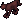

=== "Info"

    

    <table>
    <tr>
        <th>Spawn Locations</th>
        <td id="Hell-Cat_Spawn-Locations" colspan="3"></td>
    </tr>
    <tr>
        <th>Base Damage</th>
        <td id="Hell-Cat_Base-Damage"></td>
        <th>Armor Rating</th>
        <td id="Hell-Cat_Armor-Rating"></td>
    </tr>
    <tr>
        <th>Fame</th>
        <td id="Hell-Cat_Fame"></td>
        <th>Karma</th>
        <td id="Hell-Cat_Karma"></td>
    </tr>
    <tr>
        <th>Super Slayer</th>
        <td id="Hell-Cat_Super-Slayer"></td>
        <th>Minor Slayer</th>
        <td id="Hell-Cat_Minor-Slayer"></td>
    </tr>
    <tr>
        <th>Barding Difficulty</th>
        <td id="Hell-Cat_Barding-Difficulty"></td>
        <th>Taming Difficulty</th>
        <td id="Hell-Cat_Taming-Difficulty"></td>
    </tr>
    </table>
    

=== "Attributes"

    

    <table>
    <tr>
        <th>Hit Points</th>
        <td id="Hell-Cat_Hit-Points"></td>
        <th>Strength</th>
        <td id="Hell-Cat_Strength"></td>
    </tr>
    <tr>
        <th>Stamina</th>
        <td id="Hell-Cat_Stamina"></td>
        <th>Dexterity</th>
        <td id="Hell-Cat_Dexterity"></td>
    </tr>
    <tr>
        <th>Mana</th>
        <td id="Hell-Cat_Mana"></td>
        <th>Intelligence</th>
        <td id="Hell-Cat_Intelligence"></td>
    </tr>
    </table>
    

=== "Skills"

    

    <table>
    <tr>
        <th>Wrestling</th>
        <td id="Hell-Cat_Wrestling"></td>
        <th>Magery</th>
        <td id="Hell-Cat_Magery"></td>
    </tr>
    <tr>
        <th>Tactics</th>
        <td id="Hell-Cat_Tactics"></td>
        <th>Meditation</th>
        <td id="Hell-Cat_Meditation"></td>
    </tr>
    <tr>
        <th>Resisting Spells</th>
        <td id="Hell-Cat_Resisting-Spells"></td>
        <th>Evaluating Intelligence</th>
        <td id="Hell-Cat_Evaluating-Intelligence"></td>
    </tr>
    <tr>
        <th>Anatomy</th>
        <td id="Hell-Cat_Anatomy"></td>
        <th>Poisoning</th>
        <td id="Hell-Cat_Poisoning"></td>
    </tr>
    </table>
    

=== "Loot"

    

    <table>
    <tr>
        <th>Gold</th>
        <td id="Hell-Cat_Gold"></td>
    </tr>
    <tr>
        <th>Treasure Map lvl</th>
        <td id="Hell-Cat_Treasure-Map-lvl"></td>
    </tr>
        <tr>
        <th>Slayer Drop</th>
        <td id="Hell-Cat_Slayer-Drop"></td>
    </tr>
    </table>
    

### Hell Hound

=== "Info"

    

    <table>
    <tr>
        <th>Spawn Locations</th>
        <td id="Hell-Hound_Spawn-Locations" colspan="3"></td>
    </tr>
    <tr>
        <th>Base Damage</th>
        <td id="Hell-Hound_Base-Damage"></td>
        <th>Armor Rating</th>
        <td id="Hell-Hound_Armor-Rating"></td>
    </tr>
    <tr>
        <th>Fame</th>
        <td id="Hell-Hound_Fame"></td>
        <th>Karma</th>
        <td id="Hell-Hound_Karma"></td>
    </tr>
    <tr>
        <th>Super Slayer</th>
        <td id="Hell-Hound_Super-Slayer"></td>
        <th>Minor Slayer</th>
        <td id="Hell-Hound_Minor-Slayer"></td>
    </tr>
    <tr>
        <th>Barding Difficulty</th>
        <td id="Hell-Hound_Barding-Difficulty"></td>
        <th>Taming Difficulty</th>
        <td id="Hell-Hound_Taming-Difficulty"></td>
    </tr>
    </table>
    

=== "Attributes"

    

    <table>
    <tr>
        <th>Hit Points</th>
        <td id="Hell-Hound_Hit-Points"></td>
        <th>Strength</th>
        <td id="Hell-Hound_Strength"></td>
    </tr>
    <tr>
        <th>Stamina</th>
        <td id="Hell-Hound_Stamina"></td>
        <th>Dexterity</th>
        <td id="Hell-Hound_Dexterity"></td>
    </tr>
    <tr>
        <th>Mana</th>
        <td id="Hell-Hound_Mana"></td>
        <th>Intelligence</th>
        <td id="Hell-Hound_Intelligence"></td>
    </tr>
    </table>
    

=== "Skills"

    

    <table>
    <tr>
        <th>Wrestling</th>
        <td id="Hell-Hound_Wrestling"></td>
        <th>Magery</th>
        <td id="Hell-Hound_Magery"></td>
    </tr>
    <tr>
        <th>Tactics</th>
        <td id="Hell-Hound_Tactics"></td>
        <th>Meditation</th>
        <td id="Hell-Hound_Meditation"></td>
    </tr>
    <tr>
        <th>Resisting Spells</th>
        <td id="Hell-Hound_Resisting-Spells"></td>
        <th>Evaluating Intelligence</th>
        <td id="Hell-Hound_Evaluating-Intelligence"></td>
    </tr>
    <tr>
        <th>Anatomy</th>
        <td id="Hell-Hound_Anatomy"></td>
        <th>Poisoning</th>
        <td id="Hell-Hound_Poisoning"></td>
    </tr>
    </table>
    

=== "Loot"

    

    <table>
    <tr>
        <th>Gold</th>
        <td id="Hell-Hound_Gold"></td>
    </tr>
    <tr>
        <th>Treasure Map lvl</th>
        <td id="Hell-Hound_Treasure-Map-lvl"></td>
    </tr>
        <tr>
        <th>Slayer Drop</th>
        <td id="Hell-Hound_Slayer-Drop"></td>
    </tr>
    </table>
    

### Hind

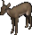

=== "Info"

    

    <table>
    <tr>
        <th>Spawn Locations</th>
        <td id="Hind_Spawn-Locations" colspan="3"></td>
    </tr>
    <tr>
        <th>Base Damage</th>
        <td id="Hind_Base-Damage"></td>
        <th>Armor Rating</th>
        <td id="Hind_Armor-Rating"></td>
    </tr>
    <tr>
        <th>Fame</th>
        <td id="Hind_Fame"></td>
        <th>Karma</th>
        <td id="Hind_Karma"></td>
    </tr>
    <tr>
        <th>Super Slayer</th>
        <td id="Hind_Super-Slayer"></td>
        <th>Minor Slayer</th>
        <td id="Hind_Minor-Slayer"></td>
    </tr>
    <tr>
        <th>Barding Difficulty</th>
        <td id="Hind_Barding-Difficulty"></td>
        <th>Taming Difficulty</th>
        <td id="Hind_Taming-Difficulty"></td>
    </tr>
    </table>
    

=== "Attributes"

    

    <table>
    <tr>
        <th>Hit Points</th>
        <td id="Hind_Hit-Points"></td>
        <th>Strength</th>
        <td id="Hind_Strength"></td>
    </tr>
    <tr>
        <th>Stamina</th>
        <td id="Hind_Stamina"></td>
        <th>Dexterity</th>
        <td id="Hind_Dexterity"></td>
    </tr>
    <tr>
        <th>Mana</th>
        <td id="Hind_Mana"></td>
        <th>Intelligence</th>
        <td id="Hind_Intelligence"></td>
    </tr>
    </table>
    

=== "Skills"

    

    <table>
    <tr>
        <th>Wrestling</th>
        <td id="Hind_Wrestling"></td>
        <th>Magery</th>
        <td id="Hind_Magery"></td>
    </tr>
    <tr>
        <th>Tactics</th>
        <td id="Hind_Tactics"></td>
        <th>Meditation</th>
        <td id="Hind_Meditation"></td>
    </tr>
    <tr>
        <th>Resisting Spells</th>
        <td id="Hind_Resisting-Spells"></td>
        <th>Evaluating Intelligence</th>
        <td id="Hind_Evaluating-Intelligence"></td>
    </tr>
    <tr>
        <th>Anatomy</th>
        <td id="Hind_Anatomy"></td>
        <th>Poisoning</th>
        <td id="Hind_Poisoning"></td>
    </tr>
    </table>
    

=== "Loot"

    

    <table>
    <tr>
        <th>Gold</th>
        <td id="Hind_Gold"></td>
    </tr>
    <tr>
        <th>Treasure Map lvl</th>
        <td id="Hind_Treasure-Map-lvl"></td>
    </tr>
        <tr>
        <th>Slayer Drop</th>
        <td id="Hind_Slayer-Drop"></td>
    </tr>
    </table>
    

### Horse

=== "Info"

    

    <table>
    <tr>
        <th>Spawn Locations</th>
        <td id="Horse_Spawn-Locations" colspan="3"></td>
    </tr>
    <tr>
        <th>Base Damage</th>
        <td id="Horse_Base-Damage"></td>
        <th>Armor Rating</th>
        <td id="Horse_Armor-Rating"></td>
    </tr>
    <tr>
        <th>Fame</th>
        <td id="Horse_Fame"></td>
        <th>Karma</th>
        <td id="Horse_Karma"></td>
    </tr>
    <tr>
        <th>Super Slayer</th>
        <td id="Horse_Super-Slayer"></td>
        <th>Minor Slayer</th>
        <td id="Horse_Minor-Slayer"></td>
    </tr>
    <tr>
        <th>Barding Difficulty</th>
        <td id="Horse_Barding-Difficulty"></td>
        <th>Taming Difficulty</th>
        <td id="Horse_Taming-Difficulty"></td>
    </tr>
    </table>
    

=== "Attributes"

    

    <table>
    <tr>
        <th>Hit Points</th>
        <td id="Horse_Hit-Points"></td>
        <th>Strength</th>
        <td id="Horse_Strength"></td>
    </tr>
    <tr>
        <th>Stamina</th>
        <td id="Horse_Stamina"></td>
        <th>Dexterity</th>
        <td id="Horse_Dexterity"></td>
    </tr>
    <tr>
        <th>Mana</th>
        <td id="Horse_Mana"></td>
        <th>Intelligence</th>
        <td id="Horse_Intelligence"></td>
    </tr>
    </table>
    

=== "Skills"

    

    <table>
    <tr>
        <th>Wrestling</th>
        <td id="Horse_Wrestling"></td>
        <th>Magery</th>
        <td id="Horse_Magery"></td>
    </tr>
    <tr>
        <th>Tactics</th>
        <td id="Horse_Tactics"></td>
        <th>Meditation</th>
        <td id="Horse_Meditation"></td>
    </tr>
    <tr>
        <th>Resisting Spells</th>
        <td id="Horse_Resisting-Spells"></td>
        <th>Evaluating Intelligence</th>
        <td id="Horse_Evaluating-Intelligence"></td>
    </tr>
    <tr>
        <th>Anatomy</th>
        <td id="Horse_Anatomy"></td>
        <th>Poisoning</th>
        <td id="Horse_Poisoning"></td>
    </tr>
    </table>
    

=== "Loot"

    

    <table>
    <tr>
        <th>Gold</th>
        <td id="Horse_Gold"></td>
    </tr>
    <tr>
        <th>Treasure Map lvl</th>
        <td id="Horse_Treasure-Map-lvl"></td>
    </tr>
        <tr>
        <th>Slayer Drop</th>
        <td id="Horse_Slayer-Drop"></td>
    </tr>
    </table>
    

### Ice Elemental

=== "Info"

    

    <table>
    <tr>
        <th>Spawn Locations</th>
        <td id="Ice-Elemental_Spawn-Locations" colspan="3"></td>
    </tr>
    <tr>
        <th>Base Damage</th>
        <td id="Ice-Elemental_Base-Damage"></td>
        <th>Armor Rating</th>
        <td id="Ice-Elemental_Armor-Rating"></td>
    </tr>
    <tr>
        <th>Fame</th>
        <td id="Ice-Elemental_Fame"></td>
        <th>Karma</th>
        <td id="Ice-Elemental_Karma"></td>
    </tr>
    <tr>
        <th>Super Slayer</th>
        <td id="Ice-Elemental_Super-Slayer"></td>
        <th>Minor Slayer</th>
        <td id="Ice-Elemental_Minor-Slayer"></td>
    </tr>
    <tr>
        <th>Barding Difficulty</th>
        <td id="Ice-Elemental_Barding-Difficulty"></td>
        <th>Taming Difficulty</th>
        <td id="Ice-Elemental_Taming-Difficulty"></td>
    </tr>
    </table>
    

=== "Attributes"

    

    <table>
    <tr>
        <th>Hit Points</th>
        <td id="Ice-Elemental_Hit-Points"></td>
        <th>Strength</th>
        <td id="Ice-Elemental_Strength"></td>
    </tr>
    <tr>
        <th>Stamina</th>
        <td id="Ice-Elemental_Stamina"></td>
        <th>Dexterity</th>
        <td id="Ice-Elemental_Dexterity"></td>
    </tr>
    <tr>
        <th>Mana</th>
        <td id="Ice-Elemental_Mana"></td>
        <th>Intelligence</th>
        <td id="Ice-Elemental_Intelligence"></td>
    </tr>
    </table>
    

=== "Skills"

    

    <table>
    <tr>
        <th>Wrestling</th>
        <td id="Ice-Elemental_Wrestling"></td>
        <th>Magery</th>
        <td id="Ice-Elemental_Magery"></td>
    </tr>
    <tr>
        <th>Tactics</th>
        <td id="Ice-Elemental_Tactics"></td>
        <th>Meditation</th>
        <td id="Ice-Elemental_Meditation"></td>
    </tr>
    <tr>
        <th>Resisting Spells</th>
        <td id="Ice-Elemental_Resisting-Spells"></td>
        <th>Evaluating Intelligence</th>
        <td id="Ice-Elemental_Evaluating-Intelligence"></td>
    </tr>
    <tr>
        <th>Anatomy</th>
        <td id="Ice-Elemental_Anatomy"></td>
        <th>Poisoning</th>
        <td id="Ice-Elemental_Poisoning"></td>
    </tr>
    </table>
    

=== "Loot"

    

    <table>
    <tr>
        <th>Gold</th>
        <td id="Ice-Elemental_Gold"></td>
    </tr>
    <tr>
        <th>Treasure Map lvl</th>
        <td id="Ice-Elemental_Treasure-Map-lvl"></td>
    </tr>
        <tr>
        <th>Slayer Drop</th>
        <td id="Ice-Elemental_Slayer-Drop"></td>
    </tr>
    </table>
    

### Ice Fiend

=== "Info"

    

    <table>
    <tr>
        <th>Spawn Locations</th>
        <td id="Ice-Fiend_Spawn-Locations" colspan="3"></td>
    </tr>
    <tr>
        <th>Base Damage</th>
        <td id="Ice-Fiend_Base-Damage"></td>
        <th>Armor Rating</th>
        <td id="Ice-Fiend_Armor-Rating"></td>
    </tr>
    <tr>
        <th>Fame</th>
        <td id="Ice-Fiend_Fame"></td>
        <th>Karma</th>
        <td id="Ice-Fiend_Karma"></td>
    </tr>
    <tr>
        <th>Super Slayer</th>
        <td id="Ice-Fiend_Super-Slayer"></td>
        <th>Minor Slayer</th>
        <td id="Ice-Fiend_Minor-Slayer"></td>
    </tr>
    <tr>
        <th>Barding Difficulty</th>
        <td id="Ice-Fiend_Barding-Difficulty"></td>
        <th>Taming Difficulty</th>
        <td id="Ice-Fiend_Taming-Difficulty"></td>
    </tr>
    </table>
    

=== "Attributes"

    

    <table>
    <tr>
        <th>Hit Points</th>
        <td id="Ice-Fiend_Hit-Points"></td>
        <th>Strength</th>
        <td id="Ice-Fiend_Strength"></td>
    </tr>
    <tr>
        <th>Stamina</th>
        <td id="Ice-Fiend_Stamina"></td>
        <th>Dexterity</th>
        <td id="Ice-Fiend_Dexterity"></td>
    </tr>
    <tr>
        <th>Mana</th>
        <td id="Ice-Fiend_Mana"></td>
        <th>Intelligence</th>
        <td id="Ice-Fiend_Intelligence"></td>
    </tr>
    </table>
    

=== "Skills"

    

    <table>
    <tr>
        <th>Wrestling</th>
        <td id="Ice-Fiend_Wrestling"></td>
        <th>Magery</th>
        <td id="Ice-Fiend_Magery"></td>
    </tr>
    <tr>
        <th>Tactics</th>
        <td id="Ice-Fiend_Tactics"></td>
        <th>Meditation</th>
        <td id="Ice-Fiend_Meditation"></td>
    </tr>
    <tr>
        <th>Resisting Spells</th>
        <td id="Ice-Fiend_Resisting-Spells"></td>
        <th>Evaluating Intelligence</th>
        <td id="Ice-Fiend_Evaluating-Intelligence"></td>
    </tr>
    <tr>
        <th>Anatomy</th>
        <td id="Ice-Fiend_Anatomy"></td>
        <th>Poisoning</th>
        <td id="Ice-Fiend_Poisoning"></td>
    </tr>
    </table>
    

=== "Loot"

    

    <table>
    <tr>
        <th>Gold</th>
        <td id="Ice-Fiend_Gold"></td>
    </tr>
    <tr>
        <th>Treasure Map lvl</th>
        <td id="Ice-Fiend_Treasure-Map-lvl"></td>
    </tr>
        <tr>
        <th>Slayer Drop</th>
        <td id="Ice-Fiend_Slayer-Drop"></td>
    </tr>
    </table>
    

### Ice Snake

=== "Info"

    

    <table>
    <tr>
        <th>Spawn Locations</th>
        <td id="Ice-Snake_Spawn-Locations" colspan="3"></td>
    </tr>
    <tr>
        <th>Base Damage</th>
        <td id="Ice-Snake_Base-Damage"></td>
        <th>Armor Rating</th>
        <td id="Ice-Snake_Armor-Rating"></td>
    </tr>
    <tr>
        <th>Fame</th>
        <td id="Ice-Snake_Fame"></td>
        <th>Karma</th>
        <td id="Ice-Snake_Karma"></td>
    </tr>
    <tr>
        <th>Super Slayer</th>
        <td id="Ice-Snake_Super-Slayer"></td>
        <th>Minor Slayer</th>
        <td id="Ice-Snake_Minor-Slayer"></td>
    </tr>
    <tr>
        <th>Barding Difficulty</th>
        <td id="Ice-Snake_Barding-Difficulty"></td>
        <th>Taming Difficulty</th>
        <td id="Ice-Snake_Taming-Difficulty"></td>
    </tr>
    </table>
    

=== "Attributes"

    

    <table>
    <tr>
        <th>Hit Points</th>
        <td id="Ice-Snake_Hit-Points"></td>
        <th>Strength</th>
        <td id="Ice-Snake_Strength"></td>
    </tr>
    <tr>
        <th>Stamina</th>
        <td id="Ice-Snake_Stamina"></td>
        <th>Dexterity</th>
        <td id="Ice-Snake_Dexterity"></td>
    </tr>
    <tr>
        <th>Mana</th>
        <td id="Ice-Snake_Mana"></td>
        <th>Intelligence</th>
        <td id="Ice-Snake_Intelligence"></td>
    </tr>
    </table>
    

=== "Skills"

    

    <table>
    <tr>
        <th>Wrestling</th>
        <td id="Ice-Snake_Wrestling"></td>
        <th>Magery</th>
        <td id="Ice-Snake_Magery"></td>
    </tr>
    <tr>
        <th>Tactics</th>
        <td id="Ice-Snake_Tactics"></td>
        <th>Meditation</th>
        <td id="Ice-Snake_Meditation"></td>
    </tr>
    <tr>
        <th>Resisting Spells</th>
        <td id="Ice-Snake_Resisting-Spells"></td>
        <th>Evaluating Intelligence</th>
        <td id="Ice-Snake_Evaluating-Intelligence"></td>
    </tr>
    <tr>
        <th>Anatomy</th>
        <td id="Ice-Snake_Anatomy"></td>
        <th>Poisoning</th>
        <td id="Ice-Snake_Poisoning"></td>
    </tr>
    </table>
    

=== "Loot"

    

    <table>
    <tr>
        <th>Gold</th>
        <td id="Ice-Snake_Gold"></td>
    </tr>
    <tr>
        <th>Treasure Map lvl</th>
        <td id="Ice-Snake_Treasure-Map-lvl"></td>
    </tr>
        <tr>
        <th>Slayer Drop</th>
        <td id="Ice-Snake_Slayer-Drop"></td>
    </tr>
    </table>
    

### Imp

=== "Info"

    

    <table>
    <tr>
        <th>Spawn Locations</th>
        <td id="Imp_Spawn-Locations" colspan="3"></td>
    </tr>
    <tr>
        <th>Base Damage</th>
        <td id="Imp_Base-Damage"></td>
        <th>Armor Rating</th>
        <td id="Imp_Armor-Rating"></td>
    </tr>
    <tr>
        <th>Fame</th>
        <td id="Imp_Fame"></td>
        <th>Karma</th>
        <td id="Imp_Karma"></td>
    </tr>
    <tr>
        <th>Super Slayer</th>
        <td id="Imp_Super-Slayer"></td>
        <th>Minor Slayer</th>
        <td id="Imp_Minor-Slayer"></td>
    </tr>
    <tr>
        <th>Barding Difficulty</th>
        <td id="Imp_Barding-Difficulty"></td>
        <th>Taming Difficulty</th>
        <td id="Imp_Taming-Difficulty"></td>
    </tr>
    </table>
    

=== "Attributes"

    

    <table>
    <tr>
        <th>Hit Points</th>
        <td id="Imp_Hit-Points"></td>
        <th>Strength</th>
        <td id="Imp_Strength"></td>
    </tr>
    <tr>
        <th>Stamina</th>
        <td id="Imp_Stamina"></td>
        <th>Dexterity</th>
        <td id="Imp_Dexterity"></td>
    </tr>
    <tr>
        <th>Mana</th>
        <td id="Imp_Mana"></td>
        <th>Intelligence</th>
        <td id="Imp_Intelligence"></td>
    </tr>
    </table>
    

=== "Skills"

    

    <table>
    <tr>
        <th>Wrestling</th>
        <td id="Imp_Wrestling"></td>
        <th>Magery</th>
        <td id="Imp_Magery"></td>
    </tr>
    <tr>
        <th>Tactics</th>
        <td id="Imp_Tactics"></td>
        <th>Meditation</th>
        <td id="Imp_Meditation"></td>
    </tr>
    <tr>
        <th>Resisting Spells</th>
        <td id="Imp_Resisting-Spells"></td>
        <th>Evaluating Intelligence</th>
        <td id="Imp_Evaluating-Intelligence"></td>
    </tr>
    <tr>
        <th>Anatomy</th>
        <td id="Imp_Anatomy"></td>
        <th>Poisoning</th>
        <td id="Imp_Poisoning"></td>
    </tr>
    </table>
    

=== "Loot"

    

    <table>
    <tr>
        <th>Gold</th>
        <td id="Imp_Gold"></td>
    </tr>
    <tr>
        <th>Treasure Map lvl</th>
        <td id="Imp_Treasure-Map-lvl"></td>
    </tr>
        <tr>
        <th>Slayer Drop</th>
        <td id="Imp_Slayer-Drop"></td>
    </tr>
    </table>
    

### Jack Rabbit

=== "Info"

    

    <table>
    <tr>
        <th>Spawn Locations</th>
        <td id="Jack-Rabbit_Spawn-Locations" colspan="3"></td>
    </tr>
    <tr>
        <th>Base Damage</th>
        <td id="Jack-Rabbit_Base-Damage"></td>
        <th>Armor Rating</th>
        <td id="Jack-Rabbit_Armor-Rating"></td>
    </tr>
    <tr>
        <th>Fame</th>
        <td id="Jack-Rabbit_Fame"></td>
        <th>Karma</th>
        <td id="Jack-Rabbit_Karma"></td>
    </tr>
    <tr>
        <th>Super Slayer</th>
        <td id="Jack-Rabbit_Super-Slayer"></td>
        <th>Minor Slayer</th>
        <td id="Jack-Rabbit_Minor-Slayer"></td>
    </tr>
    <tr>
        <th>Barding Difficulty</th>
        <td id="Jack-Rabbit_Barding-Difficulty"></td>
        <th>Taming Difficulty</th>
        <td id="Jack-Rabbit_Taming-Difficulty"></td>
    </tr>
    </table>
    

=== "Attributes"

    

    <table>
    <tr>
        <th>Hit Points</th>
        <td id="Jack-Rabbit_Hit-Points"></td>
        <th>Strength</th>
        <td id="Jack-Rabbit_Strength"></td>
    </tr>
    <tr>
        <th>Stamina</th>
        <td id="Jack-Rabbit_Stamina"></td>
        <th>Dexterity</th>
        <td id="Jack-Rabbit_Dexterity"></td>
    </tr>
    <tr>
        <th>Mana</th>
        <td id="Jack-Rabbit_Mana"></td>
        <th>Intelligence</th>
        <td id="Jack-Rabbit_Intelligence"></td>
    </tr>
    </table>
    

=== "Skills"

    

    <table>
    <tr>
        <th>Wrestling</th>
        <td id="Jack-Rabbit_Wrestling"></td>
        <th>Magery</th>
        <td id="Jack-Rabbit_Magery"></td>
    </tr>
    <tr>
        <th>Tactics</th>
        <td id="Jack-Rabbit_Tactics"></td>
        <th>Meditation</th>
        <td id="Jack-Rabbit_Meditation"></td>
    </tr>
    <tr>
        <th>Resisting Spells</th>
        <td id="Jack-Rabbit_Resisting-Spells"></td>
        <th>Evaluating Intelligence</th>
        <td id="Jack-Rabbit_Evaluating-Intelligence"></td>
    </tr>
    <tr>
        <th>Anatomy</th>
        <td id="Jack-Rabbit_Anatomy"></td>
        <th>Poisoning</th>
        <td id="Jack-Rabbit_Poisoning"></td>
    </tr>
    </table>
    

=== "Loot"

    

    <table>
    <tr>
        <th>Gold</th>
        <td id="Jack-Rabbit_Gold"></td>
    </tr>
    <tr>
        <th>Treasure Map lvl</th>
        <td id="Jack-Rabbit_Treasure-Map-lvl"></td>
    </tr>
        <tr>
        <th>Slayer Drop</th>
        <td id="Jack-Rabbit_Slayer-Drop"></td>
    </tr>
    </table>
    

### Ki-rin

=== "Info"

    

    <table>
    <tr>
        <th>Spawn Locations</th>
        <td id="Ki-rin_Spawn-Locations" colspan="3"></td>
    </tr>
    <tr>
        <th>Base Damage</th>
        <td id="Ki-rin_Base-Damage"></td>
        <th>Armor Rating</th>
        <td id="Ki-rin_Armor-Rating"></td>
    </tr>
    <tr>
        <th>Fame</th>
        <td id="Ki-rin_Fame"></td>
        <th>Karma</th>
        <td id="Ki-rin_Karma"></td>
    </tr>
    <tr>
        <th>Super Slayer</th>
        <td id="Ki-rin_Super-Slayer"></td>
        <th>Minor Slayer</th>
        <td id="Ki-rin_Minor-Slayer"></td>
    </tr>
    <tr>
        <th>Barding Difficulty</th>
        <td id="Ki-rin_Barding-Difficulty"></td>
        <th>Taming Difficulty</th>
        <td id="Ki-rin_Taming-Difficulty"></td>
    </tr>
    </table>
    

=== "Attributes"

    

    <table>
    <tr>
        <th>Hit Points</th>
        <td id="Ki-rin_Hit-Points"></td>
        <th>Strength</th>
        <td id="Ki-rin_Strength"></td>
    </tr>
    <tr>
        <th>Stamina</th>
        <td id="Ki-rin_Stamina"></td>
        <th>Dexterity</th>
        <td id="Ki-rin_Dexterity"></td>
    </tr>
    <tr>
        <th>Mana</th>
        <td id="Ki-rin_Mana"></td>
        <th>Intelligence</th>
        <td id="Ki-rin_Intelligence"></td>
    </tr>
    </table>
    

=== "Skills"

    

    <table>
    <tr>
        <th>Wrestling</th>
        <td id="Ki-rin_Wrestling"></td>
        <th>Magery</th>
        <td id="Ki-rin_Magery"></td>
    </tr>
    <tr>
        <th>Tactics</th>
        <td id="Ki-rin_Tactics"></td>
        <th>Meditation</th>
        <td id="Ki-rin_Meditation"></td>
    </tr>
    <tr>
        <th>Resisting Spells</th>
        <td id="Ki-rin_Resisting-Spells"></td>
        <th>Evaluating Intelligence</th>
        <td id="Ki-rin_Evaluating-Intelligence"></td>
    </tr>
    <tr>
        <th>Anatomy</th>
        <td id="Ki-rin_Anatomy"></td>
        <th>Poisoning</th>
        <td id="Ki-rin_Poisoning"></td>
    </tr>
    </table>
    

=== "Loot"

    

    <table>
    <tr>
        <th>Gold</th>
        <td id="Ki-rin_Gold"></td>
    </tr>
    <tr>
        <th>Treasure Map lvl</th>
        <td id="Ki-rin_Treasure-Map-lvl"></td>
    </tr>
        <tr>
        <th>Slayer Drop</th>
        <td id="Ki-rin_Slayer-Drop"></td>
    </tr>
    </table>
    

### Kraken

=== "Info"

    

    <table>
    <tr>
        <th>Spawn Locations</th>
        <td id="Kraken_Spawn-Locations" colspan="3"></td>
    </tr>
    <tr>
        <th>Base Damage</th>
        <td id="Kraken_Base-Damage"></td>
        <th>Armor Rating</th>
        <td id="Kraken_Armor-Rating"></td>
    </tr>
    <tr>
        <th>Fame</th>
        <td id="Kraken_Fame"></td>
        <th>Karma</th>
        <td id="Kraken_Karma"></td>
    </tr>
    <tr>
        <th>Super Slayer</th>
        <td id="Kraken_Super-Slayer"></td>
        <th>Minor Slayer</th>
        <td id="Kraken_Minor-Slayer"></td>
    </tr>
    <tr>
        <th>Barding Difficulty</th>
        <td id="Kraken_Barding-Difficulty"></td>
        <th>Taming Difficulty</th>
        <td id="Kraken_Taming-Difficulty"></td>
    </tr>
    </table>
    

=== "Attributes"

    

    <table>
    <tr>
        <th>Hit Points</th>
        <td id="Kraken_Hit-Points"></td>
        <th>Strength</th>
        <td id="Kraken_Strength"></td>
    </tr>
    <tr>
        <th>Stamina</th>
        <td id="Kraken_Stamina"></td>
        <th>Dexterity</th>
        <td id="Kraken_Dexterity"></td>
    </tr>
    <tr>
        <th>Mana</th>
        <td id="Kraken_Mana"></td>
        <th>Intelligence</th>
        <td id="Kraken_Intelligence"></td>
    </tr>
    </table>
    

=== "Skills"

    

    <table>
    <tr>
        <th>Wrestling</th>
        <td id="Kraken_Wrestling"></td>
        <th>Magery</th>
        <td id="Kraken_Magery"></td>
    </tr>
    <tr>
        <th>Tactics</th>
        <td id="Kraken_Tactics"></td>
        <th>Meditation</th>
        <td id="Kraken_Meditation"></td>
    </tr>
    <tr>
        <th>Resisting Spells</th>
        <td id="Kraken_Resisting-Spells"></td>
        <th>Evaluating Intelligence</th>
        <td id="Kraken_Evaluating-Intelligence"></td>
    </tr>
    <tr>
        <th>Anatomy</th>
        <td id="Kraken_Anatomy"></td>
        <th>Poisoning</th>
        <td id="Kraken_Poisoning"></td>
    </tr>
    </table>
    

=== "Loot"

    

    <table>
    <tr>
        <th>Gold</th>
        <td id="Kraken_Gold"></td>
    </tr>
    <tr>
        <th>Treasure Map lvl</th>
        <td id="Kraken_Treasure-Map-lvl"></td>
    </tr>
        <tr>
        <th>Slayer Drop</th>
        <td id="Kraken_Slayer-Drop"></td>
    </tr>
    </table>
    

### Lava Lizard

=== "Info"

    

    <table>
    <tr>
        <th>Spawn Locations</th>
        <td id="Lava-Lizard_Spawn-Locations" colspan="3"></td>
    </tr>
    <tr>
        <th>Base Damage</th>
        <td id="Lava-Lizard_Base-Damage"></td>
        <th>Armor Rating</th>
        <td id="Lava-Lizard_Armor-Rating"></td>
    </tr>
    <tr>
        <th>Fame</th>
        <td id="Lava-Lizard_Fame"></td>
        <th>Karma</th>
        <td id="Lava-Lizard_Karma"></td>
    </tr>
    <tr>
        <th>Super Slayer</th>
        <td id="Lava-Lizard_Super-Slayer"></td>
        <th>Minor Slayer</th>
        <td id="Lava-Lizard_Minor-Slayer"></td>
    </tr>
    <tr>
        <th>Barding Difficulty</th>
        <td id="Lava-Lizard_Barding-Difficulty"></td>
        <th>Taming Difficulty</th>
        <td id="Lava-Lizard_Taming-Difficulty"></td>
    </tr>
    </table>
    

=== "Attributes"

    

    <table>
    <tr>
        <th>Hit Points</th>
        <td id="Lava-Lizard_Hit-Points"></td>
        <th>Strength</th>
        <td id="Lava-Lizard_Strength"></td>
    </tr>
    <tr>
        <th>Stamina</th>
        <td id="Lava-Lizard_Stamina"></td>
        <th>Dexterity</th>
        <td id="Lava-Lizard_Dexterity"></td>
    </tr>
    <tr>
        <th>Mana</th>
        <td id="Lava-Lizard_Mana"></td>
        <th>Intelligence</th>
        <td id="Lava-Lizard_Intelligence"></td>
    </tr>
    </table>
    

=== "Skills"

    

    <table>
    <tr>
        <th>Wrestling</th>
        <td id="Lava-Lizard_Wrestling"></td>
        <th>Magery</th>
        <td id="Lava-Lizard_Magery"></td>
    </tr>
    <tr>
        <th>Tactics</th>
        <td id="Lava-Lizard_Tactics"></td>
        <th>Meditation</th>
        <td id="Lava-Lizard_Meditation"></td>
    </tr>
    <tr>
        <th>Resisting Spells</th>
        <td id="Lava-Lizard_Resisting-Spells"></td>
        <th>Evaluating Intelligence</th>
        <td id="Lava-Lizard_Evaluating-Intelligence"></td>
    </tr>
    <tr>
        <th>Anatomy</th>
        <td id="Lava-Lizard_Anatomy"></td>
        <th>Poisoning</th>
        <td id="Lava-Lizard_Poisoning"></td>
    </tr>
    </table>
    

=== "Loot"

    

    <table>
    <tr>
        <th>Gold</th>
        <td id="Lava-Lizard_Gold"></td>
    </tr>
    <tr>
        <th>Treasure Map lvl</th>
        <td id="Lava-Lizard_Treasure-Map-lvl"></td>
    </tr>
        <tr>
        <th>Slayer Drop</th>
        <td id="Lava-Lizard_Slayer-Drop"></td>
    </tr>
    </table>
    

### Lava Serpent

=== "Info"

    

    <table>
    <tr>
        <th>Spawn Locations</th>
        <td id="Lava-Serpent_Spawn-Locations" colspan="3"></td>
    </tr>
    <tr>
        <th>Base Damage</th>
        <td id="Lava-Serpent_Base-Damage"></td>
        <th>Armor Rating</th>
        <td id="Lava-Serpent_Armor-Rating"></td>
    </tr>
    <tr>
        <th>Fame</th>
        <td id="Lava-Serpent_Fame"></td>
        <th>Karma</th>
        <td id="Lava-Serpent_Karma"></td>
    </tr>
    <tr>
        <th>Super Slayer</th>
        <td id="Lava-Serpent_Super-Slayer"></td>
        <th>Minor Slayer</th>
        <td id="Lava-Serpent_Minor-Slayer"></td>
    </tr>
    <tr>
        <th>Barding Difficulty</th>
        <td id="Lava-Serpent_Barding-Difficulty"></td>
        <th>Taming Difficulty</th>
        <td id="Lava-Serpent_Taming-Difficulty"></td>
    </tr>
    </table>
    

=== "Attributes"

    

    <table>
    <tr>
        <th>Hit Points</th>
        <td id="Lava-Serpent_Hit-Points"></td>
        <th>Strength</th>
        <td id="Lava-Serpent_Strength"></td>
    </tr>
    <tr>
        <th>Stamina</th>
        <td id="Lava-Serpent_Stamina"></td>
        <th>Dexterity</th>
        <td id="Lava-Serpent_Dexterity"></td>
    </tr>
    <tr>
        <th>Mana</th>
        <td id="Lava-Serpent_Mana"></td>
        <th>Intelligence</th>
        <td id="Lava-Serpent_Intelligence"></td>
    </tr>
    </table>
    

=== "Skills"

    

    <table>
    <tr>
        <th>Wrestling</th>
        <td id="Lava-Serpent_Wrestling"></td>
        <th>Magery</th>
        <td id="Lava-Serpent_Magery"></td>
    </tr>
    <tr>
        <th>Tactics</th>
        <td id="Lava-Serpent_Tactics"></td>
        <th>Meditation</th>
        <td id="Lava-Serpent_Meditation"></td>
    </tr>
    <tr>
        <th>Resisting Spells</th>
        <td id="Lava-Serpent_Resisting-Spells"></td>
        <th>Evaluating Intelligence</th>
        <td id="Lava-Serpent_Evaluating-Intelligence"></td>
    </tr>
    <tr>
        <th>Anatomy</th>
        <td id="Lava-Serpent_Anatomy"></td>
        <th>Poisoning</th>
        <td id="Lava-Serpent_Poisoning"></td>
    </tr>
    </table>
    

=== "Loot"

    

    <table>
    <tr>
        <th>Gold</th>
        <td id="Lava-Serpent_Gold"></td>
    </tr>
    <tr>
        <th>Treasure Map lvl</th>
        <td id="Lava-Serpent_Treasure-Map-lvl"></td>
    </tr>
        <tr>
        <th>Slayer Drop</th>
        <td id="Lava-Serpent_Slayer-Drop"></td>
    </tr>
    </table>
    

### Lava Snake

=== "Info"

    

    <table>
    <tr>
        <th>Spawn Locations</th>
        <td id="Lava-Snake_Spawn-Locations" colspan="3"></td>
    </tr>
    <tr>
        <th>Base Damage</th>
        <td id="Lava-Snake_Base-Damage"></td>
        <th>Armor Rating</th>
        <td id="Lava-Snake_Armor-Rating"></td>
    </tr>
    <tr>
        <th>Fame</th>
        <td id="Lava-Snake_Fame"></td>
        <th>Karma</th>
        <td id="Lava-Snake_Karma"></td>
    </tr>
    <tr>
        <th>Super Slayer</th>
        <td id="Lava-Snake_Super-Slayer"></td>
        <th>Minor Slayer</th>
        <td id="Lava-Snake_Minor-Slayer"></td>
    </tr>
    <tr>
        <th>Barding Difficulty</th>
        <td id="Lava-Snake_Barding-Difficulty"></td>
        <th>Taming Difficulty</th>
        <td id="Lava-Snake_Taming-Difficulty"></td>
    </tr>
    </table>
    

=== "Attributes"

    

    <table>
    <tr>
        <th>Hit Points</th>
        <td id="Lava-Snake_Hit-Points"></td>
        <th>Strength</th>
        <td id="Lava-Snake_Strength"></td>
    </tr>
    <tr>
        <th>Stamina</th>
        <td id="Lava-Snake_Stamina"></td>
        <th>Dexterity</th>
        <td id="Lava-Snake_Dexterity"></td>
    </tr>
    <tr>
        <th>Mana</th>
        <td id="Lava-Snake_Mana"></td>
        <th>Intelligence</th>
        <td id="Lava-Snake_Intelligence"></td>
    </tr>
    </table>
    

=== "Skills"

    

    <table>
    <tr>
        <th>Wrestling</th>
        <td id="Lava-Snake_Wrestling"></td>
        <th>Magery</th>
        <td id="Lava-Snake_Magery"></td>
    </tr>
    <tr>
        <th>Tactics</th>
        <td id="Lava-Snake_Tactics"></td>
        <th>Meditation</th>
        <td id="Lava-Snake_Meditation"></td>
    </tr>
    <tr>
        <th>Resisting Spells</th>
        <td id="Lava-Snake_Resisting-Spells"></td>
        <th>Evaluating Intelligence</th>
        <td id="Lava-Snake_Evaluating-Intelligence"></td>
    </tr>
    <tr>
        <th>Anatomy</th>
        <td id="Lava-Snake_Anatomy"></td>
        <th>Poisoning</th>
        <td id="Lava-Snake_Poisoning"></td>
    </tr>
    </table>
    

=== "Loot"

    

    <table>
    <tr>
        <th>Gold</th>
        <td id="Lava-Snake_Gold"></td>
    </tr>
    <tr>
        <th>Treasure Map lvl</th>
        <td id="Lava-Snake_Treasure-Map-lvl"></td>
    </tr>
        <tr>
        <th>Slayer Drop</th>
        <td id="Lava-Snake_Slayer-Drop"></td>
    </tr>
    </table>
    

### Leviathan

=== "Info"

    

    <table>
    <tr>
        <th>Spawn Locations</th>
        <td id="Leviathan_Spawn-Locations" colspan="3"></td>
    </tr>
    <tr>
        <th>Base Damage</th>
        <td id="Leviathan_Base-Damage"></td>
        <th>Armor Rating</th>
        <td id="Leviathan_Armor-Rating"></td>
    </tr>
    <tr>
        <th>Fame</th>
        <td id="Leviathan_Fame"></td>
        <th>Karma</th>
        <td id="Leviathan_Karma"></td>
    </tr>
    <tr>
        <th>Super Slayer</th>
        <td id="Leviathan_Super-Slayer"></td>
        <th>Minor Slayer</th>
        <td id="Leviathan_Minor-Slayer"></td>
    </tr>
    <tr>
        <th>Barding Difficulty</th>
        <td id="Leviathan_Barding-Difficulty"></td>
        <th>Taming Difficulty</th>
        <td id="Leviathan_Taming-Difficulty"></td>
    </tr>
    </table>
    

=== "Attributes"

    

    <table>
    <tr>
        <th>Hit Points</th>
        <td id="Leviathan_Hit-Points"></td>
        <th>Strength</th>
        <td id="Leviathan_Strength"></td>
    </tr>
    <tr>
        <th>Stamina</th>
        <td id="Leviathan_Stamina"></td>
        <th>Dexterity</th>
        <td id="Leviathan_Dexterity"></td>
    </tr>
    <tr>
        <th>Mana</th>
        <td id="Leviathan_Mana"></td>
        <th>Intelligence</th>
        <td id="Leviathan_Intelligence"></td>
    </tr>
    </table>
    

=== "Skills"

    

    <table>
    <tr>
        <th>Wrestling</th>
        <td id="Leviathan_Wrestling"></td>
        <th>Magery</th>
        <td id="Leviathan_Magery"></td>
    </tr>
    <tr>
        <th>Tactics</th>
        <td id="Leviathan_Tactics"></td>
        <th>Meditation</th>
        <td id="Leviathan_Meditation"></td>
    </tr>
    <tr>
        <th>Resisting Spells</th>
        <td id="Leviathan_Resisting-Spells"></td>
        <th>Evaluating Intelligence</th>
        <td id="Leviathan_Evaluating-Intelligence"></td>
    </tr>
    <tr>
        <th>Anatomy</th>
        <td id="Leviathan_Anatomy"></td>
        <th>Poisoning</th>
        <td id="Leviathan_Poisoning"></td>
    </tr>
    </table>
    

=== "Loot"

    

    <table>
    <tr>
        <th>Gold</th>
        <td id="Leviathan_Gold"></td>
    </tr>
    <tr>
        <th>Treasure Map lvl</th>
        <td id="Leviathan_Treasure-Map-lvl"></td>
    </tr>
        <tr>
        <th>Slayer Drop</th>
        <td id="Leviathan_Slayer-Drop"></td>
    </tr>
    </table>
    

### Lich

=== "Info"

    

    <table>
    <tr>
        <th>Spawn Locations</th>
        <td id="Lich_Spawn-Locations" colspan="3"></td>
    </tr>
    <tr>
        <th>Base Damage</th>
        <td id="Lich_Base-Damage"></td>
        <th>Armor Rating</th>
        <td id="Lich_Armor-Rating"></td>
    </tr>
    <tr>
        <th>Fame</th>
        <td id="Lich_Fame"></td>
        <th>Karma</th>
        <td id="Lich_Karma"></td>
    </tr>
    <tr>
        <th>Super Slayer</th>
        <td id="Lich_Super-Slayer"></td>
        <th>Minor Slayer</th>
        <td id="Lich_Minor-Slayer"></td>
    </tr>
    <tr>
        <th>Barding Difficulty</th>
        <td id="Lich_Barding-Difficulty"></td>
        <th>Taming Difficulty</th>
        <td id="Lich_Taming-Difficulty"></td>
    </tr>
    </table>
    

=== "Attributes"

    

    <table>
    <tr>
        <th>Hit Points</th>
        <td id="Lich_Hit-Points"></td>
        <th>Strength</th>
        <td id="Lich_Strength"></td>
    </tr>
    <tr>
        <th>Stamina</th>
        <td id="Lich_Stamina"></td>
        <th>Dexterity</th>
        <td id="Lich_Dexterity"></td>
    </tr>
    <tr>
        <th>Mana</th>
        <td id="Lich_Mana"></td>
        <th>Intelligence</th>
        <td id="Lich_Intelligence"></td>
    </tr>
    </table>
    

=== "Skills"

    

    <table>
    <tr>
        <th>Wrestling</th>
        <td id="Lich_Wrestling"></td>
        <th>Magery</th>
        <td id="Lich_Magery"></td>
    </tr>
    <tr>
        <th>Tactics</th>
        <td id="Lich_Tactics"></td>
        <th>Meditation</th>
        <td id="Lich_Meditation"></td>
    </tr>
    <tr>
        <th>Resisting Spells</th>
        <td id="Lich_Resisting-Spells"></td>
        <th>Evaluating Intelligence</th>
        <td id="Lich_Evaluating-Intelligence"></td>
    </tr>
    <tr>
        <th>Anatomy</th>
        <td id="Lich_Anatomy"></td>
        <th>Poisoning</th>
        <td id="Lich_Poisoning"></td>
    </tr>
    </table>
    

=== "Loot"

    

    <table>
    <tr>
        <th>Gold</th>
        <td id="Lich_Gold"></td>
    </tr>
    <tr>
        <th>Treasure Map lvl</th>
        <td id="Lich_Treasure-Map-lvl"></td>
    </tr>
        <tr>
        <th>Slayer Drop</th>
        <td id="Lich_Slayer-Drop"></td>
    </tr>
    </table>
    

### Lich Lord

=== "Info"

    

    <table>
    <tr>
        <th>Spawn Locations</th>
        <td id="Lich-Lord_Spawn-Locations" colspan="3"></td>
    </tr>
    <tr>
        <th>Base Damage</th>
        <td id="Lich-Lord_Base-Damage"></td>
        <th>Armor Rating</th>
        <td id="Lich-Lord_Armor-Rating"></td>
    </tr>
    <tr>
        <th>Fame</th>
        <td id="Lich-Lord_Fame"></td>
        <th>Karma</th>
        <td id="Lich-Lord_Karma"></td>
    </tr>
    <tr>
        <th>Super Slayer</th>
        <td id="Lich-Lord_Super-Slayer"></td>
        <th>Minor Slayer</th>
        <td id="Lich-Lord_Minor-Slayer"></td>
    </tr>
    <tr>
        <th>Barding Difficulty</th>
        <td id="Lich-Lord_Barding-Difficulty"></td>
        <th>Taming Difficulty</th>
        <td id="Lich-Lord_Taming-Difficulty"></td>
    </tr>
    </table>
    

=== "Attributes"

    

    <table>
    <tr>
        <th>Hit Points</th>
        <td id="Lich-Lord_Hit-Points"></td>
        <th>Strength</th>
        <td id="Lich-Lord_Strength"></td>
    </tr>
    <tr>
        <th>Stamina</th>
        <td id="Lich-Lord_Stamina"></td>
        <th>Dexterity</th>
        <td id="Lich-Lord_Dexterity"></td>
    </tr>
    <tr>
        <th>Mana</th>
        <td id="Lich-Lord_Mana"></td>
        <th>Intelligence</th>
        <td id="Lich-Lord_Intelligence"></td>
    </tr>
    </table>
    

=== "Skills"

    

    <table>
    <tr>
        <th>Wrestling</th>
        <td id="Lich-Lord_Wrestling"></td>
        <th>Magery</th>
        <td id="Lich-Lord_Magery"></td>
    </tr>
    <tr>
        <th>Tactics</th>
        <td id="Lich-Lord_Tactics"></td>
        <th>Meditation</th>
        <td id="Lich-Lord_Meditation"></td>
    </tr>
    <tr>
        <th>Resisting Spells</th>
        <td id="Lich-Lord_Resisting-Spells"></td>
        <th>Evaluating Intelligence</th>
        <td id="Lich-Lord_Evaluating-Intelligence"></td>
    </tr>
    <tr>
        <th>Anatomy</th>
        <td id="Lich-Lord_Anatomy"></td>
        <th>Poisoning</th>
        <td id="Lich-Lord_Poisoning"></td>
    </tr>
    </table>
    

=== "Loot"

    

    <table>
    <tr>
        <th>Gold</th>
        <td id="Lich-Lord_Gold"></td>
    </tr>
    <tr>
        <th>Treasure Map lvl</th>
        <td id="Lich-Lord_Treasure-Map-lvl"></td>
    </tr>
        <tr>
        <th>Slayer Drop</th>
        <td id="Lich-Lord_Slayer-Drop"></td>
    </tr>
    </table>
    

### Lizardman

=== "Info"

    

    <table>
    <tr>
        <th>Spawn Locations</th>
        <td id="Lizardman_Spawn-Locations" colspan="3"></td>
    </tr>
    <tr>
        <th>Base Damage</th>
        <td id="Lizardman_Base-Damage"></td>
        <th>Armor Rating</th>
        <td id="Lizardman_Armor-Rating"></td>
    </tr>
    <tr>
        <th>Fame</th>
        <td id="Lizardman_Fame"></td>
        <th>Karma</th>
        <td id="Lizardman_Karma"></td>
    </tr>
    <tr>
        <th>Super Slayer</th>
        <td id="Lizardman_Super-Slayer"></td>
        <th>Minor Slayer</th>
        <td id="Lizardman_Minor-Slayer"></td>
    </tr>
    <tr>
        <th>Barding Difficulty</th>
        <td id="Lizardman_Barding-Difficulty"></td>
        <th>Taming Difficulty</th>
        <td id="Lizardman_Taming-Difficulty"></td>
    </tr>
    </table>
    

=== "Attributes"

    

    <table>
    <tr>
        <th>Hit Points</th>
        <td id="Lizardman_Hit-Points"></td>
        <th>Strength</th>
        <td id="Lizardman_Strength"></td>
    </tr>
    <tr>
        <th>Stamina</th>
        <td id="Lizardman_Stamina"></td>
        <th>Dexterity</th>
        <td id="Lizardman_Dexterity"></td>
    </tr>
    <tr>
        <th>Mana</th>
        <td id="Lizardman_Mana"></td>
        <th>Intelligence</th>
        <td id="Lizardman_Intelligence"></td>
    </tr>
    </table>
    

=== "Skills"

    

    <table>
    <tr>
        <th>Wrestling</th>
        <td id="Lizardman_Wrestling"></td>
        <th>Magery</th>
        <td id="Lizardman_Magery"></td>
    </tr>
    <tr>
        <th>Tactics</th>
        <td id="Lizardman_Tactics"></td>
        <th>Meditation</th>
        <td id="Lizardman_Meditation"></td>
    </tr>
    <tr>
        <th>Resisting Spells</th>
        <td id="Lizardman_Resisting-Spells"></td>
        <th>Evaluating Intelligence</th>
        <td id="Lizardman_Evaluating-Intelligence"></td>
    </tr>
    <tr>
        <th>Anatomy</th>
        <td id="Lizardman_Anatomy"></td>
        <th>Poisoning</th>
        <td id="Lizardman_Poisoning"></td>
    </tr>
    </table>
    

=== "Loot"

    

    <table>
    <tr>
        <th>Gold</th>
        <td id="Lizardman_Gold"></td>
    </tr>
    <tr>
        <th>Treasure Map lvl</th>
        <td id="Lizardman_Treasure-Map-lvl"></td>
    </tr>
        <tr>
        <th>Slayer Drop</th>
        <td id="Lizardman_Slayer-Drop"></td>
    </tr>
    </table>
    

### Llama

=== "Info"

    

    <table>
    <tr>
        <th>Spawn Locations</th>
        <td id="Llama_Spawn-Locations" colspan="3"></td>
    </tr>
    <tr>
        <th>Base Damage</th>
        <td id="Llama_Base-Damage"></td>
        <th>Armor Rating</th>
        <td id="Llama_Armor-Rating"></td>
    </tr>
    <tr>
        <th>Fame</th>
        <td id="Llama_Fame"></td>
        <th>Karma</th>
        <td id="Llama_Karma"></td>
    </tr>
    <tr>
        <th>Super Slayer</th>
        <td id="Llama_Super-Slayer"></td>
        <th>Minor Slayer</th>
        <td id="Llama_Minor-Slayer"></td>
    </tr>
    <tr>
        <th>Barding Difficulty</th>
        <td id="Llama_Barding-Difficulty"></td>
        <th>Taming Difficulty</th>
        <td id="Llama_Taming-Difficulty"></td>
    </tr>
    </table>
    

=== "Attributes"

    

    <table>
    <tr>
        <th>Hit Points</th>
        <td id="Llama_Hit-Points"></td>
        <th>Strength</th>
        <td id="Llama_Strength"></td>
    </tr>
    <tr>
        <th>Stamina</th>
        <td id="Llama_Stamina"></td>
        <th>Dexterity</th>
        <td id="Llama_Dexterity"></td>
    </tr>
    <tr>
        <th>Mana</th>
        <td id="Llama_Mana"></td>
        <th>Intelligence</th>
        <td id="Llama_Intelligence"></td>
    </tr>
    </table>
    

=== "Skills"

    

    <table>
    <tr>
        <th>Wrestling</th>
        <td id="Llama_Wrestling"></td>
        <th>Magery</th>
        <td id="Llama_Magery"></td>
    </tr>
    <tr>
        <th>Tactics</th>
        <td id="Llama_Tactics"></td>
        <th>Meditation</th>
        <td id="Llama_Meditation"></td>
    </tr>
    <tr>
        <th>Resisting Spells</th>
        <td id="Llama_Resisting-Spells"></td>
        <th>Evaluating Intelligence</th>
        <td id="Llama_Evaluating-Intelligence"></td>
    </tr>
    <tr>
        <th>Anatomy</th>
        <td id="Llama_Anatomy"></td>
        <th>Poisoning</th>
        <td id="Llama_Poisoning"></td>
    </tr>
    </table>
    

=== "Loot"

    

    <table>
    <tr>
        <th>Gold</th>
        <td id="Llama_Gold"></td>
    </tr>
    <tr>
        <th>Treasure Map lvl</th>
        <td id="Llama_Treasure-Map-lvl"></td>
    </tr>
        <tr>
        <th>Slayer Drop</th>
        <td id="Llama_Slayer-Drop"></td>
    </tr>
    </table>
    

### Lord Oaks

=== "Info"

    

    <table>
    <tr>
        <th>Spawn Locations</th>
        <td id="Lord-Oaks_Spawn-Locations" colspan="3"></td>
    </tr>
    <tr>
        <th>Base Damage</th>
        <td id="Lord-Oaks_Base-Damage"></td>
        <th>Armor Rating</th>
        <td id="Lord-Oaks_Armor-Rating"></td>
    </tr>
    <tr>
        <th>Fame</th>
        <td id="Lord-Oaks_Fame"></td>
        <th>Karma</th>
        <td id="Lord-Oaks_Karma"></td>
    </tr>
    <tr>
        <th>Super Slayer</th>
        <td id="Lord-Oaks_Super-Slayer"></td>
        <th>Minor Slayer</th>
        <td id="Lord-Oaks_Minor-Slayer"></td>
    </tr>
    <tr>
        <th>Barding Difficulty</th>
        <td id="Lord-Oaks_Barding-Difficulty"></td>
        <th>Taming Difficulty</th>
        <td id="Lord-Oaks_Taming-Difficulty"></td>
    </tr>
    </table>
    

=== "Attributes"

    

    <table>
    <tr>
        <th>Hit Points</th>
        <td id="Lord-Oaks_Hit-Points"></td>
        <th>Strength</th>
        <td id="Lord-Oaks_Strength"></td>
    </tr>
    <tr>
        <th>Stamina</th>
        <td id="Lord-Oaks_Stamina"></td>
        <th>Dexterity</th>
        <td id="Lord-Oaks_Dexterity"></td>
    </tr>
    <tr>
        <th>Mana</th>
        <td id="Lord-Oaks_Mana"></td>
        <th>Intelligence</th>
        <td id="Lord-Oaks_Intelligence"></td>
    </tr>
    </table>
    

=== "Skills"

    

    <table>
    <tr>
        <th>Wrestling</th>
        <td id="Lord-Oaks_Wrestling"></td>
        <th>Magery</th>
        <td id="Lord-Oaks_Magery"></td>
    </tr>
    <tr>
        <th>Tactics</th>
        <td id="Lord-Oaks_Tactics"></td>
        <th>Meditation</th>
        <td id="Lord-Oaks_Meditation"></td>
    </tr>
    <tr>
        <th>Resisting Spells</th>
        <td id="Lord-Oaks_Resisting-Spells"></td>
        <th>Evaluating Intelligence</th>
        <td id="Lord-Oaks_Evaluating-Intelligence"></td>
    </tr>
    <tr>
        <th>Anatomy</th>
        <td id="Lord-Oaks_Anatomy"></td>
        <th>Poisoning</th>
        <td id="Lord-Oaks_Poisoning"></td>
    </tr>
    </table>
    

=== "Loot"

    

    <table>
    <tr>
        <th>Gold</th>
        <td id="Lord-Oaks_Gold"></td>
    </tr>
    <tr>
        <th>Treasure Map lvl</th>
        <td id="Lord-Oaks_Treasure-Map-lvl"></td>
    </tr>
        <tr>
        <th>Slayer Drop</th>
        <td id="Lord-Oaks_Slayer-Drop"></td>
    </tr>
    </table>
    

### Magpie

=== "Info"

    

    <table>
    <tr>
        <th>Spawn Locations</th>
        <td id="Magpie_Spawn-Locations" colspan="3"></td>
    </tr>
    <tr>
        <th>Base Damage</th>
        <td id="Magpie_Base-Damage"></td>
        <th>Armor Rating</th>
        <td id="Magpie_Armor-Rating"></td>
    </tr>
    <tr>
        <th>Fame</th>
        <td id="Magpie_Fame"></td>
        <th>Karma</th>
        <td id="Magpie_Karma"></td>
    </tr>
    <tr>
        <th>Super Slayer</th>
        <td id="Magpie_Super-Slayer"></td>
        <th>Minor Slayer</th>
        <td id="Magpie_Minor-Slayer"></td>
    </tr>
    <tr>
        <th>Barding Difficulty</th>
        <td id="Magpie_Barding-Difficulty"></td>
        <th>Taming Difficulty</th>
        <td id="Magpie_Taming-Difficulty"></td>
    </tr>
    </table>
    

=== "Attributes"

    

    <table>
    <tr>
        <th>Hit Points</th>
        <td id="Magpie_Hit-Points"></td>
        <th>Strength</th>
        <td id="Magpie_Strength"></td>
    </tr>
    <tr>
        <th>Stamina</th>
        <td id="Magpie_Stamina"></td>
        <th>Dexterity</th>
        <td id="Magpie_Dexterity"></td>
    </tr>
    <tr>
        <th>Mana</th>
        <td id="Magpie_Mana"></td>
        <th>Intelligence</th>
        <td id="Magpie_Intelligence"></td>
    </tr>
    </table>
    

=== "Skills"

    

    <table>
    <tr>
        <th>Wrestling</th>
        <td id="Magpie_Wrestling"></td>
        <th>Magery</th>
        <td id="Magpie_Magery"></td>
    </tr>
    <tr>
        <th>Tactics</th>
        <td id="Magpie_Tactics"></td>
        <th>Meditation</th>
        <td id="Magpie_Meditation"></td>
    </tr>
    <tr>
        <th>Resisting Spells</th>
        <td id="Magpie_Resisting-Spells"></td>
        <th>Evaluating Intelligence</th>
        <td id="Magpie_Evaluating-Intelligence"></td>
    </tr>
    <tr>
        <th>Anatomy</th>
        <td id="Magpie_Anatomy"></td>
        <th>Poisoning</th>
        <td id="Magpie_Poisoning"></td>
    </tr>
    </table>
    

=== "Loot"

    

    <table>
    <tr>
        <th>Gold</th>
        <td id="Magpie_Gold"></td>
    </tr>
    <tr>
        <th>Treasure Map lvl</th>
        <td id="Magpie_Treasure-Map-lvl"></td>
    </tr>
        <tr>
        <th>Slayer Drop</th>
        <td id="Magpie_Slayer-Drop"></td>
    </tr>
    </table>
    

### Mephitis

=== "Info"

    

    <table>
    <tr>
        <th>Spawn Locations</th>
        <td id="Mephitis_Spawn-Locations" colspan="3"></td>
    </tr>
    <tr>
        <th>Base Damage</th>
        <td id="Mephitis_Base-Damage"></td>
        <th>Armor Rating</th>
        <td id="Mephitis_Armor-Rating"></td>
    </tr>
    <tr>
        <th>Fame</th>
        <td id="Mephitis_Fame"></td>
        <th>Karma</th>
        <td id="Mephitis_Karma"></td>
    </tr>
    <tr>
        <th>Super Slayer</th>
        <td id="Mephitis_Super-Slayer"></td>
        <th>Minor Slayer</th>
        <td id="Mephitis_Minor-Slayer"></td>
    </tr>
    <tr>
        <th>Barding Difficulty</th>
        <td id="Mephitis_Barding-Difficulty"></td>
        <th>Taming Difficulty</th>
        <td id="Mephitis_Taming-Difficulty"></td>
    </tr>
    </table>
    

=== "Attributes"

    

    <table>
    <tr>
        <th>Hit Points</th>
        <td id="Mephitis_Hit-Points"></td>
        <th>Strength</th>
        <td id="Mephitis_Strength"></td>
    </tr>
    <tr>
        <th>Stamina</th>
        <td id="Mephitis_Stamina"></td>
        <th>Dexterity</th>
        <td id="Mephitis_Dexterity"></td>
    </tr>
    <tr>
        <th>Mana</th>
        <td id="Mephitis_Mana"></td>
        <th>Intelligence</th>
        <td id="Mephitis_Intelligence"></td>
    </tr>
    </table>
    

=== "Skills"

    

    <table>
    <tr>
        <th>Wrestling</th>
        <td id="Mephitis_Wrestling"></td>
        <th>Magery</th>
        <td id="Mephitis_Magery"></td>
    </tr>
    <tr>
        <th>Tactics</th>
        <td id="Mephitis_Tactics"></td>
        <th>Meditation</th>
        <td id="Mephitis_Meditation"></td>
    </tr>
    <tr>
        <th>Resisting Spells</th>
        <td id="Mephitis_Resisting-Spells"></td>
        <th>Evaluating Intelligence</th>
        <td id="Mephitis_Evaluating-Intelligence"></td>
    </tr>
    <tr>
        <th>Anatomy</th>
        <td id="Mephitis_Anatomy"></td>
        <th>Poisoning</th>
        <td id="Mephitis_Poisoning"></td>
    </tr>
    </table>
    

=== "Loot"

    

    <table>
    <tr>
        <th>Gold</th>
        <td id="Mephitis_Gold"></td>
    </tr>
    <tr>
        <th>Treasure Map lvl</th>
        <td id="Mephitis_Treasure-Map-lvl"></td>
    </tr>
        <tr>
        <th>Slayer Drop</th>
        <td id="Mephitis_Slayer-Drop"></td>
    </tr>
    </table>
    

### Mongbat

=== "Info"

    

    <table>
    <tr>
        <th>Spawn Locations</th>
        <td id="Mongbat_Spawn-Locations" colspan="3"></td>
    </tr>
    <tr>
        <th>Base Damage</th>
        <td id="Mongbat_Base-Damage"></td>
        <th>Armor Rating</th>
        <td id="Mongbat_Armor-Rating"></td>
    </tr>
    <tr>
        <th>Fame</th>
        <td id="Mongbat_Fame"></td>
        <th>Karma</th>
        <td id="Mongbat_Karma"></td>
    </tr>
    <tr>
        <th>Super Slayer</th>
        <td id="Mongbat_Super-Slayer"></td>
        <th>Minor Slayer</th>
        <td id="Mongbat_Minor-Slayer"></td>
    </tr>
    <tr>
        <th>Barding Difficulty</th>
        <td id="Mongbat_Barding-Difficulty"></td>
        <th>Taming Difficulty</th>
        <td id="Mongbat_Taming-Difficulty"></td>
    </tr>
    </table>
    

=== "Attributes"

    

    <table>
    <tr>
        <th>Hit Points</th>
        <td id="Mongbat_Hit-Points"></td>
        <th>Strength</th>
        <td id="Mongbat_Strength"></td>
    </tr>
    <tr>
        <th>Stamina</th>
        <td id="Mongbat_Stamina"></td>
        <th>Dexterity</th>
        <td id="Mongbat_Dexterity"></td>
    </tr>
    <tr>
        <th>Mana</th>
        <td id="Mongbat_Mana"></td>
        <th>Intelligence</th>
        <td id="Mongbat_Intelligence"></td>
    </tr>
    </table>
    

=== "Skills"

    

    <table>
    <tr>
        <th>Wrestling</th>
        <td id="Mongbat_Wrestling"></td>
        <th>Magery</th>
        <td id="Mongbat_Magery"></td>
    </tr>
    <tr>
        <th>Tactics</th>
        <td id="Mongbat_Tactics"></td>
        <th>Meditation</th>
        <td id="Mongbat_Meditation"></td>
    </tr>
    <tr>
        <th>Resisting Spells</th>
        <td id="Mongbat_Resisting-Spells"></td>
        <th>Evaluating Intelligence</th>
        <td id="Mongbat_Evaluating-Intelligence"></td>
    </tr>
    <tr>
        <th>Anatomy</th>
        <td id="Mongbat_Anatomy"></td>
        <th>Poisoning</th>
        <td id="Mongbat_Poisoning"></td>
    </tr>
    </table>
    

=== "Loot"

    

    <table>
    <tr>
        <th>Gold</th>
        <td id="Mongbat_Gold"></td>
    </tr>
    <tr>
        <th>Treasure Map lvl</th>
        <td id="Mongbat_Treasure-Map-lvl"></td>
    </tr>
        <tr>
        <th>Slayer Drop</th>
        <td id="Mongbat_Slayer-Drop"></td>
    </tr>
    </table>
    

### Mountain Goat

=== "Info"

    

    <table>
    <tr>
        <th>Spawn Locations</th>
        <td id="Mountain-Goat_Spawn-Locations" colspan="3"></td>
    </tr>
    <tr>
        <th>Base Damage</th>
        <td id="Mountain-Goat_Base-Damage"></td>
        <th>Armor Rating</th>
        <td id="Mountain-Goat_Armor-Rating"></td>
    </tr>
    <tr>
        <th>Fame</th>
        <td id="Mountain-Goat_Fame"></td>
        <th>Karma</th>
        <td id="Mountain-Goat_Karma"></td>
    </tr>
    <tr>
        <th>Super Slayer</th>
        <td id="Mountain-Goat_Super-Slayer"></td>
        <th>Minor Slayer</th>
        <td id="Mountain-Goat_Minor-Slayer"></td>
    </tr>
    <tr>
        <th>Barding Difficulty</th>
        <td id="Mountain-Goat_Barding-Difficulty"></td>
        <th>Taming Difficulty</th>
        <td id="Mountain-Goat_Taming-Difficulty"></td>
    </tr>
    </table>
    

=== "Attributes"

    

    <table>
    <tr>
        <th>Hit Points</th>
        <td id="Mountain-Goat_Hit-Points"></td>
        <th>Strength</th>
        <td id="Mountain-Goat_Strength"></td>
    </tr>
    <tr>
        <th>Stamina</th>
        <td id="Mountain-Goat_Stamina"></td>
        <th>Dexterity</th>
        <td id="Mountain-Goat_Dexterity"></td>
    </tr>
    <tr>
        <th>Mana</th>
        <td id="Mountain-Goat_Mana"></td>
        <th>Intelligence</th>
        <td id="Mountain-Goat_Intelligence"></td>
    </tr>
    </table>
    

=== "Skills"

    

    <table>
    <tr>
        <th>Wrestling</th>
        <td id="Mountain-Goat_Wrestling"></td>
        <th>Magery</th>
        <td id="Mountain-Goat_Magery"></td>
    </tr>
    <tr>
        <th>Tactics</th>
        <td id="Mountain-Goat_Tactics"></td>
        <th>Meditation</th>
        <td id="Mountain-Goat_Meditation"></td>
    </tr>
    <tr>
        <th>Resisting Spells</th>
        <td id="Mountain-Goat_Resisting-Spells"></td>
        <th>Evaluating Intelligence</th>
        <td id="Mountain-Goat_Evaluating-Intelligence"></td>
    </tr>
    <tr>
        <th>Anatomy</th>
        <td id="Mountain-Goat_Anatomy"></td>
        <th>Poisoning</th>
        <td id="Mountain-Goat_Poisoning"></td>
    </tr>
    </table>
    

=== "Loot"

    

    <table>
    <tr>
        <th>Gold</th>
        <td id="Mountain-Goat_Gold"></td>
    </tr>
    <tr>
        <th>Treasure Map lvl</th>
        <td id="Mountain-Goat_Treasure-Map-lvl"></td>
    </tr>
        <tr>
        <th>Slayer Drop</th>
        <td id="Mountain-Goat_Slayer-Drop"></td>
    </tr>
    </table>
    

### Mountain Troll

=== "Info"

    

    <table>
    <tr>
        <th>Spawn Locations</th>
        <td id="Mountain-Troll_Spawn-Locations" colspan="3"></td>
    </tr>
    <tr>
        <th>Base Damage</th>
        <td id="Mountain-Troll_Base-Damage"></td>
        <th>Armor Rating</th>
        <td id="Mountain-Troll_Armor-Rating"></td>
    </tr>
    <tr>
        <th>Fame</th>
        <td id="Mountain-Troll_Fame"></td>
        <th>Karma</th>
        <td id="Mountain-Troll_Karma"></td>
    </tr>
    <tr>
        <th>Super Slayer</th>
        <td id="Mountain-Troll_Super-Slayer"></td>
        <th>Minor Slayer</th>
        <td id="Mountain-Troll_Minor-Slayer"></td>
    </tr>
    <tr>
        <th>Barding Difficulty</th>
        <td id="Mountain-Troll_Barding-Difficulty"></td>
        <th>Taming Difficulty</th>
        <td id="Mountain-Troll_Taming-Difficulty"></td>
    </tr>
    </table>
    

=== "Attributes"

    

    <table>
    <tr>
        <th>Hit Points</th>
        <td id="Mountain-Troll_Hit-Points"></td>
        <th>Strength</th>
        <td id="Mountain-Troll_Strength"></td>
    </tr>
    <tr>
        <th>Stamina</th>
        <td id="Mountain-Troll_Stamina"></td>
        <th>Dexterity</th>
        <td id="Mountain-Troll_Dexterity"></td>
    </tr>
    <tr>
        <th>Mana</th>
        <td id="Mountain-Troll_Mana"></td>
        <th>Intelligence</th>
        <td id="Mountain-Troll_Intelligence"></td>
    </tr>
    </table>
    

=== "Skills"

    

    <table>
    <tr>
        <th>Wrestling</th>
        <td id="Mountain-Troll_Wrestling"></td>
        <th>Magery</th>
        <td id="Mountain-Troll_Magery"></td>
    </tr>
    <tr>
        <th>Tactics</th>
        <td id="Mountain-Troll_Tactics"></td>
        <th>Meditation</th>
        <td id="Mountain-Troll_Meditation"></td>
    </tr>
    <tr>
        <th>Resisting Spells</th>
        <td id="Mountain-Troll_Resisting-Spells"></td>
        <th>Evaluating Intelligence</th>
        <td id="Mountain-Troll_Evaluating-Intelligence"></td>
    </tr>
    <tr>
        <th>Anatomy</th>
        <td id="Mountain-Troll_Anatomy"></td>
        <th>Poisoning</th>
        <td id="Mountain-Troll_Poisoning"></td>
    </tr>
    </table>
    

=== "Loot"

    

    <table>
    <tr>
        <th>Gold</th>
        <td id="Mountain-Troll_Gold"></td>
    </tr>
    <tr>
        <th>Treasure Map lvl</th>
        <td id="Mountain-Troll_Treasure-Map-lvl"></td>
    </tr>
        <tr>
        <th>Slayer Drop</th>
        <td id="Mountain-Troll_Slayer-Drop"></td>
    </tr>
    </table>
    

### Mummy

=== "Info"

    

    <table>
    <tr>
        <th>Spawn Locations</th>
        <td id="Mummy_Spawn-Locations" colspan="3"></td>
    </tr>
    <tr>
        <th>Base Damage</th>
        <td id="Mummy_Base-Damage"></td>
        <th>Armor Rating</th>
        <td id="Mummy_Armor-Rating"></td>
    </tr>
    <tr>
        <th>Fame</th>
        <td id="Mummy_Fame"></td>
        <th>Karma</th>
        <td id="Mummy_Karma"></td>
    </tr>
    <tr>
        <th>Super Slayer</th>
        <td id="Mummy_Super-Slayer"></td>
        <th>Minor Slayer</th>
        <td id="Mummy_Minor-Slayer"></td>
    </tr>
    <tr>
        <th>Barding Difficulty</th>
        <td id="Mummy_Barding-Difficulty"></td>
        <th>Taming Difficulty</th>
        <td id="Mummy_Taming-Difficulty"></td>
    </tr>
    </table>
    

=== "Attributes"

    

    <table>
    <tr>
        <th>Hit Points</th>
        <td id="Mummy_Hit-Points"></td>
        <th>Strength</th>
        <td id="Mummy_Strength"></td>
    </tr>
    <tr>
        <th>Stamina</th>
        <td id="Mummy_Stamina"></td>
        <th>Dexterity</th>
        <td id="Mummy_Dexterity"></td>
    </tr>
    <tr>
        <th>Mana</th>
        <td id="Mummy_Mana"></td>
        <th>Intelligence</th>
        <td id="Mummy_Intelligence"></td>
    </tr>
    </table>
    

=== "Skills"

    

    <table>
    <tr>
        <th>Wrestling</th>
        <td id="Mummy_Wrestling"></td>
        <th>Magery</th>
        <td id="Mummy_Magery"></td>
    </tr>
    <tr>
        <th>Tactics</th>
        <td id="Mummy_Tactics"></td>
        <th>Meditation</th>
        <td id="Mummy_Meditation"></td>
    </tr>
    <tr>
        <th>Resisting Spells</th>
        <td id="Mummy_Resisting-Spells"></td>
        <th>Evaluating Intelligence</th>
        <td id="Mummy_Evaluating-Intelligence"></td>
    </tr>
    <tr>
        <th>Anatomy</th>
        <td id="Mummy_Anatomy"></td>
        <th>Poisoning</th>
        <td id="Mummy_Poisoning"></td>
    </tr>
    </table>
    

=== "Loot"

    

    <table>
    <tr>
        <th>Gold</th>
        <td id="Mummy_Gold"></td>
    </tr>
    <tr>
        <th>Treasure Map lvl</th>
        <td id="Mummy_Treasure-Map-lvl"></td>
    </tr>
        <tr>
        <th>Slayer Drop</th>
        <td id="Mummy_Slayer-Drop"></td>
    </tr>
    </table>
    

### Neira

=== "Info"

    

    <table>
    <tr>
        <th>Spawn Locations</th>
        <td id="Neira_Spawn-Locations" colspan="3"></td>
    </tr>
    <tr>
        <th>Base Damage</th>
        <td id="Neira_Base-Damage"></td>
        <th>Armor Rating</th>
        <td id="Neira_Armor-Rating"></td>
    </tr>
    <tr>
        <th>Fame</th>
        <td id="Neira_Fame"></td>
        <th>Karma</th>
        <td id="Neira_Karma"></td>
    </tr>
    <tr>
        <th>Super Slayer</th>
        <td id="Neira_Super-Slayer"></td>
        <th>Minor Slayer</th>
        <td id="Neira_Minor-Slayer"></td>
    </tr>
    <tr>
        <th>Barding Difficulty</th>
        <td id="Neira_Barding-Difficulty"></td>
        <th>Taming Difficulty</th>
        <td id="Neira_Taming-Difficulty"></td>
    </tr>
    </table>
    

=== "Attributes"

    

    <table>
    <tr>
        <th>Hit Points</th>
        <td id="Neira_Hit-Points"></td>
        <th>Strength</th>
        <td id="Neira_Strength"></td>
    </tr>
    <tr>
        <th>Stamina</th>
        <td id="Neira_Stamina"></td>
        <th>Dexterity</th>
        <td id="Neira_Dexterity"></td>
    </tr>
    <tr>
        <th>Mana</th>
        <td id="Neira_Mana"></td>
        <th>Intelligence</th>
        <td id="Neira_Intelligence"></td>
    </tr>
    </table>
    

=== "Skills"

    

    <table>
    <tr>
        <th>Wrestling</th>
        <td id="Neira_Wrestling"></td>
        <th>Magery</th>
        <td id="Neira_Magery"></td>
    </tr>
    <tr>
        <th>Tactics</th>
        <td id="Neira_Tactics"></td>
        <th>Meditation</th>
        <td id="Neira_Meditation"></td>
    </tr>
    <tr>
        <th>Resisting Spells</th>
        <td id="Neira_Resisting-Spells"></td>
        <th>Evaluating Intelligence</th>
        <td id="Neira_Evaluating-Intelligence"></td>
    </tr>
    <tr>
        <th>Anatomy</th>
        <td id="Neira_Anatomy"></td>
        <th>Poisoning</th>
        <td id="Neira_Poisoning"></td>
    </tr>
    </table>
    

=== "Loot"

    

    <table>
    <tr>
        <th>Gold</th>
        <td id="Neira_Gold"></td>
    </tr>
    <tr>
        <th>Treasure Map lvl</th>
        <td id="Neira_Treasure-Map-lvl"></td>
    </tr>
        <tr>
        <th>Slayer Drop</th>
        <td id="Neira_Slayer-Drop"></td>
    </tr>
    </table>
    

### Nightmare

=== "Info"

    

    <table>
    <tr>
        <th>Spawn Locations</th>
        <td id="Nightmare_Spawn-Locations" colspan="3"></td>
    </tr>
    <tr>
        <th>Base Damage</th>
        <td id="Nightmare_Base-Damage"></td>
        <th>Armor Rating</th>
        <td id="Nightmare_Armor-Rating"></td>
    </tr>
    <tr>
        <th>Fame</th>
        <td id="Nightmare_Fame"></td>
        <th>Karma</th>
        <td id="Nightmare_Karma"></td>
    </tr>
    <tr>
        <th>Super Slayer</th>
        <td id="Nightmare_Super-Slayer"></td>
        <th>Minor Slayer</th>
        <td id="Nightmare_Minor-Slayer"></td>
    </tr>
    <tr>
        <th>Barding Difficulty</th>
        <td id="Nightmare_Barding-Difficulty"></td>
        <th>Taming Difficulty</th>
        <td id="Nightmare_Taming-Difficulty"></td>
    </tr>
    </table>
    

=== "Attributes"

    

    <table>
    <tr>
        <th>Hit Points</th>
        <td id="Nightmare_Hit-Points"></td>
        <th>Strength</th>
        <td id="Nightmare_Strength"></td>
    </tr>
    <tr>
        <th>Stamina</th>
        <td id="Nightmare_Stamina"></td>
        <th>Dexterity</th>
        <td id="Nightmare_Dexterity"></td>
    </tr>
    <tr>
        <th>Mana</th>
        <td id="Nightmare_Mana"></td>
        <th>Intelligence</th>
        <td id="Nightmare_Intelligence"></td>
    </tr>
    </table>
    

=== "Skills"

    

    <table>
    <tr>
        <th>Wrestling</th>
        <td id="Nightmare_Wrestling"></td>
        <th>Magery</th>
        <td id="Nightmare_Magery"></td>
    </tr>
    <tr>
        <th>Tactics</th>
        <td id="Nightmare_Tactics"></td>
        <th>Meditation</th>
        <td id="Nightmare_Meditation"></td>
    </tr>
    <tr>
        <th>Resisting Spells</th>
        <td id="Nightmare_Resisting-Spells"></td>
        <th>Evaluating Intelligence</th>
        <td id="Nightmare_Evaluating-Intelligence"></td>
    </tr>
    <tr>
        <th>Anatomy</th>
        <td id="Nightmare_Anatomy"></td>
        <th>Poisoning</th>
        <td id="Nightmare_Poisoning"></td>
    </tr>
    </table>
    

=== "Loot"

    

    <table>
    <tr>
        <th>Gold</th>
        <td id="Nightmare_Gold"></td>
    </tr>
    <tr>
        <th>Treasure Map lvl</th>
        <td id="Nightmare_Treasure-Map-lvl"></td>
    </tr>
        <tr>
        <th>Slayer Drop</th>
        <td id="Nightmare_Slayer-Drop"></td>
    </tr>
    </table>
    

### Nightmare Arachnid

!!! warning
    Under construction.

=== "Info"

    

    <table>
    <tr>
        <th>Spawn Locations</th>
        <td id="Nightmare-Arachnid_Spawn-Locations" colspan="3"></td>
    </tr>
    <tr>
        <th>Base Damage</th>
        <td id="Nightmare-Arachnid_Base-Damage"></td>
        <th>Armor Rating</th>
        <td id="Nightmare-Arachnid_Armor-Rating"></td>
    </tr>
    <tr>
        <th>Fame</th>
        <td id="Nightmare-Arachnid_Fame"></td>
        <th>Karma</th>
        <td id="Nightmare-Arachnid_Karma"></td>
    </tr>
    <tr>
        <th>Super Slayer</th>
        <td id="Nightmare-Arachnid_Super-Slayer"></td>
        <th>Minor Slayer</th>
        <td id="Nightmare-Arachnid_Minor-Slayer"></td>
    </tr>
    <tr>
        <th>Barding Difficulty</th>
        <td id="Nightmare-Arachnid_Barding-Difficulty"></td>
        <th>Taming Difficulty</th>
        <td id="Nightmare-Arachnid_Taming-Difficulty"></td>
    </tr>
    </table>
    

=== "Attributes"

    

    <table>
    <tr>
        <th>Hit Points</th>
        <td id="Nightmare-Arachnid_Hit-Points"></td>
        <th>Strength</th>
        <td id="Nightmare-Arachnid_Strength"></td>
    </tr>
    <tr>
        <th>Stamina</th>
        <td id="Nightmare-Arachnid_Stamina"></td>
        <th>Dexterity</th>
        <td id="Nightmare-Arachnid_Dexterity"></td>
    </tr>
    <tr>
        <th>Mana</th>
        <td id="Nightmare-Arachnid_Mana"></td>
        <th>Intelligence</th>
        <td id="Nightmare-Arachnid_Intelligence"></td>
    </tr>
    </table>
    

=== "Skills"

    

    <table>
    <tr>
        <th>Wrestling</th>
        <td id="Nightmare-Arachnid_Wrestling"></td>
        <th>Magery</th>
        <td id="Nightmare-Arachnid_Magery"></td>
    </tr>
    <tr>
        <th>Tactics</th>
        <td id="Nightmare-Arachnid_Tactics"></td>
        <th>Meditation</th>
        <td id="Nightmare-Arachnid_Meditation"></td>
    </tr>
    <tr>
        <th>Resisting Spells</th>
        <td id="Nightmare-Arachnid_Resisting-Spells"></td>
        <th>Evaluating Intelligence</th>
        <td id="Nightmare-Arachnid_Evaluating-Intelligence"></td>
    </tr>
    <tr>
        <th>Anatomy</th>
        <td id="Nightmare-Arachnid_Anatomy"></td>
        <th>Poisoning</th>
        <td id="Nightmare-Arachnid_Poisoning"></td>
    </tr>
    </table>
    

=== "Loot"

    

    <table>
    <tr>
        <th>Gold</th>
        <td id="Nightmare-Arachnid_Gold"></td>
    </tr>
    <tr>
        <th>Treasure Map lvl</th>
        <td id="Nightmare-Arachnid_Treasure-Map-lvl"></td>
    </tr>
        <tr>
        <th>Slayer Drop</th>
        <td id="Nightmare-Arachnid_Slayer-Drop"></td>
    </tr>
    </table>
    

### Ogre

=== "Info"

    

    <table>
    <tr>
        <th>Spawn Locations</th>
        <td id="Ogre_Spawn-Locations" colspan="3"></td>
    </tr>
    <tr>
        <th>Base Damage</th>
        <td id="Ogre_Base-Damage"></td>
        <th>Armor Rating</th>
        <td id="Ogre_Armor-Rating"></td>
    </tr>
    <tr>
        <th>Fame</th>
        <td id="Ogre_Fame"></td>
        <th>Karma</th>
        <td id="Ogre_Karma"></td>
    </tr>
    <tr>
        <th>Super Slayer</th>
        <td id="Ogre_Super-Slayer"></td>
        <th>Minor Slayer</th>
        <td id="Ogre_Minor-Slayer"></td>
    </tr>
    <tr>
        <th>Barding Difficulty</th>
        <td id="Ogre_Barding-Difficulty"></td>
        <th>Taming Difficulty</th>
        <td id="Ogre_Taming-Difficulty"></td>
    </tr>
    </table>
    

=== "Attributes"

    

    <table>
    <tr>
        <th>Hit Points</th>
        <td id="Ogre_Hit-Points"></td>
        <th>Strength</th>
        <td id="Ogre_Strength"></td>
    </tr>
    <tr>
        <th>Stamina</th>
        <td id="Ogre_Stamina"></td>
        <th>Dexterity</th>
        <td id="Ogre_Dexterity"></td>
    </tr>
    <tr>
        <th>Mana</th>
        <td id="Ogre_Mana"></td>
        <th>Intelligence</th>
        <td id="Ogre_Intelligence"></td>
    </tr>
    </table>
    

=== "Skills"

    

    <table>
    <tr>
        <th>Wrestling</th>
        <td id="Ogre_Wrestling"></td>
        <th>Magery</th>
        <td id="Ogre_Magery"></td>
    </tr>
    <tr>
        <th>Tactics</th>
        <td id="Ogre_Tactics"></td>
        <th>Meditation</th>
        <td id="Ogre_Meditation"></td>
    </tr>
    <tr>
        <th>Resisting Spells</th>
        <td id="Ogre_Resisting-Spells"></td>
        <th>Evaluating Intelligence</th>
        <td id="Ogre_Evaluating-Intelligence"></td>
    </tr>
    <tr>
        <th>Anatomy</th>
        <td id="Ogre_Anatomy"></td>
        <th>Poisoning</th>
        <td id="Ogre_Poisoning"></td>
    </tr>
    </table>
    

=== "Loot"

    

    <table>
    <tr>
        <th>Gold</th>
        <td id="Ogre_Gold"></td>
    </tr>
    <tr>
        <th>Treasure Map lvl</th>
        <td id="Ogre_Treasure-Map-lvl"></td>
    </tr>
        <tr>
        <th>Slayer Drop</th>
        <td id="Ogre_Slayer-Drop"></td>
    </tr>
    </table>
    

### Ogre Lord

=== "Info"

    

    <table>
    <tr>
        <th>Spawn Locations</th>
        <td id="Ogre-Lord_Spawn-Locations" colspan="3"></td>
    </tr>
    <tr>
        <th>Base Damage</th>
        <td id="Ogre-Lord_Base-Damage"></td>
        <th>Armor Rating</th>
        <td id="Ogre-Lord_Armor-Rating"></td>
    </tr>
    <tr>
        <th>Fame</th>
        <td id="Ogre-Lord_Fame"></td>
        <th>Karma</th>
        <td id="Ogre-Lord_Karma"></td>
    </tr>
    <tr>
        <th>Super Slayer</th>
        <td id="Ogre-Lord_Super-Slayer"></td>
        <th>Minor Slayer</th>
        <td id="Ogre-Lord_Minor-Slayer"></td>
    </tr>
    <tr>
        <th>Barding Difficulty</th>
        <td id="Ogre-Lord_Barding-Difficulty"></td>
        <th>Taming Difficulty</th>
        <td id="Ogre-Lord_Taming-Difficulty"></td>
    </tr>
    </table>
    

=== "Attributes"

    

    <table>
    <tr>
        <th>Hit Points</th>
        <td id="Ogre-Lord_Hit-Points"></td>
        <th>Strength</th>
        <td id="Ogre-Lord_Strength"></td>
    </tr>
    <tr>
        <th>Stamina</th>
        <td id="Ogre-Lord_Stamina"></td>
        <th>Dexterity</th>
        <td id="Ogre-Lord_Dexterity"></td>
    </tr>
    <tr>
        <th>Mana</th>
        <td id="Ogre-Lord_Mana"></td>
        <th>Intelligence</th>
        <td id="Ogre-Lord_Intelligence"></td>
    </tr>
    </table>
    

=== "Skills"

    

    <table>
    <tr>
        <th>Wrestling</th>
        <td id="Ogre-Lord_Wrestling"></td>
        <th>Magery</th>
        <td id="Ogre-Lord_Magery"></td>
    </tr>
    <tr>
        <th>Tactics</th>
        <td id="Ogre-Lord_Tactics"></td>
        <th>Meditation</th>
        <td id="Ogre-Lord_Meditation"></td>
    </tr>
    <tr>
        <th>Resisting Spells</th>
        <td id="Ogre-Lord_Resisting-Spells"></td>
        <th>Evaluating Intelligence</th>
        <td id="Ogre-Lord_Evaluating-Intelligence"></td>
    </tr>
    <tr>
        <th>Anatomy</th>
        <td id="Ogre-Lord_Anatomy"></td>
        <th>Poisoning</th>
        <td id="Ogre-Lord_Poisoning"></td>
    </tr>
    </table>
    

=== "Loot"

    

    <table>
    <tr>
        <th>Gold</th>
        <td id="Ogre-Lord_Gold"></td>
    </tr>
    <tr>
        <th>Treasure Map lvl</th>
        <td id="Ogre-Lord_Treasure-Map-lvl"></td>
    </tr>
        <tr>
        <th>Slayer Drop</th>
        <td id="Ogre-Lord_Slayer-Drop"></td>
    </tr>
    </table>
    

### Ophidian Apprentice Mage

=== "Info"

    

    <table>
    <tr>
        <th>Spawn Locations</th>
        <td id="Ophidian-Apprentice-Mage_Spawn-Locations" colspan="3"></td>
    </tr>
    <tr>
        <th>Base Damage</th>
        <td id="Ophidian-Apprentice-Mage_Base-Damage"></td>
        <th>Armor Rating</th>
        <td id="Ophidian-Apprentice-Mage_Armor-Rating"></td>
    </tr>
    <tr>
        <th>Fame</th>
        <td id="Ophidian-Apprentice-Mage_Fame"></td>
        <th>Karma</th>
        <td id="Ophidian-Apprentice-Mage_Karma"></td>
    </tr>
    <tr>
        <th>Super Slayer</th>
        <td id="Ophidian-Apprentice-Mage_Super-Slayer"></td>
        <th>Minor Slayer</th>
        <td id="Ophidian-Apprentice-Mage_Minor-Slayer"></td>
    </tr>
    <tr>
        <th>Barding Difficulty</th>
        <td id="Ophidian-Apprentice-Mage_Barding-Difficulty"></td>
        <th>Taming Difficulty</th>
        <td id="Ophidian-Apprentice-Mage_Taming-Difficulty"></td>
    </tr>
    </table>
    

=== "Attributes"

    

    <table>
    <tr>
        <th>Hit Points</th>
        <td id="Ophidian-Apprentice-Mage_Hit-Points"></td>
        <th>Strength</th>
        <td id="Ophidian-Apprentice-Mage_Strength"></td>
    </tr>
    <tr>
        <th>Stamina</th>
        <td id="Ophidian-Apprentice-Mage_Stamina"></td>
        <th>Dexterity</th>
        <td id="Ophidian-Apprentice-Mage_Dexterity"></td>
    </tr>
    <tr>
        <th>Mana</th>
        <td id="Ophidian-Apprentice-Mage_Mana"></td>
        <th>Intelligence</th>
        <td id="Ophidian-Apprentice-Mage_Intelligence"></td>
    </tr>
    </table>
    

=== "Skills"

    

    <table>
    <tr>
        <th>Wrestling</th>
        <td id="Ophidian-Apprentice-Mage_Wrestling"></td>
        <th>Magery</th>
        <td id="Ophidian-Apprentice-Mage_Magery"></td>
    </tr>
    <tr>
        <th>Tactics</th>
        <td id="Ophidian-Apprentice-Mage_Tactics"></td>
        <th>Meditation</th>
        <td id="Ophidian-Apprentice-Mage_Meditation"></td>
    </tr>
    <tr>
        <th>Resisting Spells</th>
        <td id="Ophidian-Apprentice-Mage_Resisting-Spells"></td>
        <th>Evaluating Intelligence</th>
        <td id="Ophidian-Apprentice-Mage_Evaluating-Intelligence"></td>
    </tr>
    <tr>
        <th>Anatomy</th>
        <td id="Ophidian-Apprentice-Mage_Anatomy"></td>
        <th>Poisoning</th>
        <td id="Ophidian-Apprentice-Mage_Poisoning"></td>
    </tr>
    </table>
    

=== "Loot"

    

    <table>
    <tr>
        <th>Gold</th>
        <td id="Ophidian-Apprentice-Mage_Gold"></td>
    </tr>
    <tr>
        <th>Treasure Map lvl</th>
        <td id="Ophidian-Apprentice-Mage_Treasure-Map-lvl"></td>
    </tr>
        <tr>
        <th>Slayer Drop</th>
        <td id="Ophidian-Apprentice-Mage_Slayer-Drop"></td>
    </tr>
    </table>
    

### Ophidian Avenger

=== "Info"

    

    <table>
    <tr>
        <th>Spawn Locations</th>
        <td id="Ophidian-Avenger_Spawn-Locations" colspan="3"></td>
    </tr>
    <tr>
        <th>Base Damage</th>
        <td id="Ophidian-Avenger_Base-Damage"></td>
        <th>Armor Rating</th>
        <td id="Ophidian-Avenger_Armor-Rating"></td>
    </tr>
    <tr>
        <th>Fame</th>
        <td id="Ophidian-Avenger_Fame"></td>
        <th>Karma</th>
        <td id="Ophidian-Avenger_Karma"></td>
    </tr>
    <tr>
        <th>Super Slayer</th>
        <td id="Ophidian-Avenger_Super-Slayer"></td>
        <th>Minor Slayer</th>
        <td id="Ophidian-Avenger_Minor-Slayer"></td>
    </tr>
    <tr>
        <th>Barding Difficulty</th>
        <td id="Ophidian-Avenger_Barding-Difficulty"></td>
        <th>Taming Difficulty</th>
        <td id="Ophidian-Avenger_Taming-Difficulty"></td>
    </tr>
    </table>
    

=== "Attributes"

    

    <table>
    <tr>
        <th>Hit Points</th>
        <td id="Ophidian-Avenger_Hit-Points"></td>
        <th>Strength</th>
        <td id="Ophidian-Avenger_Strength"></td>
    </tr>
    <tr>
        <th>Stamina</th>
        <td id="Ophidian-Avenger_Stamina"></td>
        <th>Dexterity</th>
        <td id="Ophidian-Avenger_Dexterity"></td>
    </tr>
    <tr>
        <th>Mana</th>
        <td id="Ophidian-Avenger_Mana"></td>
        <th>Intelligence</th>
        <td id="Ophidian-Avenger_Intelligence"></td>
    </tr>
    </table>
    

=== "Skills"

    

    <table>
    <tr>
        <th>Wrestling</th>
        <td id="Ophidian-Avenger_Wrestling"></td>
        <th>Magery</th>
        <td id="Ophidian-Avenger_Magery"></td>
    </tr>
    <tr>
        <th>Tactics</th>
        <td id="Ophidian-Avenger_Tactics"></td>
        <th>Meditation</th>
        <td id="Ophidian-Avenger_Meditation"></td>
    </tr>
    <tr>
        <th>Resisting Spells</th>
        <td id="Ophidian-Avenger_Resisting-Spells"></td>
        <th>Evaluating Intelligence</th>
        <td id="Ophidian-Avenger_Evaluating-Intelligence"></td>
    </tr>
    <tr>
        <th>Anatomy</th>
        <td id="Ophidian-Avenger_Anatomy"></td>
        <th>Poisoning</th>
        <td id="Ophidian-Avenger_Poisoning"></td>
    </tr>
    </table>
    

=== "Loot"

    

    <table>
    <tr>
        <th>Gold</th>
        <td id="Ophidian-Avenger_Gold"></td>
    </tr>
    <tr>
        <th>Treasure Map lvl</th>
        <td id="Ophidian-Avenger_Treasure-Map-lvl"></td>
    </tr>
        <tr>
        <th>Slayer Drop</th>
        <td id="Ophidian-Avenger_Slayer-Drop"></td>
    </tr>
    </table>
    

### Ophidian Enforcer

=== "Info"

    

    <table>
    <tr>
        <th>Spawn Locations</th>
        <td id="Ophidian-Enforcer_Spawn-Locations" colspan="3"></td>
    </tr>
    <tr>
        <th>Base Damage</th>
        <td id="Ophidian-Enforcer_Base-Damage"></td>
        <th>Armor Rating</th>
        <td id="Ophidian-Enforcer_Armor-Rating"></td>
    </tr>
    <tr>
        <th>Fame</th>
        <td id="Ophidian-Enforcer_Fame"></td>
        <th>Karma</th>
        <td id="Ophidian-Enforcer_Karma"></td>
    </tr>
    <tr>
        <th>Super Slayer</th>
        <td id="Ophidian-Enforcer_Super-Slayer"></td>
        <th>Minor Slayer</th>
        <td id="Ophidian-Enforcer_Minor-Slayer"></td>
    </tr>
    <tr>
        <th>Barding Difficulty</th>
        <td id="Ophidian-Enforcer_Barding-Difficulty"></td>
        <th>Taming Difficulty</th>
        <td id="Ophidian-Enforcer_Taming-Difficulty"></td>
    </tr>
    </table>
    

=== "Attributes"

    

    <table>
    <tr>
        <th>Hit Points</th>
        <td id="Ophidian-Enforcer_Hit-Points"></td>
        <th>Strength</th>
        <td id="Ophidian-Enforcer_Strength"></td>
    </tr>
    <tr>
        <th>Stamina</th>
        <td id="Ophidian-Enforcer_Stamina"></td>
        <th>Dexterity</th>
        <td id="Ophidian-Enforcer_Dexterity"></td>
    </tr>
    <tr>
        <th>Mana</th>
        <td id="Ophidian-Enforcer_Mana"></td>
        <th>Intelligence</th>
        <td id="Ophidian-Enforcer_Intelligence"></td>
    </tr>
    </table>
    

=== "Skills"

    

    <table>
    <tr>
        <th>Wrestling</th>
        <td id="Ophidian-Enforcer_Wrestling"></td>
        <th>Magery</th>
        <td id="Ophidian-Enforcer_Magery"></td>
    </tr>
    <tr>
        <th>Tactics</th>
        <td id="Ophidian-Enforcer_Tactics"></td>
        <th>Meditation</th>
        <td id="Ophidian-Enforcer_Meditation"></td>
    </tr>
    <tr>
        <th>Resisting Spells</th>
        <td id="Ophidian-Enforcer_Resisting-Spells"></td>
        <th>Evaluating Intelligence</th>
        <td id="Ophidian-Enforcer_Evaluating-Intelligence"></td>
    </tr>
    <tr>
        <th>Anatomy</th>
        <td id="Ophidian-Enforcer_Anatomy"></td>
        <th>Poisoning</th>
        <td id="Ophidian-Enforcer_Poisoning"></td>
    </tr>
    </table>
    

=== "Loot"

    

    <table>
    <tr>
        <th>Gold</th>
        <td id="Ophidian-Enforcer_Gold"></td>
    </tr>
    <tr>
        <th>Treasure Map lvl</th>
        <td id="Ophidian-Enforcer_Treasure-Map-lvl"></td>
    </tr>
        <tr>
        <th>Slayer Drop</th>
        <td id="Ophidian-Enforcer_Slayer-Drop"></td>
    </tr>
    </table>
    

### Ophidian Justicar

=== "Info"

    

    <table>
    <tr>
        <th>Spawn Locations</th>
        <td id="Ophidian-Justicar_Spawn-Locations" colspan="3"></td>
    </tr>
    <tr>
        <th>Base Damage</th>
        <td id="Ophidian-Justicar_Base-Damage"></td>
        <th>Armor Rating</th>
        <td id="Ophidian-Justicar_Armor-Rating"></td>
    </tr>
    <tr>
        <th>Fame</th>
        <td id="Ophidian-Justicar_Fame"></td>
        <th>Karma</th>
        <td id="Ophidian-Justicar_Karma"></td>
    </tr>
    <tr>
        <th>Super Slayer</th>
        <td id="Ophidian-Justicar_Super-Slayer"></td>
        <th>Minor Slayer</th>
        <td id="Ophidian-Justicar_Minor-Slayer"></td>
    </tr>
    <tr>
        <th>Barding Difficulty</th>
        <td id="Ophidian-Justicar_Barding-Difficulty"></td>
        <th>Taming Difficulty</th>
        <td id="Ophidian-Justicar_Taming-Difficulty"></td>
    </tr>
    </table>
    

=== "Attributes"

    

    <table>
    <tr>
        <th>Hit Points</th>
        <td id="Ophidian-Justicar_Hit-Points"></td>
        <th>Strength</th>
        <td id="Ophidian-Justicar_Strength"></td>
    </tr>
    <tr>
        <th>Stamina</th>
        <td id="Ophidian-Justicar_Stamina"></td>
        <th>Dexterity</th>
        <td id="Ophidian-Justicar_Dexterity"></td>
    </tr>
    <tr>
        <th>Mana</th>
        <td id="Ophidian-Justicar_Mana"></td>
        <th>Intelligence</th>
        <td id="Ophidian-Justicar_Intelligence"></td>
    </tr>
    </table>
    

=== "Skills"

    

    <table>
    <tr>
        <th>Wrestling</th>
        <td id="Ophidian-Justicar_Wrestling"></td>
        <th>Magery</th>
        <td id="Ophidian-Justicar_Magery"></td>
    </tr>
    <tr>
        <th>Tactics</th>
        <td id="Ophidian-Justicar_Tactics"></td>
        <th>Meditation</th>
        <td id="Ophidian-Justicar_Meditation"></td>
    </tr>
    <tr>
        <th>Resisting Spells</th>
        <td id="Ophidian-Justicar_Resisting-Spells"></td>
        <th>Evaluating Intelligence</th>
        <td id="Ophidian-Justicar_Evaluating-Intelligence"></td>
    </tr>
    <tr>
        <th>Anatomy</th>
        <td id="Ophidian-Justicar_Anatomy"></td>
        <th>Poisoning</th>
        <td id="Ophidian-Justicar_Poisoning"></td>
    </tr>
    </table>
    

=== "Loot"

    

    <table>
    <tr>
        <th>Gold</th>
        <td id="Ophidian-Justicar_Gold"></td>
    </tr>
    <tr>
        <th>Treasure Map lvl</th>
        <td id="Ophidian-Justicar_Treasure-Map-lvl"></td>
    </tr>
        <tr>
        <th>Slayer Drop</th>
        <td id="Ophidian-Justicar_Slayer-Drop"></td>
    </tr>
    </table>
    

### Ophidian Knight-Errant

=== "Info"

    

    <table>
    <tr>
        <th>Spawn Locations</th>
        <td id="Ophidian-Knight-Errant_Spawn-Locations" colspan="3"></td>
    </tr>
    <tr>
        <th>Base Damage</th>
        <td id="Ophidian-Knight-Errant_Base-Damage"></td>
        <th>Armor Rating</th>
        <td id="Ophidian-Knight-Errant_Armor-Rating"></td>
    </tr>
    <tr>
        <th>Fame</th>
        <td id="Ophidian-Knight-Errant_Fame"></td>
        <th>Karma</th>
        <td id="Ophidian-Knight-Errant_Karma"></td>
    </tr>
    <tr>
        <th>Super Slayer</th>
        <td id="Ophidian-Knight-Errant_Super-Slayer"></td>
        <th>Minor Slayer</th>
        <td id="Ophidian-Knight-Errant_Minor-Slayer"></td>
    </tr>
    <tr>
        <th>Barding Difficulty</th>
        <td id="Ophidian-Knight-Errant_Barding-Difficulty"></td>
        <th>Taming Difficulty</th>
        <td id="Ophidian-Knight-Errant_Taming-Difficulty"></td>
    </tr>
    </table>
    

=== "Attributes"

    

    <table>
    <tr>
        <th>Hit Points</th>
        <td id="Ophidian-Knight-Errant_Hit-Points"></td>
        <th>Strength</th>
        <td id="Ophidian-Knight-Errant_Strength"></td>
    </tr>
    <tr>
        <th>Stamina</th>
        <td id="Ophidian-Knight-Errant_Stamina"></td>
        <th>Dexterity</th>
        <td id="Ophidian-Knight-Errant_Dexterity"></td>
    </tr>
    <tr>
        <th>Mana</th>
        <td id="Ophidian-Knight-Errant_Mana"></td>
        <th>Intelligence</th>
        <td id="Ophidian-Knight-Errant_Intelligence"></td>
    </tr>
    </table>
    

=== "Skills"

    

    <table>
    <tr>
        <th>Wrestling</th>
        <td id="Ophidian-Knight-Errant_Wrestling"></td>
        <th>Magery</th>
        <td id="Ophidian-Knight-Errant_Magery"></td>
    </tr>
    <tr>
        <th>Tactics</th>
        <td id="Ophidian-Knight-Errant_Tactics"></td>
        <th>Meditation</th>
        <td id="Ophidian-Knight-Errant_Meditation"></td>
    </tr>
    <tr>
        <th>Resisting Spells</th>
        <td id="Ophidian-Knight-Errant_Resisting-Spells"></td>
        <th>Evaluating Intelligence</th>
        <td id="Ophidian-Knight-Errant_Evaluating-Intelligence"></td>
    </tr>
    <tr>
        <th>Anatomy</th>
        <td id="Ophidian-Knight-Errant_Anatomy"></td>
        <th>Poisoning</th>
        <td id="Ophidian-Knight-Errant_Poisoning"></td>
    </tr>
    </table>
    

=== "Loot"

    

    <table>
    <tr>
        <th>Gold</th>
        <td id="Ophidian-Knight-Errant_Gold"></td>
    </tr>
    <tr>
        <th>Treasure Map lvl</th>
        <td id="Ophidian-Knight-Errant_Treasure-Map-lvl"></td>
    </tr>
        <tr>
        <th>Slayer Drop</th>
        <td id="Ophidian-Knight-Errant_Slayer-Drop"></td>
    </tr>
    </table>
    

### Ophidian Matriarch

=== "Info"

    

    <table>
    <tr>
        <th>Spawn Locations</th>
        <td id="Ophidian-Matriarch_Spawn-Locations" colspan="3"></td>
    </tr>
    <tr>
        <th>Base Damage</th>
        <td id="Ophidian-Matriarch_Base-Damage"></td>
        <th>Armor Rating</th>
        <td id="Ophidian-Matriarch_Armor-Rating"></td>
    </tr>
    <tr>
        <th>Fame</th>
        <td id="Ophidian-Matriarch_Fame"></td>
        <th>Karma</th>
        <td id="Ophidian-Matriarch_Karma"></td>
    </tr>
    <tr>
        <th>Super Slayer</th>
        <td id="Ophidian-Matriarch_Super-Slayer"></td>
        <th>Minor Slayer</th>
        <td id="Ophidian-Matriarch_Minor-Slayer"></td>
    </tr>
    <tr>
        <th>Barding Difficulty</th>
        <td id="Ophidian-Matriarch_Barding-Difficulty"></td>
        <th>Taming Difficulty</th>
        <td id="Ophidian-Matriarch_Taming-Difficulty"></td>
    </tr>
    </table>
    

=== "Attributes"

    

    <table>
    <tr>
        <th>Hit Points</th>
        <td id="Ophidian-Matriarch_Hit-Points"></td>
        <th>Strength</th>
        <td id="Ophidian-Matriarch_Strength"></td>
    </tr>
    <tr>
        <th>Stamina</th>
        <td id="Ophidian-Matriarch_Stamina"></td>
        <th>Dexterity</th>
        <td id="Ophidian-Matriarch_Dexterity"></td>
    </tr>
    <tr>
        <th>Mana</th>
        <td id="Ophidian-Matriarch_Mana"></td>
        <th>Intelligence</th>
        <td id="Ophidian-Matriarch_Intelligence"></td>
    </tr>
    </table>
    

=== "Skills"

    

    <table>
    <tr>
        <th>Wrestling</th>
        <td id="Ophidian-Matriarch_Wrestling"></td>
        <th>Magery</th>
        <td id="Ophidian-Matriarch_Magery"></td>
    </tr>
    <tr>
        <th>Tactics</th>
        <td id="Ophidian-Matriarch_Tactics"></td>
        <th>Meditation</th>
        <td id="Ophidian-Matriarch_Meditation"></td>
    </tr>
    <tr>
        <th>Resisting Spells</th>
        <td id="Ophidian-Matriarch_Resisting-Spells"></td>
        <th>Evaluating Intelligence</th>
        <td id="Ophidian-Matriarch_Evaluating-Intelligence"></td>
    </tr>
    <tr>
        <th>Anatomy</th>
        <td id="Ophidian-Matriarch_Anatomy"></td>
        <th>Poisoning</th>
        <td id="Ophidian-Matriarch_Poisoning"></td>
    </tr>
    </table>
    

=== "Loot"

    

    <table>
    <tr>
        <th>Gold</th>
        <td id="Ophidian-Matriarch_Gold"></td>
    </tr>
    <tr>
        <th>Treasure Map lvl</th>
        <td id="Ophidian-Matriarch_Treasure-Map-lvl"></td>
    </tr>
        <tr>
        <th>Slayer Drop</th>
        <td id="Ophidian-Matriarch_Slayer-Drop"></td>
    </tr>
    </table>
    

### Ophidian Shaman

=== "Info"

    

    <table>
    <tr>
        <th>Spawn Locations</th>
        <td id="Ophidian-Shaman_Spawn-Locations" colspan="3"></td>
    </tr>
    <tr>
        <th>Base Damage</th>
        <td id="Ophidian-Shaman_Base-Damage"></td>
        <th>Armor Rating</th>
        <td id="Ophidian-Shaman_Armor-Rating"></td>
    </tr>
    <tr>
        <th>Fame</th>
        <td id="Ophidian-Shaman_Fame"></td>
        <th>Karma</th>
        <td id="Ophidian-Shaman_Karma"></td>
    </tr>
    <tr>
        <th>Super Slayer</th>
        <td id="Ophidian-Shaman_Super-Slayer"></td>
        <th>Minor Slayer</th>
        <td id="Ophidian-Shaman_Minor-Slayer"></td>
    </tr>
    <tr>
        <th>Barding Difficulty</th>
        <td id="Ophidian-Shaman_Barding-Difficulty"></td>
        <th>Taming Difficulty</th>
        <td id="Ophidian-Shaman_Taming-Difficulty"></td>
    </tr>
    </table>
    

=== "Attributes"

    

    <table>
    <tr>
        <th>Hit Points</th>
        <td id="Ophidian-Shaman_Hit-Points"></td>
        <th>Strength</th>
        <td id="Ophidian-Shaman_Strength"></td>
    </tr>
    <tr>
        <th>Stamina</th>
        <td id="Ophidian-Shaman_Stamina"></td>
        <th>Dexterity</th>
        <td id="Ophidian-Shaman_Dexterity"></td>
    </tr>
    <tr>
        <th>Mana</th>
        <td id="Ophidian-Shaman_Mana"></td>
        <th>Intelligence</th>
        <td id="Ophidian-Shaman_Intelligence"></td>
    </tr>
    </table>
    

=== "Skills"

    

    <table>
    <tr>
        <th>Wrestling</th>
        <td id="Ophidian-Shaman_Wrestling"></td>
        <th>Magery</th>
        <td id="Ophidian-Shaman_Magery"></td>
    </tr>
    <tr>
        <th>Tactics</th>
        <td id="Ophidian-Shaman_Tactics"></td>
        <th>Meditation</th>
        <td id="Ophidian-Shaman_Meditation"></td>
    </tr>
    <tr>
        <th>Resisting Spells</th>
        <td id="Ophidian-Shaman_Resisting-Spells"></td>
        <th>Evaluating Intelligence</th>
        <td id="Ophidian-Shaman_Evaluating-Intelligence"></td>
    </tr>
    <tr>
        <th>Anatomy</th>
        <td id="Ophidian-Shaman_Anatomy"></td>
        <th>Poisoning</th>
        <td id="Ophidian-Shaman_Poisoning"></td>
    </tr>
    </table>
    

=== "Loot"

    

    <table>
    <tr>
        <th>Gold</th>
        <td id="Ophidian-Shaman_Gold"></td>
    </tr>
    <tr>
        <th>Treasure Map lvl</th>
        <td id="Ophidian-Shaman_Treasure-Map-lvl"></td>
    </tr>
        <tr>
        <th>Slayer Drop</th>
        <td id="Ophidian-Shaman_Slayer-Drop"></td>
    </tr>
    </table>
    

### Ophidian Warrior

=== "Info"

    

    <table>
    <tr>
        <th>Spawn Locations</th>
        <td id="Ophidian-Warrior_Spawn-Locations" colspan="3"></td>
    </tr>
    <tr>
        <th>Base Damage</th>
        <td id="Ophidian-Warrior_Base-Damage"></td>
        <th>Armor Rating</th>
        <td id="Ophidian-Warrior_Armor-Rating"></td>
    </tr>
    <tr>
        <th>Fame</th>
        <td id="Ophidian-Warrior_Fame"></td>
        <th>Karma</th>
        <td id="Ophidian-Warrior_Karma"></td>
    </tr>
    <tr>
        <th>Super Slayer</th>
        <td id="Ophidian-Warrior_Super-Slayer"></td>
        <th>Minor Slayer</th>
        <td id="Ophidian-Warrior_Minor-Slayer"></td>
    </tr>
    <tr>
        <th>Barding Difficulty</th>
        <td id="Ophidian-Warrior_Barding-Difficulty"></td>
        <th>Taming Difficulty</th>
        <td id="Ophidian-Warrior_Taming-Difficulty"></td>
    </tr>
    </table>
    

=== "Attributes"

    

    <table>
    <tr>
        <th>Hit Points</th>
        <td id="Ophidian-Warrior_Hit-Points"></td>
        <th>Strength</th>
        <td id="Ophidian-Warrior_Strength"></td>
    </tr>
    <tr>
        <th>Stamina</th>
        <td id="Ophidian-Warrior_Stamina"></td>
        <th>Dexterity</th>
        <td id="Ophidian-Warrior_Dexterity"></td>
    </tr>
    <tr>
        <th>Mana</th>
        <td id="Ophidian-Warrior_Mana"></td>
        <th>Intelligence</th>
        <td id="Ophidian-Warrior_Intelligence"></td>
    </tr>
    </table>
    

=== "Skills"

    

    <table>
    <tr>
        <th>Wrestling</th>
        <td id="Ophidian-Warrior_Wrestling"></td>
        <th>Magery</th>
        <td id="Ophidian-Warrior_Magery"></td>
    </tr>
    <tr>
        <th>Tactics</th>
        <td id="Ophidian-Warrior_Tactics"></td>
        <th>Meditation</th>
        <td id="Ophidian-Warrior_Meditation"></td>
    </tr>
    <tr>
        <th>Resisting Spells</th>
        <td id="Ophidian-Warrior_Resisting-Spells"></td>
        <th>Evaluating Intelligence</th>
        <td id="Ophidian-Warrior_Evaluating-Intelligence"></td>
    </tr>
    <tr>
        <th>Anatomy</th>
        <td id="Ophidian-Warrior_Anatomy"></td>
        <th>Poisoning</th>
        <td id="Ophidian-Warrior_Poisoning"></td>
    </tr>
    </table>
    

=== "Loot"

    

    <table>
    <tr>
        <th>Gold</th>
        <td id="Ophidian-Warrior_Gold"></td>
    </tr>
    <tr>
        <th>Treasure Map lvl</th>
        <td id="Ophidian-Warrior_Treasure-Map-lvl"></td>
    </tr>
        <tr>
        <th>Slayer Drop</th>
        <td id="Ophidian-Warrior_Slayer-Drop"></td>
    </tr>
    </table>
    

### Ophidian Zealot

=== "Info"

    

    <table>
    <tr>
        <th>Spawn Locations</th>
        <td id="Ophidian-Zealot_Spawn-Locations" colspan="3"></td>
    </tr>
    <tr>
        <th>Base Damage</th>
        <td id="Ophidian-Zealot_Base-Damage"></td>
        <th>Armor Rating</th>
        <td id="Ophidian-Zealot_Armor-Rating"></td>
    </tr>
    <tr>
        <th>Fame</th>
        <td id="Ophidian-Zealot_Fame"></td>
        <th>Karma</th>
        <td id="Ophidian-Zealot_Karma"></td>
    </tr>
    <tr>
        <th>Super Slayer</th>
        <td id="Ophidian-Zealot_Super-Slayer"></td>
        <th>Minor Slayer</th>
        <td id="Ophidian-Zealot_Minor-Slayer"></td>
    </tr>
    <tr>
        <th>Barding Difficulty</th>
        <td id="Ophidian-Zealot_Barding-Difficulty"></td>
        <th>Taming Difficulty</th>
        <td id="Ophidian-Zealot_Taming-Difficulty"></td>
    </tr>
    </table>
    

=== "Attributes"

    

    <table>
    <tr>
        <th>Hit Points</th>
        <td id="Ophidian-Zealot_Hit-Points"></td>
        <th>Strength</th>
        <td id="Ophidian-Zealot_Strength"></td>
    </tr>
    <tr>
        <th>Stamina</th>
        <td id="Ophidian-Zealot_Stamina"></td>
        <th>Dexterity</th>
        <td id="Ophidian-Zealot_Dexterity"></td>
    </tr>
    <tr>
        <th>Mana</th>
        <td id="Ophidian-Zealot_Mana"></td>
        <th>Intelligence</th>
        <td id="Ophidian-Zealot_Intelligence"></td>
    </tr>
    </table>
    

=== "Skills"

    

    <table>
    <tr>
        <th>Wrestling</th>
        <td id="Ophidian-Zealot_Wrestling"></td>
        <th>Magery</th>
        <td id="Ophidian-Zealot_Magery"></td>
    </tr>
    <tr>
        <th>Tactics</th>
        <td id="Ophidian-Zealot_Tactics"></td>
        <th>Meditation</th>
        <td id="Ophidian-Zealot_Meditation"></td>
    </tr>
    <tr>
        <th>Resisting Spells</th>
        <td id="Ophidian-Zealot_Resisting-Spells"></td>
        <th>Evaluating Intelligence</th>
        <td id="Ophidian-Zealot_Evaluating-Intelligence"></td>
    </tr>
    <tr>
        <th>Anatomy</th>
        <td id="Ophidian-Zealot_Anatomy"></td>
        <th>Poisoning</th>
        <td id="Ophidian-Zealot_Poisoning"></td>
    </tr>
    </table>
    

=== "Loot"

    

    <table>
    <tr>
        <th>Gold</th>
        <td id="Ophidian-Zealot_Gold"></td>
    </tr>
    <tr>
        <th>Treasure Map lvl</th>
        <td id="Ophidian-Zealot_Treasure-Map-lvl"></td>
    </tr>
        <tr>
        <th>Slayer Drop</th>
        <td id="Ophidian-Zealot_Slayer-Drop"></td>
    </tr>
    </table>
    

### Orc

=== "Info"

    

    <table>
    <tr>
        <th>Spawn Locations</th>
        <td id="Orc_Spawn-Locations" colspan="3"></td>
    </tr>
    <tr>
        <th>Base Damage</th>
        <td id="Orc_Base-Damage"></td>
        <th>Armor Rating</th>
        <td id="Orc_Armor-Rating"></td>
    </tr>
    <tr>
        <th>Fame</th>
        <td id="Orc_Fame"></td>
        <th>Karma</th>
        <td id="Orc_Karma"></td>
    </tr>
    <tr>
        <th>Super Slayer</th>
        <td id="Orc_Super-Slayer"></td>
        <th>Minor Slayer</th>
        <td id="Orc_Minor-Slayer"></td>
    </tr>
    <tr>
        <th>Barding Difficulty</th>
        <td id="Orc_Barding-Difficulty"></td>
        <th>Taming Difficulty</th>
        <td id="Orc_Taming-Difficulty"></td>
    </tr>
    </table>
    

=== "Attributes"

    

    <table>
    <tr>
        <th>Hit Points</th>
        <td id="Orc_Hit-Points"></td>
        <th>Strength</th>
        <td id="Orc_Strength"></td>
    </tr>
    <tr>
        <th>Stamina</th>
        <td id="Orc_Stamina"></td>
        <th>Dexterity</th>
        <td id="Orc_Dexterity"></td>
    </tr>
    <tr>
        <th>Mana</th>
        <td id="Orc_Mana"></td>
        <th>Intelligence</th>
        <td id="Orc_Intelligence"></td>
    </tr>
    </table>
    

=== "Skills"

    

    <table>
    <tr>
        <th>Wrestling</th>
        <td id="Orc_Wrestling"></td>
        <th>Magery</th>
        <td id="Orc_Magery"></td>
    </tr>
    <tr>
        <th>Tactics</th>
        <td id="Orc_Tactics"></td>
        <th>Meditation</th>
        <td id="Orc_Meditation"></td>
    </tr>
    <tr>
        <th>Resisting Spells</th>
        <td id="Orc_Resisting-Spells"></td>
        <th>Evaluating Intelligence</th>
        <td id="Orc_Evaluating-Intelligence"></td>
    </tr>
    <tr>
        <th>Anatomy</th>
        <td id="Orc_Anatomy"></td>
        <th>Poisoning</th>
        <td id="Orc_Poisoning"></td>
    </tr>
    </table>
    

=== "Loot"

    

    <table>
    <tr>
        <th>Gold</th>
        <td id="Orc_Gold"></td>
    </tr>
    <tr>
        <th>Treasure Map lvl</th>
        <td id="Orc_Treasure-Map-lvl"></td>
    </tr>
        <tr>
        <th>Slayer Drop</th>
        <td id="Orc_Slayer-Drop"></td>
    </tr>
    </table>
    

### Orc Bomber

=== "Info"

    

    <table>
    <tr>
        <th>Spawn Locations</th>
        <td id="Orc-Bomber_Spawn-Locations" colspan="3"></td>
    </tr>
    <tr>
        <th>Base Damage</th>
        <td id="Orc-Bomber_Base-Damage"></td>
        <th>Armor Rating</th>
        <td id="Orc-Bomber_Armor-Rating"></td>
    </tr>
    <tr>
        <th>Fame</th>
        <td id="Orc-Bomber_Fame"></td>
        <th>Karma</th>
        <td id="Orc-Bomber_Karma"></td>
    </tr>
    <tr>
        <th>Super Slayer</th>
        <td id="Orc-Bomber_Super-Slayer"></td>
        <th>Minor Slayer</th>
        <td id="Orc-Bomber_Minor-Slayer"></td>
    </tr>
    <tr>
        <th>Barding Difficulty</th>
        <td id="Orc-Bomber_Barding-Difficulty"></td>
        <th>Taming Difficulty</th>
        <td id="Orc-Bomber_Taming-Difficulty"></td>
    </tr>
    </table>
    

=== "Attributes"

    

    <table>
    <tr>
        <th>Hit Points</th>
        <td id="Orc-Bomber_Hit-Points"></td>
        <th>Strength</th>
        <td id="Orc-Bomber_Strength"></td>
    </tr>
    <tr>
        <th>Stamina</th>
        <td id="Orc-Bomber_Stamina"></td>
        <th>Dexterity</th>
        <td id="Orc-Bomber_Dexterity"></td>
    </tr>
    <tr>
        <th>Mana</th>
        <td id="Orc-Bomber_Mana"></td>
        <th>Intelligence</th>
        <td id="Orc-Bomber_Intelligence"></td>
    </tr>
    </table>
    

=== "Skills"

    

    <table>
    <tr>
        <th>Wrestling</th>
        <td id="Orc-Bomber_Wrestling"></td>
        <th>Magery</th>
        <td id="Orc-Bomber_Magery"></td>
    </tr>
    <tr>
        <th>Tactics</th>
        <td id="Orc-Bomber_Tactics"></td>
        <th>Meditation</th>
        <td id="Orc-Bomber_Meditation"></td>
    </tr>
    <tr>
        <th>Resisting Spells</th>
        <td id="Orc-Bomber_Resisting-Spells"></td>
        <th>Evaluating Intelligence</th>
        <td id="Orc-Bomber_Evaluating-Intelligence"></td>
    </tr>
    <tr>
        <th>Anatomy</th>
        <td id="Orc-Bomber_Anatomy"></td>
        <th>Poisoning</th>
        <td id="Orc-Bomber_Poisoning"></td>
    </tr>
    </table>
    

=== "Loot"

    

    <table>
    <tr>
        <th>Gold</th>
        <td id="Orc-Bomber_Gold"></td>
    </tr>
    <tr>
        <th>Treasure Map lvl</th>
        <td id="Orc-Bomber_Treasure-Map-lvl"></td>
    </tr>
        <tr>
        <th>Slayer Drop</th>
        <td id="Orc-Bomber_Slayer-Drop"></td>
    </tr>
    </table>
    

### Orc Brute

=== "Info"

    

    <table>
    <tr>
        <th>Spawn Locations</th>
        <td id="Orc-Brute_Spawn-Locations" colspan="3"></td>
    </tr>
    <tr>
        <th>Base Damage</th>
        <td id="Orc-Brute_Base-Damage"></td>
        <th>Armor Rating</th>
        <td id="Orc-Brute_Armor-Rating"></td>
    </tr>
    <tr>
        <th>Fame</th>
        <td id="Orc-Brute_Fame"></td>
        <th>Karma</th>
        <td id="Orc-Brute_Karma"></td>
    </tr>
    <tr>
        <th>Super Slayer</th>
        <td id="Orc-Brute_Super-Slayer"></td>
        <th>Minor Slayer</th>
        <td id="Orc-Brute_Minor-Slayer"></td>
    </tr>
    <tr>
        <th>Barding Difficulty</th>
        <td id="Orc-Brute_Barding-Difficulty"></td>
        <th>Taming Difficulty</th>
        <td id="Orc-Brute_Taming-Difficulty"></td>
    </tr>
    </table>
    

=== "Attributes"

    

    <table>
    <tr>
        <th>Hit Points</th>
        <td id="Orc-Brute_Hit-Points"></td>
        <th>Strength</th>
        <td id="Orc-Brute_Strength"></td>
    </tr>
    <tr>
        <th>Stamina</th>
        <td id="Orc-Brute_Stamina"></td>
        <th>Dexterity</th>
        <td id="Orc-Brute_Dexterity"></td>
    </tr>
    <tr>
        <th>Mana</th>
        <td id="Orc-Brute_Mana"></td>
        <th>Intelligence</th>
        <td id="Orc-Brute_Intelligence"></td>
    </tr>
    </table>
    

=== "Skills"

    

    <table>
    <tr>
        <th>Wrestling</th>
        <td id="Orc-Brute_Wrestling"></td>
        <th>Magery</th>
        <td id="Orc-Brute_Magery"></td>
    </tr>
    <tr>
        <th>Tactics</th>
        <td id="Orc-Brute_Tactics"></td>
        <th>Meditation</th>
        <td id="Orc-Brute_Meditation"></td>
    </tr>
    <tr>
        <th>Resisting Spells</th>
        <td id="Orc-Brute_Resisting-Spells"></td>
        <th>Evaluating Intelligence</th>
        <td id="Orc-Brute_Evaluating-Intelligence"></td>
    </tr>
    <tr>
        <th>Anatomy</th>
        <td id="Orc-Brute_Anatomy"></td>
        <th>Poisoning</th>
        <td id="Orc-Brute_Poisoning"></td>
    </tr>
    </table>
    

=== "Loot"

    

    <table>
    <tr>
        <th>Gold</th>
        <td id="Orc-Brute_Gold"></td>
    </tr>
    <tr>
        <th>Treasure Map lvl</th>
        <td id="Orc-Brute_Treasure-Map-lvl"></td>
    </tr>
        <tr>
        <th>Slayer Drop</th>
        <td id="Orc-Brute_Slayer-Drop"></td>
    </tr>
    </table>
    

### Orc Captain

=== "Info"

    

    <table>
    <tr>
        <th>Spawn Locations</th>
        <td id="Orc-Captain_Spawn-Locations" colspan="3"></td>
    </tr>
    <tr>
        <th>Base Damage</th>
        <td id="Orc-Captain_Base-Damage"></td>
        <th>Armor Rating</th>
        <td id="Orc-Captain_Armor-Rating"></td>
    </tr>
    <tr>
        <th>Fame</th>
        <td id="Orc-Captain_Fame"></td>
        <th>Karma</th>
        <td id="Orc-Captain_Karma"></td>
    </tr>
    <tr>
        <th>Super Slayer</th>
        <td id="Orc-Captain_Super-Slayer"></td>
        <th>Minor Slayer</th>
        <td id="Orc-Captain_Minor-Slayer"></td>
    </tr>
    <tr>
        <th>Barding Difficulty</th>
        <td id="Orc-Captain_Barding-Difficulty"></td>
        <th>Taming Difficulty</th>
        <td id="Orc-Captain_Taming-Difficulty"></td>
    </tr>
    </table>
    

=== "Attributes"

    

    <table>
    <tr>
        <th>Hit Points</th>
        <td id="Orc-Captain_Hit-Points"></td>
        <th>Strength</th>
        <td id="Orc-Captain_Strength"></td>
    </tr>
    <tr>
        <th>Stamina</th>
        <td id="Orc-Captain_Stamina"></td>
        <th>Dexterity</th>
        <td id="Orc-Captain_Dexterity"></td>
    </tr>
    <tr>
        <th>Mana</th>
        <td id="Orc-Captain_Mana"></td>
        <th>Intelligence</th>
        <td id="Orc-Captain_Intelligence"></td>
    </tr>
    </table>
    

=== "Skills"

    

    <table>
    <tr>
        <th>Wrestling</th>
        <td id="Orc-Captain_Wrestling"></td>
        <th>Magery</th>
        <td id="Orc-Captain_Magery"></td>
    </tr>
    <tr>
        <th>Tactics</th>
        <td id="Orc-Captain_Tactics"></td>
        <th>Meditation</th>
        <td id="Orc-Captain_Meditation"></td>
    </tr>
    <tr>
        <th>Resisting Spells</th>
        <td id="Orc-Captain_Resisting-Spells"></td>
        <th>Evaluating Intelligence</th>
        <td id="Orc-Captain_Evaluating-Intelligence"></td>
    </tr>
    <tr>
        <th>Anatomy</th>
        <td id="Orc-Captain_Anatomy"></td>
        <th>Poisoning</th>
        <td id="Orc-Captain_Poisoning"></td>
    </tr>
    </table>
    

=== "Loot"

    

    <table>
    <tr>
        <th>Gold</th>
        <td id="Orc-Captain_Gold"></td>
    </tr>
    <tr>
        <th>Treasure Map lvl</th>
        <td id="Orc-Captain_Treasure-Map-lvl"></td>
    </tr>
        <tr>
        <th>Slayer Drop</th>
        <td id="Orc-Captain_Slayer-Drop"></td>
    </tr>
    </table>
    

### Orc Captain Rift

!!! warning
    Under construction.

=== "Info"

    

    <table>
    <tr>
        <th>Spawn Locations</th>
        <td id="Orc-Captain-Rift_Spawn-Locations" colspan="3"></td>
    </tr>
    <tr>
        <th>Base Damage</th>
        <td id="Orc-Captain-Rift_Base-Damage"></td>
        <th>Armor Rating</th>
        <td id="Orc-Captain-Rift_Armor-Rating"></td>
    </tr>
    <tr>
        <th>Fame</th>
        <td id="Orc-Captain-Rift_Fame"></td>
        <th>Karma</th>
        <td id="Orc-Captain-Rift_Karma"></td>
    </tr>
    <tr>
        <th>Super Slayer</th>
        <td id="Orc-Captain-Rift_Super-Slayer"></td>
        <th>Minor Slayer</th>
        <td id="Orc-Captain-Rift_Minor-Slayer"></td>
    </tr>
    <tr>
        <th>Barding Difficulty</th>
        <td id="Orc-Captain-Rift_Barding-Difficulty"></td>
        <th>Taming Difficulty</th>
        <td id="Orc-Captain-Rift_Taming-Difficulty"></td>
    </tr>
    </table>
    

=== "Attributes"

    

    <table>
    <tr>
        <th>Hit Points</th>
        <td id="Orc-Captain-Rift_Hit-Points"></td>
        <th>Strength</th>
        <td id="Orc-Captain-Rift_Strength"></td>
    </tr>
    <tr>
        <th>Stamina</th>
        <td id="Orc-Captain-Rift_Stamina"></td>
        <th>Dexterity</th>
        <td id="Orc-Captain-Rift_Dexterity"></td>
    </tr>
    <tr>
        <th>Mana</th>
        <td id="Orc-Captain-Rift_Mana"></td>
        <th>Intelligence</th>
        <td id="Orc-Captain-Rift_Intelligence"></td>
    </tr>
    </table>
    

=== "Skills"

    

    <table>
    <tr>
        <th>Wrestling</th>
        <td id="Orc-Captain-Rift_Wrestling"></td>
        <th>Magery</th>
        <td id="Orc-Captain-Rift_Magery"></td>
    </tr>
    <tr>
        <th>Tactics</th>
        <td id="Orc-Captain-Rift_Tactics"></td>
        <th>Meditation</th>
        <td id="Orc-Captain-Rift_Meditation"></td>
    </tr>
    <tr>
        <th>Resisting Spells</th>
        <td id="Orc-Captain-Rift_Resisting-Spells"></td>
        <th>Evaluating Intelligence</th>
        <td id="Orc-Captain-Rift_Evaluating-Intelligence"></td>
    </tr>
    <tr>
        <th>Anatomy</th>
        <td id="Orc-Captain-Rift_Anatomy"></td>
        <th>Poisoning</th>
        <td id="Orc-Captain-Rift_Poisoning"></td>
    </tr>
    </table>
    

=== "Loot"

    

    <table>
    <tr>
        <th>Gold</th>
        <td id="Orc-Captain-Rift_Gold"></td>
    </tr>
    <tr>
        <th>Treasure Map lvl</th>
        <td id="Orc-Captain-Rift_Treasure-Map-lvl"></td>
    </tr>
        <tr>
        <th>Slayer Drop</th>
        <td id="Orc-Captain-Rift_Slayer-Drop"></td>
    </tr>
    </table>
    

### Orcish Lord

=== "Info"

    

    <table>
    <tr>
        <th>Spawn Locations</th>
        <td id="Orcish-Lord_Spawn-Locations" colspan="3"></td>
    </tr>
    <tr>
        <th>Base Damage</th>
        <td id="Orcish-Lord_Base-Damage"></td>
        <th>Armor Rating</th>
        <td id="Orcish-Lord_Armor-Rating"></td>
    </tr>
    <tr>
        <th>Fame</th>
        <td id="Orcish-Lord_Fame"></td>
        <th>Karma</th>
        <td id="Orcish-Lord_Karma"></td>
    </tr>
    <tr>
        <th>Super Slayer</th>
        <td id="Orcish-Lord_Super-Slayer"></td>
        <th>Minor Slayer</th>
        <td id="Orcish-Lord_Minor-Slayer"></td>
    </tr>
    <tr>
        <th>Barding Difficulty</th>
        <td id="Orcish-Lord_Barding-Difficulty"></td>
        <th>Taming Difficulty</th>
        <td id="Orcish-Lord_Taming-Difficulty"></td>
    </tr>
    </table>
    

=== "Attributes"

    

    <table>
    <tr>
        <th>Hit Points</th>
        <td id="Orcish-Lord_Hit-Points"></td>
        <th>Strength</th>
        <td id="Orcish-Lord_Strength"></td>
    </tr>
    <tr>
        <th>Stamina</th>
        <td id="Orcish-Lord_Stamina"></td>
        <th>Dexterity</th>
        <td id="Orcish-Lord_Dexterity"></td>
    </tr>
    <tr>
        <th>Mana</th>
        <td id="Orcish-Lord_Mana"></td>
        <th>Intelligence</th>
        <td id="Orcish-Lord_Intelligence"></td>
    </tr>
    </table>
    

=== "Skills"

    

    <table>
    <tr>
        <th>Wrestling</th>
        <td id="Orcish-Lord_Wrestling"></td>
        <th>Magery</th>
        <td id="Orcish-Lord_Magery"></td>
    </tr>
    <tr>
        <th>Tactics</th>
        <td id="Orcish-Lord_Tactics"></td>
        <th>Meditation</th>
        <td id="Orcish-Lord_Meditation"></td>
    </tr>
    <tr>
        <th>Resisting Spells</th>
        <td id="Orcish-Lord_Resisting-Spells"></td>
        <th>Evaluating Intelligence</th>
        <td id="Orcish-Lord_Evaluating-Intelligence"></td>
    </tr>
    <tr>
        <th>Anatomy</th>
        <td id="Orcish-Lord_Anatomy"></td>
        <th>Poisoning</th>
        <td id="Orcish-Lord_Poisoning"></td>
    </tr>
    </table>
    

=== "Loot"

    

    <table>
    <tr>
        <th>Gold</th>
        <td id="Orcish-Lord_Gold"></td>
    </tr>
    <tr>
        <th>Treasure Map lvl</th>
        <td id="Orcish-Lord_Treasure-Map-lvl"></td>
    </tr>
        <tr>
        <th>Slayer Drop</th>
        <td id="Orcish-Lord_Slayer-Drop"></td>
    </tr>
    </table>
    

### Orcish Mage

=== "Info"

    

    <table>
    <tr>
        <th>Spawn Locations</th>
        <td id="Orcish-Mage_Spawn-Locations" colspan="3"></td>
    </tr>
    <tr>
        <th>Base Damage</th>
        <td id="Orcish-Mage_Base-Damage"></td>
        <th>Armor Rating</th>
        <td id="Orcish-Mage_Armor-Rating"></td>
    </tr>
    <tr>
        <th>Fame</th>
        <td id="Orcish-Mage_Fame"></td>
        <th>Karma</th>
        <td id="Orcish-Mage_Karma"></td>
    </tr>
    <tr>
        <th>Super Slayer</th>
        <td id="Orcish-Mage_Super-Slayer"></td>
        <th>Minor Slayer</th>
        <td id="Orcish-Mage_Minor-Slayer"></td>
    </tr>
    <tr>
        <th>Barding Difficulty</th>
        <td id="Orcish-Mage_Barding-Difficulty"></td>
        <th>Taming Difficulty</th>
        <td id="Orcish-Mage_Taming-Difficulty"></td>
    </tr>
    </table>
    

=== "Attributes"

    

    <table>
    <tr>
        <th>Hit Points</th>
        <td id="Orcish-Mage_Hit-Points"></td>
        <th>Strength</th>
        <td id="Orcish-Mage_Strength"></td>
    </tr>
    <tr>
        <th>Stamina</th>
        <td id="Orcish-Mage_Stamina"></td>
        <th>Dexterity</th>
        <td id="Orcish-Mage_Dexterity"></td>
    </tr>
    <tr>
        <th>Mana</th>
        <td id="Orcish-Mage_Mana"></td>
        <th>Intelligence</th>
        <td id="Orcish-Mage_Intelligence"></td>
    </tr>
    </table>
    

=== "Skills"

    

    <table>
    <tr>
        <th>Wrestling</th>
        <td id="Orcish-Mage_Wrestling"></td>
        <th>Magery</th>
        <td id="Orcish-Mage_Magery"></td>
    </tr>
    <tr>
        <th>Tactics</th>
        <td id="Orcish-Mage_Tactics"></td>
        <th>Meditation</th>
        <td id="Orcish-Mage_Meditation"></td>
    </tr>
    <tr>
        <th>Resisting Spells</th>
        <td id="Orcish-Mage_Resisting-Spells"></td>
        <th>Evaluating Intelligence</th>
        <td id="Orcish-Mage_Evaluating-Intelligence"></td>
    </tr>
    <tr>
        <th>Anatomy</th>
        <td id="Orcish-Mage_Anatomy"></td>
        <th>Poisoning</th>
        <td id="Orcish-Mage_Poisoning"></td>
    </tr>
    </table>
    

=== "Loot"

    

    <table>
    <tr>
        <th>Gold</th>
        <td id="Orcish-Mage_Gold"></td>
    </tr>
    <tr>
        <th>Treasure Map lvl</th>
        <td id="Orcish-Mage_Treasure-Map-lvl"></td>
    </tr>
        <tr>
        <th>Slayer Drop</th>
        <td id="Orcish-Mage_Slayer-Drop"></td>
    </tr>
    </table>
    

### Pack Horse

=== "Info"

    

    <table>
    <tr>
        <th>Spawn Locations</th>
        <td id="Pack-Horse_Spawn-Locations" colspan="3"></td>
    </tr>
    <tr>
        <th>Base Damage</th>
        <td id="Pack-Horse_Base-Damage"></td>
        <th>Armor Rating</th>
        <td id="Pack-Horse_Armor-Rating"></td>
    </tr>
    <tr>
        <th>Fame</th>
        <td id="Pack-Horse_Fame"></td>
        <th>Karma</th>
        <td id="Pack-Horse_Karma"></td>
    </tr>
    <tr>
        <th>Super Slayer</th>
        <td id="Pack-Horse_Super-Slayer"></td>
        <th>Minor Slayer</th>
        <td id="Pack-Horse_Minor-Slayer"></td>
    </tr>
    <tr>
        <th>Barding Difficulty</th>
        <td id="Pack-Horse_Barding-Difficulty"></td>
        <th>Taming Difficulty</th>
        <td id="Pack-Horse_Taming-Difficulty"></td>
    </tr>
    </table>
    

=== "Attributes"

    

    <table>
    <tr>
        <th>Hit Points</th>
        <td id="Pack-Horse_Hit-Points"></td>
        <th>Strength</th>
        <td id="Pack-Horse_Strength"></td>
    </tr>
    <tr>
        <th>Stamina</th>
        <td id="Pack-Horse_Stamina"></td>
        <th>Dexterity</th>
        <td id="Pack-Horse_Dexterity"></td>
    </tr>
    <tr>
        <th>Mana</th>
        <td id="Pack-Horse_Mana"></td>
        <th>Intelligence</th>
        <td id="Pack-Horse_Intelligence"></td>
    </tr>
    </table>
    

=== "Skills"

    

    <table>
    <tr>
        <th>Wrestling</th>
        <td id="Pack-Horse_Wrestling"></td>
        <th>Magery</th>
        <td id="Pack-Horse_Magery"></td>
    </tr>
    <tr>
        <th>Tactics</th>
        <td id="Pack-Horse_Tactics"></td>
        <th>Meditation</th>
        <td id="Pack-Horse_Meditation"></td>
    </tr>
    <tr>
        <th>Resisting Spells</th>
        <td id="Pack-Horse_Resisting-Spells"></td>
        <th>Evaluating Intelligence</th>
        <td id="Pack-Horse_Evaluating-Intelligence"></td>
    </tr>
    <tr>
        <th>Anatomy</th>
        <td id="Pack-Horse_Anatomy"></td>
        <th>Poisoning</th>
        <td id="Pack-Horse_Poisoning"></td>
    </tr>
    </table>
    

=== "Loot"

    

    <table>
    <tr>
        <th>Gold</th>
        <td id="Pack-Horse_Gold"></td>
    </tr>
    <tr>
        <th>Treasure Map lvl</th>
        <td id="Pack-Horse_Treasure-Map-lvl"></td>
    </tr>
        <tr>
        <th>Slayer Drop</th>
        <td id="Pack-Horse_Slayer-Drop"></td>
    </tr>
    </table>
    

### Pack Llama

=== "Info"

    

    <table>
    <tr>
        <th>Spawn Locations</th>
        <td id="Pack-Llama_Spawn-Locations" colspan="3"></td>
    </tr>
    <tr>
        <th>Base Damage</th>
        <td id="Pack-Llama_Base-Damage"></td>
        <th>Armor Rating</th>
        <td id="Pack-Llama_Armor-Rating"></td>
    </tr>
    <tr>
        <th>Fame</th>
        <td id="Pack-Llama_Fame"></td>
        <th>Karma</th>
        <td id="Pack-Llama_Karma"></td>
    </tr>
    <tr>
        <th>Super Slayer</th>
        <td id="Pack-Llama_Super-Slayer"></td>
        <th>Minor Slayer</th>
        <td id="Pack-Llama_Minor-Slayer"></td>
    </tr>
    <tr>
        <th>Barding Difficulty</th>
        <td id="Pack-Llama_Barding-Difficulty"></td>
        <th>Taming Difficulty</th>
        <td id="Pack-Llama_Taming-Difficulty"></td>
    </tr>
    </table>
    

=== "Attributes"

    

    <table>
    <tr>
        <th>Hit Points</th>
        <td id="Pack-Llama_Hit-Points"></td>
        <th>Strength</th>
        <td id="Pack-Llama_Strength"></td>
    </tr>
    <tr>
        <th>Stamina</th>
        <td id="Pack-Llama_Stamina"></td>
        <th>Dexterity</th>
        <td id="Pack-Llama_Dexterity"></td>
    </tr>
    <tr>
        <th>Mana</th>
        <td id="Pack-Llama_Mana"></td>
        <th>Intelligence</th>
        <td id="Pack-Llama_Intelligence"></td>
    </tr>
    </table>
    

=== "Skills"

    

    <table>
    <tr>
        <th>Wrestling</th>
        <td id="Pack-Llama_Wrestling"></td>
        <th>Magery</th>
        <td id="Pack-Llama_Magery"></td>
    </tr>
    <tr>
        <th>Tactics</th>
        <td id="Pack-Llama_Tactics"></td>
        <th>Meditation</th>
        <td id="Pack-Llama_Meditation"></td>
    </tr>
    <tr>
        <th>Resisting Spells</th>
        <td id="Pack-Llama_Resisting-Spells"></td>
        <th>Evaluating Intelligence</th>
        <td id="Pack-Llama_Evaluating-Intelligence"></td>
    </tr>
    <tr>
        <th>Anatomy</th>
        <td id="Pack-Llama_Anatomy"></td>
        <th>Poisoning</th>
        <td id="Pack-Llama_Poisoning"></td>
    </tr>
    </table>
    

=== "Loot"

    

    <table>
    <tr>
        <th>Gold</th>
        <td id="Pack-Llama_Gold"></td>
    </tr>
    <tr>
        <th>Treasure Map lvl</th>
        <td id="Pack-Llama_Treasure-Map-lvl"></td>
    </tr>
        <tr>
        <th>Slayer Drop</th>
        <td id="Pack-Llama_Slayer-Drop"></td>
    </tr>
    </table>
    

### Panther

=== "Info"

    

    <table>
    <tr>
        <th>Spawn Locations</th>
        <td id="Panther_Spawn-Locations" colspan="3"></td>
    </tr>
    <tr>
        <th>Base Damage</th>
        <td id="Panther_Base-Damage"></td>
        <th>Armor Rating</th>
        <td id="Panther_Armor-Rating"></td>
    </tr>
    <tr>
        <th>Fame</th>
        <td id="Panther_Fame"></td>
        <th>Karma</th>
        <td id="Panther_Karma"></td>
    </tr>
    <tr>
        <th>Super Slayer</th>
        <td id="Panther_Super-Slayer"></td>
        <th>Minor Slayer</th>
        <td id="Panther_Minor-Slayer"></td>
    </tr>
    <tr>
        <th>Barding Difficulty</th>
        <td id="Panther_Barding-Difficulty"></td>
        <th>Taming Difficulty</th>
        <td id="Panther_Taming-Difficulty"></td>
    </tr>
    </table>
    

=== "Attributes"

    

    <table>
    <tr>
        <th>Hit Points</th>
        <td id="Panther_Hit-Points"></td>
        <th>Strength</th>
        <td id="Panther_Strength"></td>
    </tr>
    <tr>
        <th>Stamina</th>
        <td id="Panther_Stamina"></td>
        <th>Dexterity</th>
        <td id="Panther_Dexterity"></td>
    </tr>
    <tr>
        <th>Mana</th>
        <td id="Panther_Mana"></td>
        <th>Intelligence</th>
        <td id="Panther_Intelligence"></td>
    </tr>
    </table>
    

=== "Skills"

    

    <table>
    <tr>
        <th>Wrestling</th>
        <td id="Panther_Wrestling"></td>
        <th>Magery</th>
        <td id="Panther_Magery"></td>
    </tr>
    <tr>
        <th>Tactics</th>
        <td id="Panther_Tactics"></td>
        <th>Meditation</th>
        <td id="Panther_Meditation"></td>
    </tr>
    <tr>
        <th>Resisting Spells</th>
        <td id="Panther_Resisting-Spells"></td>
        <th>Evaluating Intelligence</th>
        <td id="Panther_Evaluating-Intelligence"></td>
    </tr>
    <tr>
        <th>Anatomy</th>
        <td id="Panther_Anatomy"></td>
        <th>Poisoning</th>
        <td id="Panther_Poisoning"></td>
    </tr>
    </table>
    

=== "Loot"

    

    <table>
    <tr>
        <th>Gold</th>
        <td id="Panther_Gold"></td>
    </tr>
    <tr>
        <th>Treasure Map lvl</th>
        <td id="Panther_Treasure-Map-lvl"></td>
    </tr>
        <tr>
        <th>Slayer Drop</th>
        <td id="Panther_Slayer-Drop"></td>
    </tr>
    </table>
    

### Phantom Raider

!!! warning
    Under construction.

=== "Info"

    

    <table>
    <tr>
        <th>Spawn Locations</th>
        <td id="Phantom-Raider_Spawn-Locations" colspan="3"></td>
    </tr>
    <tr>
        <th>Base Damage</th>
        <td id="Phantom-Raider_Base-Damage"></td>
        <th>Armor Rating</th>
        <td id="Phantom-Raider_Armor-Rating"></td>
    </tr>
    <tr>
        <th>Fame</th>
        <td id="Phantom-Raider_Fame"></td>
        <th>Karma</th>
        <td id="Phantom-Raider_Karma"></td>
    </tr>
    <tr>
        <th>Super Slayer</th>
        <td id="Phantom-Raider_Super-Slayer"></td>
        <th>Minor Slayer</th>
        <td id="Phantom-Raider_Minor-Slayer"></td>
    </tr>
    <tr>
        <th>Barding Difficulty</th>
        <td id="Phantom-Raider_Barding-Difficulty"></td>
        <th>Taming Difficulty</th>
        <td id="Phantom-Raider_Taming-Difficulty"></td>
    </tr>
    </table>
    

=== "Attributes"

    

    <table>
    <tr>
        <th>Hit Points</th>
        <td id="Phantom-Raider_Hit-Points"></td>
        <th>Strength</th>
        <td id="Phantom-Raider_Strength"></td>
    </tr>
    <tr>
        <th>Stamina</th>
        <td id="Phantom-Raider_Stamina"></td>
        <th>Dexterity</th>
        <td id="Phantom-Raider_Dexterity"></td>
    </tr>
    <tr>
        <th>Mana</th>
        <td id="Phantom-Raider_Mana"></td>
        <th>Intelligence</th>
        <td id="Phantom-Raider_Intelligence"></td>
    </tr>
    </table>
    

=== "Skills"

    

    <table>
    <tr>
        <th>Wrestling</th>
        <td id="Phantom-Raider_Wrestling"></td>
        <th>Magery</th>
        <td id="Phantom-Raider_Magery"></td>
    </tr>
    <tr>
        <th>Tactics</th>
        <td id="Phantom-Raider_Tactics"></td>
        <th>Meditation</th>
        <td id="Phantom-Raider_Meditation"></td>
    </tr>
    <tr>
        <th>Resisting Spells</th>
        <td id="Phantom-Raider_Resisting-Spells"></td>
        <th>Evaluating Intelligence</th>
        <td id="Phantom-Raider_Evaluating-Intelligence"></td>
    </tr>
    <tr>
        <th>Anatomy</th>
        <td id="Phantom-Raider_Anatomy"></td>
        <th>Poisoning</th>
        <td id="Phantom-Raider_Poisoning"></td>
    </tr>
    </table>
    

=== "Loot"

    

    <table>
    <tr>
        <th>Gold</th>
        <td id="Phantom-Raider_Gold"></td>
    </tr>
    <tr>
        <th>Treasure Map lvl</th>
        <td id="Phantom-Raider_Treasure-Map-lvl"></td>
    </tr>
        <tr>
        <th>Slayer Drop</th>
        <td id="Phantom-Raider_Slayer-Drop"></td>
    </tr>
    </table>
    

### Phoenix

=== "Info"

    

    <table>
    <tr>
        <th>Spawn Locations</th>
        <td id="Phoenix_Spawn-Locations" colspan="3"></td>
    </tr>
    <tr>
        <th>Base Damage</th>
        <td id="Phoenix_Base-Damage"></td>
        <th>Armor Rating</th>
        <td id="Phoenix_Armor-Rating"></td>
    </tr>
    <tr>
        <th>Fame</th>
        <td id="Phoenix_Fame"></td>
        <th>Karma</th>
        <td id="Phoenix_Karma"></td>
    </tr>
    <tr>
        <th>Super Slayer</th>
        <td id="Phoenix_Super-Slayer"></td>
        <th>Minor Slayer</th>
        <td id="Phoenix_Minor-Slayer"></td>
    </tr>
    <tr>
        <th>Barding Difficulty</th>
        <td id="Phoenix_Barding-Difficulty"></td>
        <th>Taming Difficulty</th>
        <td id="Phoenix_Taming-Difficulty"></td>
    </tr>
    </table>
    

=== "Attributes"

    

    <table>
    <tr>
        <th>Hit Points</th>
        <td id="Phoenix_Hit-Points"></td>
        <th>Strength</th>
        <td id="Phoenix_Strength"></td>
    </tr>
    <tr>
        <th>Stamina</th>
        <td id="Phoenix_Stamina"></td>
        <th>Dexterity</th>
        <td id="Phoenix_Dexterity"></td>
    </tr>
    <tr>
        <th>Mana</th>
        <td id="Phoenix_Mana"></td>
        <th>Intelligence</th>
        <td id="Phoenix_Intelligence"></td>
    </tr>
    </table>
    

=== "Skills"

    

    <table>
    <tr>
        <th>Wrestling</th>
        <td id="Phoenix_Wrestling"></td>
        <th>Magery</th>
        <td id="Phoenix_Magery"></td>
    </tr>
    <tr>
        <th>Tactics</th>
        <td id="Phoenix_Tactics"></td>
        <th>Meditation</th>
        <td id="Phoenix_Meditation"></td>
    </tr>
    <tr>
        <th>Resisting Spells</th>
        <td id="Phoenix_Resisting-Spells"></td>
        <th>Evaluating Intelligence</th>
        <td id="Phoenix_Evaluating-Intelligence"></td>
    </tr>
    <tr>
        <th>Anatomy</th>
        <td id="Phoenix_Anatomy"></td>
        <th>Poisoning</th>
        <td id="Phoenix_Poisoning"></td>
    </tr>
    </table>
    

=== "Loot"

    

    <table>
    <tr>
        <th>Gold</th>
        <td id="Phoenix_Gold"></td>
    </tr>
    <tr>
        <th>Treasure Map lvl</th>
        <td id="Phoenix_Treasure-Map-lvl"></td>
    </tr>
        <tr>
        <th>Slayer Drop</th>
        <td id="Phoenix_Slayer-Drop"></td>
    </tr>
    </table>
    

### Pig

=== "Info"

    

    <table>
    <tr>
        <th>Spawn Locations</th>
        <td id="Pig_Spawn-Locations" colspan="3"></td>
    </tr>
    <tr>
        <th>Base Damage</th>
        <td id="Pig_Base-Damage"></td>
        <th>Armor Rating</th>
        <td id="Pig_Armor-Rating"></td>
    </tr>
    <tr>
        <th>Fame</th>
        <td id="Pig_Fame"></td>
        <th>Karma</th>
        <td id="Pig_Karma"></td>
    </tr>
    <tr>
        <th>Super Slayer</th>
        <td id="Pig_Super-Slayer"></td>
        <th>Minor Slayer</th>
        <td id="Pig_Minor-Slayer"></td>
    </tr>
    <tr>
        <th>Barding Difficulty</th>
        <td id="Pig_Barding-Difficulty"></td>
        <th>Taming Difficulty</th>
        <td id="Pig_Taming-Difficulty"></td>
    </tr>
    </table>
    

=== "Attributes"

    

    <table>
    <tr>
        <th>Hit Points</th>
        <td id="Pig_Hit-Points"></td>
        <th>Strength</th>
        <td id="Pig_Strength"></td>
    </tr>
    <tr>
        <th>Stamina</th>
        <td id="Pig_Stamina"></td>
        <th>Dexterity</th>
        <td id="Pig_Dexterity"></td>
    </tr>
    <tr>
        <th>Mana</th>
        <td id="Pig_Mana"></td>
        <th>Intelligence</th>
        <td id="Pig_Intelligence"></td>
    </tr>
    </table>
    

=== "Skills"

    

    <table>
    <tr>
        <th>Wrestling</th>
        <td id="Pig_Wrestling"></td>
        <th>Magery</th>
        <td id="Pig_Magery"></td>
    </tr>
    <tr>
        <th>Tactics</th>
        <td id="Pig_Tactics"></td>
        <th>Meditation</th>
        <td id="Pig_Meditation"></td>
    </tr>
    <tr>
        <th>Resisting Spells</th>
        <td id="Pig_Resisting-Spells"></td>
        <th>Evaluating Intelligence</th>
        <td id="Pig_Evaluating-Intelligence"></td>
    </tr>
    <tr>
        <th>Anatomy</th>
        <td id="Pig_Anatomy"></td>
        <th>Poisoning</th>
        <td id="Pig_Poisoning"></td>
    </tr>
    </table>
    

=== "Loot"

    

    <table>
    <tr>
        <th>Gold</th>
        <td id="Pig_Gold"></td>
    </tr>
    <tr>
        <th>Treasure Map lvl</th>
        <td id="Pig_Treasure-Map-lvl"></td>
    </tr>
        <tr>
        <th>Slayer Drop</th>
        <td id="Pig_Slayer-Drop"></td>
    </tr>
    </table>
    

### Pirate

!!! warning
    Under construction.

=== "Info"

    

    <table>
    <tr>
        <th>Spawn Locations</th>
        <td id="Pirate_Spawn-Locations" colspan="3"></td>
    </tr>
    <tr>
        <th>Base Damage</th>
        <td id="Pirate_Base-Damage"></td>
        <th>Armor Rating</th>
        <td id="Pirate_Armor-Rating"></td>
    </tr>
    <tr>
        <th>Fame</th>
        <td id="Pirate_Fame"></td>
        <th>Karma</th>
        <td id="Pirate_Karma"></td>
    </tr>
    <tr>
        <th>Super Slayer</th>
        <td id="Pirate_Super-Slayer"></td>
        <th>Minor Slayer</th>
        <td id="Pirate_Minor-Slayer"></td>
    </tr>
    <tr>
        <th>Barding Difficulty</th>
        <td id="Pirate_Barding-Difficulty"></td>
        <th>Taming Difficulty</th>
        <td id="Pirate_Taming-Difficulty"></td>
    </tr>
    </table>
    

=== "Attributes"

    

    <table>
    <tr>
        <th>Hit Points</th>
        <td id="Pirate_Hit-Points"></td>
        <th>Strength</th>
        <td id="Pirate_Strength"></td>
    </tr>
    <tr>
        <th>Stamina</th>
        <td id="Pirate_Stamina"></td>
        <th>Dexterity</th>
        <td id="Pirate_Dexterity"></td>
    </tr>
    <tr>
        <th>Mana</th>
        <td id="Pirate_Mana"></td>
        <th>Intelligence</th>
        <td id="Pirate_Intelligence"></td>
    </tr>
    </table>
    

=== "Skills"

    

    <table>
    <tr>
        <th>Wrestling</th>
        <td id="Pirate_Wrestling"></td>
        <th>Magery</th>
        <td id="Pirate_Magery"></td>
    </tr>
    <tr>
        <th>Tactics</th>
        <td id="Pirate_Tactics"></td>
        <th>Meditation</th>
        <td id="Pirate_Meditation"></td>
    </tr>
    <tr>
        <th>Resisting Spells</th>
        <td id="Pirate_Resisting-Spells"></td>
        <th>Evaluating Intelligence</th>
        <td id="Pirate_Evaluating-Intelligence"></td>
    </tr>
    <tr>
        <th>Anatomy</th>
        <td id="Pirate_Anatomy"></td>
        <th>Poisoning</th>
        <td id="Pirate_Poisoning"></td>
    </tr>
    </table>
    

=== "Loot"

    

    <table>
    <tr>
        <th>Gold</th>
        <td id="Pirate_Gold"></td>
    </tr>
    <tr>
        <th>Treasure Map lvl</th>
        <td id="Pirate_Treasure-Map-lvl"></td>
    </tr>
        <tr>
        <th>Slayer Drop</th>
        <td id="Pirate_Slayer-Drop"></td>
    </tr>
    </table>
    

### Pirate Bard

!!! warning
    Under construction.

=== "Info"

    

    <table>
    <tr>
        <th>Spawn Locations</th>
        <td id="Pirate-Bard_Spawn-Locations" colspan="3"></td>
    </tr>
    <tr>
        <th>Base Damage</th>
        <td id="Pirate-Bard_Base-Damage"></td>
        <th>Armor Rating</th>
        <td id="Pirate-Bard_Armor-Rating"></td>
    </tr>
    <tr>
        <th>Fame</th>
        <td id="Pirate-Bard_Fame"></td>
        <th>Karma</th>
        <td id="Pirate-Bard_Karma"></td>
    </tr>
    <tr>
        <th>Super Slayer</th>
        <td id="Pirate-Bard_Super-Slayer"></td>
        <th>Minor Slayer</th>
        <td id="Pirate-Bard_Minor-Slayer"></td>
    </tr>
    <tr>
        <th>Barding Difficulty</th>
        <td id="Pirate-Bard_Barding-Difficulty"></td>
        <th>Taming Difficulty</th>
        <td id="Pirate-Bard_Taming-Difficulty"></td>
    </tr>
    </table>
    

=== "Attributes"

    

    <table>
    <tr>
        <th>Hit Points</th>
        <td id="Pirate-Bard_Hit-Points"></td>
        <th>Strength</th>
        <td id="Pirate-Bard_Strength"></td>
    </tr>
    <tr>
        <th>Stamina</th>
        <td id="Pirate-Bard_Stamina"></td>
        <th>Dexterity</th>
        <td id="Pirate-Bard_Dexterity"></td>
    </tr>
    <tr>
        <th>Mana</th>
        <td id="Pirate-Bard_Mana"></td>
        <th>Intelligence</th>
        <td id="Pirate-Bard_Intelligence"></td>
    </tr>
    </table>
    

=== "Skills"

    

    <table>
    <tr>
        <th>Wrestling</th>
        <td id="Pirate-Bard_Wrestling"></td>
        <th>Magery</th>
        <td id="Pirate-Bard_Magery"></td>
    </tr>
    <tr>
        <th>Tactics</th>
        <td id="Pirate-Bard_Tactics"></td>
        <th>Meditation</th>
        <td id="Pirate-Bard_Meditation"></td>
    </tr>
    <tr>
        <th>Resisting Spells</th>
        <td id="Pirate-Bard_Resisting-Spells"></td>
        <th>Evaluating Intelligence</th>
        <td id="Pirate-Bard_Evaluating-Intelligence"></td>
    </tr>
    <tr>
        <th>Anatomy</th>
        <td id="Pirate-Bard_Anatomy"></td>
        <th>Poisoning</th>
        <td id="Pirate-Bard_Poisoning"></td>
    </tr>
    </table>
    

=== "Loot"

    

    <table>
    <tr>
        <th>Gold</th>
        <td id="Pirate-Bard_Gold"></td>
    </tr>
    <tr>
        <th>Treasure Map lvl</th>
        <td id="Pirate-Bard_Treasure-Map-lvl"></td>
    </tr>
        <tr>
        <th>Slayer Drop</th>
        <td id="Pirate-Bard_Slayer-Drop"></td>
    </tr>
    </table>
    

### Pirate Bartender

!!! warning
    Under construction.

=== "Info"

    

    <table>
    <tr>
        <th>Spawn Locations</th>
        <td id="Pirate-Bartender_Spawn-Locations" colspan="3"></td>
    </tr>
    <tr>
        <th>Base Damage</th>
        <td id="Pirate-Bartender_Base-Damage"></td>
        <th>Armor Rating</th>
        <td id="Pirate-Bartender_Armor-Rating"></td>
    </tr>
    <tr>
        <th>Fame</th>
        <td id="Pirate-Bartender_Fame"></td>
        <th>Karma</th>
        <td id="Pirate-Bartender_Karma"></td>
    </tr>
    <tr>
        <th>Super Slayer</th>
        <td id="Pirate-Bartender_Super-Slayer"></td>
        <th>Minor Slayer</th>
        <td id="Pirate-Bartender_Minor-Slayer"></td>
    </tr>
    <tr>
        <th>Barding Difficulty</th>
        <td id="Pirate-Bartender_Barding-Difficulty"></td>
        <th>Taming Difficulty</th>
        <td id="Pirate-Bartender_Taming-Difficulty"></td>
    </tr>
    </table>
    

=== "Attributes"

    

    <table>
    <tr>
        <th>Hit Points</th>
        <td id="Pirate-Bartender_Hit-Points"></td>
        <th>Strength</th>
        <td id="Pirate-Bartender_Strength"></td>
    </tr>
    <tr>
        <th>Stamina</th>
        <td id="Pirate-Bartender_Stamina"></td>
        <th>Dexterity</th>
        <td id="Pirate-Bartender_Dexterity"></td>
    </tr>
    <tr>
        <th>Mana</th>
        <td id="Pirate-Bartender_Mana"></td>
        <th>Intelligence</th>
        <td id="Pirate-Bartender_Intelligence"></td>
    </tr>
    </table>
    

=== "Skills"

    

    <table>
    <tr>
        <th>Wrestling</th>
        <td id="Pirate-Bartender_Wrestling"></td>
        <th>Magery</th>
        <td id="Pirate-Bartender_Magery"></td>
    </tr>
    <tr>
        <th>Tactics</th>
        <td id="Pirate-Bartender_Tactics"></td>
        <th>Meditation</th>
        <td id="Pirate-Bartender_Meditation"></td>
    </tr>
    <tr>
        <th>Resisting Spells</th>
        <td id="Pirate-Bartender_Resisting-Spells"></td>
        <th>Evaluating Intelligence</th>
        <td id="Pirate-Bartender_Evaluating-Intelligence"></td>
    </tr>
    <tr>
        <th>Anatomy</th>
        <td id="Pirate-Bartender_Anatomy"></td>
        <th>Poisoning</th>
        <td id="Pirate-Bartender_Poisoning"></td>
    </tr>
    </table>
    

=== "Loot"

    

    <table>
    <tr>
        <th>Gold</th>
        <td id="Pirate-Bartender_Gold"></td>
    </tr>
    <tr>
        <th>Treasure Map lvl</th>
        <td id="Pirate-Bartender_Treasure-Map-lvl"></td>
    </tr>
        <tr>
        <th>Slayer Drop</th>
        <td id="Pirate-Bartender_Slayer-Drop"></td>
    </tr>
    </table>
    

### Pirate Bodyguard

!!! warning
    Under construction.

=== "Info"

    

    <table>
    <tr>
        <th>Spawn Locations</th>
        <td id="Pirate-Bodyguard_Spawn-Locations" colspan="3"></td>
    </tr>
    <tr>
        <th>Base Damage</th>
        <td id="Pirate-Bodyguard_Base-Damage"></td>
        <th>Armor Rating</th>
        <td id="Pirate-Bodyguard_Armor-Rating"></td>
    </tr>
    <tr>
        <th>Fame</th>
        <td id="Pirate-Bodyguard_Fame"></td>
        <th>Karma</th>
        <td id="Pirate-Bodyguard_Karma"></td>
    </tr>
    <tr>
        <th>Super Slayer</th>
        <td id="Pirate-Bodyguard_Super-Slayer"></td>
        <th>Minor Slayer</th>
        <td id="Pirate-Bodyguard_Minor-Slayer"></td>
    </tr>
    <tr>
        <th>Barding Difficulty</th>
        <td id="Pirate-Bodyguard_Barding-Difficulty"></td>
        <th>Taming Difficulty</th>
        <td id="Pirate-Bodyguard_Taming-Difficulty"></td>
    </tr>
    </table>
    

=== "Attributes"

    

    <table>
    <tr>
        <th>Hit Points</th>
        <td id="Pirate-Bodyguard_Hit-Points"></td>
        <th>Strength</th>
        <td id="Pirate-Bodyguard_Strength"></td>
    </tr>
    <tr>
        <th>Stamina</th>
        <td id="Pirate-Bodyguard_Stamina"></td>
        <th>Dexterity</th>
        <td id="Pirate-Bodyguard_Dexterity"></td>
    </tr>
    <tr>
        <th>Mana</th>
        <td id="Pirate-Bodyguard_Mana"></td>
        <th>Intelligence</th>
        <td id="Pirate-Bodyguard_Intelligence"></td>
    </tr>
    </table>
    

=== "Skills"

    

    <table>
    <tr>
        <th>Wrestling</th>
        <td id="Pirate-Bodyguard_Wrestling"></td>
        <th>Magery</th>
        <td id="Pirate-Bodyguard_Magery"></td>
    </tr>
    <tr>
        <th>Tactics</th>
        <td id="Pirate-Bodyguard_Tactics"></td>
        <th>Meditation</th>
        <td id="Pirate-Bodyguard_Meditation"></td>
    </tr>
    <tr>
        <th>Resisting Spells</th>
        <td id="Pirate-Bodyguard_Resisting-Spells"></td>
        <th>Evaluating Intelligence</th>
        <td id="Pirate-Bodyguard_Evaluating-Intelligence"></td>
    </tr>
    <tr>
        <th>Anatomy</th>
        <td id="Pirate-Bodyguard_Anatomy"></td>
        <th>Poisoning</th>
        <td id="Pirate-Bodyguard_Poisoning"></td>
    </tr>
    </table>
    

=== "Loot"

    

    <table>
    <tr>
        <th>Gold</th>
        <td id="Pirate-Bodyguard_Gold"></td>
    </tr>
    <tr>
        <th>Treasure Map lvl</th>
        <td id="Pirate-Bodyguard_Treasure-Map-lvl"></td>
    </tr>
        <tr>
        <th>Slayer Drop</th>
        <td id="Pirate-Bodyguard_Slayer-Drop"></td>
    </tr>
    </table>
    

### Pirate Cannoneer

!!! warning
    Under construction.

=== "Info"

    

    <table>
    <tr>
        <th>Spawn Locations</th>
        <td id="Pirate-Cannoneer_Spawn-Locations" colspan="3"></td>
    </tr>
    <tr>
        <th>Base Damage</th>
        <td id="Pirate-Cannoneer_Base-Damage"></td>
        <th>Armor Rating</th>
        <td id="Pirate-Cannoneer_Armor-Rating"></td>
    </tr>
    <tr>
        <th>Fame</th>
        <td id="Pirate-Cannoneer_Fame"></td>
        <th>Karma</th>
        <td id="Pirate-Cannoneer_Karma"></td>
    </tr>
    <tr>
        <th>Super Slayer</th>
        <td id="Pirate-Cannoneer_Super-Slayer"></td>
        <th>Minor Slayer</th>
        <td id="Pirate-Cannoneer_Minor-Slayer"></td>
    </tr>
    <tr>
        <th>Barding Difficulty</th>
        <td id="Pirate-Cannoneer_Barding-Difficulty"></td>
        <th>Taming Difficulty</th>
        <td id="Pirate-Cannoneer_Taming-Difficulty"></td>
    </tr>
    </table>
    

=== "Attributes"

    

    <table>
    <tr>
        <th>Hit Points</th>
        <td id="Pirate-Cannoneer_Hit-Points"></td>
        <th>Strength</th>
        <td id="Pirate-Cannoneer_Strength"></td>
    </tr>
    <tr>
        <th>Stamina</th>
        <td id="Pirate-Cannoneer_Stamina"></td>
        <th>Dexterity</th>
        <td id="Pirate-Cannoneer_Dexterity"></td>
    </tr>
    <tr>
        <th>Mana</th>
        <td id="Pirate-Cannoneer_Mana"></td>
        <th>Intelligence</th>
        <td id="Pirate-Cannoneer_Intelligence"></td>
    </tr>
    </table>
    

=== "Skills"

    

    <table>
    <tr>
        <th>Wrestling</th>
        <td id="Pirate-Cannoneer_Wrestling"></td>
        <th>Magery</th>
        <td id="Pirate-Cannoneer_Magery"></td>
    </tr>
    <tr>
        <th>Tactics</th>
        <td id="Pirate-Cannoneer_Tactics"></td>
        <th>Meditation</th>
        <td id="Pirate-Cannoneer_Meditation"></td>
    </tr>
    <tr>
        <th>Resisting Spells</th>
        <td id="Pirate-Cannoneer_Resisting-Spells"></td>
        <th>Evaluating Intelligence</th>
        <td id="Pirate-Cannoneer_Evaluating-Intelligence"></td>
    </tr>
    <tr>
        <th>Anatomy</th>
        <td id="Pirate-Cannoneer_Anatomy"></td>
        <th>Poisoning</th>
        <td id="Pirate-Cannoneer_Poisoning"></td>
    </tr>
    </table>
    

=== "Loot"

    

    <table>
    <tr>
        <th>Gold</th>
        <td id="Pirate-Cannoneer_Gold"></td>
    </tr>
    <tr>
        <th>Treasure Map lvl</th>
        <td id="Pirate-Cannoneer_Treasure-Map-lvl"></td>
    </tr>
        <tr>
        <th>Slayer Drop</th>
        <td id="Pirate-Cannoneer_Slayer-Drop"></td>
    </tr>
    </table>
    

### Pirate Captain

!!! warning
    Under construction.

=== "Info"

    

    <table>
    <tr>
        <th>Spawn Locations</th>
        <td id="Pirate-Captain_Spawn-Locations" colspan="3"></td>
    </tr>
    <tr>
        <th>Base Damage</th>
        <td id="Pirate-Captain_Base-Damage"></td>
        <th>Armor Rating</th>
        <td id="Pirate-Captain_Armor-Rating"></td>
    </tr>
    <tr>
        <th>Fame</th>
        <td id="Pirate-Captain_Fame"></td>
        <th>Karma</th>
        <td id="Pirate-Captain_Karma"></td>
    </tr>
    <tr>
        <th>Super Slayer</th>
        <td id="Pirate-Captain_Super-Slayer"></td>
        <th>Minor Slayer</th>
        <td id="Pirate-Captain_Minor-Slayer"></td>
    </tr>
    <tr>
        <th>Barding Difficulty</th>
        <td id="Pirate-Captain_Barding-Difficulty"></td>
        <th>Taming Difficulty</th>
        <td id="Pirate-Captain_Taming-Difficulty"></td>
    </tr>
    </table>
    

=== "Attributes"

    

    <table>
    <tr>
        <th>Hit Points</th>
        <td id="Pirate-Captain_Hit-Points"></td>
        <th>Strength</th>
        <td id="Pirate-Captain_Strength"></td>
    </tr>
    <tr>
        <th>Stamina</th>
        <td id="Pirate-Captain_Stamina"></td>
        <th>Dexterity</th>
        <td id="Pirate-Captain_Dexterity"></td>
    </tr>
    <tr>
        <th>Mana</th>
        <td id="Pirate-Captain_Mana"></td>
        <th>Intelligence</th>
        <td id="Pirate-Captain_Intelligence"></td>
    </tr>
    </table>
    

=== "Skills"

    

    <table>
    <tr>
        <th>Wrestling</th>
        <td id="Pirate-Captain_Wrestling"></td>
        <th>Magery</th>
        <td id="Pirate-Captain_Magery"></td>
    </tr>
    <tr>
        <th>Tactics</th>
        <td id="Pirate-Captain_Tactics"></td>
        <th>Meditation</th>
        <td id="Pirate-Captain_Meditation"></td>
    </tr>
    <tr>
        <th>Resisting Spells</th>
        <td id="Pirate-Captain_Resisting-Spells"></td>
        <th>Evaluating Intelligence</th>
        <td id="Pirate-Captain_Evaluating-Intelligence"></td>
    </tr>
    <tr>
        <th>Anatomy</th>
        <td id="Pirate-Captain_Anatomy"></td>
        <th>Poisoning</th>
        <td id="Pirate-Captain_Poisoning"></td>
    </tr>
    </table>
    

=== "Loot"

    

    <table>
    <tr>
        <th>Gold</th>
        <td id="Pirate-Captain_Gold"></td>
    </tr>
    <tr>
        <th>Treasure Map lvl</th>
        <td id="Pirate-Captain_Treasure-Map-lvl"></td>
    </tr>
        <tr>
        <th>Slayer Drop</th>
        <td id="Pirate-Captain_Slayer-Drop"></td>
    </tr>
    </table>
    

### Pirate Cook

!!! warning
    Under construction.

=== "Info"

    

    <table>
    <tr>
        <th>Spawn Locations</th>
        <td id="Pirate-Cook_Spawn-Locations" colspan="3"></td>
    </tr>
    <tr>
        <th>Base Damage</th>
        <td id="Pirate-Cook_Base-Damage"></td>
        <th>Armor Rating</th>
        <td id="Pirate-Cook_Armor-Rating"></td>
    </tr>
    <tr>
        <th>Fame</th>
        <td id="Pirate-Cook_Fame"></td>
        <th>Karma</th>
        <td id="Pirate-Cook_Karma"></td>
    </tr>
    <tr>
        <th>Super Slayer</th>
        <td id="Pirate-Cook_Super-Slayer"></td>
        <th>Minor Slayer</th>
        <td id="Pirate-Cook_Minor-Slayer"></td>
    </tr>
    <tr>
        <th>Barding Difficulty</th>
        <td id="Pirate-Cook_Barding-Difficulty"></td>
        <th>Taming Difficulty</th>
        <td id="Pirate-Cook_Taming-Difficulty"></td>
    </tr>
    </table>
    

=== "Attributes"

    

    <table>
    <tr>
        <th>Hit Points</th>
        <td id="Pirate-Cook_Hit-Points"></td>
        <th>Strength</th>
        <td id="Pirate-Cook_Strength"></td>
    </tr>
    <tr>
        <th>Stamina</th>
        <td id="Pirate-Cook_Stamina"></td>
        <th>Dexterity</th>
        <td id="Pirate-Cook_Dexterity"></td>
    </tr>
    <tr>
        <th>Mana</th>
        <td id="Pirate-Cook_Mana"></td>
        <th>Intelligence</th>
        <td id="Pirate-Cook_Intelligence"></td>
    </tr>
    </table>
    

=== "Skills"

    

    <table>
    <tr>
        <th>Wrestling</th>
        <td id="Pirate-Cook_Wrestling"></td>
        <th>Magery</th>
        <td id="Pirate-Cook_Magery"></td>
    </tr>
    <tr>
        <th>Tactics</th>
        <td id="Pirate-Cook_Tactics"></td>
        <th>Meditation</th>
        <td id="Pirate-Cook_Meditation"></td>
    </tr>
    <tr>
        <th>Resisting Spells</th>
        <td id="Pirate-Cook_Resisting-Spells"></td>
        <th>Evaluating Intelligence</th>
        <td id="Pirate-Cook_Evaluating-Intelligence"></td>
    </tr>
    <tr>
        <th>Anatomy</th>
        <td id="Pirate-Cook_Anatomy"></td>
        <th>Poisoning</th>
        <td id="Pirate-Cook_Poisoning"></td>
    </tr>
    </table>
    

=== "Loot"

    

    <table>
    <tr>
        <th>Gold</th>
        <td id="Pirate-Cook_Gold"></td>
    </tr>
    <tr>
        <th>Treasure Map lvl</th>
        <td id="Pirate-Cook_Treasure-Map-lvl"></td>
    </tr>
        <tr>
        <th>Slayer Drop</th>
        <td id="Pirate-Cook_Slayer-Drop"></td>
    </tr>
    </table>
    

### Pirate Deckhand

!!! warning
    Under construction.

=== "Info"

    

    <table>
    <tr>
        <th>Spawn Locations</th>
        <td id="Pirate-Deckhand_Spawn-Locations" colspan="3"></td>
    </tr>
    <tr>
        <th>Base Damage</th>
        <td id="Pirate-Deckhand_Base-Damage"></td>
        <th>Armor Rating</th>
        <td id="Pirate-Deckhand_Armor-Rating"></td>
    </tr>
    <tr>
        <th>Fame</th>
        <td id="Pirate-Deckhand_Fame"></td>
        <th>Karma</th>
        <td id="Pirate-Deckhand_Karma"></td>
    </tr>
    <tr>
        <th>Super Slayer</th>
        <td id="Pirate-Deckhand_Super-Slayer"></td>
        <th>Minor Slayer</th>
        <td id="Pirate-Deckhand_Minor-Slayer"></td>
    </tr>
    <tr>
        <th>Barding Difficulty</th>
        <td id="Pirate-Deckhand_Barding-Difficulty"></td>
        <th>Taming Difficulty</th>
        <td id="Pirate-Deckhand_Taming-Difficulty"></td>
    </tr>
    </table>
    

=== "Attributes"

    

    <table>
    <tr>
        <th>Hit Points</th>
        <td id="Pirate-Deckhand_Hit-Points"></td>
        <th>Strength</th>
        <td id="Pirate-Deckhand_Strength"></td>
    </tr>
    <tr>
        <th>Stamina</th>
        <td id="Pirate-Deckhand_Stamina"></td>
        <th>Dexterity</th>
        <td id="Pirate-Deckhand_Dexterity"></td>
    </tr>
    <tr>
        <th>Mana</th>
        <td id="Pirate-Deckhand_Mana"></td>
        <th>Intelligence</th>
        <td id="Pirate-Deckhand_Intelligence"></td>
    </tr>
    </table>
    

=== "Skills"

    

    <table>
    <tr>
        <th>Wrestling</th>
        <td id="Pirate-Deckhand_Wrestling"></td>
        <th>Magery</th>
        <td id="Pirate-Deckhand_Magery"></td>
    </tr>
    <tr>
        <th>Tactics</th>
        <td id="Pirate-Deckhand_Tactics"></td>
        <th>Meditation</th>
        <td id="Pirate-Deckhand_Meditation"></td>
    </tr>
    <tr>
        <th>Resisting Spells</th>
        <td id="Pirate-Deckhand_Resisting-Spells"></td>
        <th>Evaluating Intelligence</th>
        <td id="Pirate-Deckhand_Evaluating-Intelligence"></td>
    </tr>
    <tr>
        <th>Anatomy</th>
        <td id="Pirate-Deckhand_Anatomy"></td>
        <th>Poisoning</th>
        <td id="Pirate-Deckhand_Poisoning"></td>
    </tr>
    </table>
    

=== "Loot"

    

    <table>
    <tr>
        <th>Gold</th>
        <td id="Pirate-Deckhand_Gold"></td>
    </tr>
    <tr>
        <th>Treasure Map lvl</th>
        <td id="Pirate-Deckhand_Treasure-Map-lvl"></td>
    </tr>
        <tr>
        <th>Slayer Drop</th>
        <td id="Pirate-Deckhand_Slayer-Drop"></td>
    </tr>
    </table>
    

### Pirate Lookout

!!! warning
    Under construction.

=== "Info"

    

    <table>
    <tr>
        <th>Spawn Locations</th>
        <td id="Pirate-Lookout_Spawn-Locations" colspan="3"></td>
    </tr>
    <tr>
        <th>Base Damage</th>
        <td id="Pirate-Lookout_Base-Damage"></td>
        <th>Armor Rating</th>
        <td id="Pirate-Lookout_Armor-Rating"></td>
    </tr>
    <tr>
        <th>Fame</th>
        <td id="Pirate-Lookout_Fame"></td>
        <th>Karma</th>
        <td id="Pirate-Lookout_Karma"></td>
    </tr>
    <tr>
        <th>Super Slayer</th>
        <td id="Pirate-Lookout_Super-Slayer"></td>
        <th>Minor Slayer</th>
        <td id="Pirate-Lookout_Minor-Slayer"></td>
    </tr>
    <tr>
        <th>Barding Difficulty</th>
        <td id="Pirate-Lookout_Barding-Difficulty"></td>
        <th>Taming Difficulty</th>
        <td id="Pirate-Lookout_Taming-Difficulty"></td>
    </tr>
    </table>
    

=== "Attributes"

    

    <table>
    <tr>
        <th>Hit Points</th>
        <td id="Pirate-Lookout_Hit-Points"></td>
        <th>Strength</th>
        <td id="Pirate-Lookout_Strength"></td>
    </tr>
    <tr>
        <th>Stamina</th>
        <td id="Pirate-Lookout_Stamina"></td>
        <th>Dexterity</th>
        <td id="Pirate-Lookout_Dexterity"></td>
    </tr>
    <tr>
        <th>Mana</th>
        <td id="Pirate-Lookout_Mana"></td>
        <th>Intelligence</th>
        <td id="Pirate-Lookout_Intelligence"></td>
    </tr>
    </table>
    

=== "Skills"

    

    <table>
    <tr>
        <th>Wrestling</th>
        <td id="Pirate-Lookout_Wrestling"></td>
        <th>Magery</th>
        <td id="Pirate-Lookout_Magery"></td>
    </tr>
    <tr>
        <th>Tactics</th>
        <td id="Pirate-Lookout_Tactics"></td>
        <th>Meditation</th>
        <td id="Pirate-Lookout_Meditation"></td>
    </tr>
    <tr>
        <th>Resisting Spells</th>
        <td id="Pirate-Lookout_Resisting-Spells"></td>
        <th>Evaluating Intelligence</th>
        <td id="Pirate-Lookout_Evaluating-Intelligence"></td>
    </tr>
    <tr>
        <th>Anatomy</th>
        <td id="Pirate-Lookout_Anatomy"></td>
        <th>Poisoning</th>
        <td id="Pirate-Lookout_Poisoning"></td>
    </tr>
    </table>
    

=== "Loot"

    

    <table>
    <tr>
        <th>Gold</th>
        <td id="Pirate-Lookout_Gold"></td>
    </tr>
    <tr>
        <th>Treasure Map lvl</th>
        <td id="Pirate-Lookout_Treasure-Map-lvl"></td>
    </tr>
        <tr>
        <th>Slayer Drop</th>
        <td id="Pirate-Lookout_Slayer-Drop"></td>
    </tr>
    </table>
    

### Pirate Mummy

!!! warning
    Under construction.

=== "Info"

    

    <table>
    <tr>
        <th>Spawn Locations</th>
        <td id="Pirate-Mummy_Spawn-Locations" colspan="3"></td>
    </tr>
    <tr>
        <th>Base Damage</th>
        <td id="Pirate-Mummy_Base-Damage"></td>
        <th>Armor Rating</th>
        <td id="Pirate-Mummy_Armor-Rating"></td>
    </tr>
    <tr>
        <th>Fame</th>
        <td id="Pirate-Mummy_Fame"></td>
        <th>Karma</th>
        <td id="Pirate-Mummy_Karma"></td>
    </tr>
    <tr>
        <th>Super Slayer</th>
        <td id="Pirate-Mummy_Super-Slayer"></td>
        <th>Minor Slayer</th>
        <td id="Pirate-Mummy_Minor-Slayer"></td>
    </tr>
    <tr>
        <th>Barding Difficulty</th>
        <td id="Pirate-Mummy_Barding-Difficulty"></td>
        <th>Taming Difficulty</th>
        <td id="Pirate-Mummy_Taming-Difficulty"></td>
    </tr>
    </table>
    

=== "Attributes"

    

    <table>
    <tr>
        <th>Hit Points</th>
        <td id="Pirate-Mummy_Hit-Points"></td>
        <th>Strength</th>
        <td id="Pirate-Mummy_Strength"></td>
    </tr>
    <tr>
        <th>Stamina</th>
        <td id="Pirate-Mummy_Stamina"></td>
        <th>Dexterity</th>
        <td id="Pirate-Mummy_Dexterity"></td>
    </tr>
    <tr>
        <th>Mana</th>
        <td id="Pirate-Mummy_Mana"></td>
        <th>Intelligence</th>
        <td id="Pirate-Mummy_Intelligence"></td>
    </tr>
    </table>
    

=== "Skills"

    

    <table>
    <tr>
        <th>Wrestling</th>
        <td id="Pirate-Mummy_Wrestling"></td>
        <th>Magery</th>
        <td id="Pirate-Mummy_Magery"></td>
    </tr>
    <tr>
        <th>Tactics</th>
        <td id="Pirate-Mummy_Tactics"></td>
        <th>Meditation</th>
        <td id="Pirate-Mummy_Meditation"></td>
    </tr>
    <tr>
        <th>Resisting Spells</th>
        <td id="Pirate-Mummy_Resisting-Spells"></td>
        <th>Evaluating Intelligence</th>
        <td id="Pirate-Mummy_Evaluating-Intelligence"></td>
    </tr>
    <tr>
        <th>Anatomy</th>
        <td id="Pirate-Mummy_Anatomy"></td>
        <th>Poisoning</th>
        <td id="Pirate-Mummy_Poisoning"></td>
    </tr>
    </table>
    

=== "Loot"

    

    <table>
    <tr>
        <th>Gold</th>
        <td id="Pirate-Mummy_Gold"></td>
    </tr>
    <tr>
        <th>Treasure Map lvl</th>
        <td id="Pirate-Mummy_Treasure-Map-lvl"></td>
    </tr>
        <tr>
        <th>Slayer Drop</th>
        <td id="Pirate-Mummy_Slayer-Drop"></td>
    </tr>
    </table>
    

### Pirate Navigator

!!! warning
    Under construction.

=== "Info"

    

    <table>
    <tr>
        <th>Spawn Locations</th>
        <td id="Pirate-Navigator_Spawn-Locations" colspan="3"></td>
    </tr>
    <tr>
        <th>Base Damage</th>
        <td id="Pirate-Navigator_Base-Damage"></td>
        <th>Armor Rating</th>
        <td id="Pirate-Navigator_Armor-Rating"></td>
    </tr>
    <tr>
        <th>Fame</th>
        <td id="Pirate-Navigator_Fame"></td>
        <th>Karma</th>
        <td id="Pirate-Navigator_Karma"></td>
    </tr>
    <tr>
        <th>Super Slayer</th>
        <td id="Pirate-Navigator_Super-Slayer"></td>
        <th>Minor Slayer</th>
        <td id="Pirate-Navigator_Minor-Slayer"></td>
    </tr>
    <tr>
        <th>Barding Difficulty</th>
        <td id="Pirate-Navigator_Barding-Difficulty"></td>
        <th>Taming Difficulty</th>
        <td id="Pirate-Navigator_Taming-Difficulty"></td>
    </tr>
    </table>
    

=== "Attributes"

    

    <table>
    <tr>
        <th>Hit Points</th>
        <td id="Pirate-Navigator_Hit-Points"></td>
        <th>Strength</th>
        <td id="Pirate-Navigator_Strength"></td>
    </tr>
    <tr>
        <th>Stamina</th>
        <td id="Pirate-Navigator_Stamina"></td>
        <th>Dexterity</th>
        <td id="Pirate-Navigator_Dexterity"></td>
    </tr>
    <tr>
        <th>Mana</th>
        <td id="Pirate-Navigator_Mana"></td>
        <th>Intelligence</th>
        <td id="Pirate-Navigator_Intelligence"></td>
    </tr>
    </table>
    

=== "Skills"

    

    <table>
    <tr>
        <th>Wrestling</th>
        <td id="Pirate-Navigator_Wrestling"></td>
        <th>Magery</th>
        <td id="Pirate-Navigator_Magery"></td>
    </tr>
    <tr>
        <th>Tactics</th>
        <td id="Pirate-Navigator_Tactics"></td>
        <th>Meditation</th>
        <td id="Pirate-Navigator_Meditation"></td>
    </tr>
    <tr>
        <th>Resisting Spells</th>
        <td id="Pirate-Navigator_Resisting-Spells"></td>
        <th>Evaluating Intelligence</th>
        <td id="Pirate-Navigator_Evaluating-Intelligence"></td>
    </tr>
    <tr>
        <th>Anatomy</th>
        <td id="Pirate-Navigator_Anatomy"></td>
        <th>Poisoning</th>
        <td id="Pirate-Navigator_Poisoning"></td>
    </tr>
    </table>
    

=== "Loot"

    

    <table>
    <tr>
        <th>Gold</th>
        <td id="Pirate-Navigator_Gold"></td>
    </tr>
    <tr>
        <th>Treasure Map lvl</th>
        <td id="Pirate-Navigator_Treasure-Map-lvl"></td>
    </tr>
        <tr>
        <th>Slayer Drop</th>
        <td id="Pirate-Navigator_Slayer-Drop"></td>
    </tr>
    </table>
    

### Pirate Quartermaster

!!! warning
    Under construction.

=== "Info"

    

    <table>
    <tr>
        <th>Spawn Locations</th>
        <td id="Pirate-Quartermaster_Spawn-Locations" colspan="3"></td>
    </tr>
    <tr>
        <th>Base Damage</th>
        <td id="Pirate-Quartermaster_Base-Damage"></td>
        <th>Armor Rating</th>
        <td id="Pirate-Quartermaster_Armor-Rating"></td>
    </tr>
    <tr>
        <th>Fame</th>
        <td id="Pirate-Quartermaster_Fame"></td>
        <th>Karma</th>
        <td id="Pirate-Quartermaster_Karma"></td>
    </tr>
    <tr>
        <th>Super Slayer</th>
        <td id="Pirate-Quartermaster_Super-Slayer"></td>
        <th>Minor Slayer</th>
        <td id="Pirate-Quartermaster_Minor-Slayer"></td>
    </tr>
    <tr>
        <th>Barding Difficulty</th>
        <td id="Pirate-Quartermaster_Barding-Difficulty"></td>
        <th>Taming Difficulty</th>
        <td id="Pirate-Quartermaster_Taming-Difficulty"></td>
    </tr>
    </table>
    

=== "Attributes"

    

    <table>
    <tr>
        <th>Hit Points</th>
        <td id="Pirate-Quartermaster_Hit-Points"></td>
        <th>Strength</th>
        <td id="Pirate-Quartermaster_Strength"></td>
    </tr>
    <tr>
        <th>Stamina</th>
        <td id="Pirate-Quartermaster_Stamina"></td>
        <th>Dexterity</th>
        <td id="Pirate-Quartermaster_Dexterity"></td>
    </tr>
    <tr>
        <th>Mana</th>
        <td id="Pirate-Quartermaster_Mana"></td>
        <th>Intelligence</th>
        <td id="Pirate-Quartermaster_Intelligence"></td>
    </tr>
    </table>
    

=== "Skills"

    

    <table>
    <tr>
        <th>Wrestling</th>
        <td id="Pirate-Quartermaster_Wrestling"></td>
        <th>Magery</th>
        <td id="Pirate-Quartermaster_Magery"></td>
    </tr>
    <tr>
        <th>Tactics</th>
        <td id="Pirate-Quartermaster_Tactics"></td>
        <th>Meditation</th>
        <td id="Pirate-Quartermaster_Meditation"></td>
    </tr>
    <tr>
        <th>Resisting Spells</th>
        <td id="Pirate-Quartermaster_Resisting-Spells"></td>
        <th>Evaluating Intelligence</th>
        <td id="Pirate-Quartermaster_Evaluating-Intelligence"></td>
    </tr>
    <tr>
        <th>Anatomy</th>
        <td id="Pirate-Quartermaster_Anatomy"></td>
        <th>Poisoning</th>
        <td id="Pirate-Quartermaster_Poisoning"></td>
    </tr>
    </table>
    

=== "Loot"

    

    <table>
    <tr>
        <th>Gold</th>
        <td id="Pirate-Quartermaster_Gold"></td>
    </tr>
    <tr>
        <th>Treasure Map lvl</th>
        <td id="Pirate-Quartermaster_Treasure-Map-lvl"></td>
    </tr>
        <tr>
        <th>Slayer Drop</th>
        <td id="Pirate-Quartermaster_Slayer-Drop"></td>
    </tr>
    </table>
    

### Pirate Sailor

!!! warning
    Under construction.

=== "Info"

    

    <table>
    <tr>
        <th>Spawn Locations</th>
        <td id="Pirate-Sailor_Spawn-Locations" colspan="3"></td>
    </tr>
    <tr>
        <th>Base Damage</th>
        <td id="Pirate-Sailor_Base-Damage"></td>
        <th>Armor Rating</th>
        <td id="Pirate-Sailor_Armor-Rating"></td>
    </tr>
    <tr>
        <th>Fame</th>
        <td id="Pirate-Sailor_Fame"></td>
        <th>Karma</th>
        <td id="Pirate-Sailor_Karma"></td>
    </tr>
    <tr>
        <th>Super Slayer</th>
        <td id="Pirate-Sailor_Super-Slayer"></td>
        <th>Minor Slayer</th>
        <td id="Pirate-Sailor_Minor-Slayer"></td>
    </tr>
    <tr>
        <th>Barding Difficulty</th>
        <td id="Pirate-Sailor_Barding-Difficulty"></td>
        <th>Taming Difficulty</th>
        <td id="Pirate-Sailor_Taming-Difficulty"></td>
    </tr>
    </table>
    

=== "Attributes"

    

    <table>
    <tr>
        <th>Hit Points</th>
        <td id="Pirate-Sailor_Hit-Points"></td>
        <th>Strength</th>
        <td id="Pirate-Sailor_Strength"></td>
    </tr>
    <tr>
        <th>Stamina</th>
        <td id="Pirate-Sailor_Stamina"></td>
        <th>Dexterity</th>
        <td id="Pirate-Sailor_Dexterity"></td>
    </tr>
    <tr>
        <th>Mana</th>
        <td id="Pirate-Sailor_Mana"></td>
        <th>Intelligence</th>
        <td id="Pirate-Sailor_Intelligence"></td>
    </tr>
    </table>
    

=== "Skills"

    

    <table>
    <tr>
        <th>Wrestling</th>
        <td id="Pirate-Sailor_Wrestling"></td>
        <th>Magery</th>
        <td id="Pirate-Sailor_Magery"></td>
    </tr>
    <tr>
        <th>Tactics</th>
        <td id="Pirate-Sailor_Tactics"></td>
        <th>Meditation</th>
        <td id="Pirate-Sailor_Meditation"></td>
    </tr>
    <tr>
        <th>Resisting Spells</th>
        <td id="Pirate-Sailor_Resisting-Spells"></td>
        <th>Evaluating Intelligence</th>
        <td id="Pirate-Sailor_Evaluating-Intelligence"></td>
    </tr>
    <tr>
        <th>Anatomy</th>
        <td id="Pirate-Sailor_Anatomy"></td>
        <th>Poisoning</th>
        <td id="Pirate-Sailor_Poisoning"></td>
    </tr>
    </table>
    

=== "Loot"

    

    <table>
    <tr>
        <th>Gold</th>
        <td id="Pirate-Sailor_Gold"></td>
    </tr>
    <tr>
        <th>Treasure Map lvl</th>
        <td id="Pirate-Sailor_Treasure-Map-lvl"></td>
    </tr>
        <tr>
        <th>Slayer Drop</th>
        <td id="Pirate-Sailor_Slayer-Drop"></td>
    </tr>
    </table>
    

### Pirate Skeleton

!!! warning
    Under construction.

=== "Info"

    

    <table>
    <tr>
        <th>Spawn Locations</th>
        <td id="Pirate-Skeleton_Spawn-Locations" colspan="3"></td>
    </tr>
    <tr>
        <th>Base Damage</th>
        <td id="Pirate-Skeleton_Base-Damage"></td>
        <th>Armor Rating</th>
        <td id="Pirate-Skeleton_Armor-Rating"></td>
    </tr>
    <tr>
        <th>Fame</th>
        <td id="Pirate-Skeleton_Fame"></td>
        <th>Karma</th>
        <td id="Pirate-Skeleton_Karma"></td>
    </tr>
    <tr>
        <th>Super Slayer</th>
        <td id="Pirate-Skeleton_Super-Slayer"></td>
        <th>Minor Slayer</th>
        <td id="Pirate-Skeleton_Minor-Slayer"></td>
    </tr>
    <tr>
        <th>Barding Difficulty</th>
        <td id="Pirate-Skeleton_Barding-Difficulty"></td>
        <th>Taming Difficulty</th>
        <td id="Pirate-Skeleton_Taming-Difficulty"></td>
    </tr>
    </table>
    

=== "Attributes"

    

    <table>
    <tr>
        <th>Hit Points</th>
        <td id="Pirate-Skeleton_Hit-Points"></td>
        <th>Strength</th>
        <td id="Pirate-Skeleton_Strength"></td>
    </tr>
    <tr>
        <th>Stamina</th>
        <td id="Pirate-Skeleton_Stamina"></td>
        <th>Dexterity</th>
        <td id="Pirate-Skeleton_Dexterity"></td>
    </tr>
    <tr>
        <th>Mana</th>
        <td id="Pirate-Skeleton_Mana"></td>
        <th>Intelligence</th>
        <td id="Pirate-Skeleton_Intelligence"></td>
    </tr>
    </table>
    

=== "Skills"

    

    <table>
    <tr>
        <th>Wrestling</th>
        <td id="Pirate-Skeleton_Wrestling"></td>
        <th>Magery</th>
        <td id="Pirate-Skeleton_Magery"></td>
    </tr>
    <tr>
        <th>Tactics</th>
        <td id="Pirate-Skeleton_Tactics"></td>
        <th>Meditation</th>
        <td id="Pirate-Skeleton_Meditation"></td>
    </tr>
    <tr>
        <th>Resisting Spells</th>
        <td id="Pirate-Skeleton_Resisting-Spells"></td>
        <th>Evaluating Intelligence</th>
        <td id="Pirate-Skeleton_Evaluating-Intelligence"></td>
    </tr>
    <tr>
        <th>Anatomy</th>
        <td id="Pirate-Skeleton_Anatomy"></td>
        <th>Poisoning</th>
        <td id="Pirate-Skeleton_Poisoning"></td>
    </tr>
    </table>
    

=== "Loot"

    

    <table>
    <tr>
        <th>Gold</th>
        <td id="Pirate-Skeleton_Gold"></td>
    </tr>
    <tr>
        <th>Treasure Map lvl</th>
        <td id="Pirate-Skeleton_Treasure-Map-lvl"></td>
    </tr>
        <tr>
        <th>Slayer Drop</th>
        <td id="Pirate-Skeleton_Slayer-Drop"></td>
    </tr>
    </table>
    

### Pirate Wraith

!!! warning
    Under construction.

=== "Info"

    

    <table>
    <tr>
        <th>Spawn Locations</th>
        <td id="Pirate-Wraith_Spawn-Locations" colspan="3"></td>
    </tr>
    <tr>
        <th>Base Damage</th>
        <td id="Pirate-Wraith_Base-Damage"></td>
        <th>Armor Rating</th>
        <td id="Pirate-Wraith_Armor-Rating"></td>
    </tr>
    <tr>
        <th>Fame</th>
        <td id="Pirate-Wraith_Fame"></td>
        <th>Karma</th>
        <td id="Pirate-Wraith_Karma"></td>
    </tr>
    <tr>
        <th>Super Slayer</th>
        <td id="Pirate-Wraith_Super-Slayer"></td>
        <th>Minor Slayer</th>
        <td id="Pirate-Wraith_Minor-Slayer"></td>
    </tr>
    <tr>
        <th>Barding Difficulty</th>
        <td id="Pirate-Wraith_Barding-Difficulty"></td>
        <th>Taming Difficulty</th>
        <td id="Pirate-Wraith_Taming-Difficulty"></td>
    </tr>
    </table>
    

=== "Attributes"

    

    <table>
    <tr>
        <th>Hit Points</th>
        <td id="Pirate-Wraith_Hit-Points"></td>
        <th>Strength</th>
        <td id="Pirate-Wraith_Strength"></td>
    </tr>
    <tr>
        <th>Stamina</th>
        <td id="Pirate-Wraith_Stamina"></td>
        <th>Dexterity</th>
        <td id="Pirate-Wraith_Dexterity"></td>
    </tr>
    <tr>
        <th>Mana</th>
        <td id="Pirate-Wraith_Mana"></td>
        <th>Intelligence</th>
        <td id="Pirate-Wraith_Intelligence"></td>
    </tr>
    </table>
    

=== "Skills"

    

    <table>
    <tr>
        <th>Wrestling</th>
        <td id="Pirate-Wraith_Wrestling"></td>
        <th>Magery</th>
        <td id="Pirate-Wraith_Magery"></td>
    </tr>
    <tr>
        <th>Tactics</th>
        <td id="Pirate-Wraith_Tactics"></td>
        <th>Meditation</th>
        <td id="Pirate-Wraith_Meditation"></td>
    </tr>
    <tr>
        <th>Resisting Spells</th>
        <td id="Pirate-Wraith_Resisting-Spells"></td>
        <th>Evaluating Intelligence</th>
        <td id="Pirate-Wraith_Evaluating-Intelligence"></td>
    </tr>
    <tr>
        <th>Anatomy</th>
        <td id="Pirate-Wraith_Anatomy"></td>
        <th>Poisoning</th>
        <td id="Pirate-Wraith_Poisoning"></td>
    </tr>
    </table>
    

=== "Loot"

    

    <table>
    <tr>
        <th>Gold</th>
        <td id="Pirate-Wraith_Gold"></td>
    </tr>
    <tr>
        <th>Treasure Map lvl</th>
        <td id="Pirate-Wraith_Treasure-Map-lvl"></td>
    </tr>
        <tr>
        <th>Slayer Drop</th>
        <td id="Pirate-Wraith_Slayer-Drop"></td>
    </tr>
    </table>
    

### Pirate Zombie

!!! warning
    Under construction.

=== "Info"

    

    <table>
    <tr>
        <th>Spawn Locations</th>
        <td id="Pirate-Zombie_Spawn-Locations" colspan="3"></td>
    </tr>
    <tr>
        <th>Base Damage</th>
        <td id="Pirate-Zombie_Base-Damage"></td>
        <th>Armor Rating</th>
        <td id="Pirate-Zombie_Armor-Rating"></td>
    </tr>
    <tr>
        <th>Fame</th>
        <td id="Pirate-Zombie_Fame"></td>
        <th>Karma</th>
        <td id="Pirate-Zombie_Karma"></td>
    </tr>
    <tr>
        <th>Super Slayer</th>
        <td id="Pirate-Zombie_Super-Slayer"></td>
        <th>Minor Slayer</th>
        <td id="Pirate-Zombie_Minor-Slayer"></td>
    </tr>
    <tr>
        <th>Barding Difficulty</th>
        <td id="Pirate-Zombie_Barding-Difficulty"></td>
        <th>Taming Difficulty</th>
        <td id="Pirate-Zombie_Taming-Difficulty"></td>
    </tr>
    </table>
    

=== "Attributes"

    

    <table>
    <tr>
        <th>Hit Points</th>
        <td id="Pirate-Zombie_Hit-Points"></td>
        <th>Strength</th>
        <td id="Pirate-Zombie_Strength"></td>
    </tr>
    <tr>
        <th>Stamina</th>
        <td id="Pirate-Zombie_Stamina"></td>
        <th>Dexterity</th>
        <td id="Pirate-Zombie_Dexterity"></td>
    </tr>
    <tr>
        <th>Mana</th>
        <td id="Pirate-Zombie_Mana"></td>
        <th>Intelligence</th>
        <td id="Pirate-Zombie_Intelligence"></td>
    </tr>
    </table>
    

=== "Skills"

    

    <table>
    <tr>
        <th>Wrestling</th>
        <td id="Pirate-Zombie_Wrestling"></td>
        <th>Magery</th>
        <td id="Pirate-Zombie_Magery"></td>
    </tr>
    <tr>
        <th>Tactics</th>
        <td id="Pirate-Zombie_Tactics"></td>
        <th>Meditation</th>
        <td id="Pirate-Zombie_Meditation"></td>
    </tr>
    <tr>
        <th>Resisting Spells</th>
        <td id="Pirate-Zombie_Resisting-Spells"></td>
        <th>Evaluating Intelligence</th>
        <td id="Pirate-Zombie_Evaluating-Intelligence"></td>
    </tr>
    <tr>
        <th>Anatomy</th>
        <td id="Pirate-Zombie_Anatomy"></td>
        <th>Poisoning</th>
        <td id="Pirate-Zombie_Poisoning"></td>
    </tr>
    </table>
    

=== "Loot"

    

    <table>
    <tr>
        <th>Gold</th>
        <td id="Pirate-Zombie_Gold"></td>
    </tr>
    <tr>
        <th>Treasure Map lvl</th>
        <td id="Pirate-Zombie_Treasure-Map-lvl"></td>
    </tr>
        <tr>
        <th>Slayer Drop</th>
        <td id="Pirate-Zombie_Slayer-Drop"></td>
    </tr>
    </table>
    

### Pixie

=== "Info"

    

    <table>
    <tr>
        <th>Spawn Locations</th>
        <td id="Pixie_Spawn-Locations" colspan="3"></td>
    </tr>
    <tr>
        <th>Base Damage</th>
        <td id="Pixie_Base-Damage"></td>
        <th>Armor Rating</th>
        <td id="Pixie_Armor-Rating"></td>
    </tr>
    <tr>
        <th>Fame</th>
        <td id="Pixie_Fame"></td>
        <th>Karma</th>
        <td id="Pixie_Karma"></td>
    </tr>
    <tr>
        <th>Super Slayer</th>
        <td id="Pixie_Super-Slayer"></td>
        <th>Minor Slayer</th>
        <td id="Pixie_Minor-Slayer"></td>
    </tr>
    <tr>
        <th>Barding Difficulty</th>
        <td id="Pixie_Barding-Difficulty"></td>
        <th>Taming Difficulty</th>
        <td id="Pixie_Taming-Difficulty"></td>
    </tr>
    </table>
    

=== "Attributes"

    

    <table>
    <tr>
        <th>Hit Points</th>
        <td id="Pixie_Hit-Points"></td>
        <th>Strength</th>
        <td id="Pixie_Strength"></td>
    </tr>
    <tr>
        <th>Stamina</th>
        <td id="Pixie_Stamina"></td>
        <th>Dexterity</th>
        <td id="Pixie_Dexterity"></td>
    </tr>
    <tr>
        <th>Mana</th>
        <td id="Pixie_Mana"></td>
        <th>Intelligence</th>
        <td id="Pixie_Intelligence"></td>
    </tr>
    </table>
    

=== "Skills"

    

    <table>
    <tr>
        <th>Wrestling</th>
        <td id="Pixie_Wrestling"></td>
        <th>Magery</th>
        <td id="Pixie_Magery"></td>
    </tr>
    <tr>
        <th>Tactics</th>
        <td id="Pixie_Tactics"></td>
        <th>Meditation</th>
        <td id="Pixie_Meditation"></td>
    </tr>
    <tr>
        <th>Resisting Spells</th>
        <td id="Pixie_Resisting-Spells"></td>
        <th>Evaluating Intelligence</th>
        <td id="Pixie_Evaluating-Intelligence"></td>
    </tr>
    <tr>
        <th>Anatomy</th>
        <td id="Pixie_Anatomy"></td>
        <th>Poisoning</th>
        <td id="Pixie_Poisoning"></td>
    </tr>
    </table>
    

=== "Loot"

    

    <table>
    <tr>
        <th>Gold</th>
        <td id="Pixie_Gold"></td>
    </tr>
    <tr>
        <th>Treasure Map lvl</th>
        <td id="Pixie_Treasure-Map-lvl"></td>
    </tr>
        <tr>
        <th>Slayer Drop</th>
        <td id="Pixie_Slayer-Drop"></td>
    </tr>
    </table>
    

### Pixie Rift

=== "Info"

    

    <table>
    <tr>
        <th>Spawn Locations</th>
        <td id="Pixie-Rift_Spawn-Locations" colspan="3"></td>
    </tr>
    <tr>
        <th>Base Damage</th>
        <td id="Pixie-Rift_Base-Damage"></td>
        <th>Armor Rating</th>
        <td id="Pixie-Rift_Armor-Rating"></td>
    </tr>
    <tr>
        <th>Fame</th>
        <td id="Pixie-Rift_Fame"></td>
        <th>Karma</th>
        <td id="Pixie-Rift_Karma"></td>
    </tr>
    <tr>
        <th>Super Slayer</th>
        <td id="Pixie-Rift_Super-Slayer"></td>
        <th>Minor Slayer</th>
        <td id="Pixie-Rift_Minor-Slayer"></td>
    </tr>
    <tr>
        <th>Barding Difficulty</th>
        <td id="Pixie-Rift_Barding-Difficulty"></td>
        <th>Taming Difficulty</th>
        <td id="Pixie-Rift_Taming-Difficulty"></td>
    </tr>
    </table>
    

=== "Attributes"

    

    <table>
    <tr>
        <th>Hit Points</th>
        <td id="Pixie-Rift_Hit-Points"></td>
        <th>Strength</th>
        <td id="Pixie-Rift_Strength"></td>
    </tr>
    <tr>
        <th>Stamina</th>
        <td id="Pixie-Rift_Stamina"></td>
        <th>Dexterity</th>
        <td id="Pixie-Rift_Dexterity"></td>
    </tr>
    <tr>
        <th>Mana</th>
        <td id="Pixie-Rift_Mana"></td>
        <th>Intelligence</th>
        <td id="Pixie-Rift_Intelligence"></td>
    </tr>
    </table>
    

=== "Skills"

    

    <table>
    <tr>
        <th>Wrestling</th>
        <td id="Pixie-Rift_Wrestling"></td>
        <th>Magery</th>
        <td id="Pixie-Rift_Magery"></td>
    </tr>
    <tr>
        <th>Tactics</th>
        <td id="Pixie-Rift_Tactics"></td>
        <th>Meditation</th>
        <td id="Pixie-Rift_Meditation"></td>
    </tr>
    <tr>
        <th>Resisting Spells</th>
        <td id="Pixie-Rift_Resisting-Spells"></td>
        <th>Evaluating Intelligence</th>
        <td id="Pixie-Rift_Evaluating-Intelligence"></td>
    </tr>
    <tr>
        <th>Anatomy</th>
        <td id="Pixie-Rift_Anatomy"></td>
        <th>Poisoning</th>
        <td id="Pixie-Rift_Poisoning"></td>
    </tr>
    </table>
    

=== "Loot"

    

    <table>
    <tr>
        <th>Gold</th>
        <td id="Pixie-Rift_Gold"></td>
    </tr>
    <tr>
        <th>Treasure Map lvl</th>
        <td id="Pixie-Rift_Treasure-Map-lvl"></td>
    </tr>
        <tr>
        <th>Slayer Drop</th>
        <td id="Pixie-Rift_Slayer-Drop"></td>
    </tr>
    </table>
    

### Plague Beast

=== "Info"

    

    <table>
    <tr>
        <th>Spawn Locations</th>
        <td id="Plague-Beast_Spawn-Locations" colspan="3"></td>
    </tr>
    <tr>
        <th>Base Damage</th>
        <td id="Plague-Beast_Base-Damage"></td>
        <th>Armor Rating</th>
        <td id="Plague-Beast_Armor-Rating"></td>
    </tr>
    <tr>
        <th>Fame</th>
        <td id="Plague-Beast_Fame"></td>
        <th>Karma</th>
        <td id="Plague-Beast_Karma"></td>
    </tr>
    <tr>
        <th>Super Slayer</th>
        <td id="Plague-Beast_Super-Slayer"></td>
        <th>Minor Slayer</th>
        <td id="Plague-Beast_Minor-Slayer"></td>
    </tr>
    <tr>
        <th>Barding Difficulty</th>
        <td id="Plague-Beast_Barding-Difficulty"></td>
        <th>Taming Difficulty</th>
        <td id="Plague-Beast_Taming-Difficulty"></td>
    </tr>
    </table>
    

=== "Attributes"

    

    <table>
    <tr>
        <th>Hit Points</th>
        <td id="Plague-Beast_Hit-Points"></td>
        <th>Strength</th>
        <td id="Plague-Beast_Strength"></td>
    </tr>
    <tr>
        <th>Stamina</th>
        <td id="Plague-Beast_Stamina"></td>
        <th>Dexterity</th>
        <td id="Plague-Beast_Dexterity"></td>
    </tr>
    <tr>
        <th>Mana</th>
        <td id="Plague-Beast_Mana"></td>
        <th>Intelligence</th>
        <td id="Plague-Beast_Intelligence"></td>
    </tr>
    </table>
    

=== "Skills"

    

    <table>
    <tr>
        <th>Wrestling</th>
        <td id="Plague-Beast_Wrestling"></td>
        <th>Magery</th>
        <td id="Plague-Beast_Magery"></td>
    </tr>
    <tr>
        <th>Tactics</th>
        <td id="Plague-Beast_Tactics"></td>
        <th>Meditation</th>
        <td id="Plague-Beast_Meditation"></td>
    </tr>
    <tr>
        <th>Resisting Spells</th>
        <td id="Plague-Beast_Resisting-Spells"></td>
        <th>Evaluating Intelligence</th>
        <td id="Plague-Beast_Evaluating-Intelligence"></td>
    </tr>
    <tr>
        <th>Anatomy</th>
        <td id="Plague-Beast_Anatomy"></td>
        <th>Poisoning</th>
        <td id="Plague-Beast_Poisoning"></td>
    </tr>
    </table>
    

=== "Loot"

    

    <table>
    <tr>
        <th>Gold</th>
        <td id="Plague-Beast_Gold"></td>
    </tr>
    <tr>
        <th>Treasure Map lvl</th>
        <td id="Plague-Beast_Treasure-Map-lvl"></td>
    </tr>
        <tr>
        <th>Slayer Drop</th>
        <td id="Plague-Beast_Slayer-Drop"></td>
    </tr>
    </table>
    

### Poison Elemental

=== "Info"

    

    <table>
    <tr>
        <th>Spawn Locations</th>
        <td id="Poison-Elemental_Spawn-Locations" colspan="3"></td>
    </tr>
    <tr>
        <th>Base Damage</th>
        <td id="Poison-Elemental_Base-Damage"></td>
        <th>Armor Rating</th>
        <td id="Poison-Elemental_Armor-Rating"></td>
    </tr>
    <tr>
        <th>Fame</th>
        <td id="Poison-Elemental_Fame"></td>
        <th>Karma</th>
        <td id="Poison-Elemental_Karma"></td>
    </tr>
    <tr>
        <th>Super Slayer</th>
        <td id="Poison-Elemental_Super-Slayer"></td>
        <th>Minor Slayer</th>
        <td id="Poison-Elemental_Minor-Slayer"></td>
    </tr>
    <tr>
        <th>Barding Difficulty</th>
        <td id="Poison-Elemental_Barding-Difficulty"></td>
        <th>Taming Difficulty</th>
        <td id="Poison-Elemental_Taming-Difficulty"></td>
    </tr>
    </table>
    

=== "Attributes"

    

    <table>
    <tr>
        <th>Hit Points</th>
        <td id="Poison-Elemental_Hit-Points"></td>
        <th>Strength</th>
        <td id="Poison-Elemental_Strength"></td>
    </tr>
    <tr>
        <th>Stamina</th>
        <td id="Poison-Elemental_Stamina"></td>
        <th>Dexterity</th>
        <td id="Poison-Elemental_Dexterity"></td>
    </tr>
    <tr>
        <th>Mana</th>
        <td id="Poison-Elemental_Mana"></td>
        <th>Intelligence</th>
        <td id="Poison-Elemental_Intelligence"></td>
    </tr>
    </table>
    

=== "Skills"

    

    <table>
    <tr>
        <th>Wrestling</th>
        <td id="Poison-Elemental_Wrestling"></td>
        <th>Magery</th>
        <td id="Poison-Elemental_Magery"></td>
    </tr>
    <tr>
        <th>Tactics</th>
        <td id="Poison-Elemental_Tactics"></td>
        <th>Meditation</th>
        <td id="Poison-Elemental_Meditation"></td>
    </tr>
    <tr>
        <th>Resisting Spells</th>
        <td id="Poison-Elemental_Resisting-Spells"></td>
        <th>Evaluating Intelligence</th>
        <td id="Poison-Elemental_Evaluating-Intelligence"></td>
    </tr>
    <tr>
        <th>Anatomy</th>
        <td id="Poison-Elemental_Anatomy"></td>
        <th>Poisoning</th>
        <td id="Poison-Elemental_Poisoning"></td>
    </tr>
    </table>
    

=== "Loot"

    

    <table>
    <tr>
        <th>Gold</th>
        <td id="Poison-Elemental_Gold"></td>
    </tr>
    <tr>
        <th>Treasure Map lvl</th>
        <td id="Poison-Elemental_Treasure-Map-lvl"></td>
    </tr>
        <tr>
        <th>Slayer Drop</th>
        <td id="Poison-Elemental_Slayer-Drop"></td>
    </tr>
    </table>
    

### Polar Bear

=== "Info"

    

    <table>
    <tr>
        <th>Spawn Locations</th>
        <td id="Polar-Bear_Spawn-Locations" colspan="3"></td>
    </tr>
    <tr>
        <th>Base Damage</th>
        <td id="Polar-Bear_Base-Damage"></td>
        <th>Armor Rating</th>
        <td id="Polar-Bear_Armor-Rating"></td>
    </tr>
    <tr>
        <th>Fame</th>
        <td id="Polar-Bear_Fame"></td>
        <th>Karma</th>
        <td id="Polar-Bear_Karma"></td>
    </tr>
    <tr>
        <th>Super Slayer</th>
        <td id="Polar-Bear_Super-Slayer"></td>
        <th>Minor Slayer</th>
        <td id="Polar-Bear_Minor-Slayer"></td>
    </tr>
    <tr>
        <th>Barding Difficulty</th>
        <td id="Polar-Bear_Barding-Difficulty"></td>
        <th>Taming Difficulty</th>
        <td id="Polar-Bear_Taming-Difficulty"></td>
    </tr>
    </table>
    

=== "Attributes"

    

    <table>
    <tr>
        <th>Hit Points</th>
        <td id="Polar-Bear_Hit-Points"></td>
        <th>Strength</th>
        <td id="Polar-Bear_Strength"></td>
    </tr>
    <tr>
        <th>Stamina</th>
        <td id="Polar-Bear_Stamina"></td>
        <th>Dexterity</th>
        <td id="Polar-Bear_Dexterity"></td>
    </tr>
    <tr>
        <th>Mana</th>
        <td id="Polar-Bear_Mana"></td>
        <th>Intelligence</th>
        <td id="Polar-Bear_Intelligence"></td>
    </tr>
    </table>
    

=== "Skills"

    

    <table>
    <tr>
        <th>Wrestling</th>
        <td id="Polar-Bear_Wrestling"></td>
        <th>Magery</th>
        <td id="Polar-Bear_Magery"></td>
    </tr>
    <tr>
        <th>Tactics</th>
        <td id="Polar-Bear_Tactics"></td>
        <th>Meditation</th>
        <td id="Polar-Bear_Meditation"></td>
    </tr>
    <tr>
        <th>Resisting Spells</th>
        <td id="Polar-Bear_Resisting-Spells"></td>
        <th>Evaluating Intelligence</th>
        <td id="Polar-Bear_Evaluating-Intelligence"></td>
    </tr>
    <tr>
        <th>Anatomy</th>
        <td id="Polar-Bear_Anatomy"></td>
        <th>Poisoning</th>
        <td id="Polar-Bear_Poisoning"></td>
    </tr>
    </table>
    

=== "Loot"

    

    <table>
    <tr>
        <th>Gold</th>
        <td id="Polar-Bear_Gold"></td>
    </tr>
    <tr>
        <th>Treasure Map lvl</th>
        <td id="Polar-Bear_Treasure-Map-lvl"></td>
    </tr>
        <tr>
        <th>Slayer Drop</th>
        <td id="Polar-Bear_Slayer-Drop"></td>
    </tr>
    </table>
    

### Rabbit

=== "Info"

    

    <table>
    <tr>
        <th>Spawn Locations</th>
        <td id="Rabbit_Spawn-Locations" colspan="3"></td>
    </tr>
    <tr>
        <th>Base Damage</th>
        <td id="Rabbit_Base-Damage"></td>
        <th>Armor Rating</th>
        <td id="Rabbit_Armor-Rating"></td>
    </tr>
    <tr>
        <th>Fame</th>
        <td id="Rabbit_Fame"></td>
        <th>Karma</th>
        <td id="Rabbit_Karma"></td>
    </tr>
    <tr>
        <th>Super Slayer</th>
        <td id="Rabbit_Super-Slayer"></td>
        <th>Minor Slayer</th>
        <td id="Rabbit_Minor-Slayer"></td>
    </tr>
    <tr>
        <th>Barding Difficulty</th>
        <td id="Rabbit_Barding-Difficulty"></td>
        <th>Taming Difficulty</th>
        <td id="Rabbit_Taming-Difficulty"></td>
    </tr>
    </table>
    

=== "Attributes"

    

    <table>
    <tr>
        <th>Hit Points</th>
        <td id="Rabbit_Hit-Points"></td>
        <th>Strength</th>
        <td id="Rabbit_Strength"></td>
    </tr>
    <tr>
        <th>Stamina</th>
        <td id="Rabbit_Stamina"></td>
        <th>Dexterity</th>
        <td id="Rabbit_Dexterity"></td>
    </tr>
    <tr>
        <th>Mana</th>
        <td id="Rabbit_Mana"></td>
        <th>Intelligence</th>
        <td id="Rabbit_Intelligence"></td>
    </tr>
    </table>
    

=== "Skills"

    

    <table>
    <tr>
        <th>Wrestling</th>
        <td id="Rabbit_Wrestling"></td>
        <th>Magery</th>
        <td id="Rabbit_Magery"></td>
    </tr>
    <tr>
        <th>Tactics</th>
        <td id="Rabbit_Tactics"></td>
        <th>Meditation</th>
        <td id="Rabbit_Meditation"></td>
    </tr>
    <tr>
        <th>Resisting Spells</th>
        <td id="Rabbit_Resisting-Spells"></td>
        <th>Evaluating Intelligence</th>
        <td id="Rabbit_Evaluating-Intelligence"></td>
    </tr>
    <tr>
        <th>Anatomy</th>
        <td id="Rabbit_Anatomy"></td>
        <th>Poisoning</th>
        <td id="Rabbit_Poisoning"></td>
    </tr>
    </table>
    

=== "Loot"

    

    <table>
    <tr>
        <th>Gold</th>
        <td id="Rabbit_Gold"></td>
    </tr>
    <tr>
        <th>Treasure Map lvl</th>
        <td id="Rabbit_Treasure-Map-lvl"></td>
    </tr>
        <tr>
        <th>Slayer Drop</th>
        <td id="Rabbit_Slayer-Drop"></td>
    </tr>
    </table>
    

### Rat

=== "Info"

    

    <table>
    <tr>
        <th>Spawn Locations</th>
        <td id="Rat_Spawn-Locations" colspan="3"></td>
    </tr>
    <tr>
        <th>Base Damage</th>
        <td id="Rat_Base-Damage"></td>
        <th>Armor Rating</th>
        <td id="Rat_Armor-Rating"></td>
    </tr>
    <tr>
        <th>Fame</th>
        <td id="Rat_Fame"></td>
        <th>Karma</th>
        <td id="Rat_Karma"></td>
    </tr>
    <tr>
        <th>Super Slayer</th>
        <td id="Rat_Super-Slayer"></td>
        <th>Minor Slayer</th>
        <td id="Rat_Minor-Slayer"></td>
    </tr>
    <tr>
        <th>Barding Difficulty</th>
        <td id="Rat_Barding-Difficulty"></td>
        <th>Taming Difficulty</th>
        <td id="Rat_Taming-Difficulty"></td>
    </tr>
    </table>
    

=== "Attributes"

    

    <table>
    <tr>
        <th>Hit Points</th>
        <td id="Rat_Hit-Points"></td>
        <th>Strength</th>
        <td id="Rat_Strength"></td>
    </tr>
    <tr>
        <th>Stamina</th>
        <td id="Rat_Stamina"></td>
        <th>Dexterity</th>
        <td id="Rat_Dexterity"></td>
    </tr>
    <tr>
        <th>Mana</th>
        <td id="Rat_Mana"></td>
        <th>Intelligence</th>
        <td id="Rat_Intelligence"></td>
    </tr>
    </table>
    

=== "Skills"

    

    <table>
    <tr>
        <th>Wrestling</th>
        <td id="Rat_Wrestling"></td>
        <th>Magery</th>
        <td id="Rat_Magery"></td>
    </tr>
    <tr>
        <th>Tactics</th>
        <td id="Rat_Tactics"></td>
        <th>Meditation</th>
        <td id="Rat_Meditation"></td>
    </tr>
    <tr>
        <th>Resisting Spells</th>
        <td id="Rat_Resisting-Spells"></td>
        <th>Evaluating Intelligence</th>
        <td id="Rat_Evaluating-Intelligence"></td>
    </tr>
    <tr>
        <th>Anatomy</th>
        <td id="Rat_Anatomy"></td>
        <th>Poisoning</th>
        <td id="Rat_Poisoning"></td>
    </tr>
    </table>
    

=== "Loot"

    

    <table>
    <tr>
        <th>Gold</th>
        <td id="Rat_Gold"></td>
    </tr>
    <tr>
        <th>Treasure Map lvl</th>
        <td id="Rat_Treasure-Map-lvl"></td>
    </tr>
        <tr>
        <th>Slayer Drop</th>
        <td id="Rat_Slayer-Drop"></td>
    </tr>
    </table>
    

### Ratman

=== "Info"

    

    <table>
    <tr>
        <th>Spawn Locations</th>
        <td id="Ratman_Spawn-Locations" colspan="3"></td>
    </tr>
    <tr>
        <th>Base Damage</th>
        <td id="Ratman_Base-Damage"></td>
        <th>Armor Rating</th>
        <td id="Ratman_Armor-Rating"></td>
    </tr>
    <tr>
        <th>Fame</th>
        <td id="Ratman_Fame"></td>
        <th>Karma</th>
        <td id="Ratman_Karma"></td>
    </tr>
    <tr>
        <th>Super Slayer</th>
        <td id="Ratman_Super-Slayer"></td>
        <th>Minor Slayer</th>
        <td id="Ratman_Minor-Slayer"></td>
    </tr>
    <tr>
        <th>Barding Difficulty</th>
        <td id="Ratman_Barding-Difficulty"></td>
        <th>Taming Difficulty</th>
        <td id="Ratman_Taming-Difficulty"></td>
    </tr>
    </table>
    

=== "Attributes"

    

    <table>
    <tr>
        <th>Hit Points</th>
        <td id="Ratman_Hit-Points"></td>
        <th>Strength</th>
        <td id="Ratman_Strength"></td>
    </tr>
    <tr>
        <th>Stamina</th>
        <td id="Ratman_Stamina"></td>
        <th>Dexterity</th>
        <td id="Ratman_Dexterity"></td>
    </tr>
    <tr>
        <th>Mana</th>
        <td id="Ratman_Mana"></td>
        <th>Intelligence</th>
        <td id="Ratman_Intelligence"></td>
    </tr>
    </table>
    

=== "Skills"

    

    <table>
    <tr>
        <th>Wrestling</th>
        <td id="Ratman_Wrestling"></td>
        <th>Magery</th>
        <td id="Ratman_Magery"></td>
    </tr>
    <tr>
        <th>Tactics</th>
        <td id="Ratman_Tactics"></td>
        <th>Meditation</th>
        <td id="Ratman_Meditation"></td>
    </tr>
    <tr>
        <th>Resisting Spells</th>
        <td id="Ratman_Resisting-Spells"></td>
        <th>Evaluating Intelligence</th>
        <td id="Ratman_Evaluating-Intelligence"></td>
    </tr>
    <tr>
        <th>Anatomy</th>
        <td id="Ratman_Anatomy"></td>
        <th>Poisoning</th>
        <td id="Ratman_Poisoning"></td>
    </tr>
    </table>
    

=== "Loot"

    

    <table>
    <tr>
        <th>Gold</th>
        <td id="Ratman_Gold"></td>
    </tr>
    <tr>
        <th>Treasure Map lvl</th>
        <td id="Ratman_Treasure-Map-lvl"></td>
    </tr>
        <tr>
        <th>Slayer Drop</th>
        <td id="Ratman_Slayer-Drop"></td>
    </tr>
    </table>
    

### Ratman Archer

=== "Info"

    

    <table>
    <tr>
        <th>Spawn Locations</th>
        <td id="Ratman-Archer_Spawn-Locations" colspan="3"></td>
    </tr>
    <tr>
        <th>Base Damage</th>
        <td id="Ratman-Archer_Base-Damage"></td>
        <th>Armor Rating</th>
        <td id="Ratman-Archer_Armor-Rating"></td>
    </tr>
    <tr>
        <th>Fame</th>
        <td id="Ratman-Archer_Fame"></td>
        <th>Karma</th>
        <td id="Ratman-Archer_Karma"></td>
    </tr>
    <tr>
        <th>Super Slayer</th>
        <td id="Ratman-Archer_Super-Slayer"></td>
        <th>Minor Slayer</th>
        <td id="Ratman-Archer_Minor-Slayer"></td>
    </tr>
    <tr>
        <th>Barding Difficulty</th>
        <td id="Ratman-Archer_Barding-Difficulty"></td>
        <th>Taming Difficulty</th>
        <td id="Ratman-Archer_Taming-Difficulty"></td>
    </tr>
    </table>
    

=== "Attributes"

    

    <table>
    <tr>
        <th>Hit Points</th>
        <td id="Ratman-Archer_Hit-Points"></td>
        <th>Strength</th>
        <td id="Ratman-Archer_Strength"></td>
    </tr>
    <tr>
        <th>Stamina</th>
        <td id="Ratman-Archer_Stamina"></td>
        <th>Dexterity</th>
        <td id="Ratman-Archer_Dexterity"></td>
    </tr>
    <tr>
        <th>Mana</th>
        <td id="Ratman-Archer_Mana"></td>
        <th>Intelligence</th>
        <td id="Ratman-Archer_Intelligence"></td>
    </tr>
    </table>
    

=== "Skills"

    

    <table>
    <tr>
        <th>Wrestling</th>
        <td id="Ratman-Archer_Wrestling"></td>
        <th>Magery</th>
        <td id="Ratman-Archer_Magery"></td>
    </tr>
    <tr>
        <th>Tactics</th>
        <td id="Ratman-Archer_Tactics"></td>
        <th>Meditation</th>
        <td id="Ratman-Archer_Meditation"></td>
    </tr>
    <tr>
        <th>Resisting Spells</th>
        <td id="Ratman-Archer_Resisting-Spells"></td>
        <th>Evaluating Intelligence</th>
        <td id="Ratman-Archer_Evaluating-Intelligence"></td>
    </tr>
    <tr>
        <th>Anatomy</th>
        <td id="Ratman-Archer_Anatomy"></td>
        <th>Poisoning</th>
        <td id="Ratman-Archer_Poisoning"></td>
    </tr>
    </table>
    

=== "Loot"

    

    <table>
    <tr>
        <th>Gold</th>
        <td id="Ratman-Archer_Gold"></td>
    </tr>
    <tr>
        <th>Treasure Map lvl</th>
        <td id="Ratman-Archer_Treasure-Map-lvl"></td>
    </tr>
        <tr>
        <th>Slayer Drop</th>
        <td id="Ratman-Archer_Slayer-Drop"></td>
    </tr>
    </table>
    

### Ratman Mage

=== "Info"

    

    <table>
    <tr>
        <th>Spawn Locations</th>
        <td id="Ratman-Mage_Spawn-Locations" colspan="3"></td>
    </tr>
    <tr>
        <th>Base Damage</th>
        <td id="Ratman-Mage_Base-Damage"></td>
        <th>Armor Rating</th>
        <td id="Ratman-Mage_Armor-Rating"></td>
    </tr>
    <tr>
        <th>Fame</th>
        <td id="Ratman-Mage_Fame"></td>
        <th>Karma</th>
        <td id="Ratman-Mage_Karma"></td>
    </tr>
    <tr>
        <th>Super Slayer</th>
        <td id="Ratman-Mage_Super-Slayer"></td>
        <th>Minor Slayer</th>
        <td id="Ratman-Mage_Minor-Slayer"></td>
    </tr>
    <tr>
        <th>Barding Difficulty</th>
        <td id="Ratman-Mage_Barding-Difficulty"></td>
        <th>Taming Difficulty</th>
        <td id="Ratman-Mage_Taming-Difficulty"></td>
    </tr>
    </table>
    

=== "Attributes"

    

    <table>
    <tr>
        <th>Hit Points</th>
        <td id="Ratman-Mage_Hit-Points"></td>
        <th>Strength</th>
        <td id="Ratman-Mage_Strength"></td>
    </tr>
    <tr>
        <th>Stamina</th>
        <td id="Ratman-Mage_Stamina"></td>
        <th>Dexterity</th>
        <td id="Ratman-Mage_Dexterity"></td>
    </tr>
    <tr>
        <th>Mana</th>
        <td id="Ratman-Mage_Mana"></td>
        <th>Intelligence</th>
        <td id="Ratman-Mage_Intelligence"></td>
    </tr>
    </table>
    

=== "Skills"

    

    <table>
    <tr>
        <th>Wrestling</th>
        <td id="Ratman-Mage_Wrestling"></td>
        <th>Magery</th>
        <td id="Ratman-Mage_Magery"></td>
    </tr>
    <tr>
        <th>Tactics</th>
        <td id="Ratman-Mage_Tactics"></td>
        <th>Meditation</th>
        <td id="Ratman-Mage_Meditation"></td>
    </tr>
    <tr>
        <th>Resisting Spells</th>
        <td id="Ratman-Mage_Resisting-Spells"></td>
        <th>Evaluating Intelligence</th>
        <td id="Ratman-Mage_Evaluating-Intelligence"></td>
    </tr>
    <tr>
        <th>Anatomy</th>
        <td id="Ratman-Mage_Anatomy"></td>
        <th>Poisoning</th>
        <td id="Ratman-Mage_Poisoning"></td>
    </tr>
    </table>
    

=== "Loot"

    

    <table>
    <tr>
        <th>Gold</th>
        <td id="Ratman-Mage_Gold"></td>
    </tr>
    <tr>
        <th>Treasure Map lvl</th>
        <td id="Ratman-Mage_Treasure-Map-lvl"></td>
    </tr>
        <tr>
        <th>Slayer Drop</th>
        <td id="Ratman-Mage_Slayer-Drop"></td>
    </tr>
    </table>
    

### Raven

=== "Info"

    

    <table>
    <tr>
        <th>Spawn Locations</th>
        <td id="Raven_Spawn-Locations" colspan="3"></td>
    </tr>
    <tr>
        <th>Base Damage</th>
        <td id="Raven_Base-Damage"></td>
        <th>Armor Rating</th>
        <td id="Raven_Armor-Rating"></td>
    </tr>
    <tr>
        <th>Fame</th>
        <td id="Raven_Fame"></td>
        <th>Karma</th>
        <td id="Raven_Karma"></td>
    </tr>
    <tr>
        <th>Super Slayer</th>
        <td id="Raven_Super-Slayer"></td>
        <th>Minor Slayer</th>
        <td id="Raven_Minor-Slayer"></td>
    </tr>
    <tr>
        <th>Barding Difficulty</th>
        <td id="Raven_Barding-Difficulty"></td>
        <th>Taming Difficulty</th>
        <td id="Raven_Taming-Difficulty"></td>
    </tr>
    </table>
    

=== "Attributes"

    

    <table>
    <tr>
        <th>Hit Points</th>
        <td id="Raven_Hit-Points"></td>
        <th>Strength</th>
        <td id="Raven_Strength"></td>
    </tr>
    <tr>
        <th>Stamina</th>
        <td id="Raven_Stamina"></td>
        <th>Dexterity</th>
        <td id="Raven_Dexterity"></td>
    </tr>
    <tr>
        <th>Mana</th>
        <td id="Raven_Mana"></td>
        <th>Intelligence</th>
        <td id="Raven_Intelligence"></td>
    </tr>
    </table>
    

=== "Skills"

    

    <table>
    <tr>
        <th>Wrestling</th>
        <td id="Raven_Wrestling"></td>
        <th>Magery</th>
        <td id="Raven_Magery"></td>
    </tr>
    <tr>
        <th>Tactics</th>
        <td id="Raven_Tactics"></td>
        <th>Meditation</th>
        <td id="Raven_Meditation"></td>
    </tr>
    <tr>
        <th>Resisting Spells</th>
        <td id="Raven_Resisting-Spells"></td>
        <th>Evaluating Intelligence</th>
        <td id="Raven_Evaluating-Intelligence"></td>
    </tr>
    <tr>
        <th>Anatomy</th>
        <td id="Raven_Anatomy"></td>
        <th>Poisoning</th>
        <td id="Raven_Poisoning"></td>
    </tr>
    </table>
    

=== "Loot"

    

    <table>
    <tr>
        <th>Gold</th>
        <td id="Raven_Gold"></td>
    </tr>
    <tr>
        <th>Treasure Map lvl</th>
        <td id="Raven_Treasure-Map-lvl"></td>
    </tr>
        <tr>
        <th>Slayer Drop</th>
        <td id="Raven_Slayer-Drop"></td>
    </tr>
    </table>
    

### Reaper

=== "Info"

    

    <table>
    <tr>
        <th>Spawn Locations</th>
        <td id="Reaper_Spawn-Locations" colspan="3"></td>
    </tr>
    <tr>
        <th>Base Damage</th>
        <td id="Reaper_Base-Damage"></td>
        <th>Armor Rating</th>
        <td id="Reaper_Armor-Rating"></td>
    </tr>
    <tr>
        <th>Fame</th>
        <td id="Reaper_Fame"></td>
        <th>Karma</th>
        <td id="Reaper_Karma"></td>
    </tr>
    <tr>
        <th>Super Slayer</th>
        <td id="Reaper_Super-Slayer"></td>
        <th>Minor Slayer</th>
        <td id="Reaper_Minor-Slayer"></td>
    </tr>
    <tr>
        <th>Barding Difficulty</th>
        <td id="Reaper_Barding-Difficulty"></td>
        <th>Taming Difficulty</th>
        <td id="Reaper_Taming-Difficulty"></td>
    </tr>
    </table>
    

=== "Attributes"

    

    <table>
    <tr>
        <th>Hit Points</th>
        <td id="Reaper_Hit-Points"></td>
        <th>Strength</th>
        <td id="Reaper_Strength"></td>
    </tr>
    <tr>
        <th>Stamina</th>
        <td id="Reaper_Stamina"></td>
        <th>Dexterity</th>
        <td id="Reaper_Dexterity"></td>
    </tr>
    <tr>
        <th>Mana</th>
        <td id="Reaper_Mana"></td>
        <th>Intelligence</th>
        <td id="Reaper_Intelligence"></td>
    </tr>
    </table>
    

=== "Skills"

    

    <table>
    <tr>
        <th>Wrestling</th>
        <td id="Reaper_Wrestling"></td>
        <th>Magery</th>
        <td id="Reaper_Magery"></td>
    </tr>
    <tr>
        <th>Tactics</th>
        <td id="Reaper_Tactics"></td>
        <th>Meditation</th>
        <td id="Reaper_Meditation"></td>
    </tr>
    <tr>
        <th>Resisting Spells</th>
        <td id="Reaper_Resisting-Spells"></td>
        <th>Evaluating Intelligence</th>
        <td id="Reaper_Evaluating-Intelligence"></td>
    </tr>
    <tr>
        <th>Anatomy</th>
        <td id="Reaper_Anatomy"></td>
        <th>Poisoning</th>
        <td id="Reaper_Poisoning"></td>
    </tr>
    </table>
    

=== "Loot"

    

    <table>
    <tr>
        <th>Gold</th>
        <td id="Reaper_Gold"></td>
    </tr>
    <tr>
        <th>Treasure Map lvl</th>
        <td id="Reaper_Treasure-Map-lvl"></td>
    </tr>
        <tr>
        <th>Slayer Drop</th>
        <td id="Reaper_Slayer-Drop"></td>
    </tr>
    </table>
    

### Ridable Llama

=== "Info"

    

    <table>
    <tr>
        <th>Spawn Locations</th>
        <td id="Ridable-Llama_Spawn-Locations" colspan="3"></td>
    </tr>
    <tr>
        <th>Base Damage</th>
        <td id="Ridable-Llama_Base-Damage"></td>
        <th>Armor Rating</th>
        <td id="Ridable-Llama_Armor-Rating"></td>
    </tr>
    <tr>
        <th>Fame</th>
        <td id="Ridable-Llama_Fame"></td>
        <th>Karma</th>
        <td id="Ridable-Llama_Karma"></td>
    </tr>
    <tr>
        <th>Super Slayer</th>
        <td id="Ridable-Llama_Super-Slayer"></td>
        <th>Minor Slayer</th>
        <td id="Ridable-Llama_Minor-Slayer"></td>
    </tr>
    <tr>
        <th>Barding Difficulty</th>
        <td id="Ridable-Llama_Barding-Difficulty"></td>
        <th>Taming Difficulty</th>
        <td id="Ridable-Llama_Taming-Difficulty"></td>
    </tr>
    </table>
    

=== "Attributes"

    

    <table>
    <tr>
        <th>Hit Points</th>
        <td id="Ridable-Llama_Hit-Points"></td>
        <th>Strength</th>
        <td id="Ridable-Llama_Strength"></td>
    </tr>
    <tr>
        <th>Stamina</th>
        <td id="Ridable-Llama_Stamina"></td>
        <th>Dexterity</th>
        <td id="Ridable-Llama_Dexterity"></td>
    </tr>
    <tr>
        <th>Mana</th>
        <td id="Ridable-Llama_Mana"></td>
        <th>Intelligence</th>
        <td id="Ridable-Llama_Intelligence"></td>
    </tr>
    </table>
    

=== "Skills"

    

    <table>
    <tr>
        <th>Wrestling</th>
        <td id="Ridable-Llama_Wrestling"></td>
        <th>Magery</th>
        <td id="Ridable-Llama_Magery"></td>
    </tr>
    <tr>
        <th>Tactics</th>
        <td id="Ridable-Llama_Tactics"></td>
        <th>Meditation</th>
        <td id="Ridable-Llama_Meditation"></td>
    </tr>
    <tr>
        <th>Resisting Spells</th>
        <td id="Ridable-Llama_Resisting-Spells"></td>
        <th>Evaluating Intelligence</th>
        <td id="Ridable-Llama_Evaluating-Intelligence"></td>
    </tr>
    <tr>
        <th>Anatomy</th>
        <td id="Ridable-Llama_Anatomy"></td>
        <th>Poisoning</th>
        <td id="Ridable-Llama_Poisoning"></td>
    </tr>
    </table>
    

=== "Loot"

    

    <table>
    <tr>
        <th>Gold</th>
        <td id="Ridable-Llama_Gold"></td>
    </tr>
    <tr>
        <th>Treasure Map lvl</th>
        <td id="Ridable-Llama_Treasure-Map-lvl"></td>
    </tr>
        <tr>
        <th>Slayer Drop</th>
        <td id="Ridable-Llama_Slayer-Drop"></td>
    </tr>
    </table>
    

### Rikktor

=== "Info"

    

    <table>
    <tr>
        <th>Spawn Locations</th>
        <td id="Rikktor_Spawn-Locations" colspan="3"></td>
    </tr>
    <tr>
        <th>Base Damage</th>
        <td id="Rikktor_Base-Damage"></td>
        <th>Armor Rating</th>
        <td id="Rikktor_Armor-Rating"></td>
    </tr>
    <tr>
        <th>Fame</th>
        <td id="Rikktor_Fame"></td>
        <th>Karma</th>
        <td id="Rikktor_Karma"></td>
    </tr>
    <tr>
        <th>Super Slayer</th>
        <td id="Rikktor_Super-Slayer"></td>
        <th>Minor Slayer</th>
        <td id="Rikktor_Minor-Slayer"></td>
    </tr>
    <tr>
        <th>Barding Difficulty</th>
        <td id="Rikktor_Barding-Difficulty"></td>
        <th>Taming Difficulty</th>
        <td id="Rikktor_Taming-Difficulty"></td>
    </tr>
    </table>
    

=== "Attributes"

    

    <table>
    <tr>
        <th>Hit Points</th>
        <td id="Rikktor_Hit-Points"></td>
        <th>Strength</th>
        <td id="Rikktor_Strength"></td>
    </tr>
    <tr>
        <th>Stamina</th>
        <td id="Rikktor_Stamina"></td>
        <th>Dexterity</th>
        <td id="Rikktor_Dexterity"></td>
    </tr>
    <tr>
        <th>Mana</th>
        <td id="Rikktor_Mana"></td>
        <th>Intelligence</th>
        <td id="Rikktor_Intelligence"></td>
    </tr>
    </table>
    

=== "Skills"

    

    <table>
    <tr>
        <th>Wrestling</th>
        <td id="Rikktor_Wrestling"></td>
        <th>Magery</th>
        <td id="Rikktor_Magery"></td>
    </tr>
    <tr>
        <th>Tactics</th>
        <td id="Rikktor_Tactics"></td>
        <th>Meditation</th>
        <td id="Rikktor_Meditation"></td>
    </tr>
    <tr>
        <th>Resisting Spells</th>
        <td id="Rikktor_Resisting-Spells"></td>
        <th>Evaluating Intelligence</th>
        <td id="Rikktor_Evaluating-Intelligence"></td>
    </tr>
    <tr>
        <th>Anatomy</th>
        <td id="Rikktor_Anatomy"></td>
        <th>Poisoning</th>
        <td id="Rikktor_Poisoning"></td>
    </tr>
    </table>
    

=== "Loot"

    

    <table>
    <tr>
        <th>Gold</th>
        <td id="Rikktor_Gold"></td>
    </tr>
    <tr>
        <th>Treasure Map lvl</th>
        <td id="Rikktor_Treasure-Map-lvl"></td>
    </tr>
        <tr>
        <th>Slayer Drop</th>
        <td id="Rikktor_Slayer-Drop"></td>
    </tr>
    </table>
    

### Rotting Corpse

=== "Info"

    

    <table>
    <tr>
        <th>Spawn Locations</th>
        <td id="Rotting-Corpse_Spawn-Locations" colspan="3"></td>
    </tr>
    <tr>
        <th>Base Damage</th>
        <td id="Rotting-Corpse_Base-Damage"></td>
        <th>Armor Rating</th>
        <td id="Rotting-Corpse_Armor-Rating"></td>
    </tr>
    <tr>
        <th>Fame</th>
        <td id="Rotting-Corpse_Fame"></td>
        <th>Karma</th>
        <td id="Rotting-Corpse_Karma"></td>
    </tr>
    <tr>
        <th>Super Slayer</th>
        <td id="Rotting-Corpse_Super-Slayer"></td>
        <th>Minor Slayer</th>
        <td id="Rotting-Corpse_Minor-Slayer"></td>
    </tr>
    <tr>
        <th>Barding Difficulty</th>
        <td id="Rotting-Corpse_Barding-Difficulty"></td>
        <th>Taming Difficulty</th>
        <td id="Rotting-Corpse_Taming-Difficulty"></td>
    </tr>
    </table>
    

=== "Attributes"

    

    <table>
    <tr>
        <th>Hit Points</th>
        <td id="Rotting-Corpse_Hit-Points"></td>
        <th>Strength</th>
        <td id="Rotting-Corpse_Strength"></td>
    </tr>
    <tr>
        <th>Stamina</th>
        <td id="Rotting-Corpse_Stamina"></td>
        <th>Dexterity</th>
        <td id="Rotting-Corpse_Dexterity"></td>
    </tr>
    <tr>
        <th>Mana</th>
        <td id="Rotting-Corpse_Mana"></td>
        <th>Intelligence</th>
        <td id="Rotting-Corpse_Intelligence"></td>
    </tr>
    </table>
    

=== "Skills"

    

    <table>
    <tr>
        <th>Wrestling</th>
        <td id="Rotting-Corpse_Wrestling"></td>
        <th>Magery</th>
        <td id="Rotting-Corpse_Magery"></td>
    </tr>
    <tr>
        <th>Tactics</th>
        <td id="Rotting-Corpse_Tactics"></td>
        <th>Meditation</th>
        <td id="Rotting-Corpse_Meditation"></td>
    </tr>
    <tr>
        <th>Resisting Spells</th>
        <td id="Rotting-Corpse_Resisting-Spells"></td>
        <th>Evaluating Intelligence</th>
        <td id="Rotting-Corpse_Evaluating-Intelligence"></td>
    </tr>
    <tr>
        <th>Anatomy</th>
        <td id="Rotting-Corpse_Anatomy"></td>
        <th>Poisoning</th>
        <td id="Rotting-Corpse_Poisoning"></td>
    </tr>
    </table>
    

=== "Loot"

    

    <table>
    <tr>
        <th>Gold</th>
        <td id="Rotting-Corpse_Gold"></td>
    </tr>
    <tr>
        <th>Treasure Map lvl</th>
        <td id="Rotting-Corpse_Treasure-Map-lvl"></td>
    </tr>
        <tr>
        <th>Slayer Drop</th>
        <td id="Rotting-Corpse_Slayer-Drop"></td>
    </tr>
    </table>
    

### Savage

=== "Info"

    

    <table>
    <tr>
        <th>Spawn Locations</th>
        <td id="Savage_Spawn-Locations" colspan="3"></td>
    </tr>
    <tr>
        <th>Base Damage</th>
        <td id="Savage_Base-Damage"></td>
        <th>Armor Rating</th>
        <td id="Savage_Armor-Rating"></td>
    </tr>
    <tr>
        <th>Fame</th>
        <td id="Savage_Fame"></td>
        <th>Karma</th>
        <td id="Savage_Karma"></td>
    </tr>
    <tr>
        <th>Super Slayer</th>
        <td id="Savage_Super-Slayer"></td>
        <th>Minor Slayer</th>
        <td id="Savage_Minor-Slayer"></td>
    </tr>
    <tr>
        <th>Barding Difficulty</th>
        <td id="Savage_Barding-Difficulty"></td>
        <th>Taming Difficulty</th>
        <td id="Savage_Taming-Difficulty"></td>
    </tr>
    </table>
    

=== "Attributes"

    

    <table>
    <tr>
        <th>Hit Points</th>
        <td id="Savage_Hit-Points"></td>
        <th>Strength</th>
        <td id="Savage_Strength"></td>
    </tr>
    <tr>
        <th>Stamina</th>
        <td id="Savage_Stamina"></td>
        <th>Dexterity</th>
        <td id="Savage_Dexterity"></td>
    </tr>
    <tr>
        <th>Mana</th>
        <td id="Savage_Mana"></td>
        <th>Intelligence</th>
        <td id="Savage_Intelligence"></td>
    </tr>
    </table>
    

=== "Skills"

    

    <table>
    <tr>
        <th>Wrestling</th>
        <td id="Savage_Wrestling"></td>
        <th>Magery</th>
        <td id="Savage_Magery"></td>
    </tr>
    <tr>
        <th>Tactics</th>
        <td id="Savage_Tactics"></td>
        <th>Meditation</th>
        <td id="Savage_Meditation"></td>
    </tr>
    <tr>
        <th>Resisting Spells</th>
        <td id="Savage_Resisting-Spells"></td>
        <th>Evaluating Intelligence</th>
        <td id="Savage_Evaluating-Intelligence"></td>
    </tr>
    <tr>
        <th>Anatomy</th>
        <td id="Savage_Anatomy"></td>
        <th>Poisoning</th>
        <td id="Savage_Poisoning"></td>
    </tr>
    </table>
    

=== "Loot"

    

    <table>
    <tr>
        <th>Gold</th>
        <td id="Savage_Gold"></td>
    </tr>
    <tr>
        <th>Treasure Map lvl</th>
        <td id="Savage_Treasure-Map-lvl"></td>
    </tr>
        <tr>
        <th>Slayer Drop</th>
        <td id="Savage_Slayer-Drop"></td>
    </tr>
    </table>
    

### Savage Rider

=== "Info"

    

    <table>
    <tr>
        <th>Spawn Locations</th>
        <td id="Savage-Rider_Spawn-Locations" colspan="3"></td>
    </tr>
    <tr>
        <th>Base Damage</th>
        <td id="Savage-Rider_Base-Damage"></td>
        <th>Armor Rating</th>
        <td id="Savage-Rider_Armor-Rating"></td>
    </tr>
    <tr>
        <th>Fame</th>
        <td id="Savage-Rider_Fame"></td>
        <th>Karma</th>
        <td id="Savage-Rider_Karma"></td>
    </tr>
    <tr>
        <th>Super Slayer</th>
        <td id="Savage-Rider_Super-Slayer"></td>
        <th>Minor Slayer</th>
        <td id="Savage-Rider_Minor-Slayer"></td>
    </tr>
    <tr>
        <th>Barding Difficulty</th>
        <td id="Savage-Rider_Barding-Difficulty"></td>
        <th>Taming Difficulty</th>
        <td id="Savage-Rider_Taming-Difficulty"></td>
    </tr>
    </table>
    

=== "Attributes"

    

    <table>
    <tr>
        <th>Hit Points</th>
        <td id="Savage-Rider_Hit-Points"></td>
        <th>Strength</th>
        <td id="Savage-Rider_Strength"></td>
    </tr>
    <tr>
        <th>Stamina</th>
        <td id="Savage-Rider_Stamina"></td>
        <th>Dexterity</th>
        <td id="Savage-Rider_Dexterity"></td>
    </tr>
    <tr>
        <th>Mana</th>
        <td id="Savage-Rider_Mana"></td>
        <th>Intelligence</th>
        <td id="Savage-Rider_Intelligence"></td>
    </tr>
    </table>
    

=== "Skills"

    

    <table>
    <tr>
        <th>Wrestling</th>
        <td id="Savage-Rider_Wrestling"></td>
        <th>Magery</th>
        <td id="Savage-Rider_Magery"></td>
    </tr>
    <tr>
        <th>Tactics</th>
        <td id="Savage-Rider_Tactics"></td>
        <th>Meditation</th>
        <td id="Savage-Rider_Meditation"></td>
    </tr>
    <tr>
        <th>Resisting Spells</th>
        <td id="Savage-Rider_Resisting-Spells"></td>
        <th>Evaluating Intelligence</th>
        <td id="Savage-Rider_Evaluating-Intelligence"></td>
    </tr>
    <tr>
        <th>Anatomy</th>
        <td id="Savage-Rider_Anatomy"></td>
        <th>Poisoning</th>
        <td id="Savage-Rider_Poisoning"></td>
    </tr>
    </table>
    

=== "Loot"

    

    <table>
    <tr>
        <th>Gold</th>
        <td id="Savage-Rider_Gold"></td>
    </tr>
    <tr>
        <th>Treasure Map lvl</th>
        <td id="Savage-Rider_Treasure-Map-lvl"></td>
    </tr>
        <tr>
        <th>Slayer Drop</th>
        <td id="Savage-Rider_Slayer-Drop"></td>
    </tr>
    </table>
    

### Savage Shaman

=== "Info"

    

    <table>
    <tr>
        <th>Spawn Locations</th>
        <td id="Savage-Shaman_Spawn-Locations" colspan="3"></td>
    </tr>
    <tr>
        <th>Base Damage</th>
        <td id="Savage-Shaman_Base-Damage"></td>
        <th>Armor Rating</th>
        <td id="Savage-Shaman_Armor-Rating"></td>
    </tr>
    <tr>
        <th>Fame</th>
        <td id="Savage-Shaman_Fame"></td>
        <th>Karma</th>
        <td id="Savage-Shaman_Karma"></td>
    </tr>
    <tr>
        <th>Super Slayer</th>
        <td id="Savage-Shaman_Super-Slayer"></td>
        <th>Minor Slayer</th>
        <td id="Savage-Shaman_Minor-Slayer"></td>
    </tr>
    <tr>
        <th>Barding Difficulty</th>
        <td id="Savage-Shaman_Barding-Difficulty"></td>
        <th>Taming Difficulty</th>
        <td id="Savage-Shaman_Taming-Difficulty"></td>
    </tr>
    </table>
    

=== "Attributes"

    

    <table>
    <tr>
        <th>Hit Points</th>
        <td id="Savage-Shaman_Hit-Points"></td>
        <th>Strength</th>
        <td id="Savage-Shaman_Strength"></td>
    </tr>
    <tr>
        <th>Stamina</th>
        <td id="Savage-Shaman_Stamina"></td>
        <th>Dexterity</th>
        <td id="Savage-Shaman_Dexterity"></td>
    </tr>
    <tr>
        <th>Mana</th>
        <td id="Savage-Shaman_Mana"></td>
        <th>Intelligence</th>
        <td id="Savage-Shaman_Intelligence"></td>
    </tr>
    </table>
    

=== "Skills"

    

    <table>
    <tr>
        <th>Wrestling</th>
        <td id="Savage-Shaman_Wrestling"></td>
        <th>Magery</th>
        <td id="Savage-Shaman_Magery"></td>
    </tr>
    <tr>
        <th>Tactics</th>
        <td id="Savage-Shaman_Tactics"></td>
        <th>Meditation</th>
        <td id="Savage-Shaman_Meditation"></td>
    </tr>
    <tr>
        <th>Resisting Spells</th>
        <td id="Savage-Shaman_Resisting-Spells"></td>
        <th>Evaluating Intelligence</th>
        <td id="Savage-Shaman_Evaluating-Intelligence"></td>
    </tr>
    <tr>
        <th>Anatomy</th>
        <td id="Savage-Shaman_Anatomy"></td>
        <th>Poisoning</th>
        <td id="Savage-Shaman_Poisoning"></td>
    </tr>
    </table>
    

=== "Loot"

    

    <table>
    <tr>
        <th>Gold</th>
        <td id="Savage-Shaman_Gold"></td>
    </tr>
    <tr>
        <th>Treasure Map lvl</th>
        <td id="Savage-Shaman_Treasure-Map-lvl"></td>
    </tr>
        <tr>
        <th>Slayer Drop</th>
        <td id="Savage-Shaman_Slayer-Drop"></td>
    </tr>
    </table>
    

### Scorpion

=== "Info"

    

    <table>
    <tr>
        <th>Spawn Locations</th>
        <td id="Scorpion_Spawn-Locations" colspan="3"></td>
    </tr>
    <tr>
        <th>Base Damage</th>
        <td id="Scorpion_Base-Damage"></td>
        <th>Armor Rating</th>
        <td id="Scorpion_Armor-Rating"></td>
    </tr>
    <tr>
        <th>Fame</th>
        <td id="Scorpion_Fame"></td>
        <th>Karma</th>
        <td id="Scorpion_Karma"></td>
    </tr>
    <tr>
        <th>Super Slayer</th>
        <td id="Scorpion_Super-Slayer"></td>
        <th>Minor Slayer</th>
        <td id="Scorpion_Minor-Slayer"></td>
    </tr>
    <tr>
        <th>Barding Difficulty</th>
        <td id="Scorpion_Barding-Difficulty"></td>
        <th>Taming Difficulty</th>
        <td id="Scorpion_Taming-Difficulty"></td>
    </tr>
    </table>
    

=== "Attributes"

    

    <table>
    <tr>
        <th>Hit Points</th>
        <td id="Scorpion_Hit-Points"></td>
        <th>Strength</th>
        <td id="Scorpion_Strength"></td>
    </tr>
    <tr>
        <th>Stamina</th>
        <td id="Scorpion_Stamina"></td>
        <th>Dexterity</th>
        <td id="Scorpion_Dexterity"></td>
    </tr>
    <tr>
        <th>Mana</th>
        <td id="Scorpion_Mana"></td>
        <th>Intelligence</th>
        <td id="Scorpion_Intelligence"></td>
    </tr>
    </table>
    

=== "Skills"

    

    <table>
    <tr>
        <th>Wrestling</th>
        <td id="Scorpion_Wrestling"></td>
        <th>Magery</th>
        <td id="Scorpion_Magery"></td>
    </tr>
    <tr>
        <th>Tactics</th>
        <td id="Scorpion_Tactics"></td>
        <th>Meditation</th>
        <td id="Scorpion_Meditation"></td>
    </tr>
    <tr>
        <th>Resisting Spells</th>
        <td id="Scorpion_Resisting-Spells"></td>
        <th>Evaluating Intelligence</th>
        <td id="Scorpion_Evaluating-Intelligence"></td>
    </tr>
    <tr>
        <th>Anatomy</th>
        <td id="Scorpion_Anatomy"></td>
        <th>Poisoning</th>
        <td id="Scorpion_Poisoning"></td>
    </tr>
    </table>
    

=== "Loot"

    

    <table>
    <tr>
        <th>Gold</th>
        <td id="Scorpion_Gold"></td>
    </tr>
    <tr>
        <th>Treasure Map lvl</th>
        <td id="Scorpion_Treasure-Map-lvl"></td>
    </tr>
        <tr>
        <th>Slayer Drop</th>
        <td id="Scorpion_Slayer-Drop"></td>
    </tr>
    </table>
    

### Scurvy Surgeon

!!! warning
    Under construction.

=== "Info"

    

    <table>
    <tr>
        <th>Spawn Locations</th>
        <td id="Scurvy-Surgeon_Spawn-Locations" colspan="3"></td>
    </tr>
    <tr>
        <th>Base Damage</th>
        <td id="Scurvy-Surgeon_Base-Damage"></td>
        <th>Armor Rating</th>
        <td id="Scurvy-Surgeon_Armor-Rating"></td>
    </tr>
    <tr>
        <th>Fame</th>
        <td id="Scurvy-Surgeon_Fame"></td>
        <th>Karma</th>
        <td id="Scurvy-Surgeon_Karma"></td>
    </tr>
    <tr>
        <th>Super Slayer</th>
        <td id="Scurvy-Surgeon_Super-Slayer"></td>
        <th>Minor Slayer</th>
        <td id="Scurvy-Surgeon_Minor-Slayer"></td>
    </tr>
    <tr>
        <th>Barding Difficulty</th>
        <td id="Scurvy-Surgeon_Barding-Difficulty"></td>
        <th>Taming Difficulty</th>
        <td id="Scurvy-Surgeon_Taming-Difficulty"></td>
    </tr>
    </table>
    

=== "Attributes"

    

    <table>
    <tr>
        <th>Hit Points</th>
        <td id="Scurvy-Surgeon_Hit-Points"></td>
        <th>Strength</th>
        <td id="Scurvy-Surgeon_Strength"></td>
    </tr>
    <tr>
        <th>Stamina</th>
        <td id="Scurvy-Surgeon_Stamina"></td>
        <th>Dexterity</th>
        <td id="Scurvy-Surgeon_Dexterity"></td>
    </tr>
    <tr>
        <th>Mana</th>
        <td id="Scurvy-Surgeon_Mana"></td>
        <th>Intelligence</th>
        <td id="Scurvy-Surgeon_Intelligence"></td>
    </tr>
    </table>
    

=== "Skills"

    

    <table>
    <tr>
        <th>Wrestling</th>
        <td id="Scurvy-Surgeon_Wrestling"></td>
        <th>Magery</th>
        <td id="Scurvy-Surgeon_Magery"></td>
    </tr>
    <tr>
        <th>Tactics</th>
        <td id="Scurvy-Surgeon_Tactics"></td>
        <th>Meditation</th>
        <td id="Scurvy-Surgeon_Meditation"></td>
    </tr>
    <tr>
        <th>Resisting Spells</th>
        <td id="Scurvy-Surgeon_Resisting-Spells"></td>
        <th>Evaluating Intelligence</th>
        <td id="Scurvy-Surgeon_Evaluating-Intelligence"></td>
    </tr>
    <tr>
        <th>Anatomy</th>
        <td id="Scurvy-Surgeon_Anatomy"></td>
        <th>Poisoning</th>
        <td id="Scurvy-Surgeon_Poisoning"></td>
    </tr>
    </table>
    

=== "Loot"

    

    <table>
    <tr>
        <th>Gold</th>
        <td id="Scurvy-Surgeon_Gold"></td>
    </tr>
    <tr>
        <th>Treasure Map lvl</th>
        <td id="Scurvy-Surgeon_Treasure-Map-lvl"></td>
    </tr>
        <tr>
        <th>Slayer Drop</th>
        <td id="Scurvy-Surgeon_Slayer-Drop"></td>
    </tr>
    </table>
    

### Sea Serpent

=== "Info"

    

    <table>
    <tr>
        <th>Spawn Locations</th>
        <td id="Sea-Serpent_Spawn-Locations" colspan="3"></td>
    </tr>
    <tr>
        <th>Base Damage</th>
        <td id="Sea-Serpent_Base-Damage"></td>
        <th>Armor Rating</th>
        <td id="Sea-Serpent_Armor-Rating"></td>
    </tr>
    <tr>
        <th>Fame</th>
        <td id="Sea-Serpent_Fame"></td>
        <th>Karma</th>
        <td id="Sea-Serpent_Karma"></td>
    </tr>
    <tr>
        <th>Super Slayer</th>
        <td id="Sea-Serpent_Super-Slayer"></td>
        <th>Minor Slayer</th>
        <td id="Sea-Serpent_Minor-Slayer"></td>
    </tr>
    <tr>
        <th>Barding Difficulty</th>
        <td id="Sea-Serpent_Barding-Difficulty"></td>
        <th>Taming Difficulty</th>
        <td id="Sea-Serpent_Taming-Difficulty"></td>
    </tr>
    </table>
    

=== "Attributes"

    

    <table>
    <tr>
        <th>Hit Points</th>
        <td id="Sea-Serpent_Hit-Points"></td>
        <th>Strength</th>
        <td id="Sea-Serpent_Strength"></td>
    </tr>
    <tr>
        <th>Stamina</th>
        <td id="Sea-Serpent_Stamina"></td>
        <th>Dexterity</th>
        <td id="Sea-Serpent_Dexterity"></td>
    </tr>
    <tr>
        <th>Mana</th>
        <td id="Sea-Serpent_Mana"></td>
        <th>Intelligence</th>
        <td id="Sea-Serpent_Intelligence"></td>
    </tr>
    </table>
    

=== "Skills"

    

    <table>
    <tr>
        <th>Wrestling</th>
        <td id="Sea-Serpent_Wrestling"></td>
        <th>Magery</th>
        <td id="Sea-Serpent_Magery"></td>
    </tr>
    <tr>
        <th>Tactics</th>
        <td id="Sea-Serpent_Tactics"></td>
        <th>Meditation</th>
        <td id="Sea-Serpent_Meditation"></td>
    </tr>
    <tr>
        <th>Resisting Spells</th>
        <td id="Sea-Serpent_Resisting-Spells"></td>
        <th>Evaluating Intelligence</th>
        <td id="Sea-Serpent_Evaluating-Intelligence"></td>
    </tr>
    <tr>
        <th>Anatomy</th>
        <td id="Sea-Serpent_Anatomy"></td>
        <th>Poisoning</th>
        <td id="Sea-Serpent_Poisoning"></td>
    </tr>
    </table>
    

=== "Loot"

    

    <table>
    <tr>
        <th>Gold</th>
        <td id="Sea-Serpent_Gold"></td>
    </tr>
    <tr>
        <th>Treasure Map lvl</th>
        <td id="Sea-Serpent_Treasure-Map-lvl"></td>
    </tr>
        <tr>
        <th>Slayer Drop</th>
        <td id="Sea-Serpent_Slayer-Drop"></td>
    </tr>
    </table>
    

### Semidar

=== "Info"

    

    <table>
    <tr>
        <th>Spawn Locations</th>
        <td id="Semidar_Spawn-Locations" colspan="3"></td>
    </tr>
    <tr>
        <th>Base Damage</th>
        <td id="Semidar_Base-Damage"></td>
        <th>Armor Rating</th>
        <td id="Semidar_Armor-Rating"></td>
    </tr>
    <tr>
        <th>Fame</th>
        <td id="Semidar_Fame"></td>
        <th>Karma</th>
        <td id="Semidar_Karma"></td>
    </tr>
    <tr>
        <th>Super Slayer</th>
        <td id="Semidar_Super-Slayer"></td>
        <th>Minor Slayer</th>
        <td id="Semidar_Minor-Slayer"></td>
    </tr>
    <tr>
        <th>Barding Difficulty</th>
        <td id="Semidar_Barding-Difficulty"></td>
        <th>Taming Difficulty</th>
        <td id="Semidar_Taming-Difficulty"></td>
    </tr>
    </table>
    

=== "Attributes"

    

    <table>
    <tr>
        <th>Hit Points</th>
        <td id="Semidar_Hit-Points"></td>
        <th>Strength</th>
        <td id="Semidar_Strength"></td>
    </tr>
    <tr>
        <th>Stamina</th>
        <td id="Semidar_Stamina"></td>
        <th>Dexterity</th>
        <td id="Semidar_Dexterity"></td>
    </tr>
    <tr>
        <th>Mana</th>
        <td id="Semidar_Mana"></td>
        <th>Intelligence</th>
        <td id="Semidar_Intelligence"></td>
    </tr>
    </table>
    

=== "Skills"

    

    <table>
    <tr>
        <th>Wrestling</th>
        <td id="Semidar_Wrestling"></td>
        <th>Magery</th>
        <td id="Semidar_Magery"></td>
    </tr>
    <tr>
        <th>Tactics</th>
        <td id="Semidar_Tactics"></td>
        <th>Meditation</th>
        <td id="Semidar_Meditation"></td>
    </tr>
    <tr>
        <th>Resisting Spells</th>
        <td id="Semidar_Resisting-Spells"></td>
        <th>Evaluating Intelligence</th>
        <td id="Semidar_Evaluating-Intelligence"></td>
    </tr>
    <tr>
        <th>Anatomy</th>
        <td id="Semidar_Anatomy"></td>
        <th>Poisoning</th>
        <td id="Semidar_Poisoning"></td>
    </tr>
    </table>
    

=== "Loot"

    

    <table>
    <tr>
        <th>Gold</th>
        <td id="Semidar_Gold"></td>
    </tr>
    <tr>
        <th>Treasure Map lvl</th>
        <td id="Semidar_Treasure-Map-lvl"></td>
    </tr>
        <tr>
        <th>Slayer Drop</th>
        <td id="Semidar_Slayer-Drop"></td>
    </tr>
    </table>
    

### Serpentine Dragon

=== "Info"

    

    <table>
    <tr>
        <th>Spawn Locations</th>
        <td id="Serpentine-Dragon_Spawn-Locations" colspan="3"></td>
    </tr>
    <tr>
        <th>Base Damage</th>
        <td id="Serpentine-Dragon_Base-Damage"></td>
        <th>Armor Rating</th>
        <td id="Serpentine-Dragon_Armor-Rating"></td>
    </tr>
    <tr>
        <th>Fame</th>
        <td id="Serpentine-Dragon_Fame"></td>
        <th>Karma</th>
        <td id="Serpentine-Dragon_Karma"></td>
    </tr>
    <tr>
        <th>Super Slayer</th>
        <td id="Serpentine-Dragon_Super-Slayer"></td>
        <th>Minor Slayer</th>
        <td id="Serpentine-Dragon_Minor-Slayer"></td>
    </tr>
    <tr>
        <th>Barding Difficulty</th>
        <td id="Serpentine-Dragon_Barding-Difficulty"></td>
        <th>Taming Difficulty</th>
        <td id="Serpentine-Dragon_Taming-Difficulty"></td>
    </tr>
    </table>
    

=== "Attributes"

    

    <table>
    <tr>
        <th>Hit Points</th>
        <td id="Serpentine-Dragon_Hit-Points"></td>
        <th>Strength</th>
        <td id="Serpentine-Dragon_Strength"></td>
    </tr>
    <tr>
        <th>Stamina</th>
        <td id="Serpentine-Dragon_Stamina"></td>
        <th>Dexterity</th>
        <td id="Serpentine-Dragon_Dexterity"></td>
    </tr>
    <tr>
        <th>Mana</th>
        <td id="Serpentine-Dragon_Mana"></td>
        <th>Intelligence</th>
        <td id="Serpentine-Dragon_Intelligence"></td>
    </tr>
    </table>
    

=== "Skills"

    

    <table>
    <tr>
        <th>Wrestling</th>
        <td id="Serpentine-Dragon_Wrestling"></td>
        <th>Magery</th>
        <td id="Serpentine-Dragon_Magery"></td>
    </tr>
    <tr>
        <th>Tactics</th>
        <td id="Serpentine-Dragon_Tactics"></td>
        <th>Meditation</th>
        <td id="Serpentine-Dragon_Meditation"></td>
    </tr>
    <tr>
        <th>Resisting Spells</th>
        <td id="Serpentine-Dragon_Resisting-Spells"></td>
        <th>Evaluating Intelligence</th>
        <td id="Serpentine-Dragon_Evaluating-Intelligence"></td>
    </tr>
    <tr>
        <th>Anatomy</th>
        <td id="Serpentine-Dragon_Anatomy"></td>
        <th>Poisoning</th>
        <td id="Serpentine-Dragon_Poisoning"></td>
    </tr>
    </table>
    

=== "Loot"

    

    <table>
    <tr>
        <th>Gold</th>
        <td id="Serpentine-Dragon_Gold"></td>
    </tr>
    <tr>
        <th>Treasure Map lvl</th>
        <td id="Serpentine-Dragon_Treasure-Map-lvl"></td>
    </tr>
        <tr>
        <th>Slayer Drop</th>
        <td id="Serpentine-Dragon_Slayer-Drop"></td>
    </tr>
    </table>
    

### Sewer Rat

=== "Info"

    

    <table>
    <tr>
        <th>Spawn Locations</th>
        <td id="Sewer-Rat_Spawn-Locations" colspan="3"></td>
    </tr>
    <tr>
        <th>Base Damage</th>
        <td id="Sewer-Rat_Base-Damage"></td>
        <th>Armor Rating</th>
        <td id="Sewer-Rat_Armor-Rating"></td>
    </tr>
    <tr>
        <th>Fame</th>
        <td id="Sewer-Rat_Fame"></td>
        <th>Karma</th>
        <td id="Sewer-Rat_Karma"></td>
    </tr>
    <tr>
        <th>Super Slayer</th>
        <td id="Sewer-Rat_Super-Slayer"></td>
        <th>Minor Slayer</th>
        <td id="Sewer-Rat_Minor-Slayer"></td>
    </tr>
    <tr>
        <th>Barding Difficulty</th>
        <td id="Sewer-Rat_Barding-Difficulty"></td>
        <th>Taming Difficulty</th>
        <td id="Sewer-Rat_Taming-Difficulty"></td>
    </tr>
    </table>
    

=== "Attributes"

    

    <table>
    <tr>
        <th>Hit Points</th>
        <td id="Sewer-Rat_Hit-Points"></td>
        <th>Strength</th>
        <td id="Sewer-Rat_Strength"></td>
    </tr>
    <tr>
        <th>Stamina</th>
        <td id="Sewer-Rat_Stamina"></td>
        <th>Dexterity</th>
        <td id="Sewer-Rat_Dexterity"></td>
    </tr>
    <tr>
        <th>Mana</th>
        <td id="Sewer-Rat_Mana"></td>
        <th>Intelligence</th>
        <td id="Sewer-Rat_Intelligence"></td>
    </tr>
    </table>
    

=== "Skills"

    

    <table>
    <tr>
        <th>Wrestling</th>
        <td id="Sewer-Rat_Wrestling"></td>
        <th>Magery</th>
        <td id="Sewer-Rat_Magery"></td>
    </tr>
    <tr>
        <th>Tactics</th>
        <td id="Sewer-Rat_Tactics"></td>
        <th>Meditation</th>
        <td id="Sewer-Rat_Meditation"></td>
    </tr>
    <tr>
        <th>Resisting Spells</th>
        <td id="Sewer-Rat_Resisting-Spells"></td>
        <th>Evaluating Intelligence</th>
        <td id="Sewer-Rat_Evaluating-Intelligence"></td>
    </tr>
    <tr>
        <th>Anatomy</th>
        <td id="Sewer-Rat_Anatomy"></td>
        <th>Poisoning</th>
        <td id="Sewer-Rat_Poisoning"></td>
    </tr>
    </table>
    

=== "Loot"

    

    <table>
    <tr>
        <th>Gold</th>
        <td id="Sewer-Rat_Gold"></td>
    </tr>
    <tr>
        <th>Treasure Map lvl</th>
        <td id="Sewer-Rat_Treasure-Map-lvl"></td>
    </tr>
        <tr>
        <th>Slayer Drop</th>
        <td id="Sewer-Rat_Slayer-Drop"></td>
    </tr>
    </table>
    

### Shade

=== "Info"

    

    <table>
    <tr>
        <th>Spawn Locations</th>
        <td id="Shade_Spawn-Locations" colspan="3"></td>
    </tr>
    <tr>
        <th>Base Damage</th>
        <td id="Shade_Base-Damage"></td>
        <th>Armor Rating</th>
        <td id="Shade_Armor-Rating"></td>
    </tr>
    <tr>
        <th>Fame</th>
        <td id="Shade_Fame"></td>
        <th>Karma</th>
        <td id="Shade_Karma"></td>
    </tr>
    <tr>
        <th>Super Slayer</th>
        <td id="Shade_Super-Slayer"></td>
        <th>Minor Slayer</th>
        <td id="Shade_Minor-Slayer"></td>
    </tr>
    <tr>
        <th>Barding Difficulty</th>
        <td id="Shade_Barding-Difficulty"></td>
        <th>Taming Difficulty</th>
        <td id="Shade_Taming-Difficulty"></td>
    </tr>
    </table>
    

=== "Attributes"

    

    <table>
    <tr>
        <th>Hit Points</th>
        <td id="Shade_Hit-Points"></td>
        <th>Strength</th>
        <td id="Shade_Strength"></td>
    </tr>
    <tr>
        <th>Stamina</th>
        <td id="Shade_Stamina"></td>
        <th>Dexterity</th>
        <td id="Shade_Dexterity"></td>
    </tr>
    <tr>
        <th>Mana</th>
        <td id="Shade_Mana"></td>
        <th>Intelligence</th>
        <td id="Shade_Intelligence"></td>
    </tr>
    </table>
    

=== "Skills"

    

    <table>
    <tr>
        <th>Wrestling</th>
        <td id="Shade_Wrestling"></td>
        <th>Magery</th>
        <td id="Shade_Magery"></td>
    </tr>
    <tr>
        <th>Tactics</th>
        <td id="Shade_Tactics"></td>
        <th>Meditation</th>
        <td id="Shade_Meditation"></td>
    </tr>
    <tr>
        <th>Resisting Spells</th>
        <td id="Shade_Resisting-Spells"></td>
        <th>Evaluating Intelligence</th>
        <td id="Shade_Evaluating-Intelligence"></td>
    </tr>
    <tr>
        <th>Anatomy</th>
        <td id="Shade_Anatomy"></td>
        <th>Poisoning</th>
        <td id="Shade_Poisoning"></td>
    </tr>
    </table>
    

=== "Loot"

    

    <table>
    <tr>
        <th>Gold</th>
        <td id="Shade_Gold"></td>
    </tr>
    <tr>
        <th>Treasure Map lvl</th>
        <td id="Shade_Treasure-Map-lvl"></td>
    </tr>
        <tr>
        <th>Slayer Drop</th>
        <td id="Shade_Slayer-Drop"></td>
    </tr>
    </table>
    

### Shadow Iron Elemental

=== "Info"

    

    <table>
    <tr>
        <th>Spawn Locations</th>
        <td id="Shadow-Iron-Elemental_Spawn-Locations" colspan="3"></td>
    </tr>
    <tr>
        <th>Base Damage</th>
        <td id="Shadow-Iron-Elemental_Base-Damage"></td>
        <th>Armor Rating</th>
        <td id="Shadow-Iron-Elemental_Armor-Rating"></td>
    </tr>
    <tr>
        <th>Fame</th>
        <td id="Shadow-Iron-Elemental_Fame"></td>
        <th>Karma</th>
        <td id="Shadow-Iron-Elemental_Karma"></td>
    </tr>
    <tr>
        <th>Super Slayer</th>
        <td id="Shadow-Iron-Elemental_Super-Slayer"></td>
        <th>Minor Slayer</th>
        <td id="Shadow-Iron-Elemental_Minor-Slayer"></td>
    </tr>
    <tr>
        <th>Barding Difficulty</th>
        <td id="Shadow-Iron-Elemental_Barding-Difficulty"></td>
        <th>Taming Difficulty</th>
        <td id="Shadow-Iron-Elemental_Taming-Difficulty"></td>
    </tr>
    </table>
    

=== "Attributes"

    

    <table>
    <tr>
        <th>Hit Points</th>
        <td id="Shadow-Iron-Elemental_Hit-Points"></td>
        <th>Strength</th>
        <td id="Shadow-Iron-Elemental_Strength"></td>
    </tr>
    <tr>
        <th>Stamina</th>
        <td id="Shadow-Iron-Elemental_Stamina"></td>
        <th>Dexterity</th>
        <td id="Shadow-Iron-Elemental_Dexterity"></td>
    </tr>
    <tr>
        <th>Mana</th>
        <td id="Shadow-Iron-Elemental_Mana"></td>
        <th>Intelligence</th>
        <td id="Shadow-Iron-Elemental_Intelligence"></td>
    </tr>
    </table>
    

=== "Skills"

    

    <table>
    <tr>
        <th>Wrestling</th>
        <td id="Shadow-Iron-Elemental_Wrestling"></td>
        <th>Magery</th>
        <td id="Shadow-Iron-Elemental_Magery"></td>
    </tr>
    <tr>
        <th>Tactics</th>
        <td id="Shadow-Iron-Elemental_Tactics"></td>
        <th>Meditation</th>
        <td id="Shadow-Iron-Elemental_Meditation"></td>
    </tr>
    <tr>
        <th>Resisting Spells</th>
        <td id="Shadow-Iron-Elemental_Resisting-Spells"></td>
        <th>Evaluating Intelligence</th>
        <td id="Shadow-Iron-Elemental_Evaluating-Intelligence"></td>
    </tr>
    <tr>
        <th>Anatomy</th>
        <td id="Shadow-Iron-Elemental_Anatomy"></td>
        <th>Poisoning</th>
        <td id="Shadow-Iron-Elemental_Poisoning"></td>
    </tr>
    </table>
    

=== "Loot"

    

    <table>
    <tr>
        <th>Gold</th>
        <td id="Shadow-Iron-Elemental_Gold"></td>
    </tr>
    <tr>
        <th>Treasure Map lvl</th>
        <td id="Shadow-Iron-Elemental_Treasure-Map-lvl"></td>
    </tr>
        <tr>
        <th>Slayer Drop</th>
        <td id="Shadow-Iron-Elemental_Slayer-Drop"></td>
    </tr>
    </table>
    

### Shadow Wisp

=== "Info"

    

    <table>
    <tr>
        <th>Spawn Locations</th>
        <td id="Shadow-Wisp_Spawn-Locations" colspan="3"></td>
    </tr>
    <tr>
        <th>Base Damage</th>
        <td id="Shadow-Wisp_Base-Damage"></td>
        <th>Armor Rating</th>
        <td id="Shadow-Wisp_Armor-Rating"></td>
    </tr>
    <tr>
        <th>Fame</th>
        <td id="Shadow-Wisp_Fame"></td>
        <th>Karma</th>
        <td id="Shadow-Wisp_Karma"></td>
    </tr>
    <tr>
        <th>Super Slayer</th>
        <td id="Shadow-Wisp_Super-Slayer"></td>
        <th>Minor Slayer</th>
        <td id="Shadow-Wisp_Minor-Slayer"></td>
    </tr>
    <tr>
        <th>Barding Difficulty</th>
        <td id="Shadow-Wisp_Barding-Difficulty"></td>
        <th>Taming Difficulty</th>
        <td id="Shadow-Wisp_Taming-Difficulty"></td>
    </tr>
    </table>
    

=== "Attributes"

    

    <table>
    <tr>
        <th>Hit Points</th>
        <td id="Shadow-Wisp_Hit-Points"></td>
        <th>Strength</th>
        <td id="Shadow-Wisp_Strength"></td>
    </tr>
    <tr>
        <th>Stamina</th>
        <td id="Shadow-Wisp_Stamina"></td>
        <th>Dexterity</th>
        <td id="Shadow-Wisp_Dexterity"></td>
    </tr>
    <tr>
        <th>Mana</th>
        <td id="Shadow-Wisp_Mana"></td>
        <th>Intelligence</th>
        <td id="Shadow-Wisp_Intelligence"></td>
    </tr>
    </table>
    

=== "Skills"

    

    <table>
    <tr>
        <th>Wrestling</th>
        <td id="Shadow-Wisp_Wrestling"></td>
        <th>Magery</th>
        <td id="Shadow-Wisp_Magery"></td>
    </tr>
    <tr>
        <th>Tactics</th>
        <td id="Shadow-Wisp_Tactics"></td>
        <th>Meditation</th>
        <td id="Shadow-Wisp_Meditation"></td>
    </tr>
    <tr>
        <th>Resisting Spells</th>
        <td id="Shadow-Wisp_Resisting-Spells"></td>
        <th>Evaluating Intelligence</th>
        <td id="Shadow-Wisp_Evaluating-Intelligence"></td>
    </tr>
    <tr>
        <th>Anatomy</th>
        <td id="Shadow-Wisp_Anatomy"></td>
        <th>Poisoning</th>
        <td id="Shadow-Wisp_Poisoning"></td>
    </tr>
    </table>
    

=== "Loot"

    

    <table>
    <tr>
        <th>Gold</th>
        <td id="Shadow-Wisp_Gold"></td>
    </tr>
    <tr>
        <th>Treasure Map lvl</th>
        <td id="Shadow-Wisp_Treasure-Map-lvl"></td>
    </tr>
        <tr>
        <th>Slayer Drop</th>
        <td id="Shadow-Wisp_Slayer-Drop"></td>
    </tr>
    </table>
    

### Shadow Wyrm

=== "Info"

    

    <table>
    <tr>
        <th>Spawn Locations</th>
        <td id="Shadow-Wyrm_Spawn-Locations" colspan="3"></td>
    </tr>
    <tr>
        <th>Base Damage</th>
        <td id="Shadow-Wyrm_Base-Damage"></td>
        <th>Armor Rating</th>
        <td id="Shadow-Wyrm_Armor-Rating"></td>
    </tr>
    <tr>
        <th>Fame</th>
        <td id="Shadow-Wyrm_Fame"></td>
        <th>Karma</th>
        <td id="Shadow-Wyrm_Karma"></td>
    </tr>
    <tr>
        <th>Super Slayer</th>
        <td id="Shadow-Wyrm_Super-Slayer"></td>
        <th>Minor Slayer</th>
        <td id="Shadow-Wyrm_Minor-Slayer"></td>
    </tr>
    <tr>
        <th>Barding Difficulty</th>
        <td id="Shadow-Wyrm_Barding-Difficulty"></td>
        <th>Taming Difficulty</th>
        <td id="Shadow-Wyrm_Taming-Difficulty"></td>
    </tr>
    </table>
    

=== "Attributes"

    

    <table>
    <tr>
        <th>Hit Points</th>
        <td id="Shadow-Wyrm_Hit-Points"></td>
        <th>Strength</th>
        <td id="Shadow-Wyrm_Strength"></td>
    </tr>
    <tr>
        <th>Stamina</th>
        <td id="Shadow-Wyrm_Stamina"></td>
        <th>Dexterity</th>
        <td id="Shadow-Wyrm_Dexterity"></td>
    </tr>
    <tr>
        <th>Mana</th>
        <td id="Shadow-Wyrm_Mana"></td>
        <th>Intelligence</th>
        <td id="Shadow-Wyrm_Intelligence"></td>
    </tr>
    </table>
    

=== "Skills"

    

    <table>
    <tr>
        <th>Wrestling</th>
        <td id="Shadow-Wyrm_Wrestling"></td>
        <th>Magery</th>
        <td id="Shadow-Wyrm_Magery"></td>
    </tr>
    <tr>
        <th>Tactics</th>
        <td id="Shadow-Wyrm_Tactics"></td>
        <th>Meditation</th>
        <td id="Shadow-Wyrm_Meditation"></td>
    </tr>
    <tr>
        <th>Resisting Spells</th>
        <td id="Shadow-Wyrm_Resisting-Spells"></td>
        <th>Evaluating Intelligence</th>
        <td id="Shadow-Wyrm_Evaluating-Intelligence"></td>
    </tr>
    <tr>
        <th>Anatomy</th>
        <td id="Shadow-Wyrm_Anatomy"></td>
        <th>Poisoning</th>
        <td id="Shadow-Wyrm_Poisoning"></td>
    </tr>
    </table>
    

=== "Loot"

    

    <table>
    <tr>
        <th>Gold</th>
        <td id="Shadow-Wyrm_Gold"></td>
    </tr>
    <tr>
        <th>Treasure Map lvl</th>
        <td id="Shadow-Wyrm_Treasure-Map-lvl"></td>
    </tr>
        <tr>
        <th>Slayer Drop</th>
        <td id="Shadow-Wyrm_Slayer-Drop"></td>
    </tr>
    </table>
    

### Sheep

=== "Info"

    

    <table>
    <tr>
        <th>Spawn Locations</th>
        <td id="Sheep_Spawn-Locations" colspan="3"></td>
    </tr>
    <tr>
        <th>Base Damage</th>
        <td id="Sheep_Base-Damage"></td>
        <th>Armor Rating</th>
        <td id="Sheep_Armor-Rating"></td>
    </tr>
    <tr>
        <th>Fame</th>
        <td id="Sheep_Fame"></td>
        <th>Karma</th>
        <td id="Sheep_Karma"></td>
    </tr>
    <tr>
        <th>Super Slayer</th>
        <td id="Sheep_Super-Slayer"></td>
        <th>Minor Slayer</th>
        <td id="Sheep_Minor-Slayer"></td>
    </tr>
    <tr>
        <th>Barding Difficulty</th>
        <td id="Sheep_Barding-Difficulty"></td>
        <th>Taming Difficulty</th>
        <td id="Sheep_Taming-Difficulty"></td>
    </tr>
    </table>
    

=== "Attributes"

    

    <table>
    <tr>
        <th>Hit Points</th>
        <td id="Sheep_Hit-Points"></td>
        <th>Strength</th>
        <td id="Sheep_Strength"></td>
    </tr>
    <tr>
        <th>Stamina</th>
        <td id="Sheep_Stamina"></td>
        <th>Dexterity</th>
        <td id="Sheep_Dexterity"></td>
    </tr>
    <tr>
        <th>Mana</th>
        <td id="Sheep_Mana"></td>
        <th>Intelligence</th>
        <td id="Sheep_Intelligence"></td>
    </tr>
    </table>
    

=== "Skills"

    

    <table>
    <tr>
        <th>Wrestling</th>
        <td id="Sheep_Wrestling"></td>
        <th>Magery</th>
        <td id="Sheep_Magery"></td>
    </tr>
    <tr>
        <th>Tactics</th>
        <td id="Sheep_Tactics"></td>
        <th>Meditation</th>
        <td id="Sheep_Meditation"></td>
    </tr>
    <tr>
        <th>Resisting Spells</th>
        <td id="Sheep_Resisting-Spells"></td>
        <th>Evaluating Intelligence</th>
        <td id="Sheep_Evaluating-Intelligence"></td>
    </tr>
    <tr>
        <th>Anatomy</th>
        <td id="Sheep_Anatomy"></td>
        <th>Poisoning</th>
        <td id="Sheep_Poisoning"></td>
    </tr>
    </table>
    

=== "Loot"

    

    <table>
    <tr>
        <th>Gold</th>
        <td id="Sheep_Gold"></td>
    </tr>
    <tr>
        <th>Treasure Map lvl</th>
        <td id="Sheep_Treasure-Map-lvl"></td>
    </tr>
        <tr>
        <th>Slayer Drop</th>
        <td id="Sheep_Slayer-Drop"></td>
    </tr>
    </table>
    

### Silvani

=== "Info"

    

    <table>
    <tr>
        <th>Spawn Locations</th>
        <td id="Silvani_Spawn-Locations" colspan="3"></td>
    </tr>
    <tr>
        <th>Base Damage</th>
        <td id="Silvani_Base-Damage"></td>
        <th>Armor Rating</th>
        <td id="Silvani_Armor-Rating"></td>
    </tr>
    <tr>
        <th>Fame</th>
        <td id="Silvani_Fame"></td>
        <th>Karma</th>
        <td id="Silvani_Karma"></td>
    </tr>
    <tr>
        <th>Super Slayer</th>
        <td id="Silvani_Super-Slayer"></td>
        <th>Minor Slayer</th>
        <td id="Silvani_Minor-Slayer"></td>
    </tr>
    <tr>
        <th>Barding Difficulty</th>
        <td id="Silvani_Barding-Difficulty"></td>
        <th>Taming Difficulty</th>
        <td id="Silvani_Taming-Difficulty"></td>
    </tr>
    </table>
    

=== "Attributes"

    

    <table>
    <tr>
        <th>Hit Points</th>
        <td id="Silvani_Hit-Points"></td>
        <th>Strength</th>
        <td id="Silvani_Strength"></td>
    </tr>
    <tr>
        <th>Stamina</th>
        <td id="Silvani_Stamina"></td>
        <th>Dexterity</th>
        <td id="Silvani_Dexterity"></td>
    </tr>
    <tr>
        <th>Mana</th>
        <td id="Silvani_Mana"></td>
        <th>Intelligence</th>
        <td id="Silvani_Intelligence"></td>
    </tr>
    </table>
    

=== "Skills"

    

    <table>
    <tr>
        <th>Wrestling</th>
        <td id="Silvani_Wrestling"></td>
        <th>Magery</th>
        <td id="Silvani_Magery"></td>
    </tr>
    <tr>
        <th>Tactics</th>
        <td id="Silvani_Tactics"></td>
        <th>Meditation</th>
        <td id="Silvani_Meditation"></td>
    </tr>
    <tr>
        <th>Resisting Spells</th>
        <td id="Silvani_Resisting-Spells"></td>
        <th>Evaluating Intelligence</th>
        <td id="Silvani_Evaluating-Intelligence"></td>
    </tr>
    <tr>
        <th>Anatomy</th>
        <td id="Silvani_Anatomy"></td>
        <th>Poisoning</th>
        <td id="Silvani_Poisoning"></td>
    </tr>
    </table>
    

=== "Loot"

    

    <table>
    <tr>
        <th>Gold</th>
        <td id="Silvani_Gold"></td>
    </tr>
    <tr>
        <th>Treasure Map lvl</th>
        <td id="Silvani_Treasure-Map-lvl"></td>
    </tr>
        <tr>
        <th>Slayer Drop</th>
        <td id="Silvani_Slayer-Drop"></td>
    </tr>
    </table>
    

### Silver Serpent

=== "Info"

    

    <table>
    <tr>
        <th>Spawn Locations</th>
        <td id="Silver-Serpent_Spawn-Locations" colspan="3"></td>
    </tr>
    <tr>
        <th>Base Damage</th>
        <td id="Silver-Serpent_Base-Damage"></td>
        <th>Armor Rating</th>
        <td id="Silver-Serpent_Armor-Rating"></td>
    </tr>
    <tr>
        <th>Fame</th>
        <td id="Silver-Serpent_Fame"></td>
        <th>Karma</th>
        <td id="Silver-Serpent_Karma"></td>
    </tr>
    <tr>
        <th>Super Slayer</th>
        <td id="Silver-Serpent_Super-Slayer"></td>
        <th>Minor Slayer</th>
        <td id="Silver-Serpent_Minor-Slayer"></td>
    </tr>
    <tr>
        <th>Barding Difficulty</th>
        <td id="Silver-Serpent_Barding-Difficulty"></td>
        <th>Taming Difficulty</th>
        <td id="Silver-Serpent_Taming-Difficulty"></td>
    </tr>
    </table>
    

=== "Attributes"

    

    <table>
    <tr>
        <th>Hit Points</th>
        <td id="Silver-Serpent_Hit-Points"></td>
        <th>Strength</th>
        <td id="Silver-Serpent_Strength"></td>
    </tr>
    <tr>
        <th>Stamina</th>
        <td id="Silver-Serpent_Stamina"></td>
        <th>Dexterity</th>
        <td id="Silver-Serpent_Dexterity"></td>
    </tr>
    <tr>
        <th>Mana</th>
        <td id="Silver-Serpent_Mana"></td>
        <th>Intelligence</th>
        <td id="Silver-Serpent_Intelligence"></td>
    </tr>
    </table>
    

=== "Skills"

    

    <table>
    <tr>
        <th>Wrestling</th>
        <td id="Silver-Serpent_Wrestling"></td>
        <th>Magery</th>
        <td id="Silver-Serpent_Magery"></td>
    </tr>
    <tr>
        <th>Tactics</th>
        <td id="Silver-Serpent_Tactics"></td>
        <th>Meditation</th>
        <td id="Silver-Serpent_Meditation"></td>
    </tr>
    <tr>
        <th>Resisting Spells</th>
        <td id="Silver-Serpent_Resisting-Spells"></td>
        <th>Evaluating Intelligence</th>
        <td id="Silver-Serpent_Evaluating-Intelligence"></td>
    </tr>
    <tr>
        <th>Anatomy</th>
        <td id="Silver-Serpent_Anatomy"></td>
        <th>Poisoning</th>
        <td id="Silver-Serpent_Poisoning"></td>
    </tr>
    </table>
    

=== "Loot"

    

    <table>
    <tr>
        <th>Gold</th>
        <td id="Silver-Serpent_Gold"></td>
    </tr>
    <tr>
        <th>Treasure Map lvl</th>
        <td id="Silver-Serpent_Treasure-Map-lvl"></td>
    </tr>
        <tr>
        <th>Slayer Drop</th>
        <td id="Silver-Serpent_Slayer-Drop"></td>
    </tr>
    </table>
    

### Skeletal Dragon

=== "Info"

    

    <table>
    <tr>
        <th>Spawn Locations</th>
        <td id="Skeletal-Dragon_Spawn-Locations" colspan="3"></td>
    </tr>
    <tr>
        <th>Base Damage</th>
        <td id="Skeletal-Dragon_Base-Damage"></td>
        <th>Armor Rating</th>
        <td id="Skeletal-Dragon_Armor-Rating"></td>
    </tr>
    <tr>
        <th>Fame</th>
        <td id="Skeletal-Dragon_Fame"></td>
        <th>Karma</th>
        <td id="Skeletal-Dragon_Karma"></td>
    </tr>
    <tr>
        <th>Super Slayer</th>
        <td id="Skeletal-Dragon_Super-Slayer"></td>
        <th>Minor Slayer</th>
        <td id="Skeletal-Dragon_Minor-Slayer"></td>
    </tr>
    <tr>
        <th>Barding Difficulty</th>
        <td id="Skeletal-Dragon_Barding-Difficulty"></td>
        <th>Taming Difficulty</th>
        <td id="Skeletal-Dragon_Taming-Difficulty"></td>
    </tr>
    </table>
    

=== "Attributes"

    

    <table>
    <tr>
        <th>Hit Points</th>
        <td id="Skeletal-Dragon_Hit-Points"></td>
        <th>Strength</th>
        <td id="Skeletal-Dragon_Strength"></td>
    </tr>
    <tr>
        <th>Stamina</th>
        <td id="Skeletal-Dragon_Stamina"></td>
        <th>Dexterity</th>
        <td id="Skeletal-Dragon_Dexterity"></td>
    </tr>
    <tr>
        <th>Mana</th>
        <td id="Skeletal-Dragon_Mana"></td>
        <th>Intelligence</th>
        <td id="Skeletal-Dragon_Intelligence"></td>
    </tr>
    </table>
    

=== "Skills"

    

    <table>
    <tr>
        <th>Wrestling</th>
        <td id="Skeletal-Dragon_Wrestling"></td>
        <th>Magery</th>
        <td id="Skeletal-Dragon_Magery"></td>
    </tr>
    <tr>
        <th>Tactics</th>
        <td id="Skeletal-Dragon_Tactics"></td>
        <th>Meditation</th>
        <td id="Skeletal-Dragon_Meditation"></td>
    </tr>
    <tr>
        <th>Resisting Spells</th>
        <td id="Skeletal-Dragon_Resisting-Spells"></td>
        <th>Evaluating Intelligence</th>
        <td id="Skeletal-Dragon_Evaluating-Intelligence"></td>
    </tr>
    <tr>
        <th>Anatomy</th>
        <td id="Skeletal-Dragon_Anatomy"></td>
        <th>Poisoning</th>
        <td id="Skeletal-Dragon_Poisoning"></td>
    </tr>
    </table>
    

=== "Loot"

    

    <table>
    <tr>
        <th>Gold</th>
        <td id="Skeletal-Dragon_Gold"></td>
    </tr>
    <tr>
        <th>Treasure Map lvl</th>
        <td id="Skeletal-Dragon_Treasure-Map-lvl"></td>
    </tr>
        <tr>
        <th>Slayer Drop</th>
        <td id="Skeletal-Dragon_Slayer-Drop"></td>
    </tr>
    </table>
    

### Skeletal Knight

=== "Info"

    

    <table>
    <tr>
        <th>Spawn Locations</th>
        <td id="Skeletal-Knight_Spawn-Locations" colspan="3"></td>
    </tr>
    <tr>
        <th>Base Damage</th>
        <td id="Skeletal-Knight_Base-Damage"></td>
        <th>Armor Rating</th>
        <td id="Skeletal-Knight_Armor-Rating"></td>
    </tr>
    <tr>
        <th>Fame</th>
        <td id="Skeletal-Knight_Fame"></td>
        <th>Karma</th>
        <td id="Skeletal-Knight_Karma"></td>
    </tr>
    <tr>
        <th>Super Slayer</th>
        <td id="Skeletal-Knight_Super-Slayer"></td>
        <th>Minor Slayer</th>
        <td id="Skeletal-Knight_Minor-Slayer"></td>
    </tr>
    <tr>
        <th>Barding Difficulty</th>
        <td id="Skeletal-Knight_Barding-Difficulty"></td>
        <th>Taming Difficulty</th>
        <td id="Skeletal-Knight_Taming-Difficulty"></td>
    </tr>
    </table>
    

=== "Attributes"

    

    <table>
    <tr>
        <th>Hit Points</th>
        <td id="Skeletal-Knight_Hit-Points"></td>
        <th>Strength</th>
        <td id="Skeletal-Knight_Strength"></td>
    </tr>
    <tr>
        <th>Stamina</th>
        <td id="Skeletal-Knight_Stamina"></td>
        <th>Dexterity</th>
        <td id="Skeletal-Knight_Dexterity"></td>
    </tr>
    <tr>
        <th>Mana</th>
        <td id="Skeletal-Knight_Mana"></td>
        <th>Intelligence</th>
        <td id="Skeletal-Knight_Intelligence"></td>
    </tr>
    </table>
    

=== "Skills"

    

    <table>
    <tr>
        <th>Wrestling</th>
        <td id="Skeletal-Knight_Wrestling"></td>
        <th>Magery</th>
        <td id="Skeletal-Knight_Magery"></td>
    </tr>
    <tr>
        <th>Tactics</th>
        <td id="Skeletal-Knight_Tactics"></td>
        <th>Meditation</th>
        <td id="Skeletal-Knight_Meditation"></td>
    </tr>
    <tr>
        <th>Resisting Spells</th>
        <td id="Skeletal-Knight_Resisting-Spells"></td>
        <th>Evaluating Intelligence</th>
        <td id="Skeletal-Knight_Evaluating-Intelligence"></td>
    </tr>
    <tr>
        <th>Anatomy</th>
        <td id="Skeletal-Knight_Anatomy"></td>
        <th>Poisoning</th>
        <td id="Skeletal-Knight_Poisoning"></td>
    </tr>
    </table>
    

=== "Loot"

    

    <table>
    <tr>
        <th>Gold</th>
        <td id="Skeletal-Knight_Gold"></td>
    </tr>
    <tr>
        <th>Treasure Map lvl</th>
        <td id="Skeletal-Knight_Treasure-Map-lvl"></td>
    </tr>
        <tr>
        <th>Slayer Drop</th>
        <td id="Skeletal-Knight_Slayer-Drop"></td>
    </tr>
    </table>
    

### Skeletal Mage

=== "Info"

    

    <table>
    <tr>
        <th>Spawn Locations</th>
        <td id="Skeletal-Mage_Spawn-Locations" colspan="3"></td>
    </tr>
    <tr>
        <th>Base Damage</th>
        <td id="Skeletal-Mage_Base-Damage"></td>
        <th>Armor Rating</th>
        <td id="Skeletal-Mage_Armor-Rating"></td>
    </tr>
    <tr>
        <th>Fame</th>
        <td id="Skeletal-Mage_Fame"></td>
        <th>Karma</th>
        <td id="Skeletal-Mage_Karma"></td>
    </tr>
    <tr>
        <th>Super Slayer</th>
        <td id="Skeletal-Mage_Super-Slayer"></td>
        <th>Minor Slayer</th>
        <td id="Skeletal-Mage_Minor-Slayer"></td>
    </tr>
    <tr>
        <th>Barding Difficulty</th>
        <td id="Skeletal-Mage_Barding-Difficulty"></td>
        <th>Taming Difficulty</th>
        <td id="Skeletal-Mage_Taming-Difficulty"></td>
    </tr>
    </table>
    

=== "Attributes"

    

    <table>
    <tr>
        <th>Hit Points</th>
        <td id="Skeletal-Mage_Hit-Points"></td>
        <th>Strength</th>
        <td id="Skeletal-Mage_Strength"></td>
    </tr>
    <tr>
        <th>Stamina</th>
        <td id="Skeletal-Mage_Stamina"></td>
        <th>Dexterity</th>
        <td id="Skeletal-Mage_Dexterity"></td>
    </tr>
    <tr>
        <th>Mana</th>
        <td id="Skeletal-Mage_Mana"></td>
        <th>Intelligence</th>
        <td id="Skeletal-Mage_Intelligence"></td>
    </tr>
    </table>
    

=== "Skills"

    

    <table>
    <tr>
        <th>Wrestling</th>
        <td id="Skeletal-Mage_Wrestling"></td>
        <th>Magery</th>
        <td id="Skeletal-Mage_Magery"></td>
    </tr>
    <tr>
        <th>Tactics</th>
        <td id="Skeletal-Mage_Tactics"></td>
        <th>Meditation</th>
        <td id="Skeletal-Mage_Meditation"></td>
    </tr>
    <tr>
        <th>Resisting Spells</th>
        <td id="Skeletal-Mage_Resisting-Spells"></td>
        <th>Evaluating Intelligence</th>
        <td id="Skeletal-Mage_Evaluating-Intelligence"></td>
    </tr>
    <tr>
        <th>Anatomy</th>
        <td id="Skeletal-Mage_Anatomy"></td>
        <th>Poisoning</th>
        <td id="Skeletal-Mage_Poisoning"></td>
    </tr>
    </table>
    

=== "Loot"

    

    <table>
    <tr>
        <th>Gold</th>
        <td id="Skeletal-Mage_Gold"></td>
    </tr>
    <tr>
        <th>Treasure Map lvl</th>
        <td id="Skeletal-Mage_Treasure-Map-lvl"></td>
    </tr>
        <tr>
        <th>Slayer Drop</th>
        <td id="Skeletal-Mage_Slayer-Drop"></td>
    </tr>
    </table>
    

### Skeleton

=== "Info"

    

    <table>
    <tr>
        <th>Spawn Locations</th>
        <td id="Skeleton_Spawn-Locations" colspan="3"></td>
    </tr>
    <tr>
        <th>Base Damage</th>
        <td id="Skeleton_Base-Damage"></td>
        <th>Armor Rating</th>
        <td id="Skeleton_Armor-Rating"></td>
    </tr>
    <tr>
        <th>Fame</th>
        <td id="Skeleton_Fame"></td>
        <th>Karma</th>
        <td id="Skeleton_Karma"></td>
    </tr>
    <tr>
        <th>Super Slayer</th>
        <td id="Skeleton_Super-Slayer"></td>
        <th>Minor Slayer</th>
        <td id="Skeleton_Minor-Slayer"></td>
    </tr>
    <tr>
        <th>Barding Difficulty</th>
        <td id="Skeleton_Barding-Difficulty"></td>
        <th>Taming Difficulty</th>
        <td id="Skeleton_Taming-Difficulty"></td>
    </tr>
    </table>
    

=== "Attributes"

    

    <table>
    <tr>
        <th>Hit Points</th>
        <td id="Skeleton_Hit-Points"></td>
        <th>Strength</th>
        <td id="Skeleton_Strength"></td>
    </tr>
    <tr>
        <th>Stamina</th>
        <td id="Skeleton_Stamina"></td>
        <th>Dexterity</th>
        <td id="Skeleton_Dexterity"></td>
    </tr>
    <tr>
        <th>Mana</th>
        <td id="Skeleton_Mana"></td>
        <th>Intelligence</th>
        <td id="Skeleton_Intelligence"></td>
    </tr>
    </table>
    

=== "Skills"

    

    <table>
    <tr>
        <th>Wrestling</th>
        <td id="Skeleton_Wrestling"></td>
        <th>Magery</th>
        <td id="Skeleton_Magery"></td>
    </tr>
    <tr>
        <th>Tactics</th>
        <td id="Skeleton_Tactics"></td>
        <th>Meditation</th>
        <td id="Skeleton_Meditation"></td>
    </tr>
    <tr>
        <th>Resisting Spells</th>
        <td id="Skeleton_Resisting-Spells"></td>
        <th>Evaluating Intelligence</th>
        <td id="Skeleton_Evaluating-Intelligence"></td>
    </tr>
    <tr>
        <th>Anatomy</th>
        <td id="Skeleton_Anatomy"></td>
        <th>Poisoning</th>
        <td id="Skeleton_Poisoning"></td>
    </tr>
    </table>
    

=== "Loot"

    

    <table>
    <tr>
        <th>Gold</th>
        <td id="Skeleton_Gold"></td>
    </tr>
    <tr>
        <th>Treasure Map lvl</th>
        <td id="Skeleton_Treasure-Map-lvl"></td>
    </tr>
        <tr>
        <th>Slayer Drop</th>
        <td id="Skeleton_Slayer-Drop"></td>
    </tr>
    </table>
    

### Slime

=== "Info"

    

    <table>
    <tr>
        <th>Spawn Locations</th>
        <td id="Slime_Spawn-Locations" colspan="3"></td>
    </tr>
    <tr>
        <th>Base Damage</th>
        <td id="Slime_Base-Damage"></td>
        <th>Armor Rating</th>
        <td id="Slime_Armor-Rating"></td>
    </tr>
    <tr>
        <th>Fame</th>
        <td id="Slime_Fame"></td>
        <th>Karma</th>
        <td id="Slime_Karma"></td>
    </tr>
    <tr>
        <th>Super Slayer</th>
        <td id="Slime_Super-Slayer"></td>
        <th>Minor Slayer</th>
        <td id="Slime_Minor-Slayer"></td>
    </tr>
    <tr>
        <th>Barding Difficulty</th>
        <td id="Slime_Barding-Difficulty"></td>
        <th>Taming Difficulty</th>
        <td id="Slime_Taming-Difficulty"></td>
    </tr>
    </table>
    

=== "Attributes"

    

    <table>
    <tr>
        <th>Hit Points</th>
        <td id="Slime_Hit-Points"></td>
        <th>Strength</th>
        <td id="Slime_Strength"></td>
    </tr>
    <tr>
        <th>Stamina</th>
        <td id="Slime_Stamina"></td>
        <th>Dexterity</th>
        <td id="Slime_Dexterity"></td>
    </tr>
    <tr>
        <th>Mana</th>
        <td id="Slime_Mana"></td>
        <th>Intelligence</th>
        <td id="Slime_Intelligence"></td>
    </tr>
    </table>
    

=== "Skills"

    

    <table>
    <tr>
        <th>Wrestling</th>
        <td id="Slime_Wrestling"></td>
        <th>Magery</th>
        <td id="Slime_Magery"></td>
    </tr>
    <tr>
        <th>Tactics</th>
        <td id="Slime_Tactics"></td>
        <th>Meditation</th>
        <td id="Slime_Meditation"></td>
    </tr>
    <tr>
        <th>Resisting Spells</th>
        <td id="Slime_Resisting-Spells"></td>
        <th>Evaluating Intelligence</th>
        <td id="Slime_Evaluating-Intelligence"></td>
    </tr>
    <tr>
        <th>Anatomy</th>
        <td id="Slime_Anatomy"></td>
        <th>Poisoning</th>
        <td id="Slime_Poisoning"></td>
    </tr>
    </table>
    

=== "Loot"

    

    <table>
    <tr>
        <th>Gold</th>
        <td id="Slime_Gold"></td>
    </tr>
    <tr>
        <th>Treasure Map lvl</th>
        <td id="Slime_Treasure-Map-lvl"></td>
    </tr>
        <tr>
        <th>Slayer Drop</th>
        <td id="Slime_Slayer-Drop"></td>
    </tr>
    </table>
    

### Snake

=== "Info"

    

    <table>
    <tr>
        <th>Spawn Locations</th>
        <td id="Snake_Spawn-Locations" colspan="3"></td>
    </tr>
    <tr>
        <th>Base Damage</th>
        <td id="Snake_Base-Damage"></td>
        <th>Armor Rating</th>
        <td id="Snake_Armor-Rating"></td>
    </tr>
    <tr>
        <th>Fame</th>
        <td id="Snake_Fame"></td>
        <th>Karma</th>
        <td id="Snake_Karma"></td>
    </tr>
    <tr>
        <th>Super Slayer</th>
        <td id="Snake_Super-Slayer"></td>
        <th>Minor Slayer</th>
        <td id="Snake_Minor-Slayer"></td>
    </tr>
    <tr>
        <th>Barding Difficulty</th>
        <td id="Snake_Barding-Difficulty"></td>
        <th>Taming Difficulty</th>
        <td id="Snake_Taming-Difficulty"></td>
    </tr>
    </table>
    

=== "Attributes"

    

    <table>
    <tr>
        <th>Hit Points</th>
        <td id="Snake_Hit-Points"></td>
        <th>Strength</th>
        <td id="Snake_Strength"></td>
    </tr>
    <tr>
        <th>Stamina</th>
        <td id="Snake_Stamina"></td>
        <th>Dexterity</th>
        <td id="Snake_Dexterity"></td>
    </tr>
    <tr>
        <th>Mana</th>
        <td id="Snake_Mana"></td>
        <th>Intelligence</th>
        <td id="Snake_Intelligence"></td>
    </tr>
    </table>
    

=== "Skills"

    

    <table>
    <tr>
        <th>Wrestling</th>
        <td id="Snake_Wrestling"></td>
        <th>Magery</th>
        <td id="Snake_Magery"></td>
    </tr>
    <tr>
        <th>Tactics</th>
        <td id="Snake_Tactics"></td>
        <th>Meditation</th>
        <td id="Snake_Meditation"></td>
    </tr>
    <tr>
        <th>Resisting Spells</th>
        <td id="Snake_Resisting-Spells"></td>
        <th>Evaluating Intelligence</th>
        <td id="Snake_Evaluating-Intelligence"></td>
    </tr>
    <tr>
        <th>Anatomy</th>
        <td id="Snake_Anatomy"></td>
        <th>Poisoning</th>
        <td id="Snake_Poisoning"></td>
    </tr>
    </table>
    

=== "Loot"

    

    <table>
    <tr>
        <th>Gold</th>
        <td id="Snake_Gold"></td>
    </tr>
    <tr>
        <th>Treasure Map lvl</th>
        <td id="Snake_Treasure-Map-lvl"></td>
    </tr>
        <tr>
        <th>Slayer Drop</th>
        <td id="Snake_Slayer-Drop"></td>
    </tr>
    </table>
    

### Snow Elemental

=== "Info"

    

    <table>
    <tr>
        <th>Spawn Locations</th>
        <td id="Snow-Elemental_Spawn-Locations" colspan="3"></td>
    </tr>
    <tr>
        <th>Base Damage</th>
        <td id="Snow-Elemental_Base-Damage"></td>
        <th>Armor Rating</th>
        <td id="Snow-Elemental_Armor-Rating"></td>
    </tr>
    <tr>
        <th>Fame</th>
        <td id="Snow-Elemental_Fame"></td>
        <th>Karma</th>
        <td id="Snow-Elemental_Karma"></td>
    </tr>
    <tr>
        <th>Super Slayer</th>
        <td id="Snow-Elemental_Super-Slayer"></td>
        <th>Minor Slayer</th>
        <td id="Snow-Elemental_Minor-Slayer"></td>
    </tr>
    <tr>
        <th>Barding Difficulty</th>
        <td id="Snow-Elemental_Barding-Difficulty"></td>
        <th>Taming Difficulty</th>
        <td id="Snow-Elemental_Taming-Difficulty"></td>
    </tr>
    </table>
    

=== "Attributes"

    

    <table>
    <tr>
        <th>Hit Points</th>
        <td id="Snow-Elemental_Hit-Points"></td>
        <th>Strength</th>
        <td id="Snow-Elemental_Strength"></td>
    </tr>
    <tr>
        <th>Stamina</th>
        <td id="Snow-Elemental_Stamina"></td>
        <th>Dexterity</th>
        <td id="Snow-Elemental_Dexterity"></td>
    </tr>
    <tr>
        <th>Mana</th>
        <td id="Snow-Elemental_Mana"></td>
        <th>Intelligence</th>
        <td id="Snow-Elemental_Intelligence"></td>
    </tr>
    </table>
    

=== "Skills"

    

    <table>
    <tr>
        <th>Wrestling</th>
        <td id="Snow-Elemental_Wrestling"></td>
        <th>Magery</th>
        <td id="Snow-Elemental_Magery"></td>
    </tr>
    <tr>
        <th>Tactics</th>
        <td id="Snow-Elemental_Tactics"></td>
        <th>Meditation</th>
        <td id="Snow-Elemental_Meditation"></td>
    </tr>
    <tr>
        <th>Resisting Spells</th>
        <td id="Snow-Elemental_Resisting-Spells"></td>
        <th>Evaluating Intelligence</th>
        <td id="Snow-Elemental_Evaluating-Intelligence"></td>
    </tr>
    <tr>
        <th>Anatomy</th>
        <td id="Snow-Elemental_Anatomy"></td>
        <th>Poisoning</th>
        <td id="Snow-Elemental_Poisoning"></td>
    </tr>
    </table>
    

=== "Loot"

    

    <table>
    <tr>
        <th>Gold</th>
        <td id="Snow-Elemental_Gold"></td>
    </tr>
    <tr>
        <th>Treasure Map lvl</th>
        <td id="Snow-Elemental_Treasure-Map-lvl"></td>
    </tr>
        <tr>
        <th>Slayer Drop</th>
        <td id="Snow-Elemental_Slayer-Drop"></td>
    </tr>
    </table>
    

### Snow Leopard

=== "Info"

    

    <table>
    <tr>
        <th>Spawn Locations</th>
        <td id="Snow-Leopard_Spawn-Locations" colspan="3"></td>
    </tr>
    <tr>
        <th>Base Damage</th>
        <td id="Snow-Leopard_Base-Damage"></td>
        <th>Armor Rating</th>
        <td id="Snow-Leopard_Armor-Rating"></td>
    </tr>
    <tr>
        <th>Fame</th>
        <td id="Snow-Leopard_Fame"></td>
        <th>Karma</th>
        <td id="Snow-Leopard_Karma"></td>
    </tr>
    <tr>
        <th>Super Slayer</th>
        <td id="Snow-Leopard_Super-Slayer"></td>
        <th>Minor Slayer</th>
        <td id="Snow-Leopard_Minor-Slayer"></td>
    </tr>
    <tr>
        <th>Barding Difficulty</th>
        <td id="Snow-Leopard_Barding-Difficulty"></td>
        <th>Taming Difficulty</th>
        <td id="Snow-Leopard_Taming-Difficulty"></td>
    </tr>
    </table>
    

=== "Attributes"

    

    <table>
    <tr>
        <th>Hit Points</th>
        <td id="Snow-Leopard_Hit-Points"></td>
        <th>Strength</th>
        <td id="Snow-Leopard_Strength"></td>
    </tr>
    <tr>
        <th>Stamina</th>
        <td id="Snow-Leopard_Stamina"></td>
        <th>Dexterity</th>
        <td id="Snow-Leopard_Dexterity"></td>
    </tr>
    <tr>
        <th>Mana</th>
        <td id="Snow-Leopard_Mana"></td>
        <th>Intelligence</th>
        <td id="Snow-Leopard_Intelligence"></td>
    </tr>
    </table>
    

=== "Skills"

    

    <table>
    <tr>
        <th>Wrestling</th>
        <td id="Snow-Leopard_Wrestling"></td>
        <th>Magery</th>
        <td id="Snow-Leopard_Magery"></td>
    </tr>
    <tr>
        <th>Tactics</th>
        <td id="Snow-Leopard_Tactics"></td>
        <th>Meditation</th>
        <td id="Snow-Leopard_Meditation"></td>
    </tr>
    <tr>
        <th>Resisting Spells</th>
        <td id="Snow-Leopard_Resisting-Spells"></td>
        <th>Evaluating Intelligence</th>
        <td id="Snow-Leopard_Evaluating-Intelligence"></td>
    </tr>
    <tr>
        <th>Anatomy</th>
        <td id="Snow-Leopard_Anatomy"></td>
        <th>Poisoning</th>
        <td id="Snow-Leopard_Poisoning"></td>
    </tr>
    </table>
    

=== "Loot"

    

    <table>
    <tr>
        <th>Gold</th>
        <td id="Snow-Leopard_Gold"></td>
    </tr>
    <tr>
        <th>Treasure Map lvl</th>
        <td id="Snow-Leopard_Treasure-Map-lvl"></td>
    </tr>
        <tr>
        <th>Slayer Drop</th>
        <td id="Snow-Leopard_Slayer-Drop"></td>
    </tr>
    </table>
    

### Spectre

=== "Info"

    

    <table>
    <tr>
        <th>Spawn Locations</th>
        <td id="Spectre_Spawn-Locations" colspan="3"></td>
    </tr>
    <tr>
        <th>Base Damage</th>
        <td id="Spectre_Base-Damage"></td>
        <th>Armor Rating</th>
        <td id="Spectre_Armor-Rating"></td>
    </tr>
    <tr>
        <th>Fame</th>
        <td id="Spectre_Fame"></td>
        <th>Karma</th>
        <td id="Spectre_Karma"></td>
    </tr>
    <tr>
        <th>Super Slayer</th>
        <td id="Spectre_Super-Slayer"></td>
        <th>Minor Slayer</th>
        <td id="Spectre_Minor-Slayer"></td>
    </tr>
    <tr>
        <th>Barding Difficulty</th>
        <td id="Spectre_Barding-Difficulty"></td>
        <th>Taming Difficulty</th>
        <td id="Spectre_Taming-Difficulty"></td>
    </tr>
    </table>
    

=== "Attributes"

    

    <table>
    <tr>
        <th>Hit Points</th>
        <td id="Spectre_Hit-Points"></td>
        <th>Strength</th>
        <td id="Spectre_Strength"></td>
    </tr>
    <tr>
        <th>Stamina</th>
        <td id="Spectre_Stamina"></td>
        <th>Dexterity</th>
        <td id="Spectre_Dexterity"></td>
    </tr>
    <tr>
        <th>Mana</th>
        <td id="Spectre_Mana"></td>
        <th>Intelligence</th>
        <td id="Spectre_Intelligence"></td>
    </tr>
    </table>
    

=== "Skills"

    

    <table>
    <tr>
        <th>Wrestling</th>
        <td id="Spectre_Wrestling"></td>
        <th>Magery</th>
        <td id="Spectre_Magery"></td>
    </tr>
    <tr>
        <th>Tactics</th>
        <td id="Spectre_Tactics"></td>
        <th>Meditation</th>
        <td id="Spectre_Meditation"></td>
    </tr>
    <tr>
        <th>Resisting Spells</th>
        <td id="Spectre_Resisting-Spells"></td>
        <th>Evaluating Intelligence</th>
        <td id="Spectre_Evaluating-Intelligence"></td>
    </tr>
    <tr>
        <th>Anatomy</th>
        <td id="Spectre_Anatomy"></td>
        <th>Poisoning</th>
        <td id="Spectre_Poisoning"></td>
    </tr>
    </table>
    

=== "Loot"

    

    <table>
    <tr>
        <th>Gold</th>
        <td id="Spectre_Gold"></td>
    </tr>
    <tr>
        <th>Treasure Map lvl</th>
        <td id="Spectre_Treasure-Map-lvl"></td>
    </tr>
        <tr>
        <th>Slayer Drop</th>
        <td id="Spectre_Slayer-Drop"></td>
    </tr>
    </table>
    

### Stone Gargoyle

=== "Info"

    

    <table>
    <tr>
        <th>Spawn Locations</th>
        <td id="Stone-Gargoyle_Spawn-Locations" colspan="3"></td>
    </tr>
    <tr>
        <th>Base Damage</th>
        <td id="Stone-Gargoyle_Base-Damage"></td>
        <th>Armor Rating</th>
        <td id="Stone-Gargoyle_Armor-Rating"></td>
    </tr>
    <tr>
        <th>Fame</th>
        <td id="Stone-Gargoyle_Fame"></td>
        <th>Karma</th>
        <td id="Stone-Gargoyle_Karma"></td>
    </tr>
    <tr>
        <th>Super Slayer</th>
        <td id="Stone-Gargoyle_Super-Slayer"></td>
        <th>Minor Slayer</th>
        <td id="Stone-Gargoyle_Minor-Slayer"></td>
    </tr>
    <tr>
        <th>Barding Difficulty</th>
        <td id="Stone-Gargoyle_Barding-Difficulty"></td>
        <th>Taming Difficulty</th>
        <td id="Stone-Gargoyle_Taming-Difficulty"></td>
    </tr>
    </table>
    

=== "Attributes"

    

    <table>
    <tr>
        <th>Hit Points</th>
        <td id="Stone-Gargoyle_Hit-Points"></td>
        <th>Strength</th>
        <td id="Stone-Gargoyle_Strength"></td>
    </tr>
    <tr>
        <th>Stamina</th>
        <td id="Stone-Gargoyle_Stamina"></td>
        <th>Dexterity</th>
        <td id="Stone-Gargoyle_Dexterity"></td>
    </tr>
    <tr>
        <th>Mana</th>
        <td id="Stone-Gargoyle_Mana"></td>
        <th>Intelligence</th>
        <td id="Stone-Gargoyle_Intelligence"></td>
    </tr>
    </table>
    

=== "Skills"

    

    <table>
    <tr>
        <th>Wrestling</th>
        <td id="Stone-Gargoyle_Wrestling"></td>
        <th>Magery</th>
        <td id="Stone-Gargoyle_Magery"></td>
    </tr>
    <tr>
        <th>Tactics</th>
        <td id="Stone-Gargoyle_Tactics"></td>
        <th>Meditation</th>
        <td id="Stone-Gargoyle_Meditation"></td>
    </tr>
    <tr>
        <th>Resisting Spells</th>
        <td id="Stone-Gargoyle_Resisting-Spells"></td>
        <th>Evaluating Intelligence</th>
        <td id="Stone-Gargoyle_Evaluating-Intelligence"></td>
    </tr>
    <tr>
        <th>Anatomy</th>
        <td id="Stone-Gargoyle_Anatomy"></td>
        <th>Poisoning</th>
        <td id="Stone-Gargoyle_Poisoning"></td>
    </tr>
    </table>
    

=== "Loot"

    

    <table>
    <tr>
        <th>Gold</th>
        <td id="Stone-Gargoyle_Gold"></td>
    </tr>
    <tr>
        <th>Treasure Map lvl</th>
        <td id="Stone-Gargoyle_Treasure-Map-lvl"></td>
    </tr>
        <tr>
        <th>Slayer Drop</th>
        <td id="Stone-Gargoyle_Slayer-Drop"></td>
    </tr>
    </table>
    

### Stone Harpy

=== "Info"

    

    <table>
    <tr>
        <th>Spawn Locations</th>
        <td id="Stone-Harpy_Spawn-Locations" colspan="3"></td>
    </tr>
    <tr>
        <th>Base Damage</th>
        <td id="Stone-Harpy_Base-Damage"></td>
        <th>Armor Rating</th>
        <td id="Stone-Harpy_Armor-Rating"></td>
    </tr>
    <tr>
        <th>Fame</th>
        <td id="Stone-Harpy_Fame"></td>
        <th>Karma</th>
        <td id="Stone-Harpy_Karma"></td>
    </tr>
    <tr>
        <th>Super Slayer</th>
        <td id="Stone-Harpy_Super-Slayer"></td>
        <th>Minor Slayer</th>
        <td id="Stone-Harpy_Minor-Slayer"></td>
    </tr>
    <tr>
        <th>Barding Difficulty</th>
        <td id="Stone-Harpy_Barding-Difficulty"></td>
        <th>Taming Difficulty</th>
        <td id="Stone-Harpy_Taming-Difficulty"></td>
    </tr>
    </table>
    

=== "Attributes"

    

    <table>
    <tr>
        <th>Hit Points</th>
        <td id="Stone-Harpy_Hit-Points"></td>
        <th>Strength</th>
        <td id="Stone-Harpy_Strength"></td>
    </tr>
    <tr>
        <th>Stamina</th>
        <td id="Stone-Harpy_Stamina"></td>
        <th>Dexterity</th>
        <td id="Stone-Harpy_Dexterity"></td>
    </tr>
    <tr>
        <th>Mana</th>
        <td id="Stone-Harpy_Mana"></td>
        <th>Intelligence</th>
        <td id="Stone-Harpy_Intelligence"></td>
    </tr>
    </table>
    

=== "Skills"

    

    <table>
    <tr>
        <th>Wrestling</th>
        <td id="Stone-Harpy_Wrestling"></td>
        <th>Magery</th>
        <td id="Stone-Harpy_Magery"></td>
    </tr>
    <tr>
        <th>Tactics</th>
        <td id="Stone-Harpy_Tactics"></td>
        <th>Meditation</th>
        <td id="Stone-Harpy_Meditation"></td>
    </tr>
    <tr>
        <th>Resisting Spells</th>
        <td id="Stone-Harpy_Resisting-Spells"></td>
        <th>Evaluating Intelligence</th>
        <td id="Stone-Harpy_Evaluating-Intelligence"></td>
    </tr>
    <tr>
        <th>Anatomy</th>
        <td id="Stone-Harpy_Anatomy"></td>
        <th>Poisoning</th>
        <td id="Stone-Harpy_Poisoning"></td>
    </tr>
    </table>
    

=== "Loot"

    

    <table>
    <tr>
        <th>Gold</th>
        <td id="Stone-Harpy_Gold"></td>
    </tr>
    <tr>
        <th>Treasure Map lvl</th>
        <td id="Stone-Harpy_Treasure-Map-lvl"></td>
    </tr>
        <tr>
        <th>Slayer Drop</th>
        <td id="Stone-Harpy_Slayer-Drop"></td>
    </tr>
    </table>
    

### Succubus

=== "Info"

    

    <table>
    <tr>
        <th>Spawn Locations</th>
        <td id="Succubus_Spawn-Locations" colspan="3"></td>
    </tr>
    <tr>
        <th>Base Damage</th>
        <td id="Succubus_Base-Damage"></td>
        <th>Armor Rating</th>
        <td id="Succubus_Armor-Rating"></td>
    </tr>
    <tr>
        <th>Fame</th>
        <td id="Succubus_Fame"></td>
        <th>Karma</th>
        <td id="Succubus_Karma"></td>
    </tr>
    <tr>
        <th>Super Slayer</th>
        <td id="Succubus_Super-Slayer"></td>
        <th>Minor Slayer</th>
        <td id="Succubus_Minor-Slayer"></td>
    </tr>
    <tr>
        <th>Barding Difficulty</th>
        <td id="Succubus_Barding-Difficulty"></td>
        <th>Taming Difficulty</th>
        <td id="Succubus_Taming-Difficulty"></td>
    </tr>
    </table>
    

=== "Attributes"

    

    <table>
    <tr>
        <th>Hit Points</th>
        <td id="Succubus_Hit-Points"></td>
        <th>Strength</th>
        <td id="Succubus_Strength"></td>
    </tr>
    <tr>
        <th>Stamina</th>
        <td id="Succubus_Stamina"></td>
        <th>Dexterity</th>
        <td id="Succubus_Dexterity"></td>
    </tr>
    <tr>
        <th>Mana</th>
        <td id="Succubus_Mana"></td>
        <th>Intelligence</th>
        <td id="Succubus_Intelligence"></td>
    </tr>
    </table>
    

=== "Skills"

    

    <table>
    <tr>
        <th>Wrestling</th>
        <td id="Succubus_Wrestling"></td>
        <th>Magery</th>
        <td id="Succubus_Magery"></td>
    </tr>
    <tr>
        <th>Tactics</th>
        <td id="Succubus_Tactics"></td>
        <th>Meditation</th>
        <td id="Succubus_Meditation"></td>
    </tr>
    <tr>
        <th>Resisting Spells</th>
        <td id="Succubus_Resisting-Spells"></td>
        <th>Evaluating Intelligence</th>
        <td id="Succubus_Evaluating-Intelligence"></td>
    </tr>
    <tr>
        <th>Anatomy</th>
        <td id="Succubus_Anatomy"></td>
        <th>Poisoning</th>
        <td id="Succubus_Poisoning"></td>
    </tr>
    </table>
    

=== "Loot"

    

    <table>
    <tr>
        <th>Gold</th>
        <td id="Succubus_Gold"></td>
    </tr>
    <tr>
        <th>Treasure Map lvl</th>
        <td id="Succubus_Treasure-Map-lvl"></td>
    </tr>
        <tr>
        <th>Slayer Drop</th>
        <td id="Succubus_Slayer-Drop"></td>
    </tr>
    </table>
    

### Tentacles Of The Harrower

=== "Info"

    

    <table>
    <tr>
        <th>Spawn Locations</th>
        <td id="Tentacles-Of-The-Harrower_Spawn-Locations" colspan="3"></td>
    </tr>
    <tr>
        <th>Base Damage</th>
        <td id="Tentacles-Of-The-Harrower_Base-Damage"></td>
        <th>Armor Rating</th>
        <td id="Tentacles-Of-The-Harrower_Armor-Rating"></td>
    </tr>
    <tr>
        <th>Fame</th>
        <td id="Tentacles-Of-The-Harrower_Fame"></td>
        <th>Karma</th>
        <td id="Tentacles-Of-The-Harrower_Karma"></td>
    </tr>
    <tr>
        <th>Super Slayer</th>
        <td id="Tentacles-Of-The-Harrower_Super-Slayer"></td>
        <th>Minor Slayer</th>
        <td id="Tentacles-Of-The-Harrower_Minor-Slayer"></td>
    </tr>
    <tr>
        <th>Barding Difficulty</th>
        <td id="Tentacles-Of-The-Harrower_Barding-Difficulty"></td>
        <th>Taming Difficulty</th>
        <td id="Tentacles-Of-The-Harrower_Taming-Difficulty"></td>
    </tr>
    </table>
    

=== "Attributes"

    

    <table>
    <tr>
        <th>Hit Points</th>
        <td id="Tentacles-Of-The-Harrower_Hit-Points"></td>
        <th>Strength</th>
        <td id="Tentacles-Of-The-Harrower_Strength"></td>
    </tr>
    <tr>
        <th>Stamina</th>
        <td id="Tentacles-Of-The-Harrower_Stamina"></td>
        <th>Dexterity</th>
        <td id="Tentacles-Of-The-Harrower_Dexterity"></td>
    </tr>
    <tr>
        <th>Mana</th>
        <td id="Tentacles-Of-The-Harrower_Mana"></td>
        <th>Intelligence</th>
        <td id="Tentacles-Of-The-Harrower_Intelligence"></td>
    </tr>
    </table>
    

=== "Skills"

    

    <table>
    <tr>
        <th>Wrestling</th>
        <td id="Tentacles-Of-The-Harrower_Wrestling"></td>
        <th>Magery</th>
        <td id="Tentacles-Of-The-Harrower_Magery"></td>
    </tr>
    <tr>
        <th>Tactics</th>
        <td id="Tentacles-Of-The-Harrower_Tactics"></td>
        <th>Meditation</th>
        <td id="Tentacles-Of-The-Harrower_Meditation"></td>
    </tr>
    <tr>
        <th>Resisting Spells</th>
        <td id="Tentacles-Of-The-Harrower_Resisting-Spells"></td>
        <th>Evaluating Intelligence</th>
        <td id="Tentacles-Of-The-Harrower_Evaluating-Intelligence"></td>
    </tr>
    <tr>
        <th>Anatomy</th>
        <td id="Tentacles-Of-The-Harrower_Anatomy"></td>
        <th>Poisoning</th>
        <td id="Tentacles-Of-The-Harrower_Poisoning"></td>
    </tr>
    </table>
    

=== "Loot"

    

    <table>
    <tr>
        <th>Gold</th>
        <td id="Tentacles-Of-The-Harrower_Gold"></td>
    </tr>
    <tr>
        <th>Treasure Map lvl</th>
        <td id="Tentacles-Of-The-Harrower_Treasure-Map-lvl"></td>
    </tr>
        <tr>
        <th>Slayer Drop</th>
        <td id="Tentacles-Of-The-Harrower_Slayer-Drop"></td>
    </tr>
    </table>
    

### Terathan Avenger

=== "Info"

    

    <table>
    <tr>
        <th>Spawn Locations</th>
        <td id="Terathan-Avenger_Spawn-Locations" colspan="3"></td>
    </tr>
    <tr>
        <th>Base Damage</th>
        <td id="Terathan-Avenger_Base-Damage"></td>
        <th>Armor Rating</th>
        <td id="Terathan-Avenger_Armor-Rating"></td>
    </tr>
    <tr>
        <th>Fame</th>
        <td id="Terathan-Avenger_Fame"></td>
        <th>Karma</th>
        <td id="Terathan-Avenger_Karma"></td>
    </tr>
    <tr>
        <th>Super Slayer</th>
        <td id="Terathan-Avenger_Super-Slayer"></td>
        <th>Minor Slayer</th>
        <td id="Terathan-Avenger_Minor-Slayer"></td>
    </tr>
    <tr>
        <th>Barding Difficulty</th>
        <td id="Terathan-Avenger_Barding-Difficulty"></td>
        <th>Taming Difficulty</th>
        <td id="Terathan-Avenger_Taming-Difficulty"></td>
    </tr>
    </table>
    

=== "Attributes"

    

    <table>
    <tr>
        <th>Hit Points</th>
        <td id="Terathan-Avenger_Hit-Points"></td>
        <th>Strength</th>
        <td id="Terathan-Avenger_Strength"></td>
    </tr>
    <tr>
        <th>Stamina</th>
        <td id="Terathan-Avenger_Stamina"></td>
        <th>Dexterity</th>
        <td id="Terathan-Avenger_Dexterity"></td>
    </tr>
    <tr>
        <th>Mana</th>
        <td id="Terathan-Avenger_Mana"></td>
        <th>Intelligence</th>
        <td id="Terathan-Avenger_Intelligence"></td>
    </tr>
    </table>
    

=== "Skills"

    

    <table>
    <tr>
        <th>Wrestling</th>
        <td id="Terathan-Avenger_Wrestling"></td>
        <th>Magery</th>
        <td id="Terathan-Avenger_Magery"></td>
    </tr>
    <tr>
        <th>Tactics</th>
        <td id="Terathan-Avenger_Tactics"></td>
        <th>Meditation</th>
        <td id="Terathan-Avenger_Meditation"></td>
    </tr>
    <tr>
        <th>Resisting Spells</th>
        <td id="Terathan-Avenger_Resisting-Spells"></td>
        <th>Evaluating Intelligence</th>
        <td id="Terathan-Avenger_Evaluating-Intelligence"></td>
    </tr>
    <tr>
        <th>Anatomy</th>
        <td id="Terathan-Avenger_Anatomy"></td>
        <th>Poisoning</th>
        <td id="Terathan-Avenger_Poisoning"></td>
    </tr>
    </table>
    

=== "Loot"

    

    <table>
    <tr>
        <th>Gold</th>
        <td id="Terathan-Avenger_Gold"></td>
    </tr>
    <tr>
        <th>Treasure Map lvl</th>
        <td id="Terathan-Avenger_Treasure-Map-lvl"></td>
    </tr>
        <tr>
        <th>Slayer Drop</th>
        <td id="Terathan-Avenger_Slayer-Drop"></td>
    </tr>
    </table>
    

### Terathan Drone

=== "Info"

    

    <table>
    <tr>
        <th>Spawn Locations</th>
        <td id="Terathan-Drone_Spawn-Locations" colspan="3"></td>
    </tr>
    <tr>
        <th>Base Damage</th>
        <td id="Terathan-Drone_Base-Damage"></td>
        <th>Armor Rating</th>
        <td id="Terathan-Drone_Armor-Rating"></td>
    </tr>
    <tr>
        <th>Fame</th>
        <td id="Terathan-Drone_Fame"></td>
        <th>Karma</th>
        <td id="Terathan-Drone_Karma"></td>
    </tr>
    <tr>
        <th>Super Slayer</th>
        <td id="Terathan-Drone_Super-Slayer"></td>
        <th>Minor Slayer</th>
        <td id="Terathan-Drone_Minor-Slayer"></td>
    </tr>
    <tr>
        <th>Barding Difficulty</th>
        <td id="Terathan-Drone_Barding-Difficulty"></td>
        <th>Taming Difficulty</th>
        <td id="Terathan-Drone_Taming-Difficulty"></td>
    </tr>
    </table>
    

=== "Attributes"

    

    <table>
    <tr>
        <th>Hit Points</th>
        <td id="Terathan-Drone_Hit-Points"></td>
        <th>Strength</th>
        <td id="Terathan-Drone_Strength"></td>
    </tr>
    <tr>
        <th>Stamina</th>
        <td id="Terathan-Drone_Stamina"></td>
        <th>Dexterity</th>
        <td id="Terathan-Drone_Dexterity"></td>
    </tr>
    <tr>
        <th>Mana</th>
        <td id="Terathan-Drone_Mana"></td>
        <th>Intelligence</th>
        <td id="Terathan-Drone_Intelligence"></td>
    </tr>
    </table>
    

=== "Skills"

    

    <table>
    <tr>
        <th>Wrestling</th>
        <td id="Terathan-Drone_Wrestling"></td>
        <th>Magery</th>
        <td id="Terathan-Drone_Magery"></td>
    </tr>
    <tr>
        <th>Tactics</th>
        <td id="Terathan-Drone_Tactics"></td>
        <th>Meditation</th>
        <td id="Terathan-Drone_Meditation"></td>
    </tr>
    <tr>
        <th>Resisting Spells</th>
        <td id="Terathan-Drone_Resisting-Spells"></td>
        <th>Evaluating Intelligence</th>
        <td id="Terathan-Drone_Evaluating-Intelligence"></td>
    </tr>
    <tr>
        <th>Anatomy</th>
        <td id="Terathan-Drone_Anatomy"></td>
        <th>Poisoning</th>
        <td id="Terathan-Drone_Poisoning"></td>
    </tr>
    </table>
    

=== "Loot"

    

    <table>
    <tr>
        <th>Gold</th>
        <td id="Terathan-Drone_Gold"></td>
    </tr>
    <tr>
        <th>Treasure Map lvl</th>
        <td id="Terathan-Drone_Treasure-Map-lvl"></td>
    </tr>
        <tr>
        <th>Slayer Drop</th>
        <td id="Terathan-Drone_Slayer-Drop"></td>
    </tr>
    </table>
    

### Terathan Matriarch

=== "Info"

    

    <table>
    <tr>
        <th>Spawn Locations</th>
        <td id="Terathan-Matriarch_Spawn-Locations" colspan="3"></td>
    </tr>
    <tr>
        <th>Base Damage</th>
        <td id="Terathan-Matriarch_Base-Damage"></td>
        <th>Armor Rating</th>
        <td id="Terathan-Matriarch_Armor-Rating"></td>
    </tr>
    <tr>
        <th>Fame</th>
        <td id="Terathan-Matriarch_Fame"></td>
        <th>Karma</th>
        <td id="Terathan-Matriarch_Karma"></td>
    </tr>
    <tr>
        <th>Super Slayer</th>
        <td id="Terathan-Matriarch_Super-Slayer"></td>
        <th>Minor Slayer</th>
        <td id="Terathan-Matriarch_Minor-Slayer"></td>
    </tr>
    <tr>
        <th>Barding Difficulty</th>
        <td id="Terathan-Matriarch_Barding-Difficulty"></td>
        <th>Taming Difficulty</th>
        <td id="Terathan-Matriarch_Taming-Difficulty"></td>
    </tr>
    </table>
    

=== "Attributes"

    

    <table>
    <tr>
        <th>Hit Points</th>
        <td id="Terathan-Matriarch_Hit-Points"></td>
        <th>Strength</th>
        <td id="Terathan-Matriarch_Strength"></td>
    </tr>
    <tr>
        <th>Stamina</th>
        <td id="Terathan-Matriarch_Stamina"></td>
        <th>Dexterity</th>
        <td id="Terathan-Matriarch_Dexterity"></td>
    </tr>
    <tr>
        <th>Mana</th>
        <td id="Terathan-Matriarch_Mana"></td>
        <th>Intelligence</th>
        <td id="Terathan-Matriarch_Intelligence"></td>
    </tr>
    </table>
    

=== "Skills"

    

    <table>
    <tr>
        <th>Wrestling</th>
        <td id="Terathan-Matriarch_Wrestling"></td>
        <th>Magery</th>
        <td id="Terathan-Matriarch_Magery"></td>
    </tr>
    <tr>
        <th>Tactics</th>
        <td id="Terathan-Matriarch_Tactics"></td>
        <th>Meditation</th>
        <td id="Terathan-Matriarch_Meditation"></td>
    </tr>
    <tr>
        <th>Resisting Spells</th>
        <td id="Terathan-Matriarch_Resisting-Spells"></td>
        <th>Evaluating Intelligence</th>
        <td id="Terathan-Matriarch_Evaluating-Intelligence"></td>
    </tr>
    <tr>
        <th>Anatomy</th>
        <td id="Terathan-Matriarch_Anatomy"></td>
        <th>Poisoning</th>
        <td id="Terathan-Matriarch_Poisoning"></td>
    </tr>
    </table>
    

=== "Loot"

    

    <table>
    <tr>
        <th>Gold</th>
        <td id="Terathan-Matriarch_Gold"></td>
    </tr>
    <tr>
        <th>Treasure Map lvl</th>
        <td id="Terathan-Matriarch_Treasure-Map-lvl"></td>
    </tr>
        <tr>
        <th>Slayer Drop</th>
        <td id="Terathan-Matriarch_Slayer-Drop"></td>
    </tr>
    </table>
    

### Terathan Warrior

=== "Info"

    

    <table>
    <tr>
        <th>Spawn Locations</th>
        <td id="Terathan-Warrior_Spawn-Locations" colspan="3"></td>
    </tr>
    <tr>
        <th>Base Damage</th>
        <td id="Terathan-Warrior_Base-Damage"></td>
        <th>Armor Rating</th>
        <td id="Terathan-Warrior_Armor-Rating"></td>
    </tr>
    <tr>
        <th>Fame</th>
        <td id="Terathan-Warrior_Fame"></td>
        <th>Karma</th>
        <td id="Terathan-Warrior_Karma"></td>
    </tr>
    <tr>
        <th>Super Slayer</th>
        <td id="Terathan-Warrior_Super-Slayer"></td>
        <th>Minor Slayer</th>
        <td id="Terathan-Warrior_Minor-Slayer"></td>
    </tr>
    <tr>
        <th>Barding Difficulty</th>
        <td id="Terathan-Warrior_Barding-Difficulty"></td>
        <th>Taming Difficulty</th>
        <td id="Terathan-Warrior_Taming-Difficulty"></td>
    </tr>
    </table>
    

=== "Attributes"

    

    <table>
    <tr>
        <th>Hit Points</th>
        <td id="Terathan-Warrior_Hit-Points"></td>
        <th>Strength</th>
        <td id="Terathan-Warrior_Strength"></td>
    </tr>
    <tr>
        <th>Stamina</th>
        <td id="Terathan-Warrior_Stamina"></td>
        <th>Dexterity</th>
        <td id="Terathan-Warrior_Dexterity"></td>
    </tr>
    <tr>
        <th>Mana</th>
        <td id="Terathan-Warrior_Mana"></td>
        <th>Intelligence</th>
        <td id="Terathan-Warrior_Intelligence"></td>
    </tr>
    </table>
    

=== "Skills"

    

    <table>
    <tr>
        <th>Wrestling</th>
        <td id="Terathan-Warrior_Wrestling"></td>
        <th>Magery</th>
        <td id="Terathan-Warrior_Magery"></td>
    </tr>
    <tr>
        <th>Tactics</th>
        <td id="Terathan-Warrior_Tactics"></td>
        <th>Meditation</th>
        <td id="Terathan-Warrior_Meditation"></td>
    </tr>
    <tr>
        <th>Resisting Spells</th>
        <td id="Terathan-Warrior_Resisting-Spells"></td>
        <th>Evaluating Intelligence</th>
        <td id="Terathan-Warrior_Evaluating-Intelligence"></td>
    </tr>
    <tr>
        <th>Anatomy</th>
        <td id="Terathan-Warrior_Anatomy"></td>
        <th>Poisoning</th>
        <td id="Terathan-Warrior_Poisoning"></td>
    </tr>
    </table>
    

=== "Loot"

    

    <table>
    <tr>
        <th>Gold</th>
        <td id="Terathan-Warrior_Gold"></td>
    </tr>
    <tr>
        <th>Treasure Map lvl</th>
        <td id="Terathan-Warrior_Treasure-Map-lvl"></td>
    </tr>
        <tr>
        <th>Slayer Drop</th>
        <td id="Terathan-Warrior_Slayer-Drop"></td>
    </tr>
    </table>
    

### The Harrower

=== "Info"

    

    <table>
    <tr>
        <th>Spawn Locations</th>
        <td id="The-Harrower_Spawn-Locations" colspan="3"></td>
    </tr>
    <tr>
        <th>Base Damage</th>
        <td id="The-Harrower_Base-Damage"></td>
        <th>Armor Rating</th>
        <td id="The-Harrower_Armor-Rating"></td>
    </tr>
    <tr>
        <th>Fame</th>
        <td id="The-Harrower_Fame"></td>
        <th>Karma</th>
        <td id="The-Harrower_Karma"></td>
    </tr>
    <tr>
        <th>Super Slayer</th>
        <td id="The-Harrower_Super-Slayer"></td>
        <th>Minor Slayer</th>
        <td id="The-Harrower_Minor-Slayer"></td>
    </tr>
    <tr>
        <th>Barding Difficulty</th>
        <td id="The-Harrower_Barding-Difficulty"></td>
        <th>Taming Difficulty</th>
        <td id="The-Harrower_Taming-Difficulty"></td>
    </tr>
    </table>
    

=== "Attributes"

    

    <table>
    <tr>
        <th>Hit Points</th>
        <td id="The-Harrower_Hit-Points"></td>
        <th>Strength</th>
        <td id="The-Harrower_Strength"></td>
    </tr>
    <tr>
        <th>Stamina</th>
        <td id="The-Harrower_Stamina"></td>
        <th>Dexterity</th>
        <td id="The-Harrower_Dexterity"></td>
    </tr>
    <tr>
        <th>Mana</th>
        <td id="The-Harrower_Mana"></td>
        <th>Intelligence</th>
        <td id="The-Harrower_Intelligence"></td>
    </tr>
    </table>
    

=== "Skills"

    

    <table>
    <tr>
        <th>Wrestling</th>
        <td id="The-Harrower_Wrestling"></td>
        <th>Magery</th>
        <td id="The-Harrower_Magery"></td>
    </tr>
    <tr>
        <th>Tactics</th>
        <td id="The-Harrower_Tactics"></td>
        <th>Meditation</th>
        <td id="The-Harrower_Meditation"></td>
    </tr>
    <tr>
        <th>Resisting Spells</th>
        <td id="The-Harrower_Resisting-Spells"></td>
        <th>Evaluating Intelligence</th>
        <td id="The-Harrower_Evaluating-Intelligence"></td>
    </tr>
    <tr>
        <th>Anatomy</th>
        <td id="The-Harrower_Anatomy"></td>
        <th>Poisoning</th>
        <td id="The-Harrower_Poisoning"></td>
    </tr>
    </table>
    

=== "Loot"

    

    <table>
    <tr>
        <th>Gold</th>
        <td id="The-Harrower_Gold"></td>
    </tr>
    <tr>
        <th>Treasure Map lvl</th>
        <td id="The-Harrower_Treasure-Map-lvl"></td>
    </tr>
        <tr>
        <th>Slayer Drop</th>
        <td id="The-Harrower_Slayer-Drop"></td>
    </tr>
    </table>
    

### The True Harrower

=== "Info"

    

    <table>
    <tr>
        <th>Spawn Locations</th>
        <td id="The-True-Harrower_Spawn-Locations" colspan="3"></td>
    </tr>
    <tr>
        <th>Base Damage</th>
        <td id="The-True-Harrower_Base-Damage"></td>
        <th>Armor Rating</th>
        <td id="The-True-Harrower_Armor-Rating"></td>
    </tr>
    <tr>
        <th>Fame</th>
        <td id="The-True-Harrower_Fame"></td>
        <th>Karma</th>
        <td id="The-True-Harrower_Karma"></td>
    </tr>
    <tr>
        <th>Super Slayer</th>
        <td id="The-True-Harrower_Super-Slayer"></td>
        <th>Minor Slayer</th>
        <td id="The-True-Harrower_Minor-Slayer"></td>
    </tr>
    <tr>
        <th>Barding Difficulty</th>
        <td id="The-True-Harrower_Barding-Difficulty"></td>
        <th>Taming Difficulty</th>
        <td id="The-True-Harrower_Taming-Difficulty"></td>
    </tr>
    </table>
    

=== "Attributes"

    

    <table>
    <tr>
        <th>Hit Points</th>
        <td id="The-True-Harrower_Hit-Points"></td>
        <th>Strength</th>
        <td id="The-True-Harrower_Strength"></td>
    </tr>
    <tr>
        <th>Stamina</th>
        <td id="The-True-Harrower_Stamina"></td>
        <th>Dexterity</th>
        <td id="The-True-Harrower_Dexterity"></td>
    </tr>
    <tr>
        <th>Mana</th>
        <td id="The-True-Harrower_Mana"></td>
        <th>Intelligence</th>
        <td id="The-True-Harrower_Intelligence"></td>
    </tr>
    </table>
    

=== "Skills"

    

    <table>
    <tr>
        <th>Wrestling</th>
        <td id="The-True-Harrower_Wrestling"></td>
        <th>Magery</th>
        <td id="The-True-Harrower_Magery"></td>
    </tr>
    <tr>
        <th>Tactics</th>
        <td id="The-True-Harrower_Tactics"></td>
        <th>Meditation</th>
        <td id="The-True-Harrower_Meditation"></td>
    </tr>
    <tr>
        <th>Resisting Spells</th>
        <td id="The-True-Harrower_Resisting-Spells"></td>
        <th>Evaluating Intelligence</th>
        <td id="The-True-Harrower_Evaluating-Intelligence"></td>
    </tr>
    <tr>
        <th>Anatomy</th>
        <td id="The-True-Harrower_Anatomy"></td>
        <th>Poisoning</th>
        <td id="The-True-Harrower_Poisoning"></td>
    </tr>
    </table>
    

=== "Loot"

    

    <table>
    <tr>
        <th>Gold</th>
        <td id="The-True-Harrower_Gold"></td>
    </tr>
    <tr>
        <th>Treasure Map lvl</th>
        <td id="The-True-Harrower_Treasure-Map-lvl"></td>
    </tr>
        <tr>
        <th>Slayer Drop</th>
        <td id="The-True-Harrower_Slayer-Drop"></td>
    </tr>
    </table>
    

### Timber Wolf

=== "Info"

    

    <table>
    <tr>
        <th>Spawn Locations</th>
        <td id="Timber-Wolf_Spawn-Locations" colspan="3"></td>
    </tr>
    <tr>
        <th>Base Damage</th>
        <td id="Timber-Wolf_Base-Damage"></td>
        <th>Armor Rating</th>
        <td id="Timber-Wolf_Armor-Rating"></td>
    </tr>
    <tr>
        <th>Fame</th>
        <td id="Timber-Wolf_Fame"></td>
        <th>Karma</th>
        <td id="Timber-Wolf_Karma"></td>
    </tr>
    <tr>
        <th>Super Slayer</th>
        <td id="Timber-Wolf_Super-Slayer"></td>
        <th>Minor Slayer</th>
        <td id="Timber-Wolf_Minor-Slayer"></td>
    </tr>
    <tr>
        <th>Barding Difficulty</th>
        <td id="Timber-Wolf_Barding-Difficulty"></td>
        <th>Taming Difficulty</th>
        <td id="Timber-Wolf_Taming-Difficulty"></td>
    </tr>
    </table>
    

=== "Attributes"

    

    <table>
    <tr>
        <th>Hit Points</th>
        <td id="Timber-Wolf_Hit-Points"></td>
        <th>Strength</th>
        <td id="Timber-Wolf_Strength"></td>
    </tr>
    <tr>
        <th>Stamina</th>
        <td id="Timber-Wolf_Stamina"></td>
        <th>Dexterity</th>
        <td id="Timber-Wolf_Dexterity"></td>
    </tr>
    <tr>
        <th>Mana</th>
        <td id="Timber-Wolf_Mana"></td>
        <th>Intelligence</th>
        <td id="Timber-Wolf_Intelligence"></td>
    </tr>
    </table>
    

=== "Skills"

    

    <table>
    <tr>
        <th>Wrestling</th>
        <td id="Timber-Wolf_Wrestling"></td>
        <th>Magery</th>
        <td id="Timber-Wolf_Magery"></td>
    </tr>
    <tr>
        <th>Tactics</th>
        <td id="Timber-Wolf_Tactics"></td>
        <th>Meditation</th>
        <td id="Timber-Wolf_Meditation"></td>
    </tr>
    <tr>
        <th>Resisting Spells</th>
        <td id="Timber-Wolf_Resisting-Spells"></td>
        <th>Evaluating Intelligence</th>
        <td id="Timber-Wolf_Evaluating-Intelligence"></td>
    </tr>
    <tr>
        <th>Anatomy</th>
        <td id="Timber-Wolf_Anatomy"></td>
        <th>Poisoning</th>
        <td id="Timber-Wolf_Poisoning"></td>
    </tr>
    </table>
    

=== "Loot"

    

    <table>
    <tr>
        <th>Gold</th>
        <td id="Timber-Wolf_Gold"></td>
    </tr>
    <tr>
        <th>Treasure Map lvl</th>
        <td id="Timber-Wolf_Treasure-Map-lvl"></td>
    </tr>
        <tr>
        <th>Slayer Drop</th>
        <td id="Timber-Wolf_Slayer-Drop"></td>
    </tr>
    </table>
    

### Titan

=== "Info"

    

    <table>
    <tr>
        <th>Spawn Locations</th>
        <td id="Titan_Spawn-Locations" colspan="3"></td>
    </tr>
    <tr>
        <th>Base Damage</th>
        <td id="Titan_Base-Damage"></td>
        <th>Armor Rating</th>
        <td id="Titan_Armor-Rating"></td>
    </tr>
    <tr>
        <th>Fame</th>
        <td id="Titan_Fame"></td>
        <th>Karma</th>
        <td id="Titan_Karma"></td>
    </tr>
    <tr>
        <th>Super Slayer</th>
        <td id="Titan_Super-Slayer"></td>
        <th>Minor Slayer</th>
        <td id="Titan_Minor-Slayer"></td>
    </tr>
    <tr>
        <th>Barding Difficulty</th>
        <td id="Titan_Barding-Difficulty"></td>
        <th>Taming Difficulty</th>
        <td id="Titan_Taming-Difficulty"></td>
    </tr>
    </table>
    

=== "Attributes"

    

    <table>
    <tr>
        <th>Hit Points</th>
        <td id="Titan_Hit-Points"></td>
        <th>Strength</th>
        <td id="Titan_Strength"></td>
    </tr>
    <tr>
        <th>Stamina</th>
        <td id="Titan_Stamina"></td>
        <th>Dexterity</th>
        <td id="Titan_Dexterity"></td>
    </tr>
    <tr>
        <th>Mana</th>
        <td id="Titan_Mana"></td>
        <th>Intelligence</th>
        <td id="Titan_Intelligence"></td>
    </tr>
    </table>
    

=== "Skills"

    

    <table>
    <tr>
        <th>Wrestling</th>
        <td id="Titan_Wrestling"></td>
        <th>Magery</th>
        <td id="Titan_Magery"></td>
    </tr>
    <tr>
        <th>Tactics</th>
        <td id="Titan_Tactics"></td>
        <th>Meditation</th>
        <td id="Titan_Meditation"></td>
    </tr>
    <tr>
        <th>Resisting Spells</th>
        <td id="Titan_Resisting-Spells"></td>
        <th>Evaluating Intelligence</th>
        <td id="Titan_Evaluating-Intelligence"></td>
    </tr>
    <tr>
        <th>Anatomy</th>
        <td id="Titan_Anatomy"></td>
        <th>Poisoning</th>
        <td id="Titan_Poisoning"></td>
    </tr>
    </table>
    

=== "Loot"

    

    <table>
    <tr>
        <th>Gold</th>
        <td id="Titan_Gold"></td>
    </tr>
    <tr>
        <th>Treasure Map lvl</th>
        <td id="Titan_Treasure-Map-lvl"></td>
    </tr>
        <tr>
        <th>Slayer Drop</th>
        <td id="Titan_Slayer-Drop"></td>
    </tr>
    </table>
    

### Troll

=== "Info"

    

    <table>
    <tr>
        <th>Spawn Locations</th>
        <td id="Troll_Spawn-Locations" colspan="3"></td>
    </tr>
    <tr>
        <th>Base Damage</th>
        <td id="Troll_Base-Damage"></td>
        <th>Armor Rating</th>
        <td id="Troll_Armor-Rating"></td>
    </tr>
    <tr>
        <th>Fame</th>
        <td id="Troll_Fame"></td>
        <th>Karma</th>
        <td id="Troll_Karma"></td>
    </tr>
    <tr>
        <th>Super Slayer</th>
        <td id="Troll_Super-Slayer"></td>
        <th>Minor Slayer</th>
        <td id="Troll_Minor-Slayer"></td>
    </tr>
    <tr>
        <th>Barding Difficulty</th>
        <td id="Troll_Barding-Difficulty"></td>
        <th>Taming Difficulty</th>
        <td id="Troll_Taming-Difficulty"></td>
    </tr>
    </table>
    

=== "Attributes"

    

    <table>
    <tr>
        <th>Hit Points</th>
        <td id="Troll_Hit-Points"></td>
        <th>Strength</th>
        <td id="Troll_Strength"></td>
    </tr>
    <tr>
        <th>Stamina</th>
        <td id="Troll_Stamina"></td>
        <th>Dexterity</th>
        <td id="Troll_Dexterity"></td>
    </tr>
    <tr>
        <th>Mana</th>
        <td id="Troll_Mana"></td>
        <th>Intelligence</th>
        <td id="Troll_Intelligence"></td>
    </tr>
    </table>
    

=== "Skills"

    

    <table>
    <tr>
        <th>Wrestling</th>
        <td id="Troll_Wrestling"></td>
        <th>Magery</th>
        <td id="Troll_Magery"></td>
    </tr>
    <tr>
        <th>Tactics</th>
        <td id="Troll_Tactics"></td>
        <th>Meditation</th>
        <td id="Troll_Meditation"></td>
    </tr>
    <tr>
        <th>Resisting Spells</th>
        <td id="Troll_Resisting-Spells"></td>
        <th>Evaluating Intelligence</th>
        <td id="Troll_Evaluating-Intelligence"></td>
    </tr>
    <tr>
        <th>Anatomy</th>
        <td id="Troll_Anatomy"></td>
        <th>Poisoning</th>
        <td id="Troll_Poisoning"></td>
    </tr>
    </table>
    

=== "Loot"

    

    <table>
    <tr>
        <th>Gold</th>
        <td id="Troll_Gold"></td>
    </tr>
    <tr>
        <th>Treasure Map lvl</th>
        <td id="Troll_Treasure-Map-lvl"></td>
    </tr>
        <tr>
        <th>Slayer Drop</th>
        <td id="Troll_Slayer-Drop"></td>
    </tr>
    </table>
    

### Tropical Bird

=== "Info"

    

    <table>
    <tr>
        <th>Spawn Locations</th>
        <td id="Tropical-Bird_Spawn-Locations" colspan="3"></td>
    </tr>
    <tr>
        <th>Base Damage</th>
        <td id="Tropical-Bird_Base-Damage"></td>
        <th>Armor Rating</th>
        <td id="Tropical-Bird_Armor-Rating"></td>
    </tr>
    <tr>
        <th>Fame</th>
        <td id="Tropical-Bird_Fame"></td>
        <th>Karma</th>
        <td id="Tropical-Bird_Karma"></td>
    </tr>
    <tr>
        <th>Super Slayer</th>
        <td id="Tropical-Bird_Super-Slayer"></td>
        <th>Minor Slayer</th>
        <td id="Tropical-Bird_Minor-Slayer"></td>
    </tr>
    <tr>
        <th>Barding Difficulty</th>
        <td id="Tropical-Bird_Barding-Difficulty"></td>
        <th>Taming Difficulty</th>
        <td id="Tropical-Bird_Taming-Difficulty"></td>
    </tr>
    </table>
    

=== "Attributes"

    

    <table>
    <tr>
        <th>Hit Points</th>
        <td id="Tropical-Bird_Hit-Points"></td>
        <th>Strength</th>
        <td id="Tropical-Bird_Strength"></td>
    </tr>
    <tr>
        <th>Stamina</th>
        <td id="Tropical-Bird_Stamina"></td>
        <th>Dexterity</th>
        <td id="Tropical-Bird_Dexterity"></td>
    </tr>
    <tr>
        <th>Mana</th>
        <td id="Tropical-Bird_Mana"></td>
        <th>Intelligence</th>
        <td id="Tropical-Bird_Intelligence"></td>
    </tr>
    </table>
    

=== "Skills"

    

    <table>
    <tr>
        <th>Wrestling</th>
        <td id="Tropical-Bird_Wrestling"></td>
        <th>Magery</th>
        <td id="Tropical-Bird_Magery"></td>
    </tr>
    <tr>
        <th>Tactics</th>
        <td id="Tropical-Bird_Tactics"></td>
        <th>Meditation</th>
        <td id="Tropical-Bird_Meditation"></td>
    </tr>
    <tr>
        <th>Resisting Spells</th>
        <td id="Tropical-Bird_Resisting-Spells"></td>
        <th>Evaluating Intelligence</th>
        <td id="Tropical-Bird_Evaluating-Intelligence"></td>
    </tr>
    <tr>
        <th>Anatomy</th>
        <td id="Tropical-Bird_Anatomy"></td>
        <th>Poisoning</th>
        <td id="Tropical-Bird_Poisoning"></td>
    </tr>
    </table>
    

=== "Loot"

    

    <table>
    <tr>
        <th>Gold</th>
        <td id="Tropical-Bird_Gold"></td>
    </tr>
    <tr>
        <th>Treasure Map lvl</th>
        <td id="Tropical-Bird_Treasure-Map-lvl"></td>
    </tr>
        <tr>
        <th>Slayer Drop</th>
        <td id="Tropical-Bird_Slayer-Drop"></td>
    </tr>
    </table>
    

### Undead Warlord

!!! warning
    Under construction.

=== "Info"

    

    <table>
    <tr>
        <th>Spawn Locations</th>
        <td id="Undead-Warlord_Spawn-Locations" colspan="3"></td>
    </tr>
    <tr>
        <th>Base Damage</th>
        <td id="Undead-Warlord_Base-Damage"></td>
        <th>Armor Rating</th>
        <td id="Undead-Warlord_Armor-Rating"></td>
    </tr>
    <tr>
        <th>Fame</th>
        <td id="Undead-Warlord_Fame"></td>
        <th>Karma</th>
        <td id="Undead-Warlord_Karma"></td>
    </tr>
    <tr>
        <th>Super Slayer</th>
        <td id="Undead-Warlord_Super-Slayer"></td>
        <th>Minor Slayer</th>
        <td id="Undead-Warlord_Minor-Slayer"></td>
    </tr>
    <tr>
        <th>Barding Difficulty</th>
        <td id="Undead-Warlord_Barding-Difficulty"></td>
        <th>Taming Difficulty</th>
        <td id="Undead-Warlord_Taming-Difficulty"></td>
    </tr>
    </table>
    

=== "Attributes"

    

    <table>
    <tr>
        <th>Hit Points</th>
        <td id="Undead-Warlord_Hit-Points"></td>
        <th>Strength</th>
        <td id="Undead-Warlord_Strength"></td>
    </tr>
    <tr>
        <th>Stamina</th>
        <td id="Undead-Warlord_Stamina"></td>
        <th>Dexterity</th>
        <td id="Undead-Warlord_Dexterity"></td>
    </tr>
    <tr>
        <th>Mana</th>
        <td id="Undead-Warlord_Mana"></td>
        <th>Intelligence</th>
        <td id="Undead-Warlord_Intelligence"></td>
    </tr>
    </table>
    

=== "Skills"

    

    <table>
    <tr>
        <th>Wrestling</th>
        <td id="Undead-Warlord_Wrestling"></td>
        <th>Magery</th>
        <td id="Undead-Warlord_Magery"></td>
    </tr>
    <tr>
        <th>Tactics</th>
        <td id="Undead-Warlord_Tactics"></td>
        <th>Meditation</th>
        <td id="Undead-Warlord_Meditation"></td>
    </tr>
    <tr>
        <th>Resisting Spells</th>
        <td id="Undead-Warlord_Resisting-Spells"></td>
        <th>Evaluating Intelligence</th>
        <td id="Undead-Warlord_Evaluating-Intelligence"></td>
    </tr>
    <tr>
        <th>Anatomy</th>
        <td id="Undead-Warlord_Anatomy"></td>
        <th>Poisoning</th>
        <td id="Undead-Warlord_Poisoning"></td>
    </tr>
    </table>
    

=== "Loot"

    

    <table>
    <tr>
        <th>Gold</th>
        <td id="Undead-Warlord_Gold"></td>
    </tr>
    <tr>
        <th>Treasure Map lvl</th>
        <td id="Undead-Warlord_Treasure-Map-lvl"></td>
    </tr>
        <tr>
        <th>Slayer Drop</th>
        <td id="Undead-Warlord_Slayer-Drop"></td>
    </tr>
    </table>
    

### Unicorn

=== "Info"

    

    <table>
    <tr>
        <th>Spawn Locations</th>
        <td id="Unicorn_Spawn-Locations" colspan="3"></td>
    </tr>
    <tr>
        <th>Base Damage</th>
        <td id="Unicorn_Base-Damage"></td>
        <th>Armor Rating</th>
        <td id="Unicorn_Armor-Rating"></td>
    </tr>
    <tr>
        <th>Fame</th>
        <td id="Unicorn_Fame"></td>
        <th>Karma</th>
        <td id="Unicorn_Karma"></td>
    </tr>
    <tr>
        <th>Super Slayer</th>
        <td id="Unicorn_Super-Slayer"></td>
        <th>Minor Slayer</th>
        <td id="Unicorn_Minor-Slayer"></td>
    </tr>
    <tr>
        <th>Barding Difficulty</th>
        <td id="Unicorn_Barding-Difficulty"></td>
        <th>Taming Difficulty</th>
        <td id="Unicorn_Taming-Difficulty"></td>
    </tr>
    </table>
    

=== "Attributes"

    

    <table>
    <tr>
        <th>Hit Points</th>
        <td id="Unicorn_Hit-Points"></td>
        <th>Strength</th>
        <td id="Unicorn_Strength"></td>
    </tr>
    <tr>
        <th>Stamina</th>
        <td id="Unicorn_Stamina"></td>
        <th>Dexterity</th>
        <td id="Unicorn_Dexterity"></td>
    </tr>
    <tr>
        <th>Mana</th>
        <td id="Unicorn_Mana"></td>
        <th>Intelligence</th>
        <td id="Unicorn_Intelligence"></td>
    </tr>
    </table>
    

=== "Skills"

    

    <table>
    <tr>
        <th>Wrestling</th>
        <td id="Unicorn_Wrestling"></td>
        <th>Magery</th>
        <td id="Unicorn_Magery"></td>
    </tr>
    <tr>
        <th>Tactics</th>
        <td id="Unicorn_Tactics"></td>
        <th>Meditation</th>
        <td id="Unicorn_Meditation"></td>
    </tr>
    <tr>
        <th>Resisting Spells</th>
        <td id="Unicorn_Resisting-Spells"></td>
        <th>Evaluating Intelligence</th>
        <td id="Unicorn_Evaluating-Intelligence"></td>
    </tr>
    <tr>
        <th>Anatomy</th>
        <td id="Unicorn_Anatomy"></td>
        <th>Poisoning</th>
        <td id="Unicorn_Poisoning"></td>
    </tr>
    </table>
    

=== "Loot"

    

    <table>
    <tr>
        <th>Gold</th>
        <td id="Unicorn_Gold"></td>
    </tr>
    <tr>
        <th>Treasure Map lvl</th>
        <td id="Unicorn_Treasure-Map-lvl"></td>
    </tr>
        <tr>
        <th>Slayer Drop</th>
        <td id="Unicorn_Slayer-Drop"></td>
    </tr>
    </table>
    

### Valorite Elemental

=== "Info"

    

    <table>
    <tr>
        <th>Spawn Locations</th>
        <td id="Valorite-Elemental_Spawn-Locations" colspan="3"></td>
    </tr>
    <tr>
        <th>Base Damage</th>
        <td id="Valorite-Elemental_Base-Damage"></td>
        <th>Armor Rating</th>
        <td id="Valorite-Elemental_Armor-Rating"></td>
    </tr>
    <tr>
        <th>Fame</th>
        <td id="Valorite-Elemental_Fame"></td>
        <th>Karma</th>
        <td id="Valorite-Elemental_Karma"></td>
    </tr>
    <tr>
        <th>Super Slayer</th>
        <td id="Valorite-Elemental_Super-Slayer"></td>
        <th>Minor Slayer</th>
        <td id="Valorite-Elemental_Minor-Slayer"></td>
    </tr>
    <tr>
        <th>Barding Difficulty</th>
        <td id="Valorite-Elemental_Barding-Difficulty"></td>
        <th>Taming Difficulty</th>
        <td id="Valorite-Elemental_Taming-Difficulty"></td>
    </tr>
    </table>
    

=== "Attributes"

    

    <table>
    <tr>
        <th>Hit Points</th>
        <td id="Valorite-Elemental_Hit-Points"></td>
        <th>Strength</th>
        <td id="Valorite-Elemental_Strength"></td>
    </tr>
    <tr>
        <th>Stamina</th>
        <td id="Valorite-Elemental_Stamina"></td>
        <th>Dexterity</th>
        <td id="Valorite-Elemental_Dexterity"></td>
    </tr>
    <tr>
        <th>Mana</th>
        <td id="Valorite-Elemental_Mana"></td>
        <th>Intelligence</th>
        <td id="Valorite-Elemental_Intelligence"></td>
    </tr>
    </table>
    

=== "Skills"

    

    <table>
    <tr>
        <th>Wrestling</th>
        <td id="Valorite-Elemental_Wrestling"></td>
        <th>Magery</th>
        <td id="Valorite-Elemental_Magery"></td>
    </tr>
    <tr>
        <th>Tactics</th>
        <td id="Valorite-Elemental_Tactics"></td>
        <th>Meditation</th>
        <td id="Valorite-Elemental_Meditation"></td>
    </tr>
    <tr>
        <th>Resisting Spells</th>
        <td id="Valorite-Elemental_Resisting-Spells"></td>
        <th>Evaluating Intelligence</th>
        <td id="Valorite-Elemental_Evaluating-Intelligence"></td>
    </tr>
    <tr>
        <th>Anatomy</th>
        <td id="Valorite-Elemental_Anatomy"></td>
        <th>Poisoning</th>
        <td id="Valorite-Elemental_Poisoning"></td>
    </tr>
    </table>
    

=== "Loot"

    

    <table>
    <tr>
        <th>Gold</th>
        <td id="Valorite-Elemental_Gold"></td>
    </tr>
    <tr>
        <th>Treasure Map lvl</th>
        <td id="Valorite-Elemental_Treasure-Map-lvl"></td>
    </tr>
        <tr>
        <th>Slayer Drop</th>
        <td id="Valorite-Elemental_Slayer-Drop"></td>
    </tr>
    </table>
    

### Venomweb Privateer

!!! warning
    Under construction.

=== "Info"

    

    <table>
    <tr>
        <th>Spawn Locations</th>
        <td id="Venomweb-Privateer_Spawn-Locations" colspan="3"></td>
    </tr>
    <tr>
        <th>Base Damage</th>
        <td id="Venomweb-Privateer_Base-Damage"></td>
        <th>Armor Rating</th>
        <td id="Venomweb-Privateer_Armor-Rating"></td>
    </tr>
    <tr>
        <th>Fame</th>
        <td id="Venomweb-Privateer_Fame"></td>
        <th>Karma</th>
        <td id="Venomweb-Privateer_Karma"></td>
    </tr>
    <tr>
        <th>Super Slayer</th>
        <td id="Venomweb-Privateer_Super-Slayer"></td>
        <th>Minor Slayer</th>
        <td id="Venomweb-Privateer_Minor-Slayer"></td>
    </tr>
    <tr>
        <th>Barding Difficulty</th>
        <td id="Venomweb-Privateer_Barding-Difficulty"></td>
        <th>Taming Difficulty</th>
        <td id="Venomweb-Privateer_Taming-Difficulty"></td>
    </tr>
    </table>
    

=== "Attributes"

    

    <table>
    <tr>
        <th>Hit Points</th>
        <td id="Venomweb-Privateer_Hit-Points"></td>
        <th>Strength</th>
        <td id="Venomweb-Privateer_Strength"></td>
    </tr>
    <tr>
        <th>Stamina</th>
        <td id="Venomweb-Privateer_Stamina"></td>
        <th>Dexterity</th>
        <td id="Venomweb-Privateer_Dexterity"></td>
    </tr>
    <tr>
        <th>Mana</th>
        <td id="Venomweb-Privateer_Mana"></td>
        <th>Intelligence</th>
        <td id="Venomweb-Privateer_Intelligence"></td>
    </tr>
    </table>
    

=== "Skills"

    

    <table>
    <tr>
        <th>Wrestling</th>
        <td id="Venomweb-Privateer_Wrestling"></td>
        <th>Magery</th>
        <td id="Venomweb-Privateer_Magery"></td>
    </tr>
    <tr>
        <th>Tactics</th>
        <td id="Venomweb-Privateer_Tactics"></td>
        <th>Meditation</th>
        <td id="Venomweb-Privateer_Meditation"></td>
    </tr>
    <tr>
        <th>Resisting Spells</th>
        <td id="Venomweb-Privateer_Resisting-Spells"></td>
        <th>Evaluating Intelligence</th>
        <td id="Venomweb-Privateer_Evaluating-Intelligence"></td>
    </tr>
    <tr>
        <th>Anatomy</th>
        <td id="Venomweb-Privateer_Anatomy"></td>
        <th>Poisoning</th>
        <td id="Venomweb-Privateer_Poisoning"></td>
    </tr>
    </table>
    

=== "Loot"

    

    <table>
    <tr>
        <th>Gold</th>
        <td id="Venomweb-Privateer_Gold"></td>
    </tr>
    <tr>
        <th>Treasure Map lvl</th>
        <td id="Venomweb-Privateer_Treasure-Map-lvl"></td>
    </tr>
        <tr>
        <th>Slayer Drop</th>
        <td id="Venomweb-Privateer_Slayer-Drop"></td>
    </tr>
    </table>
    

### Verite Elemental

=== "Info"

    

    <table>
    <tr>
        <th>Spawn Locations</th>
        <td id="Verite-Elemental_Spawn-Locations" colspan="3"></td>
    </tr>
    <tr>
        <th>Base Damage</th>
        <td id="Verite-Elemental_Base-Damage"></td>
        <th>Armor Rating</th>
        <td id="Verite-Elemental_Armor-Rating"></td>
    </tr>
    <tr>
        <th>Fame</th>
        <td id="Verite-Elemental_Fame"></td>
        <th>Karma</th>
        <td id="Verite-Elemental_Karma"></td>
    </tr>
    <tr>
        <th>Super Slayer</th>
        <td id="Verite-Elemental_Super-Slayer"></td>
        <th>Minor Slayer</th>
        <td id="Verite-Elemental_Minor-Slayer"></td>
    </tr>
    <tr>
        <th>Barding Difficulty</th>
        <td id="Verite-Elemental_Barding-Difficulty"></td>
        <th>Taming Difficulty</th>
        <td id="Verite-Elemental_Taming-Difficulty"></td>
    </tr>
    </table>
    

=== "Attributes"

    

    <table>
    <tr>
        <th>Hit Points</th>
        <td id="Verite-Elemental_Hit-Points"></td>
        <th>Strength</th>
        <td id="Verite-Elemental_Strength"></td>
    </tr>
    <tr>
        <th>Stamina</th>
        <td id="Verite-Elemental_Stamina"></td>
        <th>Dexterity</th>
        <td id="Verite-Elemental_Dexterity"></td>
    </tr>
    <tr>
        <th>Mana</th>
        <td id="Verite-Elemental_Mana"></td>
        <th>Intelligence</th>
        <td id="Verite-Elemental_Intelligence"></td>
    </tr>
    </table>
    

=== "Skills"

    

    <table>
    <tr>
        <th>Wrestling</th>
        <td id="Verite-Elemental_Wrestling"></td>
        <th>Magery</th>
        <td id="Verite-Elemental_Magery"></td>
    </tr>
    <tr>
        <th>Tactics</th>
        <td id="Verite-Elemental_Tactics"></td>
        <th>Meditation</th>
        <td id="Verite-Elemental_Meditation"></td>
    </tr>
    <tr>
        <th>Resisting Spells</th>
        <td id="Verite-Elemental_Resisting-Spells"></td>
        <th>Evaluating Intelligence</th>
        <td id="Verite-Elemental_Evaluating-Intelligence"></td>
    </tr>
    <tr>
        <th>Anatomy</th>
        <td id="Verite-Elemental_Anatomy"></td>
        <th>Poisoning</th>
        <td id="Verite-Elemental_Poisoning"></td>
    </tr>
    </table>
    

=== "Loot"

    

    <table>
    <tr>
        <th>Gold</th>
        <td id="Verite-Elemental_Gold"></td>
    </tr>
    <tr>
        <th>Treasure Map lvl</th>
        <td id="Verite-Elemental_Treasure-Map-lvl"></td>
    </tr>
        <tr>
        <th>Slayer Drop</th>
        <td id="Verite-Elemental_Slayer-Drop"></td>
    </tr>
    </table>
    

### Wailing Banshee

!!! warning
    Under construction.

=== "Info"

    

    <table>
    <tr>
        <th>Spawn Locations</th>
        <td id="Wailing-Banshee_Spawn-Locations" colspan="3"></td>
    </tr>
    <tr>
        <th>Base Damage</th>
        <td id="Wailing-Banshee_Base-Damage"></td>
        <th>Armor Rating</th>
        <td id="Wailing-Banshee_Armor-Rating"></td>
    </tr>
    <tr>
        <th>Fame</th>
        <td id="Wailing-Banshee_Fame"></td>
        <th>Karma</th>
        <td id="Wailing-Banshee_Karma"></td>
    </tr>
    <tr>
        <th>Super Slayer</th>
        <td id="Wailing-Banshee_Super-Slayer"></td>
        <th>Minor Slayer</th>
        <td id="Wailing-Banshee_Minor-Slayer"></td>
    </tr>
    <tr>
        <th>Barding Difficulty</th>
        <td id="Wailing-Banshee_Barding-Difficulty"></td>
        <th>Taming Difficulty</th>
        <td id="Wailing-Banshee_Taming-Difficulty"></td>
    </tr>
    </table>
    

=== "Attributes"

    

    <table>
    <tr>
        <th>Hit Points</th>
        <td id="Wailing-Banshee_Hit-Points"></td>
        <th>Strength</th>
        <td id="Wailing-Banshee_Strength"></td>
    </tr>
    <tr>
        <th>Stamina</th>
        <td id="Wailing-Banshee_Stamina"></td>
        <th>Dexterity</th>
        <td id="Wailing-Banshee_Dexterity"></td>
    </tr>
    <tr>
        <th>Mana</th>
        <td id="Wailing-Banshee_Mana"></td>
        <th>Intelligence</th>
        <td id="Wailing-Banshee_Intelligence"></td>
    </tr>
    </table>
    

=== "Skills"

    

    <table>
    <tr>
        <th>Wrestling</th>
        <td id="Wailing-Banshee_Wrestling"></td>
        <th>Magery</th>
        <td id="Wailing-Banshee_Magery"></td>
    </tr>
    <tr>
        <th>Tactics</th>
        <td id="Wailing-Banshee_Tactics"></td>
        <th>Meditation</th>
        <td id="Wailing-Banshee_Meditation"></td>
    </tr>
    <tr>
        <th>Resisting Spells</th>
        <td id="Wailing-Banshee_Resisting-Spells"></td>
        <th>Evaluating Intelligence</th>
        <td id="Wailing-Banshee_Evaluating-Intelligence"></td>
    </tr>
    <tr>
        <th>Anatomy</th>
        <td id="Wailing-Banshee_Anatomy"></td>
        <th>Poisoning</th>
        <td id="Wailing-Banshee_Poisoning"></td>
    </tr>
    </table>
    

=== "Loot"

    

    <table>
    <tr>
        <th>Gold</th>
        <td id="Wailing-Banshee_Gold"></td>
    </tr>
    <tr>
        <th>Treasure Map lvl</th>
        <td id="Wailing-Banshee_Treasure-Map-lvl"></td>
    </tr>
        <tr>
        <th>Slayer Drop</th>
        <td id="Wailing-Banshee_Slayer-Drop"></td>
    </tr>
    </table>
    

### Walrus

=== "Info"

    

    <table>
    <tr>
        <th>Spawn Locations</th>
        <td id="Walrus_Spawn-Locations" colspan="3"></td>
    </tr>
    <tr>
        <th>Base Damage</th>
        <td id="Walrus_Base-Damage"></td>
        <th>Armor Rating</th>
        <td id="Walrus_Armor-Rating"></td>
    </tr>
    <tr>
        <th>Fame</th>
        <td id="Walrus_Fame"></td>
        <th>Karma</th>
        <td id="Walrus_Karma"></td>
    </tr>
    <tr>
        <th>Super Slayer</th>
        <td id="Walrus_Super-Slayer"></td>
        <th>Minor Slayer</th>
        <td id="Walrus_Minor-Slayer"></td>
    </tr>
    <tr>
        <th>Barding Difficulty</th>
        <td id="Walrus_Barding-Difficulty"></td>
        <th>Taming Difficulty</th>
        <td id="Walrus_Taming-Difficulty"></td>
    </tr>
    </table>
    

=== "Attributes"

    

    <table>
    <tr>
        <th>Hit Points</th>
        <td id="Walrus_Hit-Points"></td>
        <th>Strength</th>
        <td id="Walrus_Strength"></td>
    </tr>
    <tr>
        <th>Stamina</th>
        <td id="Walrus_Stamina"></td>
        <th>Dexterity</th>
        <td id="Walrus_Dexterity"></td>
    </tr>
    <tr>
        <th>Mana</th>
        <td id="Walrus_Mana"></td>
        <th>Intelligence</th>
        <td id="Walrus_Intelligence"></td>
    </tr>
    </table>
    

=== "Skills"

    

    <table>
    <tr>
        <th>Wrestling</th>
        <td id="Walrus_Wrestling"></td>
        <th>Magery</th>
        <td id="Walrus_Magery"></td>
    </tr>
    <tr>
        <th>Tactics</th>
        <td id="Walrus_Tactics"></td>
        <th>Meditation</th>
        <td id="Walrus_Meditation"></td>
    </tr>
    <tr>
        <th>Resisting Spells</th>
        <td id="Walrus_Resisting-Spells"></td>
        <th>Evaluating Intelligence</th>
        <td id="Walrus_Evaluating-Intelligence"></td>
    </tr>
    <tr>
        <th>Anatomy</th>
        <td id="Walrus_Anatomy"></td>
        <th>Poisoning</th>
        <td id="Walrus_Poisoning"></td>
    </tr>
    </table>
    

=== "Loot"

    

    <table>
    <tr>
        <th>Gold</th>
        <td id="Walrus_Gold"></td>
    </tr>
    <tr>
        <th>Treasure Map lvl</th>
        <td id="Walrus_Treasure-Map-lvl"></td>
    </tr>
        <tr>
        <th>Slayer Drop</th>
        <td id="Walrus_Slayer-Drop"></td>
    </tr>
    </table>
    

### Water Elemental

=== "Info"

    

    <table>
    <tr>
        <th>Spawn Locations</th>
        <td id="Water-Elemental_Spawn-Locations" colspan="3"></td>
    </tr>
    <tr>
        <th>Base Damage</th>
        <td id="Water-Elemental_Base-Damage"></td>
        <th>Armor Rating</th>
        <td id="Water-Elemental_Armor-Rating"></td>
    </tr>
    <tr>
        <th>Fame</th>
        <td id="Water-Elemental_Fame"></td>
        <th>Karma</th>
        <td id="Water-Elemental_Karma"></td>
    </tr>
    <tr>
        <th>Super Slayer</th>
        <td id="Water-Elemental_Super-Slayer"></td>
        <th>Minor Slayer</th>
        <td id="Water-Elemental_Minor-Slayer"></td>
    </tr>
    <tr>
        <th>Barding Difficulty</th>
        <td id="Water-Elemental_Barding-Difficulty"></td>
        <th>Taming Difficulty</th>
        <td id="Water-Elemental_Taming-Difficulty"></td>
    </tr>
    </table>
    

=== "Attributes"

    

    <table>
    <tr>
        <th>Hit Points</th>
        <td id="Water-Elemental_Hit-Points"></td>
        <th>Strength</th>
        <td id="Water-Elemental_Strength"></td>
    </tr>
    <tr>
        <th>Stamina</th>
        <td id="Water-Elemental_Stamina"></td>
        <th>Dexterity</th>
        <td id="Water-Elemental_Dexterity"></td>
    </tr>
    <tr>
        <th>Mana</th>
        <td id="Water-Elemental_Mana"></td>
        <th>Intelligence</th>
        <td id="Water-Elemental_Intelligence"></td>
    </tr>
    </table>
    

=== "Skills"

    

    <table>
    <tr>
        <th>Wrestling</th>
        <td id="Water-Elemental_Wrestling"></td>
        <th>Magery</th>
        <td id="Water-Elemental_Magery"></td>
    </tr>
    <tr>
        <th>Tactics</th>
        <td id="Water-Elemental_Tactics"></td>
        <th>Meditation</th>
        <td id="Water-Elemental_Meditation"></td>
    </tr>
    <tr>
        <th>Resisting Spells</th>
        <td id="Water-Elemental_Resisting-Spells"></td>
        <th>Evaluating Intelligence</th>
        <td id="Water-Elemental_Evaluating-Intelligence"></td>
    </tr>
    <tr>
        <th>Anatomy</th>
        <td id="Water-Elemental_Anatomy"></td>
        <th>Poisoning</th>
        <td id="Water-Elemental_Poisoning"></td>
    </tr>
    </table>
    

=== "Loot"

    

    <table>
    <tr>
        <th>Gold</th>
        <td id="Water-Elemental_Gold"></td>
    </tr>
    <tr>
        <th>Treasure Map lvl</th>
        <td id="Water-Elemental_Treasure-Map-lvl"></td>
    </tr>
        <tr>
        <th>Slayer Drop</th>
        <td id="Water-Elemental_Slayer-Drop"></td>
    </tr>
    </table>
    

### White Wolf

=== "Info"

    

    <table>
    <tr>
        <th>Spawn Locations</th>
        <td id="White-Wolf_Spawn-Locations" colspan="3"></td>
    </tr>
    <tr>
        <th>Base Damage</th>
        <td id="White-Wolf_Base-Damage"></td>
        <th>Armor Rating</th>
        <td id="White-Wolf_Armor-Rating"></td>
    </tr>
    <tr>
        <th>Fame</th>
        <td id="White-Wolf_Fame"></td>
        <th>Karma</th>
        <td id="White-Wolf_Karma"></td>
    </tr>
    <tr>
        <th>Super Slayer</th>
        <td id="White-Wolf_Super-Slayer"></td>
        <th>Minor Slayer</th>
        <td id="White-Wolf_Minor-Slayer"></td>
    </tr>
    <tr>
        <th>Barding Difficulty</th>
        <td id="White-Wolf_Barding-Difficulty"></td>
        <th>Taming Difficulty</th>
        <td id="White-Wolf_Taming-Difficulty"></td>
    </tr>
    </table>
    

=== "Attributes"

    

    <table>
    <tr>
        <th>Hit Points</th>
        <td id="White-Wolf_Hit-Points"></td>
        <th>Strength</th>
        <td id="White-Wolf_Strength"></td>
    </tr>
    <tr>
        <th>Stamina</th>
        <td id="White-Wolf_Stamina"></td>
        <th>Dexterity</th>
        <td id="White-Wolf_Dexterity"></td>
    </tr>
    <tr>
        <th>Mana</th>
        <td id="White-Wolf_Mana"></td>
        <th>Intelligence</th>
        <td id="White-Wolf_Intelligence"></td>
    </tr>
    </table>
    

=== "Skills"

    

    <table>
    <tr>
        <th>Wrestling</th>
        <td id="White-Wolf_Wrestling"></td>
        <th>Magery</th>
        <td id="White-Wolf_Magery"></td>
    </tr>
    <tr>
        <th>Tactics</th>
        <td id="White-Wolf_Tactics"></td>
        <th>Meditation</th>
        <td id="White-Wolf_Meditation"></td>
    </tr>
    <tr>
        <th>Resisting Spells</th>
        <td id="White-Wolf_Resisting-Spells"></td>
        <th>Evaluating Intelligence</th>
        <td id="White-Wolf_Evaluating-Intelligence"></td>
    </tr>
    <tr>
        <th>Anatomy</th>
        <td id="White-Wolf_Anatomy"></td>
        <th>Poisoning</th>
        <td id="White-Wolf_Poisoning"></td>
    </tr>
    </table>
    

=== "Loot"

    

    <table>
    <tr>
        <th>Gold</th>
        <td id="White-Wolf_Gold"></td>
    </tr>
    <tr>
        <th>Treasure Map lvl</th>
        <td id="White-Wolf_Treasure-Map-lvl"></td>
    </tr>
        <tr>
        <th>Slayer Drop</th>
        <td id="White-Wolf_Slayer-Drop"></td>
    </tr>
    </table>
    

### White Wyrm

=== "Info"

    

    <table>
    <tr>
        <th>Spawn Locations</th>
        <td id="White-Wyrm_Spawn-Locations" colspan="3"></td>
    </tr>
    <tr>
        <th>Base Damage</th>
        <td id="White-Wyrm_Base-Damage"></td>
        <th>Armor Rating</th>
        <td id="White-Wyrm_Armor-Rating"></td>
    </tr>
    <tr>
        <th>Fame</th>
        <td id="White-Wyrm_Fame"></td>
        <th>Karma</th>
        <td id="White-Wyrm_Karma"></td>
    </tr>
    <tr>
        <th>Super Slayer</th>
        <td id="White-Wyrm_Super-Slayer"></td>
        <th>Minor Slayer</th>
        <td id="White-Wyrm_Minor-Slayer"></td>
    </tr>
    <tr>
        <th>Barding Difficulty</th>
        <td id="White-Wyrm_Barding-Difficulty"></td>
        <th>Taming Difficulty</th>
        <td id="White-Wyrm_Taming-Difficulty"></td>
    </tr>
    </table>
    

=== "Attributes"

    

    <table>
    <tr>
        <th>Hit Points</th>
        <td id="White-Wyrm_Hit-Points"></td>
        <th>Strength</th>
        <td id="White-Wyrm_Strength"></td>
    </tr>
    <tr>
        <th>Stamina</th>
        <td id="White-Wyrm_Stamina"></td>
        <th>Dexterity</th>
        <td id="White-Wyrm_Dexterity"></td>
    </tr>
    <tr>
        <th>Mana</th>
        <td id="White-Wyrm_Mana"></td>
        <th>Intelligence</th>
        <td id="White-Wyrm_Intelligence"></td>
    </tr>
    </table>
    

=== "Skills"

    

    <table>
    <tr>
        <th>Wrestling</th>
        <td id="White-Wyrm_Wrestling"></td>
        <th>Magery</th>
        <td id="White-Wyrm_Magery"></td>
    </tr>
    <tr>
        <th>Tactics</th>
        <td id="White-Wyrm_Tactics"></td>
        <th>Meditation</th>
        <td id="White-Wyrm_Meditation"></td>
    </tr>
    <tr>
        <th>Resisting Spells</th>
        <td id="White-Wyrm_Resisting-Spells"></td>
        <th>Evaluating Intelligence</th>
        <td id="White-Wyrm_Evaluating-Intelligence"></td>
    </tr>
    <tr>
        <th>Anatomy</th>
        <td id="White-Wyrm_Anatomy"></td>
        <th>Poisoning</th>
        <td id="White-Wyrm_Poisoning"></td>
    </tr>
    </table>
    

=== "Loot"

    

    <table>
    <tr>
        <th>Gold</th>
        <td id="White-Wyrm_Gold"></td>
    </tr>
    <tr>
        <th>Treasure Map lvl</th>
        <td id="White-Wyrm_Treasure-Map-lvl"></td>
    </tr>
        <tr>
        <th>Slayer Drop</th>
        <td id="White-Wyrm_Slayer-Drop"></td>
    </tr>
    </table>
    

### Wisp

=== "Info"

    

    <table>
    <tr>
        <th>Spawn Locations</th>
        <td id="Wisp_Spawn-Locations" colspan="3"></td>
    </tr>
    <tr>
        <th>Base Damage</th>
        <td id="Wisp_Base-Damage"></td>
        <th>Armor Rating</th>
        <td id="Wisp_Armor-Rating"></td>
    </tr>
    <tr>
        <th>Fame</th>
        <td id="Wisp_Fame"></td>
        <th>Karma</th>
        <td id="Wisp_Karma"></td>
    </tr>
    <tr>
        <th>Super Slayer</th>
        <td id="Wisp_Super-Slayer"></td>
        <th>Minor Slayer</th>
        <td id="Wisp_Minor-Slayer"></td>
    </tr>
    <tr>
        <th>Barding Difficulty</th>
        <td id="Wisp_Barding-Difficulty"></td>
        <th>Taming Difficulty</th>
        <td id="Wisp_Taming-Difficulty"></td>
    </tr>
    </table>
    

=== "Attributes"

    

    <table>
    <tr>
        <th>Hit Points</th>
        <td id="Wisp_Hit-Points"></td>
        <th>Strength</th>
        <td id="Wisp_Strength"></td>
    </tr>
    <tr>
        <th>Stamina</th>
        <td id="Wisp_Stamina"></td>
        <th>Dexterity</th>
        <td id="Wisp_Dexterity"></td>
    </tr>
    <tr>
        <th>Mana</th>
        <td id="Wisp_Mana"></td>
        <th>Intelligence</th>
        <td id="Wisp_Intelligence"></td>
    </tr>
    </table>
    

=== "Skills"

    

    <table>
    <tr>
        <th>Wrestling</th>
        <td id="Wisp_Wrestling"></td>
        <th>Magery</th>
        <td id="Wisp_Magery"></td>
    </tr>
    <tr>
        <th>Tactics</th>
        <td id="Wisp_Tactics"></td>
        <th>Meditation</th>
        <td id="Wisp_Meditation"></td>
    </tr>
    <tr>
        <th>Resisting Spells</th>
        <td id="Wisp_Resisting-Spells"></td>
        <th>Evaluating Intelligence</th>
        <td id="Wisp_Evaluating-Intelligence"></td>
    </tr>
    <tr>
        <th>Anatomy</th>
        <td id="Wisp_Anatomy"></td>
        <th>Poisoning</th>
        <td id="Wisp_Poisoning"></td>
    </tr>
    </table>
    

=== "Loot"

    

    <table>
    <tr>
        <th>Gold</th>
        <td id="Wisp_Gold"></td>
    </tr>
    <tr>
        <th>Treasure Map lvl</th>
        <td id="Wisp_Treasure-Map-lvl"></td>
    </tr>
        <tr>
        <th>Slayer Drop</th>
        <td id="Wisp_Slayer-Drop"></td>
    </tr>
    </table>
    

### Wraith

=== "Info"

    

    <table>
    <tr>
        <th>Spawn Locations</th>
        <td id="Wraith_Spawn-Locations" colspan="3"></td>
    </tr>
    <tr>
        <th>Base Damage</th>
        <td id="Wraith_Base-Damage"></td>
        <th>Armor Rating</th>
        <td id="Wraith_Armor-Rating"></td>
    </tr>
    <tr>
        <th>Fame</th>
        <td id="Wraith_Fame"></td>
        <th>Karma</th>
        <td id="Wraith_Karma"></td>
    </tr>
    <tr>
        <th>Super Slayer</th>
        <td id="Wraith_Super-Slayer"></td>
        <th>Minor Slayer</th>
        <td id="Wraith_Minor-Slayer"></td>
    </tr>
    <tr>
        <th>Barding Difficulty</th>
        <td id="Wraith_Barding-Difficulty"></td>
        <th>Taming Difficulty</th>
        <td id="Wraith_Taming-Difficulty"></td>
    </tr>
    </table>
    

=== "Attributes"

    

    <table>
    <tr>
        <th>Hit Points</th>
        <td id="Wraith_Hit-Points"></td>
        <th>Strength</th>
        <td id="Wraith_Strength"></td>
    </tr>
    <tr>
        <th>Stamina</th>
        <td id="Wraith_Stamina"></td>
        <th>Dexterity</th>
        <td id="Wraith_Dexterity"></td>
    </tr>
    <tr>
        <th>Mana</th>
        <td id="Wraith_Mana"></td>
        <th>Intelligence</th>
        <td id="Wraith_Intelligence"></td>
    </tr>
    </table>
    

=== "Skills"

    

    <table>
    <tr>
        <th>Wrestling</th>
        <td id="Wraith_Wrestling"></td>
        <th>Magery</th>
        <td id="Wraith_Magery"></td>
    </tr>
    <tr>
        <th>Tactics</th>
        <td id="Wraith_Tactics"></td>
        <th>Meditation</th>
        <td id="Wraith_Meditation"></td>
    </tr>
    <tr>
        <th>Resisting Spells</th>
        <td id="Wraith_Resisting-Spells"></td>
        <th>Evaluating Intelligence</th>
        <td id="Wraith_Evaluating-Intelligence"></td>
    </tr>
    <tr>
        <th>Anatomy</th>
        <td id="Wraith_Anatomy"></td>
        <th>Poisoning</th>
        <td id="Wraith_Poisoning"></td>
    </tr>
    </table>
    

=== "Loot"

    

    <table>
    <tr>
        <th>Gold</th>
        <td id="Wraith_Gold"></td>
    </tr>
    <tr>
        <th>Treasure Map lvl</th>
        <td id="Wraith_Treasure-Map-lvl"></td>
    </tr>
        <tr>
        <th>Slayer Drop</th>
        <td id="Wraith_Slayer-Drop"></td>
    </tr>
    </table>
    

### Wyvern

=== "Info"

    

    <table>
    <tr>
        <th>Spawn Locations</th>
        <td id="Wyvern_Spawn-Locations" colspan="3"></td>
    </tr>
    <tr>
        <th>Base Damage</th>
        <td id="Wyvern_Base-Damage"></td>
        <th>Armor Rating</th>
        <td id="Wyvern_Armor-Rating"></td>
    </tr>
    <tr>
        <th>Fame</th>
        <td id="Wyvern_Fame"></td>
        <th>Karma</th>
        <td id="Wyvern_Karma"></td>
    </tr>
    <tr>
        <th>Super Slayer</th>
        <td id="Wyvern_Super-Slayer"></td>
        <th>Minor Slayer</th>
        <td id="Wyvern_Minor-Slayer"></td>
    </tr>
    <tr>
        <th>Barding Difficulty</th>
        <td id="Wyvern_Barding-Difficulty"></td>
        <th>Taming Difficulty</th>
        <td id="Wyvern_Taming-Difficulty"></td>
    </tr>
    </table>
    

=== "Attributes"

    

    <table>
    <tr>
        <th>Hit Points</th>
        <td id="Wyvern_Hit-Points"></td>
        <th>Strength</th>
        <td id="Wyvern_Strength"></td>
    </tr>
    <tr>
        <th>Stamina</th>
        <td id="Wyvern_Stamina"></td>
        <th>Dexterity</th>
        <td id="Wyvern_Dexterity"></td>
    </tr>
    <tr>
        <th>Mana</th>
        <td id="Wyvern_Mana"></td>
        <th>Intelligence</th>
        <td id="Wyvern_Intelligence"></td>
    </tr>
    </table>
    

=== "Skills"

    

    <table>
    <tr>
        <th>Wrestling</th>
        <td id="Wyvern_Wrestling"></td>
        <th>Magery</th>
        <td id="Wyvern_Magery"></td>
    </tr>
    <tr>
        <th>Tactics</th>
        <td id="Wyvern_Tactics"></td>
        <th>Meditation</th>
        <td id="Wyvern_Meditation"></td>
    </tr>
    <tr>
        <th>Resisting Spells</th>
        <td id="Wyvern_Resisting-Spells"></td>
        <th>Evaluating Intelligence</th>
        <td id="Wyvern_Evaluating-Intelligence"></td>
    </tr>
    <tr>
        <th>Anatomy</th>
        <td id="Wyvern_Anatomy"></td>
        <th>Poisoning</th>
        <td id="Wyvern_Poisoning"></td>
    </tr>
    </table>
    

=== "Loot"

    

    <table>
    <tr>
        <th>Gold</th>
        <td id="Wyvern_Gold"></td>
    </tr>
    <tr>
        <th>Treasure Map lvl</th>
        <td id="Wyvern_Treasure-Map-lvl"></td>
    </tr>
        <tr>
        <th>Slayer Drop</th>
        <td id="Wyvern_Slayer-Drop"></td>
    </tr>
    </table>
    

### Zombie

=== "Info"

    

    <table>
    <tr>
        <th>Spawn Locations</th>
        <td id="Zombie_Spawn-Locations" colspan="3"></td>
    </tr>
    <tr>
        <th>Base Damage</th>
        <td id="Zombie_Base-Damage"></td>
        <th>Armor Rating</th>
        <td id="Zombie_Armor-Rating"></td>
    </tr>
    <tr>
        <th>Fame</th>
        <td id="Zombie_Fame"></td>
        <th>Karma</th>
        <td id="Zombie_Karma"></td>
    </tr>
    <tr>
        <th>Super Slayer</th>
        <td id="Zombie_Super-Slayer"></td>
        <th>Minor Slayer</th>
        <td id="Zombie_Minor-Slayer"></td>
    </tr>
    <tr>
        <th>Barding Difficulty</th>
        <td id="Zombie_Barding-Difficulty"></td>
        <th>Taming Difficulty</th>
        <td id="Zombie_Taming-Difficulty"></td>
    </tr>
    </table>
    

=== "Attributes"

    

    <table>
    <tr>
        <th>Hit Points</th>
        <td id="Zombie_Hit-Points"></td>
        <th>Strength</th>
        <td id="Zombie_Strength"></td>
    </tr>
    <tr>
        <th>Stamina</th>
        <td id="Zombie_Stamina"></td>
        <th>Dexterity</th>
        <td id="Zombie_Dexterity"></td>
    </tr>
    <tr>
        <th>Mana</th>
        <td id="Zombie_Mana"></td>
        <th>Intelligence</th>
        <td id="Zombie_Intelligence"></td>
    </tr>
    </table>
    

=== "Skills"

    

    <table>
    <tr>
        <th>Wrestling</th>
        <td id="Zombie_Wrestling"></td>
        <th>Magery</th>
        <td id="Zombie_Magery"></td>
    </tr>
    <tr>
        <th>Tactics</th>
        <td id="Zombie_Tactics"></td>
        <th>Meditation</th>
        <td id="Zombie_Meditation"></td>
    </tr>
    <tr>
        <th>Resisting Spells</th>
        <td id="Zombie_Resisting-Spells"></td>
        <th>Evaluating Intelligence</th>
        <td id="Zombie_Evaluating-Intelligence"></td>
    </tr>
    <tr>
        <th>Anatomy</th>
        <td id="Zombie_Anatomy"></td>
        <th>Poisoning</th>
        <td id="Zombie_Poisoning"></td>
    </tr>
    </table>
    

=== "Loot"

    

    <table>
    <tr>
        <th>Gold</th>
        <td id="Zombie_Gold"></td>
    </tr>
    <tr>
        <th>Treasure Map lvl</th>
        <td id="Zombie_Treasure-Map-lvl"></td>
    </tr>
        <tr>
        <th>Slayer Drop</th>
        <td id="Zombie_Slayer-Drop"></td>
    </tr>
    </table>
    

