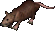
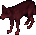
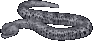

# Barracoon the Piper

When Barracoon is defeated, it rewards [Champion Tokens](../../game-mechanics/currencies.md#champion-tokens) along with one of the six skulls needed to activate the [Harrower](harrower.md).

## Location

The Barracoon altar is found on the fourth level of the [Despise](../dungeons/despise.md) dungeon.

## Activation

A champ spawn can be activated by using the [Valor virtue](../../game-mechanics/character/virtues.md#valor), but it can also start just by walking near the altar, since there's a random chance the champ will activate on its own.

## Vermin Horde Spawn

Once the altar is active, the first wave of monsters begins. Each champion spawn progresses through four tiers, and clearing all four will summon the champion boss.

|                          Tier 1                          |                                                  |
|:--------------------------------------------------------:|:------------------------------------------------:|
|  Giant Rat |  Slime |

|                       Tier 2                       |                                                          |
|:--------------------------------------------------:|:--------------------------------------------------------:|
|  Ratman |  Dire Wolf |

|                            Tier 3                            |                                                            |
|:------------------------------------------------------------:|:----------------------------------------------------------:|
|  Ratman Mage |  Hell Hound |

|                              Tier 4                              |                                                                    |
|:----------------------------------------------------------------:|:------------------------------------------------------------------:|
|  Ratman Archer |  Silver Serpent |
