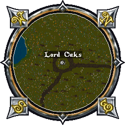

# Lord Oaks

When both Lord Oaks and Silvani are defeated, it rewards [Champion Tokens](../../game-mechanics/currencies.md#champion-tokens) along with one of the six skulls needed to activate the [Harrower](harrower.md).

## Silvani

Silvani spawns alongside Lord Oaks.

## Location

The Lord Oaks altar can be found near Yew at these coordinates 534, 991

## Activation

A champ spawn can be activated by using the [Valor virtue](../../game-mechanics/character/virtues.md#valor), but it can also start just by walking near the altar, since there's a random chance the champ will activate on its own.

## Forest Lord Spawn

Once the altar is active, the first wave of monsters begins. Each champion spawn progresses through four tiers, and clearing all four will summon the champion boss.

|                      Tier 1                      |                                                              |
|:------------------------------------------------:|:------------------------------------------------------------:|
|  Pixie |  Shadow Wisp |

|                       Tier 2                       |                                                |
|:--------------------------------------------------:|:----------------------------------------------:|
|  Ki-rin |  Wisp |

|                        Tier 3                        |                                                      |
|:----------------------------------------------------:|:----------------------------------------------------:|
|  Centaur |  Unicorn |

|                                  Tier 4                                  |                                                                        |
|:------------------------------------------------------------------------:|:----------------------------------------------------------------------:|
|  Serpentine Dragon |  Ethereal Warrior |
