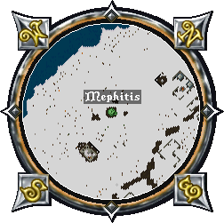

# Mephitis

When Mephitis is defeated, it rewards [Champion Tokens](../../game-mechanics/currencies.md#champion-tokens) along with one of the six skulls needed to activate the [Harrower](harrower.md).

## Location

The Mephitis altar can be found near New Minoc at these coordinates 2455, 485

## Activation

A champ spawn can be activated by using the [Valor virtue](../../game-mechanics/character/virtues.md#valor), but it can also start just by walking near the altar, since there's a random chance the champ will activate on its own.

## Arachnid Spawn

Once the altar is active, the first wave of monsters begins. Each champion spawn progresses through four tiers, and clearing all four will summon the champion boss.

|                         Tier 1                         |                                                                |
|:------------------------------------------------------:|:--------------------------------------------------------------:|
|  Scorpion |  Giant Spider |

|                                 Tier 2                                 |                                                                    |
|:----------------------------------------------------------------------:|:------------------------------------------------------------------:|
|  Terathan Warrior |  Terathan Drone |

|                                   Tier 3                                   |                                                                |
|:--------------------------------------------------------------------------:|:--------------------------------------------------------------:|
|  Terathan Matriarch |  Dread Spider |

|                                 Tier 4                                 |                                                                        |
|:----------------------------------------------------------------------:|:----------------------------------------------------------------------:|
|  Terathan Avenger |  Poison Elemental |
