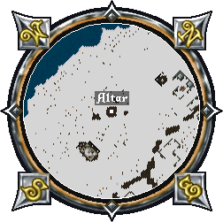

# Minoc altar

When this altar is activated, it selects a random Champion spawn.

Except [Oaks](lord-oaks.md), as he can only be summoned from his own altar.

## Location

Coordinates 2455, 485.

## Activation

A champ spawn can be activated by using the [Valor virtue](../../game-mechanics/character/virtues.md#valor), but it can also start just by walking near the altar, since there's a random chance the champ will activate on its own.
