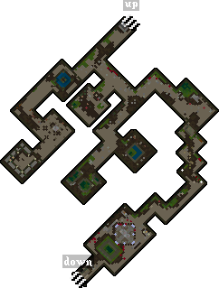

# Neira the Necromancer

When Neira is defeated, it rewards [Champion Tokens](../../game-mechanics/currencies.md#champion-tokens) and the Skull of Death.

Each champion rewards a different skull, all six are required to summon [The Harrower](the-harrower.md).

## Location

The Neira altar can be found on the third level of the [Deceit](../dungeons/deceit.md) dungeon.

## Activation

A champ spawn can be activated by using the [Valor virtue](../../game-mechanics/character/virtues.md#valor), but it can also start just by walking near the altar, since there's a random chance the champ will activate on its own.

## Unholy Terror Spawn

Once the altar is active, the first wave of monsters begins. Each champion spawn progresses through four tiers, and clearing all four will summon the champion boss.

|                      Tier 1                      |                                                  |                                                      |                                                    |
|:------------------------------------------------:|:------------------------------------------------:|:----------------------------------------------------:|:--------------------------------------------------:|
|  Ghoul |  Shade |  Spectre |  Wraith |

|                          Tier 2                          |                                                                  |                                                  |
|:--------------------------------------------------------:|:----------------------------------------------------------------:|:------------------------------------------------:|
|  Bone Mage |  Skeletal Mage |  Mummy |

|                     Tier 3                     |                                                              |                                                                      |
|:----------------------------------------------:|:------------------------------------------------------------:|:--------------------------------------------------------------------:|
|  Lich |  Bone Knight |  Skeletal Knight |

|                          Tier 4                          |                                                                    |
|:--------------------------------------------------------:|:------------------------------------------------------------------:|
|  Lich Lord |  Rotting Corpse |
