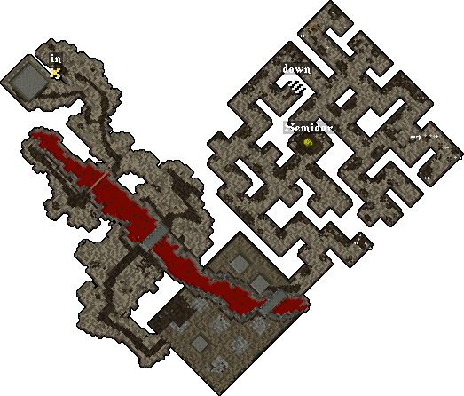

# Semidar

When Semidar is defeated, it rewards [Champion Tokens](../../game-mechanics/currencies.md#champion-tokens) and the Skull of Pain.

Each champion rewards a different skull, all six are required to summon [The Harrower](the-harrower.md).

## Location

The Semidar altar can be found on the first level of the [Fire](../dungeons/fire.md) dungeon.

## Activation

A champ spawn can be activated by using the [Valor virtue](../../game-mechanics/character/virtues.md#valor), but it can also start just by walking near the altar, since there's a random chance the champ will activate on its own.

## Abyss Spawn

Once the altar is active, the first wave of monsters begins. Each champion spawn progresses through four tiers, and clearing all four will summon the champion boss.

|                    Tier 1                    |                                                      |
|:--------------------------------------------:|:----------------------------------------------------:|
|  Imp |  Mongbat |

|                         Tier 2                         |                                                  |
|:------------------------------------------------------:|:------------------------------------------------:|
|  Gargoyle |  Harpy |

|                              Tier 3                              |                                                                    |
|:----------------------------------------------------------------:|:------------------------------------------------------------------:|
|  Fire Gargoyle |  Stone Gargoyle |

|                       Tier 4                       |                                                        |
|:--------------------------------------------------:|:------------------------------------------------------:|
|  Daemon |  Succubus |
