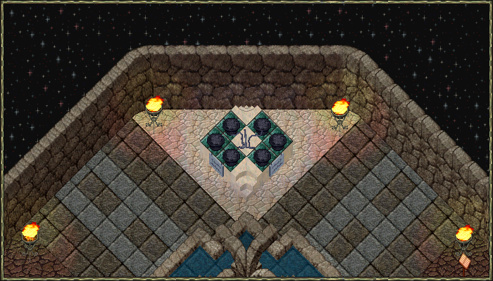
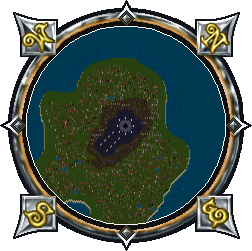

# The Harrower

{ .center-img }

The Harrower is summoned by placing all six champion skulls onto their respective altars in the Star Room.

After placing the final skull, a scroll will appear in your backpack. Using the scroll opens a gate that reveals The Harrower location.

The Harrower will spawn in a random dungeon.

## Skulls

|                                Skull                                 | Champion  |
|:--------------------------------------------------------------------:|:---------:|
|   Skull of Greed   | Barracoon |
|  Skull of Enlightenment | Lord Oaks |
|    Skull of Venom   | Mephitis  |
|     Skull of Death     |   Neira   |
|    Skull of Power    |  Rikktor  |
|     Skull of Pain    |  Semidar  |

## Star Room

The Star Room can be reached on Temple Island at these coordinates 2494, 3576.

## Harrower

After defeating The Harrower, the True Harrower and its tentacles will spawn.

## True Harrower

The True Harrower and its tentacles can't move.

The True Harrower has the ability to teleport you to its location.

### Tentacles of the Harrower

The Tentacles of the Harrower can life leech if you get too close, draining your health and restoring their own.
