# Despise

## Dungeon Dye

Monsters inside a dungeon have a rare chance to drop a [Dungeon Dye Material](../../custom-systems/dungeon-dyes.md), each dungeon has its own dye.

| Dye Material | Dye Name   | Hue                               |
|--------------|------------|-----------------------------------|
| Thorny Vine  | Envy Green | [2163](../../hues/hue.md?id=2163) |

## Entrance

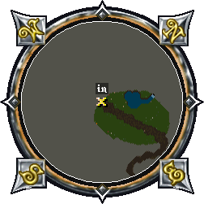

Coordinates 1298, 1081.

## Level 1

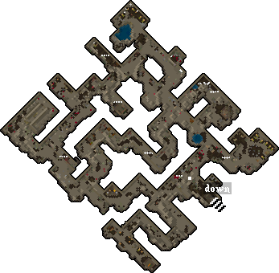

|                           Mobs                           |                                                                  |                                                                |                                                              |
|:--------------------------------------------------------:|:----------------------------------------------------------------:|:--------------------------------------------------------------:|:------------------------------------------------------------:|
|  Lizardman |        Brigand       |  Giant Spider |  Giant Snake |
|     Ratman    | 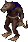 Ratman Archer |  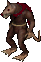 Ratman Mage  |                                                              |

## Level 2

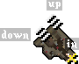

Level 2 is the actual entrance. Going up takes you to Level 1, and going down takes you to Level 3.

## Level 3

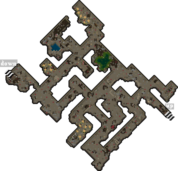

|                       Mobs                       |                                                  |                                                                      |                                                                |                                                  |
|:------------------------------------------------:|:------------------------------------------------:|:--------------------------------------------------------------------:|:--------------------------------------------------------------:|:------------------------------------------------:|
| 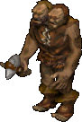 Ettin |  Troll |  Earth Elemental |  Giant Spider |  Slime |

## Level 4

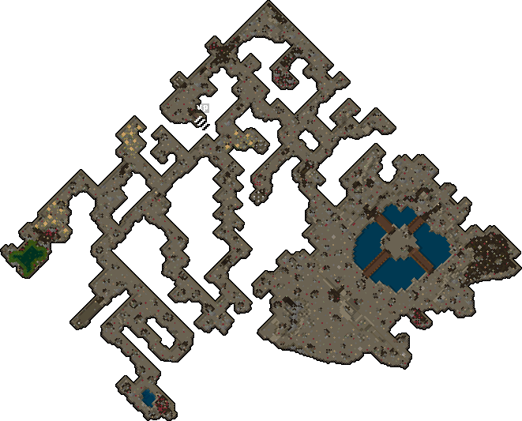

|                        Mobs                        |                                                                  |                                                              |                                                  |                                                                    |
|:--------------------------------------------------:|:----------------------------------------------------------------:|:------------------------------------------------------------:|:------------------------------------------------:|:------------------------------------------------------------------:|
|   Ettin  |          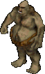 Ogre          |    Ogre Lord   |  Troll | 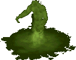 Acid Elemental |
|  Ratman |  Ratman Archer |  Ratman Mage |  Slime |                                                                    |

### Barracoon

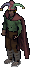

Despise is the home of the [Barracoon](../champions/barracoon.md) champion.
