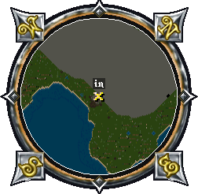
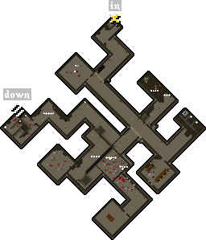
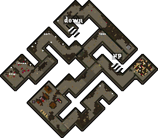
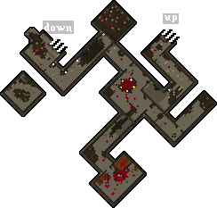
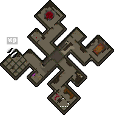
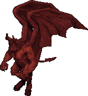

# Hythloth

## Entrance

Coordinates 4722, 3815

## Level 1

|                          Mobs                          |                                                                    |                                                                  |
|:------------------------------------------------------:|:------------------------------------------------------------------:|:----------------------------------------------------------------:|
|  Gargoyle |  Stone Gargoyle |  Fire Gargoyle |
|       Imp      |      Hell Hound     |                                                                  |

## Level 2

|                        Mobs                        |                                                              |                                                          |                                                                    |
|:--------------------------------------------------:|:------------------------------------------------------------:|:--------------------------------------------------------:|:------------------------------------------------------------------:|
|  Daemon |     Gargoyle    |  Evil Mage |  Evil Mage Lord |
|     Imp    |  Gazer Larva |      Gazer     |      Hell Hound     |

## Level 3

|                               Mobs                               |                                                        |                                                              |                                                                    |
|:----------------------------------------------------------------:|:------------------------------------------------------:|:------------------------------------------------------------:|:------------------------------------------------------------------:|
|         Balron        |    Daemon   |     Gargoyle    |  Stone Gargoyle |
|  Fire Gargoyle |  Succubus |          Imp         |     Giant Snake    |
|    Gazer Larva   |     Gazer    |  Elder Gazer |                                                                    |

## Level 4

|                                    Mobs                                    |                                                                          |                                                                          |                                                                  |
|:--------------------------------------------------------------------------:|:------------------------------------------------------------------------:|:------------------------------------------------------------------------:|:----------------------------------------------------------------:|
|              Daemon             |        Fire Daemon       |       Chaos Daemon      |  Arcane Daemon |
|  Gargoyle Destroyer |  Gargoyle Enforcer |  Enslaved Gargoyle |  Fire Gargoyle |
